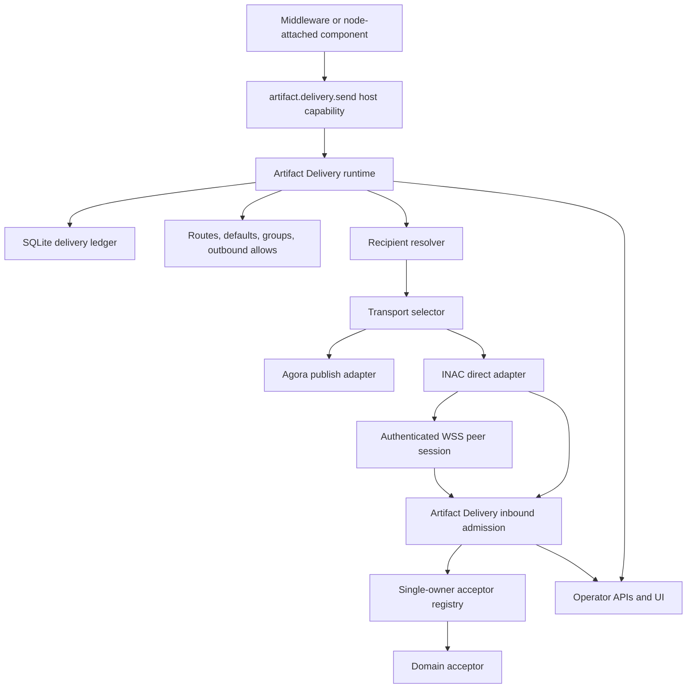

# Artifact Delivery FAQ

## What is Artifact Delivery?

Artifact Delivery is the host-owned delivery and inbound admission plane for
schema-bound artifacts. A component submits one `artifact-delivery-envelope.v1`
request to the host capability `artifact.delivery.send`; the host validates the
envelope, checks outbound permissions, expands the delivery plan, resolves
recipients, selects concrete transport adapters, executes the transport, records
the result, and exposes status to the operator.

The important boundary is that components express delivery intent, not transport
mechanics. A middleware component does not need to know whether a public artifact
should be published through Agora, whether a private artifact should travel
through INAC over an authenticated WSS peer session, or whether a future mailbox
adapter is available. The daemon owns that routing and records the resulting
delivery in the Artifact Delivery ledger.

Artifact Delivery also owns inbound admission. Artifacts arriving from transport
adapters enter one shared admission path, where the host checks byte identity,
source-adapter policy, idempotency, and the single-owner acceptor registry. A
given artifact schema/content-type class is accepted by at most one
authoritative acceptor. If a domain needs fan-out, that domain acceptor must own
the fan-out behind its own contract.

Data is transformed in a deliberately staged way. On egress, component-local JSON
is first normalized into a delivery envelope, then into an expanded dispatch plan,
then into adapter-specific transport requests. On ingress, transport frames such
as `inac-control.v1` are converted into an inbound admission request, then into
one domain acceptor invocation. The artifact bytes are expected to remain
byte-identical across those transformations.



## What is the rationale behind Artifact Delivery?

Artifact Delivery exists to avoid making every component a transport owner. INAC,
Agora, peer sessions, retry loops, route tables, and inbound admission are host
concerns; a component should not duplicate that machinery just to move one
artifact.

The layer also keeps authority visible. A valid artifact schema is not enough to
send an artifact. The sending component must have an explicit outbound allow for
the artifact schema, route references, selector classes, target node ids, size
limits, fan-out limits, and fallback limits that apply to the resolved plan.

The inbound side has a similar discipline. Inbound artifacts are admitted through
a single shared path and dispatched to exactly one authoritative acceptor. This
prevents middleware-chain ambiguity: the same artifact should not be silently
accepted by several unrelated modules that each interpret it differently.

Artifact Delivery is also a stratification boundary. INAC remains the
private/direct node-to-node transport adapter under AD, Agora remains the
public/federated record substrate, and Memarium remains local custody. AD does
not replace those components; it coordinates the host-owned movement and
admission of artifacts between them.

## What components use Artifact Delivery?

- `node/artifact-delivery-core` provides the pure contract layer: envelope DTOs,
  plan validation, route expansion, recipient resolution, target deduplication,
  outbound authorization, deterministic delivery ids, and failure classes.
- `node/artifact-delivery` provides the runtime layer: adapter registry,
  referenced payload resolution, synchronous submit, deferred submit, delivery
  ledger, recovery, inbound admission registry, and admission ledger.
- The daemon exposes `POST /v1/host/capabilities/artifact.delivery.send`,
  `GET /v1/artifact-delivery/routes`,
  `GET /v1/artifact-delivery/deliveries`,
  per-delivery status lookup, `POST /v1/artifact-delivery/recover`,
  `POST /v1/artifact-delivery/admissions`, and admission status lookup.
- The daemon registers the `agora-default` publish adapter for signed
  `agora-record.v1` artifacts.
- The daemon registers the `inac-direct` adapter for local INAC short-circuit
  delivery and remote INAC delivery over authenticated WSS peer-message sessions.
- Remote WSS INAC `push` frames feed Artifact Delivery inbound admission on the
  receiver.
- Supervised HTTP middleware, `ad-host` in-process acceptors, and explicitly
  configured pure JSON-e Flow acceptors can receive inbound artifacts through
  the acceptor registry. The daemon supplies effect shims, but does not own the
  AD acceptor implementations.
- Node UI exposes `/admin/artifact-delivery` for route, adapter, recovery,
  delivery, and admission visibility.

## How can middleware use Artifact Delivery?

Middleware can use Artifact Delivery in two directions: outbound send and inbound
acceptance. Outbound send means the middleware calls the host capability
`artifact.delivery.send` with an `artifact-delivery-envelope.v1`. Inbound
acceptance means the host calls a registered acceptor after an artifact arrives
from a transport adapter and passes admission checks.

Outbound use always requires the caller to be an authenticated middleware module:
the daemon checks that `component/id` in the envelope matches the authenticated
module id. The runtime then checks the host-level outbound allow table. Inbound
use is configured by the operator through `artifact_delivery_acceptors`; the
current implementation does not infer Artifact Delivery acceptors directly from a
module report.

### Built-in Rust middleware

Built-in Rust components can be wired directly by the host when the behavior is
host-owned and deserves to live in the trusted process. For outbound delivery,
host-composed Rust code can build a `DeliveryEnvelope` and call the runtime or
the same host-capability path used by middleware. For inbound delivery, `ad-host`
builds in-process acceptors from `artifact_delivery_acceptors.in_process`; the
daemon supplies only concrete effect shims such as local INAC admission,
Memarium custody, contact-request persistence/notification, and middleware
surface calls.

The currently supported in-process acceptor invoke target is `inac.push`. It is
used to feed admitted artifacts into the local INAC runtime without going through
loopback HTTP.

```json
{
  "artifact_delivery_acceptors": {
    "in_process": [
      {
        "acceptor_id": "acceptor.inac.push",
        "artifact_schema": "agora-record.v1",
        "content_type": "application/json",
        "invoke": "inac.push"
      }
    ]
  }
}
```

### Supervised HTTP middleware

Supervised HTTP middleware can send artifacts by calling the daemon host
capability endpoint with its normal module capability authentication. It submits
one envelope and receives either `artifact-delivery-result.v1` or, when using
`?mode=deferred`, `deferred-operation.v1`.

```http
POST /v1/host/capabilities/artifact.delivery.send HTTP/1.1
Content-Type: application/json
```

```json
{
  "schema": "artifact-delivery-envelope.v1",
  "component/id": "story005-whisper",
  "artifact": {
    "schema": "agora-record.v1",
    "content/type": "application/json",
    "digest": "sha256:EXAMPLE_DIGEST",
    "size/bytes": 512,
    "bytes/base64": "eyJzY2hlbWEiOiJhZ29yYS1yZWNvcmQudjEifQ=="
  },
  "delivery/plan": {
    "route/ref": "public-agora"
  },
  "idempotency/key": "whisper:candidate:example"
}
```

Supervised HTTP middleware can also be an inbound acceptor. The operator registers
the acceptor in host config, and the daemon calls the component-local
`invoke_path` with an `artifact-delivery-acceptor-invoke.v1` payload.

```json
{
  "artifact_delivery_acceptors": {
    "supervised_http": [
      {
        "acceptor_id": "acceptor.whisper.private",
        "component_id": "component/middleware/whisper",
        "artifact_schema": "agora-record.v1",
        "content_type": "application/json",
        "invoke_path": "/v1/artifact-delivery/accept",
        "request_timeout_ms": 5000,
        "max_response_bytes": 65536
      }
    ]
  }
}
```

### Sensorium OS Actions

Sensorium OS Actions are not Artifact Delivery acceptors by themselves. They are
actions behind the Sensorium OS connector, so the recommended current pattern is
to let a role flow or supervised middleware call Sensorium, receive the action
result, build an artifact envelope, and then call `artifact.delivery.send`.

This keeps the OS action focused on local sensing or execution while the host
keeps delivery, authorization, route selection, and retry semantics. In the
hard-MVP runtime, `sensorium-os` only executes script-backed C1/C2 entries from
the authorized catalog. Artifact-producing, filesystem-write, network-egress,
composed, or operator-gated action classes remain visible but unavailable and
fail closed until their enforcement envelopes exist. If an available action
returns deliverable content, return bounded JSON or bytes to its caller; the
caller should wrap that output in a schema-bound artifact and use AD.

```text
JSON-e Flow or supervised role middleware
  -> sensorium.directive.invoke
  -> normalize action result
  -> artifact.delivery.send
```

### JSON-e Flows

JSON-e Flow middleware can use Artifact Delivery outbound by listing
`artifact.delivery.send` in `allowed_calls` and using a host-capability call step
that renders an `artifact-delivery-envelope.v1`. This is useful for bounded
low-code adapters that need to publish or transfer an artifact after rendering a
small JSON value.

```json
{
  "id": "example.artifact.sender",
  "module_id": "example-artifact-sender",
  "component_id": "example-artifact-sender",
  "profile_version": "orbiplex.json_e_flow.v1",
  "allowed_calls": ["artifact.delivery.send"],
  "steps": [
    {
      "id": "send",
      "kind": "call",
      "capability": "artifact.delivery.send",
      "input": {
        "schema": "artifact-delivery-envelope.v1",
        "component/id": "example-artifact-sender",
        "artifact": "${artifact}",
        "delivery/plan": { "route/ref": "public-agora" }
      }
    }
  ]
}
```

JSON-e Flow can also serve as an inbound acceptor, but this acceptor mode is
intentionally pure. The configured flow must have a `respond` step that yields an
`InboundAdmissionResult`, and it must not declare host capability calls. The host
compiles this flow once at daemon startup and invokes it inside the admission
boundary.

```json
{
  "artifact_delivery_acceptors": {
    "json_e_flow": [
      {
        "acceptor_id": "acceptor.json-e-flow.whisper",
        "artifact_schema": "agora-record.v1",
        "content_type": "application/json",
        "flow_id": "whisper.private.acceptor"
      }
    ]
  }
}
```

## How is Artifact Delivery configured?

Artifact Delivery configuration is host-owned. A package may ship suggested
configuration fragments, but the effective authority comes from daemon config
that the operator accepts.

### Host-level configuration

`artifact_delivery` is the core delivery policy and route table.

- `defaults` define named recipient selectors that can be referenced from plans.
- `groups` define named sets of recipient selectors.
- `routes` define named delivery plans with `route/id`, optional
  `route/version`, and an inline `plan`.
- `outbound/allows` define which component may send which artifact schema and
  through which selector classes, route refs, target node ids, fan-out size,
  fallback count, and maximum bytes.

`artifact_delivery_adapters` configures concrete AD adapter behavior.

- `agora_publish.endpoint` optionally overrides the local Agora service endpoint.
- `agora_publish.auth_header` optionally overrides the auth header name.
- `agora_publish.auth_token_file` optionally points to the token used by the
  Agora publish adapter.

`inac_peer_transport` configures receiver-side remote WSS INAC transport policy.

- `inac_peer_transport.enabled` controls whether remote WSS INAC transport can
  be used by `inac-direct` targets.
- `inac_peer_transport.inbound_allowed_peers` is the receiver-side allowlist for
  remote WSS INAC Artifact Delivery frames. Empty means deny-all.
- `inac_peer_transport.contact_requests` is a schema-scoped public
  `contact-request.v1` admission policy. Fresh service/headless configs keep it
  disabled with `unknown_peer_mode = "deny"`; user-mode config materialization
  explicitly enables the narrow `auto-admit` contact-request flow.
- `inac_peer_transport.response_timeout_ms` bounds the wait for a peer response.

`artifact_delivery_recovery` configures deferred delivery recovery.

- `enabled` defaults to `true`.
- `interval_ms` is the idle interval between background recovery passes.
- `batch_limit` caps the number of recoverable deliveries processed in one pass.
- `pass_deadline_ms` caps one recovery pass.

`artifact_delivery_acceptors` configures inbound admission.

- `http_admission_allowed_source_adapters` allows selected source adapters to use
  `POST /v1/artifact-delivery/admissions`; empty means deny-all for that HTTP
  control-plane path.
- `supervised_http` registers loopback HTTP middleware acceptors.
- `json_e_flow` registers pure JSON-e Flow acceptors.
- `in_process` registers `ad-host` built acceptors such as `inac.push`,
  `agora-record.ingest`, `memarium-blob.accept`, and
  `contact-request.receive`; daemon-owned code supplies only the effect shims.

The runtime also creates host-owned storage under the node data directory:
`storage/artifact-delivery.sqlite` for the delivery ledger and
`storage/artifact-store` for the initial `artifact-store:` referenced payload
resolver.

### Package-level configuration

There is no separate Artifact Delivery package-level authority contract in the
current implementation. A middleware package can ship config fragments,
templates, examples, or operator instructions, but outbound allows, routes,
adapters, recovery policy, and acceptor registrations become effective only when
they are present in the daemon's effective host configuration.

This is intentional: package installation should not silently grant artifact
send authority or inbound acceptance authority.

### Envelope-level configuration

The envelope controls only the delivery request, not the host's authority model.

- `component/id` names the caller and must match the authenticated middleware
  module id on the host-capability path.
- `artifact` declares `schema`, `content/type`, `digest`, `size/bytes`, and
  exactly one payload location: inline `bytes/base64` or `artifact/ref`.
- `delivery/plan` contains either `route/ref` or inline `stages`, but not both.
- A stage contains `stage/id`, targets, optional `success/policy`, optional
  `quorum/min-success`, and optional `on/failure`.
- Recipient selectors currently include `node`, `configured-default`, `group`,
  `agora-default`, `capability-first`, and `capability-many`.
- `policy` can carry `privacy`, `delivery`, and `timeout/ms`. The runtime records
  and validates the shape, but full generic enforcement is still route-,
  adapter-, or acceptor-specific.
- `idempotency/key` lets the runtime treat repeated submissions as the same
  delivery intent.

Deferred mode is not an envelope field. It is selected by calling
`POST /v1/host/capabilities/artifact.delivery.send?mode=deferred`.

## What data shapes are used by Artifact Delivery?

- [`artifact-delivery-envelope.v1`](../../schemas-gen/schemas/artifact-delivery-envelope.v1.md)
  is the component-facing host capability request. It carries one artifact, one
  delivery plan, optional policy, and optional idempotency key.
- [`artifact-delivery-result.v1`](../../schemas-gen/schemas/artifact-delivery-result.v1.md)
  is the synchronous response returned after the runtime accepts and attempts a
  delivery.
- [`artifact-delivery-status.v1`](../../schemas-gen/schemas/artifact-delivery-status.v1.md)
  is the operator/export shape for one recorded delivery run.
- [`artifact-delivery-recovery.v1`](../../schemas-gen/schemas/artifact-delivery-recovery.v1.md)
  is the operator response after a manual recovery pass.
- [`deferred-operation.v1`](../../schemas-gen/schemas/deferred-operation.v1.md)
  is returned when the caller uses `?mode=deferred`.
- [`deferred-operation-status.v1`](../../schemas-gen/schemas/deferred-operation-status.v1.md)
  is exposed at the canonical per-delivery operation-status URL.
- [`inac-control.v1`](../../schemas-gen/schemas/inac-control.v1.md)
  is the transport control frame used by INAC for `offer`, `request`, `push`, and
  response/refusal operations.
- [`agora-record.v1`](../../schemas-gen/schemas/agora-record.v1.md)
  is the signed record format accepted by the Agora publish adapter.
- [`memarium-blob.v1`](../../schemas-gen/schemas/memarium-blob.v1.md)
  is a signed content-addressed artifact envelope that can be moved through AD
  and INAC paths.

The daemon also uses daemon-local admission shapes:
`artifact-delivery-admission-request.v1`,
`artifact-delivery-admission-response.v1`, and
`artifact-delivery-acceptor-invoke.v1`. They are implementation contracts of the
current daemon admission surface; they are not yet the primary public
component-facing schema family.

## How does Artifact Delivery decide routing?

Routing starts from `delivery/plan`. If the plan contains `route/ref`, the host
loads the named route from `artifact_delivery.routes`. If the plan contains
inline stages, the host validates and expands those stages directly.

Each stage contains recipient selectors. The resolver turns those selectors into
concrete targets:

- `agora-default` resolves to the Agora publish adapter.
- `node` resolves to an `inac-direct` target for that node id.
- `configured-default` resolves through `artifact_delivery.defaults`.
- `group` expands through `artifact_delivery.groups`.
- `capability-first` and `capability-many` are part of the envelope vocabulary;
  complete capability-based resolution remains a later resolver layer.

After resolution, the runtime deduplicates concrete targets and checks outbound
authorization for the calling component. It verifies the artifact schema,
optional route ref allowlist, selector class allowlist, target node id allowlist,
maximum byte size, maximum target count, and maximum fallback stage count.

Transport selection is then exact: a resolved target carries an adapter scheme,
and the runtime invokes the registered adapter for that scheme. The current
production adapter schemes are Agora publish and INAC direct. The stage success
policy (`all`, `any`, or `quorum`) decides whether a stage succeeded. If it
fails and `on/failure` points to another stage, the runtime follows that
fallback stage.

On the receiving side, incoming transport frames do not bypass AD. Remote WSS
INAC frames must pass the receiver-side INAC peer allowlist first, then feed the
shared Artifact Delivery admission path. Admission chooses exactly one acceptor
by artifact schema and optional content type; exact content-type registrations
win over wildcard registrations.

## Sequential examples

### Public Whisper publication through Agora

1. A middleware component builds a signed `agora-record.v1` artifact. Artifact
   Delivery does not sign it.
2. The component calls `artifact.delivery.send` with an
   `artifact-delivery-envelope.v1`.
3. The envelope uses `delivery/plan.route/ref`, for example `public-agora`.
4. The daemon validates the envelope through schema-gate.
5. The daemon checks that `component/id` matches the authenticated middleware
   module id.
6. Artifact Delivery expands the route and resolves it to the Agora publish
   adapter.
7. Artifact Delivery checks the component's outbound allow for
   `agora-record.v1`, the route ref, selector class, limits, and artifact size.
8. The Agora publish adapter verifies that the inline bytes are JSON with
   `schema = "agora-record.v1"` and a `topic/key`.
9. The adapter posts the record to the configured local Agora service.
10. Artifact Delivery records the delivery id, stage outcomes, status, and any
    diagnostic data in the delivery ledger.

### Private direct delivery through INAC

1. Node A middleware builds a signed byte-identical artifact, for example a
   private `agora-record.v1`.
2. The middleware calls `artifact.delivery.send` with a plan that resolves to a
   target node.
3. Artifact Delivery resolves the target to the `inac-direct` adapter.
4. If the target is the local node, the adapter short-circuits into the local
   INAC runtime.
5. If the target is remote, the adapter requires inline artifact bytes and an
   authenticated WSS peer session to that node.
6. The adapter wraps the artifact in an `inac-control.v1` `push` frame and sends
   it as peer message `msg = "inac.v1"`.
7. Node B receives the peer message and checks
   `inac_peer_transport.inbound_allowed_peers`.
8. If the peer is allowed, Node B converts the frame into an Artifact Delivery
   inbound admission request.
9. Admission checks byte identity, idempotency, and acceptor availability.
10. The selected acceptor receives the artifact; AD records the admission result
    on the receiver.

### Inbound supervised HTTP acceptor

1. The operator configures a supervised HTTP acceptor for one artifact schema and
   optional content type.
2. A transport adapter feeds an inbound artifact into Artifact Delivery
   admission.
3. Admission finds the exact acceptor or a wildcard fallback for the schema.
4. The daemon builds an `artifact-delivery-acceptor-invoke.v1` payload containing
   source adapter, optional source peer, idempotency key, and artifact descriptor.
5. The daemon POSTs that payload to the component-local `invoke_path`.
6. The acceptor returns an `InboundAdmissionResult`.
7. Artifact Delivery records the receiver-local admission id and status.

### Deferred delivery and recovery

1. A middleware component calls
   `POST /v1/host/capabilities/artifact.delivery.send?mode=deferred`.
2. The daemon validates and persists the delivery intent.
3. The daemon returns `deferred-operation.v1` with a stable operation id and
   status URL.
4. The background recovery worker periodically retries recoverable deliveries
   according to `artifact_delivery_recovery`.
5. An operator can also call `POST /v1/artifact-delivery/recover?limit={n}` to
   run one manual recovery pass.
6. The delivery can be inspected through
   `/v1/artifact-delivery/deliveries/{delivery-id}` and
   `/v1/artifact-delivery/deliveries/{delivery-id}/operation-status`.
