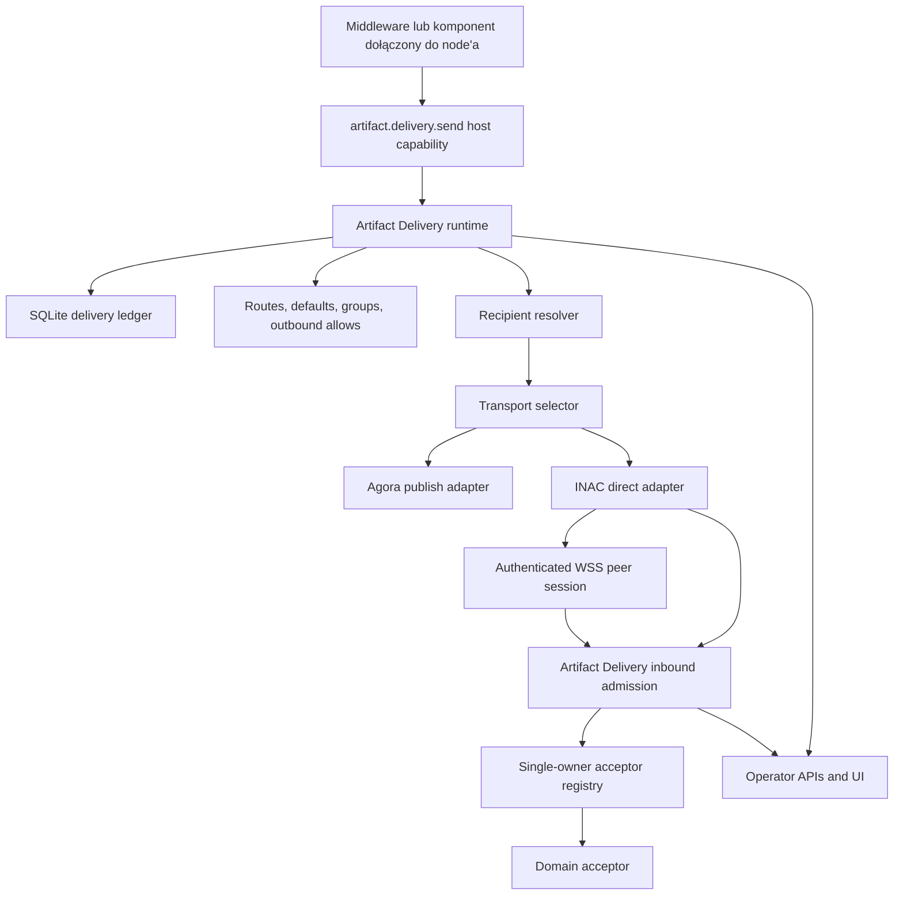

# Artifact Delivery FAQ

## Czym jest Artifact Delivery?

Artifact Delivery to zarządzana przez hosta płaszczyzna dostarczania i
przyjmowania artefaktów związanych ze schematami. Komponent wysyła jedno żądanie
`artifact-delivery-envelope.v1` do host capability `artifact.delivery.send`;
host waliduje kopertę, sprawdza uprawnienia wychodzące, rozwija plan
dostarczenia, rozwiązuje odbiorców, wybiera konkretne adaptery transportowe,
wykonuje transport, zapisuje wynik i udostępnia status operatorowi.

Ważna granica polega na tym, że komponenty wyrażają intencję dostarczenia, a nie
mechanikę transportu. Komponent middleware nie musi wiedzieć, czy publiczny
artefakt powinien zostać opublikowany przez Agorę, czy prywatny artefakt powinien
przejść przez INAC po uwierzytelnionej sesji WSS peer, ani czy dostępny jest
przyszły adapter skrzynki pocztowej. Daemon jest właścicielem tego routingu i
zapisuje wynikające z niego dostarczenie w ledgerze Artifact Delivery.

Artifact Delivery jest także właścicielem przyjmowania przychodzących artefaktów.
Artefakty przychodzące z adapterów transportowych trafiają do jednej wspólnej
ścieżki admission, w której host sprawdza tożsamość bajtową, politykę adaptera
źródłowego, idempotencję i rejestr acceptorów z pojedynczym właścicielem. Dana
klasa `artifact schema` / `content-type` jest przyjmowana przez co najwyżej jeden
autorytatywny acceptor. Jeżeli domena potrzebuje fan-outu, to acceptor tej domeny
musi być właścicielem fan-outu za swoim własnym kontraktem.

Dane są przekształcane w celowo etapowy sposób. Na wyjściu lokalny JSON
komponentu jest najpierw normalizowany do koperty dostarczenia, potem do
rozwiniętego planu dispatchu, a następnie do żądań transportowych właściwych dla
adaptera. Na wejściu ramki transportowe takie jak `inac-control.v1` są zamieniane
na żądanie inbound admission, a potem na jedno wywołanie acceptora domenowego.
Oczekujemy, że bajty artefaktu pozostaną byte-identical przez te transformacje.



## Jakie uzasadnienie stoi za Artifact Delivery?

Artifact Delivery istnieje po to, aby nie robić z każdego komponentu właściciela
transportu. INAC, Agora, sesje peer, pętle retry, tabele routingu i inbound
admission są sprawami hosta; komponent nie powinien duplikować tej maszynerii
tylko po to, żeby przenieść jeden artefakt.

Ta warstwa utrzymuje też widoczność autoryzacji. Poprawny schemat artefaktu nie
wystarcza do jego wysłania. Komponent wysyłający musi mieć jawne outbound allow
dla schematu artefaktu, referencji tras, klas selektorów, docelowych node id,
limitów rozmiaru, limitów fan-outu oraz limitów fallbacku odnoszących się do
rozwiązanego planu.

Strona przychodząca ma podobną dyscyplinę. Przychodzące artefakty są przyjmowane
przez jedną wspólną ścieżkę i kierowane do dokładnie jednego autorytatywnego
acceptora. Chroni to przed niejednoznacznością łańcucha middleware: ten sam
artefakt nie powinien być po cichu przyjmowany przez kilka niezwiązanych modułów,
z których każdy interpretuje go inaczej.

Artifact Delivery jest także granicą stratyfikacji. INAC pozostaje prywatnym /
bezpośrednim adapterem transportu node-to-node pod AD, Agora pozostaje publicznym
/ federacyjnym substratem rekordów, a Memarium pozostaje lokalną opieką nad
danymi. AD nie zastępuje tych komponentów; koordynuje zarządzany przez hosta ruch
i przyjmowanie artefaktów między nimi.

## Jakie komponenty używają Artifact Delivery?

- `node/artifact-delivery-core` dostarcza czystą warstwę kontraktów: DTO koperty,
  walidację planu, rozwijanie tras, rozwiązywanie odbiorców, deduplikację celów,
  autoryzację wychodzącą, deterministyczne identyfikatory dostarczeń i klasy
  błędów.
- `node/artifact-delivery` dostarcza warstwę runtime: rejestr adapterów,
  rozwiązywanie payloadów referencyjnych, submit synchroniczny, submit
  deferred, delivery ledger, recovery, rejestr inbound admission i admission
  ledger.
- Daemon udostępnia `POST /v1/host/capabilities/artifact.delivery.send`,
  `GET /v1/artifact-delivery/routes`,
  `GET /v1/artifact-delivery/deliveries`, lookup statusu pojedynczego
  dostarczenia, `POST /v1/artifact-delivery/recover`,
  `POST /v1/artifact-delivery/admissions` oraz lookup statusu admission.
- Daemon rejestruje adapter publikacji `agora-default` dla podpisanych
  artefaktów `agora-record.v1`.
- Daemon rejestruje adapter `inac-direct` dla lokalnego short-circuit delivery
  INAC oraz zdalnego delivery INAC po uwierzytelnionych sesjach peer-message WSS.
- Zdalne ramki WSS INAC `push` zasilają Artifact Delivery inbound admission po
  stronie odbiorcy.
- Supervised HTTP middleware, in-process daemon acceptors oraz jawnie
  skonfigurowane czyste acceptory JSON-e Flow mogą przyjmować przychodzące
  artefakty przez rejestr acceptorów.
- Node UI udostępnia `/admin/artifact-delivery` jako widok operatora na trasy,
  adaptery, recovery, dostarczenia i admission.

## Jak middleware może używać Artifact Delivery?

Middleware może używać Artifact Delivery w dwóch kierunkach: outbound send oraz
inbound acceptance. Outbound send oznacza, że middleware wywołuje host capability
`artifact.delivery.send` z `artifact-delivery-envelope.v1`. Inbound acceptance
oznacza, że host wywołuje zarejestrowany acceptor po tym, jak artefakt przyjdzie
z adaptera transportowego i przejdzie sprawdzenia admission.

Użycie wychodzące zawsze wymaga, aby caller był uwierzytelnionym modułem
middleware: daemon sprawdza, że `component/id` w kopercie odpowiada
uwierzytelnionemu module id. Runtime sprawdza potem host-level outbound allow
table. Użycie przychodzące jest konfigurowane przez operatora przez
`artifact_delivery_acceptors`; obecna implementacja nie wyprowadza acceptorów
Artifact Delivery bezpośrednio z module report.

### Built-in Rust middleware

Wbudowane komponenty Rust mogą być spięte bezpośrednio przez daemon, gdy zachowanie
jest host-owned i zasługuje na życie w zaufanym procesie. Dla delivery
wychodzącego kod Rust komponowany przez daemon może zbudować `DeliveryEnvelope` i
wywołać runtime albo tę samą ścieżkę host capability, której używa middleware. Dla
delivery przychodzącego MVP obsługuje daemon-composed in-process acceptors przez
`artifact_delivery_acceptors.in_process`.

Obecnie obsługiwanym celem wywołania in-process acceptora jest `inac.push`. Służy
on do przekazania przyjętych artefaktów do lokalnego runtime INAC bez przechodzenia
przez loopback HTTP.

```json
{
  "artifact_delivery_acceptors": {
    "in_process": [
      {
        "acceptor_id": "acceptor.inac.push",
        "artifact_schema": "agora-record.v1",
        "content_type": "application/json",
        "invoke": "inac.push"
      }
    ]
  }
}
```

### Supervised HTTP middleware

Supervised HTTP middleware może wysyłać artefakty przez wywołanie endpointu host
capability daemona ze swoim normalnym uwierzytelnieniem module capability. Wysyła
jedną kopertę i otrzymuje albo `artifact-delivery-result.v1`, albo, przy użyciu
`?mode=deferred`, `deferred-operation.v1`.

```http
POST /v1/host/capabilities/artifact.delivery.send HTTP/1.1
Content-Type: application/json
```

```json
{
  "schema": "artifact-delivery-envelope.v1",
  "component/id": "story005-whisper",
  "artifact": {
    "schema": "agora-record.v1",
    "content/type": "application/json",
    "digest": "sha256:EXAMPLE_DIGEST",
    "size/bytes": 512,
    "bytes/base64": "eyJzY2hlbWEiOiJhZ29yYS1yZWNvcmQudjEifQ=="
  },
  "delivery/plan": {
    "route/ref": "public-agora"
  },
  "idempotency/key": "whisper:candidate:example"
}
```

Supervised HTTP middleware może być także inbound acceptorem. Operator rejestruje
acceptor w konfiguracji hosta, a daemon wywołuje komponentową, lokalną ścieżkę
`invoke_path` z payloadem `artifact-delivery-acceptor-invoke.v1`.

```json
{
  "artifact_delivery_acceptors": {
    "supervised_http": [
      {
        "acceptor_id": "acceptor.whisper.private",
        "component_id": "component/middleware/whisper",
        "artifact_schema": "agora-record.v1",
        "content_type": "application/json",
        "invoke_path": "/v1/artifact-delivery/accept",
        "request_timeout_ms": 5000,
        "max_response_bytes": 65536
      }
    ]
  }
}
```

### Sensorium OS Actions

Sensorium OS Actions nie są same z siebie acceptorami Artifact Delivery. Są
akcjami za konektorem Sensorium OS, dlatego obecnie rekomendowany wzorzec polega
na tym, że role flow albo supervised middleware wywołuje Sensorium, odbiera wynik
akcji, buduje kopertę artefaktu, a następnie wywołuje `artifact.delivery.send`.

Dzięki temu OS action pozostaje skupiona na lokalnym sensing albo wykonaniu, a
host zachowuje delivery, autoryzację, wybór trasy i semantykę retry. Jeżeli akcja
ma wytworzyć dostarczalną treść, powinna zwrócić ograniczony JSON albo bajty do
swojego callera; caller powinien opakować ten wynik w artefakt związany ze
schematem i użyć AD.

```text
JSON-e Flow albo supervised role middleware
  -> sensorium.directive.invoke
  -> normalize action result
  -> artifact.delivery.send
```

### JSON-e Flows

JSON-e Flow middleware może używać Artifact Delivery outbound przez wpisanie
`artifact.delivery.send` do `allowed_calls` i użycie kroku host-capability call,
który renderuje `artifact-delivery-envelope.v1`. To jest przydatne dla
ograniczonych low-code adapterów, które muszą opublikować albo przenieść artefakt
po wyrenderowaniu małej wartości JSON.

```json
{
  "id": "example.artifact.sender",
  "module_id": "example-artifact-sender",
  "component_id": "example-artifact-sender",
  "profile_version": "orbiplex.json_e_flow.v1",
  "allowed_calls": ["artifact.delivery.send"],
  "steps": [
    {
      "id": "send",
      "kind": "call",
      "capability": "artifact.delivery.send",
      "input": {
        "schema": "artifact-delivery-envelope.v1",
        "component/id": "example-artifact-sender",
        "artifact": "${artifact}",
        "delivery/plan": { "route/ref": "public-agora" }
      }
    }
  ]
}
```

JSON-e Flow może także pełnić rolę inbound acceptora, ale ten tryb acceptora jest
celowo czysty. Skonfigurowany flow musi mieć krok `respond`, który zwraca
`InboundAdmissionResult`, i nie może deklarować host capability calls. Host
kompiluje ten flow raz przy starcie daemona i wywołuje go wewnątrz granicy
admission.

```json
{
  "artifact_delivery_acceptors": {
    "json_e_flow": [
      {
        "acceptor_id": "acceptor.json-e-flow.whisper",
        "artifact_schema": "agora-record.v1",
        "content_type": "application/json",
        "flow_id": "whisper.private.acceptor"
      }
    ]
  }
}
```

## Jak konfigurowane jest Artifact Delivery?

Konfiguracja Artifact Delivery jest własnością hosta. Paczka może dostarczać
sugerowane fragmenty konfiguracji, ale efektywna autoryzacja wynika z konfiguracji
daemona zaakceptowanej przez operatora.

### Konfiguracja na poziomie hosta

`artifact_delivery` jest rdzeniową polityką delivery i tabelą tras.

- `defaults` definiują nazwane selektory odbiorców, do których można odwoływać
  się z planów.
- `groups` definiują nazwane zbiory selektorów odbiorców.
- `routes` definiują nazwane plany delivery z `route/id`, opcjonalnym
  `route/version` i inline `plan`.
- `outbound/allows` definiują, który komponent może wysyłać który schemat
  artefaktu i przez które klasy selektorów, route refs, docelowe node ids,
  rozmiar fan-outu, liczbę fallbacków i maksymalny rozmiar bajtów.

`artifact_delivery_adapters` konfiguruje zachowanie konkretnych adapterów.

- `agora_publish.endpoint` opcjonalnie nadpisuje endpoint lokalnej usługi Agora.
- `agora_publish.auth_header` opcjonalnie nadpisuje nazwę nagłówka auth.
- `agora_publish.auth_token_file` opcjonalnie wskazuje token używany przez
  adapter publikacji Agora.
- `inac_peer_transport.enabled` kontroluje, czy zdalny transport WSS INAC może
  być używany przez cele `inac-direct`.
- `inac_peer_transport.inbound_allowed_peers` jest allowlistą po stronie odbiorcy
  dla zdalnych ramek WSS INAC Artifact Delivery. Pusta lista oznacza deny-all.
- `inac_peer_transport.response_timeout_ms` ogranicza oczekiwanie na odpowiedź
  peer.

`artifact_delivery_recovery` konfiguruje deferred delivery recovery.

- `enabled` domyślnie ma wartość `true`.
- `interval_ms` jest odstępem bezczynności między przebiegami background recovery.
- `batch_limit` ogranicza liczbę recoverable deliveries obsługiwanych w jednym
  przebiegu.
- `pass_deadline_ms` ogranicza jeden recovery pass.

`artifact_delivery_acceptors` konfiguruje inbound admission.

- `http_admission_allowed_source_adapters` pozwala wybranym adapterom źródłowym
  używać `POST /v1/artifact-delivery/admissions`; pusta lista oznacza deny-all dla
  tej ścieżki HTTP control-plane.
- `supervised_http` rejestruje loopback HTTP middleware acceptors.
- `json_e_flow` rejestruje czyste JSON-e Flow acceptors.
- `in_process` rejestruje daemon-composed acceptors takie jak `inac.push`.

Runtime tworzy także host-owned storage pod katalogiem danych node'a:
`storage/artifact-delivery.sqlite` dla delivery ledger oraz
`storage/artifact-store` dla początkowego resolvera payloadów referencyjnych
`artifact-store:`.

### Konfiguracja na poziomie paczki

W obecnej implementacji nie istnieje osobny package-level authority contract dla
Artifact Delivery. Paczka middleware może dostarczać fragmenty konfiguracji,
szablony, przykłady albo instrukcje operatorskie, ale outbound allows, routes,
adapters, recovery policy i acceptor registrations stają się efektywne dopiero
wtedy, gdy znajdą się w efektywnej konfiguracji hosta daemona.

To jest celowe: instalacja paczki nie powinna po cichu nadawać uprawnienia do
wysyłania artefaktów ani uprawnienia do ich przyjmowania.

### Konfiguracja na poziomie koperty

Koperta kontroluje tylko żądanie delivery, nie model autoryzacji hosta.

- `component/id` nazywa callera i musi odpowiadać uwierzytelnionemu middleware
  module id na ścieżce host capability.
- `artifact` deklaruje `schema`, `content/type`, `digest`, `size/bytes` i
  dokładnie jedną lokalizację payloadu: inline `bytes/base64` albo
  `artifact/ref`.
- `delivery/plan` zawiera albo `route/ref`, albo inline `stages`, ale nie oba
  naraz.
- Stage zawiera `stage/id`, cele, opcjonalne `success/policy`, opcjonalne
  `quorum/min-success` oraz opcjonalne `on/failure`.
- Selektory odbiorców obejmują obecnie `node`, `configured-default`, `group`,
  `agora-default`, `capability-first` i `capability-many`.
- `policy` może nieść `privacy`, `delivery` i `timeout/ms`. Runtime zapisuje i
  waliduje kształt, ale pełne generyczne egzekwowanie nadal jest specyficzne dla
  trasy, adaptera albo acceptora.
- `idempotency/key` pozwala runtime traktować powtórzone zgłoszenia jako tę samą
  intencję delivery.

Tryb deferred nie jest polem koperty. Wybiera się go przez wywołanie
`POST /v1/host/capabilities/artifact.delivery.send?mode=deferred`.

## Jakich kształtów danych używa Artifact Delivery?

- [`artifact-delivery-envelope.v1`](../../schemas-gen/schemas/artifact-delivery-envelope.v1.md)
  jest komponentowym żądaniem host capability. Niesie jeden artefakt, jeden plan
  delivery, opcjonalną politykę i opcjonalny idempotency key.
- [`artifact-delivery-result.v1`](../../schemas-gen/schemas/artifact-delivery-result.v1.md)
  jest synchroniczną odpowiedzią zwracaną po tym, jak runtime przyjmie i spróbuje
  wykonać delivery.
- [`artifact-delivery-status.v1`](../../schemas-gen/schemas/artifact-delivery-status.v1.md)
  jest kształtem operator/export dla jednego zapisanego delivery run.
- [`artifact-delivery-recovery.v1`](../../schemas-gen/schemas/artifact-delivery-recovery.v1.md)
  jest odpowiedzią operatorską po ręcznym recovery pass.
- [`deferred-operation.v1`](../../schemas-gen/schemas/deferred-operation.v1.md)
  jest zwracane, gdy caller używa `?mode=deferred`.
- [`deferred-operation-status.v1`](../../schemas-gen/schemas/deferred-operation-status.v1.md)
  jest udostępniane pod kanonicznym URL statusu operacji dla pojedynczego
  delivery.
- [`inac-control.v1`](../../schemas-gen/schemas/inac-control.v1.md)
  jest ramką kontrolną transportu używaną przez INAC dla operacji `offer`,
  `request`, `push` oraz response/refusal.
- [`agora-record.v1`](../../schemas-gen/schemas/agora-record.v1.md)
  jest podpisanym formatem rekordu przyjmowanym przez adapter publikacji Agora.
- [`memarium-blob.v1`](../../schemas-gen/schemas/memarium-blob.v1.md)
  jest podpisaną, content-addressed kopertą artefaktu, która może być przenoszona
  przez ścieżki AD i INAC.

Daemon używa także lokalnych kształtów admission:
`artifact-delivery-admission-request.v1`,
`artifact-delivery-admission-response.v1` i
`artifact-delivery-acceptor-invoke.v1`. Są to kontrakty implementacyjne obecnej
powierzchni admission daemona; nie są jeszcze główną publiczną rodziną schem
komponentowych.

## Jak Artifact Delivery podejmuje decyzje routingowe?

Routing zaczyna się od `delivery/plan`. Jeżeli plan zawiera `route/ref`, host
ładuje nazwaną trasę z `artifact_delivery.routes`. Jeżeli plan zawiera inline
stages, host waliduje i rozwija te stages bezpośrednio.

Każdy stage zawiera selektory odbiorców. Resolver zamienia te selektory na
konkretne cele:

- `agora-default` rozwiązuje się do adaptera publikacji Agora.
- `node` rozwiązuje się do celu `inac-direct` dla danego node id.
- `configured-default` rozwiązuje się przez `artifact_delivery.defaults`.
- `group` rozwija się przez `artifact_delivery.groups`.
- `capability-first` i `capability-many` są częścią słownika koperty; pełne
  rozwiązywanie oparte o capability pozostaje późniejszą warstwą resolvera.

Po rozwiązaniu runtime deduplikuje konkretne cele i sprawdza autoryzację
wychodzącą dla wołającego komponentu. Weryfikuje schemat artefaktu, opcjonalną
allowlistę route ref, allowlistę klas selektorów, allowlistę docelowych node id,
maksymalny rozmiar bajtowy, maksymalną liczbę celów i maksymalną liczbę stages
fallback.

Wybór transportu jest potem dokładny: rozwiązany cel niesie adapter scheme, a
runtime wywołuje zarejestrowany adapter dla tego schematu. Obecne produkcyjne
adapter schemes to Agora publish i INAC direct. Stage success policy (`all`,
`any` albo `quorum`) decyduje, czy stage się powiódł. Jeżeli stage zawiedzie i
`on/failure` wskazuje inny stage, runtime przechodzi do tego fallback stage.

Po stronie odbiorcy przychodzące ramki transportowe nie omijają AD. Zdalne ramki
WSS INAC muszą najpierw przejść receiver-side INAC peer allowlist, a potem
zasilają wspólną ścieżkę Artifact Delivery admission. Admission wybiera dokładnie
jeden acceptor po schemacie artefaktu i opcjonalnym content type; rejestracje z
dokładnym content-type wygrywają z rejestracjami wildcard.

## Przykłady sekwencyjne

### Publiczna publikacja Whisper przez Agorę

1. Komponent middleware buduje podpisany artefakt `agora-record.v1`. Artifact
   Delivery go nie podpisuje.
2. Komponent wywołuje `artifact.delivery.send` z
   `artifact-delivery-envelope.v1`.
3. Koperta używa `delivery/plan.route/ref`, na przykład `public-agora`.
4. Daemon waliduje kopertę przez schema-gate.
5. Daemon sprawdza, że `component/id` odpowiada uwierzytelnionemu middleware
   module id.
6. Artifact Delivery rozwija trasę i rozwiązuje ją do adaptera publikacji Agora.
7. Artifact Delivery sprawdza outbound allow komponentu dla `agora-record.v1`,
   route ref, klasy selektora, limitów i rozmiaru artefaktu.
8. Adapter publikacji Agora sprawdza, że inline bytes są JSON-em ze
   `schema = "agora-record.v1"` i `topic/key`.
9. Adapter wysyła rekord do skonfigurowanej lokalnej usługi Agora.
10. Artifact Delivery zapisuje delivery id, stage outcomes, status i ewentualne
    dane diagnostyczne w delivery ledger.

### Prywatne bezpośrednie delivery przez INAC

1. Middleware Node A buduje podpisany byte-identical artefakt, na przykład
   prywatny `agora-record.v1`.
2. Middleware wywołuje `artifact.delivery.send` z planem rozwiązującym się do
   docelowego node'a.
3. Artifact Delivery rozwiązuje cel do adaptera `inac-direct`.
4. Jeżeli celem jest lokalny node, adapter robi short-circuit do lokalnego
   runtime INAC.
5. Jeżeli cel jest zdalny, adapter wymaga inline artifact bytes i
   uwierzytelnionej sesji WSS peer do tego node'a.
6. Adapter opakowuje artefakt w ramkę `inac-control.v1` `push` i wysyła ją jako
   peer message `msg = "inac.v1"`.
7. Node B odbiera peer message i sprawdza
   `artifact_delivery_adapters.inac_peer_transport.inbound_allowed_peers`.
8. Jeżeli peer jest dozwolony, Node B zamienia ramkę na żądanie Artifact Delivery
   inbound admission.
9. Admission sprawdza tożsamość bajtową, idempotencję i dostępność acceptora.
10. Wybrany acceptor otrzymuje artefakt; AD zapisuje wynik admission po stronie
    odbiorcy.

### Inbound supervised HTTP acceptor

1. Operator konfiguruje supervised HTTP acceptor dla jednego schematu artefaktu i
   opcjonalnego content type.
2. Adapter transportowy zasila Artifact Delivery admission przychodzącym
   artefaktem.
3. Admission znajduje dokładny acceptor albo wildcard fallback dla schematu.
4. Daemon buduje payload `artifact-delivery-acceptor-invoke.v1` zawierający source
   adapter, opcjonalny source peer, idempotency key i deskryptor artefaktu.
5. Daemon wysyła ten payload metodą POST do komponentowego `invoke_path`.
6. Acceptor zwraca `InboundAdmissionResult`.
7. Artifact Delivery zapisuje receiver-local admission id i status.

### Deferred delivery i recovery

1. Komponent middleware wywołuje
   `POST /v1/host/capabilities/artifact.delivery.send?mode=deferred`.
2. Daemon waliduje i utrwala intencję delivery.
3. Daemon zwraca `deferred-operation.v1` ze stabilnym operation id i URL statusu.
4. Background recovery worker okresowo ponawia recoverable deliveries zgodnie z
   `artifact_delivery_recovery`.
5. Operator może też wywołać `POST /v1/artifact-delivery/recover?limit={n}`, aby
   uruchomić jeden ręczny recovery pass.
6. Delivery można sprawdzić przez
   `/v1/artifact-delivery/deliveries/{delivery-id}` oraz
   `/v1/artifact-delivery/deliveries/{delivery-id}/operation-status`.

