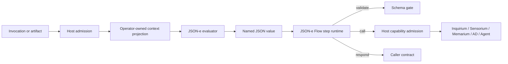

# JSON-e and JSON-e Flows HOWTO

This HOWTO is an operational guide for power users and middleware developers. It
shows how to choose the least-power executor, author a configuration, test effects
without performing them, package a flow, and place the result in Orbiplex's layered
architecture. For shorter conceptual answers, see the [JSON-e and JSON-e Flows
FAQ](../faq/json-e-and-json-e-flows-faq.en.md).

## Responsibility map

JSON-e is a value transformer. JSON-e Flow is a host-owned sequence of static steps.
Neither is a domain organ or an authority source.



The host owns projection, schema validation, provider resolution, authority, timeout,
deferred-operation control, and traces. The template owns only the construction of a
JSON value. A concrete definition nevertheless remains a first-class middleware
component with its own `id`, `module_id`, `component_id`, bindings, limits, and trace
identity.

## Choose the executor before writing the template

| Need | Use | Why |
| :--- | :--- | :--- |
| Select, normalize, annotate, or construct JSON | `json_e` | Pure transformation, smallest authority surface. |
| Perform a short static sequence with a few host effects | `json_e_flow` | Effects remain literal and host-admitted. |
| Express substantial branching or policy scripting | `nse_rhai` | A bounded language is clearer than disguising code as data. |
| Maintain state, stream, adapt a protocol, or run rich domain logic | `channel_json` or supervised middleware | The behavior deserves a process and an explicit lifecycle. |
| Touch files, processes, terminal sessions, or devices | Sensorium action or Workbench operation | OS authority stays in the enaction stratum. |

Prefer the first row that can express the complete behavior. Do not select JSON-e
merely to avoid writing code when the resulting configuration becomes less knowable
than code.

Current availability matters: `middleware-runtime` implements both executors, but the
daemon's operator-configured provider registry currently exposes
`middleware_json_e_flow_services`, not a parallel `middleware_json_e_services` map.
Use the pure executor directly in crate-level integrations and tests. For a deployable
daemon component that only transforms data, use a JSON-e Flow containing only
`render`, `validate`, and `respond`; do not invent an unsupported config key.

## Know the two configuration contracts

A pure `json_e` definition requires:

- operational identity: `id`, `module_id`, `component_id`, optional `bindings`;
- evaluator identity: `template_id`, `profile_version`;
- input boundary: `context_contract`, `context_projection`;
- output boundary: `output_contract`;
- language surface: `template`, `helper_profile`, `helpers`;
- resource boundary: `limits`;
- optional, separately gated `raw_signal_access`.

A `json_e_flow` definition replaces `output_contract` and the top-level `template`
with static `steps`. It also adds `allowed_calls`, optional capability-family grants,
`trace_policy`, and `deferred_response_mode`.

The committed schemas are:

- `node:middleware-runtime/schemas/json-e-middleware.schema.json`;
- `node:middleware-runtime/schemas/json-e-flow-middleware.schema.json`;
- `node:middleware-runtime/schemas/json-e-context-role-execute.schema.json`;
- `node:middleware-runtime/schemas/json-e-evaluation-trace.schema.json`.

## Author a pure JSON-e role adapter

The following complete executor maps a role invocation into a
`service-dispatch-response.v1`. It performs no effect and exposes only the five values
needed by the template. This is the `middleware-runtime` executor contract; as noted
above, the current daemon does not directly load it from a top-level pure-JSON-e
registry.

```json
{
  "id": "role-example-summary-json-e",
  "module_id": "example.json-e.roles",
  "component_id": "middleware.example.roles.summary",
  "bindings": {
    "role_capability_id": "role.example-summary.execute"
  },
  "template_id": "example.role-summary.response.v1",
  "profile_version": "orbiplex.json_e.v1",
  "context_contract": "json_e.context.role_execute.v1",
  "context_projection": {
    "capability_id": "$.capability_id",
    "role_capability_id": "$.role.capability_id",
    "dispatch_id": "$.dispatch.id",
    "request_input": "$.request.input",
    "now": {"host_value": "invocation.rfc3339_now"}
  },
  "output_contract": "service-dispatch-response.v1",
  "template": {
    "schema_version": "v1",
    "capability_id": "service_dispatch_execute",
    "status": "completed",
    "dispatch/id": "${dispatch_id}",
    "completed-at": "${now}",
    "answer/content": {
      "summary": "${request_input.text}"
    },
    "answer/format": "application/json",
    "confidence/signal": null,
    "human-linked-participation": false,
    "provenance/origin-classes": ["json_e"],
    "message": null
  },
  "helper_profile": "orbiplex.json_e.helpers.basic.v1",
  "helpers": [],
  "limits": {
    "max_template_bytes": 32768,
    "max_context_bytes": 16384,
    "max_output_bytes": 32768,
    "max_evaluation_depth": 32,
    "max_collection_size": 128,
    "max_string_bytes": 16384,
    "timeout_ms": 250
  }
}
```

Review `context_projection` as an authority boundary. Adding `"request": "$"` is
not a harmless authoring shortcut: it gives the template every field in the invocation
and makes future envelope additions visible without another review.

The available basic helpers are `sha256_json`, `sha256_text`, `default`, `has`,
`pick`, and `idempotency_key`. Expose only helpers used by the template. Pin
`orbiplex.json_e.helpers.basic.v1`; do not assume that an unversioned helper surface
exists.

## Build a small JSON-e Flow

Start from the data passage, not from a list of services. This example renders a
bounded Inquirium request, asks the host to execute the literal capability, and
returns the provider result. The inference grant is separate from `allowed_calls`.

```json
{
  "id": "example-inquiry-flow",
  "module_id": "example.inquiry",
  "component_id": "middleware.example.inquiry",
  "bindings": {
    "role_capability_id": "role.example-inquiry.execute"
  },
  "template_id": "example.inquiry.flow.v1",
  "profile_version": "orbiplex.json_e_flow.v1",
  "context_contract": "json_e.context.role_execute.v1",
  "context_projection": {
    "capability_id": "$.capability_id",
    "role_capability_id": "$.role.capability_id",
    "dispatch_id": "$.dispatch.id",
    "request_input": "$.request.input",
    "now": {"host_value": "invocation.rfc3339_now"}
  },
  "helper_profile": "orbiplex.json_e.helpers.basic.v1",
  "helpers": [],
  "allowed_calls": ["inquirium.generate"],
  "inference_grants": [
    {
      "capability": "inquirium.generate",
      "max_request_bytes": 4096,
      "allowed_runtime_refs": [],
      "allowed_profile_refs": []
    }
  ],
  "limits": {
    "max_template_bytes": 32768,
    "max_context_bytes": 16384,
    "max_output_bytes": 32768,
    "max_evaluation_depth": 32,
    "max_collection_size": 128,
    "max_string_bytes": 16384,
    "timeout_ms": 1000,
    "max_flow_steps": 8,
    "max_loop_steps": 16
  },
  "trace_policy": {
    "success_sample_rate": 1.0,
    "failure_sample_rate": 1.0,
    "retain_recent": 100
  },
  "steps": [
    {
      "kind": "render",
      "id": "render_inquiry",
      "as": "inquiry_request",
      "template": {
        "schema": "inquirium.generate.request.v1",
        "operation": "generate",
        "turns": [
          {
            "role": "user",
            "content": [
              {"type": "text", "text": "Summarize: ${request_input.text}"}
            ]
          }
        ],
        "parameters": {"max_tokens": 256, "temperature": 0.0},
        "policy": {
          "locality": "local_only",
          "trust_mode": "strict_local",
          "scope": "example-summary",
          "on_context_denied": "fail_closed",
          "plurality": "preserve"
        },
        "metadata": {"dispatch/id": "${dispatch_id}"}
      }
    },
    {
      "kind": "call",
      "id": "call_inquiry",
      "capability": "inquirium.generate",
      "input": "$.inquiry_request",
      "as": "inquiry_result"
    },
    {
      "kind": "respond",
      "id": "respond",
      "input": "$.inquiry_result"
    }
  ]
}
```

`capability` is literal configuration. Render request bodies, never capability names.
When the caller requires a specific response contract, add a `render` step that builds
that contract, a `validate` step, and only then `respond`.

## Compose steps without hidden state

Each `render`, `call`, or `extract` step writes one named value through `as`. Later
steps address the flow state with JSON paths such as `$.inquiry_request` or
`$.sensorium_result.answer_content`.

Use the six current step kinds deliberately:

```json
[
  {"kind": "render", "id": "render_request", "as": "request", "template": {}},
  {"kind": "validate", "id": "validate_request", "input": "$.request", "contract": "example.request.v1"},
  {"kind": "call", "id": "call_provider", "capability": "example.execute", "input": "$.request", "as": "result"},
  {"kind": "extract", "id": "extract_value", "from": "$.result", "path": "$.value", "as": "value"},
  {"kind": "respond", "id": "respond", "input": "$.value"}
]
```

Use `fail` for an explicit, static refusal. Do not emulate branching by rendering
different capability ids or dynamic step arrays: the schema rejects those shapes, and
the architecture intentionally keeps effect selection outside invocation data.

## Separate call shape from authority

Before adding a `call`, answer four questions:

1. Which stable host capability represents the effect?
2. Does `allowed_calls` contain that exact id?
3. Which passport, local policy, host grant, or role binding authorizes the component?
4. Which request and response schemas form the boundary?

For Inquirium, add a bounded `inference_grants` entry. For `agent.*`, add a matching
`agent_grants` entry and, where needed, static `observation_bindings`. These bindings
are operator-authored mappings to opaque source refs; flow output may select them but
cannot invent a source or widen `age_max_ms` and `bytes_max`.

For ordinary capabilities such as `sensorium.directive.invoke`, `memarium.write`, or
`artifact.delivery.send`, `allowed_calls` is still not the final authority. The host
applies the relevant domain passport and policy before the effect.

## Validate and dry-run before activation

Put each deployable flow definition under the daemon's
`middleware_json_e_flow_services` map, directly or through a trusted package config
fragment. Test a pure `JsonEExecutorConfig` in `middleware-runtime`; when the same
transformation must be operator-deployable today, express it as an effect-free flow.
Then validate the complete daemon profile:

```sh
cargo run -p orbiplex-node-daemon -- \
  check-config --data-dir "$DATA_DIR"
```

Author an effectful flow with fail-closed mocks:

```sh
cargo run -p orbiplex-node-daemon -- \
  json-e-flow-dry-run \
  --data-dir "$DATA_DIR" \
  --middleware-id example-inquiry-flow \
  --input invocation.json \
  --mock-responses mock-responses.json
```

Mock by step id when two calls to the same capability need different responses; use
the capability id as a fallback:

```json
{
  "calls": {
    "call_inquiry": {
      "schema": "inquirium.generate.response.v1",
      "status": "completed",
      "output": {"text": "A bounded mock response"}
    }
  },
  "capabilities": {
    "memarium.write": {"status": "written", "fact_id": "fact:mock"}
  }
}
```

Dry-run never invokes a real host capability without an explicit mock. A failure
report preserves the partial step trace and identifies `failure_class`, `step_id`,
`step_path`, and available template/input/context paths. Fix the layer named by the
failure instead of broadening permissions or limits speculatively.

## Handle deferred operations explicitly

Use the default when a caller can accept host-managed suspension and resumption:

```json
{
  "deferred_response_mode": "surface-to-caller"
}
```

A pending `deferred-operation.v1` is control-plane data, not the domain result. The
current daemon stores the original invocation together with the middleware,
capability, template, and deferred step ids. On completion it re-evaluates the static
flow from the beginning and injects the completed status at the matching `call` step.
Every earlier effectful call must therefore use a stable idempotency key and tolerate
replay. The flow still does not own polling, retry cadence, or TTL.

Set `reject-as-failure` only when the caller's contract is strictly synchronous. That
choice should be visible in review because it converts a valid deferred provider
response into `deferred-not-accepted`.

For waiting on observable state, prefer `interaction-broker.wait` rather than a hidden
poll loop. The reference fixture is
`node:middleware-runtime/fixtures/json-e-flow/sensorium-workbench/30-wait-condition.json`.

## Request raw signal access only when necessary

Raw input is a deliberate hole through an abstraction. To use it, all three gates must
be present:

1. the concrete definition declares `raw_signal_access` with a reason and bounds;
2. local host policy permits the requested hook/message class;
3. `context_projection` maps the admitted value into the authoring context.

```json
{
  "raw_signal_access": {
    "requires_raw_signal": true,
    "reason": "Preserve the original signed request for a bounded compatibility adapter",
    "max_raw_signal_bytes": 16384,
    "accepted_hooks": ["inbound-local"],
    "accepted_message_kinds": ["example.request.v1"]
  },
  "context_projection": {
    "raw_signal": "$.trace.raw_signal_access.raw_signal"
  }
}
```

Do not add this declaration merely because a convenient field is missing. First add a
stable field to the ordinary authoring context when it belongs to the abstraction.

## Package a family of flows

A middleware package may carry a whole `middleware_json_e_flow_services` map. A
minimal layout is:

```text
middleware-packages/example-json-e-flows/
  middleware.package.json
  config/
    json-e-flow-services.json
  ui/
    index.html
  .signatures/
    middleware-package.sig.json
```

The manifest declares the config fragment rather than smuggling it through an
arbitrary file:

```json
{
  "schema": "middleware.package.v1",
  "package_id": "example.json-e-flows",
  "version": "0.1.0",
  "module_id": "example.json-e-flows",
  "provides": {
    "config_fragments": [
      {
        "kind": "daemon.middleware_json_e_flow_services",
        "path": "config/json-e-flow-services.json"
      }
    ]
  }
}
```

Treat package signing and runtime authority as separate decisions. The signature says
which bytes the operator trusted; it does not grant `memarium.write`,
`inquirium.generate`, or any other capability. Review context projections and grants
after every package update because a current signature over a wider projection is
still a wider local authority decision.

## Use the common integration patterns

### Role adapter: Inquirium -> Sensorium -> Memarium

Story-009 is the complete reference. Each role flow:

1. projects a `json_e.context.role_execute.v1` context;
2. optionally obtains advisory material from `inquirium.generate`;
3. renders and invokes one `sensorium-directive.v1`;
4. renders and writes a bounded Memarium fact;
5. publishes `workflow.step.completed`;
6. validates and returns `service-dispatch-response.v1`.

The flow does not know how a model is served, how an OS action executes, or how a fact
is stored. The fixtures live under
`node:middleware-runtime/fixtures/json-e-flow/story-009/`.

### Workbench: proposal is not execution authority

The Workbench reference keeps a visible break between model output and action:

```text
observe -> inquirium.generate -> structured proposal
        -> operator/host-reviewed argv
        -> sensorium.directive.invoke -> Workbench policy gate -> execution
```

The JSON-e Flow may carry the proposal alongside the directive, but Workbench executes
the operator-reviewed argv under its command profile. See
`node:middleware-runtime/fixtures/json-e-flow/sensorium-workbench/`.
For connector configuration, a complete directive, consent, and deferred execution,
continue with the [Sensorium HOWTO](sensorium-howto.en.md).

### Artifact Delivery: outbound effect, pure inbound predicate

For outbound delivery, render `artifact-delivery-envelope.v1`, validate it, then call
`artifact.delivery.send`. For inbound acceptance, configure a pure JSON-e Flow
acceptor that returns `InboundAdmissionResult` and declares no host calls. The complete
acceptor configuration is in the [Artifact Delivery
HOWTO](artifact-delivery-howto.en.md#json-e-flows).

### Agent: predeclared grants and observation bindings

A flow may call `agent.spawn`, `agent.binding.create`, and
`agent.controller.run` only when each call has a matching `agent_grants` entry. Keep
runtime profiles, agent id prefixes, capabilities, and observation source bounds in
operator-authored config. The fixture
`node:middleware-runtime/fixtures/json-e-flow/agent/10-bounded-agent-consumer.json`
shows the complete shape.

## Inspect runtime state without leaking payloads

Use one of the operator surfaces:

```sh
orbiplex-node-launcher json-e-flow-middleware --data-dir "$DATA_DIR"
```

- Node UI: `/operator/json-e-flow`;
- daemon list/read model: `GET /v1/json-e-flow-middleware?limit=10`;
- one retained trace: `GET /v1/json-e-flow-traces/{record_id}`.

The read model shows template ids, role bindings, helper profile, static calls, limits,
trace policy, recent failures, and step digests. It should not expose request bodies,
model prompts, private material, or capability responses. `retain_recent` bounds the
operator read model; append-only trace retention and physical compaction belong to the
storage layer.

## Review checklist

Before enabling a definition, verify:

1. `context_projection` exposes the minimum stable values and no credentials.
2. The output is validated at the boundary where another component relies on it.
3. Every capability id is literal and present in `allowed_calls`.
4. Inference and Agent calls have their additional bounded grants.
5. Limits fit the expected request rather than a hypothetical maximum.
6. Idempotency keys derive from stable semantic inputs, not timestamps or labels.
7. Deferred responses are either deliberately surfaced or deliberately rejected.
8. Trace policy retains failures and does not retain raw secret-bearing values.
9. Dry-run covers success, schema failure, missing mock, disallowed call, and an
   oversized or malformed input.
10. The definition remains shorter and easier to understand than equivalent code.

If the last condition fails, promote the behavior to a code-backed middleware while
preserving the same host capability and wire contracts.

## Canonical references

- [Proposal 049: JSON-e Middleware Transformer Executor](../../project/40-proposals/049-json-e-middleware-transformer-executor.md)
- [Solution 019: Middleware](../../project/60-solutions/019-middleware/019-middleware.md)
- [Proposal 053: Raw Signal Access](../../project/40-proposals/053-raw-signal-access.md)
- [Solution 029: Bounded Deferred Operations](../../project/60-solutions/029-bounded-deferred-operations/029-bounded-deferred-operations.md)
- [Artifact Delivery HOWTO](artifact-delivery-howto.en.md)
- [Collaborative Agents HOWTO](collaborative-agents-howto.en.md)
