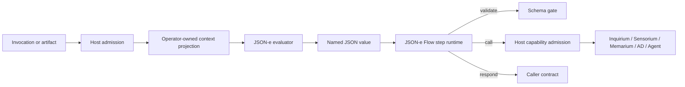

# HOWTO JSON-e i JSON-e Flows

Ten HOWTO jest przewodnikiem operacyjnym dla power userów i developerów middleware.
Pokazuje, jak wybrać najmniej potężny executor, napisać konfigurację, testować efekty
bez ich wykonywania, spakować przepływ i umieścić go w warstwowej architekturze
Orbipleksu. Krótsze odpowiedzi koncepcyjne znajdują się w [FAQ JSON-e i JSON-e
Flows](../faq/json-e-and-json-e-flows-faq.pl.md).

## Mapa odpowiedzialności

JSON-e jest transformatorem wartości. JSON-e Flow jest należącą do hosta sekwencją
statycznych kroków. Żadne z nich nie jest organem domenowym ani źródłem władzy.



Host jest właścicielem projekcji, walidacji schem, wyboru providera, autoryzacji,
timeoutów, control-plane operacji odroczonych i śladów. Szablon odpowiada wyłącznie za
konstruowanie wartości JSON. Konkretna definicja pozostaje jednak pełnoprawnym
komponentem middleware z własnymi `id`, `module_id`, `component_id`, bindingami,
limitami i tożsamością śladu.

## Wybierz executor przed napisaniem szablonu

| Potrzeba | Użyj | Dlaczego |
| :--- | :--- | :--- |
| Wybór, normalizacja, adnotacja lub konstruowanie JSON | `json_e` | Czysta transformacja i najmniejsza powierzchnia władzy. |
| Krótka statyczna sekwencja z kilkoma efektami hosta | `json_e_flow` | Efekty pozostają literalne i dopuszczane przez hosta. |
| Rozbudowane rozgałęzienia lub skrypt polityki | `nse_rhai` | Ograniczony język jest czytelniejszy niż kod przebrany za dane. |
| Stan, streaming, adapter protokołu lub bogata logika domenowa | `channel_json` lub nadzorowane middleware | Zachowanie zasługuje na proces i jawny cykl życia. |
| Pliki, procesy, sesje terminala lub urządzenia | akcja Sensorium lub operacja Workbench | Władza nad OS pozostaje w warstwie enaction. |

Wybierz pierwszy wiersz zdolny wyrazić całe zachowanie. Nie wybieraj JSON-e tylko po
to, aby uniknąć kodu, jeżeli wynikowa konfiguracja staje się mniej poznawalna niż kod.

Trzeba przy tym uwzględnić bieżącą dostępność: `middleware-runtime` implementuje oba
executory, lecz rejestr providerów konfigurowanych przez operatora w daemonie udostępnia
dziś `middleware_json_e_flow_services`, a nie równoległe
`middleware_json_e_services`. Czystego executora używaj bezpośrednio w integracjach i
testach na poziomie crate. Dla wdrażalnego komponentu daemona, który tylko przekształca
dane, użyj JSON-e Flow zawierającego wyłącznie `render`, `validate` i `respond`; nie
wymyślaj nieobsługiwanego klucza konfiguracji.

## Poznaj dwa kontrakty konfiguracji

Czysta definicja `json_e` wymaga:

- tożsamości operacyjnej: `id`, `module_id`, `component_id` i opcjonalnych `bindings`;
- tożsamości interpretera: `template_id`, `profile_version`;
- granicy wejścia: `context_contract`, `context_projection`;
- granicy wyjścia: `output_contract`;
- powierzchni języka: `template`, `helper_profile`, `helpers`;
- granicy zasobów: `limits`;
- opcjonalnego i osobno bramkowanego `raw_signal_access`.

Definicja `json_e_flow` zastępuje `output_contract` i top-level `template` statycznymi
`steps`. Dodaje także `allowed_calls`, opcjonalne granty rodzin capabilities,
`trace_policy` oraz `deferred_response_mode`.

Schemy będące źródłem prawdy to:

- `node:middleware-runtime/schemas/json-e-middleware.schema.json`;
- `node:middleware-runtime/schemas/json-e-flow-middleware.schema.json`;
- `node:middleware-runtime/schemas/json-e-context-role-execute.schema.json`;
- `node:middleware-runtime/schemas/json-e-evaluation-trace.schema.json`.

## Napisz czysty adapter roli w JSON-e

Poniższy kompletny executor mapuje wywołanie roli do
`service-dispatch-response.v1`. Nie wykonuje efektu i udostępnia szablonowi tylko pięć
potrzebnych wartości. Jest to kontrakt executora w `middleware-runtime`; jak opisano
wyżej, obecny daemon nie ładuje go bezpośrednio z osobnego top-level rejestru czystego
JSON-e.

```json
{
  "id": "role-example-summary-json-e",
  "module_id": "example.json-e.roles",
  "component_id": "middleware.example.roles.summary",
  "bindings": {
    "role_capability_id": "role.example-summary.execute"
  },
  "template_id": "example.role-summary.response.v1",
  "profile_version": "orbiplex.json_e.v1",
  "context_contract": "json_e.context.role_execute.v1",
  "context_projection": {
    "capability_id": "$.capability_id",
    "role_capability_id": "$.role.capability_id",
    "dispatch_id": "$.dispatch.id",
    "request_input": "$.request.input",
    "now": {"host_value": "invocation.rfc3339_now"}
  },
  "output_contract": "service-dispatch-response.v1",
  "template": {
    "schema_version": "v1",
    "capability_id": "service_dispatch_execute",
    "status": "completed",
    "dispatch/id": "${dispatch_id}",
    "completed-at": "${now}",
    "answer/content": {
      "summary": "${request_input.text}"
    },
    "answer/format": "application/json",
    "confidence/signal": null,
    "human-linked-participation": false,
    "provenance/origin-classes": ["json_e"],
    "message": null
  },
  "helper_profile": "orbiplex.json_e.helpers.basic.v1",
  "helpers": [],
  "limits": {
    "max_template_bytes": 32768,
    "max_context_bytes": 16384,
    "max_output_bytes": 32768,
    "max_evaluation_depth": 32,
    "max_collection_size": 128,
    "max_string_bytes": 16384,
    "timeout_ms": 250
  }
}
```

Przeglądaj `context_projection` jak granicę władzy. Dodanie `"request": "$"` nie jest
niewinnym skrótem autorskim: daje szablonowi każde pole wywołania i sprawia, że
przyszłe rozszerzenia envelope staną się widoczne bez kolejnego przeglądu.

Dostępne helpery profilu podstawowego to `sha256_json`, `sha256_text`, `default`,
`has`, `pick` i `idempotency_key`. Udostępniaj tylko te, których używa szablon. Przypnij
`orbiplex.json_e.helpers.basic.v1`; nie zakładaj istnienia niewersjonowanej powierzchni
helperów.

## Zbuduj mały JSON-e Flow

Zacznij od przejścia danych, nie od listy usług. Ten przykład renderuje ograniczone
żądanie Inquirium, prosi hosta o wykonanie literalnej capability i zwraca wynik
providera. Grant inferencji jest czymś innym niż `allowed_calls`.

```json
{
  "id": "example-inquiry-flow",
  "module_id": "example.inquiry",
  "component_id": "middleware.example.inquiry",
  "bindings": {
    "role_capability_id": "role.example-inquiry.execute"
  },
  "template_id": "example.inquiry.flow.v1",
  "profile_version": "orbiplex.json_e_flow.v1",
  "context_contract": "json_e.context.role_execute.v1",
  "context_projection": {
    "capability_id": "$.capability_id",
    "role_capability_id": "$.role.capability_id",
    "dispatch_id": "$.dispatch.id",
    "request_input": "$.request.input",
    "now": {"host_value": "invocation.rfc3339_now"}
  },
  "helper_profile": "orbiplex.json_e.helpers.basic.v1",
  "helpers": [],
  "allowed_calls": ["inquirium.generate"],
  "inference_grants": [
    {
      "capability": "inquirium.generate",
      "max_request_bytes": 4096,
      "allowed_runtime_refs": [],
      "allowed_profile_refs": []
    }
  ],
  "limits": {
    "max_template_bytes": 32768,
    "max_context_bytes": 16384,
    "max_output_bytes": 32768,
    "max_evaluation_depth": 32,
    "max_collection_size": 128,
    "max_string_bytes": 16384,
    "timeout_ms": 1000,
    "max_flow_steps": 8,
    "max_loop_steps": 16
  },
  "trace_policy": {
    "success_sample_rate": 1.0,
    "failure_sample_rate": 1.0,
    "retain_recent": 100
  },
  "steps": [
    {
      "kind": "render",
      "id": "render_inquiry",
      "as": "inquiry_request",
      "template": {
        "schema": "inquirium.generate.request.v1",
        "operation": "generate",
        "turns": [
          {
            "role": "user",
            "content": [
              {"type": "text", "text": "Summarize: ${request_input.text}"}
            ]
          }
        ],
        "parameters": {"max_tokens": 256, "temperature": 0.0},
        "policy": {
          "locality": "local_only",
          "trust_mode": "strict_local",
          "scope": "example-summary",
          "on_context_denied": "fail_closed",
          "plurality": "preserve"
        },
        "metadata": {"dispatch/id": "${dispatch_id}"}
      }
    },
    {
      "kind": "call",
      "id": "call_inquiry",
      "capability": "inquirium.generate",
      "input": "$.inquiry_request",
      "as": "inquiry_result"
    },
    {
      "kind": "respond",
      "id": "respond",
      "input": "$.inquiry_result"
    }
  ]
}
```

`capability` jest literalną konfiguracją. Renderuj ciała żądań, nigdy nazwy
capabilities. Jeżeli caller wymaga konkretnego kontraktu odpowiedzi, dodaj krok
`render` budujący ten kontrakt, krok `validate`, a dopiero potem `respond`.

## Składaj kroki bez ukrytego stanu

Każdy krok `render`, `call` lub `extract` zapisuje jedną nazwaną wartość przez `as`.
Kolejne kroki adresują stan przepływu ścieżkami JSON, takimi jak
`$.inquiry_request` lub `$.sensorium_result.answer_content`.

Używaj świadomie sześciu obecnych rodzajów kroków:

```json
[
  {"kind": "render", "id": "render_request", "as": "request", "template": {}},
  {"kind": "validate", "id": "validate_request", "input": "$.request", "contract": "example.request.v1"},
  {"kind": "call", "id": "call_provider", "capability": "example.execute", "input": "$.request", "as": "result"},
  {"kind": "extract", "id": "extract_value", "from": "$.result", "path": "$.value", "as": "value"},
  {"kind": "respond", "id": "respond", "input": "$.value"}
]
```

Krok `fail` służy do jawnej, statycznej odmowy. Nie imituj rozgałęzień przez
renderowanie różnych identyfikatorów capability ani dynamicznych list kroków: schema
odrzuca takie kształty, a architektura celowo trzyma wybór efektu poza danymi
wywołania.

## Rozdziel kształt call od władzy

Przed dodaniem `call` odpowiedz na cztery pytania:

1. Która stabilna host capability reprezentuje efekt?
2. Czy `allowed_calls` zawiera dokładnie ten identyfikator?
3. Który paszport, lokalna polityka, host grant lub role binding autoryzuje komponent?
4. Jakie schemy request i response stanowią granicę?

Dla Inquirium dodaj ograniczony wpis `inference_grants`. Dla `agent.*` dodaj pasujący
`agent_grants` oraz, gdy trzeba, statyczne `observation_bindings`. Bindingi są
operatorskimi mapowaniami do nieprzezroczystych source refs; wynik przepływu może je
wybrać, ale nie może wymyślić źródła ani poszerzyć `age_max_ms` i `bytes_max`.

Dla zwykłych capabilities, takich jak `sensorium.directive.invoke`, `memarium.write`
lub `artifact.delivery.send`, `allowed_calls` nadal nie jest ostateczną władzą. Host
stosuje odpowiedni paszport domenowy i politykę przed efektem.

## Waliduj i wykonuj dry-run przed aktywacją

Każdą wdrażalną definicję przepływu umieść pod mapą
`middleware_json_e_flow_services` daemona, bezpośrednio albo przez fragment
konfiguracji zaufanego pakietu. Czysty `JsonEExecutorConfig` testuj w
`middleware-runtime`; jeśli ta sama transformacja ma być dziś wdrażalna przez
operatora, wyraź ją jako bezefektowy flow. Następnie zwaliduj cały profil daemona:

```sh
cargo run -p orbiplex-node-daemon -- \
  check-config --data-dir "$DATA_DIR"
```

Pracuj nad efektowym przepływem przy użyciu fail-closed mocków:

```sh
cargo run -p orbiplex-node-daemon -- \
  json-e-flow-dry-run \
  --data-dir "$DATA_DIR" \
  --middleware-id example-inquiry-flow \
  --input invocation.json \
  --mock-responses mock-responses.json
```

Mockuj po step id, gdy dwa wywołania tej samej capability potrzebują różnych
odpowiedzi; capability id służy jako fallback:

```json
{
  "calls": {
    "call_inquiry": {
      "schema": "inquirium.generate.response.v1",
      "status": "completed",
      "output": {"text": "A bounded mock response"}
    }
  },
  "capabilities": {
    "memarium.write": {"status": "written", "fact_id": "fact:mock"}
  }
}
```

Dry-run nigdy nie wywołuje prawdziwej host capability bez jawnego mocka. Raport
porażki zachowuje częściowy ślad kroków oraz wskazuje `failure_class`, `step_id`,
`step_path` i dostępne ścieżki template/input/context. Napraw warstwę wskazaną przez
błąd zamiast spekulacyjnie poszerzać uprawnienia lub limity.

## Obsługuj operacje odroczone jawnie

Użyj wartości domyślnej, jeżeli caller może przyjąć zawieszenie i wznowienie
zarządzane przez hosta:

```json
{
  "deferred_response_mode": "surface-to-caller"
}
```

Oczekujące `deferred-operation.v1` jest danymi control-plane, nie wynikiem domenowym.
Obecny daemon zapisuje pierwotne wywołanie wraz z identyfikatorami middleware,
capability, szablonu i odroczonego kroku. Po ukończeniu interpretuje statyczny
przepływ ponownie od początku i wstrzykuje ukończony status w pasującym kroku `call`.
Każdy wcześniejszy efektowy call musi więc używać stabilnego klucza idempotencji i
tolerować replay. Przepływ nadal nie jest właścicielem pollingu, częstotliwości retry
ani TTL.

Ustaw `reject-as-failure` tylko wtedy, gdy kontrakt callera jest ściśle synchroniczny.
Ten wybór powinien być widoczny w review, ponieważ zamienia poprawną odpowiedź
odroczoną providera w `deferred-not-accepted`.

Do czekania na obserwowalny stan preferuj `interaction-broker.wait`, nie ukrytą pętlę
pollingu. Referencyjny fixture to
`node:middleware-runtime/fixtures/json-e-flow/sensorium-workbench/30-wait-condition.json`.

## Proś o raw signal access tylko wtedy, gdy jest potrzebny

Surowe wejście jest świadomym otworem w abstrakcji. Aby go użyć, muszą istnieć
wszystkie trzy bramki:

1. konkretna definicja deklaruje `raw_signal_access` z powodem i limitami;
2. lokalna polityka hosta dopuszcza żądany hook i klasę wiadomości;
3. `context_projection` mapuje dopuszczoną wartość do kontekstu autorskiego.

```json
{
  "raw_signal_access": {
    "requires_raw_signal": true,
    "reason": "Preserve the original signed request for a bounded compatibility adapter",
    "max_raw_signal_bytes": 16384,
    "accepted_hooks": ["inbound-local"],
    "accepted_message_kinds": ["example.request.v1"]
  },
  "context_projection": {
    "raw_signal": "$.trace.raw_signal_access.raw_signal"
  }
}
```

Nie dodawaj tej deklaracji tylko dlatego, że brakuje wygodnego pola. Najpierw dodaj
stabilne pole do zwykłego kontekstu autorskiego, jeżeli należy ono do danej abstrakcji.

## Spakuj rodzinę przepływów

Pakiet middleware może przenosić całą mapę `middleware_json_e_flow_services`.
Minimalny układ wygląda tak:

```text
middleware-packages/example-json-e-flows/
  middleware.package.json
  config/
    json-e-flow-services.json
  ui/
    index.html
  .signatures/
    middleware-package.sig.json
```

Manifest deklaruje fragment konfiguracji zamiast przemycać go przez dowolny plik:

```json
{
  "schema": "middleware.package.v1",
  "package_id": "example.json-e-flows",
  "version": "0.1.0",
  "module_id": "example.json-e-flows",
  "provides": {
    "config_fragments": [
      {
        "kind": "daemon.middleware_json_e_flow_services",
        "path": "config/json-e-flow-services.json"
      }
    ]
  }
}
```

Podpisanie pakietu i władza runtime są osobnymi decyzjami. Podpis mówi, którym bajtom
zaufał operator; nie nadaje `memarium.write`, `inquirium.generate` ani żadnej innej
capability. Po każdej aktualizacji pakietu ponownie przeglądaj projekcje kontekstu i
granty, ponieważ aktualny podpis nad szerszą projekcją nadal oznacza szerszą lokalną
decyzję o władzy.

## Stosuj wspólne wzorce integracyjne

### Adapter roli: Inquirium -> Sensorium -> Memarium

Story-009 jest kompletnym przykładem referencyjnym. Każdy przepływ roli:

1. projektuje kontekst `json_e.context.role_execute.v1`;
2. opcjonalnie pobiera materiał doradczy z `inquirium.generate`;
3. renderuje i wywołuje jedno `sensorium-directive.v1`;
4. renderuje i zapisuje ograniczony fakt Memarium;
5. publikuje `workflow.step.completed`;
6. waliduje i zwraca `service-dispatch-response.v1`.

Przepływ nie wie, jak serwowany jest model, jak wykonywana jest akcja OS ani jak
przechowywany jest fakt. Fixtures znajdują się w
`node:middleware-runtime/fixtures/json-e-flow/story-009/`.

### Workbench: propozycja nie jest władzą wykonawczą

Przykład Workbench utrzymuje widoczne rozdzielenie wyniku modelu od działania:

```text
observe -> inquirium.generate -> structured proposal
        -> operator/host-reviewed argv
        -> sensorium.directive.invoke -> Workbench policy gate -> execution
```

JSON-e Flow może przenieść propozycję wraz z dyrektywą, lecz Workbench wykonuje
operatorsko sprawdzone argv w ramach własnego command profile. Zobacz
`node:middleware-runtime/fixtures/json-e-flow/sensorium-workbench/`.
Konfigurację konektora, pełną dyrektywę, zgodę i wykonanie odroczone opisuje dalej
[HOWTO Sensorium](sensorium-howto.pl.md).

### Artifact Delivery: efekt wychodzący, czysty predykat wejściowy

Dla wysyłki wyrenderuj `artifact-delivery-envelope.v1`, zwaliduj je, a potem wywołaj
`artifact.delivery.send`. Dla przyjęcia skonfiguruj czysty acceptor JSON-e Flow,
zwracający `InboundAdmissionResult` i niedeklarujący host calls. Pełna konfiguracja
acceptora znajduje się w [HOWTO Artifact
Delivery](artifact-delivery-howto.pl.md#json-e-flows).

### Agent: wcześniej zadeklarowane granty i observation bindings

Przepływ może wywołać `agent.spawn`, `agent.binding.create` i
`agent.controller.run` tylko wtedy, gdy każde wywołanie ma pasujący wpis
`agent_grants`. Profile runtime, prefiksy agent id, capabilities i limity źródeł
obserwacji trzymaj w konfiguracji operatora. Pełny kształt pokazuje fixture
`node:middleware-runtime/fixtures/json-e-flow/agent/10-bounded-agent-consumer.json`.

## Obserwuj runtime bez wycieku payloadów

Użyj jednej z powierzchni operatorskich:

```sh
orbiplex-node-launcher json-e-flow-middleware --data-dir "$DATA_DIR"
```

- Node UI: `/operator/json-e-flow`;
- lista/read model daemona: `GET /v1/json-e-flow-middleware?limit=10`;
- pojedynczy zachowany ślad: `GET /v1/json-e-flow-traces/{record_id}`.

Read model pokazuje template ids, role bindings, helper profile, statyczne calls,
limity, trace policy, ostatnie porażki i digesty kroków. Nie powinien pokazywać ciał
żądań, promptów modeli, materiału prywatnego ani odpowiedzi capabilities.
`retain_recent` ogranicza operatorski read model; trwałość append-only śladów i
fizyczna kompaktacja należą do warstwy storage.

## Checklista review

Przed włączeniem definicji sprawdź:

1. `context_projection` pokazuje minimalny zestaw stabilnych wartości i żadnych
   credentials.
2. Wyjście jest walidowane na granicy, na której polega na nim inny komponent.
3. Każdy capability id jest literalny i obecny w `allowed_calls`.
4. Wywołania Inquirium i Agent mają dodatkowe, ograniczone granty.
5. Limity pasują do oczekiwanego requestu, nie hipotetycznego maksimum.
6. Klucze idempotencji wynikają ze stabilnych wejść semantycznych, nie timestampów ani
   etykiet.
7. Odpowiedzi odroczone są świadomie powierzchniowane albo świadomie odrzucane.
8. Trace policy zachowuje porażki i nie utrwala surowych wartości zawierających
   sekrety.
9. Dry-run pokrywa sukces, błąd schemy, brak mocka, niedozwolony call oraz zbyt duże
   lub uszkodzone wejście.
10. Definicja pozostaje krótsza i łatwiejsza do zrozumienia niż równoważny kod.

Jeśli ostatni warunek nie jest spełniony, wypromuj zachowanie do middleware opartego na
kodzie, zachowując te same host capabilities i wire contracts.

## Referencje kanoniczne

- [Proposal 049: JSON-e Middleware Transformer Executor](../../project/40-proposals/049-json-e-middleware-transformer-executor.md)
- [Solution 019: Middleware](../../project/60-solutions/019-middleware/019-middleware.md)
- [Proposal 053: Raw Signal Access](../../project/40-proposals/053-raw-signal-access.md)
- [Solution 029: Bounded Deferred Operations](../../project/60-solutions/029-bounded-deferred-operations/029-bounded-deferred-operations.md)
- [HOWTO Artifact Delivery](artifact-delivery-howto.pl.md)
- [HOWTO współpracy agentów](collaborative-agents-howto.pl.md)
