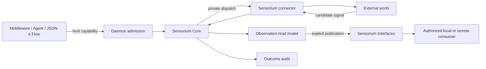

# Sensorium HOWTO

This HOWTO is an operational guide for node operators, power users, and middleware
developers. It shows how to admit observations, define and invoke finite Sensorium OS
actions, use stateful Workbench operations, obtain operator consent, and publish a
bounded Sensorium Interface. For shorter conceptual answers, see the [Sensorium
FAQ](../faq/sensorium-faq.en.md).

## Responsibility map

Sensorium keeps public intent above connector mechanics. A caller never selects a
connector or receives its private credentials.



The daemon owns caller authentication, capability admission, provider selection, and
common deferred operations. Sensorium Core owns observation admission, the action
catalog boundary, directive validation, connector dispatch, and outcomes. A connector
owns protocol or operating-system mechanics. Sensorium Interfaces separately owns
publication, grants, cursors, leases, classification, and revocation.

## Choose the passage before configuring a connector

| Need | Passage | Stable public handle |
| :--- | :--- | :--- |
| Submit or query a local signal | Sensorium observation | `sensorium.observe.*` |
| Perform one bounded catalogued effect | Sensorium directive | `sensorium.directive.invoke` + `action_id` |
| Manage files, PTY sessions, patches, or environments | Workbench operation through a directive | `sensorium.workbench.*` action id |
| Expose a bounded representation to another consumer | Sensorium Interface | exact interface resource and grant |
| Deliver durable or large bytes | Artifact Delivery | artifact envelope and recipient selector |
| Ask a model for advice or structured intent | Inquirium | `inquirium.*` capability |

Do not collapse these paths. An observation is not a command. A Room carrier is not
an interface grant. Model output is not actuation authority. A file reference is not
permission to deliver the file.

## Call only the public host-capability surface

Host capabilities use:

```text
POST /v1/host/capabilities/{capability_id}
```

A supervised middleware call must carry its daemon-issued module authentication and
component identity. Browser and operator calls use their own runtime-authenticated
surfaces. The examples below show request bodies only; do not copy an authentication
token into configuration, a template, or a trace.

Never call `sensorium.connector.invoke` directly. It is the private seam by which
Sensorium Core talks to a connector after policy admission.

## Configure Sensorium Core policy

Sensorium Core is a built-in Rust organ, not an enable/disable middleware process. Its
`sensorium_core` configuration controls admission policy and bounded local stores:

```json
{
  "sensorium_core": {
    "allowed_sensitivity_classes": [
      "public",
      "community",
      "private",
      "operational-sensitive"
    ],
    "quarantine_sensitivity_classes": ["sensitive-personal"],
    "default_observation_ttl_sec": 300,
    "default_consumer_scopes": ["sensorium.read.local"],
    "max_observations": 50000,
    "max_outcomes": 10000,
    "max_idempotency_entries": 5000
  }
}
```

Treat sensitivity, TTL, and capacities as policy. Do not enlarge them merely to make a
failing connector appear healthy. Validate the complete node profile after changing
configuration:

```sh
cargo run -p orbiplex-node-daemon -- check-config --data-dir "$DATA_DIR"
```

## Submit an observation candidate

A producer submits a candidate, not a completed `sensorium-observation.v1`. Sensorium
adds the observation id, ingestion time, expiry, admission decision, and any missing
host-owned defaults.

```json
{
  "candidate": {
    "signal/kind": "com.example.monitor/temperature",
    "signal/family": "temperature",
    "payload": {"celsius": 41.7},
    "confidence": {
      "class": "high",
      "rationale": "calibrated local sensor"
    },
    "freshness": {"ttl_sec": 60},
    "sensitivity": {"class": "operational-sensitive"},
    "source/ref": {
      "kind": "device",
      "value": "sensor:rack-a"
    }
  }
}
```

Send it to `sensorium.observe.submit`. An allowed class returns `status: admitted`
with the canonical observation. A quarantined class returns HTTP 202 without placing
the candidate in the ordinary read model. A class with no policy is rejected.

Do not use `source/ref` as a secret container. Redact or replace a sensitive source
with an opaque local reference before admission.

## Query the local observation read model

Query the same semantic fields used by the observation:

```json
{
  "signal/family": "temperature",
  "limit": 20
}
```

Call `sensorium.observe.query` for newest-first records. Use
`sensorium.observation.get` with `observation/id` for one record and
`sensorium.topic.summary` for a bounded count by `signal/kind` or `signal/family`.
These are local read-model operations. They do not subscribe a remote peer or publish
the data to Agora.

## Define a finite Sensorium OS action

Use Sensorium OS when the effect is finite, has a stable action id, and can be fully
described by an operator-owned catalog entry. The following illustrative entry runs a
bundled read-only repository-status script. Replace the path and digest with the exact
installed artifact; never use a placeholder digest in an active catalog.

```json
{
  "action_id": "example.repo.status",
  "class": "allowlisted-script",
  "executable": {
    "kind": "script",
    "path": "repo_status.py",
    "interpreter": "python3",
    "argv_shape": "stdin"
  },
  "sha256": "<sha256-hex-of-repo_status.py>",
  "parameter_transport": "stdin",
  "default_timeout_ms": 3000,
  "max_timeout_ms": 10000,
  "parameters_schema": {
    "type": "object",
    "additionalProperties": false,
    "required": ["workspace/ref"],
    "properties": {
      "workspace/ref": {"type": "string", "minLength": 1}
    }
  },
  "limits": {
    "stdout_max_bytes": 16384,
    "stderr_max_bytes": 4096
  },
  "cwd": "@script-dir",
  "sensitivity_class": "operational-sensitive",
  "subject_kind": "repository-status",
  "observation_ttl_sec": 60,
  "connector_incidental_effects": ["disk-access-timestamp-update"],
  "result_contract": {
    "signal_kind": "com.example.repo/status-read",
    "signal_family": "repository/status",
    "result_pointer_fields": ["status", "branch", "changed/count"]
  }
}
```

Place actions under `sensorium_os.action_catalog`, keep `sensorium_os.enabled` false
until review, and allowlist the resolved script directory in
`sensorium_os.allowed_workdirs`. An empty workdir list refuses every action, including
one with `cwd: "@script-dir"`.

Sensorium OS currently executes the implemented C1/C2 finite profiles. Declaring a
higher-impact class does not make its required isolation exist: unavailable classes
remain fail-closed.

## Authorize and inspect the Sensorium OS catalog

Enabling the process is not enough. The effective catalog must match an
operator-signed authorization sidecar.

1. Open `/operator/sensorium-os`.
2. Review the catalog hash, per-action contract, limits, sidecar state, and runtime
   availability.
3. Sign the reported catalog or record an explicit denial.
4. Reload the catalog and verify `available_action_ids` rather than relying on the
   informational class list.

The daemon's corresponding operator endpoints are:

```text
POST /v1/operator/sensorium-os/action-catalog/sidecar/sign
POST /v1/operator/sensorium-os/action-catalog/sidecar/deny
```

Signing uses the operator participant key in the daemon. Sensorium OS verifies the
artifact but never unlocks or owns that key. Prefer a signed denial over deleting the
sidecar because denial preserves the reason and audit trail.

## Invoke a Sensorium action

After caller authority, catalog authorization, and connector readiness are all true,
invoke the action through `sensorium.directive.invoke`:

```json
{
  "directive": {
    "schema": "sensorium-directive.v1",
    "schema/v": 1,
    "directive/id": "directive:example-repo-status:001",
    "directive/issued_at": "2026-07-21T10:00:00Z",
    "issuer": {
      "module_id": "example.maintenance-flow"
    },
    "action_id": "example.repo.status",
    "parameters": {
      "workspace/ref": "workspace:mail-server"
    },
    "timing": {
      "timeout_ms": 5000,
      "mode": "sync"
    },
    "idempotency/key": "example-repo-status:workspace-mail-server:001",
    "correlation/id": "correlation:mail-server-diagnosis:001"
  }
}
```

Use a stable idempotency key for a retry of the same semantic request. Reusing it with
different parameters is a conflict, not a second invocation. The result points to the
audit outcome and any observations or artifacts admitted from connector output.

## Invoke Sensorium from a JSON-e Flow

A flow renders the complete directive and calls one literal host capability:

```json
{
  "allowed_calls": ["sensorium.directive.invoke"],
  "steps": [
    {
      "kind": "render",
      "id": "render_directive",
      "as": "directive_request",
      "template": {
        "directive": {
          "schema": "sensorium-directive.v1",
          "schema/v": 1,
          "directive/id": "${directive_id}",
          "directive/issued_at": "${now}",
          "issuer": {"module_id": "example.maintenance-flow"},
          "action_id": "example.repo.status",
          "parameters": {"workspace/ref": "${workspace_ref}"},
          "timing": {"timeout_ms": 5000, "mode": "sync"},
          "idempotency/key": "${idempotency_key}"
        }
      }
    },
    {
      "kind": "call",
      "id": "invoke_sensorium",
      "capability": "sensorium.directive.invoke",
      "input": "$.directive_request",
      "as": "sensorium_result"
    },
    {
      "kind": "respond",
      "id": "respond",
      "input": "$.sensorium_result"
    }
  ]
}
```

This is a fragment of a `json_e_flow` definition, not a complete middleware config.
The flow's `allowed_calls` prevents dynamic effect selection; it does not grant the
module permission to invoke Sensorium. Keep capability ids literal and render only the
request body. See the [JSON-e and JSON-e Flows
HOWTO](json-e-and-json-e-flows-howto.en.md) for complete definitions and dry-run.

## Use deferred action mode deliberately

An action must opt into asynchronous execution in its catalog:

```json
{
  "action_id": "example.long-running-check",
  "execution_mode_support": "either",
  "deferred_profile": {
    "preferred_retry_after_seconds": 15,
    "preferred_max_ttl_seconds": 900
  }
}
```

Set `timing.mode` to `async` in the directive. Sensorium returns
`deferred-operation.v1`; the daemon applies its own stricter retry and TTL policy.
Persist or surface the operation id, then use the common host registry or
`sensorium.operation.status`. Do not pass the deferred envelope to code expecting the
domain result. Cancellation is available only when the operation exposes a valid
cancel path.

## Configure Sensorium Workbench safely

Workbench is disabled by default and refuses readiness without explicit workspace
roots. Start with read-only file access and keep terminal and patch disabled:

```json
{
  "sensorium_workbench": {
    "enabled": true,
    "workspace_roots": [
      {
        "workspace/ref": "workspace:mail-server",
        "root/ref": "root:configuration",
        "path": "/srv/orbiplex-workspaces/mail-server",
        "backend": "host-local-workspace"
      }
    ],
    "operational_context_default": {
      "schema": "sensorium-operational-context.v1",
      "schema/v": 1,
      "impact/class": "test",
      "context/summary": "Disposable mail-server test environment"
    },
    "terminal_enabled": false,
    "patch_enabled": false,
    "command_profiles": []
  }
}
```

The root path must be absolute, existing, and not `/`. Workbench canonicalizes relative
paths below the root and refuses traversal, NUL, root-self file reads, and symlink
escape. `host-local-workspace` is not process isolation. Use the fixture virtual
backend only for its documented managed-copy semantics; do not describe it as a full
VM.

## Read a Workbench file through Sensorium

Use the Workbench operation id as the directive's `action_id`:

```json
{
  "directive": {
    "schema": "sensorium-directive.v1",
    "schema/v": 1,
    "directive/id": "directive:workbench-read:001",
    "directive/issued_at": "2026-07-21T10:05:00Z",
    "issuer": {"module_id": "example.diagnostic-agent"},
    "action_id": "sensorium.workbench.file.read",
    "parameters": {
      "address": {
        "schema": "sensorium-relative-path-address.v1",
        "schema/v": 1,
        "workspace/ref": "workspace:mail-server",
        "root/ref": "root:configuration",
        "relative/path": "etc/postfix/main.cf"
      }
    },
    "timing": {"timeout_ms": 3000, "mode": "sync"},
    "idempotency/key": "workbench-read:main-cf:001"
  }
}
```

The caller needs the public Sensorium invocation authority and the matching
`sensorium.workbench.file` grant. Knowing the workspace ref or relative path is not
enough.

## Enable a bounded terminal profile

Only enable the terminal after file-only diagnostics prove insufficient. A compact
Workbench config profile can admit exact argv vectors:

```json
{
  "terminal_enabled": true,
  "command_profiles": [
    {
      "profile/ref": "command-profile:mail-read-only",
      "argv/prefixes": [
        ["/usr/sbin/postconf", "-n"],
        ["/usr/bin/systemctl", "status", "postfix", "--no-pager"]
      ],
      "allowed_argv_prefixes": []
    }
  ]
}
```

An empty `allowed_argv_prefixes` means no extra argv atoms. It does not mean arbitrary
arguments. Workbench spawns argv data without shell interpolation and refuses
credential-like or process-loader environment keys. Network egress remains denied
unless a separately reviewed contract explicitly permits it.

The ordinary sequence is:

1. `sensorium.workbench.terminal.session.create` for an allowlisted relative address;
2. `sensorium.workbench.terminal.command` with `session/ref` and structured `argv`;
3. `sensorium.workbench.terminal.events` with a bounded cursor and caps;
4. `sensorium.workbench.terminal.close` when the session is no longer needed.

Raw terminal input, resize, signal, command cancel, and patch application are
operator-only surfaces. A terminal grant does not imply patch authority. Capturing a
terminal representation as an artifact requires both terminal-read and artifact-write
authority.

## Let a model propose, but not authorize, a command

Keep model inference and actuation in separate steps:

```text
goal and bounded terminal evidence
  -> Inquirium returns a structured command proposal
  -> policy or operator reviews argv
  -> JSON-e Flow renders sensorium-directive.v1
  -> Sensorium and Workbench apply grants and command profile
  -> Interaction Broker waits for a terminal condition
```

Do not interpolate free-form model text into a shell string. Bind the final reviewed
argv to a command profile. If the workflow belongs to an Agent, Corpus round, or Room,
use `sensorium-workbench-tool-request.v1` so the daemon can verify lineage before
performing the ordinary Sensorium admission.

## Request and revoke interactive consent

When a valid operation is refused only because the current allowlist lacks the exact
action or argv shape, the host may create an operator consent request. The operator UI
offers the narrowest choices first: allow once, exact argv, bounded argv prefix, or
deny. Only a participant with an active node-operator binding can create durable
authority.

Inspect active and historical grants at:

```text
/operator/consents
```

Revocation uses the authenticated operator route and leaves an audit fact. The daemon
then regenerates the relevant projection:

```text
Workbench consent -> command-profile sidecar
Sensorium OS consent -> action-catalog sidecar
```

Sidecars append non-conflicting deltas and remain subordinate to main configuration,
capability policy, workspace boundaries, and runtime limits. They are not a second
unrestricted configuration file.

## Publish a Sensorium Interface only when local access is insufficient

First choose one exact source projection, such as a Sensorium observation query or a
Workbench terminal screen. Then:

1. create an immutable interface publication with classification, source generation,
   limits, and `sensorium-operational-context.v1` where applicable;
2. issue a grant for the exact resource and methods;
3. read one bounded batch or create a bounded subscription;
4. use local host, direct-peer, SSE, or Room WSS only as a carrier;
5. revoke the grant or supersede the publication when the source changes.

The source's generation and latest publication determine freshness. A changed source
generation or a superseding publication makes an old publication stale. Consumers
must fail closed rather than continue under an obsolete `test` context after the same
resource has become `production`.

For interactive control, use Sensorium Interactive Interfaces (P083), the actuation
half of Solution 046, with its separate resource, grant, claim, lease, fencing,
invoke, and receipt contracts. Observation authority never implies control authority.

## Keep artifacts, delivery, and memory separate

Sensorium may return a bounded result, observation refs, and artifact refs. It does
not decide that an artifact should be sent to a peer or written into long-term memory.

- Use Artifact Delivery for recipient selection, transport, admission, and receipts.
- Use Memarium for explicit durable facts under its own space policy.
- Use Sensorium Interfaces for bounded live or latest-state access.
- Keep raw terminal data, credentials, private prompts, and connector internals out of
  audit records.

See the [Artifact Delivery HOWTO](artifact-delivery-howto.en.md) for the handoff and
the [Memarium HOWTO](memarium-howto.en.md) for durable recording.

## Diagnose failures in authority order

Use this order to avoid debugging the wrong layer:

| Layer | Inspect | Typical refusal |
| :--- | :--- | :--- |
| Caller | capability binding, passport, operator session | caller not authorized |
| Sensorium Core | `sensorium.health`, `sensorium.directive.list` | action absent, parameters invalid, timeout too large |
| Catalog/consent | catalog hash, sidecar, `/operator/consents` | catalog unsigned, consent expired or revoked |
| Connector | readiness, action availability, workspace and backend | root unavailable, class unsupported, runtime disabled |
| Operation | idempotency record, deferred status, current generation | conflict, expired, stale session |
| Outcome | `sensorium.audit.read` | connector failure or timeout |
| Interface | publication, grant, cursor, lease, classification | stale publication, revoked grant, cursor mismatch |

A `200` connector health response does not prove that one action is authorized. An
authorized action does not prove that its backend is available. Preserve these as
separate diagnostics.

## Review checklist

Before activating a new connector or operation, confirm:

- callers use a stable `action_id`, never `connector_id`;
- request and result schemas are closed enough for the security boundary;
- parameters contain no shell, raw SQL, credentials, or hidden executable selection;
- workspaces, paths, environment, network, time, bytes, and concurrency are bounded;
- retries use idempotency keys and conflicts are visible;
- operator-only effects require a fresh operator binding or durable reviewed consent;
- deferred work has status, expiry, and explicit cancellation semantics;
- observations and audit facts exclude raw secrets;
- large output becomes a verified artifact reference;
- remote exposure is an explicit Sensorium Interface publication;
- the documented isolation claim matches the backend that is actually deployed;
- refusal tests cover malformed input, missing authority, stale state, replay, and
  recovery after restart.

## Canonical references

- [Solution 030: Sensorium](../../project/60-solutions/030-sensorium/030-sensorium.md)
- [Solution 042: Sensorium Workbench](../../project/60-solutions/042-sensorium-workbench/042-sensorium-workbench.md)
- [Solution 046: Sensorium Interfaces](../../project/60-solutions/046-sensorium-interfaces/046-sensorium-interfaces.md)
- [Proposal 045: Sensorium Local Enaction Stratum](../../project/40-proposals/045-sensorium-local-enaction-stratum.md)
- [Proposal 048: Sensorium OS Connector Action Classes](../../project/40-proposals/048-sensorium-os-connector-action-classes.md)
- [Proposal 071: Sensorium Workbench](../../project/40-proposals/071-sensorium-workbench.md)
- [Proposal 082: Sensorium Interfaces](../../project/40-proposals/082-sensorium-interfaces.md)
- [Proposal 083: Sensorium Interactive Interfaces](../../project/40-proposals/083-sensorium-interactive-interfaces.md)
