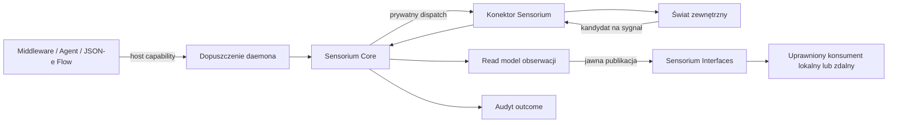

# HOWTO Sensorium

Ten HOWTO jest przewodnikiem operacyjnym dla operatorów węzła, power userów i
developerów middleware. Pokazuje, jak dopuszczać obserwacje, definiować i wywoływać
skończone działania Sensorium OS, używać stanowych operacji Workbench, uzyskiwać zgodę
operatora i publikować ograniczony Sensorium Interface. Krótsze odpowiedzi
koncepcyjne zawiera [FAQ Sensorium](../faq/sensorium-faq.pl.md).

## Mapa odpowiedzialności

Sensorium utrzymuje publiczną intencję ponad mechaniką konektorów. Wołający nie wybiera
konektora i nie otrzymuje jego prywatnych poświadczeń.



Daemon jest właścicielem uwierzytelnienia wołającego, dopuszczenia capability, wyboru
providera i wspólnych operacji odroczonych. Sensorium Core odpowiada za dopuszczenie
obserwacji, granicę katalogu działań, walidację dyrektywy, dispatch konektora i outcome.
Konektor odpowiada za mechanikę protokołu lub systemu operacyjnego. Sensorium
Interfaces osobno odpowiada za publikację, granty, kursory, dzierżawy, klasyfikację i
odwołanie.

## Wybierz przejście przed konfiguracją konektora

| Potrzeba | Przejście | Stabilny publiczny uchwyt |
| :--- | :--- | :--- |
| Przesłanie lub odpytanie lokalnego sygnału | obserwacja Sensorium | `sensorium.observe.*` |
| Wykonanie jednego ograniczonego efektu katalogowego | dyrektywa Sensorium | `sensorium.directive.invoke` + `action_id` |
| Zarządzanie plikami, sesją PTY, patchem lub środowiskiem | operacja Workbench przez dyrektywę | action id `sensorium.workbench.*` |
| Udostępnienie ograniczonej reprezentacji innemu konsumentowi | Sensorium Interface | dokładny zasób interfejsu i grant |
| Dostarczenie trwałych lub dużych bajtów | Artifact Delivery | envelope artefaktu i selektor odbiorcy |
| Uzyskanie porady lub ustrukturyzowanej intencji modelu | Inquirium | capability `inquirium.*` |

Nie splataj tych ścieżek. Obserwacja nie jest komendą. Carrier Room nie jest grantem
interfejsu. Wynik modelu nie jest uprawnieniem wykonawczym. Referencja pliku nie jest
pozwoleniem na jego dostarczenie.

## Wołaj wyłącznie publiczną powierzchnię host capability

Host capabilities używają ścieżki:

```text
POST /v1/host/capabilities/{capability_id}
```

Wywołanie nadzorowanego middleware musi nieść nadane przez daemona uwierzytelnienie
modułu i tożsamość komponentu. Wywołania przeglądarki i operatora używają własnych
powierzchni uwierzytelnianych w runtime. Poniższe przykłady pokazują wyłącznie body;
nie kopiuj tokenu uwierzytelniającego do konfiguracji, szablonu ani śladu.

Nigdy nie wołaj bezpośrednio `sensorium.connector.invoke`. To prywatny szew, przez
który Sensorium Core rozmawia z konektorem po dopuszczeniu przez politykę.

## Skonfiguruj politykę Sensorium Core

Sensorium Core jest wbudowanym organem w Rust, a nie procesem middleware włączanym i
wyłączanym przez operatora. Konfiguracja `sensorium_core` steruje polityką dopuszczenia
i ograniczonymi lokalnymi magazynami:

```json
{
  "sensorium_core": {
    "allowed_sensitivity_classes": [
      "public",
      "community",
      "private",
      "operational-sensitive"
    ],
    "quarantine_sensitivity_classes": ["sensitive-personal"],
    "default_observation_ttl_sec": 300,
    "default_consumer_scopes": ["sensorium.read.local"],
    "max_observations": 50000,
    "max_outcomes": 10000,
    "max_idempotency_entries": 5000
  }
}
```

Traktuj wrażliwość, TTL i pojemności jako politykę. Nie zwiększaj ich tylko po to, aby
wadliwy konektor wyglądał na zdrowy. Po zmianie konfiguracji zweryfikuj pełny profil
węzła:

```sh
cargo run -p orbiplex-node-daemon -- check-config --data-dir "$DATA_DIR"
```

## Prześlij kandydata na obserwację

Producent przesyła kandydata, a nie gotowy `sensorium-observation.v1`. Sensorium dodaje
id obserwacji, czas ingestu, wygaśnięcie, decyzję dopuszczenia i brakujące wartości
domyślne należące do hosta.

```json
{
  "candidate": {
    "signal/kind": "com.example.monitor/temperature",
    "signal/family": "temperature",
    "payload": {"celsius": 41.7},
    "confidence": {
      "class": "high",
      "rationale": "calibrated local sensor"
    },
    "freshness": {"ttl_sec": 60},
    "sensitivity": {"class": "operational-sensitive"},
    "source/ref": {
      "kind": "device",
      "value": "sensor:rack-a"
    }
  }
}
```

Wyślij go do `sensorium.observe.submit`. Dozwolona klasa zwraca `status: admitted` z
kanoniczną obserwacją. Klasa podlegająca kwarantannie zwraca HTTP 202 bez umieszczenia
kandydata w zwykłym read modelu. Klasa bez polityki zostaje odrzucona.

Nie używaj `source/ref` jako pojemnika na sekret. Zanonimizuj wrażliwe źródło albo
zastąp je nieprzezroczystą lokalną referencją przed dopuszczeniem.

## Odpytaj lokalny read model obserwacji

Odpytuj te same pola semantyczne, których używa obserwacja:

```json
{
  "signal/family": "temperature",
  "limit": 20
}
```

Wywołaj `sensorium.observe.query`, aby uzyskać rekordy od najnowszego. Użyj
`sensorium.observation.get` z `observation/id` dla jednego rekordu, a
`sensorium.topic.summary` dla ograniczonego licznika według `signal/kind` albo
`signal/family`. Są to operacje lokalnego read modelu. Nie subskrybują zdalnego peera
i nie publikują danych w Agorze.

## Zdefiniuj skończone działanie Sensorium OS

Użyj Sensorium OS, gdy efekt jest skończony, ma stabilny action id i można go w pełni
opisać operatorskim wpisem katalogowym. Poniższy poglądowy wpis uruchamia dołączony
skrypt odczytujący status repozytorium. Zastąp ścieżkę i digest dokładnym zainstalowanym
artefaktem; nigdy nie używaj zastępczego digestu w aktywnym katalogu.

```json
{
  "action_id": "example.repo.status",
  "class": "allowlisted-script",
  "executable": {
    "kind": "script",
    "path": "repo_status.py",
    "interpreter": "python3",
    "argv_shape": "stdin"
  },
  "sha256": "<sha256-hex-of-repo_status.py>",
  "parameter_transport": "stdin",
  "default_timeout_ms": 3000,
  "max_timeout_ms": 10000,
  "parameters_schema": {
    "type": "object",
    "additionalProperties": false,
    "required": ["workspace/ref"],
    "properties": {
      "workspace/ref": {"type": "string", "minLength": 1}
    }
  },
  "limits": {
    "stdout_max_bytes": 16384,
    "stderr_max_bytes": 4096
  },
  "cwd": "@script-dir",
  "sensitivity_class": "operational-sensitive",
  "subject_kind": "repository-status",
  "observation_ttl_sec": 60,
  "connector_incidental_effects": ["disk-access-timestamp-update"],
  "result_contract": {
    "signal_kind": "com.example.repo/status-read",
    "signal_family": "repository/status",
    "result_pointer_fields": ["status", "branch", "changed/count"]
  }
}
```

Umieść działania w `sensorium_os.action_catalog`, pozostaw
`sensorium_os.enabled` jako false do czasu przeglądu i dodaj rozwiązany katalog skryptu
do `sensorium_os.allowed_workdirs`. Pusta lista katalogów roboczych odrzuca każde
działanie, również z `cwd: "@script-dir"`.

Sensorium OS wykonuje dziś zaimplementowane skończone profile C1/C2. Zadeklarowanie
klasy o większym wpływie nie tworzy wymaganej izolacji: klasy niedostępne pozostają
zamknięte odmową.

## Autoryzuj i sprawdź katalog Sensorium OS

Samo włączenie procesu nie wystarcza. Efektywny katalog musi odpowiadać sidecarowi
autoryzacyjnemu podpisanemu przez operatora.

1. Otwórz `/operator/sensorium-os`.
2. Sprawdź hash katalogu, kontrakt i limity każdego działania, stan sidecaru oraz
   dostępność runtime'u.
3. Podpisz zgłoszony katalog albo zapisz jawną odmowę.
4. Przeładuj katalog i sprawdź `available_action_ids`, zamiast wnioskować z
   informacyjnej listy klas.

Odpowiadające endpointy operatorskie daemona to:

```text
POST /v1/operator/sensorium-os/action-catalog/sidecar/sign
POST /v1/operator/sensorium-os/action-catalog/sidecar/deny
```

Podpisywanie używa klucza uczestnika-operatora w daemonie. Sensorium OS weryfikuje
artefakt, ale nigdy nie odblokowuje ani nie posiada tego klucza. Preferuj podpisaną
odmowę zamiast usunięcia sidecaru, ponieważ odmowa zachowuje przyczynę i ślad audytowy.

## Wywołaj działanie Sensorium

Gdy uprawnienie wołającego, autoryzacja katalogu i gotowość konektora są spełnione,
wywołaj działanie przez `sensorium.directive.invoke`:

```json
{
  "directive": {
    "schema": "sensorium-directive.v1",
    "schema/v": 1,
    "directive/id": "directive:example-repo-status:001",
    "directive/issued_at": "2026-07-21T10:00:00Z",
    "issuer": {
      "module_id": "example.maintenance-flow"
    },
    "action_id": "example.repo.status",
    "parameters": {
      "workspace/ref": "workspace:mail-server"
    },
    "timing": {
      "timeout_ms": 5000,
      "mode": "sync"
    },
    "idempotency/key": "example-repo-status:workspace-mail-server:001",
    "correlation/id": "correlation:mail-server-diagnosis:001"
  }
}
```

Użyj stabilnego klucza idempotency przy powtórzeniu tego samego żądania semantycznego.
Ponowne użycie z innymi parametrami jest konfliktem, a nie drugim wywołaniem. Wynik
wskazuje outcome audytu oraz obserwacje lub artefakty dopuszczone z wyniku konektora.

## Wywołaj Sensorium z JSON-e Flow

Flow renderuje pełną dyrektywę i wywołuje jedno literalne host capability:

```json
{
  "allowed_calls": ["sensorium.directive.invoke"],
  "steps": [
    {
      "kind": "render",
      "id": "render_directive",
      "as": "directive_request",
      "template": {
        "directive": {
          "schema": "sensorium-directive.v1",
          "schema/v": 1,
          "directive/id": "${directive_id}",
          "directive/issued_at": "${now}",
          "issuer": {"module_id": "example.maintenance-flow"},
          "action_id": "example.repo.status",
          "parameters": {"workspace/ref": "${workspace_ref}"},
          "timing": {"timeout_ms": 5000, "mode": "sync"},
          "idempotency/key": "${idempotency_key}"
        }
      }
    },
    {
      "kind": "call",
      "id": "invoke_sensorium",
      "capability": "sensorium.directive.invoke",
      "input": "$.directive_request",
      "as": "sensorium_result"
    },
    {
      "kind": "respond",
      "id": "respond",
      "input": "$.sensorium_result"
    }
  ]
}
```

To fragment definicji `json_e_flow`, a nie kompletna konfiguracja middleware.
`allowed_calls` flow zapobiega dynamicznemu wyborowi efektu; nie nadaje modułowi prawa
do wywołania Sensorium. Utrzymuj id capability jako literał i renderuj tylko body
żądania. Kompletne definicje i dry-run opisuje [HOWTO JSON-e i JSON-e
Flows](json-e-and-json-e-flows-howto.pl.md).

## Używaj trybu odroczonego świadomie

Działanie musi zezwolić na wykonanie asynchroniczne w katalogu:

```json
{
  "action_id": "example.long-running-check",
  "execution_mode_support": "either",
  "deferred_profile": {
    "preferred_retry_after_seconds": 15,
    "preferred_max_ttl_seconds": 900
  }
}
```

Ustaw `timing.mode` dyrektywy na `async`. Sensorium zwraca
`deferred-operation.v1`; daemon stosuje własną, co najmniej równie restrykcyjną
politykę retry i TTL. Zachowaj albo pokaż id operacji, po czym użyj wspólnego rejestru
hosta lub `sensorium.operation.status`. Nie przekazuj envelope odroczenia kodowi
oczekującemu wyniku domenowego. Anulowanie jest dostępne wyłącznie wtedy, gdy operacja
wystawia prawidłową ścieżkę cancel.

## Skonfiguruj Sensorium Workbench bezpiecznie

Workbench jest domyślnie wyłączony i odmawia gotowości bez jawnych korzeni workspace.
Zacznij od odczytu plików i pozostaw terminal oraz patche wyłączone:

```json
{
  "sensorium_workbench": {
    "enabled": true,
    "workspace_roots": [
      {
        "workspace/ref": "workspace:mail-server",
        "root/ref": "root:configuration",
        "path": "/srv/orbiplex-workspaces/mail-server",
        "backend": "host-local-workspace"
      }
    ],
    "operational_context_default": {
      "schema": "sensorium-operational-context.v1",
      "schema/v": 1,
      "impact/class": "test",
      "context/summary": "Disposable mail-server test environment"
    },
    "terminal_enabled": false,
    "patch_enabled": false,
    "command_profiles": []
  }
}
```

Ścieżka korzenia musi być bezwzględna, istniejąca i różna od `/`. Workbench
kanonikalizuje ścieżki względne pod korzeniem oraz odrzuca traversal, NUL, odczyt
samego korzenia jako pliku i ucieczkę przez symlink. `host-local-workspace` nie jest
izolacją procesu. Używaj fixture virtual backend wyłącznie zgodnie z udokumentowaną
semantyką zarządzanej kopii; nie opisuj go jako pełnej VM.

## Odczytaj plik Workbench przez Sensorium

Użyj id operacji Workbench jako `action_id` dyrektywy:

```json
{
  "directive": {
    "schema": "sensorium-directive.v1",
    "schema/v": 1,
    "directive/id": "directive:workbench-read:001",
    "directive/issued_at": "2026-07-21T10:05:00Z",
    "issuer": {"module_id": "example.diagnostic-agent"},
    "action_id": "sensorium.workbench.file.read",
    "parameters": {
      "address": {
        "schema": "sensorium-relative-path-address.v1",
        "schema/v": 1,
        "workspace/ref": "workspace:mail-server",
        "root/ref": "root:configuration",
        "relative/path": "etc/postfix/main.cf"
      }
    },
    "timing": {"timeout_ms": 3000, "mode": "sync"},
    "idempotency/key": "workbench-read:main-cf:001"
  }
}
```

Wołający potrzebuje publicznego uprawnienia do wywołania Sensorium oraz odpowiadającego
grantu `sensorium.workbench.file`. Znajomość referencji workspace albo ścieżki
względnej nie wystarcza.

## Włącz ograniczony profil terminala

Włącz terminal dopiero, gdy diagnostyka przez odczyt plików okaże się niewystarczająca.
Kompaktowy profil konfiguracji Workbench może dopuścić dokładne wektory argv:

```json
{
  "terminal_enabled": true,
  "command_profiles": [
    {
      "profile/ref": "command-profile:mail-read-only",
      "argv/prefixes": [
        ["/usr/sbin/postconf", "-n"],
        ["/usr/bin/systemctl", "status", "postfix", "--no-pager"]
      ],
      "allowed_argv_prefixes": []
    }
  ]
}
```

Puste `allowed_argv_prefixes` oznacza brak dodatkowych atomów argv, a nie dowolne
argumenty. Workbench uruchamia dane argv bez interpolacji powłoki i odrzuca klucze
środowiska przypominające poświadczenia lub sterujące loaderem procesu. Egress
sieciowy pozostaje zabroniony, dopóki osobno przejrzany kontrakt jawnie go nie dopuści.

Zwykła sekwencja wygląda tak:

1. `sensorium.workbench.terminal.session.create` dla dopuszczonego adresu względnego;
2. `sensorium.workbench.terminal.command` z `session/ref` i ustrukturyzowanym `argv`;
3. `sensorium.workbench.terminal.events` z ograniczonym kursorem i limitami;
4. `sensorium.workbench.terminal.close`, gdy sesja nie jest już potrzebna.

Surowe wejście terminala, resize, signal, anulowanie komendy i aplikacja patcha są
powierzchniami tylko dla operatora. Grant terminala nie implikuje uprawnienia do
patchy. Przechwycenie reprezentacji terminala jako artefaktu wymaga zarówno prawa
odczytu terminala, jak i zapisu artefaktu.

## Pozwól modelowi proponować, ale nie autoryzować komendy

Utrzymuj wnioskowanie modelu i wykonanie w osobnych krokach:

```text
cel i ograniczony dowód z terminala
  -> Inquirium zwraca ustrukturyzowaną propozycję komendy
  -> polityka albo operator przegląda argv
  -> JSON-e Flow renderuje sensorium-directive.v1
  -> Sensorium i Workbench stosują granty i profil komendy
  -> Interaction Broker czeka na warunek terminala
```

Nie interpoluj swobodnego tekstu modelu do ciągu powłoki. Zwiąż ostateczne przejrzane
argv z profilem komendy. Jeżeli workflow należy do Agenta, rundy Corpus albo Room,
użyj `sensorium-workbench-tool-request.v1`, aby daemon mógł sprawdzić proweniencję
przed zwykłym dopuszczeniem Sensorium.

## Zażądaj i odwołaj interaktywną zgodę

Gdy poprawna operacja zostaje odrzucona wyłącznie dlatego, że bieżąca allowlista nie
zawiera dokładnego działania albo kształtu argv, host może utworzyć prośbę o zgodę
operatora. UI oferuje najpierw najwęższe opcje: jednorazowe zezwolenie, dokładne argv,
ograniczony prefiks argv albo odmowę. Trwałą władzę może utworzyć wyłącznie uczestnik z
aktywnym powiązaniem operatora węzła.

Aktywne i historyczne granty można sprawdzać pod:

```text
/operator/consents
```

Odwołanie używa uwierzytelnionej ścieżki operatora i pozostawia fakt audytowy. Daemon
następnie regeneruje właściwą projekcję:

```text
zgoda Workbench -> sidecar profili komend
zgoda Sensorium OS -> sidecar katalogu działań
```

Sidecary dopisują niesprzeczne delty i pozostają podporządkowane głównej konfiguracji,
polityce capability, granicom workspace i limitom runtime'u. Nie są drugim,
nieograniczonym plikiem konfiguracji.

## Opublikuj Sensorium Interface tylko wtedy, gdy lokalny dostęp nie wystarcza

Najpierw wybierz jedną dokładną projekcję źródła, na przykład kwerendę obserwacji
Sensorium albo ekran terminala Workbench. Następnie:

1. utwórz niemutowalną publikację interfejsu z klasyfikacją, generacją źródła,
   limitami i, gdzie ma zastosowanie, `sensorium-operational-context.v1`;
2. wystaw grant dla dokładnego zasobu i metod;
3. odczytaj jedną ograniczoną paczkę albo utwórz ograniczoną subskrypcję;
4. używaj local host, direct-peer, SSE albo Room WSS wyłącznie jako carriera;
5. odwołaj grant albo zastąp publikację, gdy źródło się zmieni.

Generacja źródła i najnowsza publikacja wyznaczają świeżość. Zmiana generacji źródła
albo publikacja zastępująca czyni starą publikację nieaktualną. Konsumenci muszą
zamknąć ścieżkę odmową, zamiast kontynuować na starym kontekście `test`, gdy ten sam
zasób stał się `production`.

Dla interaktywnego sterowania użyj Sensorium Interactive Interfaces (P083), czyli
aktuacyjnej połowy Solution 046, z osobnymi kontraktami zasobu, grantu, claim, lease,
fencing, invoke i receipt. Uprawnienie obserwacyjne nigdy nie implikuje uprawnienia
do sterowania.

## Utrzymuj osobno artefakty, dostarczanie i pamięć

Sensorium może zwrócić ograniczony wynik, referencje obserwacji i referencje
artefaktów. Nie decyduje, że artefakt należy wysłać peerowi albo zapisać w pamięci
długoterminowej.

- Artifact Delivery służy do wyboru odbiorcy, transportu, dopuszczenia i receiptów.
- Memarium służy do jawnych trwałych faktów pod własną polityką przestrzeni.
- Sensorium Interfaces służy do ograniczonego dostępu live albo latest-state.
- Surowe dane terminala, poświadczenia, prywatne prompty i wnętrze konektora nie mogą
  trafiać do rekordów audytowych.

Przekazanie opisuje [HOWTO dostarczania
artefaktów](artifact-delivery-howto.pl.md), a trwały zapis - [HOWTO
Memarium](memarium-howto.pl.md).

## Diagnozuj błędy w kolejności władzy

Używaj tej kolejności, aby nie debugować niewłaściwej warstwy:

| Warstwa | Co sprawdzić | Typowa odmowa |
| :--- | :--- | :--- |
| Wołający | capability binding, passport, sesja operatora | wołający bez uprawnienia |
| Sensorium Core | `sensorium.health`, `sensorium.directive.list` | brak działania, złe parametry, zbyt duży timeout |
| Katalog/zgoda | hash katalogu, sidecar, `/operator/consents` | brak podpisu, zgoda wygasła lub odwołana |
| Konektor | readiness, dostępność działania, workspace i backend | brak korzenia, klasa niewspierana, runtime wyłączony |
| Operacja | rekord idempotency, deferred status, bieżąca generacja | konflikt, wygaśnięcie, stara sesja |
| Outcome | `sensorium.audit.read` | błąd konektora lub timeout |
| Interfejs | publikacja, grant, kursor, lease, klasyfikacja | stara publikacja, odwołany grant, zły kursor |

Odpowiedź `200` z health konektora nie dowodzi, że konkretne działanie jest
autoryzowane. Autoryzowane działanie nie dowodzi dostępności jego backendu. Zachowuj
te stany jako odrębne diagnostyki.

## Lista kontrolna przeglądu

Przed aktywacją nowego konektora albo operacji potwierdź:

- wołający używają stabilnego `action_id`, nigdy `connector_id`;
- schemy żądania i wyniku są dostatecznie zamknięte dla granicy bezpieczeństwa;
- parametry nie zawierają powłoki, surowego SQL, poświadczeń ani ukrytego wyboru pliku
  wykonywalnego;
- workspace, ścieżki, środowisko, sieć, czas, bajty i współbieżność są ograniczone;
- retry używa kluczy idempotency, a konflikty są widoczne;
- efekty tylko dla operatora wymagają świeżego powiązania operatora albo trwałej,
  przejrzanej zgody;
- praca odroczona ma status, wygaśnięcie i jawną semantykę anulowania;
- obserwacje i fakty audytowe nie zawierają surowych sekretów;
- duży wynik staje się zweryfikowaną referencją artefaktu;
- zdalne udostępnienie jest jawną publikacją Sensorium Interface;
- opisana gwarancja izolacji odpowiada faktycznie wdrożonemu backendowi;
- testy odmowy obejmują wadliwe wejście, brak uprawnienia, stary stan, replay i
  recovery po restarcie.

## Referencje kanoniczne

- [Solution 030: Sensorium](../../project/60-solutions/030-sensorium/030-sensorium.md)
- [Solution 042: Sensorium Workbench](../../project/60-solutions/042-sensorium-workbench/042-sensorium-workbench.md)
- [Solution 046: Sensorium Interfaces](../../project/60-solutions/046-sensorium-interfaces/046-sensorium-interfaces.md)
- [Proposal 045: Sensorium Local Enaction Stratum](../../project/40-proposals/045-sensorium-local-enaction-stratum.md)
- [Proposal 048: Sensorium OS Connector Action Classes](../../project/40-proposals/048-sensorium-os-connector-action-classes.md)
- [Proposal 071: Sensorium Workbench](../../project/40-proposals/071-sensorium-workbench.md)
- [Proposal 082: Sensorium Interfaces](../../project/40-proposals/082-sensorium-interfaces.md)
- [Proposal 083: Sensorium Interactive Interfaces](../../project/40-proposals/083-sensorium-interactive-interfaces.md)
