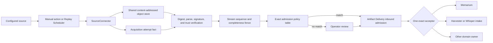
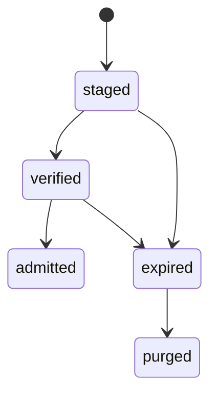

# Communication Resilience Through Pull-Based Artifact Acquisition

Status: promoted

Promoted to:

- `doc/project/40-proposals/088-pull-based-artifact-acquisition.md`

Proposal 088 is now the canonical implementation contract. Its decisions,
phase numbering, acceptance criteria, and tracker supersede the exploratory
ordering retained below.

Date: 2026-08-24

## Seed Image

The intuition came from a cathedral whose undercroft could be reached through
several tunnels, while footbridges led to selected windows. The building did not
depend on one entrance. In Orbiplex terms, a signed or sealed artifact should not
depend on one carrier either: several independently governed routes may lead to
the same admission boundary.

The architectural keyword is **communication resilience**. Besides receiving an
artifact pushed through Artifact Delivery, a node should be able to acquire the
same portable representation from an explicitly admitted source when its usual
carrier is unavailable. The first proof is deliberately narrow: operator paste
and a bounded local file. HTTP(S), mailboxes, Usenet, legacy byte transports, and
content-addressed pointers are later connector conformance cases, not separate
features promised by the first implementation.

This is not a proposal to trust arbitrary transports. It is a proposal to make
transport replaceable while keeping artifact identity, verification, admission,
classification, retention, and publication explicit.

## Strategy Used For This Memo

The design follows four complementary moves from the strategy notebook:

1. **Work backwards** from one valuable outcome: a node can apply a critical
   artifact despite the failure or absence of its usual delivery carrier.
2. **Separate** operation lifecycle, attempt outcome, staged-object lifecycle,
   verification, admission, memory, and publication.
3. **Eliminate** transport-specific semantics and duplicated metadata from the
   portable boundary.
4. **Check** the remaining seam against existing Artifact Delivery, INAC,
   Memarium, Replay Scheduler, Weak Signal Harvester, and Sensorium boundaries.

The counterweight is **combine**: reuse existing host-owned primitives after the
responsibilities have been separated, rather than creating a parallel stack.

## Why This Is Core Architecture

Pull-based acquisition directly supports existing constitutional and engineering
commitments:

- **local-first**: a node can recover useful artifacts without a live Orbiplex
  peer path;
- **exit and fork**: the same portable artifact can cross an operator-controlled
  filesystem, backup, removable medium, or independent network service;
- **protocol as a semantic contract**: identity, integrity, authorship,
  supersession, and admission remain independent of the byte carrier;
- **weaken centralization**: no federation relay, server class, or transport
  becomes the mandatory gate through which a valid artifact must pass.

The design succeeds only when an artifact whose absence matters can arrive by a
second route and produce the same authorized domain effect. Counting supported
URL schemes is not a success metric.

## Working Thesis

Orbiplex is already close to this model. What is missing is a neutral,
host-governed **Artifact Acquisition** plane between source-specific retrieval and
the existing Artifact Delivery inbound-admission boundary.

Artifact Acquisition should be a narrow companion to Artifact Delivery, not
another delivery transport profile. The companion owns source orchestration,
durable staging facts, and acquisition receipts. Artifact Delivery keeps inbound
admission and authoritative acceptor ownership.

The defining payload is not "something obtainable over Gopher". It is a critical
portable artifact that must remain obtainable when the normal route is down. The
first acceptance target is a fresh signed passport-revocation set. A crisis-seed
update and bounded Agora recovery records may follow. Weak-signal and public-
opinion inputs are important reuse cases, but they do not justify the safety
plane by themselves.

The essential distinctions are:

```text
source location != trust
acquisition != admission
staging != Memarium
admission != publication
artifact signature != truth of its content
```

A digest can prove byte identity. A signature can bind those bytes to an admitted
key. Encryption can hide content from the carrier. None alone proves freshness,
completeness, semantic truth, the right to retrieve, or the right to retain or
publish. Sequence, expiry, revocation, source policy, classification, and
downstream authority remain separate checks.

A source may carry an existing signed Orbiplex envelope. It may instead expose
ordinary bytes such as an e-mail, file, article, or web page. In the second case,
the node may sign an acquisition receipt stating only that it retrieved those
exact bytes from a declared source. The receipt must not impersonate the remote
author or certify the source claim as true.

## Ownership And Reuse Map

The implementation should add only the missing acquisition semantics:

| Capability | Existing owner | What Artifact Acquisition adds |
|---|---|---|
| Exact peer pull and push | INAC | Treats INAC as one source connector, not as the generic plane |
| Bounded HTTP(S), redirects, DNS, and no-ambient-egress enforcement | Host-owned bounded HTTP fetch | Reuses the mechanism for custody without making Sensorium the owner |
| Long-running work | Bounded Deferred Operations | Supplies acquisition-specific request and outcome data, not another operation machine |
| Recurring work | Replay Scheduler | Supplies source checkpoint and freshness policy, not another scheduler |
| Immutable content bytes | Existing `artifact-store:` primitive, if the seam audit confirms its lifecycle can be separated | Adds an append-only staging ledger and references, not a second blob store |
| Inbound admission and one exact acceptor per artifact class | Artifact Delivery | Calls the same registry after verification, never a private acceptor registry |
| Classified retention and forgetting | Memarium | Supplies an admitted derived artifact; acquisition success is not a memory write |
| Changing observation and latest-state publication | Sensorium and Sensorium Interfaces | May expose `probe` results, but never routes custody bytes through an observation |
| Candidate grouping and public gossip preparation | Weak Signal Harvester and Whisper | Reuses a staged digest through an explicit derived intake artifact |
| Portable backup and archival output | Existing exporters and `archival-package.v1` | Reuses the same lower-level at-rest package primitive in the reverse direction |

Three invariants keep the plane small:

- `inv-acquisition-reuses-admission-registry`: acquisition has no acceptor
  registry of its own;
- `inv-acquisition-reuses-replay-scheduler`: recurring acquisition has no private
  scheduler or sleep loop;
- `inv-acquisition-reuses-object-store`: acquisition owns a staging ledger, not a
  second cache or blob store for the same content bytes.

The practical Sensorium boundary fits in one question: does the consumer need
what the source says now, or the exact bytes that somebody signed earlier? The
first is observation; the second is custody. Therefore **`probe` may become an
observation; `fetch` may not**. An extractor may later derive an observation from
staged bytes without changing the custody record into an observation.

## Two Resilience Criteria

The first implementation must not hide a revocation-aggregation redesign inside
its acceptance test. The resilience proof is split into two independently named
criteria.

### Criterion A: carrier-independent safety effect

This criterion belongs to Phase 1:

1. The normal network carrier for a configured passport-revocation source is
   unavailable.
2. The operator obtains a newer signed revocation artifact from the same
   authority and supplies it through paste or a bounded local file.
3. Acquisition stages the exact bytes, verifies the inner artifact, checks the
   stream fence, and invokes the exact existing revocation acceptor.
4. The configured revocation projection becomes fresh and the dispatch gate
   refuses a passport named by the newly acquired revocation.
5. Restart between durable staging and admission converges without losing the
   package or applying it twice.

One economical implementation may atomically update the already configured
static revocation file and let its existing `refresh()` path rebuild the source.
That write must be a monotonic merge for append-only revocations, never a blind
replacement that can shrink the effective set. The durable stream high-water
mark must live outside the replaceable carrier file. This proves
`acquisition != admission` without changing aggregate crisis semantics.

### Criterion B: one logical source over several carriers

This is a separate hardening task, not part of Phase 1:

1. A stable logical revocation source is projected independently of its network,
   file, paste, or other carrier.
2. A fresh artifact arriving through one admitted carrier advances that logical
   source without appearing as an unrelated second source.
3. Aggregate freshness and the crisis detector evaluate the logical source, so a
   successful alternate carrier can resolve `revocation-freshness-stale` through
   the ordinary lifecycle rather than force-resolution.

This task repairs a general fragility: a stale physical route should not remain an
eternal veto after the same logical authority has been refreshed safely through
another route.

Both criteria must refuse an oversized package, malformed framing, digest
mismatch, bad inner signature, stream rollback, incomplete snapshot, wrong trust
domain, and artifact-family mismatch. Criterion A is complete without Criterion B.

## Proposed Layering



Branches after admission are alternatives selected by the derived artifact
class, not fan-out. One immutable staged digest may anchor several later actions,
but each action needs its own artifact schema, authority, idempotency key, and
single-owner admission.

V1 should keep a strict contract budget:

- `portable-artifact-package.v1` for content-neutral at-rest framing;
- `artifact-source.v1` for operator authority and source budgets;
- one discriminated `artifact-acquisition-record.v1` family for attempts,
  receipts, object-lifecycle facts, and typed terminal outcomes.

Do not create a separate connector-package format by default. Reuse supervised
middleware or P085 experiment-package declarations and add only the narrow source
operations they cannot already express.

### 1. Content-Neutral Portable Package

The portable package is an outer framing contract, not a second description of
the signed artifact. It carries only information that cannot be recovered from
the inner bytes:

- framing version and bounded payload encoding;
- exact content digest and size;
- for a multi-file form, a closed layout of digest-named blobs and their relative
  paths.

Artifact schema, artifact id, signer, signature, trust domain, stream id,
sequence, classification, and semantic provenance belong to the verified inner
artifact. They must not be repeated in the outer package. This avoids outer-to-
inner reconciliation rules and prevents unverified carrier metadata from routing
bytes to a privileged acceptor.

The order is fixed: apply byte and expansion caps, materialize the declared
layout, verify digest and size, parse the inner artifact safely, verify its
signature and trust chain, and only then select a family fence and acceptor. No
semantic routing may depend on unverified outer fields.

Small packages may contain bounded inline bytes. Larger packages may use one
manifest plus digest-named payload files. Both forms verify to the same content
identity. Export produces this same representation, so backup, removable media,
mail attachments, and independent byte servers need no transport-specific
conversion.

The current `archival-package.v1` is not this generic contract: it requires
question lineage, archival policy, publication scope, and a closed archival
artifact vocabulary. `artifact-delivery-envelope.v1` also couples an artifact
descriptor to a delivery plan. The seam audit should determine whether both can
reference a smaller shared framing primitive.

### 2. Source Declaration And Connector Contract

An operator-owned `artifact-source.v1` should declare:

- stable `source/id`, source revision or generation, and `connector/id`;
- locator or bounded local root;
- manual, scheduled, or both trigger modes;
- host-owned credential reference rather than embedded credentials;
- allowed inner schemas, stream ids, signing authorities, classification floor,
  and exact admission-policy table;
- byte, item, duration, concurrency, and staging-retention caps;
- source checkpoint or conditional-request policy;
- `freshness/max-staleness` as the single source freshness invariant when freshness is
  claimed;
- required `consumption/mode: read-only` in V1;
- explicit prohibition of source registration and publication authority.

Any other `consumption/mode` is refused as unsupported. Destructive acknowledgement
or deletion belongs to a later contract with its own journal and acceptance proof;
V1 does not carry a dormant two-phase consumption subsystem.

Content found at a source cannot widen source authority. A pointer inside an
artifact may propose another source, but cannot register or activate it. The
proposal enters an operator queue as an inert draft `artifact-source.v1`.

The replaceable behavior contract should be one small interface, irrespective of
future packaging:

```text
SourceConnector
  probe(source, checkpoint) -> metadata | unchanged | refusal
  fetch(source, checkpoint, limits) -> bytes | artifact-ref | refusal
  query_observability() -> connector-level minimum class
```

Query observability is primarily a property of the protocol and connector class,
not a value the operator repeats for every source. A connector declares the
minimum disclosure class, for example `none`, `locator-and-timing`, or
`locator-timing-and-identity`. Deployment-specific facts may raise the effective
class in the operator read-model but may never lower the connector's declaration.

The host retains filesystem, credential, network, DNS-resolution, and publication
authority. A connector receives only a narrow grant for one source and operation.
Protocol framing may require bounded parsing, for example to locate a MIME part,
but raw source bytes are staged first. Any extracted candidate is a second object
with an explicit derivation link.

A trivial fixture connector returning fixed bytes must implement this same
interface in Phase 1. Adding it must not modify verification, staging, admission,
scheduling, or domain acceptors. This is the executable regression test for the
connector boundary.

### 3. Orchestration Without A Second Scheduler

The host normalizes manual and scheduled triggers into one acquisition request,
authorizes the source and connector, launches a Bounded Deferred Operation, and
records the terminal attempt result. The acquisition domain owns source
checkpoints, change detection, retry meaning, and freshness. Replay Scheduler owns
wake-up time. Neither connector nor acquisition owns a private sleep loop.

For a scheduled source, cadence is derived from `freshness/max-staleness` plus bounded
backoff and jitter. Energy-saving posture may delay work only while that invariant
still holds. If the host cannot satisfy it, the source becomes explicitly stale
and existing fail-closed policy applies. Byte, item, duration, and concurrency
caps remain ordinary operation budgets; bytes-per-tick and minimum-cadence knobs
are not a separate energy subsystem.

Manual paste, local-file selection, `run now`, and scheduled execution all enter
the same request path. A manual action must not become a hidden Memarium write API.

### 4. Staging, Receipts, And Three Separate State Models

Fetched bytes need a place more durable than a transport cache but semantically
lower than Memarium. Acquisition combines a shared content-addressed object
primitive with an append-only staging ledger:

- object owner: shared host object store;
- object key: verified content digest;
- caps: global and per-source bytes and count;
- eviction: only when no live staging, admission, or export reference remains;
- restart: objects regain no authority merely by existing;
- ledger owner: acquisition runtime;
- ledger caps: count and age per source;
- restart: replay reconstructs pending verification and admission work.

The existing `artifact-store:{digest}` reference format is already canonical and
validated. The remaining seam question is whether the current store lifecycle can
be split into shared immutable objects and a delivery-cache lifecycle without
making cache state authoritative.

Receipt identity should be deterministic and domain-separated:

```text
receipt/id = "acquisition-receipt:sha256:" + sha256(canonical-json({
  "domain": "orbiplex/artifact-acquisition-receipt/v1",
  "source/id": source_id,
  "source/generation": source_generation,
  "content/digest": content_digest
}))
```

The construction uses canonical JSON, not ambiguous string concatenation. The
same source revision and content converge on one receipt after retry or restart;
another source or source generation yields a distinct receipt. Repeated polling
of unchanged content produces separate attempt facts, not conflicting bodies for
the same receipt. `source/generation` is the local revision of an activated source
declaration; it is not a third coordinate of the artifact stream fence.

The model has three small machines instead of one mixed lifecycle:

1. **Operation lifecycle** is owned by Bounded Deferred Operations and is not
   repeated here.
2. **Attempt outcome** is an immutable fact such as `receipt-created`,
   `unchanged`, `refused`, `failed-retryable`, or `unknown`.
3. **Staged-object lifecycle** is the only acquisition-owned state machine:



A verification or admission refusal is an attempt fact; it does not mutate the
object into a fictional `refused` state. The inert object remains staged or in
quarantine until expiry. No parser, Memarium writer, Harvester, or publisher may
observe partial bytes.

### 5. Verification, Anti-Rollback, And Admission

Verification records the source and host observation time, content digest and
size, inner schema and canonicalization profile, signer and trust result, expiry,
stream sequence, completeness boundary, classification, and bounded source
evidence. HTTP validators, file identity, mailbox UIDs, or DNS TTLs are retrieval
hints, never artifact authority.

For an existing signed envelope, verification preserves the original authoring
contract. For ordinary source bytes, the node produces a receiver-authored
acquisition representation with explicit source evidence. Any later Memarium
entry, Harvester finding, or gossip draft is a separately authorized derived
artifact.

Anti-rollback uses two stream coordinates: `stream/id` and monotonic `sequence`.
The host keeps a durable high-water mark per `(trust domain, artifact family,
stream id)`. The trust domain denotes the stable authority lineage, not one
signing key. A lower sequence is refused. An equal sequence is accepted only as
an exact idempotent replay of the already admitted digest; a different digest at
the same sequence is a conflict. Carrier freshness, file mtime, DNS TTL, and
operator paste cannot override the fence. Updating the fence and making the
domain effect visible is one transaction or one recoverable journaled transition.

Signer rotation does not reset the sequence. Authority transitions are justified
through the existing verified delegation, succession, or node-identity rotation
chain. A new signer without that chain cannot advance the stream, and a valid new
signer with that chain still cannot replay an older sequence. Snapshot families
also bind an authenticated completeness boundary such as a manifest root, item
count, and predecessor sequence.

The classification ingress API needs one cleanup before acquisition relies on it.
The current `unlabeled_import()` and `unlabeled_for_space()` helpers cross ingress
origin and quarantine reason in misleading ways. Introduce one parameterized
`Classification::ingress(surface, peer_ref, reason)` constructor and retain the
existing helpers only as thin, semantically correct wrappers. Acquisition then
uses the explicit ingress surface and `NoLabelAtIngress` without fabricating
remote authorship.

After verification, acquisition calls the same inbound admission and single-owner
acceptor registry used by Artifact Delivery. It neither loops through a fake
network delivery to the local node nor grows a second registry.

## One Pipeline, Two Operator Views

There is one authorization path:

```text
always stage -> verify -> evaluate exact admission table
             -> match: call the named existing acceptor
             -> no match: retain for operator review
```

`stage` and `admit-known` are views of this pipeline, not separate workflows:

| View | Admission table | Result |
|---|---|---|
| `stage` | Disabled or empty | Every verified artifact waits for explicit review |
| `admit-known` | Exact schema + issuer + classification + acceptor tuples | Exact matches proceed; every other artifact waits for review |

Successful fetch, verification, or admission never implies publication. The same
staged digest may anchor a Memarium artifact and, separately, a Harvester or
Whisper intake artifact. Each derived action has its own schema, authority,
idempotency key, and exact acceptor. Only an explicitly approved and signed
`public-gossip.v1` may later reach Agora.

## Connector Candidates, Not A Roadmap

| Source | Status | Safe shape | Minimum query observability |
|---|---|---|---|
| Fixed-byte fixture | Phase 1 boundary test | In-memory `SourceConnector`; no special path in the core | `none` |
| Operator paste | Phase 1 | Bounded portable package | `none` |
| Local file | Phase 1 | Host-bounded root, canonical path, no symlink escape | `none` outside the host |
| HTTP(S) | Phase 2 | Reuse bounded HTTP fetch and conditional refresh | At least locator and timing |
| Maildir / mbox | After Criterion A | Read-only enumeration and bounded MIME extraction | Local account and timing |
| IMAP / POP | Deferred protocol | V1 refuses consuming mode; future work needs a journaled acknowledgement contract | Locator, timing, and account identity |
| DNS | Deferred pointer only | Digest plus content-addressed locator, not payload chunking | Query name, timing, and resolver identity |
| NNTP / Usenet | Extension conformance case | Bounded read-only group and article cursor | Group, timing, and client metadata |
| FTP / Gopher | Extension conformance case | Opaque package bytes under strict caps | Locator and timing; often plaintext content |

Legacy transports may be useful because inner verification is independent of
transport integrity. They remain weaker in confidentiality, availability,
metadata privacy, and freshness. DNS is only a pointer carrier: it may advertise
a digest and locator while another bounded source carries the package.

The abstraction succeeds when an independently developed connector can be added
without changing package verification, staging, admission, scheduling, or domain
acceptors. Implementing every listed connector would instead suggest that the
boundary failed to remain small.

## Failure Modes To Preserve

- A carrier can withhold, reorder, replay, truncate, or serve stale bytes even
  when it cannot forge the inner signature.
- A correctly signed old snapshot can roll back safety state unless the stream
  high-water mark is durable and independent of carrier storage.
- A valid outer digest must not authorize semantic routing before the inner
  artifact and trust chain have been verified.
- A blind static-file replacement can remove prior revocations; the Phase 1
  shortcut is safe only as a monotonic merge with a separate fence.
- Validly signed content may still be malicious, false, unauthorized, or
  forbidden to retain.
- Deduplicating bytes or receipts must not erase attempt evidence or decisions
  made by different sources and source generations.
- Automatic scanning can become surveillance; connector-level query visibility,
  effective deployment disclosure, cadence, retention, and downstream use must
  remain visible.
- A generic connector can become ambient authority if a package chooses its own
  locator, credentials, source registration, or publication path.
- Staging can become shadow Memarium unless object and ledger ownership, keys,
  caps, expiry, eviction, and restart behavior are explicit.
- Automatic admission can become automatic publication unless those authorities
  remain separate by construction.
- Parsing before bounded materialization, quarantine, and digest verification
  exposes the node to active-content and expansion attacks.

## Open Questions

1. What is the smallest content-neutral framing primitive that
   `archival-package.v1`, Memarium backup, Artifact Delivery export, and future
   acquisition can share?
2. Should the first revocation artifact be an append-only delta, a complete
   snapshot with an authenticated completeness boundary, or both?
3. Can the current `artifact-store:` lifecycle be decomposed into shared immutable
   objects and a separate delivery-cache lifecycle while preserving existing
   references and garbage-collection safety?
4. Which exact schema, issuer, classification, and acceptor tuples may use the
   `admit-known` view, and must Memarium always require an additional named policy?
5. Should `SourceConnector` implementations be packaged as supervised middleware,
   P085 experiment packages, or either through one shared connector manifest?
6. What lineage may a public-gossip draft reveal without disclosing private source
   identities, mailbox structure, URLs, or predictable-content digests?

None of these questions blocks the content-neutral trait fixture or the
operator-paste and local-file Phase 1 seam. Questions 1-4 must be resolved before
the corresponding schema or production admission path is frozen.

## Next Actions

1. Before promoting this memo, audit Artifact Delivery inbound idempotency, the
   `artifact-store:` object/cache lifecycle, static revocation writes, Memarium
   quarantine/idempotency, backup manifests, `archival-package.v1`, P084 bounded
   fetch, Replay Scheduler, and the current classification ingress helpers. Record
   every coupled state change that needs one transaction or a recovery journal.
2. Specify `SourceConnector` and implement a fixed-byte fixture connector. Its
   conformance test must prove that adding the connector changes none of package
   verification, staging, admission, scheduling, or domain acceptors.
3. Freeze schema-first and refusal-first contracts for the content-neutral
   package, `artifact-source.v1`, and discriminated acquisition records. Negative
   fixtures must cover oversize, malformed layout, digest mismatch, bad inner
   signature, rollback, incomplete snapshot, family mismatch, duplicated semantic
   routing fields in the outer package, false remote-authorship claims,
   `consumption/mode` other than `read-only`, and content attempting to activate a
   source. Every refusal code declares retryable or terminal semantics.
4. Add the parameterized classification ingress constructor and correct wrappers
   before acquisition produces classified derived artifacts.
5. Build Phase 1 only as fixed fixture, operator paste, and bounded local file ->
   shared object -> deterministic receipt -> verification -> stream fence -> one
   admission-policy table -> one exact existing acceptor. Do not add a network
   connector or consuming-source protocol.
6. Run Criterion A for passport revocation, including restart between staging and
   admission and negative rollback cases. Require both fresh diagnostics for the
   configured source and dispatch refusal for the newly revoked passport.
7. Track Criterion B separately as "logical revocation source over multiple
   carriers". It may change revocation-source projection and crisis aggregation,
   but it must not retroactively expand Phase 1.
8. Add HTTP(S) as Phase 2 by reusing the existing bounded-fetch host. Consider a
   scheduled read-only Maildir connector only after Criterion A passes. Keep DNS,
   NNTP, FTP, Gopher, IMAP, and POP as extension or conformance items.
9. Add a later reuse acceptance proving that one staged digest can anchor separate
   Memarium and Harvester-derived artifacts while only an explicitly approved
   gossip artifact reaches Agora.

## Related Documents

- [Constitution](../../normative/40-constitution/en/CONSTITUTION.en.md)
- [Crisis detector runbook](../../ops/runbooks/crisis-detectors.md)
- [`archival-package.v1`](../../schemas/archival-package.v1.schema.json)
- [`artifact-delivery-envelope.v1`](../../schemas/artifact-delivery-envelope.v1.schema.json)
- [Artifact Delivery](../60-solutions/023-artifact-delivery/023-artifact-delivery.md)
- [Proposal 042: Inter-Node Artifact Channel](../40-proposals/042-inter-node-artifact-channel.md)
- [Proposal 036: Memarium](../40-proposals/036-memarium.md)
- [Proposal 039: Crisis Space Seed v1](../40-proposals/039-crisis-space-seed-v1.md)
- [Proposal 078: Weak Signal Harvester](../40-proposals/078-weak-signal-harvester.md)
- [Proposal 084: Sensorium Web Observation Connector](../40-proposals/084-sensorium-web-observation-connector.md)
- [Proposal 085: Operator-Sovereign Extensibility](../40-proposals/085-operator-sovereign-extensibility-and-experiment-packages.md)
- [Proposal 013: Whisper Social Signal Exchange](../40-proposals/013-whisper-social-signal-exchange.md)
- [Orbiplex Whisper](../60-solutions/011-whisper/011-whisper.md)
- [Replay Scheduler](../60-solutions/020-scheduler/020-scheduler.md)
