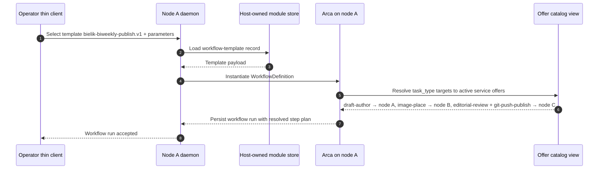
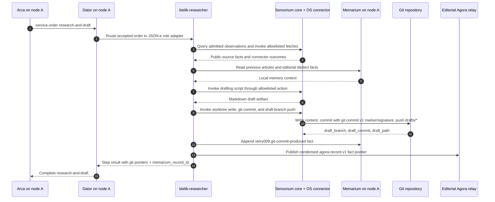
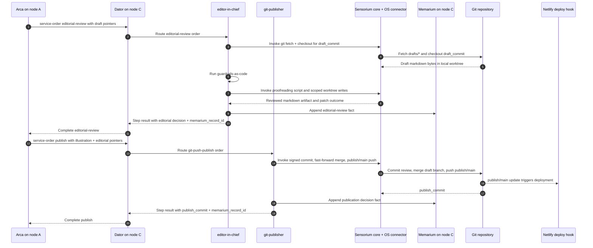
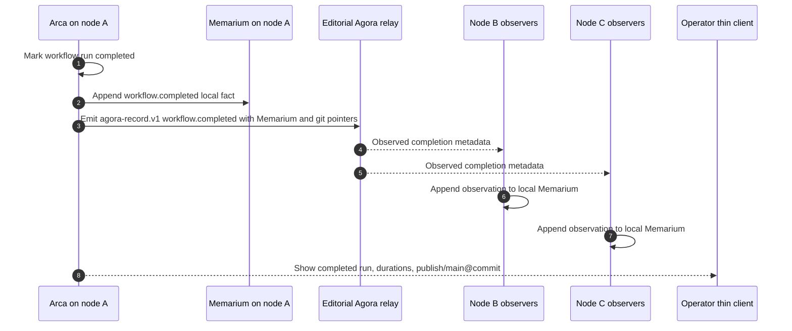

# Story 009: The magazine publishes itself — a three-node blogging pipeline about Bielik, conducted by Arca

## Summary

As the editor-in-chief of a small, opinionated technical blog about Polish
language models, I want my three Orbiplex nodes — each in a different
role — to run the publishing cycle for the **Bielik** language model on
their own: the first does research and writes a draft, the second
illustrates it, the third proofreads and pushes the finished material to
the branch that Netlify automatically deploys to the Hugo-built site.

My job as the operator is to watch the **Arca** audit channel and see
which step we are on, who signed what, and what landed in git — without
logging into a CMS panel, without manually gluing API calls, and without
one giant script that "does everything".

This story is a direct rendering of the seqnote
["The magazine publishes itself"](https://orbiplex.ai/seq/i-imagine-that/02-the-magazine-publishes-itself/)
into a minimal technical flow. The seqnote describes the vision: an
editorial team as a **swarm** of cooperating, specialised nodes with
shared memory (**Memarium**), instead of a single "AI panel" stitched
together from services. Here we step one floor down: three concrete
nodes, one concrete topic (the Bielik model), one concrete *workflow*
in **Arca**, one git repository tracked by Netlify.

## Current Baseline Used by This Story

The story relies on:

- **Proposal 029** (Workflow Template Catalog) — definition of
  `WorkflowDefinition` and the template catalog: the five steps of this
  story are named step templates, parameterised by topic (`Bielik`)
  and target repository.
- **Proposal 033** (Workflow Fan-Out and Temporal Orchestration) —
  temporal primitives (timeout, retry, deadline) for the research,
  illustration, review, publish, and verification steps. Host-managed
  fan-out is not used here; Arca uses an ordinary service-order DAG: after
  draft completion it can dispatch illustration and editorial review
  without waiting for either result, then publish waits for both branches.
- **Proposal 019** (Supervised Local HTTP/JSON Middleware Executor) —
  each of the three nodes runs its specialised LLM modules (research,
  illustration, review) as supervised middleware modules that publish
  active offers for declared task types.
- **Story 000** — node identity and participant identity, used by
  service offers and service orders once Arca selects a provider by
  `task_type`.
- **Story 008** — the pattern of a record signed by a participant key
  (`PrimaryParticipant`) as an auditable unit. Here the same mechanism
  is used by git commits: every commit is optionally signed by the key
  of the node that produced it, and the trace of that signature lands
  in the author node's Memarium.
- **Host-owned workflow step-completion read models and local Agora
  monitoring** — each daemon that executes a step accepts its own
  `workflow.step.completed` record and exposes it through
  `/v1/workflows/runs/{workflow_run_id}/steps/completed`. Arca may publish the
  final `workflow.completed` monitoring fact to local Agora. Each node still has
  its **own, local Memarium**; editorial memory continuity is **emergent** and
  is reconstructed from explicit pointers, not from a single shared store.

### Transport Stratification (architectural decision)

The story explicitly separates two channels:

- **Data plane = git.** The article body (markdown), illustrations,
  editorial corrections — everything that constitutes "the work" — is
  carried solely through the git repository
  (`drafts/bielik-…` ↔ `publish/main`). Bytes do not enter Arca, do not
  enter Agora, and do not enter Memarium as primary material.
- **Control plane = Arca + Agora.** Between steps we pass **pointers**:
  branch name, commit SHA, paths of added files, Memarium record
  identifier. These are small, control-shaped, auditable data — they
  fit naturally into `input_from_step` (proposal 029) and into an
  `agora-record.v1` record (story 008).

Therefore: **we introduce no new artefact transport**. Proposal 042
(INAC) and the `memarium-blob.v1` schema are the natural extension
direction whenever the editorial team wants to exchange artefacts
unfit for git (large binary assets, confidential briefs) — but this
story deliberately does not use them, to avoid adding code.

### Local action boundary: Sensorium OS connector

The story-specific role adapter does not spawn shell commands directly. In the
official reference profile, the roles `bielik-researcher`, `illustrator`,
`editor-in-chief`, `git-signer`, and `git-publisher` are implemented as
configuration-driven `json_e_flow` middleware instances that own only the
declarative task glue: render a Sensorium directive, call Sensorium, write a
Memarium fact, publish a workflow-step completion fact, and return a
pointer-sized service response. Any local operating-system action required to
carry out those tasks is mediated through `sensorium-core` and an allowlisted
Sensorium OS connector.

This includes git fetch/checkout/read paths, file writes in the local
worktree, signed commits, guarded pushes, narrow public-source
fetching when a source is represented operationally as an OS action,
**and the generative work itself — draft composition, image
generation, language proofreading — invoked as allowlisted OS
connector scripts that wrap the node's local model or tool**. Role
modules do not run language models, diffusion models, or shell
utilities in-process; each unit of work is a named `action_id` with a
declared script path, parameter schema, timeout, `cwd`, environment,
output caps, artifact capture, and incidental effects — all enforced
at the connector boundary. The role adapter remains a consumer of
`sensorium.directive.invoke`; it does not receive `sensorium.connector.invoke`
grants and does not bypass `sensorium-core`.
Connector-side validation failures use the shared
`sensorium-os-error-codes.v1` vocabulary and, when they reject an
otherwise executed action result, are also represented as
`ai.orbiplex.sensorium/action-invalid` observations so operator audit
does not depend on seeing a transient HTTP response.

This does **not** change the transport stratification above: article
bytes still flow through git, not through Arca, Agora, or Memarium.
Sensorium's OS connector is an enaction boundary for local operations,
not an artefact transport and not a parallel workflow engine.

The OS connector implementation remains program-agnostic. The fact that this
story uses actions with Git-shaped names does not mean the connector knows
Git. The operator-authored action catalog maps each `action_id` to a concrete
script or command invocation, argv shape, environment, class envelope, result
contract, and optional scoped signing lane. Git semantics — checkout, commit,
fast-forward, push, and how the commit payload is signed — live in those
configured scripts and in the JSON-e role adapter configuration that calls
them, not in the connector code.

The same rule applies to language-model use in this story. `llm-research`,
`draft-author`, proofreading, and any other model-assisted work are ordinary
workflow tasks that reach the model through an allowlisted OS connector action
wrapping a local script or tool. This gives the reference implementation a
working model path without adding model-specific code to Arca, Dator,
Sensorium-core, or the OS connector. A future dedicated LLM Sensorium connector
may be introduced as a more specialised backend, but it should preserve the
same stratification: the workflow names the task, the role adapter invokes a
declared capability/action, and model-specific prompt construction, runtime
choice, provider credentials, batching, and output shaping live in the
configured wrapper or connector, not in the orchestration layer.

**Action classification and authorization come from proposal 048.**
This story does not introduce its own trust model, its own allowlist
format, or its own signing ceremony for OS connector scripts. Each
action used here belongs to one of the classes defined in 048, and
the connector's action catalog is authorized via the sidecar-signature
mechanism from that proposal. Actions that need participant signatures, such
as signed git commits, declare a bounded signing lane in that same catalog
(for example one signature in the `git.commit.v1` domain); `sensorium-core`
and the host signer authorize that narrow signer grant for the spawned script.
The OS connector still only runs the configured process and never becomes a
signing oracle. In the fresh-install demo path, the
five story-009 scripts ship as **factory defaults** of the Sensorium
OS connector; after first start, the node materializes them into the
active configuration area and the node itself emits a node-signed
sidecar over the merged effective configuration — so the demo runs
without any operator signing ceremony, unless the operator edits the
connector configuration, at which point the standard operator
admittance flow from 048 applies.

The story assumes the three nodes (`A`, `B`, `C`) are running and that
each runs **Orbiplex Dator** as its supply-side marketplace facade.
Dator on each node publishes the node's active `service-offer.v1`
records for the relevant `task_type` values, accepts incoming service
orders from Arca on behalf of the local role capability provider, and enforces
the node's bounded acceptance posture (queue depth, concurrency, refusal when
the local role capability is not ready). In the phase-0 mapping,
`task_type` is projected onto `service/type` in the offer catalog. The
git repository and Netlify configuration exist; they are an external
artefact on which this story merely performs agreed operations.

Dator is not an executor of editorial semantics and not an actor on
the local operating system: it is the responder-side bridge between
Arca's dispatch and the specialised role capability provider named
below. In the reference profile that provider is `json_e_flow`, not a separate
HTTP daemon. All editorial work is expressed by the role adapter configuration
and the allowlisted scripts; all local OS actions are mediated through
`sensorium-core` and the allowlisted Sensorium OS connector.

For this demo, every offer published by every node's Dator has
`price = 0 ORC` (free). This is a deliberate simplification: the
subject of this story is editorial orchestration and local enaction,
not settlement. A zero price keeps the flow on a single path
(`service-offer.v1` → `service-order.v1` → accept → role capability →
result) without wiring holds, escrow, or ledger updates into the
story. Variants with non-zero pricing, negotiation, or settlement are
a separate story.

## Cast and Scene

- **Node A — *Bielik Researcher*.** Operator: `participant:did:key:z6MkA…`.
  Runs **Dator** which publishes its active offers for task types:
  `llm-research`, `draft-author`, `git-commit-draft`, and accepts
  Arca-dispatched service orders for them. Has access to **Sensorium** (connectors to
  external sources: arXiv, GitHub repositories, the Bielik mailing
  list, news feeds) and to the Sensorium OS connector for allowlisted
  local repo and source-fetch actions. The researcher module still
  receives admitted observations as facts; when it needs to touch the
  local worktree or invoke a source-fetching command, it does so through
  an Arca-mediated `sensorium.directive.invoke` path. Node A also has
  access to its **own, local Memarium** which retains
  this node's previous Bielik articles and observed facts published by
  nodes B and C (illustration decisions, editorial rulings, rejected
  variants returning from review).
- **Node B — *Illustrator*.** Operator: `participant:did:key:z6MkB…`.
  Runs **Dator** which publishes its active offers for task types:
  `draft-read`, `image-generate`, `image-place`,
  `git-commit-illustrated`, and accepts Arca-dispatched service orders
  for them. Has a local diffusion model and **its own
  local Memarium** in which it keeps its aesthetic policy (palette,
  *hero image* typography, allowed styles) — a policy fed by facts
  published by node C (acceptances and rejections of illustrations
  from previous runs) and by its own generative decisions. Git
  checkout, worktree writes, commit actions, and the image generation
  itself are mediated through the Sensorium OS connector: the
  diffusion model is wrapped as an allowlisted connector script, and
  the illustrator role module owns only the semantic decisions (what
  to depict, where to place each image, which aesthetic policy to
  apply) — not the in-process execution of the model.
- **Node C — *Editor-in-Chief*.** Operator: `participant:did:key:z6MkC…`.
  Runs **Dator** which publishes its active offers for task types:
  `draft-read`, `editorial-review`, `guardrails-as-code`,
  `git-push-publish`, and accepts Arca-dispatched service orders for
  them. `git-push-publish` is advertised by Dator **only on node C**;
  no other node's Dator publishes that offer. Holds the only key
  authorised to *push* to the branch tracked by Netlify
  (`publish/main`). Has the editorial line rules installed as code
  (proposal 026 §*Guardrails-as-code* — a non-functional contract at
  node level, not a content-schema). Review checkout, signed commit,
  merge, and push actions are mediated through the Sensorium OS
  connector, with `git-push-publish` allowlisted only on node C.
- **Arca**, as a workflow module running on **one** of the nodes (in
  this story: on node A as host, but that is just the engine's
  location — Arca is *agnostic* about where the participants of the
  defined steps physically live; it finds them through task-type offer
  lookup).
- **The git repository** `git@bielik-blog:orbiplex/bielik-blog.git`
  with Hugo structure (`content/pl/log/<year>/`,
  `content/en/log/<year>/`, `static/img/posts/`, `config.toml`). The `drafts/*` branch is for drafts and working
  versions; the `publish/main` branch is the only one Netlify deploys.
- **Three local Memariums** — one per node. Each stores its own facts
  (what the given node itself produced or decided) and any observations it is
  explicitly allowed to import through workflow, local relay, or INAC contracts.
  "Editorial memory" as a whole is an **emergent view** composed of these three
  Memariums plus workflow step-completion pointers; it does not exist as a
  single shared store nor a single authoritative back-end. Consistency is
  achieved through append-only records, not through shared state.

The topic of this story is the publishing cycle: **"What's new with
Bielik"** — a periodic article summarising changes, *releases* and
community signals around the **Bielik** model on a biweekly cadence.

## Operator Setup From Scratch

This section is an operational runbook for an operator who wants to
bring the story up from an empty environment. It deliberately keeps
the Git, model, and publishing semantics in operator-authored scripts
and configuration. Orbiplex components provide orchestration,
capability mediation, storage, audit, and local supervision; they do
not learn the semantics of Git, Netlify, Bielik, or a particular LLM.

There are three supported setup shapes:

- **Reference skeleton on one host.** One daemon starts Arca, Dator,
  in-process JSON-e role flows (`story009.json-e-flow.roles`),
  `sensorium-core`, `sensorium-os`, Memarium, and Agora locally. This is
  the fastest path for development and for verifying the contract.
- **Persistent one-laptop operator pack.** Three durable node profiles live on
  one operator machine with distinct control, WSS, and Node UI ports. This uses
  the same three-node topology as the production story while keeping the setup
  local and repeatable.
- **Three-computer editorial deployment.** Node A, B, and C each run
  their own daemon, Dator, Sensorium, Sensorium OS connector, and
  local Memarium. Arca may run on node A. Only node C advertises and
  authorises `git-push-publish`.

### Production Target Decisions

The production-oriented variant of story-009 uses these decisions:

- **Git data plane:** the editorial repository is a real GitLab repository,
  reachable by the operator environment as
  `git@bielik-blog:orbiplex/bielik-blog.git`. The `bielik-blog` SSH host alias
  and private deploy key are operator-managed machine configuration, not
  Orbiplex configuration and not repository content.
- **Publishing branch:** `publish/main` remains the only publication branch.
  Node C is the only node allowed to push it.
- **Hugo content layout:** Polish articles live under
  `content/pl/log/<year>/`; English translations live under
  `content/en/log/<year>/`.
- **Deployment target:** Netlify, or an equivalent deployment system, watches
  the publishing branch. The verifier checks the public site URL, expected under
  `https://bielik.orbiplex.ai/`, for example
  `https://bielik.orbiplex.ai/pl/log/2026/bielik-13B-instruct/`. Netlify setup
  is external infrastructure and is not automated by this story.
- **Operator model:** one operator manages the three nodes and signs the
  relevant local authority artifacts.
- **Role provider model:** story-009 officially uses `json_e_flow` role
  providers. The former HTTP-local role-module shape is legacy/deprecated for
  this story.
- **Model wrappers:** real LLM or diffusion use is deliberately outside the
  Orbiplex core. The allowlisted script may use an OpenRouter-compatible API URL
  and optional API key; if those are unset or empty, it must fall back to static
  deterministic text.
- **Publish approval:** `git-push-publish` is operator-gated. The UI should show
  an `Awaiting acceptance` item containing the requesting component, requested
  action, action content digest/summary, and `[Sign]` / `[Reject]` actions. The
  accepted path is an operator signature over the approval artifact.
- **Discovery trust:** production discovery is capability-passport and issuer
  policy based. Harness `trusted_node_ids` remain an override, not the final
  trust model.
- **Provider choice:** Arca may select providers automatically, but the operator
  must be able to override the selected provider for a run.
- **Completion view:** the production UI aggregates per-node
  `/v1/workflows/runs/{workflow_run_id}/steps/completed` control read models.
  There is no Agora-backed synthetic step-completion store.
- **Monitoring fact:** Arca still emits `workflow.completed` as a local Agora
  monitoring/history fact.
- **Audit model:** the production audit bundle is composed from Memarium facts,
  workflow step-completion records, signer traces, and an exportable run bundle.
- **Retention:** Memarium facts are retained indefinitely. Sensorium artifacts
  use TTL. Script stdout/stderr artifacts are retained for one day by default.

### Prerequisites

Before installing Orbiplex on the machines, prepare:

- Three hostnames or machine labels: `node-a`, `node-b`, `node-c`.
- One Git repository with a Hugo-compatible layout. For the production target,
  the remote is `git@bielik-blog:orbiplex/bielik-blog.git`, Polish posts live
  under `content/pl/log/<year>/`, English translations live under
  `content/en/log/<year>/`, and the publishing branch is `publish/main`.
- A branch policy for the publish branch. In the reference deployment,
  this may be a local bare repository with a `pre-receive` hook. In a
  real deployment, use repository permissions or hooks so only node C
  can update `publish/main`.
- A Netlify site or equivalent deployment target watching only
  `publish/main`. Netlify is not part of the Orbiplex control plane;
  it is an external observer of the Git data plane.
- Participant/operator identities for the three nodes. A fresh demo
  can generate these through the Node UI; a real deployment should
  import or create them intentionally and store recovery material.
- Scripts or wrappers for every local action. The bundled reference
  scripts are deterministic fixtures; real LLM, image, review, and Git
  operations should be installed as allowlisted OS connector scripts.

### Software Required on Every Computer

Install the same baseline software on each node host:

```sh
git --version
python3 --version
cargo --version
```

Required packages:

- Rust toolchain with Cargo, sufficient to build the daemon, Node UI,
  and the Rust middleware services.
- Python 3.11 or newer.
- Python `jsonschema`, used by the Sensorium reference modules for
  JSON Schema validation at the boundary.
- Git CLI.
- Platform build tools (`clang`/Xcode Command Line Tools on macOS,
  equivalent compiler toolchain on Linux).

Typical development bootstrap:

```sh
cd node
python3 -m pip install --user jsonschema
cargo build -p orbiplex-node-daemon -p orbiplex-node-ui -p orbiplex-node-agora-service
cargo test -p orbiplex-node-daemon --test story_009_sensorium_role_dispatch
```

If a machine is expected to run real LLM or image generation tools,
install those runtimes outside Orbiplex and expose them through
operator-authored wrapper scripts. The role adapters and Sensorium OS
connector should still see only an `action_id`, a script path, JSON
parameters, and a JSON result contract.

### Base Node Materialisation

On each computer, create a separate data directory and materialise the
factory configuration:

```sh
cd node
export ORBIPLEX_NODE_DATA_DIR="$HOME/.orbiplex-story009/node-a"
cargo run -p orbiplex-node-daemon -- materialize-config --data-dir "$ORBIPLEX_NODE_DATA_DIR"
cargo run -p orbiplex-node-daemon -- check-config --data-dir "$ORBIPLEX_NODE_DATA_DIR"
```

Start the node after the overlay config is in place:

```sh
cargo run -p orbiplex-node-daemon -- run --data-dir "$ORBIPLEX_NODE_DATA_DIR"
```

If the deployment uses the operator control helper, the equivalent
operator command is:

```sh
python3 tools/orbiplex-node-control.py --data-dir "$ORBIPLEX_NODE_DATA_DIR" up
```

The `up` helper starts the daemon and, when `node_ui.start_with_node`
is true, the co-located Node UI. In a foreground-only development
run, start Node UI from a second terminal if it is not started by the
helper.

Use `node-b` and `node-c` data directories on the other machines. If
all three nodes are simulated on one host, use distinct data
directories and distinct loopback ports in each overlay. If the nodes
run on separate machines, the bundled loopback ports may remain the
same because they are local to each host.

For the persistent one-laptop profile, the operator helper in the node
repository creates:

```text
$HOME/.orbiplex/bielik-blog-A
$HOME/.orbiplex/bielik-blog-B
$HOME/.orbiplex/bielik-blog-C
$HOME/.orbiplex/bielik-blog-data
```

`bielik-blog-data` owns the shared Git clone, rendered staging profiles, local
WSS peer-discovery material, audit exports, and logs. The helper keeps daemon
startup and Node UI startup separate so all three UIs can run at once:

- node A UI: `http://127.0.0.1:47990`
- node B UI: `http://127.0.0.1:48090`
- node C UI: `http://127.0.0.1:48190`

In this local shape, node A should discover role providers through node B and
node C Seed Directory endpoints by default, not by querying only itself. The
reference helper therefore renders node A with Seed Directory endpoints for
node B and node C. Missing Sensorium OS action-catalog sidecars may be reported
as `awaiting_operator_signature` during initialization before the daemons are
started; daemon startup materializes them as node-self signed bootstrap
sidecars. A present-but-stale sidecar is not auto-replaced and requires an
explicit operator decision in Node UI. In that case the daemon may enter
Local Readiness Gate (proposal 050): control/UI endpoints stay live, but
story middleware is not started until the operator signs or rejects the changed
catalog.

The daemon writes operator-edited config fragments under:

```text
<data_dir>/config/*.json
```

Bundled middleware config is seeded there when `seed_config` is true.
Operator fragments should use higher lexical names such as
`70-story009.json` so they override generated defaults without
editing factory files.

### Common Node Configuration

Each node participating in the story needs these components enabled:

- `dator` — publishes local zero-price offers and routes accepted
  service orders to the role capability provider.
- `middleware_json_e_flow_services` — owns the story-specific role adapter
  configuration for `role.bielik-*.execute`; this replaces the old
  supervised `story009_roles` HTTP-local adapter in the official profile.
- `sensorium_core` — mediates Sensorium directives, validates
  parameters, records outcomes, stores observations, and dispatches to
  connectors.
- `sensorium_os` — executes allowlisted scripts or processes. It must
  never be granted directly to consumers.
- `agora_service` — local relay used for Sensorium observation topics
  and the final `workflow.completed` record.
- Memarium — enabled as a host capability in the daemon; every node
  keeps its own local store.

Minimal overlay shape:

```json
{
  "agora_service": {
    "enabled": true,
    "relay_id": "story009-node-a-local",
    "role": "local",
    "relay_domain": "node-a.local"
  },
  "sensorium_core": {
    "enabled": true,
    "publish_to_agora": true,
    "agora_base_url": "http://127.0.0.1:47991"
  },
  "sensorium_os": {
    "enabled": true,
    "allowed_workdirs": ["/srv/orbiplex/story009/blog-bielik"],
    "allowed_script_roots": ["actions"]
  },
  "story009_roles": {
    "enabled": false
  },
  "middleware_json_e_flow_services": {
    "story009-role-bielik-researcher-json-e-flow": {
      "module_id": "story009.json-e-flow.roles",
      "bindings": {
        "role_capability_id": "role.bielik-researcher.execute",
        "action_id": "story009.draft.compose"
      }
    }
  }
}
```

The JSON example above is intentionally partial: a real `json_e_flow` service
entry also declares `component_id`, `template_id`, context projection, helper
profile, allowed host calls, limits, and static flow steps. The operator pack in
`node/tools/acceptance/story-009-operator` renders the full entries.

The `allowed_workdirs` entry must point at the local checkout used by
that node. The reference defaults intentionally ship with an empty
workdir allowlist, so OS actions fail closed until the operator
chooses the workspace.

For private repositories, do not rely on ambient `HOME`. The OS
connector intentionally starts scripts with a minimal environment.
Declare any needed credential helper, SSH command, deploy key path, or
non-interactive Git setting in the action catalog entry. At minimum,
story actions should set:

```json
{
  "GIT_TERMINAL_PROMPT": "0",
  "GIT_ASKPASS": "/bin/true"
}
```

For the GitLab target above, the operator machine may provide an SSH alias such
as `bielik-blog` in `~/.ssh/config`. If the OS action catalog needs to pin that
route explicitly, set a non-interactive `GIT_SSH_COMMAND`, for example:

```json
{
  "GIT_SSH_COMMAND": "ssh -F /home/orbiplex/.ssh/config -o IdentitiesOnly=yes"
}
```

Private deploy keys are deployment secrets. They may be installed on trusted
operator/developer machines, but they must not be committed to Orbiplex or to
story content repositories.

### Node A Configuration

Node A hosts the operator-facing Arca workflow in this story and owns
the drafting role.

System setup:

- Clone or initialise the editorial repository checkout under node A's
  allowlisted workdir.
- Grant node A read/fetch access to the origin and permission to push
  draft branches if the workflow uses remote draft branches.
- Do not grant node A permission to push `publish/main`.

Dator offers:

- Keep or declare `draft-author`.
- In a fuller deployment, add split offers for `llm-research`,
  `git-commit-draft`, or other specialised task types only if the
  workflow template references them explicitly.
- Remove `git-push-publish` from node A's active Dator offer catalog.

Sensorium OS action catalog:

- Keep actions needed by the drafting path, such as
  `story009.draft.compose`.
- Add real LLM/source-fetch wrapper actions as needed.
- Do not include a publish action that can update `publish/main`.

UI/operator steps on node A:

- Start the daemon and Node UI.
- Create or import the participant identity for node A.
- Confirm the node-operator binding if the UI asks for it.
- Inspect the Dator offers and verify that `draft-author` is active.
- Import or create the `bielik-biweekly-publish.v1` workflow template.
- Start the workflow from the template with repository, branch, topic,
  and cadence parameters.

### Node B Configuration

Node B owns illustration and image placement.

System setup:

- Clone the editorial repository under node B's allowlisted workdir.
- Grant read/fetch access to the origin and write access only to the
  branches needed for illustration commits.
- Install the image-generation wrapper or deterministic fixture script
  under an allowlisted script root.

Dator offers:

- Keep or declare `image-place`.
- If the workflow later splits image generation from placement, add
  `image-generate` and `git-commit-illustrated` as separate offers.
- Do not advertise `git-push-publish`.

Sensorium OS action catalog:

- Keep actions needed by the illustration path, such as
  `story009.image.place`.
- Add the real image-generation wrapper action if this node uses a
  model instead of the deterministic fixture.
- Do not include the publish action.

UI/operator steps on node B:

- Start the daemon and Node UI.
- Create or import the participant identity for node B.
- Confirm or install the module grants needed by Dator, Sensorium,
  Sensorium OS, and Memarium.
- Inspect Dator and verify that `image-place` is active and priced at
  `0 ORC` for the demo.
- Inspect Sensorium OS and verify that only node B's intended actions
  are present in the effective catalog.

### Node C Configuration

Node C owns editorial review, publication verification, and the only
publish authority.

System setup:

- Clone the editorial repository under node C's allowlisted workdir.
- Install credentials or repository policy allowing node C, and only
  node C, to update `publish/main`.
- Configure the publish branch protection or hook before running the
  workflow. The negative path is part of the story: a node A/B publish
  attempt must fail.

Dator offers:

- Keep or declare `git-push-publish`.
- Keep or declare `publication-verifier` if verification is executed
  by node C.
- Do not advertise drafting or illustration offers unless the operator
  deliberately wants a single-node fallback demo.

Sensorium OS action catalog:

- Keep `story009.review.publish`.
- Keep `story009.publication.verify`.
- Include the bounded signing lane for commit-producing actions:
  `signing.allowed_domains = ["git.commit.v1"]`.
- Treat the publish action as operator-gated outside the demo path.
  In production, an operator-edited catalog should be authorised by an
  operator signature rather than relying only on node-signed factory
  bootstrap.
- Require an explicit operator approval for each `git-push-publish` request in
  production. The UI should present `Awaiting acceptance` with the requesting
  component id, action id, target branch, content digest/summary, and `[Sign]`
  / `[Reject]` buttons. `[Sign]` produces the approval signature consumed by the
  publish action; `[Reject]` records a structured refusal.

UI/operator steps on node C:

- Start the daemon and Node UI.
- Create or import the participant identity for node C.
- Confirm or install the grants for publishing, signing, Sensorium,
  and Memarium.
- Inspect Dator and verify that `git-push-publish` is active only here.
- Inspect Sensorium OS and verify that the publish action points to
  the intended script, hash, workdir, branch, and signing domain.

### Action Catalog and Sidecar Authorisation

The action catalog is the operator's declaration of what local actions
exist. For story-009, the reference actions are:

- `story009.draft.compose`
- `story009.image.place`
- `story009.review.publish`
- `story009.publication.verify`

Each action declaration should include:

- `action_id`
- `script_path`
- `sha256` for the script file when the action is not purely
  throw-away development work
- `parameters_schema`
- `result_schema`
- `limits`
- `cwd_param`
- `env`
- `result_contract.pointer_fields`
- `connector_incidental_effects`
- optional `signing.allowed_domains`

Fresh factory defaults may be node-signed during bootstrap. Once the
operator edits the catalog, the effective catalog must be re-authorised
through the sidecar mechanism described in proposal 048. If
`require_action_catalog_signature` is enabled and the sidecar hash does
not match the effective catalog, `sensorium-os` must refuse to expose
the action. The check is not only a startup ceremony: dispatch must
also re-read or revalidate the active sidecar so an operator change on
disk cannot leave a stale in-memory authorization silently active.

Result contracts are deliberately strict about pointer fields. If an
action declares `result_contract.pointer_fields`, every listed field
must be present in the script's JSON result. Missing pointer fields are
reported as `result-pointer-missing`, and schema mismatch is reported
as `result-schema-invalid`; both produce an action-invalid observation
for audit symmetry.

### UI Checklist Before Running the Workflow

In the Node UI on each node:

1. Open **Identity** and create or import the participant key.
2. Confirm that the node identity and participant identity are present.
3. Open **Components** and confirm that Dator, Sensorium Core,
   Sensorium OS, Story 009 Roles, and Agora Service are running where
   expected.
4. Open the component or config view and inspect the effective
   `sensorium_os.action_catalog`.
5. Open the Dator/offers view and confirm the node-specific offers.
6. On node A, open the workflow templates view, instantiate
   `bielik-biweekly-publish.v1`, and start the run.
7. Watch the workflow run view. Each step should carry only pointer
   fields: branch, commit, path, `memarium_record_id`, and Sensorium
   outcome/observation identifiers.
8. Open the JSON-e flow middleware view when diagnosing role adapters. It should
   show the role capability, allowed host calls, trace retention policy, recent
   trace summaries, and per-step request/response digests without exposing raw
   secret-bearing context.
9. When the publish step reaches the C7 gate, confirm that the UI shows
   `Awaiting acceptance` with the requesting component, action id, target
   branch, and content digest/summary; choose `[Sign]` only if the request is
   expected.
10. After completion, inspect Agora and verify a
   `workflow.completed` record with links to the three commit facts
   plus the publication verification fact.
11. Inspect each local Memarium. The facts should be append-only and
   local to the node that performed the step.
12. Open the step-completion aggregation view, or run
   `story-009-step-completions.py --expect-complete`, and verify that all five
   expected step ids are present exactly once.

### CLI Smoke Test

Before using real machines, run the reference skeleton from the node
workspace:

```sh
cd node
python3 tools/acceptance/story-009-reference-skeleton.py
cargo test -p orbiplex-node-daemon --test story_009_sensorium_role_dispatch -- --nocapture
```

The smoke test should show:

- a draft commit,
- an illustration commit,
- an accepted review/publish commit,
- a rejected review probe,
- a publication verification fact,
- Sensorium outcomes and observations,
- and reconstruction data derived from workflow pointers and Memarium
  fact identifiers.

If this passes but a real node fails, the usual causes are
configuration-layer issues: missing workdir allowlist, stale action
catalog sidecar, absent Git credentials, wrong Dator offer set, or a
publish action accidentally enabled on the wrong node.

## Example Sensorium OS Connector Scripts

The Sensorium OS connector does not call a Python function in-process.
It starts an allowlisted program declared in the action catalog. For
`os.script.run`, the reference connector invokes the script as:

```text
<interpreter> <script_path> --params-json '<json object>'
```

The script contract is intentionally narrow:

- input is the JSON object passed in `--params-json`;
- stdin is not used;
- stdout must contain one JSON object matching the action's
  `result_schema`;
- stderr is diagnostic text and must not be parsed as the result;
- non-zero exit status means the action failed before producing a
  valid result;
- every field listed in `result_contract.pointer_fields` must be
  present in the JSON result.

The examples below are deliberately domain-local. Sensorium OS does
not know what "article", "editor", "Bielik", or "published" means.
Those meanings live in the allowlisted script, its parameter schema,
its result schema, and the role module that interprets the result.

### Example 1: Content Producer Script

This shape fits an action such as `story009.draft.compose`. The script
receives simple JSON parameters, writes placeholder article content to
a file inside the allowlisted workdir, and returns pointers plus small
metadata. The article bytes stay in the filesystem/Git data plane; the
workflow sees only pointers.

```python
#!/usr/bin/env python3
"""Minimal story-009 content producer for a Sensorium OS action."""

from __future__ import annotations

import argparse
import hashlib
import json
import os
import urllib.request
from pathlib import Path
from typing import Any


def parse_params() -> dict[str, Any]:
    parser = argparse.ArgumentParser()
    parser.add_argument("--params-json", required=True)
    return json.loads(parser.parse_args().params_json)


def sha256_text(text: str) -> str:
    digest = hashlib.sha256(text.encode("utf-8")).hexdigest()
    return f"sha256:{digest}"


def maybe_generate_with_openrouter(prompt: str) -> str | None:
    api_url = os.environ.get("OPENROUTER_API_URL", "").strip()
    api_key = os.environ.get("OPENROUTER_API_KEY", "").strip()
    model = os.environ.get("OPENROUTER_MODEL", "").strip() or "openrouter/auto"
    if not api_url:
        return None

    request_body = json.dumps(
        {
            "model": model,
            "messages": [
                {"role": "system", "content": "Write a concise Hugo blog draft."},
                {"role": "user", "content": prompt},
            ],
        }
    ).encode("utf-8")
    headers = {"Content-Type": "application/json"}
    if api_key:
        headers["Authorization"] = f"Bearer {api_key}"
    request = urllib.request.Request(api_url, data=request_body, headers=headers, method="POST")
    with urllib.request.urlopen(request, timeout=60) as response:  # nosec: operator-configured endpoint
        payload = json.loads(response.read().decode("utf-8"))
    return payload["choices"][0]["message"]["content"]


def main() -> None:
    params = parse_params()

    repo = Path(params["repo"]).resolve()
    draft_path = Path(params.get("draft_path") or "content/pl/log/2026/bielik-draft.md")
    title = str(params.get("title") or "What is new with Bielik")
    topic = str(params.get("topic") or "Bielik")

    output_path = repo / draft_path
    output_path.parent.mkdir(parents=True, exist_ok=True)

    prompt = f"Write a short Hugo markdown draft about {topic}. Title: {title}."
    generated = maybe_generate_with_openrouter(prompt)
    body = generated or f"""{topic} has seen a careful week of small, useful improvements.
The model ecosystem is becoming easier to test, easier to discuss, and easier to reuse.
This placeholder paragraph stands in for a real local LLM wrapper or editorial script.
"""

    content = f"""---
title: "{title}"
draft: true
tags: ["bielik", "llm", "polski"]
---

{body}
"""

    output_path.write_text(content, encoding="utf-8")

    result = {
        "outcome": "ok",
        "draft_path": str(draft_path),
        "content_sha256": sha256_text(content),
        "content_chars": len(content),
        "summary": {
            "lang": "en",
            "text": "Placeholder Bielik draft content was produced.",
        },
    }
    print(json.dumps(result, ensure_ascii=False, sort_keys=True))


if __name__ == "__main__":
    main()
```

Minimal action-catalog expectations for this producer:

- `parameters_schema` requires at least `repo` and may accept
  `draft_path`, `title`, and `topic`;
- `result_schema` requires `outcome`, `draft_path`,
  `content_sha256`, and `content_chars`;
- `result_contract.pointer_fields` should include at least
  `draft_path` and `content_sha256`.

### Example 2: Editor / Fulfillment Validator Script

This shape fits an action such as `story009.publication.verify` or a
lightweight editorial gate before publish. The script does not know
Arca. It reads the file indicated by the parameters, applies one
simple rule, and returns a structured decision. Here the rule is
intentionally trivial: the text is fulfilled only if its length is at
least `min_chars`.

```python
#!/usr/bin/env python3
"""Minimal story-009 editor/fulfillment validator for a Sensorium OS action."""

from __future__ import annotations

import argparse
import json
from pathlib import Path
from typing import Any


def parse_params() -> dict[str, Any]:
    parser = argparse.ArgumentParser()
    parser.add_argument("--params-json", required=True)
    return json.loads(parser.parse_args().params_json)


def main() -> None:
    params = parse_params()

    repo = Path(params["repo"]).resolve()
    draft_path = Path(params["draft_path"])
    min_chars = int(params.get("min_chars") or 600)

    text = (repo / draft_path).read_text(encoding="utf-8")
    char_count = len(text)
    fulfilled = char_count >= min_chars

    result = {
        "outcome": "ok" if fulfilled else "rejected",
        "editorial_decision": "accepted" if fulfilled else "rejected",
        "reviewed_path": str(draft_path),
        "content_chars": char_count,
        "verification": {
            "status": "fulfilled" if fulfilled else "not_fulfilled",
            "kind": "content-length",
            "min_chars": min_chars,
            "actual_chars": char_count,
        },
        "rejection_reason": None if fulfilled else "content is shorter than the configured minimum",
    }
    print(json.dumps(result, ensure_ascii=False, sort_keys=True))


if __name__ == "__main__":
    main()
```

Minimal action-catalog expectations for this validator:

- `parameters_schema` requires `repo` and `draft_path`, and may accept
  `min_chars`;
- `result_schema` requires `outcome`, `editorial_decision`,
  `reviewed_path`, `content_chars`, and `verification.status`;
- the role module or workflow fulfillment policy maps
  `/verification/status == "fulfilled"` to task completion;
- if `result_contract.pointer_fields` includes `reviewed_path`, the
  field must always be present, including rejection cases.

## Sequence of Steps

### Step 0: Operator launches the workflow from a template

The operator opens a *thin client* over node A and selects a workflow
template from the catalog (proposal 029):

```
template_id: bielik-biweekly-publish.v1
parameters:
  topic: "Bielik"
  cadence_window: { from: "2026-04-03", to: "2026-04-17" }
  repo: "git@bielik-blog:orbiplex/bielik-blog.git"
  draft_branch_prefix: "drafts/bielik-"
  publish_branch: "publish/main"
  hugo_section: "posts"
```

Arca on node A builds a concrete `WorkflowDefinition` instance from
those parameters: five steps, each with a declared `task_type` target
(rather than a hard-coded participant). At runtime Arca asks the
offer-catalog surface who currently offers the corresponding
`service/type`. Thanks to this, if node B fails and its role is taken
over by another node offering `image-generate` / `image-place`, the
*workflow* needs no editing.

```json
{
  "workflow_id": "wf:bielik-biweekly:01JRZ…",
  "steps": [
    {
      "id": "research-and-draft",
      "target": { "resolve": "task_type", "task_type": "draft-author" },
      "input": { "topic": "Bielik", "cadence_window": { … } },
      "timing": { "timeout": "PT90M", "on_timeout": "fail" }
    },
    {
      "id": "illustrate",
      "target": { "resolve": "task_type", "task_type": "image-place" },
      "input_from_step": "research-and-draft",
      "timing": { "timeout": "PT30M", "on_timeout": "fail" }
    },
    {
      "id": "editorial-review",
      "target": { "resolve": "task_type", "task_type": "editorial-review" },
      "input_from_step": "research-and-draft",
      "depends_on": ["research-and-draft"],
      "timing": { "timeout": "PT30M", "on_timeout": "fail" }
    },
    {
      "id": "publish",
      "target": { "resolve": "task_type", "task_type": "git-push-publish" },
      "input_from_step": ["illustrate", "editorial-review"],
      "depends_on": ["illustrate", "editorial-review"],
      "timing": { "timeout": "PT60M", "on_timeout": "fail" },
      "retry": { "max_attempts": 1, "backoff_seconds": 300 }
    },
    {
      "id": "verify-publication",
      "target": { "resolve": "task_type", "task_type": "publication-verifier" },
      "input_from_step": "publish",
      "depends_on": ["publish"],
      "timing": { "timeout": "PT10M", "on_timeout": "fail" }
    }
  ]
}
```

The five `timing.timeout` values are a concrete application of
*temporal orchestration* from proposal 033: if a provider does not
return a result within the time window, the step is marked
`timed_out` and the *workflow* halts with that status. There is no
silent rescue and no fallback to another node — the operator is
supposed to see that something is stuck.

### Communication Workflow

The diagrams below are intentionally **vertical transmission
scenarios**, not one large component graph. Each scenario shows the
messages that cross a boundary: either inside one node or between two
nodes. The article bytes are never passed through Arca or Agora; only
pointers, order envelopes, facts, and audit identifiers move through
the control plane.

#### Step 0 — local workflow instantiation on node A



#### Step 1 — node A researches, drafts, signs, and publishes a draft fact



#### Step 2 — node B receives only pointers, pulls bytes through git, and returns illustration pointers


#### Steps 3 and 4 — node C reviews through git, then performs the only publish push



#### Step 5 — verified workflow completion is announced as metadata, not content



### Step 1: Node A does research and writes a draft

Arca dispatches `research-and-draft` to the selected active offer for
the `draft-author` task type (node A in this story). The order arrives
at **Dator on node A**, which validates the order against node A's
acceptance posture (task type still offered, queue not saturated,
local role module ready), accepts it, and routes the payload to the
local role capability ready), accepts it, and routes the payload to the
`bielik-researcher` JSON-e role adapter. Dator then tracks order state and
surfaces the provider result back to Arca. The research adapter:

1. Asks Sensorium about changes to the topic `Bielik` in the
   `cadence_window`: new *releases* on HF, commits in the
   `speakleash/Bielik-*` repo, new *issues* and *discussions*,
   mentions in selected feeds.
   Sensorium returns admitted facts about public sources. If a source
   requires an operational fetch rather than an already-admitted
   observation, the researcher asks `sensorium-core` to invoke an
   allowlisted OS connector action; the researcher does not run shell
   commands directly.
2. Asks **its own, local Memarium** (node A's Memarium) about **two**
   things:
   - previous articles in this cycle (its own drafts plus publication
     records observed from node C — all earlier imported through explicit
     workflow/local-relay contracts),
   - editorial-characteristic phrases and preferred stylistic
     constructions (the editorial idiolect — see seqnote — preserved
     in node A's Memarium as its view of the shared style, fed by
     corrections observed from node C).
3. Asks `sensorium-core` to invoke an allowlisted OS connector action
   that runs a local drafting script (a thin wrapper over the node's
   research/drafting model). The script takes the admitted Sensorium
   facts and the Memarium context as typed parameters, runs under the
   connector's timeout/`cwd`/output-cap discipline, and returns a
   markdown draft in Hugo format as a captured artifact:

```markdown
---
title: "What's new with Bielik — April, part two"
date: 2026-04-17T11:00:00+02:00
draft: true
tags: ["bielik", "llm", "polski"]
---

In the past two weeks, around Bielik, the following has happened…
```

After the draft is produced, the git write is handled as a separate
Arca task path (`git-commit-draft`). The `git-signer` role asks
`sensorium-core` to invoke allowlisted OS connector actions that clone
the repo (if needed), create the branch
`drafts/bielik-2026-04-17-A`, writes the file
`content/pl/log/2026/bielik-co-nowego.md`, *commits* with a *git*
signature tied to node A's participant key (Ed25519 over the
canonicalised commit object — the same signing mechanism used by the
Agora relay in story 008, only with a different `domain tag`:
`git.commit.v1`), and pushes the branch. The signature may be produced by the
configured script through the scoped signer grant declared for that action;
`sensorium-core` and the host signer authorize the grant, while the OS connector
only runs the configured process. The configured script constructs the
Git-specific signing payload and finalises the commit. The git bytes still move
through git; Sensorium only mediates the local operation boundary and records
directive outcomes.

The step's result returned to Arca:

```json
{
  "outcome": "ok",
  "draft_branch": "drafts/bielik-2026-04-17-A",
  "draft_commit": "8fa2…",
  "draft_path": "content/pl/log/2026/bielik-co-nowego.md",
  "signature_tracker": {
    "domain": "git.commit.v1",
    "status": "verified",
    "signer": "participant:did:key:z…",
    "signature_digest": "sha256:…"
  },
  "memarium_record_id": "sha256:…"
}
```

`signature_tracker.status` is intentionally a structured value. A real signer
success uses a signed/verified status with key and signature metadata; a
development run without signer transport may use `marker-only`; a signer policy
refusal must surface as a denial status with a stable signer error code (for
example `domain_not_authorized`), not as a generic result-schema failure.

`memarium_record_id` points to the fact record "A produced draft X
in response to *brief* Y at time T" — this is a fact written into
**node A's Memarium** (the step's author), not overwritten state. For
signed commits, that fact also records the commit SHA, signature domain
(`git.commit.v1`), signer identity, signature value or digest, and the
Sensorium directive/outcome identifiers that caused the local action. In
parallel, the role flow publishes a host-owned `workflow.step.completed` record
on the daemon that executed the step. Other nodes do not receive a hidden copy;
any cross-node projection must be explicit. Later steps append further facts on
their own side; nothing disappears and nothing is mutated.

The memory projection boundary is intentionally above Sensorium. The OS
connector only returns the script's JSON plus artifacts; it does not know that
`draft_commit` is a Git commit, and it does not write Memarium facts. The role
module (for example `git-signer` or `git-publisher`) is the semantic owner that
transforms the Sensorium directive result into a `memarium.write` fact. Dator may
declare that a service offer is expected to produce such a fact, but Dator should
not interpret commit signatures or construct the Memarium payload itself.
The role module should carry an idempotency key into `memarium.write`, derived
from the dispatch id, fact kind, correlation id, and Sensorium outcome id, so a
retry after a post-write failure returns the same fact instead of duplicating the
causal record.

A minimal fact payload for a signed commit can therefore be shaped as data
derived from the script JSON plus the Sensorium envelope:

```json
{
  "fact/kind": "story009.git-commit-produced",
  "fact/schema": "story009.git-commit-produced.v1",
  "subject": {
    "kind": "git-commit",
    "id": "8fa2…"
  },
  "produced_by": {
    "role": "git-signer",
    "node": "node:did:key:z…",
    "participant": "participant:did:key:z…"
  },
  "git": {
    "branch": "drafts/bielik-2026-04-17-A",
    "commit_sha": "8fa2…",
    "paths": ["content/pl/log/2026/bielik-co-nowego.md"]
  },
  "signature": {
    "domain": "git.commit.v1",
    "status": "verified",
    "signer": "participant:did:key:z…",
    "signature_digest": "sha256:…"
  },
  "sensorium": {
    "directive/id": "directive:…",
    "outcome/id": "outcome:…",
    "observation/ids": ["obs:…"]
  }
}
```

In the current reference skeleton the commit carries only the trailer marker
`Orbiplex-Signature-Domain: git.commit.v1`; the same fact shape still applies,
but `signature.status` is `marker-only` until real Ed25519 commit-object signing
is wired through the scoped signing lane from proposal 048.

### Step 2: Node B reads the draft and creates illustrations

Arca dispatches `illustrate` to the provider of `image-place` (node
B), passing the result of step 1 as input. The order is received by
**Dator on node B**, which accepts it under node B's acceptance
posture and routes it to the `illustrator` role module. **The input is pointers**
(`draft_branch`, `draft_commit`, `draft_path`, `memarium_record_id`),
not the draft bytes — the article content does not enter the Arca
data plane at all. The illustration module:

1. Asks `sensorium-core` to invoke allowlisted OS connector actions for
   `git fetch origin drafts/bielik-2026-04-17-A` and
   `git checkout 8fa2…` on a local worktree associated with the module;
   reads the file
   `content/pl/log/2026/bielik-co-nowego.md`. The draft bytes
   arrived through the git channel, not the Arca channel.
2. Extracts a list of visual motifs from the draft (title + selected
   headers + 1–3 longer paragraphs as *prompt context*).
3. Asks **its own, local Memarium** (node B's Memarium) for the
   aesthetic policy — its own previous generative decisions plus
   acceptances and rejections observed from node C in earlier runs
   (palette, *hero image* format, what to avoid — e.g. "do not use
   generic stock images of server rooms").
4. Asks `sensorium-core` to invoke an allowlisted OS connector action
   that runs a local illustration script wrapping the node's diffusion
   model. The script receives the visual motifs and aesthetic policy
   as typed parameters, generates a *hero image* + 2–4 in-text
   illustrations, and writes them to `static/img/posts/2026-04-17/`
   through a scoped worktree-write action (the same write-discipline
   used for markdown). The illustrator role module never loads the
   diffusion model in-process.
5. Edits the markdown file by asking the OS connector to apply the
   allowlisted worktree write: adding `image:` to the frontmatter and
   inserting `` at the appropriate places.
6. Through the `git-signer` path, asks the OS connector to *commit* on
   the same branch with a node B participant-key signature
   (`git.commit.v1`) and push the draft branch.

Result:

```json
{
  "outcome": "ok",
  "illustrated_commit": "1d4c…",
  "images_added": 4,
  "memarium_record_id": "sha256:…"
}
```

### Steps 3 and 4: Node C reviews, then publishes only if accepted

Arca dispatches `editorial-review` to node C after the draft step; it can
do this in parallel with `illustrate`, because both depend only on
`research-and-draft`. The input is pointer-only (`draft_branch`,
`draft_commit`, `draft_path`, `memarium_record_id`). The order is
received by **Dator on node C**, which routes it to the
`editor-in-chief` role module. The editorial module:

1. Asks `sensorium-core` to invoke allowlisted OS connector actions for
   `git fetch origin drafts/bielik-2026-04-17-A` and
   `git checkout <draft_commit>` — the draft bytes arrive through the git
   channel.
2. Reads the markdown draft. It does not wait for illustration artifacts;
   the publish step later joins the editorial and illustration branches.
3. Applies **guardrails-as-code** — rules baked into the module's
   code, not into a prompt:
   - editorial line check (forbidden phrases, source attribution
     requirement, title length limits);
   - check that the frontmatter has the required fields (`title`,
     `date`, `tags`);
   - check that `draft: true` can be removed;
   - link check (none returns 404).
4. Asks `sensorium-core` to invoke an allowlisted OS connector action
   that runs a local proofreading script (a thin wrapper over the
   node's language model). The script reviews the material, performs
   minor punctuation, clarity and rhythm corrections when it accepts
   the piece, **without** changing the article's thesis, and returns a
   narrow JSON decision plus any revised markdown as captured artifacts. The
   `editor-in-chief` role module never loads the proofreading model
   in-process; guardrails-as-code from step 3 above remain in the role
   module (they are code, not a script).
5. Interprets the editorial decision as a workflow-local contract:
   `accepted` means the workflow may proceed to the separate `publish`
   step; `rejected` means the role records the rejection fact, returns
   the rejection reason and correction pointers to Arca, and **does not**
   invoke the publish path. Arca may then pause, fail, or route a
   correction workflow according to the `WorkflowDefinition`.

Only after both `illustrate` and `editorial-review` complete does Arca
dispatch `publish` to the provider of `git-push-publish` (node C). The
`git-publisher` role asks the OS connector to perform the configured
allowlisted script: change the frontmatter (`draft: false`), commit if
needed, fast-forward/merge the accepted draft branch into `publish/main`,
and push `publish/main` to origin. Git semantics remain inside that
script and action declaration, not in Arca or Sensorium runtime.

The push to `publish/main` is the sole publication trigger: Netlify
listens to that branch and deploys. No other node has the key
authorised for that push — it is the only place where publishing
authority is centralised at the level of git operations, even though
the process is distributed. In implementation terms this is an explicit
Arca-mediated Sensorium OS directive path, not a Sensorium
research-observation connector path.

Result:

```json
{
  "outcome": "ok",
  "editorial_decision": "accepted",
  "reviewed_commit": "9a7e…",
  "publish_branch": "publish/main",
  "publish_commit": "9a7e…",
  "memarium_record_id": "sha256:…"
}
```

For a rejected candidate the result is still pointer-only and auditable:

```json
{
  "outcome": "rejected",
  "editorial_decision": "rejected",
  "rejection_reason": "missing primary source attribution",
  "correction_pointers": ["content/pl/log/2026/bielik-co-nowego.md"],
  "memarium_record_id": "sha256:…"
}
```

### Step 5: Verify publication fulfillment

Publishing and fulfillment are intentionally separate. `git-push-publish`
returning a commit id means that the publish step executed and produced a
pointer. It does not, by itself, prove that the publication task is fulfilled.

The workflow should therefore be able to declare an explicit fulfillment policy
for the publication task. In the reference shape this is a follow-up decision
source:

```json
{
  "step_id": "verify-publication",
  "service_type": "publication-verifier",
  "input_from": ["publish"],
  "fulfillment": {
    "policy": "external_decision",
    "decision_source": {
      "kind": "capability",
      "capability_id": "story009.publication.verify"
    },
    "result_match": {
      "path": "/verification/status",
      "fulfilled_values": ["fulfilled"],
      "not_fulfilled_values": ["not_fulfilled", "rejected"]
    },
    "on_not_fulfilled": "pause",
    "on_error": "fail"
  }
}
```

The verifier may use the Sensorium OS connector and an allowlisted script to
run `git fetch`, inspect refs, and decide whether the requested commit is
reachable from the publication ref. That is only one implementation. The
fulfillment decision could also come from another Sensorium connector, a
different middleware capability, or an operator/requester confirmation. The
workflow must name that source explicitly.

This keeps the domain-specific knowledge above Arca, Dator, Memarium, and
Sensorium. The Git-aware script or role module knows what "published" means;
Arca only records the declared decision, persists its evidence, and decides
whether the workflow may continue or complete.

Example verifier output:

```json
{
  "schema": "task-verification-result.v1",
  "verification/status": "fulfilled",
  "verification/kind": "story009.publication-visible",
  "verified_at": "2026-04-19T12:00:00Z",
  "evidence": {
    "kind": "git-ref-contains-commit",
    "commit_sha": "9a7e...",
    "ref": "origin/publish/main",
    "reachable_from_ref": true
  },
  "retryable": false,
  "memarium_record_id": "sha256:..."
}
```

The `task-verification-result.v1` shape is a story-local convention until a
second workflow needs the same contract. It should not be promoted into a global
schema prematurely.

### Finalization: Arca closes the workflow and announces the publication fact

Arca marks the *workflow run* as `completed`, records the full audit
trail (input, output and time of each step, all participant-key
signatures) and emits an `agora-record.v1` record with
`record/kind: "workflow.completed"` for monitoring views and history.
The operator sees in the thin client:

> "Workflow `bielik-biweekly-publish.v1` finished. Step 1: node A
> (53 min). Step 2: node B (12 min). Step 3: node C (8 min). Verification: fulfilled.
> Publication: `publish/main@9a7e…`. Netlify deploy in progress."

A few minutes later the article is live. No human clicked a "publish"
button in a CMS panel.

### Two completion planes

Story-009 deliberately separates two completion planes:

- `workflow.step.completed` is a host-owned audit/read-model record accepted by
  the daemon that executed the role step. In a three-node run, node A, node B,
  and node C each expose their local records through
  `/v1/workflows/runs/{workflow_run_id}/steps/completed`. This plane is not an
  Agora topic and does not create a hidden shared store.
- `workflow.completed` is the final workflow-level monitoring fact emitted by
  Arca after all required step outputs have been collected. It may be published
  to local Agora as `record/kind: "workflow.completed"` for UI, operator, and
  history views.

Reconstruction of the editorial path reads the per-node step-completion read
models and follows their explicit `memarium_record_id` pointers. Public or
team-facing monitoring reads the final `workflow.completed` record.

A production operator view should aggregate these read models as a read-side
projection, not as a new write plane. The aggregator may query each configured
node's control endpoint, merge records by `workflow/run-id` and
`workflow/phase-id`, and show missing, duplicate, or unexpected step ids. It
must not publish synthetic `workflow.step.completed` records to Agora and must
not treat the final `workflow.completed` monitoring fact as the source of truth
for per-step completion. The current operator helper
`node/tools/acceptance/story-009-step-completions.py --expect-complete` is the
CLI shape of that projection.

## Acceptance Criteria

| # | Criterion | Verification |
| :--- | :--- | :--- |
| 1 | The `WorkflowDefinition` has five steps with `resolve: task_type` targets; it contains no hard-coded participant identifiers | inspection of the saved *workflow run* |
| 2 | Step 1 (`research-and-draft`) ends with a commit on the `drafts/bielik-…-A` branch signed by node A's participant key with signature domain `git.commit.v1` | verification of the commit object signature |
| 3 | Step 2 (`illustrate`) commits on the same branch, adding ≥1 new image in `static/img/posts/<date>/` and at least one `` reference in the markdown file | content diff between `draft_commit` and `illustrated_commit` |
| 4 | Step 3 (`editorial-review`) either rejects the candidate and emits a rejection fact without pushing, or accepts the candidate and returns a pointer-only review fact; step 4 (`publish`) then changes `draft: true` to `draft: false`, fast-forwards `publish/main` to the accepted draft and pushes only that branch | inspection of the origin repo's `git reflog` plus the editor-in-chief Memarium fact |
| 5 | Only node C offers the `git-push-publish` task type and only node C's Sensorium OS connector has an allowlisted publish action for `publish/main`; an attempt to push `publish/main` from node A or B fails at git policy level (origin-side or *pre-receive hook*) or at Sensorium directive admission | negative test: a manual `git-push-publish` invocation from node A must be rejected before or at git push |
| 6 | Each of the five steps, if it exceeds `timing.timeout`, ends the *workflow run* with status `timed_out` indicating the specific step; there is no silent fallback to another provider | test: an artificial *sleep* in one of the modules longer than the *timeout* |
| 7 | Each step appends at least one record to the **local Memarium of the node executing the step** (not to any shared store), whose identifier it returns in the step output; records are appended (append-only), not overwritten | inspection of each of the three Memariums between run 1 and run 2 — all records from run 1 retained |
| 8 | After `completed`, Arca emits an `agora-record.v1` record with `record/kind: "workflow.completed"` containing `record/about` with links to the three commit-producing Memarium records plus the publication verification Memarium record | inspection of the Agora relay after the finished run |
| 9 | The cycle can be reproduced from the *workflow run* + the sum of the three local Memariums — one can reconstruct who proposed what, what was rejected at review and why, **without** referring to any shared store | test: delete the *working tree*, reconstruct the publication path solely from the records of the three Memariums + the Arca log |
| 10 | Netlify deploys **only** as a result of the step 4 push; a manual change to `publish/main` outside an Arca run is technically possible, but becomes a record visible in the log (not a hidden path) | inspection of the Netlify deployment history vs. the Arca log |
| 11 | No single shared Memarium: each of the three nodes has its own instance; step-completion reconstruction uses per-node host-owned workflow read models with explicit Memarium pointers, while the final `workflow.completed` monitoring fact may be published to local Agora | configuration inspection: each node has its own `memarium-store`; each executing node exposes `/v1/workflows/runs/{workflow_run_id}/steps/completed`; no shared mountpoint, no data branch that everyone sees without going through an explicit workflow or relay contract |
| 12 | **The article content (markdown + images) does not at any point enter the Arca data plane nor the content of Agora records.** Between steps only pointers (`branch`, `commit`, paths, `memarium_record_id`) are passed; draft and image bytes flow exclusively through git | inspection of `input` / `output` of each step in the *workflow run*: payload size < 4 KiB, no fields with markdown or image bytes; inspection of Agora records — `content` contains only metadata, not the article corpus |
| 12a | Any Agora record in this story that carries Memarium-derived pointers or summaries is classified for public egress: `classification.effective_tier = "Public"` and `bound_subjects.public_projection` is present; full subject refs are not published | Agora ingest/relay inspection plus classification egress guard denial tests |
| 13 | Every module executing a git-using step starts by invoking the Sensorium OS connector for `git fetch`/`git checkout` based on the pointer from the previous step; there is no direct shell path and no alternative path through which draft bytes could reach the module | code review of the `illustrator` and `editor-in-chief` modules plus Sensorium directive/outcome audit: the only source of draft content is the local git worktree |
| 14 | Every service order dispatched by Arca is received by the local `Dator` on the responder node and routed to the corresponding role capability provider; role adapters do not receive Arca orders on any other path. `git-push-publish` appears as an active offer only on node C's Dator | offer-catalog inspection + Dator order log on each node |
| 15 | Every published offer in this story has `price.amount = 0` in `ORC` | offer-catalog inspection |
| 16 | All generative work (draft composition, image generation, language proofreading) is executed as a `sensorium.directive.invoke` call to an allowlisted OS connector action wrapping the corresponding local model/script; no role adapter loads a language or diffusion model in its own process space | Sensorium directive/outcome audit + module/config review (no in-process model load) |
| 17 | The OS connector action catalog used in this story is declared in the connector's configuration file and authorized through the sidecar-signature mechanism from proposal 048 (node-signed on fresh install, operator-signed after any operator edit). Each action used by this story is declared under one of the classes from 048, and commit-signing actions declare a bounded `signing.allowed_domains = ["git.commit.v1"]` lane instead of receiving general signer access. The story introduces no parallel trust surface, no ad-hoc allowlist, and no separate signing artifact for OS actions. | inspection of the OS connector configuration + sidecar signature file; class tags, argv shapes, result contracts, and signing domains match the Realisation table |

## Acceptance Coverage Status

As of the reference implementation pass, story-009 has several distinct
coverage levels. They should not be conflated.

| Coverage level | Executable coverage | Criteria covered | Remaining gap |
| :--- | :--- | :--- | :--- |
| In-process reference skeleton | `node/tools/acceptance/story-009-reference-skeleton.py` | Exercises the intended strata `Dator -> role adapter -> sensorium-core -> sensorium-os`; validates production v1 Sensorium schemas; checks five workflow steps, zero-price offers, pointer-only step outputs, Git as the content data plane, guarded local `publish/main`, rejection path, publication verification, Memarium fact pointers, and action catalog pointer contracts. | Uses in-process host-capability patching and `signature_tracker.status = marker-only`; does not prove daemon supervisor, module authtok, real signer lane, or cross-node separation. |
| Single-daemon supervised integration | `cargo test -p orbiplex-node-daemon --test story_009_sensorium_role_dispatch` | Runs the same seam through real supervised processes plus in-process `json_e_flow` role providers, module authtoks, host capability registry, host-owned module store replay, Arca workflow instantiation, Dator offer lookup, service orders, real daemon-scoped `git.commit.v1` signer lane, Memarium commit facts, publication verification fact, and a local Agora `workflow.completed` record linking the three commit facts plus verification. Covers the reference form of criteria 1, 2, 3, 4, 8, 12, 12a, 13, 15, 16, and 17. | Still a single-daemon deployment. It proves the contract seam, not the physical invariant that node A, node B, and node C are separate hosts with separate Memariums and only node C's connector able to push. |
| Guarded local Git origin | Both reference skeleton and daemon integration | Proves the publish authority shape for criteria 4, 5, and 10 with a local bare `origin` and pre-receive guard. | Does not exercise Netlify or an external Git host. Netlify remains deployment infrastructure outside the Orbiplex control plane. |
| Three-daemon topology smoke | `story_009_three_node_topology_harness_starts_isolated_daemons` in `node/daemon/tests/story_009_sensorium_role_dispatch.rs` | Starts three isolated daemon data dirs; verifies distinct control tokens and middleware registries; checks node-specific Dator service-type reports; checks node-specific Sensorium OS action catalogs; proves node C is the only daemon carrying `story009.review.publish` and the guarded publish token. Covers the topology slice of criteria 5, 11, and 14. | Does not perform editorial execution; it only proves deployment separation and node-specific authority shape. |
| Three-daemon execution and reconstruction | `story_009_three_node_execution_reconstructs_workflow_completion_from_local_memaria` in `node/daemon/tests/story_009_sensorium_role_dispatch.rs` | Executes the story steps across three isolated daemon nodes: node A drafts, node B illustrates, node C reviews/publishes/verifies. Each node writes to its own local Memarium; the harness reconstructs a `workflow.completed`-style record with explicit links to the three commit-producing Memarium facts plus the publication verification fact. Covers the executable reconstruction slice of criteria 5, 7, 9, 11, and 14. | Dispatch is still test-orchestrated by direct calls to each node-local Dator endpoint. It does not yet prove Arca-driven peer service-order routing or signed local Agora fact exchange between nodes. |
| Arca-driven remote-provider execution over WSS peer catalog and peer sessions | `story_009_arca_drives_remote_providers_and_reads_host_owned_step_completion` in `node/daemon/tests/story_009_sensorium_role_dispatch.rs` | Runs Arca on node A as the orchestrator. Step-completion reconstruction is host-owned rather than Agora-owned. Node B/C publish `offer-catalog` capability passports to their embedded Seed Directory surfaces; node A is configured with Seed Directory endpoints and an explicit `catalog_peer_discovery_policy` allowlisting the expected provider node ids, but it does not seed their offers and does not use `catalog_peer_node_ids`. Arca discovers catalog peers through `seed.directory.query` with a Seed Directory predicate over trusted node ids, fetches their Dator catalogs through `offer-catalog.fetch.request/response` over established daemon-owned WSS peer sessions, persists the discovered offers in its observed catalog, selects node B/C providers, dispatches remote-provider service orders through daemon-owned `peer.message.dispatch`, receives `service-order.dispatch.response` over the same peer-session correlation path, completes the workflow from pointer-only step outputs, publishes the final `workflow.completed` monitoring record, and verifies the editorial path by reading the per-node host-owned `/v1/workflows/runs/{workflow_run_id}/steps/completed` read models. The step-completion records validate against `story009.workflow-step-completed.v1`, carry non-null `workflow/run-id` and `workflow/phase-id` for every step, and the test asserts that node A/B reject `git-push-publish` while their Sensorium OS catalogs do not expose the publish action. Covers the current executable form of criteria 5, 7, 8, 9, 11 and 14. | The allowlisted `trusted_node_ids` policy remains a harness/deployment override. Production profiles should replace or enrich it with broader trusted-peer policy, capability-passport verification, Seed Directory assurance, and federation endorsement policy. |
| Peer service-order dispatch contract | `python3 -m unittest middleware-modules/arca/test_service.py middleware-modules/dator/test_service.py` plus daemon peer response-kind coverage | Freezes the transport-shaped seam: Dator handles `service-order.dispatch.request` on inbound-peer with an explicitly declared long-running chain timeout and executes the same local role capability path; Arca derives a peer-message remote target from an observed offer, sends it through daemon-owned `peer.message.dispatch`, and correlates `service-order.dispatch.response` by `request_id`. | Unit-level coverage plus spawned-daemon WSS coverage. `daemon_peer_listener_accepts_dialer_and_dispatches_peer_message` proves generic WSS peer-message delivery; the story-009 Arca-driven harness proves the full service-order dispatch path over established WSS peer sessions. |

Story-009 is a closed operator-owned editorial deployment, not a public
capability federation. Its `offer-catalog` passports are deployment catalog
facts used to let node A discover the known provider nodes B/C. They do not
claim that B/C are community-wide official `offer-catalog` providers. A public
network deployment should layer federation endorsement, higher-assurance issuer
policy, or identity-anchored custom capability names on top of this harness
shape.

When a Story-009-specific capability is published outside this closed
deployment shape, it should use the sovereign custom convention from Proposals
024/025: `~story009-...@participant:did:key:...` or
`~story009-...@org:did:key:...` with its own `schema/ref`. A sovereign id
without `~` is reserved for compatibility claims and should carry
`capability_profile.compatible_with`.

## What This Story Does NOT Cover

- **Memarium federation beyond the editorial team.** Each of the three
  nodes has its own local Memarium; editorial consistency for this harness is
  reconstructed from explicit Memarium pointers in the per-node host-owned workflow
  step-completion read models, with only the final monitoring fact published as
  `workflow.completed` on local Agora. Synchronisation with other editorial
  teams or with public Agora records is a separate story.
- **Artefact exchange other than via git.** The INAC channel
  (proposal 042) and the `memarium-blob.v1` schema are the natural
  extension direction (large binary assets unfit for git, confidential
  briefs), but this story deliberately does not use them — all bytes
  of "the work" flow exclusively through the git repository, so as not
  to introduce a second artefact transport alongside the one already
  required.
- **External rate negotiation.** This story assumes suitable active
  offers already exist for the needed `service/type` values. It does
  not cover negotiation of new rates or dynamic commercial terms with
  external providers.
- **Fan-out to many researchers or many illustrators.** This
  *workflow* is sequential 1→1→1. The variant "three illustrators
  compete, review picks the best" is a direct application of the
  *fan-out* from proposal 033 and is a separate story.
- **Module reputation and automatic calibration.** Here the operator
  decides that node A "is good at research". Reputation mechanisms are
  out of scope.
- **Proxy / delegated keys.** All signatures use
  `KeyRef::PrimaryParticipant`. The variant with `key-delegation.v1`
  (proposal 032) would be a separate flow.
- **Full anti-hallucination policy.** The *guardrails-as-code* on
  node C are illustrative here (a few simple rules). The full
  catalogue of editorial rules is a separate artefact.

## Architectural Significance

This story is the smallest coherent slice that simultaneously shows
five Orbiplex commitments expressed in the seqnote:

1. **The editorial team as a swarm, not a *pipeline*.** The three
   nodes are not stages of a script but **autonomous participants**
   with active offers for declared task types. Arca only *proposes*
   cooperation — the offer catalog resolves providers at run time.
   Replacing node B with any other node that offers `image-generate`
   does not require *workflow* edits.
2. **Memory as infrastructure, not a log; local, not shared.** Each
   node keeps its **own Memarium** as an appended stream of **facts**
   from which the path of its own decisions can be reconstructed.
   "Editorial memory" as a whole is an emergent view of the three
   Memariums tied together by explicit workflow step-completion records and
   final monitoring facts. No one owns shared state; everyone owns their own
   history and their observation of others' facts. Nothing is mutated
   "in place".
3. **Transport stratification: data plane = git, control plane =
   Arca + Agora.** The bytes of "the work" (markdown, images,
   corrections) flow exclusively through the git repository, which is
   already required by the publishing architecture. Between steps
   only **pointers** (`branch`, `commit`, `memarium_record_id`) are
   passed — fitting like a glove into Arca's `input_from_step` and
   into the `content` of `agora-record.v1` records. We do not
   introduce a second artefact transport alongside the existing one;
   this brings a concrete engineering benefit (zero new transport
   code, natural auditability via `git log`) and a conceptual one
   (each layer does what it is suited for).
4. **Publication authority is explicit and local.** Even though the
   process is distributed, the *push* authority to the branch tracked
   by Netlify is held by exactly one task type provider on exactly one
   node. Decentralising intelligence does not mean decentralising
   every single operation — sensitive operations remain explicitly
   concentrated, and the rest of the process works around them.
5. **Boundaries are contractual, not ad-hoc.** Each step has a
   `WorkflowDefinition` with explicit input, output, *deadline* and
   *retry* policy. Nobody "understands without words" — every state
   transition is contractually described and auditable.

The value of this story lies, similarly to story 008, in *negative
simplicity*: the publishing infrastructure itself (Hugo + git +
Netlify) is ordinary, drily ordinary. The novelty is that **the
editorial process over that infrastructure is described as the
cooperation of signed nodes** rather than as one monolithic CI script
or one freewheeling AI worker.

## Implementation and Hardening Map

The table below is a **map**, not a mirror. It distinguishes solution capability
sidecars (e.g. `arca-caps.edn`) from marketplace `task_type` / `service/type`
names advertised through offers. The reference implementation column describes
what the current node workspace already exercises. The hardening column names
what remains before treating the same seam as a production deployment.

| Scope | Component | Reference implementation status | Production hardening remaining | Solution document |
|---|---|---|---|---|
| Step 0 (local template persistence substrate) | Orbiplex Node (daemon) | Done as substrate: module-scoped JSON records can persist `record_kind = workflow-template` locally without daemon schema changes. | Public/federated template lifecycle remains optional for this story. | [`host-owned-module-store.md`](../60-solutions/host-owned-module-store.md), [`044-host-owned-generic-module-store.md`](../40-proposals/044-host-owned-generic-module-store.md) |
| Step 0 (instantiating workflow from template) | Arca | Done for local templates: `template_id` + parameters resolve into a concrete `WorkflowDefinition` and run. | Public/federated template import should go through a template catalog if the story is distributed as a reusable package. | [`arca.md`](../60-solutions/arca.md) |
| Step 0 (optional public template catalog) | Dator / template catalog module | Not needed by the current daemon-local profile. | Implement publication, listing, fetch, and import handoff only when `bielik-biweekly-publish.v1` becomes a public/federated template. | [`029-workflow-template-catalog.md`](../40-proposals/029-workflow-template-catalog.md) |
| Step 0 (resolving targets by task type) | Arca + offer catalog | Done for the current rule: `target.resolve = task_type` maps `target.task_type` to provider `service/type` without host fan-out unless `fan_in` is present. | Production discovery policy should move beyond harness allowlists into trusted peer, passport, endorsement, and Seed Directory predicate policy. | [`arca.md`](../60-solutions/arca.md) |
| Steps 1–3 (offer publication + order acceptance, per node) | Orbiplex Dator on nodes A, B, C | Done in the reference harness: Dator publishes zero-price offers, accepts Arca-dispatched service orders, routes them to role capability providers, and exposes `git-push-publish` only on node C. | Harden queue/concurrency posture, refusal diagnostics, production pricing if non-zero work is introduced, and federation-grade discovery/endorsement policy. | planned Dator solution doc |
| Step 1 (research + draft) | `bielik-researcher` role provider on node A + Sensorium OS connector | Done as a `json_e_flow` role provider invoking the allowlisted `story009.draft.compose` OS action; the action returns pointer-only git/Memarium output. | Replace deterministic fixture logic with real public-source/LLM wrappers as operator-controlled scripts; keep Git and LLM semantics inside scripts, not Arca, Dator, Sensorium-core, or the connector implementation. | planned `bielik-researcher` solution doc |
| Step 1 (signed commit) | role provider + Sensorium OS connector + daemon signer lane | Done in supervised integration: commit tracking uses the daemon-scoped `git.commit.v1` signer lane and records `signature_tracker.status = signed`. | Non-demo deployments should use operator-reviewed action catalogs and scoped signer grants; delegated/proxy-key variants remain a separate flow. | planned `git-signer` solution doc |
| Step 2 (illustrations) | `illustrator` role provider on node B + Sensorium OS connector | Done as a `json_e_flow` role provider invoking the allowlisted `story009.image.place` OS action; output remains pointer-only. | Replace fixture image placement with real diffusion/asset tooling through scripts and declared artifacts; keep payload bytes out of Arca and Agora. | planned `illustrator` solution doc |
| Step 3 (review + guardrails-as-code) | `editor-in-chief` role provider on node C + Sensorium OS connector | Done as `story009.editorial.review`, including acceptance/rejection behavior and local Memarium fact output. | Expand guardrails-as-code from reference checks into an operator-owned editorial rule catalog; keep rejection reasons structured. | planned `editor-in-chief` solution doc |
| Step 4 (push to publishing branch) | `git-publisher` role provider on node C + Sensorium OS connector | Done against a guarded local bare origin through `story009.review.publish`; node A/B negative authority is tested. | Connect to a real Git host/Netlify deployment target and require operator-signed authorization for C7 publishing actions in non-demo profiles. | planned `git-publisher` solution doc |
| Step 5 (publication fulfillment verification) | `publication-verifier` role provider on node C + Sensorium OS connector | Done through `story009.publication.verify`; Arca applies the workflow's `output_match` fulfillment policy to the narrow JSON result. | For external deployments, verify the proof against remote origin/deployment state rather than only the local guarded origin. | planned `publication-verifier` solution doc |
| Step completion audit | Daemon host-owned workflow read model | Done: role providers publish `workflow.step.completed` through the daemon, and each executing node exposes `/v1/workflows/runs/{workflow_run_id}/steps/completed`. | Add an operator UI/read-side aggregator over the three control endpoints; do not move per-step completion into Agora. | [`host-owned-module-store.md`](../60-solutions/host-owned-module-store.md) |
| Step-local memory | Memarium | Done in the reference harness: every executing node writes local Memarium facts and returns stable `memarium_record_id` pointers. | Federation beyond the editorial team and cross-team synchronization remain separate stories. | [`memarium.md`](../60-solutions/memarium.md) |
| Workflow-level monitoring | Arca + Orbiplex Agora | Done: Arca emits a local `agora-record.v1` with `record/kind = workflow.completed` linking run id, step outputs, Memarium ids, git refs, and publication verification evidence without embedding content bytes. | Production views should treat this as monitoring/history, not the source of truth for per-step completion. | [`agora.md`](../60-solutions/agora.md) |

**Task-type anchors** (marketplace/service names, not protocol
capability passports):

1. `:workflow-template-instantiate` in `arca-caps.edn` — accepts
   `template_id` + parameters, returns a concrete
   `WorkflowDefinition` instance ready to dispatch.
2. `llm-research` and `draft-author` as **two separate**
   task types — research can in the future be split off from
   writing (e.g. one node gathers material, another writes), without
   changing the *workflow*.
3. `guardrails-as-code` as a task type separate from
   `editorial-review` — signals that the editorial line rules are
   baked into the module's code, not into the model's prompt.
4. `git-push-publish` as a task type separate from
   `git-commit-draft` and `git-commit-illustrated` — the fact that
   only one node offers it is the proper mechanism to enforce a
   single point of publishing authorisation.

**Implementation anchors** (status in
`node/docs/implementation-ledger.toml` and the modules' backlogs; not
here):

- `node/agora-core` — used to sign the `workflow.completed` record.
- Role adapter middleware instances (`bielik-researcher`, `illustrator`,
  `editor-in-chief`, `git-signer`, `git-publisher`) run as
  `json_e_flow` configuration under proposal 049. They are first-class
  middleware providers but not supervised HTTP daemons in the official profile.
- `Orbiplex Dator` — runs on each of the three nodes as the
  supply-side marketplace facade that publishes the node's active
  `task_type` offers and accepts Arca-dispatched service orders on
  behalf of the local role capability providers.
- Sensorium OS connector — used by those role adapters for allowlisted
  local OS actions through `sensorium.directive.invoke`; role adapters
  do not call `sensorium.connector.invoke` directly. Action
  classification and catalog authorization follow **proposal 048**
  (classes C1..C7, sidecar signature, node-signed factory bootstrap);
  the five story-009 scripts ship as factory defaults and are
  node-signed on first start, so the demo runs without any operator
  signing ceremony.
- Arca workflow — proposal 029 (templates) + proposal 033 (temporal
  orchestration) as the contractual base.

## Production Readiness Checklist

Before treating story-009 as a production deployment, verify these decisions in
configuration, UI, and tests:

- GitLab remote is configured as `git@bielik-blog:orbiplex/bielik-blog.git` on
  every node that needs Git access, with private keys installed only as
  deployment secrets.
- Hugo paths are created under `content/pl/log/<year>/` and
  `content/en/log/<year>/` before the first real article run.
- Only node C can push `publish/main`; node A and node B must fail before or at
  push if they attempt `git-push-publish`.
- `git-push-publish` requires an operator-signed approval artifact and surfaces
  an `Awaiting acceptance` UI item with `[Sign]` and `[Reject]`.
- Capability discovery uses passport and issuer policy. Harness
  `trusted_node_ids` are not the only production trust gate.
- Arca supports automatic provider selection plus operator override for the run.
- The step-completion UI is a read-side aggregator over per-node control
  endpoints, not an Agora topic and not a shared store.
- `workflow.completed` is emitted as a monitoring/history fact after completion.
- The verifier checks the deployed URL under `https://bielik.orbiplex.ai/` once
  Netlify is connected.
- The audit bundle can be exported from Memarium facts, workflow step-completion
  records, signer traces, Sensorium outcomes, and the final monitoring fact.
- Retention is explicit: Memarium facts indefinitely, Sensorium artifacts by
  TTL, stdout/stderr artifacts one day by default.
- Story role providers are `json_e_flow`; HTTP-local role modules remain legacy
  harness material.

Minimum negative tests for the production MVP:

- provider unavailable;
- step timeout;
- node C operator rejects publish;
- Git push rejected;
- signer locked or unauthorized;
- missing Memarium passport;
- Seed Directory returns only untrusted providers.

## References

- `doc/project/40-proposals/029-workflow-template-catalog.md`
  (`WorkflowDefinition`, template catalog)
- `doc/project/40-proposals/033-workflow-fan-out-and-temporal-orchestration.md`
  (timeout / retry / deadline; *fan-out* out of scope)
- `doc/project/40-proposals/019-supervised-local-http-json-middleware-executor.md`
  (modules as supervised processes behind host-owned contracts)
- `doc/project/40-proposals/048-sensorium-os-connector-action-classes.md`
  (action classes C1..C7, operator-editable catalog, sidecar
  authorization, node-signed factory bootstrap)
- `doc/schemas/sensorium-os-error-codes.v1.schema.json`
  (shared diagnostic code vocabulary for the reference Sensorium OS
  connector)
- `doc/project/30-stories/story-000.md` (node and participant identity)
- `doc/project/30-stories/story-008-cool-site-comment.md` (the
  pattern of a signed record as an auditable unit)
- `doc/project/60-solutions/agora-caps.edn` (Agora catalog)
- `doc/project/60-solutions/CAPABILITY-MATRIX.pl.md` (generated
  status view)
- ["The magazine publishes itself"](https://orbiplex.ai/seq/i-imagine-that/02-the-magazine-publishes-itself/)
  (seqnote — the human motivation that this story renders into a
  minimal technical flow)
