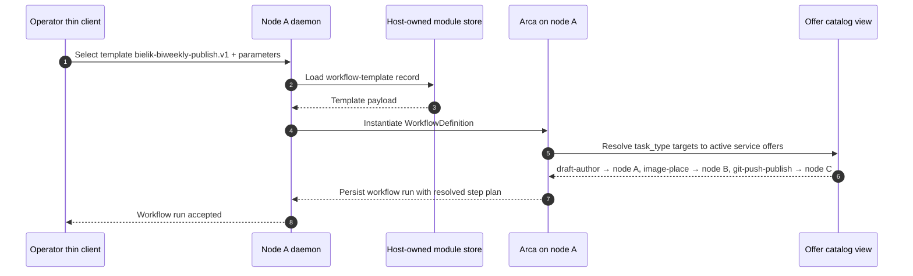
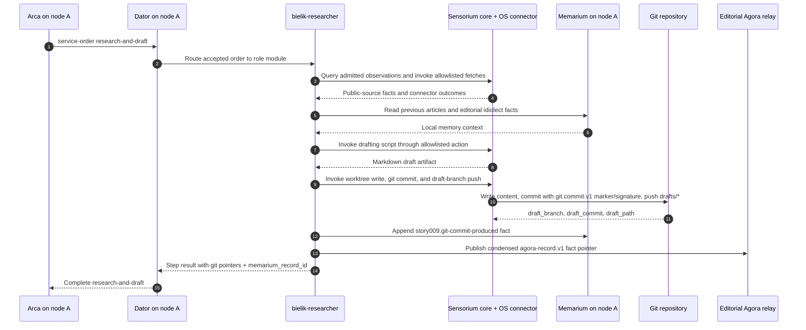
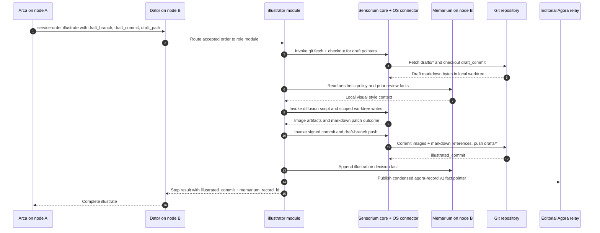
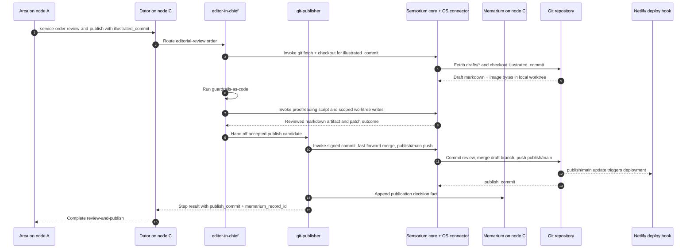
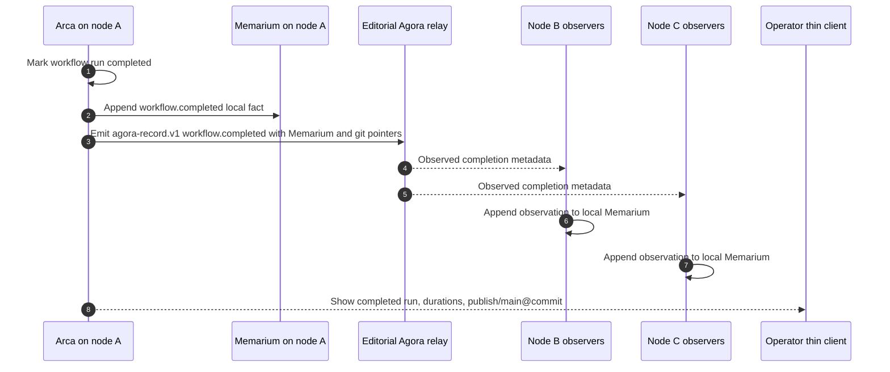

# Story 009: The magazine publishes itself — a three-node blogging pipeline about Bielik, conducted by Arca

## Summary

As the editor-in-chief of a small, opinionated technical blog about Polish
language models, I want my three Orbiplex nodes — each in a different
role — to run the publishing cycle for the **Bielik** language model on
their own: the first does research and writes a draft, the second
illustrates it, the third proofreads and pushes the finished material to
the branch that Netlify automatically deploys to the Hugo-built site.

My job as the operator is to watch the **Arca** audit channel and see
which step we are on, who signed what, and what landed in git — without
logging into a CMS panel, without manually gluing API calls, and without
one giant script that "does everything".

This story is a direct rendering of the seqnote
["The magazine publishes itself"](https://orbiplex.ai/seq/i-imagine-that/02-the-magazine-publishes-itself/)
into a minimal technical flow. The seqnote describes the vision: an
editorial team as a **swarm** of cooperating, specialised nodes with
shared memory (**Memarium**), instead of a single "AI panel" stitched
together from services. Here we step one floor down: three concrete
nodes, one concrete topic (the Bielik model), one concrete *workflow*
in **Arca**, one git repository tracked by Netlify.

## Current Baseline Used by This Story

The story relies on:

- **Proposal 029** (Workflow Template Catalog) — definition of
  `WorkflowDefinition` and the template catalog: the four steps of this
  story are three named step templates, parameterised by topic
  (`Bielik`) and target repository.
- **Proposal 033** (Workflow Fan-Out and Temporal Orchestration) —
  temporal primitives (timeout, retry, deadline) for the research and
  review steps; *fan-out* is not used here (each step has a single
  target), but temporality is essential so that a slow node does not
  block publication.
- **Proposal 019** (Supervised Local HTTP/JSON Middleware Executor) —
  each of the three nodes runs its specialised LLM modules (research,
  illustration, review) as supervised middleware modules that publish
  active offers for declared task types.
- **Story 000** — node identity and participant identity, used by
  service offers and service orders once Arca selects a provider by
  `task_type`.
- **Story 008** — the pattern of a record signed by a participant key
  (`PrimaryParticipant`) as an auditable unit. Here the same mechanism
  is used by git commits: every commit is optionally signed by the key
  of the node that produced it, and the trace of that signature lands
  in the author node's Memarium.
- **The editorial Agora local relay** — the channel through which the
  three nodes share significant **facts** (publishing `agora-record.v1`
  records with `record/kind` of `workflow.step.completed`,
  `workflow.completed`, optionally editorial observations). Each node
  has its **own, local Memarium**; editorial memory continuity is
  **emergent**: it arises from nodes publishing significant facts on
  the Agora relay and every observer appending them to its own
  Memarium. There is no single shared store.

### Transport Stratification (architectural decision)

The story explicitly separates two channels:

- **Data plane = git.** The article body (markdown), illustrations,
  editorial corrections — everything that constitutes "the work" — is
  carried solely through the git repository
  (`drafts/bielik-…` ↔ `publish/main`). Bytes do not enter Arca, do not
  enter Agora, and do not enter Memarium as primary material.
- **Control plane = Arca + Agora.** Between steps we pass **pointers**:
  branch name, commit SHA, paths of added files, Memarium record
  identifier. These are small, control-shaped, auditable data — they
  fit naturally into `input_from_step` (proposal 029) and into an
  `agora-record.v1` record (story 008).

Therefore: **we introduce no new artefact transport**. Proposal 042
(INAC) and the `memarium-blob.v1` schema are the natural extension
direction whenever the editorial team wants to exchange artefacts
unfit for git (large binary assets, confidential briefs) — but this
story deliberately does not use them, to avoid adding code.

### Local action boundary: Sensorium OS connector

The story-specific roles do not spawn shell commands directly. The
roles `bielik-researcher`, `illustrator`, `editor-in-chief`,
`git-signer`, and `git-publisher` own the editorial semantics of their
tasks, but any local operating-system action required to carry out
those tasks is mediated through `sensorium-core` and an allowlisted
Sensorium OS connector.

This includes git fetch/checkout/read paths, file writes in the local
worktree, signed commits, guarded pushes, narrow public-source
fetching when a source is represented operationally as an OS action,
**and the generative work itself — draft composition, image
generation, language proofreading — invoked as allowlisted OS
connector scripts that wrap the node's local model or tool**. Role
modules do not run language models, diffusion models, or shell
utilities in-process; each unit of work is a named `action_id` with a
declared script path, parameter schema, timeout, `cwd`, environment,
output caps, artifact capture, and incidental effects — all enforced
at the connector boundary. The role modules remain consumers of
`sensorium.directive.invoke`; they do not receive
`sensorium.connector.invoke` grants and do not bypass `sensorium-core`.

This does **not** change the transport stratification above: article
bytes still flow through git, not through Arca, Agora, or Memarium.
Sensorium's OS connector is an enaction boundary for local operations,
not an artefact transport and not a parallel workflow engine.

The OS connector implementation remains program-agnostic. The fact that this
story uses actions with Git-shaped names does not mean the connector knows
Git. The operator-authored action catalog maps each `action_id` to a concrete
script or command invocation, argv shape, environment, class envelope, result
contract, and optional scoped signing lane. Git semantics — checkout, commit,
fast-forward, push, and how the commit payload is signed — live in those
configured scripts and in the role modules that call them, not in the
connector code.

**Action classification and authorization come from proposal 048.**
This story does not introduce its own trust model, its own allowlist
format, or its own signing ceremony for OS connector scripts. Each
action used here belongs to one of the classes defined in 048, and
the connector's action catalog is authorized via the sidecar-signature
mechanism from that proposal. Actions that need participant signatures, such
as signed git commits, declare a bounded signing lane in that same catalog
(for example one signature in the `git.commit.v1` domain); `sensorium-core`
and the host signer authorize that narrow signer grant for the spawned script.
The OS connector still only runs the configured process and never becomes a
signing oracle. In the fresh-install demo path, the
four story-009 scripts ship as **factory defaults** of the Sensorium
OS connector; after first start, the node materializes them into the
active configuration area and the node itself emits a node-signed
sidecar over the merged effective configuration — so the demo runs
without any operator signing ceremony, unless the operator edits the
connector configuration, at which point the standard operator
admittance flow from 048 applies.

The story assumes the three nodes (`A`, `B`, `C`) are running and that
each runs **Orbiplex Dator** as its supply-side marketplace facade.
Dator on each node publishes the node's active `service-offer.v1`
records for the relevant `task_type` values, accepts incoming service
orders from Arca on behalf of the local role modules, and enforces the
node's bounded acceptance posture (queue depth, concurrency, refusal
when the local role module is not ready). In the phase-0 mapping,
`task_type` is projected onto `service/type` in the offer catalog. The
git repository and Netlify configuration exist; they are an external
artefact on which this story merely performs agreed operations.

Dator is not an executor of editorial semantics and not an actor on
the local operating system: it is the responder-side bridge between
Arca's dispatch and the specialised role middleware modules named
below. All editorial work is done by the role modules; all local OS
actions are mediated through `sensorium-core` and the allowlisted
Sensorium OS connector.

For this demo, every offer published by every node's Dator has
`price = 0 ORC` (free). This is a deliberate simplification: the
subject of this story is editorial orchestration and local enaction,
not settlement. A zero price keeps the flow on a single path
(`service-offer.v1` → `service-order.v1` → accept → role module →
result) without wiring holds, escrow, or ledger updates into the
story. Variants with non-zero pricing, negotiation, or settlement are
a separate story.

## Cast and Scene

- **Node A — *Bielik Researcher*.** Operator: `participant:did:key:z6MkA…`.
  Runs **Dator** which publishes its active offers for task types:
  `llm-research`, `draft-author`, `git-commit-draft`, and accepts
  Arca-dispatched service orders for them. Has access to **Sensorium** (connectors to
  external sources: arXiv, GitHub repositories, the Bielik mailing
  list, news feeds) and to the Sensorium OS connector for allowlisted
  local repo and source-fetch actions. The researcher module still
  receives admitted observations as facts; when it needs to touch the
  local worktree or invoke a source-fetching command, it does so through
  an Arca-mediated `sensorium.directive.invoke` path. Node A also has
  access to its **own, local Memarium** which retains
  this node's previous Bielik articles and observed facts published by
  nodes B and C (illustration decisions, editorial rulings, rejected
  variants returning from review).
- **Node B — *Illustrator*.** Operator: `participant:did:key:z6MkB…`.
  Runs **Dator** which publishes its active offers for task types:
  `draft-read`, `image-generate`, `image-place`,
  `git-commit-illustrated`, and accepts Arca-dispatched service orders
  for them. Has a local diffusion model and **its own
  local Memarium** in which it keeps its aesthetic policy (palette,
  *hero image* typography, allowed styles) — a policy fed by facts
  published by node C (acceptances and rejections of illustrations
  from previous runs) and by its own generative decisions. Git
  checkout, worktree writes, commit actions, and the image generation
  itself are mediated through the Sensorium OS connector: the
  diffusion model is wrapped as an allowlisted connector script, and
  the illustrator role module owns only the semantic decisions (what
  to depict, where to place each image, which aesthetic policy to
  apply) — not the in-process execution of the model.
- **Node C — *Editor-in-Chief*.** Operator: `participant:did:key:z6MkC…`.
  Runs **Dator** which publishes its active offers for task types:
  `draft-read`, `editorial-review`, `guardrails-as-code`,
  `git-push-publish`, and accepts Arca-dispatched service orders for
  them. `git-push-publish` is advertised by Dator **only on node C**;
  no other node's Dator publishes that offer. Holds the only key
  authorised to *push* to the branch tracked by Netlify
  (`publish/main`). Has the editorial line rules installed as code
  (proposal 026 §*Guardrails-as-code* — a non-functional contract at
  node level, not a content-schema). Review checkout, signed commit,
  merge, and push actions are mediated through the Sensorium OS
  connector, with `git-push-publish` allowlisted only on node C.
- **Arca**, as a workflow module running on **one** of the nodes (in
  this story: on node A as host, but that is just the engine's
  location — Arca is *agnostic* about where the participants of the
  defined steps physically live; it finds them through task-type offer
  lookup).
- **The git repository** `git@example.org:redakcja/blog-bielik.git`
  with Hugo structure (`content/posts/`, `static/img/posts/`,
  `config.toml`). The `drafts/*` branch is for drafts and working
  versions; the `publish/main` branch is the only one Netlify deploys.
- **Three local Memariums** — one per node. Each stores its own facts
  (what the given node itself produced or decided) and observations of
  significant facts of other nodes, fetched through the editorial
  Agora local relay or through INAC. "Editorial memory" as a whole is
  an **emergent view** composed of these three Memariums; it does not
  exist as a single shared store nor a single authoritative back-end.
  Consistency is achieved through append-only records, not through
  shared state.

The topic of this story is the publishing cycle: **"What's new with
Bielik"** — a periodic article summarising changes, *releases* and
community signals around the **Bielik** model on a biweekly cadence.

## Sequence of Steps

### Step 0: Operator launches the workflow from a template

The operator opens a *thin client* over node A and selects a workflow
template from the catalog (proposal 029):

```
template_id: bielik-biweekly-publish.v1
parameters:
  topic: "Bielik"
  cadence_window: { from: "2026-04-03", to: "2026-04-17" }
  repo: "git@example.org:redakcja/blog-bielik.git"
  draft_branch_prefix: "drafts/bielik-"
  publish_branch: "publish/main"
  hugo_section: "posts"
```

Arca on node A builds a concrete `WorkflowDefinition` instance from
those parameters: four steps, each with a declared `task_type` target
(rather than a hard-coded participant). At runtime Arca asks the
offer-catalog surface who currently offers the corresponding
`service/type`. Thanks to this, if node B fails and its role is taken
over by another node offering `image-generate` / `image-place`, the
*workflow* needs no editing.

```json
{
  "workflow_id": "wf:bielik-biweekly:01JRZ…",
  "steps": [
    {
      "id": "research-and-draft",
      "target": { "resolve": "task_type", "task_type": "draft-author" },
      "input": { "topic": "Bielik", "cadence_window": { … } },
      "timing": { "timeout": "PT90M", "on_timeout": "fail" }
    },
    {
      "id": "illustrate",
      "target": { "resolve": "task_type", "task_type": "image-place" },
      "input_from_step": "research-and-draft",
      "timing": { "timeout": "PT30M", "on_timeout": "fail" }
    },
    {
      "id": "review-and-publish",
      "target": { "resolve": "task_type", "task_type": "git-push-publish" },
      "input_from_step": "illustrate",
      "timing": { "timeout": "PT60M", "on_timeout": "fail" },
      "retry": { "max_attempts": 1, "backoff_seconds": 300 }
    }
  ]
}
```

The three `timing.timeout` values are a concrete application of
*temporal orchestration* from proposal 033: if a provider does not
return a result within the time window, the step is marked
`timed_out` and the *workflow* halts with that status. There is no
silent rescue and no fallback to another node — the operator is
supposed to see that something is stuck.

### Communication Workflow

The diagrams below are intentionally **vertical transmission
scenarios**, not one large component graph. Each scenario shows the
messages that cross a boundary: either inside one node or between two
nodes. The article bytes are never passed through Arca or Agora; only
pointers, order envelopes, facts, and audit identifiers move through
the control plane.

#### Step 0 — local workflow instantiation on node A



#### Step 1 — node A researches, drafts, signs, and publishes a draft fact



#### Step 2 — node B receives only pointers, pulls bytes through git, and returns illustration pointers



#### Step 3 — node C reviews through git, then performs the only publish push



#### Step 4 — verified workflow completion is announced as metadata, not content



### Step 1: Node A does research and writes a draft

Arca dispatches `research-and-draft` to the selected active offer for
the `draft-author` task type (node A in this story). The order arrives
at **Dator on node A**, which validates the order against node A's
acceptance posture (task type still offered, queue not saturated,
local role module ready), accepts it, and routes the payload to the
`bielik-researcher` role module. Dator then tracks order state and
surfaces the module's result back to Arca. The research module:

1. Asks Sensorium about changes to the topic `Bielik` in the
   `cadence_window`: new *releases* on HF, commits in the
   `speakleash/Bielik-*` repo, new *issues* and *discussions*,
   mentions in selected feeds.
   Sensorium returns admitted facts about public sources. If a source
   requires an operational fetch rather than an already-admitted
   observation, the researcher asks `sensorium-core` to invoke an
   allowlisted OS connector action; the researcher does not run shell
   commands directly.
2. Asks **its own, local Memarium** (node A's Memarium) about **two**
   things:
   - previous articles in this cycle (its own drafts plus publication
     records observed from node C — all earlier fetched from the
     editorial Agora local relay),
   - editorial-characteristic phrases and preferred stylistic
     constructions (the editorial idiolect — see seqnote — preserved
     in node A's Memarium as its view of the shared style, fed by
     corrections observed from node C).
3. Asks `sensorium-core` to invoke an allowlisted OS connector action
   that runs a local drafting script (a thin wrapper over the node's
   research/drafting model). The script takes the admitted Sensorium
   facts and the Memarium context as typed parameters, runs under the
   connector's timeout/`cwd`/output-cap discipline, and returns a
   markdown draft in Hugo format as a captured artifact:

```markdown
---
title: "What's new with Bielik — April, part two"
date: 2026-04-17T11:00:00+02:00
draft: true
tags: ["bielik", "llm", "polski"]
---

In the past two weeks, around Bielik, the following has happened…
```

After the draft is produced, the git write is handled as a separate
Arca task path (`git-commit-draft`). The `git-signer` role asks
`sensorium-core` to invoke allowlisted OS connector actions that clone
the repo (if needed), create the branch
`drafts/bielik-2026-04-17-A`, writes the file
`content/posts/2026-04-17-bielik-co-nowego.md`, *commits* with a *git*
signature tied to node A's participant key (Ed25519 over the
canonicalised commit object — the same signing mechanism used by the
Agora relay in story 008, only with a different `domain tag`:
`git.commit.v1`), and pushes the branch. The signature may be produced by the
configured script through the scoped signer grant declared for that action;
`sensorium-core` and the host signer authorize the grant, while the OS connector
only runs the configured process. The configured script constructs the
Git-specific signing payload and finalises the commit. The git bytes still move
through git; Sensorium only mediates the local operation boundary and records
directive outcomes.

The step's result returned to Arca:

```json
{
  "outcome": "ok",
  "draft_branch": "drafts/bielik-2026-04-17-A",
  "draft_commit": "8fa2…",
  "draft_path": "content/posts/2026-04-17-bielik-co-nowego.md",
  "signature_tracker": {
    "domain": "git.commit.v1",
    "status": "verified",
    "signer": "participant:did:key:z…",
    "signature_digest": "sha256:…"
  },
  "memarium_record_id": "sha256:…"
}
```

`memarium_record_id` points to the fact record "A produced draft X
in response to *brief* Y at time T" — this is a fact written into
**node A's Memarium** (the step's author), not overwritten state. For
signed commits, that fact also records the commit SHA, signature domain
(`git.commit.v1`), signer identity, signature value or digest, and the
Sensorium directive/outcome identifiers that caused the local action. In
parallel, node A publishes a condensed equivalent of this fact as an
`agora-record.v1` record on the editorial Agora local relay, so that
nodes B and C — observing this relay — append their copies into
**their** Memariums. Later steps append further facts on their own
side; nothing disappears and nothing is mutated.

The memory projection boundary is intentionally above Sensorium. The OS
connector only returns the script's JSON plus artifacts; it does not know that
`draft_commit` is a Git commit, and it does not write Memarium facts. The role
module (for example `git-signer` or `git-publisher`) is the semantic owner that
transforms the Sensorium directive result into a `memarium.write` fact. Dator may
declare that a service offer is expected to produce such a fact, but Dator should
not interpret commit signatures or construct the Memarium payload itself.

A minimal fact payload for a signed commit can therefore be shaped as data
derived from the script JSON plus the Sensorium envelope:

```json
{
  "fact/kind": "story009.git-commit-produced",
  "fact/schema": "story009.git-commit-produced.v1",
  "subject": {
    "kind": "git-commit",
    "id": "8fa2…"
  },
  "produced_by": {
    "role": "git-signer",
    "node": "node:did:key:z…",
    "participant": "participant:did:key:z…"
  },
  "git": {
    "branch": "drafts/bielik-2026-04-17-A",
    "commit_sha": "8fa2…",
    "paths": ["content/posts/2026-04-17-bielik-co-nowego.md"]
  },
  "signature": {
    "domain": "git.commit.v1",
    "status": "verified",
    "signer": "participant:did:key:z…",
    "signature_digest": "sha256:…"
  },
  "sensorium": {
    "directive/id": "directive:…",
    "outcome/id": "outcome:…",
    "observation/ids": ["obs:…"]
  }
}
```

In the current reference skeleton the commit carries only the trailer marker
`Orbiplex-Signature-Domain: git.commit.v1`; the same fact shape still applies,
but `signature.status` is `marker-only` until real Ed25519 commit-object signing
is wired through the scoped signing lane from proposal 048.

### Step 2: Node B reads the draft and creates illustrations

Arca dispatches `illustrate` to the provider of `image-place` (node
B), passing the result of step 1 as input. The order is received by
**Dator on node B**, which accepts it under node B's acceptance
posture and routes it to the `illustrator` role module. **The input is pointers**
(`draft_branch`, `draft_commit`, `draft_path`, `memarium_record_id`),
not the draft bytes — the article content does not enter the Arca
data plane at all. The illustration module:

1. Asks `sensorium-core` to invoke allowlisted OS connector actions for
   `git fetch origin drafts/bielik-2026-04-17-A` and
   `git checkout 8fa2…` on a local worktree associated with the module;
   reads the file
   `content/posts/2026-04-17-bielik-co-nowego.md`. The draft bytes
   arrived through the git channel, not the Arca channel.
2. Extracts a list of visual motifs from the draft (title + selected
   headers + 1–3 longer paragraphs as *prompt context*).
3. Asks **its own, local Memarium** (node B's Memarium) for the
   aesthetic policy — its own previous generative decisions plus
   acceptances and rejections observed from node C in earlier runs
   (palette, *hero image* format, what to avoid — e.g. "do not use
   generic stock images of server rooms").
4. Asks `sensorium-core` to invoke an allowlisted OS connector action
   that runs a local illustration script wrapping the node's diffusion
   model. The script receives the visual motifs and aesthetic policy
   as typed parameters, generates a *hero image* + 2–4 in-text
   illustrations, and writes them to `static/img/posts/2026-04-17/`
   through a scoped worktree-write action (the same write-discipline
   used for markdown). The illustrator role module never loads the
   diffusion model in-process.
5. Edits the markdown file by asking the OS connector to apply the
   allowlisted worktree write: adding `image:` to the frontmatter and
   inserting `` at the appropriate places.
6. Through the `git-signer` path, asks the OS connector to *commit* on
   the same branch with a node B participant-key signature
   (`git.commit.v1`) and push the draft branch.

Result:

```json
{
  "outcome": "ok",
  "illustrated_commit": "1d4c…",
  "images_added": 4,
  "memarium_record_id": "sha256:…"
}
```

### Step 3: Node C proofreads and pushes for publication

Arca dispatches `review-and-publish` to the provider of
`git-push-publish` (node C). The input is again only pointers from
step 2 (`illustrated_commit`, `images_added`, `memarium_record_id`).
The order is received by **Dator on node C** — the only node whose
Dator advertises the `git-push-publish` task type — which accepts the
order and routes it to the `editor-in-chief` and `git-publisher` role
modules in sequence. The editorial module:

1. Asks `sensorium-core` to invoke allowlisted OS connector actions for
   `git fetch origin drafts/bielik-2026-04-17-A` and
   `git checkout 1d4c…` — the draft bytes together with the embedded
   images arrive through the git channel.
2. Reads the entire markdown file together with embedded images.
3. Applies **guardrails-as-code** — rules baked into the module's
   code, not into a prompt:
   - editorial line check (forbidden phrases, source attribution
     requirement, title length limits);
   - check that the frontmatter has the required fields (`title`,
     `date`, `tags`, `image`);
   - check that `draft: true` will be removed;
   - link check (none returns 404);
   - check that the images exist at the paths used in `figure`.
4. Asks `sensorium-core` to invoke an allowlisted OS connector action
   that runs a local proofreading script (a thin wrapper over the
   node's language model). The script performs minor punctuation,
   clarity and rhythm corrections, **without** changing the article's
   thesis, and returns the revised markdown as a captured artifact. The
   `editor-in-chief` role module never loads the proofreading model
   in-process; guardrails-as-code from step 3 above remain in the role
   module (they are code, not a script).
5. Changes the frontmatter (`draft: false`) through an allowlisted
   worktree write, then *commits* the changes on the
   `drafts/bielik-2026-04-17-A` branch with node C's signature.
6. Through the `git-publisher` path, asks the OS connector to perform a
   guarded *fast-forward merge* of the draft branch into `publish/main`
   and push `publish/main` to origin.

The push to `publish/main` is the sole publication trigger: Netlify
listens to that branch and deploys. No other node has the key
authorised for that push — it is the only place where publishing
authority is centralised at the level of git operations, even though
the process is distributed. In implementation terms this is an explicit
Arca-mediated Sensorium OS directive path, not a Sensorium
research-observation connector path.

Result:

```json
{
  "outcome": "ok",
  "review_commit": "9a7e…",
  "publish_branch": "publish/main",
  "publish_commit": "9a7e…",
  "memarium_record_id": "sha256:…"
}
```

### Step 3b: Verify publication fulfillment

Publishing and fulfillment are intentionally separate. `git-push-publish`
returning a commit id means that the publish step executed and produced a
pointer. It does not, by itself, prove that the publication task is fulfilled.

The workflow should therefore be able to declare an explicit fulfillment policy
for the publication task. In the reference shape this is a follow-up decision
source:

```json
{
  "step_id": "verify-publication",
  "service_type": "publication-verifier",
  "input_from": ["review-and-publish"],
  "fulfillment": {
    "policy": "external_decision",
    "decision_source": {
      "kind": "capability",
      "capability_id": "story009.publication.verify"
    },
    "result_match": {
      "path": "/verification/status",
      "fulfilled_values": ["fulfilled"],
      "not_fulfilled_values": ["not_fulfilled", "rejected"]
    },
    "on_not_fulfilled": "pause",
    "on_error": "fail"
  }
}
```

The verifier may use the Sensorium OS connector and an allowlisted script to
run `git fetch`, inspect refs, and decide whether the requested commit is
reachable from the publication ref. That is only one implementation. The
fulfillment decision could also come from another Sensorium connector, a
different middleware capability, or an operator/requester confirmation. The
workflow must name that source explicitly.

This keeps the domain-specific knowledge above Arca, Dator, Memarium, and
Sensorium. The Git-aware script or role module knows what "published" means;
Arca only records the declared decision, persists its evidence, and decides
whether the workflow may continue or complete.

Example verifier output:

```json
{
  "schema": "task-verification-result.v1",
  "verification/status": "fulfilled",
  "verification/kind": "story009.publication-visible",
  "verified_at": "2026-04-19T12:00:00Z",
  "evidence": {
    "kind": "git-ref-contains-commit",
    "commit_sha": "9a7e...",
    "ref": "origin/publish/main",
    "reachable_from_ref": true
  },
  "retryable": false,
  "memarium_record_id": "sha256:..."
}
```

The `task-verification-result.v1` shape is a story-local convention until a
second workflow needs the same contract. It should not be promoted into a global
schema prematurely.

### Step 4: Arca closes the workflow and announces the publication fact

Arca marks the *workflow run* as `completed`, records the full audit
trail (input, output and time of each step, all participant-key
signatures) and emits an `agora-record.v1` record with
`record/kind: "workflow.completed"` for monitoring views and history.
The operator sees in the thin client:

> "Workflow `bielik-biweekly-publish.v1` finished. Step 1: node A
> (53 min). Step 2: node B (12 min). Step 3: node C (8 min). Verification: fulfilled.
> Publication: `publish/main@9a7e…`. Netlify deploy in progress."

A few minutes later the article is live. No human clicked a "publish"
button in a CMS panel.

## Acceptance Criteria

| # | Criterion | Verification |
| :--- | :--- | :--- |
| 1 | The `WorkflowDefinition` has four steps with `resolve: task_type` targets; it contains no hard-coded participant identifiers | inspection of the saved *workflow run* |
| 2 | Step 1 (`research-and-draft`) ends with a commit on the `drafts/bielik-…-A` branch signed by node A's participant key with signature domain `git.commit.v1` | verification of the commit object signature |
| 3 | Step 2 (`illustrate`) commits on the same branch, adding ≥1 new image in `static/img/posts/<date>/` and at least one `` reference in the markdown file | content diff between `draft_commit` and `illustrated_commit` |
| 4 | Step 3 (`review-and-publish`) changes `draft: true` to `draft: false`, *fast-forwards* `publish/main` to the commit from the draft branch and pushes **only** that branch | inspection of the origin repo's `git reflog` |
| 5 | Only node C offers the `git-push-publish` task type and only node C's Sensorium OS connector has an allowlisted publish action for `publish/main`; an attempt to push `publish/main` from node A or B fails at git policy level (origin-side or *pre-receive hook*) or at Sensorium directive admission | negative test: a manual `git-push-publish` invocation from node A must be rejected before or at git push |
| 6 | Each of the four steps, if it exceeds `timing.timeout`, ends the *workflow run* with status `timed_out` indicating the specific step; there is no silent fallback to another provider | test: an artificial *sleep* in one of the modules longer than the *timeout* |
| 7 | Each step appends at least one record to the **local Memarium of the node executing the step** (not to any shared store), whose identifier it returns in the step output; records are appended (append-only), not overwritten | inspection of each of the three Memariums between run 1 and run 2 — all records from run 1 retained |
| 8 | After `completed`, Arca emits an `agora-record.v1` record with `record/kind: "workflow.completed"` containing `record/about` with links to the three commit-producing Memarium records plus the publication verification Memarium record | inspection of the Agora relay after the finished run |
| 9 | The cycle can be reproduced from the *workflow run* + the sum of the three local Memariums — one can reconstruct who proposed what, what was rejected at review and why, **without** referring to any shared store | test: delete the *working tree*, reconstruct the publication path solely from the records of the three Memariums + the Arca log |
| 10 | Netlify deploys **only** as a result of the step 3 push; a manual change to `publish/main` outside an Arca run is technically possible, but becomes a record visible in the log (not a hidden path) | inspection of the Netlify deployment history vs. the Arca log |
| 11 | No single shared Memarium: each of the three nodes has its own instance; the exchange of facts between nodes happens solely through signed `agora-record.v1` records on the editorial Agora local relay | configuration inspection: each node has its own `memarium-store`; no shared mountpoint, no data branch that everyone sees without going through Agora |
| 12 | **The article content (markdown + images) does not at any point enter the Arca data plane nor the content of Agora records.** Between steps only pointers (`branch`, `commit`, paths, `memarium_record_id`) are passed; draft and image bytes flow exclusively through git | inspection of `input` / `output` of each step in the *workflow run*: payload size < 4 KiB, no fields with markdown or image bytes; inspection of Agora records — `content` contains only metadata, not the article corpus |
| 13 | Every module executing a git-using step starts by invoking the Sensorium OS connector for `git fetch`/`git checkout` based on the pointer from the previous step; there is no direct shell path and no alternative path through which draft bytes could reach the module | code review of the `illustrator` and `editor-in-chief` modules plus Sensorium directive/outcome audit: the only source of draft content is the local git worktree |
| 14 | Every service order dispatched by Arca is received by the local `Dator` on the responder node and routed to the corresponding role module; role modules do not receive Arca orders on any other path. `git-push-publish` appears as an active offer only on node C's Dator | offer-catalog inspection + Dator order log on each node |
| 15 | Every published offer in this story has `price.amount = 0` in `ORC` | offer-catalog inspection |
| 16 | All generative work (draft composition, image generation, language proofreading) is executed as a `sensorium.directive.invoke` call to an allowlisted OS connector action wrapping the corresponding local model/script; no role module loads a language or diffusion model in its own process space | Sensorium directive/outcome audit + module code review (no in-process model load) |
| 17 | The OS connector action catalog used in this story is declared in the connector's configuration file and authorized through the sidecar-signature mechanism from proposal 048 (node-signed on fresh install, operator-signed after any operator edit). Each action used by this story is declared under one of the classes from 048, and commit-signing actions declare a bounded `signing.allowed_domains = ["git.commit.v1"]` lane instead of receiving general signer access. The story introduces no parallel trust surface, no ad-hoc allowlist, and no separate signing artifact for OS actions. | inspection of the OS connector configuration + sidecar signature file; class tags, argv shapes, result contracts, and signing domains match the Realisation table |

## What This Story Does NOT Cover

- **Memarium federation beyond the editorial team.** Each of the three
  nodes has its own local Memarium; editorial consistency is emergent,
  achieved through the editorial Agora local relay. Synchronisation
  with other editorial teams or with public Agora records is a
  separate story.
- **Artefact exchange other than via git.** The INAC channel
  (proposal 042) and the `memarium-blob.v1` schema are the natural
  extension direction (large binary assets unfit for git, confidential
  briefs), but this story deliberately does not use them — all bytes
  of "the work" flow exclusively through the git repository, so as not
  to introduce a second artefact transport alongside the one already
  required.
- **External rate negotiation.** This story assumes suitable active
  offers already exist for the needed `service/type` values. It does
  not cover negotiation of new rates or dynamic commercial terms with
  external providers.
- **Fan-out to many researchers or many illustrators.** This
  *workflow* is sequential 1→1→1. The variant "three illustrators
  compete, review picks the best" is a direct application of the
  *fan-out* from proposal 033 and is a separate story.
- **Module reputation and automatic calibration.** Here the operator
  decides that node A "is good at research". Reputation mechanisms are
  out of scope.
- **Proxy / delegated keys.** All signatures use
  `KeyRef::PrimaryParticipant`. The variant with `key-delegation.v1`
  (proposal 032) would be a separate flow.
- **Full anti-hallucination policy.** The *guardrails-as-code* on
  node C are illustrative here (a few simple rules). The full
  catalogue of editorial rules is a separate artefact.

## Architectural Significance

This story is the smallest coherent slice that simultaneously shows
five Orbiplex commitments expressed in the seqnote:

1. **The editorial team as a swarm, not a *pipeline*.** The three
   nodes are not stages of a script but **autonomous participants**
   with active offers for declared task types. Arca only *proposes*
   cooperation — the offer catalog resolves providers at run time.
   Replacing node B with any other node that offers `image-generate`
   does not require *workflow* edits.
2. **Memory as infrastructure, not a log; local, not shared.** Each
   node keeps its **own Memarium** as an appended stream of **facts**
   from which the path of its own decisions can be reconstructed.
   "Editorial memory" as a whole is an emergent view of the three
   Memariums tied together by signed records on the editorial Agora
   local relay. No one owns shared state; everyone owns their own
   history and their observation of others' facts. Nothing is mutated
   "in place".
3. **Transport stratification: data plane = git, control plane =
   Arca + Agora.** The bytes of "the work" (markdown, images,
   corrections) flow exclusively through the git repository, which is
   already required by the publishing architecture. Between steps
   only **pointers** (`branch`, `commit`, `memarium_record_id`) are
   passed — fitting like a glove into Arca's `input_from_step` and
   into the `content` of `agora-record.v1` records. We do not
   introduce a second artefact transport alongside the existing one;
   this brings a concrete engineering benefit (zero new transport
   code, natural auditability via `git log`) and a conceptual one
   (each layer does what it is suited for).
4. **Publication authority is explicit and local.** Even though the
   process is distributed, the *push* authority to the branch tracked
   by Netlify is held by exactly one task type provider on exactly one
   node. Decentralising intelligence does not mean decentralising
   every single operation — sensitive operations remain explicitly
   concentrated, and the rest of the process works around them.
5. **Boundaries are contractual, not ad-hoc.** Each step has a
   `WorkflowDefinition` with explicit input, output, *deadline* and
   *retry* policy. Nobody "understands without words" — every state
   transition is contractually described and auditable.

The value of this story lies, similarly to story 008, in *negative
simplicity*: the publishing infrastructure itself (Hugo + git +
Netlify) is ordinary, drily ordinary. The novelty is that **the
editorial process over that infrastructure is described as the
cooperation of signed nodes** rather than as one monolithic CI script
or one freewheeling AI worker.

## Realisation

The table below is a **map**, not a mirror. It distinguishes solution
capability sidecars (e.g. `arca-caps.edn`) from marketplace
`task_type` / `service/type` names advertised through offers.

| Scope | Component | Anchor | Missing implementation for this step to pass | Solution document |
|---|---|---|---|---|
| Step 0 (local template persistence substrate) | Orbiplex Node (daemon) | Proposal 044 host-owned module store | Done as substrate: module-scoped JSON records can persist `record_kind = workflow-template` locally without daemon schema changes. | [`host-owned-module-store.md`](../60-solutions/host-owned-module-store.md), [`044-host-owned-generic-module-store.md`](../40-proposals/044-host-owned-generic-module-store.md) |
| Step 0 (instantiating workflow from template) | Arca | `arca-caps.edn` → `:workflow-template-instantiate` | Done for local templates: resolve `template_id` + parameters into a concrete `WorkflowDefinition`; public/federated template import remains outside this local slice. | [`arca.md`](../60-solutions/arca.md) |
| Step 0 (optional public template catalog) | Dator / template catalog module | Proposal 029 public template catalog role | Needed only if `bielik-biweekly-publish.v1` is published/imported through a public catalog: implement template publication, listing, fetch, and import handoff to Arca. Not needed for a daemon-local template. | [`029-workflow-template-catalog.md`](../40-proposals/029-workflow-template-catalog.md) |
| Step 0 (resolving targets by task type) | Arca + offer catalog | `arca-caps.edn` → `:workflow-target-by-task-type`; offer `service/type` | Done for the phase-0 local rule: `target.resolve = task_type` maps `target.task_type` to `service_type` for ordinary service-order execution and does not trigger host fan-out without `fan_in`. | [`arca.md`](../60-solutions/arca.md) |
| Steps 1–3 (offer publication + order acceptance, per node) | Orbiplex Dator on nodes A, B, C | `service-offer.v1` publication (all offers at `price = 0 ORC` for this demo); `service-order.v1` acceptance posture; `task_type` ↔ `service/type` projection | Implement, per node, the supply-side marketplace facade: publish the node's active offers for its declared task types at zero price, accept incoming Arca-dispatched orders under queue/concurrency posture, route accepted orders to the correct local role module, surface module results back to Arca. `git-push-publish` is advertised only by node C's Dator. | planned Dator solution doc |
| Step 1 (research) | `bielik-researcher` module on node A + Sensorium OS connector | task/service types: `llm-research`, `draft-author`; Sensorium action ids for allowlisted public-source fetches when needed. Proposal 048 classes: **C1** for read-only public-source fetches, **C6 composed-spawn** for the drafting script if it combines LLM egress and worktree write. | Implement the specialised module contract: query admitted Sensorium observations, invoke allowlisted OS connector actions for operational source fetches, read local Memarium context, produce a draft, return only git/Memarium pointers to Arca. | planned `bielik-researcher` solution doc |
| Step 1 (signed commit) | `git-signer` module on node A + Sensorium OS connector | task/service type: `git-commit-draft`; Sensorium action ids for worktree write, commit, and draft-branch push. Proposal 048 classes: **C3 scoped-fs-write** for worktree write + commit, **C4 egress-network-spawn** for the draft-branch push; commit-signing actions additionally declare a scoped `signing.allowed_domains = ["git.commit.v1"]` lane. | Implement git commit signing with the participant key and a `git.commit.v1` domain tag through an Arca-mediated Sensorium OS directive path. The action catalog maps labels to scripts/argv shapes; `sensorium-core`/host authorize the scoped signer grant, the OS connector only enforces the process envelope, and the configured script owns Git-specific payload construction. Expose branch/commit/path/signature tracker fields as the step output. This remains separate from Sensorium observation: the OS connector executes local actions; observations and outcomes provide audit. | planned `git-signer` solution doc |
| Step 2 (illustrations) | `illustrator` module on node B + Sensorium OS connector | task/service types: `image-generate`, `image-place`; Sensorium action ids for checkout, worktree write, commit, and draft-branch push. Proposal 048 classes: **C5 artifact-producing-spawn** for the diffusion-model script (image bytes as declared artifacts), **C3 scoped-fs-write** for markdown edit + commit, **C4 egress-network-spawn** for the push. | Implement pointer-based draft checkout through Sensorium OS, image generation/placement, commit to the draft branch, and pointer-only result emission. | planned `illustrator` solution doc |
| Step 3 (review + guardrails-as-code) | `editor-in-chief` module on node C + Sensorium OS connector | task/service types: `editorial-review`, `guardrails-as-code`; Sensorium action ids for checkout and guarded worktree writes. Proposal 048 classes: **C2 allowlisted-script** for the proofreading script, **C3 scoped-fs-write** for the frontmatter/text patch and the signed commit. | Implement review over a Sensorium-mediated git checkout with guardrails-as-code, returning acceptance/rejection facts and correction pointers without copying article bytes through Arca. | planned `editor-in-chief` solution doc |
| Step 3 (push to publishing branch) | `git-publisher` module on node C + Sensorium OS connector | task/service type: `git-push-publish`; Sensorium action ids for guarded fast-forward merge and `publish/main` push. Proposal 048 class: **C7 operator-gated-spawn** — the publishing push is the only action in this story that SHOULD require an operator-signed (not node-signed) authorization in any non-demo deployment; any signed publication commit uses the same scoped `git.commit.v1` signing lane pattern. | Implement the guarded fast-forward/merge/push path to `publish/main`, including a signed publication commit and failure classification for rejected pushes, as an Arca-mediated Sensorium OS directive path. | planned `git-publisher` solution doc |
| Step 3b (publication fulfillment verification) | `publication-verifier` module path + Sensorium OS connector | task/service type: `publication-verifier`; Sensorium action id `story009.publication.verify`. Proposal 048 class: **C2 allowlisted-script** for the read-only verifier script in the reference skeleton; stronger deployments MAY wrap it in a guarded network fetch/pull action when the proof must be checked against a remote origin. | Implement an explicit workflow step that decides task fulfillment from a narrow JSON contract (`task-verification-result.v1`, e.g. `verification/status = fulfilled`). Git-specific verification semantics remain in the configured script; Arca only applies the workflow's fulfillment policy (`output_match`) and records the resulting Memarium verification fact pointer. | planned `publication-verifier` solution doc |
| Step 4 (recording the completion fact) | Memarium | `memarium-caps.edn` → `:append-fact` | Ensure each participating module appends its local fact record and returns stable `memarium_record_id` pointers that Arca can include in the final audit view, including the three commit-producing facts and the publication verification fact. | [`memarium.md`](../60-solutions/memarium.md) |
| Step 4 (publishing `workflow.completed` on Agora) | Orbiplex Agora | [`agora-caps.edn`](../60-solutions/agora-caps.edn) → `:agora-record-ingest` | Add the Arca/host completion emitter for `agora-record.v1` with `record/kind = workflow.completed`, linking run id, step records, Memarium ids, git refs, and publication verification evidence without embedding content bytes. | [`agora.md`](../60-solutions/agora.md) |

**Task-type anchors** (marketplace/service names, not protocol
capability passports):

1. `:workflow-template-instantiate` in `arca-caps.edn` — accepts
   `template_id` + parameters, returns a concrete
   `WorkflowDefinition` instance ready to dispatch.
2. `llm-research` and `draft-author` as **two separate**
   task types — research can in the future be split off from
   writing (e.g. one node gathers material, another writes), without
   changing the *workflow*.
3. `guardrails-as-code` as a task type separate from
   `editorial-review` — signals that the editorial line rules are
   baked into the module's code, not into the model's prompt.
4. `git-push-publish` as a task type separate from
   `git-commit-draft` and `git-commit-illustrated` — the fact that
   only one node offers it is the proper mechanism to enforce a
   single point of publishing authorisation.

**Implementation anchors** (status in
`node/docs/implementation-ledger.toml` and the modules' backlogs; not
here):

- `node/agora-core` — used to sign the `workflow.completed` record.
- Middleware modules (`bielik-researcher`, `illustrator`,
  `editor-in-chief`, `git-signer`, `git-publisher`) run under
  proposal 019.
- `Orbiplex Dator` — runs on each of the three nodes as the
  supply-side marketplace facade that publishes the node's active
  `task_type` offers and accepts Arca-dispatched service orders on
  behalf of the local role modules.
- Sensorium OS connector — used by those role modules for allowlisted
  local OS actions through `sensorium.directive.invoke`; role modules
  do not call `sensorium.connector.invoke` directly. Action
  classification and catalog authorization follow **proposal 048**
  (classes C1..C7, sidecar signature, node-signed factory bootstrap);
  the four story-009 scripts ship as factory defaults and are
  node-signed on first start, so the demo runs without any operator
  signing ceremony.
- Arca workflow — proposal 029 (templates) + proposal 033 (temporal
  orchestration) as the contractual base.

## References

- `doc/project/40-proposals/029-workflow-template-catalog.md`
  (`WorkflowDefinition`, template catalog)
- `doc/project/40-proposals/033-workflow-fan-out-and-temporal-orchestration.md`
  (timeout / retry / deadline; *fan-out* out of scope)
- `doc/project/40-proposals/019-supervised-local-http-json-middleware-executor.md`
  (modules as supervised processes behind host-owned contracts)
- `doc/project/40-proposals/048-sensorium-os-connector-action-classes.md`
  (action classes C1..C7, operator-editable catalog, sidecar
  authorization, node-signed factory bootstrap)
- `doc/project/30-stories/story-000.md` (node and participant identity)
- `doc/project/30-stories/story-008-cool-site-comment.md` (the
  pattern of a signed record as an auditable unit)
- `doc/project/60-solutions/agora-caps.edn` (Agora catalog)
- `doc/project/60-solutions/CAPABILITY-MATRIX.pl.md` (generated
  status view)
- ["The magazine publishes itself"](https://orbiplex.ai/seq/i-imagine-that/02-the-magazine-publishes-itself/)
  (seqnote — the human motivation that this story renders into a
  minimal technical flow)
