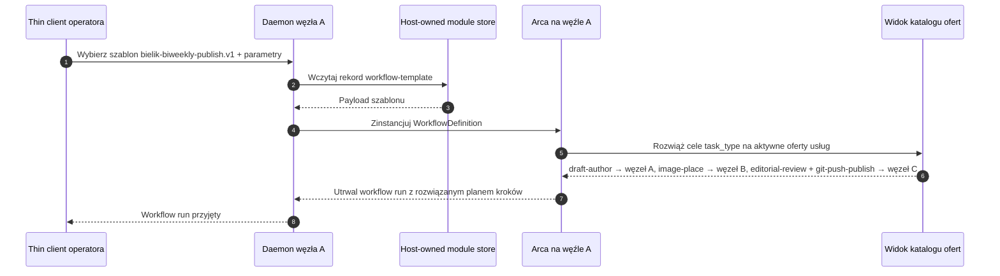
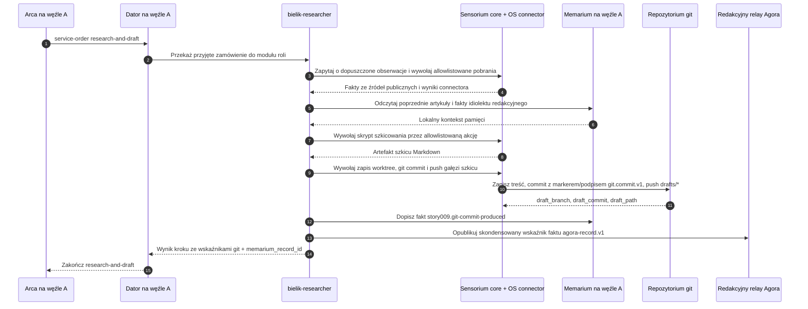
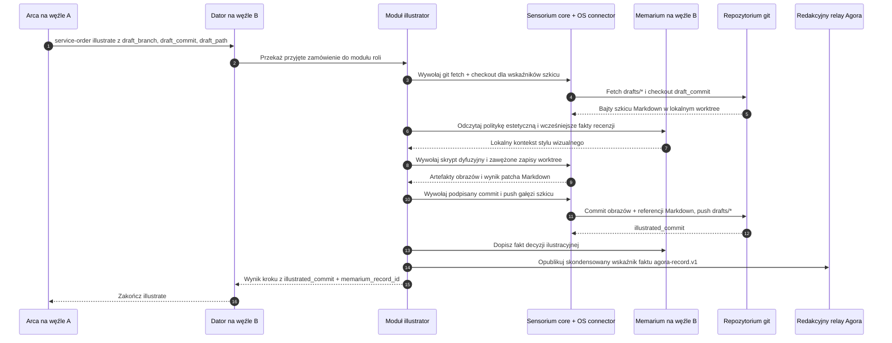
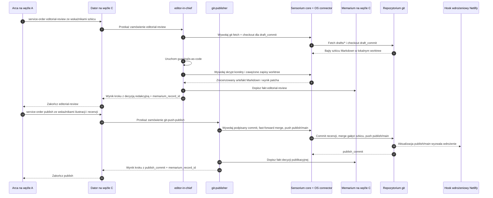
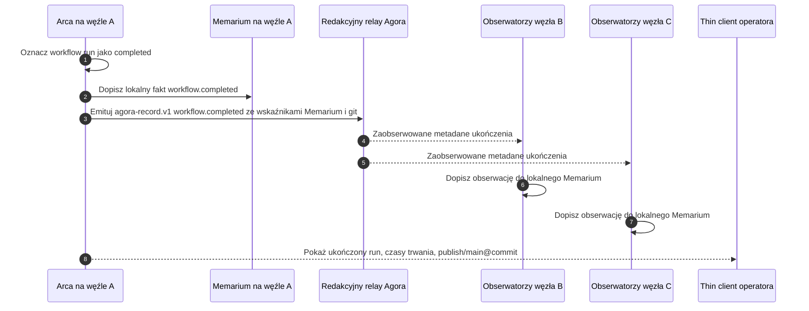

# Story 009: Magazyn publikuje się sam — trzywęzłowy pipeline blogowy o Bieliku prowadzony przez Arcę

## Streszczenie

Jako redaktor naczelny małego, wyrazistego bloga technicznego o polskich
modelach językowych chcę, aby moje trzy węzły Orbiplex — każdy w innej roli —
samodzielnie prowadziły cykl publikacyjny dla modelu językowego **Bielik**:
pierwszy robi research i pisze szkic, drugi go ilustruje, trzeci robi korektę
i wypycha gotowy materiał do gałęzi, którą Netlify automatycznie wdraża jako
stronę zbudowaną przez Hugo.

Moim zadaniem jako operatora jest obserwowanie kanału audytu **Arki** i widzenie,
na którym kroku jesteśmy, kto co podpisał i co trafiło do gita — bez logowania
się do panelu CMS, bez ręcznego sklejania wywołań API i bez jednego wielkiego
skryptu, który "robi wszystko".

Ta story jest bezpośrednim przełożeniem seqnote
["The magazine publishes itself"](https://orbiplex.ai/seq/i-imagine-that/02-the-magazine-publishes-itself/)
na minimalny przepływ techniczny. Seqnote opisuje wizję: zespół redakcyjny jako
**rój** współpracujących, wyspecjalizowanych węzłów ze wspólną pamięcią
(**Memarium**), zamiast pojedynczego "panelu AI" zszytego z usług. Tutaj
schodzimy o jedno piętro niżej: trzy konkretne węzły, jeden konkretny temat
(model Bielik), jeden konkretny *workflow* w **Arce**, jedno repozytorium git
śledzone przez Netlify.

## Aktualna baza używana przez tę story

Story opiera się na:

- **Proposal 029** (Workflow Template Catalog) — definicji
  `WorkflowDefinition` oraz katalogu szablonów: pięć kroków tej story jest pięcioma
  nazwanymi szablonami kroków, parametryzowanymi tematem (`Bielik`) oraz
  docelowym repozytorium.
- **Proposal 033** (Workflow Fan-Out and Temporal Orchestration) — prymitywach
  czasowych (timeout, retry, deadline) dla kroków researchu, ilustracji,
  recenzji, publikacji i weryfikacji. Host-managed fan-out nie jest tu używany;
  Arca używa zwykłego DAG-u service-order: po ukończeniu szkicu może wysłać
  zlecenia ilustracji i recenzji bez czekania na wynik któregokolwiek z nich,
  a publish czeka na obie gałęzie.
- **Proposal 019** (Supervised Local HTTP/JSON Middleware Executor) — każdy
  z trzech węzłów uruchamia swoje wyspecjalizowane moduły LLM (research,
  ilustracja, recenzja) jako nadzorowane moduły middleware publikujące aktywne
  oferty dla zadeklarowanych typów zadań.
- **Story 000** — tożsamości węzła i uczestnika, używane przez oferty usług
  oraz zamówienia usług, gdy Arca wybiera dostawcę po `task_type`.
- **Story 008** — wzorcu rekordu podpisanego kluczem uczestnika
  (`PrimaryParticipant`) jako jednostki audytowalnej. Tutaj ten sam mechanizm
  jest używany przez commity git: każdy commit może być podpisany kluczem węzła,
  który go wytworzył, a ślad tego podpisu trafia do Memarium węzła-autora.
- **Host-owned read-modelach ukończeń kroków workflow i lokalnym monitoringu
  Agora** — każdy daemon wykonujący krok przyjmuje własny rekord
  `workflow.step.completed` i wystawia go przez
  `/v1/workflows/runs/{workflow_run_id}/steps/completed`. Arca może publikować
  finalny fakt monitoringowy `workflow.completed` do lokalnej Agory. Każdy
  węzeł nadal ma **własne, lokalne Memarium**; ciągłość pamięci redakcyjnej jest
  **emergentna** i odtwarzana z jawnych pointerów, nie z jednego wspólnego
  magazynu.

### Stratyfikacja transportu (decyzja architektoniczna)

Story jawnie rozdziela dwa kanały:

- **Data plane = git.** Treść artykułu (markdown), ilustracje, korekty
  redakcyjne — wszystko, co stanowi "pracę" — jest przenoszone wyłącznie przez
  repozytorium git (`drafts/bielik-…` ↔ `publish/main`). Bajty nie wchodzą do
  Arki, Agory ani Memarium jako materiał pierwotny.
- **Control plane = Arca + Agora.** Między krokami przekazujemy **wskaźniki**:
  nazwę gałęzi, SHA commita, ścieżki dodanych plików, identyfikator rekordu
  Memarium. To małe, kontrolne, audytowalne dane — naturalnie pasują do
  `input_from_step` (proposal 029) oraz do rekordu `agora-record.v1` (story 008).

Dlatego: **nie wprowadzamy nowego transportu artefaktów**. Proposal 042 (INAC)
oraz schema `memarium-blob.v1` są naturalnym kierunkiem rozszerzenia, gdy zespół
redakcyjny będzie chciał wymieniać artefakty nienadające się do gita (duże
zasoby binarne, poufne briefy) — ale ta story celowo ich nie używa, aby nie
dodawać kodu.

### Lokalna granica działania: Sensorium OS connector

Role specyficzne dla tej story nie uruchamiają poleceń powłoki bezpośrednio. W
oficjalnym profilu referencyjnym role `bielik-researcher`, `illustrator`,
`editor-in-chief`, `git-signer` oraz `git-publisher` są adapterami
zadeklarowanymi jako `json_e_flow`. Posiadają tylko deklaratywny klej zadania:
renderują dyrektywę Sensorium, wołają Sensorium, zapisują fakt Memarium,
publikują fakt ukończenia kroku workflow i zwracają pointer-only odpowiedź
usługową. Każda lokalna akcja systemu operacyjnego potrzebna do wykonania
zadania jest mediowana przez `sensorium-core` oraz allowlistowany Sensorium OS
connector.

Obejmuje to ścieżki git fetch/checkout/read, zapisy plików w lokalnym worktree,
podpisane commity, strzeżone pushe, wąskie pobieranie źródeł publicznych, gdy
źródło jest reprezentowane operacyjnie jako akcja OS, **oraz samą pracę
generatywną — komponowanie szkicu, generowanie obrazów, korektę językową —
wywoływaną jako allowlistowane skrypty OS connectora opakowujące lokalny model
lub narzędzie węzła**. Moduły ról nie uruchamiają modeli językowych, modeli
dyfuzyjnych ani narzędzi powłoki w swoim procesie; każda jednostka pracy jest
nazwanym `action_id` z zadeklarowaną ścieżką skryptu, schematem parametrów,
timeoutem, `cwd`, środowiskiem, limitami wyjścia, przechwytywaniem artefaktów
oraz efektami ubocznymi — wszystko egzekwowane na granicy connectora. Adaptery
ról pozostają konsumentami `sensorium.directive.invoke`; nie otrzymują grantów
`sensorium.connector.invoke` i nie obchodzą `sensorium-core`.
Błędy walidacji po stronie connectora używają wspólnego słownika
`sensorium-os-error-codes.v1`, a gdy odrzucają wynik akcji, która została już
wykonana, są też reprezentowane jako obserwacje
`ai.orbiplex.sensorium/action-invalid`, aby audyt operatora nie zależał od
zobaczenia nietrwałej odpowiedzi HTTP.

To **nie** zmienia stratyfikacji transportu opisanej wyżej: bajty artykułu nadal
przepływają przez git, nie przez Arcę, Agorę ani Memarium. Sensorium OS connector
jest granicą enakcji dla lokalnych operacji, nie transportem artefaktów i nie
równoległym silnikiem workflow.

Implementacja OS connectora pozostaje agnostyczna względem programu. To, że ta
story używa akcji o nazwach gitowych, nie oznacza, że connector zna git.
Katalog akcji autorowany przez operatora mapuje każde `action_id` na konkretny
skrypt albo wywołanie polecenia, kształt argv, środowisko, envelope klasy,
kontrakt wyniku oraz opcjonalną zawężoną ścieżkę podpisu. Semantyka gita —
checkout, commit, fast-forward, push oraz sposób podpisywania payloadu commita —
żyje w tych skonfigurowanych skryptach i w konfiguracji adapterów `json_e_flow`,
które je wywołują, a nie w kodzie connectora.

Ta sama reguła dotyczy użycia modeli językowych w tej story. `llm-research`,
`draft-author`, korekta językowa i każda inna praca wspomagana modelem są
zwykłymi zadaniami workflow, które sięgają po model przez allowlistowaną akcję
OS connectora opakowującą lokalny skrypt albo narzędzie. Dzięki temu
implementacja referencyjna ma działającą ścieżkę użycia modeli bez dodawania
model-specific kodu do Arki, Datora, Sensorium-core ani OS connectora. Przyszły
dedykowany LLM connector Sensorium może zostać wprowadzony jako bardziej
wyspecjalizowany backend, ale powinien zachować tę samą stratyfikację: workflow
nazywa zadanie, adapter roli wywołuje zadeklarowaną capability/action, a
model-specific konstrukcja promptu, wybór runtime'u, dane dostępowe providera,
batching i kształtowanie wyniku żyją w skonfigurowanym wrapperze albo
connectorze, nie w warstwie orkiestracji.

**Klasyfikacja i autoryzacja akcji pochodzą z proposal 048.** Ta story nie
wprowadza własnego modelu zaufania, własnego formatu allowlisty ani osobnej
ceremonii podpisywania skryptów OS connectora. Każda użyta tutaj akcja należy do
jednej z klas zdefiniowanych w 048, a katalog akcji connectora jest autoryzowany
mechanizmem sidecar-signature z tego proposala. Akcje wymagające podpisów
uczestnika, takie jak podpisane commity git, deklarują ograniczoną ścieżkę
podpisu w tym samym katalogu (na przykład jeden podpis w domenie
`git.commit.v1`); `sensorium-core` i host signer autoryzują ten wąski grant
signera dla uruchamianego skryptu. OS connector nadal tylko uruchamia
skonfigurowany proces i nigdy nie staje się wyrocznią podpisów. W ścieżce demo
świeżej instalacji pięć skryptów story-009 jest dostarczanych jako **fabryczne
domyślne** elementy Sensorium OS connectora; po pierwszym starcie węzeł
materializuje je w aktywnym obszarze konfiguracji i sam emituje node-signed
sidecar nad scaloną efektywną konfiguracją — więc demo działa bez ceremonii
podpisywania przez operatora, chyba że operator edytuje konfigurację connectora;
wtedy obowiązuje standardowy przepływ dopuszczenia operatora z 048.

Story zakłada, że trzy węzły (`A`, `B`, `C`) działają i każdy uruchamia
**Orbiplex Dator** jako swoją supply-side marketplace facade. Dator na każdym
węźle publikuje aktywne rekordy `service-offer.v1` dla właściwych wartości
`task_type`, przyjmuje przychodzące zamówienia usług z Arki w imieniu lokalnych
providerów capability roli i egzekwuje ograniczoną postawę akceptacji węzła
(głębokość kolejki, współbieżność, odmowa, gdy lokalna capability roli nie jest
gotowa). W mapowaniu
phase-0 `task_type` jest projektowany na `service/type` w katalogu ofert.
Repozytorium git i konfiguracja Netlify istnieją; są zewnętrznym artefaktem, na
którym ta story wykonuje uzgodnione operacje.

Dator nie jest wykonawcą semantyki redakcyjnej i nie jest aktorem na lokalnym
systemie operacyjnym: jest responder-side mostem między dispatchingiem Arki
a wyspecjalizowanym providerem capability roli. W profilu referencyjnym tym
providerem jest `json_e_flow`, nie osobny daemon HTTP. Cała praca redakcyjna
jest wyrażona w konfiguracji adapterów ról i allowlistowanych skryptach;
wszystkie lokalne akcje OS są mediowane przez `sensorium-core` i allowlistowany
Sensorium OS connector.

Dla tego demo każda oferta publikowana przez Dator każdego węzła ma
`price = 0 ORC` (za darmo). To celowe uproszczenie: tematem tej story jest
orkiestracja redakcyjna i lokalna enakcja, nie settlement. Cena zero utrzymuje
przepływ na jednej ścieżce (`service-offer.v1` → `service-order.v1` → accept →
role capability → result) bez podpinania holdów, escrow ani aktualizacji ledgerów.
Warianty z ceną niezerową, negocjacją albo settlementem są osobną story.

## Obsada i scena

- **Węzeł A — *Bielik Researcher*.** Operator:
  `participant:did:key:z6MkA…`. Uruchamia **Dator**, który publikuje aktywne
  oferty dla typów zadań: `llm-research`, `draft-author`,
  `git-commit-draft`, i przyjmuje dla nich zamówienia usług dispatchowane przez
  Arcę. Ma dostęp do **Sensorium** (connectory do źródeł zewnętrznych: arXiv,
  repozytoria GitHub, lista mailingowa Bielika, feedy newsowe) oraz do Sensorium
  OS connectora dla allowlistowanych lokalnych akcji repozytorium i pobierania
  źródeł. Moduł researchera nadal otrzymuje dopuszczone obserwacje jako fakty;
  gdy musi dotknąć lokalnego worktree albo wywołać polecenie pobierające źródło,
  robi to przez mediowaną przez Arcę ścieżkę `sensorium.directive.invoke`.
  Węzeł A ma też dostęp do **własnego, lokalnego Memarium**, które zachowuje
  wcześniejsze artykuły tego węzła o Bieliku i obserwowane fakty publikowane
  przez węzły B i C (decyzje ilustracyjne, rozstrzygnięcia redakcyjne, odrzucone
  warianty wracające z recenzji).
- **Węzeł B — *Illustrator*.** Operator: `participant:did:key:z6MkB…`.
  Uruchamia **Dator**, który publikuje aktywne oferty dla typów zadań:
  `draft-read`, `image-generate`, `image-place`,
  `git-commit-illustrated`, i przyjmuje dla nich zamówienia usług dispatchowane
  przez Arcę. Ma lokalny model dyfuzyjny i **własne lokalne Memarium**, w którym
  trzyma swoją politykę estetyczną (paletę, typografię *hero image*, dozwolone
  style) — politykę zasilaną faktami publikowanymi przez węzeł C (akceptacje
  i odrzucenia ilustracji z poprzednich przebiegów) oraz własnymi decyzjami
  generatywnymi. Git checkout, zapisy worktree, akcje commitów i samo generowanie
  obrazów są mediowane przez Sensorium OS connector: model dyfuzyjny jest
  opakowany jako allowlistowany skrypt connectora, a moduł roli ilustratora
  posiada tylko decyzje semantyczne (co przedstawić, gdzie umieścić każdy obraz,
  jaką politykę estetyczną zastosować) — nie wykonanie modelu w procesie.
- **Węzeł C — *Editor-in-Chief*.** Operator:
  `participant:did:key:z6MkC…`. Uruchamia **Dator**, który publikuje aktywne
  oferty dla typów zadań: `draft-read`, `editorial-review`,
  `guardrails-as-code`, `git-push-publish`, i przyjmuje dla nich zamówienia
  usług dispatchowane przez Arcę. `git-push-publish` jest reklamowany przez
  Dator **tylko na węźle C**; Dator żadnego innego węzła nie publikuje tej
  oferty. Posiada jedyny klucz autoryzowany do *push* na gałąź śledzoną przez
  Netlify (`publish/main`). Ma reguły linii redakcyjnej zainstalowane jako kod
  (proposal 026 §*Guardrails-as-code* — niefunkcjonalny kontrakt na poziomie
  węzła, nie content-schema). Review checkout, signed commit, merge i push są
  mediowane przez Sensorium OS connector, z `git-push-publish` allowlistowanym
  tylko na węźle C.
- **Arca** jako moduł workflow uruchomiony na **jednym** z węzłów (w tej story:
  na węźle A jako hoście, ale to tylko lokalizacja silnika — Arca jest
  *agnostyczna* względem tego, gdzie fizycznie żyją uczestnicy zdefiniowanych
  kroków; znajduje ich przez lookup ofert po task-type).
- **Repozytorium git** `git@bielik-blog:orbiplex/bielik-blog.git` ze strukturą
  Hugo (`content/pl/log/<year>/`, `content/en/log/<year>/`, `static/img/posts/`, `config.toml`). Gałąź `drafts/*`
  jest dla szkiców i wersji roboczych; gałąź `publish/main` jest jedyną gałęzią
  wdrażaną przez Netlify.
- **Trzy lokalne Memaria** — jedno na węzeł. Każde przechowuje własne fakty
  (co dany węzeł sam wytworzył lub zdecydował) oraz obserwacje, które może jawnie
  zaimportować przez kontrakty workflow, lokalnego relaya albo INAC. "Pamięć
  redakcyjna" jako całość jest **emergentnym widokiem** złożonym z tych trzech
  Memariów oraz pointerów ukończeń kroków workflow; nie istnieje jako jeden
  wspólny magazyn ani jeden autorytatywny backend. Spójność jest osiągana przez
  append-only records, nie przez współdzielony stan.

Tematem tej story jest cykl publikacyjny: **"Co nowego z Bielikiem"** —
okresowy artykuł podsumowujący zmiany, *releases* i sygnały społecznościowe
wokół modelu **Bielik** w rytmie dwutygodniowym.

## Setup operatorski od zera

Ta sekcja jest runbookiem operacyjnym dla operatora, który chce uruchomić story
od pustego środowiska. Celowo utrzymuje semantykę Gita, modeli i publikacji
w skryptach oraz konfiguracji pisanych przez operatora. Komponenty Orbiplex
dostarczają orkiestrację, mediację capability, zapis, audyt i lokalny nadzór;
nie uczą się semantyki Gita, Netlify, Bielika ani konkretnego LLM.

Wspierane są trzy kształty setupu:

- **Szkielet referencyjny na jednym hoście.** Jeden daemon uruchamia lokalnie
  Arcę, Datora, in-process przepływy ról JSON-e
  (`story009.json-e-flow.roles`), `sensorium-core`, `sensorium-os`, Memarium
  i Agorę. To najszybsza ścieżka developerska i najprostszy sposób weryfikacji
  kontraktu.
- **Trwały jednolaptopowy pakiet operatorski.** Trzy trwałe profile węzłów żyją
  na jednej maszynie operatora, z osobnymi portami control, WSS i Node UI. To
  używa tej samej trzywęzłowej topologii co story produkcyjna, ale setup
  pozostaje lokalny i powtarzalny.
- **Trzykomputerowy deployment redakcyjny.** Węzły A, B i C uruchamiają własny
  daemon, Datora, Sensorium, Sensorium OS connector oraz lokalne Memarium. Arca
  może działać na węźle A. Tylko węzeł C reklamuje i autoryzuje
  `git-push-publish`.

### Decyzje dla targetu produkcyjnego

Produkcyjnie zorientowany wariant story-009 używa tych decyzji:

- **Git data plane:** repozytorium redakcyjne jest realnym repozytorium GitLab,
  widocznym w środowisku operatora jako
  `git@bielik-blog:orbiplex/bielik-blog.git`. Alias SSH `bielik-blog` oraz
  prywatny deploy key są konfiguracją maszyny operatora, nie konfiguracją
  Orbiplex i nie treścią repozytorium.
- **Gałąź publikacyjna:** `publish/main` pozostaje jedyną gałęzią publikacyjną.
  Tylko węzeł C może ją pushować.
- **Layout treści Hugo:** polskie artykuły żyją pod
  `content/pl/log/<year>/`; angielskie tłumaczenia pod
  `content/en/log/<year>/`.
- **Target wdrożeniowy:** Netlify albo równoważny system deploymentu obserwuje
  gałąź publikacyjną. Verifier sprawdza publiczny URL pod
  `https://bielik.orbiplex.ai/`, na przykład
  `https://bielik.orbiplex.ai/pl/log/2026/bielik-13B-instruct/`. Setup Netlify
  jest infrastrukturą zewnętrzną i nie jest automatyzowany przez tę story.
- **Model operatorski:** jeden operator zarządza trzema węzłami i podpisuje
  właściwe lokalne artefakty autorytetu.
- **Model providerów ról:** story-009 oficjalnie używa providerów ról
  `json_e_flow`. Dawny kształt HTTP-local role-module jest dla tej story
  legacy/deprecated.
- **Wrappery modeli:** realne użycie LLM albo diffusion celowo pozostaje poza
  rdzeniem Orbiplex. Allowlistowany skrypt może użyć URL-a API zgodnego
  z OpenRouter i opcjonalnego API key; jeśli są puste albo nieustawione, musi
  wrócić do statycznego deterministycznego tekstu.
- **Akceptacja publikacji:** `git-push-publish` jest operator-gated. UI powinno
  pokazać element `Awaiting acceptance` z komponentem żądającym, akcją,
  digestem/podsumowaniem treści oraz przyciskami `[Sign]` / `[Reject]`.
  Ścieżka akceptacji to podpis operatora nad artefaktem approval.
- **Zaufanie discovery:** produkcyjne discovery opiera się na capability
  passportach i polityce issuerów. Harnessowe `trusted_node_ids` pozostają
  override'em, nie finalnym modelem zaufania.
- **Wybór providera:** Arca może wybierać providerów automatycznie, ale operator
  musi mieć możliwość override'u wyboru dla runu.
- **Widok completion:** produkcyjny UI agreguje per-node control read-modele
  `/v1/workflows/runs/{workflow_run_id}/steps/completed`. Nie ma syntetycznego
  wspólnego store ukończeń kroków w Agorze.
- **Fakt monitoringowy:** Arca nadal emituje `workflow.completed` jako lokalny
  fakt monitoringowy/historyczny Agory.
- **Model audytu:** produkcyjny audit bundle składa się z faktów Memarium,
  rekordów workflow step-completion, śladów signera oraz eksportowalnego bundle
  całego runu.
- **Retencja:** fakty Memarium są przechowywane bezterminowo. Artefakty Sensorium
  mają TTL. Artefakty stdout/stderr skryptów domyślnie żyją jeden dzień.

### Prerekwizyty

Przed instalacją Orbiplex na maszynach przygotuj:

- Trzy nazwy hostów albo etykiety maszyn: `node-a`, `node-b`, `node-c`.
- Jedno repozytorium Git z layoutem zgodnym z Hugo. Dla targetu produkcyjnego
  remote to `git@bielik-blog:orbiplex/bielik-blog.git`, polskie wpisy żyją pod
  `content/pl/log/<year>/`, angielskie tłumaczenia pod
  `content/en/log/<year>/`, a gałęzią publikacyjną jest `publish/main`.
- Politykę gałęzi publikacyjnej. W deploymentcie referencyjnym może to być
  lokalne repozytorium bare z hookiem `pre-receive`. W realnym deploymentcie
  użyj uprawnień repozytorium albo hooków tak, aby tylko węzeł C mógł
  aktualizować `publish/main`.
- Serwis Netlify albo równoważny target wdrożeniowy obserwujący wyłącznie
  `publish/main`. Netlify nie jest częścią control plane Orbiplex; jest
  zewnętrznym obserwatorem gitowego data plane.
- Tożsamości uczestników/operatorów dla trzech węzłów. Świeże demo może je
  wygenerować przez Node UI; realny deployment powinien utworzyć albo
  zaimportować je intencjonalnie i zabezpieczyć materiał odzyskiwania.
- Skrypty albo wrappery dla każdej lokalnej akcji. Dołączone skrypty
  referencyjne są deterministycznymi fixture'ami; realne operacje LLM,
  obrazowe, recenzenckie i Git powinny być instalowane jako allowlistowane
  skrypty OS connectora.

### Oprogramowanie wymagane na każdym komputerze

Na każdym hoście węzła zainstaluj ten sam baseline:

```sh
git --version
python3 --version
cargo --version
```

Wymagane pakiety:

- Rust toolchain z Cargo, wystarczający do zbudowania daemona, Node UI oraz
  usług middleware pisanych w Ruście.
- Python 3.11 albo nowszy.
- Pythonowe `jsonschema`, używane przez moduły referencyjne Sensorium do
  walidacji JSON Schema na brzegu.
- Git CLI.
- Narzędzia buildowe platformy (`clang` / Xcode Command Line Tools na macOS,
  równoważny toolchain kompilatora na Linuksie).

Typowy bootstrap developerski:

```sh
cd node
python3 -m pip install --user jsonschema
cargo build -p orbiplex-node-daemon -p orbiplex-node-ui -p orbiplex-node-agora-service
cargo test -p orbiplex-node-daemon --test story_009_sensorium_role_dispatch
```

Jeśli dana maszyna ma uruchamiać realne narzędzia LLM albo generowania obrazów,
zainstaluj te runtime'y poza Orbiplex i wystaw je przez skrypty-wrappery pisane
przez operatora. Moduły ról i Sensorium OS connector powinny nadal widzieć tylko
`action_id`, ścieżkę skryptu, parametry JSON oraz kontrakt wyniku JSON.

### Materializacja bazowa węzła

Na każdym komputerze utwórz osobny katalog danych i zmaterializuj konfigurację
fabryczną:

```sh
cd node
export ORBIPLEX_NODE_DATA_DIR="$HOME/.orbiplex-story009/node-a"
cargo run -p orbiplex-node-daemon -- materialize-config --data-dir "$ORBIPLEX_NODE_DATA_DIR"
cargo run -p orbiplex-node-daemon -- check-config --data-dir "$ORBIPLEX_NODE_DATA_DIR"
```

Po dodaniu overlay config uruchom węzeł:

```sh
cargo run -p orbiplex-node-daemon -- run --data-dir "$ORBIPLEX_NODE_DATA_DIR"
```

Jeśli deployment używa helpera kontroli operatorskiej, równoważna komenda to:

```sh
python3 tools/orbiplex-node-control.py --data-dir "$ORBIPLEX_NODE_DATA_DIR" up
```

Helper `up` startuje daemon oraz, gdy `node_ui.start_with_node` ma wartość
`true`, współlokowane Node UI. W foreground-only runie developerskim uruchom
Node UI z drugiego terminala, jeżeli helper go nie startuje.

Na pozostałych maszynach użyj katalogów danych `node-b` i `node-c`. Jeśli trzy
węzły są symulowane na jednym hoście, użyj osobnych katalogów danych i osobnych
portów loopback w każdym overlayu. Jeśli węzły działają na osobnych maszynach,
dołączone porty loopback mogą pozostać takie same, bo są lokalne dla każdego
hosta.

Dla trwałego profilu jednolaptopowego helper operatorski w repozytorium `node`
tworzy:

```text
$HOME/.orbiplex/bielik-blog-A
$HOME/.orbiplex/bielik-blog-B
$HOME/.orbiplex/bielik-blog-C
$HOME/.orbiplex/bielik-blog-data
```

`bielik-blog-data` jest właścicielem współdzielonego klona Git, wyrenderowanych
profili stagingowych, lokalnego materiału WSS peer-discovery, eksportów audytu
oraz logów. Helper rozdziela start daemonów od startu Node UI, aby wszystkie
trzy UI mogły działać równocześnie:

- UI węzła A: `http://127.0.0.1:47990`
- UI węzła B: `http://127.0.0.1:48090`
- UI węzła C: `http://127.0.0.1:48190`

W tym lokalnym kształcie węzeł A powinien odkrywać providerów ról przez endpointy
Seed Directory węzłów B i C, a nie przez pytanie wyłącznie samego siebie.
Referencyjny helper renderuje więc węzeł A z endpointami Seed Directory dla
węzła B i węzła C. Brakujące sidecary katalogu akcji Sensorium OS mogą być
raportowane podczas inicjalizacji przed startem daemonów jako
`awaiting_operator_signature`; start daemona materializuje je jako bootstrapowe
sidecary podpisane `node-self`. Istniejący, ale nieaktualny sidecar nie jest
automatycznie zastępowany i wymaga jawnej decyzji operatora w Node UI. W takim
przypadku daemon może wejść w Local Readiness Gate (proposal 050): endpointy control/UI
pozostają, ale middleware story nie startuje, dopóki operator nie podpisze
albo nie odrzuci zmienionego katalogu.

Daemon zapisuje fragmenty konfiguracji edytowane przez operatora pod:

```text
<data_dir>/config/*.json
```

Konfiguracja dołączonych middleware jest tam seedowana, gdy `seed_config` ma
wartość `true`. Fragmenty operatorskie powinny używać późniejszych nazw
leksykalnych, na przykład `70-story009.json`, aby nadpisywać wygenerowane
defaulty bez edytowania plików fabrycznych.

### Wspólna konfiguracja węzłów

Każdy węzeł uczestniczący w story potrzebuje włączonych komponentów:

- `dator` — publikuje lokalne oferty za cenę zero i routuje zaakceptowane
  zamówienia usług do providera capability roli.
- `middleware_json_e_flow_services` — jest właścicielem konfiguracji adapterów
  ról `role.bielik-*.execute`; w oficjalnym profilu zastępuje stary supervised
  adapter HTTP-local `story009_roles`.
- `sensorium_core` — mediuje dyrektywy Sensorium, waliduje parametry, zapisuje
  outcomes, przechowuje obserwacje i dispatchuje do connectorów.
- `sensorium_os` — wykonuje allowlistowane skrypty albo procesy. Nigdy nie
  powinien być grantowany bezpośrednio konsumentom.
- `agora_service` — lokalny relay używany dla topiców obserwacji Sensorium oraz
  końcowego rekordu `workflow.completed`.
- Memarium — włączone jako host capability w daemonie; każdy węzeł zachowuje
  własny lokalny store.

Minimalny kształt overlayu:

```json
{
  "agora_service": {
    "enabled": true,
    "relay_id": "story009-node-a-local",
    "role": "local",
    "relay_domain": "node-a.local"
  },
  "sensorium_core": {
    "enabled": true,
    "publish_to_agora": true,
    "agora_base_url": "http://127.0.0.1:47991"
  },
  "sensorium_os": {
    "enabled": true,
    "allowed_workdirs": ["/srv/orbiplex/story009/blog-bielik"],
    "allowed_script_roots": ["actions"]
  },
  "story009_roles": {
    "enabled": false
  },
  "middleware_json_e_flow_services": {
    "story009-role-bielik-researcher-json-e-flow": {
      "module_id": "story009.json-e-flow.roles",
      "bindings": {
        "role_capability_id": "role.bielik-researcher.execute",
        "action_id": "story009.draft.compose"
      }
    }
  }
}
```

Powyższy JSON jest celowo częściowy: pełny wpis `json_e_flow` deklaruje też
`component_id`, `template_id`, projekcję kontekstu, helper profile, listę
dozwolonych host calls, limity i statyczne kroki flow. Pełne wpisy renderuje
operator pack w `node/tools/acceptance/story-009-operator`.

`allowed_workdirs` musi wskazywać lokalny checkout używany przez dany węzeł.
Defaulty referencyjne celowo startują z pustą allowlistą katalogów roboczych,
więc akcje OS fail-closed, dopóki operator nie wybierze workspace.

Dla repozytoriów prywatnych nie polegaj na ambientowym `HOME`. OS connector
celowo startuje skrypty z minimalnym środowiskiem. Każdy potrzebny credential
helper, komendę SSH, ścieżkę deploy key albo nieinteraktywne ustawienie Gita
zadeklaruj w wpisie katalogu akcji. Minimum dla akcji story:

```json
{
  "GIT_TERMINAL_PROMPT": "0",
  "GIT_ASKPASS": "/bin/true"
}
```

Dla powyższego targetu GitLab maszyna operatora może dostarczać alias SSH
`bielik-blog` w `~/.ssh/config`. Jeśli katalog akcji OS ma przypiąć tę ścieżkę
jawnie, ustaw nieinteraktywne `GIT_SSH_COMMAND`, na przykład:

```json
{
  "GIT_SSH_COMMAND": "ssh -F /home/orbiplex/.ssh/config -o IdentitiesOnly=yes"
}
```

Prywatne deploy keys są sekretami deploymentu. Mogą być instalowane na zaufanych
maszynach operatorów/developerów, ale nie mogą trafić do Orbiplex ani do
repozytoriów z treścią story.

### Konfiguracja węzła A

Węzeł A hostuje operator-facing workflow Arki w tej story i posiada rolę
drafting.

Setup systemowy:

- Sklonuj albo zainicjalizuj checkout repozytorium redakcyjnego pod allowlistowanym
  katalogiem roboczym węzła A.
- Nadaj węzłowi A dostęp read/fetch do origin oraz uprawnienie do pushowania
  gałęzi szkiców, jeśli workflow używa zdalnych gałęzi szkiców.
- Nie nadawaj węzłowi A uprawnienia do pushowania `publish/main`.

Oferty Datora:

- Zostaw albo zadeklaruj `draft-author`.
- W pełniejszym deploymentcie dodaj rozdzielone oferty dla `llm-research`,
  `git-commit-draft` albo innych wyspecjalizowanych typów zadań tylko wtedy,
  gdy szablon workflow odwołuje się do nich jawnie.
- Usuń `git-push-publish` z aktywnego katalogu ofert węzła A.

Katalog akcji Sensorium OS:

- Zostaw akcje potrzebne w ścieżce drafting, takie jak
  `story009.draft.compose`.
- Dodaj realne akcje wrapperów LLM/source-fetch według potrzeby.
- Nie dodawaj akcji publikacji, która może aktualizować `publish/main`.

Kroki UI/operatora na węźle A:

- Uruchom daemon i Node UI.
- Utwórz albo zaimportuj tożsamość uczestnika dla węzła A.
- Potwierdź node-operator binding, jeśli UI o to poprosi.
- Sprawdź oferty Datora i potwierdź, że `draft-author` jest aktywne.
- Zaimportuj albo utwórz szablon workflow `bielik-biweekly-publish.v1`.
- Uruchom workflow z szablonu, podając repozytorium, gałąź, temat i parametry
  rytmu.

### Konfiguracja węzła B

Węzeł B posiada ilustrację i umieszczanie obrazów.

Setup systemowy:

- Sklonuj repozytorium redakcyjne pod allowlistowanym katalogiem roboczym węzła B.
- Nadaj dostęp read/fetch do origin i write access tylko do gałęzi potrzebnych
  dla commitów ilustracyjnych.
- Zainstaluj wrapper generowania obrazów albo deterministyczny fixture script
  pod allowlistowanym katalogiem skryptów.

Oferty Datora:

- Zostaw albo zadeklaruj `image-place`.
- Jeśli workflow później rozdzieli generowanie obrazów od ich umieszczania,
  dodaj `image-generate` oraz `git-commit-illustrated` jako osobne oferty.
- Nie reklamuj `git-push-publish`.

Katalog akcji Sensorium OS:

- Zostaw akcje potrzebne w ścieżce ilustracyjnej, takie jak
  `story009.image.place`.
- Dodaj realny wrapper generowania obrazów, jeśli ten węzeł używa modelu zamiast
  deterministycznego fixture.
- Nie dodawaj akcji publikacji.

Kroki UI/operatora na węźle B:

- Uruchom daemon i Node UI.
- Utwórz albo zaimportuj tożsamość uczestnika dla węzła B.
- Potwierdź albo zainstaluj granty modułów potrzebne Datorowi, Sensorium,
  Sensorium OS i Memarium.
- Sprawdź Datora i potwierdź, że `image-place` jest aktywne i wycenione na
  `0 ORC` dla demo.
- Sprawdź Sensorium OS i potwierdź, że w efektywnym katalogu są tylko akcje
  zamierzone dla węzła B.

### Konfiguracja węzła C

Węzeł C posiada recenzję redakcyjną, weryfikację publikacji oraz jedyny autorytet
publikacji.

Setup systemowy:

- Sklonuj repozytorium redakcyjne pod allowlistowanym katalogiem roboczym węzła C.
- Zainstaluj credentials albo politykę repozytorium pozwalającą węzłowi C, i
  tylko węzłowi C, aktualizować `publish/main`.
- Skonfiguruj ochronę gałęzi publikacyjnej albo hook przed uruchomieniem
  workflow. Ścieżka negatywna jest częścią story: próba publikacji z węzła A/B
  musi się nie powieść.

Oferty Datora:

- Zostaw albo zadeklaruj `git-push-publish`.
- Zostaw albo zadeklaruj `publication-verifier`, jeśli weryfikacja jest
  wykonywana przez węzeł C.
- Nie reklamuj ofert drafting ani illustration, chyba że operator świadomie chce
  jednowęzłowy fallback demo.

Katalog akcji Sensorium OS:

- Zostaw `story009.review.publish`.
- Zostaw `story009.publication.verify`.
- Dodaj ograniczoną ścieżkę podpisywania dla akcji produkujących commity:
  `signing.allowed_domains = ["git.commit.v1"]`.
- Traktuj akcję publikacji jako operator-gated poza ścieżką demo. W produkcji
  katalog edytowany przez operatora powinien być autoryzowany podpisem operatora,
  a nie polegać wyłącznie na node-signed factory bootstrap.
- Wymagaj jawnej akceptacji operatora dla każdego żądania `git-push-publish`
  w produkcji. UI powinno pokazać `Awaiting acceptance` z identyfikatorem
  komponentu żądającego, action id, gałęzią docelową, digestem/podsumowaniem
  treści oraz przyciskami `[Sign]` / `[Reject]`. `[Sign]` produkuje podpis
  approval konsumowany przez akcję publikacji; `[Reject]` zapisuje strukturalną
  odmowę.

Kroki UI/operatora na węźle C:

- Uruchom daemon i Node UI.
- Utwórz albo zaimportuj tożsamość uczestnika dla węzła C.
- Potwierdź albo zainstaluj granty dla publikowania, podpisywania, Sensorium
  i Memarium.
- Sprawdź Datora i potwierdź, że `git-push-publish` jest aktywne tylko tutaj.
- Sprawdź Sensorium OS i potwierdź, że akcja publikacji wskazuje zamierzony
  skrypt, hash, workdir, branch i domenę podpisu.

### Katalog akcji i autoryzacja sidecar

Katalog akcji jest deklaracją operatora mówiącą, jakie lokalne akcje istnieją.
Dla story-009 akcje referencyjne to:

- `story009.draft.compose`
- `story009.image.place`
- `story009.review.publish`
- `story009.publication.verify`

Każda deklaracja akcji powinna zawierać:

- `action_id`
- `script_path`
- `sha256` pliku skryptu, gdy akcja nie jest czysto tymczasową pracą
  developerską
- `parameters_schema`
- `result_schema`
- `limits`
- `cwd_param`
- `env`
- `result_contract.pointer_fields`
- `connector_incidental_effects`
- opcjonalne `signing.allowed_domains`

Świeże defaulty fabryczne mogą być podpisane przez węzeł podczas bootstrapu. Gdy
operator edytuje katalog, efektywny katalog musi zostać ponownie autoryzowany
przez mechanizm sidecar opisany w proposal 048. Jeśli
`require_action_catalog_signature` jest włączone, a hash sidecara nie pasuje do
efektywnego katalogu, `sensorium-os` musi odmówić wystawienia akcji. To
sprawdzenie nie jest tylko ceremonią startową: dispatch musi również ponownie
odczytać albo zwalidować aktywny sidecar, aby zmiana operatora na dysku nie
zostawiła po cichu aktywnej starej autoryzacji w pamięci.

Kontrakty wyników są celowo ścisłe w sprawie pól wskaźnikowych. Jeśli akcja
deklaruje `result_contract.pointer_fields`, każde wymienione pole musi być obecne
w wyniku JSON skryptu. Brakujące pola wskaźnikowe są raportowane jako
`result-pointer-missing`, a niedopasowanie schemy jako `result-schema-invalid`;
oba przypadki wytwarzają obserwację action-invalid dla symetrii audytu.

### Checklist UI przed uruchomieniem workflow

W Node UI na każdym węźle:

1. Otwórz **Identity** i utwórz albo zaimportuj klucz uczestnika.
2. Potwierdź obecność tożsamości węzła i tożsamości uczestnika.
3. Otwórz **Components** i potwierdź, że Dator, Sensorium Core, Sensorium OS,
   Story 009 Roles oraz Agora Service działają tam, gdzie powinny.
4. Otwórz widok komponentu albo konfiguracji i sprawdź efektywny
   `sensorium_os.action_catalog`.
5. Otwórz widok Datora/ofert i potwierdź oferty specyficzne dla węzła.
6. Na węźle A otwórz widok szablonów workflow, zinstancjonuj
   `bielik-biweekly-publish.v1` i uruchom run.
7. Obserwuj widok workflow run. Każdy krok powinien nieść tylko pola
   wskaźnikowe: branch, commit, path, `memarium_record_id` oraz identyfikatory
   Sensorium outcome/observation.
8. Otwórz widok middleware JSON-e flow podczas diagnozowania adapterów ról.
   Powinien pokazywać capability roli, dozwolone wywołania hosta, politykę
   retencji trace, ostatnie podsumowania trace oraz digesty request/response
   dla kroków, bez ujawniania surowego kontekstu niosącego sekrety.
9. Gdy krok publikacji dojdzie do bramki C7, potwierdź, że UI pokazuje
   `Awaiting acceptance` z komponentem żądającym, action id, gałęzią docelową
   i digestem/podsumowaniem treści; wybierz `[Sign]` tylko wtedy, gdy żądanie
   jest oczekiwane.
10. Po ukończeniu sprawdź Agorę i potwierdź rekord `workflow.completed`
   z linkami do trzech faktów commitów oraz faktu weryfikacji publikacji.
11. Sprawdź każde lokalne Memarium. Fakty powinny być append-only i lokalne dla
   węzła, który wykonał dany krok.
12. Otwórz widok agregacji ukończeń kroków albo uruchom
   `story-009-step-completions.py --expect-complete` i zweryfikuj, że wszystkie
   pięć oczekiwanych step id występuje dokładnie raz.

### CLI smoke test

Przed użyciem realnych maszyn uruchom szkielet referencyjny z workspace `node`:

```sh
cd node
python3 tools/acceptance/story-009-reference-skeleton.py
cargo test -p orbiplex-node-daemon --test story_009_sensorium_role_dispatch -- --nocapture
```

Smoke test powinien pokazać:

- commit szkicu,
- commit ilustracji,
- zaakceptowany commit review/publish,
- odrzuconą próbę review,
- fakt weryfikacji publikacji,
- outcomes i obserwacje Sensorium,
- oraz dane rekonstrukcji wyprowadzone ze wskaźników workflow i identyfikatorów
  faktów Memarium.

Jeśli to przechodzi, a realny węzeł nie, zwykle przyczyną są problemy warstwy
konfiguracji: brak allowlisty workdir, nieaktualny sidecar katalogu akcji, brak
credentials Git, zły zestaw ofert Datora albo akcja publikacji przypadkowo
włączona na złym węźle.

## Przykładowe skrypty dla Sensorium OS connectora

Sensorium OS connector nie woła funkcji Pythona in-process. Uruchamia
allowlistowany program zadeklarowany w katalogu akcji. Dla `os.script.run`
referencyjny connector wywołuje skrypt jako:

```text
<interpreter> <script_path> --params-json '<json object>'
```

Kontrakt skryptu jest celowo wąski:

- wejściem jest obiekt JSON przekazany w `--params-json`;
- stdin nie jest używany;
- stdout musi zawierać jeden obiekt JSON zgodny z `result_schema` akcji;
- stderr jest tekstem diagnostycznym i nie może być parsowany jako wynik;
- niezerowy exit status oznacza, że akcja nie powiodła się przed wytworzeniem
  poprawnego wyniku;
- każde pole wymienione w `result_contract.pointer_fields` musi być obecne
  w wyniku JSON.

Poniższe przykłady są celowo lokalne domenowo. Sensorium OS nie wie, czym jest
"artykuł", "redaktor", "Bielik" ani "opublikowane". Te znaczenia żyją w
allowlistowanym skrypcie, jego schemie parametrów, jego schemie wyniku oraz
module roli, który interpretuje wynik.

### Przykład 1: skrypt producenta treści

Ten kształt pasuje do akcji takiej jak `story009.draft.compose`. Skrypt dostaje
proste parametry JSON, zapisuje przykładową treść artykułu do pliku wewnątrz
allowlistowanego workdir i zwraca wskaźniki oraz małe metadane. Bajty artykułu
zostają w filesystemowym/gitowym data plane; workflow widzi tylko wskaźniki.

```python
#!/usr/bin/env python3
"""Minimalny producent treści story-009 dla akcji Sensorium OS."""

from __future__ import annotations

import argparse
import hashlib
import json
import os
import urllib.request
from pathlib import Path
from typing import Any


def parse_params() -> dict[str, Any]:
    parser = argparse.ArgumentParser()
    parser.add_argument("--params-json", required=True)
    return json.loads(parser.parse_args().params_json)


def sha256_text(text: str) -> str:
    digest = hashlib.sha256(text.encode("utf-8")).hexdigest()
    return f"sha256:{digest}"


def maybe_generate_with_openrouter(prompt: str) -> str | None:
    api_url = os.environ.get("OPENROUTER_API_URL", "").strip()
    api_key = os.environ.get("OPENROUTER_API_KEY", "").strip()
    model = os.environ.get("OPENROUTER_MODEL", "").strip() or "openrouter/auto"
    if not api_url:
        return None

    request_body = json.dumps(
        {
            "model": model,
            "messages": [
                {"role": "system", "content": "Napisz zwięzły szkic wpisu Hugo."},
                {"role": "user", "content": prompt},
            ],
        }
    ).encode("utf-8")
    headers = {"Content-Type": "application/json"}
    if api_key:
        headers["Authorization"] = f"Bearer {api_key}"
    request = urllib.request.Request(api_url, data=request_body, headers=headers, method="POST")
    with urllib.request.urlopen(request, timeout=60) as response:  # nosec: endpoint konfigurowany przez operatora
        payload = json.loads(response.read().decode("utf-8"))
    return payload["choices"][0]["message"]["content"]


def main() -> None:
    params = parse_params()

    repo = Path(params["repo"]).resolve()
    draft_path = Path(params.get("draft_path") or "content/pl/log/2026/bielik-draft.md")
    title = str(params.get("title") or "Co nowego z Bielikiem")
    topic = str(params.get("topic") or "Bielik")

    output_path = repo / draft_path
    output_path.parent.mkdir(parents=True, exist_ok=True)

    prompt = f"Napisz krótki szkic markdown dla Hugo o temacie {topic}. Tytuł: {title}."
    generated = maybe_generate_with_openrouter(prompt)
    body = generated or f"""Wokół tematu {topic} wydarzył się tydzień małych, użytecznych zmian.
Ekosystem modelu staje się łatwiejszy do testowania, omawiania i ponownego użycia.
Ten akapit zastępuje prawdziwy lokalny wrapper LLM albo skrypt redakcyjny.
"""

    content = f"""---
title: "{title}"
draft: true
tags: ["bielik", "llm", "polski"]
---

{body}
"""

    output_path.write_text(content, encoding="utf-8")

    result = {
        "outcome": "ok",
        "draft_path": str(draft_path),
        "content_sha256": sha256_text(content),
        "content_chars": len(content),
        "summary": {
            "lang": "pl",
            "text": "Wytworzono przykładową treść szkicu o Bieliku.",
        },
    }
    print(json.dumps(result, ensure_ascii=False, sort_keys=True))


if __name__ == "__main__":
    main()
```

Minimalne oczekiwania katalogu akcji dla producenta:

- `parameters_schema` wymaga co najmniej `repo` i może przyjmować
  `draft_path`, `title` oraz `topic`;
- `result_schema` wymaga `outcome`, `draft_path`, `content_sha256`
  i `content_chars`;
- `result_contract.pointer_fields` powinno zawierać co najmniej `draft_path`
  oraz `content_sha256`.

### Przykład 2: skrypt redaktora / walidatora fulfillmentu

Ten kształt pasuje do akcji takiej jak `story009.publication.verify` albo
lekkiej bramki redakcyjnej przed publikacją. Skrypt nie zna Arki. Czyta plik
wskazany przez parametry, stosuje jedną prostą regułę i zwraca decyzję
strukturalną. Tutaj reguła jest celowo trywialna: tekst jest spełniony tylko
wtedy, gdy jego długość wynosi co najmniej `min_chars`.

```python
#!/usr/bin/env python3
"""Minimalny redaktor/walidator fulfillmentu story-009 dla akcji Sensorium OS."""

from __future__ import annotations

import argparse
import json
from pathlib import Path
from typing import Any


def parse_params() -> dict[str, Any]:
    parser = argparse.ArgumentParser()
    parser.add_argument("--params-json", required=True)
    return json.loads(parser.parse_args().params_json)


def main() -> None:
    params = parse_params()

    repo = Path(params["repo"]).resolve()
    draft_path = Path(params["draft_path"])
    min_chars = int(params.get("min_chars") or 600)

    text = (repo / draft_path).read_text(encoding="utf-8")
    char_count = len(text)
    fulfilled = char_count >= min_chars

    result = {
        "outcome": "ok" if fulfilled else "rejected",
        "editorial_decision": "accepted" if fulfilled else "rejected",
        "reviewed_path": str(draft_path),
        "content_chars": char_count,
        "verification": {
            "status": "fulfilled" if fulfilled else "not_fulfilled",
            "kind": "content-length",
            "min_chars": min_chars,
            "actual_chars": char_count,
        },
        "rejection_reason": None if fulfilled else "content is shorter than the configured minimum",
    }
    print(json.dumps(result, ensure_ascii=False, sort_keys=True))


if __name__ == "__main__":
    main()
```

Minimalne oczekiwania katalogu akcji dla walidatora:

- `parameters_schema` wymaga `repo` oraz `draft_path` i może przyjmować
  `min_chars`;
- `result_schema` wymaga `outcome`, `editorial_decision`, `reviewed_path`,
  `content_chars` oraz `verification.status`;
- moduł roli albo polityka fulfillmentu workflow mapuje
  `/verification/status == "fulfilled"` na ukończenie zadania;
- jeśli `result_contract.pointer_fields` zawiera `reviewed_path`, pole musi być
  obecne zawsze, także w przypadkach odrzucenia.

## Sekwencja kroków

### Krok 0: Operator uruchamia workflow z szablonu

Operator otwiera *thin client* nad węzłem A i wybiera szablon workflow z katalogu
(proposal 029):

```text
template_id: bielik-biweekly-publish.v1
parameters:
  topic: "Bielik"
  cadence_window: { from: "2026-04-03", to: "2026-04-17" }
  repo: "git@bielik-blog:orbiplex/bielik-blog.git"
  draft_branch_prefix: "drafts/bielik-"
  publish_branch: "publish/main"
  hugo_section: "posts"
```

Arca na węźle A buduje z tych parametrów konkretną instancję
`WorkflowDefinition`: pięć kroków, każdy z zadeklarowanym celem `task_type`
(zamiast hardkodowanego uczestnika). W runtime Arca pyta powierzchnię katalogu
ofert, kto aktualnie oferuje odpowiadający `service/type`. Dzięki temu, jeśli
węzeł B zawiedzie, a jego rolę przejmie inny węzeł oferujący `image-generate` /
`image-place`, *workflow* nie wymaga edycji.

```json
{
  "workflow_id": "wf:bielik-biweekly:01JRZ…",
  "steps": [
    {
      "id": "research-and-draft",
      "target": { "resolve": "task_type", "task_type": "draft-author" },
      "input": { "topic": "Bielik", "cadence_window": { "from": "2026-04-03", "to": "2026-04-17" } },
      "timing": { "timeout": "PT90M", "on_timeout": "fail" }
    },
    {
      "id": "illustrate",
      "target": { "resolve": "task_type", "task_type": "image-place" },
      "input_from_step": "research-and-draft",
      "timing": { "timeout": "PT30M", "on_timeout": "fail" }
    },
    {
      "id": "editorial-review",
      "target": { "resolve": "task_type", "task_type": "editorial-review" },
      "input_from_step": "research-and-draft",
      "depends_on": ["research-and-draft"],
      "timing": { "timeout": "PT30M", "on_timeout": "fail" }
    },
    {
      "id": "publish",
      "target": { "resolve": "task_type", "task_type": "git-push-publish" },
      "input_from_step": ["illustrate", "editorial-review"],
      "depends_on": ["illustrate", "editorial-review"],
      "timing": { "timeout": "PT60M", "on_timeout": "fail" },
      "retry": { "max_attempts": 1, "backoff_seconds": 300 }
    },
    {
      "id": "verify-publication",
      "target": { "resolve": "task_type", "task_type": "publication-verifier" },
      "input_from_step": "publish",
      "depends_on": ["publish"],
      "timing": { "timeout": "PT10M", "on_timeout": "fail" }
    }
  ]
}
```

Pięć wartości `timing.timeout` są konkretnym zastosowaniem *temporal
orchestration* z proposal 033: jeśli dostawca nie zwróci wyniku w oknie czasu,
krok zostaje oznaczony jako `timed_out`, a *workflow* zatrzymuje się z tym
statusem. Nie ma cichego ratunku i nie ma fallbacku do innego węzła — operator
ma zobaczyć, że coś utknęło.

### Workflow komunikacji

Poniższe diagramy są celowo **pionowymi scenariuszami transmisji**, a nie jedną
wielką mapą komponentów. Każdy scenariusz pokazuje komunikaty przekraczające
granicę: albo wewnątrz jednego węzła, albo między dwoma węzłami. Bajty artykułu
nigdy nie przechodzą przez Arcę ani Agorę; przez control plane przechodzą tylko
wskaźniki, envelope'y zamówień, fakty i identyfikatory audytu.

#### Krok 0 — lokalna instancjacja workflow na węźle A



#### Krok 1 — węzeł A robi research, szkic, podpis i publikuje fakt szkicu



#### Krok 2 — węzeł B otrzymuje tylko wskaźniki, pobiera bajty przez git i zwraca wskaźniki ilustracji



#### Kroki 3 i 4 — węzeł C recenzuje przez git, potem wykonuje jedyny publish push



#### Krok 5 — ukończenie workflow jest ogłaszane jako metadane, nie treść



### Krok 1: Węzeł A robi research i pisze szkic

Arca dispatchuje `research-and-draft` do wybranej aktywnej oferty dla typu
zadania `draft-author` (w tej story: węzeł A). Zamówienie trafia do **Datora na
węźle A**, który waliduje je względem postawy akceptacji węzła A (typ zadania
nadal oferowany, kolejka nieprzesycona, lokalna capability roli gotowa),
przyjmuje je i kieruje payload do adaptera `json_e_flow`
`bielik-researcher`. Dator śledzi potem stan zamówienia i wystawia wynik
providera z powrotem Arce. Adapter researchu:

1. Pyta Sensorium o zmiany w temacie `Bielik` w `cadence_window`: nowe
   *releases* na HF, commity w repo `speakleash/Bielik-*`, nowe *issues*
   i *discussions*, wzmianki w wybranych feedach. Sensorium zwraca dopuszczone
   fakty o źródłach publicznych. Jeśli źródło wymaga operacyjnego pobrania,
   a nie już dopuszczonej obserwacji, researcher prosi `sensorium-core`
   o wywołanie allowlistowanej akcji OS connectora; researcher nie uruchamia
   poleceń powłoki bezpośrednio.
2. Pyta **własne, lokalne Memarium** (Memarium węzła A) o **dwie** rzeczy:
   - poprzednie artykuły w tym cyklu (własne szkice plus rekordy publikacji
     zaobserwowane z węzła C — wszystkie wcześniej zaimportowane przez jawne
     kontrakty workflow/lokalnego relaya),
   - charakterystyczne redakcyjnie frazy i preferowane konstrukcje stylistyczne
     (idiolekt redakcyjny — patrz seqnote — zachowany w Memarium węzła A jako
     jego widok wspólnego stylu, zasilany korektami obserwowanymi z węzła C).
3. Prosi `sensorium-core` o wywołanie allowlistowanej akcji OS connectora, która
   uruchamia lokalny skrypt szkicowania (cienki wrapper nad modelem
   research/drafting węzła). Skrypt przyjmuje dopuszczone fakty Sensorium oraz
   kontekst Memarium jako typowane parametry, działa pod dyscypliną timeoutu /
   `cwd` / limitu wyjścia connectora i zwraca szkic markdown w formacie Hugo
   jako przechwycony artefakt:

```markdown
---
title: "Co nowego z Bielikiem — kwiecień, część druga"
date: 2026-04-17T11:00:00+02:00
draft: true
tags: ["bielik", "llm", "polski"]
---

W ostatnich dwóch tygodniach wokół Bielika wydarzyło się co następuje…
```

Po wytworzeniu szkicu zapis git jest obsługiwany jako osobna ścieżka zadania
Arki (`git-commit-draft`). Rola `git-signer` prosi `sensorium-core` o wywołanie
allowlistowanych akcji OS connectora, które klonują repo (jeśli trzeba), tworzą
gałąź `drafts/bielik-2026-04-17-A`, zapisują plik
`content/pl/log/2026/bielik-co-nowego.md`, robią *commit* z podpisem *git*
powiązanym z kluczem uczestnika węzła A (Ed25519 nad kanonicznym obiektem
commita — ten sam mechanizm podpisywania, którego relay Agora używa w story 008,
tylko z innym `domain tag`: `git.commit.v1`) i wypychają gałąź. Podpis może być
wytworzony przez skonfigurowany skrypt przez zawężony grant signera
zadeklarowany dla tej akcji; `sensorium-core` i host signer autoryzują grant,
podczas gdy OS connector tylko uruchamia skonfigurowany proces. Skonfigurowany
skrypt konstruuje Git-specific signing payload i finalizuje commit. Bajty gita
nadal płyną przez git; Sensorium tylko mediuje granicę lokalnej operacji
i zapisuje wyniki dyrektyw.

Wynik kroku zwracany do Arki:

```json
{
  "outcome": "ok",
  "draft_branch": "drafts/bielik-2026-04-17-A",
  "draft_commit": "8fa2…",
  "draft_path": "content/pl/log/2026/bielik-co-nowego.md",
  "signature_tracker": {
    "domain": "git.commit.v1",
    "status": "verified",
    "signer": "participant:did:key:z…",
    "signature_digest": "sha256:…"
  },
  "memarium_record_id": "sha256:…"
}
```

`signature_tracker.status` jest celowo wartością strukturalną. Prawdziwy sukces
signera używa statusu signed/verified z metadanymi klucza i podpisu; run
developerski bez transportu signera może użyć `marker-only`; odmowa polityki
signera musi wyjść jako denial status ze stabilnym kodem błędu signera, na
przykład `domain_not_authorized`, a nie jako ogólne `result-schema-invalid`.

`memarium_record_id` wskazuje na rekord faktu "A wytworzył szkic X w odpowiedzi
na *brief* Y w czasie T" — to fakt zapisany w **Memarium węzła A** (autora
kroku), a nie nadpisany stan. Dla podpisanych commitów fakt zapisuje również SHA
commita, domenę podpisu (`git.commit.v1`), tożsamość signera, wartość lub digest
podpisu oraz identyfikatory dyrektywy/wyniku Sensorium, które spowodowały
lokalną akcję. Równolegle role flow publikuje host-owned rekord `workflow.step.completed` w
daemonie, który wykonał krok. Inne węzły nie dostają ukrytej kopii; każda
projekcja cross-node musi być jawna. Kolejne kroki dopisują dalsze fakty po
swojej stronie; nic nie znika i nic nie jest mutowane.

Granica projekcji pamięci jest celowo ponad Sensorium. OS connector zwraca tylko
JSON skryptu plus artefakty; nie wie, że `draft_commit` jest commitem Git, i nie
zapisuje faktów Memarium. Moduł roli (na przykład `git-signer` albo
`git-publisher`) jest semantycznym właścicielem, który przekształca wynik
dyrektywy Sensorium w fakt `memarium.write`. Dator może zadeklarować, że od
oferty usługi oczekuje się wytworzenia takiego faktu, ale Dator nie powinien
interpretować podpisów commitów ani samodzielnie konstruować payloadu Memarium.
Moduł roli powinien przenosić klucz idempotencji do `memarium.write`, wyprowadzony
z identyfikatora dispatchu, rodzaju faktu, identyfikatora korelacji i Sensorium
outcome id, aby retry po awarii po zapisie zwróciło ten sam fakt zamiast
dublować rekord przyczynowy.

Minimalny payload faktu dla podpisanego commita może więc mieć kształt danych
pochodzących z JSON-a skryptu oraz envelope'u Sensorium:

```json
{
  "fact/kind": "story009.git-commit-produced",
  "fact/schema": "story009.git-commit-produced.v1",
  "subject": {
    "kind": "git-commit",
    "id": "8fa2…"
  },
  "produced_by": {
    "role": "git-signer",
    "node": "node:did:key:z…",
    "participant": "participant:did:key:z…"
  },
  "git": {
    "branch": "drafts/bielik-2026-04-17-A",
    "commit_sha": "8fa2…",
    "paths": ["content/pl/log/2026/bielik-co-nowego.md"]
  },
  "signature": {
    "domain": "git.commit.v1",
    "status": "verified",
    "signer": "participant:did:key:z…",
    "signature_digest": "sha256:…"
  },
  "sensorium": {
    "directive/id": "directive:…",
    "outcome/id": "outcome:…",
    "observation/ids": ["obs:…"]
  }
}
```

W obecnym szkielecie referencyjnym commit niesie tylko trailer marker
`Orbiplex-Signature-Domain: git.commit.v1`; ten sam kształt faktu nadal ma
zastosowanie, ale `signature.status` jest `marker-only`, dopóki prawdziwe
podpisywanie obiektu commita przez Ed25519 nie zostanie podpięte przez zawężoną
ścieżkę podpisu z proposal 048.

### Krok 2: Węzeł B czyta szkic i tworzy ilustracje

Arca dispatchuje `illustrate` do dostawcy `image-place` (węzeł B), przekazując
wynik kroku 1 jako wejście. Zamówienie odbiera **Dator na węźle B**, przyjmuje
je zgodnie z postawą akceptacji węzła B i kieruje do modułu roli `illustrator`.
**Wejściem są wskaźniki** (`draft_branch`, `draft_commit`, `draft_path`,
`memarium_record_id`), a nie bajty szkicu — treść artykułu w ogóle nie wchodzi
do data plane Arki. Moduł ilustracyjny:

1. Prosi `sensorium-core` o wywołanie allowlistowanych akcji OS connectora dla
   `git fetch origin drafts/bielik-2026-04-17-A` oraz `git checkout 8fa2…`
   na lokalnym worktree powiązanym z modułem; czyta plik
   `content/pl/log/2026/bielik-co-nowego.md`. Bajty szkicu przyszły przez
   kanał git, nie przez kanał Arki.
2. Wyciąga listę motywów wizualnych ze szkicu (tytuł + wybrane nagłówki +
   1–3 dłuższe akapity jako *prompt context*).
3. Pyta **własne, lokalne Memarium** (Memarium węzła B) o politykę estetyczną —
   własne wcześniejsze decyzje generatywne plus akceptacje i odrzucenia
   obserwowane z węzła C we wcześniejszych przebiegach (paleta, format
   *hero image*, czego unikać — np. "nie używać generycznych stockowych obrazów
   serwerowni").
4. Prosi `sensorium-core` o wywołanie allowlistowanej akcji OS connectora, która
   uruchamia lokalny skrypt ilustracyjny opakowujący model dyfuzyjny węzła.
   Skrypt otrzymuje motywy wizualne i politykę estetyczną jako typowane
   parametry, generuje *hero image* + 2–4 ilustracje śródtekstowe i zapisuje je
   do `static/img/posts/2026-04-17/` przez zawężoną akcję worktree-write (tę
   samą dyscyplinę zapisu, której używa markdown). Moduł roli ilustratora nigdy
   nie ładuje modelu dyfuzyjnego w swoim procesie.
5. Edytuje plik markdown, prosząc OS connector o zastosowanie allowlistowanego
   zapisu worktree: dodanie `image:` do frontmatter i wstawienie
   `` we właściwych miejscach.
6. Przez ścieżkę `git-signer` prosi OS connector o *commit* na tej samej gałęzi
   z podpisem klucza uczestnika węzła B (`git.commit.v1`) i push gałęzi szkicu.

Wynik:

```json
{
  "outcome": "ok",
  "illustrated_commit": "1d4c…",
  "images_added": 4,
  "memarium_record_id": "sha256:…"
}
```

### Kroki 3 i 4: Węzeł C recenzuje, potem publikuje tylko po akceptacji

Arca dispatchuje `editorial-review` do węzła C po szkicu; może zrobić to równolegle z `illustrate`, bo oba kroki zależą tylko od `research-and-draft`. Wejściem są tylko wskaźniki (`draft_branch`, `draft_commit`, `draft_path`, `memarium_record_id`). Zamówienie odbiera **Dator na węźle C** i kieruje je do modułu roli `editor-in-chief`. Moduł redakcyjny:

1. Prosi `sensorium-core` o wywołanie allowlistowanych akcji OS connectora dla
   `git fetch origin drafts/bielik-2026-04-17-A` i `git checkout <draft_commit>` —
   bajty szkicu przychodzą przez kanał git.
2. Czyta szkic markdown. Nie czeka na artefakty ilustracji; krok publish później
   łączy gałąź redakcyjną z gałęzią ilustracji.
3. Stosuje **guardrails-as-code** — reguły wbudowane w kod modułu, nie w prompt:
   - sprawdzenie linii redakcyjnej (zakazane frazy, wymóg atrybucji źródeł,
     limity długości tytułu);
   - sprawdzenie, że frontmatter ma wymagane pola (`title`, `date`, `tags`);
   - sprawdzenie, że `draft: true` może zostać usunięte;
   - sprawdzenie linków (żaden nie zwraca 404).
4. Prosi `sensorium-core` o wywołanie allowlistowanej akcji OS connectora, która
   uruchamia lokalny skrypt korekty (cienki wrapper nad modelem językowym
   węzła). Skrypt recenzuje materiał, wykonuje drobne korekty interpunkcji,
   klarowności i rytmu wtedy, gdy akceptuje tekst, **bez** zmiany tezy artykułu,
   i zwraca wąską decyzję JSON oraz ewentualny poprawiony markdown jako
   przechwycone artefakty. Moduł roli `editor-in-chief` nigdy nie ładuje modelu korekty
   w swoim procesie; guardrails-as-code z kroku 3 powyżej pozostają w module
   roli (są kodem, nie skryptem).
5. Interpretuje decyzję redakcyjną jako lokalny kontrakt workflow: `accepted`
   oznacza, że workflow może przejść do osobnego kroku `publish`; `rejected`
   oznacza, że rola zapisuje fakt odrzucenia, zwraca Arce powód odrzucenia i
   wskaźniki korekt oraz **nie** wywołuje ścieżki publikacji. Arca może wtedy
   pauzować, failować albo skierować workflow korekcyjny zgodnie z
   `WorkflowDefinition`.

Dopiero gdy zakończą się oba kroki `illustrate` i `editorial-review`, Arca
dispatchuje `publish` do dostawcy `git-push-publish` (węzeł C). Rola
`git-publisher` prosi OS connector o wykonanie skonfigurowanego allowlistowanego
skryptu: zmianę frontmatter (`draft: false`), commit jeśli potrzebny,
fast-forward/merge zaakceptowanej gałęzi szkicu do `publish/main` oraz push
`publish/main` do origin. Semantyka Gita pozostaje w skrypcie i deklaracji
akcji, nie w runtime Arki ani Sensorium.

Push do `publish/main` jest jedynym wyzwalaczem publikacji: Netlify nasłuchuje
tej gałęzi i wdraża. Żaden inny węzeł nie ma klucza autoryzowanego do tego
pusha — to jedyne miejsce, gdzie autorytet publikacji jest scentralizowany na
poziomie operacji git, mimo że proces jest rozproszony. Implementacyjnie jest to
jawna ścieżka dyrektywy Sensorium OS mediowana przez Arcę, nie ścieżka
connectora obserwacji/researchu Sensorium.

Wynik:

```json
{
  "outcome": "ok",
  "editorial_decision": "accepted",
  "reviewed_commit": "9a7e…",
  "publish_branch": "publish/main",
  "publish_commit": "9a7e…",
  "memarium_record_id": "sha256:…"
}
```

Dla odrzuconego kandydata wynik nadal jest pointer-only i audytowalny:

```json
{
  "outcome": "rejected",
  "editorial_decision": "rejected",
  "rejection_reason": "missing primary source attribution",
  "correction_pointers": ["content/pl/log/2026/bielik-co-nowego.md"],
  "memarium_record_id": "sha256:…"
}
```

### Krok 5: Zweryfikuj fulfillment publikacji

Publikowanie i fulfillment są celowo rozdzielone. To, że `git-push-publish`
zwraca commit id, oznacza, że krok publikacji został wykonany i wytworzył
wskaźnik. Samo w sobie nie dowodzi jeszcze, że zadanie publikacji zostało
spełnione.

Workflow powinien więc móc zadeklarować jawną politykę fulfillmentu dla zadania
publikacji. W kształcie referencyjnym jest to kolejne źródło decyzji:

```json
{
  "step_id": "verify-publication",
  "service_type": "publication-verifier",
  "input_from": ["publish"],
  "fulfillment": {
    "policy": "external_decision",
    "decision_source": {
      "kind": "capability",
      "capability_id": "story009.publication.verify"
    },
    "result_match": {
      "path": "/verification/status",
      "fulfilled_values": ["fulfilled"],
      "not_fulfilled_values": ["not_fulfilled", "rejected"]
    },
    "on_not_fulfilled": "pause",
    "on_error": "fail"
  }
}
```

Verifier może użyć Sensorium OS connectora oraz allowlistowanego skryptu, aby
uruchomić `git fetch`, obejrzeć refy i zdecydować, czy żądany commit jest
osiągalny z refa publikacji. To tylko jedna implementacja. Decyzja fulfillmentu
mogłaby też pochodzić z innego connectora Sensorium, innej capability middleware
albo potwierdzenia operatora/requestera. Workflow musi jawnie nazwać to źródło.

To utrzymuje wiedzę domenową ponad Arcą, Datorem, Memarium i Sensorium. Skrypt
albo moduł roli świadomy gita wie, co znaczy "opublikowane"; Arca tylko zapisuje
zadeklarowaną decyzję, utrwala jej evidence i decyduje, czy workflow może iść
dalej albo się zakończyć.

Przykładowe wyjście verifiera:

```json
{
  "schema": "task-verification-result.v1",
  "verification/status": "fulfilled",
  "verification/kind": "story009.publication-visible",
  "verified_at": "2026-04-19T12:00:00Z",
  "evidence": {
    "kind": "git-ref-contains-commit",
    "commit_sha": "9a7e...",
    "ref": "origin/publish/main",
    "reachable_from_ref": true
  },
  "retryable": false,
  "memarium_record_id": "sha256:..."
}
```

Kształt `task-verification-result.v1` jest lokalną konwencją tej story, dopóki
drugi workflow nie będzie potrzebował tego samego kontraktu. Nie powinien być
przedwcześnie promowany do globalnej schemy.

### Finalizacja: Arca zamyka workflow i ogłasza fakt publikacji

Arca oznacza *workflow run* jako `completed`, zapisuje pełny ślad audytu
(wejście, wyjście i czas każdego kroku, wszystkie podpisy kluczy uczestników)
i emituje rekord `agora-record.v1` z `record/kind: "workflow.completed"` dla
widoków monitorujących i historii. Operator widzi w thin client:

> "Workflow `bielik-biweekly-publish.v1` zakończony. Krok 1: węzeł A
> (53 min). Krok 2: węzeł B (12 min). Krok 3: węzeł C (8 min).
> Weryfikacja: fulfilled. Publikacja: `publish/main@9a7e…`.
> Netlify deploy w toku."

Kilka minut później artykuł jest live. Żaden człowiek nie kliknął przycisku
"publish" w panelu CMS.

### Dwie płaszczyzny completion

Story-009 celowo rozdziela dwie płaszczyzny completion:

- `workflow.step.completed` jest host-owned rekordem audytu/read-modelu,
  przyjmowanym przez daemon, który wykonał krok roli. W trzywęzłowym runie node
  A, node B i node C wystawiają swoje lokalne rekordy przez
  `/v1/workflows/runs/{workflow_run_id}/steps/completed`. Ta płaszczyzna nie
  jest topicem Agory i nie tworzy ukrytego wspólnego store.
- `workflow.completed` jest finalnym faktem monitoringowym poziomu workflow,
  emitowanym przez Arcę po zebraniu wymaganych wyjść kroków. Może być
  publikowany do lokalnej Agory jako `record/kind: "workflow.completed"` dla
  UI, operatora i widoków historii.

Rekonstrukcja ścieżki redakcyjnej czyta per-node read-modele ukończeń kroków i
podąża za ich jawnymi pointerami `memarium_record_id`. Monitoring publiczny lub
zespołowy czyta finalny rekord `workflow.completed`.

Produkcyjny widok operatorski powinien agregować te read-modele jako projekcję
odczytową, a nie jako nową płaszczyznę zapisu. Agregator może pytać endpointy
control skonfigurowanych węzłów, scalać rekordy po `workflow/run-id` oraz
`workflow/phase-id` i pokazywać brakujące, zduplikowane albo nieoczekiwane
identyfikatory kroków. Nie powinien publikować syntetycznych rekordów
`workflow.step.completed` do Agory i nie powinien traktować finalnego faktu
monitoringowego `workflow.completed` jako źródła prawdy dla ukończenia
pojedynczych kroków. Obecny helper operatorski
`node/tools/acceptance/story-009-step-completions.py --expect-complete` jest
CLI-owym kształtem takiej projekcji.

## Kryteria akceptacji

| # | Kryterium | Weryfikacja |
| :--- | :--- | :--- |
| 1 | `WorkflowDefinition` ma pięć kroków z celami `resolve: task_type`; nie zawiera hardkodowanych identyfikatorów uczestników | inspekcja zapisanego *workflow run* |
| 2 | Krok 1 (`research-and-draft`) kończy się commitem na gałęzi `drafts/bielik-…-A` podpisanym kluczem uczestnika węzła A z domeną podpisu `git.commit.v1` | weryfikacja podpisu obiektu commita |
| 3 | Krok 2 (`illustrate`) commituję na tej samej gałęzi, dodając ≥1 nowy obraz w `static/img/posts/<date>/` oraz co najmniej jedną referencję `` w pliku markdown | diff treści między `draft_commit` i `illustrated_commit` |
| 4 | Krok 3 (`editorial-review`) albo odrzuca kandydata i emituje fakt odrzucenia bez pusha, albo akceptuje kandydata i zwraca pointer-only fakt recenzji; krok 4 (`publish`) zmienia wtedy `draft: true` na `draft: false`, wykonuje fast-forward `publish/main` do zaakceptowanego szkicu i wypycha tylko tę gałąź | inspekcja `git reflog` repozytorium origin oraz faktu Memarium roli `editor-in-chief` |
| 5 | Tylko węzeł C oferuje typ zadania `git-push-publish` i tylko Sensorium OS connector węzła C ma allowlistowaną akcję publikacji dla `publish/main`; próba push `publish/main` z węzła A albo B zawodzi na poziomie polityki git (origin-side albo *pre-receive hook*) lub na poziomie dopuszczenia dyrektywy Sensorium | test negatywny: ręczne wywołanie `git-push-publish` z węzła A musi zostać odrzucone przed lub przy git push |
| 6 | Każdy z pięciu kroków, jeśli przekroczy `timing.timeout`, kończy *workflow run* statusem `timed_out` wskazującym konkretny krok; nie ma cichego fallbacku do innego dostawcy | test: sztuczny *sleep* w jednym z modułów dłuższy niż *timeout* |
| 7 | Każdy krok dopisuje co najmniej jeden rekord do **lokalnego Memarium węzła wykonującego krok** (nie do żadnego wspólnego magazynu), którego identyfikator zwraca w wyjściu kroku; rekordy są dopisywane (append-only), nie nadpisywane | inspekcja każdego z trzech Memariów między run 1 i run 2 — wszystkie rekordy z run 1 zachowane |
| 8 | Po `completed` Arca emituje rekord `agora-record.v1` z `record/kind: "workflow.completed"` zawierający `record/about` z linkami do trzech commit-producing rekordów Memarium oraz rekordu Memarium weryfikacji publikacji | inspekcja relaya Agora po zakończonym runie |
| 9 | Cykl można odtworzyć z *workflow run* + sumy trzech lokalnych Memariów — można zrekonstruować, kto co zaproponował, co odrzucono w recenzji i dlaczego, **bez** odwoływania się do wspólnego magazynu | test: usuń *working tree*, odtwórz ścieżkę publikacji wyłącznie z rekordów trzech Memariów + logu Arki |
| 10 | Netlify wdraża **tylko** w wyniku pusha z kroku 4; ręczna zmiana `publish/main` poza runem Arki jest technicznie możliwa, ale staje się rekordem widocznym w logu (nie ukrytą ścieżką) | inspekcja historii wdrożeń Netlify względem logu Arki |
| 11 | Brak jednego wspólnego Memarium: każdy z trzech węzłów ma własną instancję; rekonstrukcja ukończeń kroków używa per-node host-owned read-modeli workflow z jawnymi pointerami Memarium, a finalny fakt monitoringowy `workflow.completed` może być publikowany do lokalnej Agory | inspekcja konfiguracji: każdy węzeł ma własny `memarium-store`; każdy węzeł wykonujący krok wystawia `/v1/workflows/runs/{workflow_run_id}/steps/completed`; brak wspólnego mountpointu, brak gałęzi danych, którą wszyscy widzą bez przejścia przez jawny kontrakt workflow albo relaya |
| 12 | **Treść artykułu (markdown + obrazy) w żadnym momencie nie wchodzi do data plane Arki ani do treści rekordów Agora.** Między krokami przekazywane są tylko wskaźniki (`branch`, `commit`, ścieżki, `memarium_record_id`); bajty szkicu i obrazów płyną wyłącznie przez git | inspekcja `input` / `output` każdego kroku w *workflow run*: payload size < 4 KiB, brak pól z bajtami markdown lub obrazów; inspekcja rekordów Agora — `content` zawiera tylko metadane, nie korpus artykułu |
| 12a | Każdy rekord Agora w tej story, który niesie wskaźniki lub podsumowania pochodzące z Memarium, jest sklasyfikowany do publicznego egressu: `classification.effective_tier = "Public"` i obecne jest `bound_subjects.public_projection`; pełne referencje subjectów nie są publikowane | inspekcja ingest/relaya Agora oraz testy odmowy classification egress guard |
| 13 | Każdy moduł wykonujący krok używający gita zaczyna od wywołania Sensorium OS connectora dla `git fetch`/`git checkout` na podstawie wskaźnika z poprzedniego kroku; nie ma bezpośredniej ścieżki shell i żadnej alternatywnej ścieżki, którą bajty szkicu mogłyby dotrzeć do modułu | code review modułów `illustrator` i `editor-in-chief` plus audyt dyrektyw/wyników Sensorium: jedynym źródłem treści szkicu jest lokalne git worktree |
| 14 | Każde zamówienie usługi dispatchowane przez Arcę jest odbierane przez lokalny `Dator` na węźle odpowiadającym i kierowane do odpowiadającego providera capability roli; adaptery ról nie otrzymują zamówień Arki żadną inną ścieżką. `git-push-publish` pojawia się jako aktywna oferta tylko w Datorze węzła C | inspekcja offer-catalog + log zamówień Datora na każdym węźle |
| 15 | Każda opublikowana oferta w tej story ma `price.amount = 0` w `ORC` | inspekcja offer-catalog |
| 16 | Cała praca generatywna (komponowanie szkicu, generowanie obrazów, korekta językowa) jest wykonywana jako wywołanie `sensorium.directive.invoke` do allowlistowanej akcji OS connectora opakowującej odpowiedni lokalny model/skrypt; żaden adapter roli nie ładuje modelu językowego ani dyfuzyjnego w swoim procesie | audyt dyrektyw/wyników Sensorium + przegląd konfiguracji/kodu (brak ładowania modelu w procesie) |
| 17 | Katalog akcji OS connectora użyty w tej story jest zadeklarowany w pliku konfiguracyjnym connectora i autoryzowany mechanizmem sidecar-signature z proposal 048 (node-signed przy świeżej instalacji, operator-signed po każdej edycji operatora). Każda akcja użyta przez story należy do jednej z klas z 048, a akcje podpisujące commity deklarują ograniczoną ścieżkę `signing.allowed_domains = ["git.commit.v1"]` zamiast otrzymywać ogólny dostęp signera. Story nie wprowadza równoległej powierzchni zaufania, ad-hoc allowlisty ani osobnego artefaktu podpisu dla akcji OS. | inspekcja konfiguracji OS connectora + pliku sidecar signature; tagi klas, kształty argv, kontrakty wyniku i domeny podpisu odpowiadają tabeli Realisation |

## Status pokrycia kryteriów akceptacji

Po przejściu implementacji referencyjnej story-009 ma kilka różnych poziomów
pokrycia. Nie należy ich mieszać.

| Poziom pokrycia | Pokrycie wykonywalne | Kryteria pokryte | Pozostała luka |
| :--- | :--- | :--- | :--- |
| In-process reference skeleton | `node/tools/acceptance/story-009-reference-skeleton.py` | Ćwiczy zamierzoną stratyfikację `Dator -> role adapter -> sensorium-core -> sensorium-os`; waliduje produkcyjne schemy Sensorium v1; sprawdza pięć kroków workflow, oferty za cenę zero, pointer-only wyniki kroków, Git jako data plane treści, strzeżone lokalne `publish/main`, ścieżkę odrzucenia, weryfikację publikacji, wskaźniki faktów Memarium oraz kontrakty pointer fields katalogu akcji. | Używa in-process patchowania host capabilities i `signature_tracker.status = marker-only`; nie dowodzi supervisora daemona, module authtok, realnej ścieżki signera ani separacji między węzłami. |
| Jednowęzłowa integracja supervised | `cargo test -p orbiplex-node-daemon --test story_009_sensorium_role_dispatch` | Uruchamia ten sam szew przez realne nadzorowane procesy oraz in-process providerów ról `json_e_flow`, module authtok, host capability registry, replay host-owned module store, instancjację workflow Arki, lookup ofert Datora, service orders, realną daemon-scoped ścieżkę signera `git.commit.v1`, fakty commitów Memarium, fakt weryfikacji publikacji oraz lokalny rekord Agora `workflow.completed` linkujący trzy fakty commitów i weryfikację. Pokrywa referencyjną postać kryteriów 1, 2, 3, 4, 8, 12, 12a, 13, 15, 16 i 17. | Nadal jest to deployment jednego daemona. Dowodzi szwu kontraktowego, nie fizycznego inwariantu, że node A, node B i node C są osobnymi hostami z osobnymi Memariami i tylko connector węzła C może pushować. |
| Strzeżony lokalny Git origin | Reference skeleton i daemon integration | Dowodzi kształtu autorytetu publikacji dla kryteriów 4, 5 i 10 przez lokalne bare `origin` oraz guard `pre-receive`. | Nie ćwiczy Netlify ani zewnętrznego hosta Git. Netlify pozostaje infrastrukturą deploymentu poza control plane Orbiplex. |
| Three-daemon topology smoke | `story_009_three_node_topology_harness_starts_isolated_daemons` w `node/daemon/tests/story_009_sensorium_role_dispatch.rs` | Startuje trzy izolowane katalogi danych daemona; weryfikuje osobne control tokeny i rejestry middleware; sprawdza node-specific service-type reports Datora; sprawdza node-specific katalogi akcji Sensorium OS; dowodzi, że node C jest jedynym daemonem niosącym `story009.review.publish` oraz guarded publish token. Pokrywa topologiczny wycinek kryteriów 5, 11 i 14. | Nie wykonuje pracy redakcyjnej; dowodzi tylko separacji deploymentu i node-specific authority shape. |
| Three-daemon execution and reconstruction | `story_009_three_node_execution_reconstructs_workflow_completion_from_local_memaria` w `node/daemon/tests/story_009_sensorium_role_dispatch.rs` | Wykonuje kroki story na trzech izolowanych daemonach: node A szkicuje, node B ilustruje, node C recenzuje/publikuje/weryfikuje. Każdy węzeł zapisuje do własnego lokalnego Memarium; harness rekonstruuje rekord w stylu `workflow.completed` z jawnymi linkami do trzech commit-producing faktów Memarium oraz faktu weryfikacji publikacji. Pokrywa wykonywalny wycinek rekonstrukcji dla kryteriów 5, 7, 9, 11 i 14. | Dispatch nadal jest orkiestracją testową przez bezpośrednie wywołania node-local endpointów Datora. Nie dowodzi jeszcze Arca-driven peer service-order routing ani podpisanej lokalnej wymiany faktów Agora między węzłami. |
| Arca-driven remote-provider execution over WSS peer catalog and peer sessions | `story_009_arca_drives_remote_providers_and_reads_host_owned_step_completion` w `node/daemon/tests/story_009_sensorium_role_dispatch.rs` | Uruchamia Arcę na node A jako orkiestratora. Rekonstrukcja ukończeń kroków jest host-owned, a nie Agora-owned. Node B/C publikują capability passporty `offer-catalog` do swoich embedded Seed Directory; node A jest skonfigurowany z endpointami Seed Directory oraz jawną polityką `catalog_peer_discovery_policy` allowlistującą oczekiwane identyfikatory providerów, ale nie seeduje ich ofert i nie używa `catalog_peer_node_ids`. Arca odkrywa catalog peers przez `seed.directory.query` z predykatem Seed Directory po zaufanych node ids, pobiera katalogi Datora przez `offer-catalog.fetch.request/response` po ustanowionych daemon-owned sesjach WSS peer, zapisuje odkryte oferty w swoim observed catalog, wybiera providerów node B/C, dispatchuje remote-provider service orders przez daemon-owned `peer.message.dispatch`, odbiera `service-order.dispatch.response` tą samą ścieżką korelacji peer-session, domyka workflow z pointer-only outputów kroków, publikuje finalny monitoringowy rekord `workflow.completed` i weryfikuje ścieżkę redakcyjną przez per-node host-owned read-modele `/v1/workflows/runs/{workflow_run_id}/steps/completed`. Rekordy ukończeń kroków walidują się względem `story009.workflow-step-completed.v1`, niosą niepuste `workflow/run-id` i `workflow/phase-id` dla każdego kroku, a test potwierdza, że node A/B odrzucają `git-push-publish` i ich katalogi Sensorium OS nie wystawiają akcji publikacji. Pokrywa obecną wykonywalną postać kryteriów 5, 7, 8, 9, 11 i 14. | Allowlista `trusted_node_ids` pozostaje override'em harnessowym/deploymentowym. Profile produkcyjne powinny zastąpić lub wzbogacić ją bogatszą polityką trusted peers, weryfikacją capability passportów, assurance z Seed Directory oraz polityką federation endorsement. |
| Kontrakt peer service-order dispatch | `python3 -m unittest middleware-modules/arca/test_service.py middleware-modules/dator/test_service.py` plus pokrycie mapowania peer response-kind w daemonie | Zamraża szew w kształcie transportowym: Dator obsługuje `service-order.dispatch.request` na inbound-peer z jawnie zadeklarowanym długim timeoutem chainu i wykonuje tę samą lokalną ścieżkę capability roli; Arca wyprowadza peer-message remote target z zaobserwowanej oferty, wysyła go przez daemon-owned `peer.message.dispatch` i koreluje `service-order.dispatch.response` po `request_id`. | Pokrycie jednostkowe plus spawned-daemon WSS coverage. `daemon_peer_listener_accepts_dialer_and_dispatches_peer_message` dowodzi generycznej dostawy WSS peer-message; Arca-driven harness story-009 dowodzi pełnej ścieżki service-order dispatch przez ustanowione sesje WSS peer. |

## Czego ta story NIE obejmuje

- **Federacji Memarium poza zespołem redakcyjnym.** Każdy z trzech węzłów ma
  własne lokalne Memarium; w tym harnessie spójność redakcyjna jest odtwarzana
  z jawnych pointerów Memarium w per-node host-owned read-modelach ukończeń kroków workflow, a tylko finalny fakt monitoringowy jest publikowany jako
  `workflow.completed` w lokalnej Agorze. Synchronizacja z innymi zespołami
  redakcyjnymi albo publicznymi rekordami Agora to osobna story.
- **Wymiany artefaktów innej niż przez git.** Kanał INAC (proposal 042) oraz
  schema `memarium-blob.v1` są naturalnym kierunkiem rozszerzenia (duże zasoby
  binarne nienadające się do gita, poufne briefy), ale ta story celowo ich nie
  używa — wszystkie bajty "pracy" płyną wyłącznie przez repozytorium git, aby
  nie wprowadzać drugiego transportu artefaktów obok już wymaganego.
- **Zewnętrznej negocjacji stawek.** Ta story zakłada, że istnieją odpowiednie
  aktywne oferty dla potrzebnych wartości `service/type`. Nie obejmuje
  negocjowania nowych stawek ani dynamicznych warunków komercyjnych z dostawcami
  zewnętrznymi.
- **Fan-outu do wielu researcherów albo wielu ilustratorów.** Ten *workflow*
  jest sekwencyjny 1→1→1. Wariant "trzech ilustratorów konkuruje, recenzja
  wybiera najlepszą pracę" jest bezpośrednim zastosowaniem *fan-out* z proposal
  033 i stanowi osobną story.
- **Reputacji modułów i automatycznej kalibracji.** Tutaj operator decyduje, że
  węzeł A "jest dobry w researchu". Mechanizmy reputacji są poza zakresem.
- **Proxy / delegowanych kluczy.** Wszystkie podpisy używają
  `KeyRef::PrimaryParticipant`. Wariant z `key-delegation.v1` (proposal 032)
  byłby osobnym przepływem.
- **Pełnej polityki antyhalucynacyjnej.** *Guardrails-as-code* na węźle C są tu
  ilustracyjne (kilka prostych reguł). Pełny katalog reguł redakcyjnych jest
  osobnym artefaktem.

## Znaczenie architektoniczne

Ta story jest najmniejszym spójnym wycinkiem, który jednocześnie pokazuje pięć
zobowiązań Orbiplex wyrażonych w seqnote:

1. **Zespół redakcyjny jako rój, nie *pipeline*.** Trzy węzły nie są etapami
   skryptu, lecz **autonomicznymi uczestnikami** z aktywnymi ofertami dla
   zadeklarowanych typów zadań. Arca tylko *proponuje* współpracę — katalog ofert
   rozwiązuje dostawców w czasie runu. Zastąpienie węzła B dowolnym innym węzłem
   oferującym `image-generate` nie wymaga edycji *workflow*.
2. **Pamięć jako infrastruktura, nie log; lokalna, nie współdzielona.** Każdy
   węzeł utrzymuje **własne Memarium** jako dopisywany strumień **faktów**,
   z którego można odtworzyć ścieżkę własnych decyzji. "Pamięć redakcyjna" jako
   całość jest emergentnym widokiem trzech Memariów związanych jawnymi
   rekordami ukończeń kroków workflow i finalnymi faktami monitoringowymi. Nikt
   nie posiada wspólnego stanu; każdy posiada własną historię i własną obserwację
   faktów innych. Nic nie jest mutowane "w miejscu".
3. **Stratyfikacja transportu: data plane = git, control plane = Arca + Agora.**
   Bajty "pracy" (markdown, obrazy, korekty) płyną wyłącznie przez repozytorium
   git, które i tak jest wymagane przez architekturę publikacji. Między krokami
   przekazywane są tylko **wskaźniki** (`branch`, `commit`,
   `memarium_record_id`) — pasujące naturalnie do `input_from_step` Arki oraz do
   `content` rekordów `agora-record.v1`. Nie wprowadzamy drugiego transportu
   artefaktów obok istniejącego; daje to konkretną korzyść inżynierską (zero
   nowego kodu transportowego, naturalna audytowalność przez `git log`) oraz
   pojęciową (każda warstwa robi to, do czego się nadaje).
4. **Autorytet publikacji jest jawny i lokalny.** Mimo że proces jest
   rozproszony, autorytet *push* do gałęzi śledzonej przez Netlify posiada
   dokładnie jeden dostawca typu zadania na dokładnie jednym węźle.
   Decentralizacja inteligencji nie oznacza decentralizacji każdej pojedynczej
   operacji — operacje wrażliwe pozostają jawnie skoncentrowane, a reszta procesu
   działa wokół nich.
5. **Granice są kontraktowe, nie ad-hoc.** Każdy krok ma `WorkflowDefinition`
   z jawnym wejściem, wyjściem, *deadline* i polityką *retry*. Nikt "nie rozumie
   bez słów" — każde przejście stanu jest kontraktowo opisane i audytowalne.

Wartość tej story, podobnie jak story 008, leży w *negatywnej prostocie*:
infrastruktura publikacji sama w sobie (Hugo + git + Netlify) jest zwyczajna,
sucho zwyczajna. Nowością jest to, że **proces redakcyjny nad tą infrastrukturą
jest opisany jako współpraca podpisanych węzłów**, a nie jako jeden monolityczny
skrypt CI albo jeden nieskrępowany pracownik AI.

## Mapa implementacji i utwardzania

Tabela poniżej jest **mapą**, nie lustrem. Rozróżnia solution capability sidecars
(np. `arca-caps.edn`) od marketplace'owych nazw `task_type` / `service/type`
reklamowanych przez oferty. Kolumna implementacji referencyjnej opisuje to, co
obecny workspace node'a już ćwiczy. Kolumna utwardzania nazywa to, co zostaje
przed potraktowaniem tego samego szwu jako produkcyjnego deploymentu.

| Zakres | Komponent | Status implementacji referencyjnej | Pozostałe utwardzanie produkcyjne | Dokument rozwiązania |
|---|---|---|---|---|
| Krok 0 (lokalne podłoże utrwalania szablonów) | Orbiplex Node (daemon) | Gotowe jako podłoże: modułowe rekordy JSON mogą lokalnie utrwalać `record_kind = workflow-template` bez zmian schematu daemona. | Publiczny/federowany lifecycle szablonów pozostaje opcjonalny dla tej story. | [`host-owned-module-store.md`](../60-solutions/host-owned-module-store.md), [`044-host-owned-generic-module-store.md`](../40-proposals/044-host-owned-generic-module-store.md) |
| Krok 0 (instancjacja workflow z szablonu) | Arca | Gotowe dla lokalnych szablonów: `template_id` + parametry rozwiązują się do konkretnego `WorkflowDefinition` i runu. | Import publicznych/federowanych szablonów powinien przejść przez katalog szablonów, jeśli story stanie się pakietem wielokrotnego użytku. | [`arca.md`](../60-solutions/arca.md) |
| Krok 0 (opcjonalny publiczny katalog szablonów) | Dator / moduł katalogu szablonów | Niepotrzebne w obecnym daemon-local profilu. | Publikację, listowanie, fetch i handoff importu implementować dopiero wtedy, gdy `bielik-biweekly-publish.v1` stanie się publicznym/federowanym szablonem. | [`029-workflow-template-catalog.md`](../40-proposals/029-workflow-template-catalog.md) |
| Krok 0 (rozwiązywanie celów po typie zadania) | Arca + offer catalog | Gotowe dla obecnej reguły: `target.resolve = task_type` mapuje `target.task_type` na providerskie `service/type` bez host fan-out, jeśli nie ma `fan_in`. | Produkcyjna polityka discovery powinna wyjść poza allowlisty harnessu w stronę trusted peer, passport, endorsement i predykatów Seed Directory. | [`arca.md`](../60-solutions/arca.md) |
| Kroki 1–3 (publikacja ofert + akceptacja zamówień, per węzeł) | Orbiplex Dator na węzłach A, B, C | Gotowe w harnessie referencyjnym: Dator publikuje oferty zero-price, przyjmuje service orders dispatchowane przez Arcę, kieruje je do providerów capability ról i wystawia `git-push-publish` tylko na węźle C. | Utwardzić postawę kolejki/współbieżności, diagnostykę odmów, produkcyjne ceny jeśli praca przestanie być zero-price, oraz federacyjną politykę discovery/endorsement. | planowany dokument rozwiązania Dator |
| Krok 1 (research + draft) | provider roli `bielik-researcher` na węźle A + Sensorium OS connector | Gotowe jako provider `json_e_flow`, który wywołuje allowlistowaną akcję OS `story009.draft.compose`; akcja zwraca pointer-only wynik git/Memarium. | Zastąpić logikę fixture'ową realnymi wrapperami źródeł publicznych/LLM jako skryptami kontrolowanymi przez operatora; semantyka Gita i LLM zostaje w skryptach, nie w Arce, Datorze, Sensorium-core ani implementacji connectora. | planowany dokument rozwiązania `bielik-researcher` |
| Krok 1 (podpisany commit) | provider roli + Sensorium OS connector + daemon signer lane | Gotowe w supervised integration: tracking commita używa daemon-scoped ścieżki signera `git.commit.v1` i zapisuje `signature_tracker.status = signed`. | Deploymenty niedemonstracyjne powinny używać operator-reviewed katalogów akcji i zawężonych grantów signera; warianty delegated/proxy-key są osobnym przepływem. | planowany dokument rozwiązania `git-signer` |
| Krok 2 (ilustracje) | provider roli `illustrator` na węźle B + Sensorium OS connector | Gotowe jako provider `json_e_flow`, który wywołuje allowlistowaną akcję OS `story009.image.place`; output pozostaje pointer-only. | Zastąpić fixture image placement realnym toolingiem diffusion/assets przez skrypty i deklarowane artefakty; bajty payloadu nadal nie wchodzą do Arki ani Agory. | planowany dokument rozwiązania `illustrator` |
| Krok 3 (review + guardrails-as-code) | provider roli `editor-in-chief` na węźle C + Sensorium OS connector | Gotowe jako `story009.editorial.review`, w tym ścieżka akceptacji/odrzucenia i lokalny fakt Memarium. | Rozwinąć guardrails-as-code z referencyjnych reguł w operator-owned katalog reguł redakcyjnych; powody odrzucenia utrzymać jako dane strukturalne. | planowany dokument rozwiązania `editor-in-chief` |
| Krok 4 (push do gałęzi publikacyjnej) | provider roli `git-publisher` na węźle C + Sensorium OS connector | Gotowe względem strzeżonego lokalnego bare origin przez `story009.review.publish`; negatywny autorytet node A/B jest testowany. | Podłączyć prawdziwy Git host/Netlify target i wymagać operator-signed autoryzacji dla akcji publikacyjnych C7 w profilach niedemonstracyjnych. | planowany dokument rozwiązania `git-publisher` |
| Krok 5 (weryfikacja fulfillmentu publikacji) | provider roli `publication-verifier` na węźle C + Sensorium OS connector | Gotowe przez `story009.publication.verify`; Arca stosuje workflowową politykę fulfillmentu `output_match` do wąskiego wyniku JSON. | W zewnętrznych deploymentach weryfikować dowód względem zdalnego origin/stanu deploymentu, a nie tylko lokalnego guarded origin. | planowany dokument rozwiązania `publication-verifier` |
| Audyt ukończeń kroków | Daemon host-owned workflow read model | Gotowe: providery ról publikują `workflow.step.completed` przez daemon, a każdy wykonujący węzeł wystawia `/v1/workflows/runs/{workflow_run_id}/steps/completed`. | Dodać operator UI/agregator po stronie odczytu nad trzema endpointami control; nie przenosić per-step completion do Agory. | [`host-owned-module-store.md`](../60-solutions/host-owned-module-store.md) |
| Lokalna pamięć kroków | Memarium | Gotowe w harnessie referencyjnym: każdy wykonujący węzeł zapisuje lokalne fakty Memarium i zwraca stabilne pointery `memarium_record_id`. | Federacja poza zespołem redakcyjnym oraz synchronizacja między zespołami pozostają osobnymi story. | [`memarium.md`](../60-solutions/memarium.md) |
| Monitoring poziomu workflow | Arca + Orbiplex Agora | Gotowe: Arca emituje lokalny `agora-record.v1` z `record/kind = workflow.completed`, linkując run id, outputy kroków, Memarium ids, git refs i evidence weryfikacji publikacji bez osadzania bajtów treści. | Widoki produkcyjne powinny traktować to jako monitoring/historię, nie jako źródło prawdy dla ukończeń pojedynczych kroków. | [`agora.md`](../60-solutions/agora.md) |

**Kotwice typów zadań** (nazwy marketplace/service, nie protocol capability
passports):

1. `:workflow-template-instantiate` w `arca-caps.edn` — przyjmuje
   `template_id` + parametry, zwraca konkretną instancję `WorkflowDefinition`
   gotową do dispatch.
2. `llm-research` i `draft-author` jako **dwa osobne** typy zadań — research
   może w przyszłości zostać oddzielony od pisania (np. jeden węzeł zbiera
   materiał, inny pisze), bez zmiany *workflow*.
3. `guardrails-as-code` jako typ zadania osobny od `editorial-review` —
   sygnalizuje, że reguły linii redakcyjnej są wbudowane w kod modułu, nie
   w prompt modelu.
4. `git-push-publish` jako typ zadania osobny od `git-commit-draft` oraz
   `git-commit-illustrated` — fakt, że oferuje go tylko jeden węzeł, jest
   właściwym mechanizmem egzekwowania pojedynczego punktu autoryzacji publikacji.

**Kotwice implementacyjne** (status w `node/docs/implementation-ledger.toml`
i backlogach modułów; nie tutaj):

- `node/agora-core` — używany do podpisania rekordu `workflow.completed`.
- Adaptery ról (`bielik-researcher`, `illustrator`, `editor-in-chief`,
  `git-signer`, `git-publisher`) działają jako konfiguracja `json_e_flow`
  pod proposal 049. Są pierwszoklasowymi providerami middleware, ale w profilu
  oficjalnym nie są nadzorowanymi daemonami HTTP.
- `Orbiplex Dator` — działa na każdym z trzech węzłów jako supply-side
  marketplace facade, która publikuje aktywne oferty `task_type` węzła
  i przyjmuje zamówienia usług dispatchowane przez Arcę w imieniu lokalnych
  providerów capability roli.
- Sensorium OS connector — używany przez te adaptery ról do allowlistowanych
  lokalnych akcji OS przez `sensorium.directive.invoke`; adaptery ról nie
  wywołują `sensorium.connector.invoke` bezpośrednio. Klasyfikacja akcji
  i autoryzacja katalogu idą za **proposal 048** (klasy C1..C7, sidecar
  signature, node-signed factory bootstrap); pięć skryptów story-009 jest
  dostarczane jako fabryczne defaulty i podpisywane przez węzeł przy pierwszym
  starcie, więc demo działa bez ceremonii podpisu operatora.
- Workflow Arki — proposal 029 (templates) + proposal 033 (temporal
  orchestration) jako baza kontraktowa.

## Checklist gotowości produkcyjnej

Przed potraktowaniem story-009 jako produkcyjnego deploymentu zweryfikuj te
decyzje w konfiguracji, UI i testach:

- GitLab remote jest skonfigurowany jako
  `git@bielik-blog:orbiplex/bielik-blog.git` na każdym węźle, który potrzebuje
  dostępu do Gita, a prywatne klucze są instalowane wyłącznie jako sekrety
  deploymentu.
- Ścieżki Hugo istnieją pod `content/pl/log/<year>/` oraz
  `content/en/log/<year>/` przed pierwszym realnym runem artykułu.
- Tylko węzeł C może pushować `publish/main`; węzeł A i węzeł B muszą zawieść
  przed albo przy pushu, jeśli spróbują `git-push-publish`.
- `git-push-publish` wymaga operator-signed approval artifact i wystawia element
  UI `Awaiting acceptance` z `[Sign]` oraz `[Reject]`.
- Capability discovery używa passportów i polityki issuerów. Harnessowe
  `trusted_node_ids` nie są jedyną produkcyjną bramką zaufania.
- Arca obsługuje automatyczny wybór providera oraz operator override dla runu.
- UI ukończeń kroków jest read-side agregatorem nad per-node endpointami
  control, nie topicem Agory i nie współdzielonym store.
- `workflow.completed` jest emitowany jako fakt monitoringowy/historyczny po
  ukończeniu workflow.
- Verifier sprawdza wdrożony URL pod `https://bielik.orbiplex.ai/`, gdy Netlify
  jest podłączone.
- Audit bundle da się wyeksportować z faktów Memarium, rekordów workflow
  step-completion, śladów signera, wyników Sensorium i finalnego faktu
  monitoringowego.
- Retencja jest jawna: fakty Memarium bezterminowo, artefakty Sensorium według
  TTL, artefakty stdout/stderr domyślnie jeden dzień.
- Providery ról story są `json_e_flow`; HTTP-local role modules pozostają
  legacy harness material.

Minimalne testy negatywne dla produkcyjnego MVP:

- provider unavailable;
- timeout kroku;
- operator węzła C odmawia publikacji;
- Git push rejected;
- signer locked lub unauthorized;
- brak passportu Memarium;
- Seed Directory zwraca wyłącznie nieufnych providerów.

## Referencje

- `doc/project/40-proposals/029-workflow-template-catalog.md`
  (`WorkflowDefinition`, katalog szablonów)
- `doc/project/40-proposals/033-workflow-fan-out-and-temporal-orchestration.md`
  (timeout / retry / deadline; *fan-out* poza zakresem)
- `doc/project/40-proposals/019-supervised-local-http-json-middleware-executor.md`
  (moduły jako nadzorowane procesy za kontraktami host-owned)
- `doc/project/40-proposals/048-sensorium-os-connector-action-classes.md`
  (klasy akcji C1..C7, edytowalny przez operatora katalog, sidecar
  authorization, node-signed factory bootstrap)
- `doc/schemas/sensorium-os-error-codes.v1.schema.json`
  (wspólny słownik kodów diagnostycznych dla referencyjnego Sensorium OS
  connectora)
- `doc/project/30-stories/story-000.md` (tożsamość węzła i uczestnika)
- `doc/project/30-stories/story-008-cool-site-comment.md` (wzorzec podpisanego
  rekordu jako jednostki audytowalnej)
- `doc/project/60-solutions/agora-caps.edn` (katalog Agora)
- `doc/project/60-solutions/CAPABILITY-MATRIX.pl.md` (wygenerowany widok statusu)
- ["The magazine publishes itself"](https://orbiplex.ai/seq/i-imagine-that/02-the-magazine-publishes-itself/)
  (seqnote — ludzka motywacja, którą ta story przekłada na minimalny przepływ
  techniczny)
