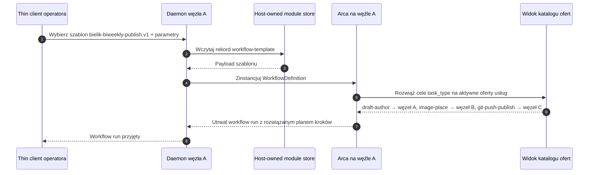
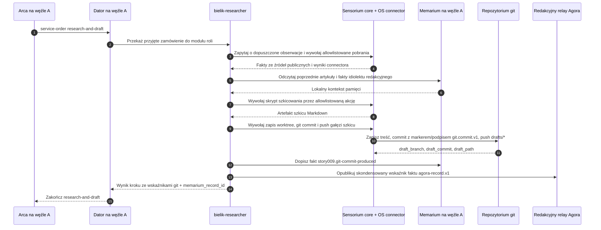
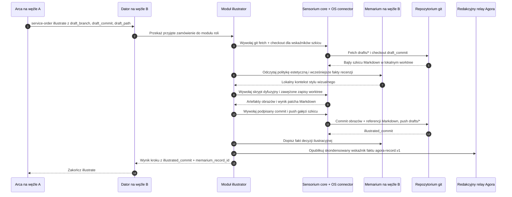
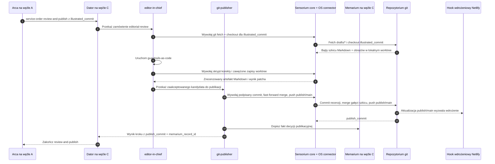
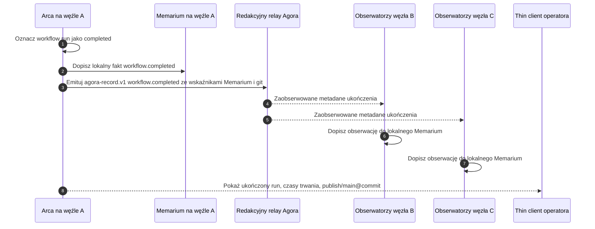

# Story 009: Magazyn publikuje się sam — trzywęzłowy pipeline blogowy o Bieliku prowadzony przez Arcę

## Streszczenie

Jako redaktor naczelny małego, wyrazistego bloga technicznego o polskich
modelach językowych chcę, aby moje trzy węzły Orbiplex — każdy w innej roli —
samodzielnie prowadziły cykl publikacyjny dla modelu językowego **Bielik**:
pierwszy robi research i pisze szkic, drugi go ilustruje, trzeci robi korektę
i wypycha gotowy materiał do gałęzi, którą Netlify automatycznie wdraża jako
stronę zbudowaną przez Hugo.

Moim zadaniem jako operatora jest obserwowanie kanału audytu **Arki** i widzenie,
na którym kroku jesteśmy, kto co podpisał i co trafiło do gita — bez logowania
się do panelu CMS, bez ręcznego sklejania wywołań API i bez jednego wielkiego
skryptu, który "robi wszystko".

Ta story jest bezpośrednim przełożeniem seqnote
["The magazine publishes itself"](https://orbiplex.ai/seq/i-imagine-that/02-the-magazine-publishes-itself/)
na minimalny przepływ techniczny. Seqnote opisuje wizję: zespół redakcyjny jako
**rój** współpracujących, wyspecjalizowanych węzłów ze wspólną pamięcią
(**Memarium**), zamiast pojedynczego "panelu AI" zszytego z usług. Tutaj
schodzimy o jedno piętro niżej: trzy konkretne węzły, jeden konkretny temat
(model Bielik), jeden konkretny *workflow* w **Arce**, jedno repozytorium git
śledzone przez Netlify.

## Aktualna baza używana przez tę story

Story opiera się na:

- **Proposal 029** (Workflow Template Catalog) — definicji
  `WorkflowDefinition` oraz katalogu szablonów: trzy kroki tej story są trzema
  nazwanymi szablonami kroków, parametryzowanymi tematem (`Bielik`) oraz
  docelowym repozytorium.
- **Proposal 033** (Workflow Fan-Out and Temporal Orchestration) — prymitywach
  czasowych (timeout, retry, deadline) dla kroków researchu i recenzji;
  *fan-out* nie jest tu używany (każdy krok ma jeden cel), ale czasowość jest
  kluczowa, aby wolny węzeł nie blokował publikacji.
- **Proposal 019** (Supervised Local HTTP/JSON Middleware Executor) — każdy
  z trzech węzłów uruchamia swoje wyspecjalizowane moduły LLM (research,
  ilustracja, recenzja) jako nadzorowane moduły middleware publikujące aktywne
  oferty dla zadeklarowanych typów zadań.
- **Story 000** — tożsamości węzła i uczestnika, używane przez oferty usług
  oraz zamówienia usług, gdy Arca wybiera dostawcę po `task_type`.
- **Story 008** — wzorcu rekordu podpisanego kluczem uczestnika
  (`PrimaryParticipant`) jako jednostki audytowalnej. Tutaj ten sam mechanizm
  jest używany przez commity git: każdy commit może być podpisany kluczem węzła,
  który go wytworzył, a ślad tego podpisu trafia do Memarium węzła-autora.
- **Redakcyjnym lokalnym relayu Agora** — kanale, przez który trzy węzły
  dzielą się istotnymi **faktami** (publikując rekordy `agora-record.v1`
  z `record/kind` równym `workflow.step.completed`, `workflow.completed`,
  opcjonalnie obserwacjami redakcyjnymi). Każdy węzeł ma **własne, lokalne
  Memarium**; ciągłość pamięci redakcyjnej jest **emergentna**: powstaje z tego,
  że węzły publikują istotne fakty na relayu Agora, a każdy obserwator dopisuje
  je do własnego Memarium. Nie istnieje jeden wspólny magazyn.

### Stratyfikacja transportu (decyzja architektoniczna)

Story jawnie rozdziela dwa kanały:

- **Data plane = git.** Treść artykułu (markdown), ilustracje, korekty
  redakcyjne — wszystko, co stanowi "pracę" — jest przenoszone wyłącznie przez
  repozytorium git (`drafts/bielik-…` ↔ `publish/main`). Bajty nie wchodzą do
  Arki, Agory ani Memarium jako materiał pierwotny.
- **Control plane = Arca + Agora.** Między krokami przekazujemy **wskaźniki**:
  nazwę gałęzi, SHA commita, ścieżki dodanych plików, identyfikator rekordu
  Memarium. To małe, kontrolne, audytowalne dane — naturalnie pasują do
  `input_from_step` (proposal 029) oraz do rekordu `agora-record.v1` (story 008).

Dlatego: **nie wprowadzamy nowego transportu artefaktów**. Proposal 042 (INAC)
oraz schema `memarium-blob.v1` są naturalnym kierunkiem rozszerzenia, gdy zespół
redakcyjny będzie chciał wymieniać artefakty nienadające się do gita (duże
zasoby binarne, poufne briefy) — ale ta story celowo ich nie używa, aby nie
dodawać kodu.

### Lokalna granica działania: Sensorium OS connector

Role specyficzne dla tej story nie uruchamiają poleceń powłoki bezpośrednio.
Role `bielik-researcher`, `illustrator`, `editor-in-chief`, `git-signer` oraz
`git-publisher` posiadają semantykę redakcyjną swoich zadań, ale każda lokalna
akcja systemu operacyjnego potrzebna do ich wykonania jest mediowana przez
`sensorium-core` oraz allowlistowany Sensorium OS connector.

Obejmuje to ścieżki git fetch/checkout/read, zapisy plików w lokalnym worktree,
podpisane commity, strzeżone pushe, wąskie pobieranie źródeł publicznych, gdy
źródło jest reprezentowane operacyjnie jako akcja OS, **oraz samą pracę
generatywną — komponowanie szkicu, generowanie obrazów, korektę językową —
wywoływaną jako allowlistowane skrypty OS connectora opakowujące lokalny model
lub narzędzie węzła**. Moduły ról nie uruchamiają modeli językowych, modeli
dyfuzyjnych ani narzędzi powłoki w swoim procesie; każda jednostka pracy jest
nazwanym `action_id` z zadeklarowaną ścieżką skryptu, schematem parametrów,
timeoutem, `cwd`, środowiskiem, limitami wyjścia, przechwytywaniem artefaktów
oraz efektami ubocznymi — wszystko egzekwowane na granicy connectora. Moduły ról
pozostają konsumentami `sensorium.directive.invoke`; nie otrzymują grantów
`sensorium.connector.invoke` i nie obchodzą `sensorium-core`.

To **nie** zmienia stratyfikacji transportu opisanej wyżej: bajty artykułu nadal
przepływają przez git, nie przez Arcę, Agorę ani Memarium. Sensorium OS connector
jest granicą enakcji dla lokalnych operacji, nie transportem artefaktów i nie
równoległym silnikiem workflow.

Implementacja OS connectora pozostaje agnostyczna względem programu. To, że ta
story używa akcji o nazwach gitowych, nie oznacza, że connector zna git.
Katalog akcji autorowany przez operatora mapuje każde `action_id` na konkretny
skrypt albo wywołanie polecenia, kształt argv, środowisko, envelope klasy,
kontrakt wyniku oraz opcjonalną zawężoną ścieżkę podpisu. Semantyka gita —
checkout, commit, fast-forward, push oraz sposób podpisywania payloadu commita —
żyje w tych skonfigurowanych skryptach i w modułach ról, które je wywołują, a nie
w kodzie connectora.

**Klasyfikacja i autoryzacja akcji pochodzą z proposal 048.** Ta story nie
wprowadza własnego modelu zaufania, własnego formatu allowlisty ani osobnej
ceremonii podpisywania skryptów OS connectora. Każda użyta tutaj akcja należy do
jednej z klas zdefiniowanych w 048, a katalog akcji connectora jest autoryzowany
mechanizmem sidecar-signature z tego proposala. Akcje wymagające podpisów
uczestnika, takie jak podpisane commity git, deklarują ograniczoną ścieżkę
podpisu w tym samym katalogu (na przykład jeden podpis w domenie
`git.commit.v1`); `sensorium-core` i host signer autoryzują ten wąski grant
signera dla uruchamianego skryptu. OS connector nadal tylko uruchamia
skonfigurowany proces i nigdy nie staje się wyrocznią podpisów. W ścieżce demo
świeżej instalacji trzy skrypty story-009 są dostarczane jako **fabryczne
domyślne** elementy Sensorium OS connectora; po pierwszym starcie węzeł
materializuje je w aktywnym obszarze konfiguracji i sam emituje node-signed
sidecar nad scaloną efektywną konfiguracją — więc demo działa bez ceremonii
podpisywania przez operatora, chyba że operator edytuje konfigurację connectora;
wtedy obowiązuje standardowy przepływ dopuszczenia operatora z 048.

Story zakłada, że trzy węzły (`A`, `B`, `C`) działają i każdy uruchamia
**Orbiplex Dator** jako swoją supply-side marketplace facade. Dator na każdym
węźle publikuje aktywne rekordy `service-offer.v1` dla właściwych wartości
`task_type`, przyjmuje przychodzące zamówienia usług z Arki w imieniu lokalnych
modułów ról i egzekwuje ograniczoną postawę akceptacji węzła (głębokość kolejki,
współbieżność, odmowa, gdy lokalny moduł roli nie jest gotowy). W mapowaniu
phase-0 `task_type` jest projektowany na `service/type` w katalogu ofert.
Repozytorium git i konfiguracja Netlify istnieją; są zewnętrznym artefaktem, na
którym ta story wykonuje uzgodnione operacje.

Dator nie jest wykonawcą semantyki redakcyjnej i nie jest aktorem na lokalnym
systemie operacyjnym: jest responder-side mostem między dispatchingiem Arki
a wyspecjalizowanymi modułami middleware ról nazwanymi niżej. Cała praca
redakcyjna jest wykonywana przez moduły ról; wszystkie lokalne akcje OS są
mediowane przez `sensorium-core` i allowlistowany Sensorium OS connector.

Dla tego demo każda oferta publikowana przez Dator każdego węzła ma
`price = 0 ORC` (za darmo). To celowe uproszczenie: tematem tej story jest
orkiestracja redakcyjna i lokalna enakcja, nie settlement. Cena zero utrzymuje
przepływ na jednej ścieżce (`service-offer.v1` → `service-order.v1` → accept →
role module → result) bez podpinania holdów, escrow ani aktualizacji ledgerów.
Warianty z ceną niezerową, negocjacją albo settlementem są osobną story.

## Obsada i scena

- **Węzeł A — *Bielik Researcher*.** Operator:
  `participant:did:key:z6MkA…`. Uruchamia **Dator**, który publikuje aktywne
  oferty dla typów zadań: `llm-research`, `draft-author`,
  `git-commit-draft`, i przyjmuje dla nich zamówienia usług dispatchowane przez
  Arcę. Ma dostęp do **Sensorium** (connectory do źródeł zewnętrznych: arXiv,
  repozytoria GitHub, lista mailingowa Bielika, feedy newsowe) oraz do Sensorium
  OS connectora dla allowlistowanych lokalnych akcji repozytorium i pobierania
  źródeł. Moduł researchera nadal otrzymuje dopuszczone obserwacje jako fakty;
  gdy musi dotknąć lokalnego worktree albo wywołać polecenie pobierające źródło,
  robi to przez mediowaną przez Arcę ścieżkę `sensorium.directive.invoke`.
  Węzeł A ma też dostęp do **własnego, lokalnego Memarium**, które zachowuje
  wcześniejsze artykuły tego węzła o Bieliku i obserwowane fakty publikowane
  przez węzły B i C (decyzje ilustracyjne, rozstrzygnięcia redakcyjne, odrzucone
  warianty wracające z recenzji).
- **Węzeł B — *Illustrator*.** Operator: `participant:did:key:z6MkB…`.
  Uruchamia **Dator**, który publikuje aktywne oferty dla typów zadań:
  `draft-read`, `image-generate`, `image-place`,
  `git-commit-illustrated`, i przyjmuje dla nich zamówienia usług dispatchowane
  przez Arcę. Ma lokalny model dyfuzyjny i **własne lokalne Memarium**, w którym
  trzyma swoją politykę estetyczną (paletę, typografię *hero image*, dozwolone
  style) — politykę zasilaną faktami publikowanymi przez węzeł C (akceptacje
  i odrzucenia ilustracji z poprzednich przebiegów) oraz własnymi decyzjami
  generatywnymi. Git checkout, zapisy worktree, akcje commitów i samo generowanie
  obrazów są mediowane przez Sensorium OS connector: model dyfuzyjny jest
  opakowany jako allowlistowany skrypt connectora, a moduł roli ilustratora
  posiada tylko decyzje semantyczne (co przedstawić, gdzie umieścić każdy obraz,
  jaką politykę estetyczną zastosować) — nie wykonanie modelu w procesie.
- **Węzeł C — *Editor-in-Chief*.** Operator:
  `participant:did:key:z6MkC…`. Uruchamia **Dator**, który publikuje aktywne
  oferty dla typów zadań: `draft-read`, `editorial-review`,
  `guardrails-as-code`, `git-push-publish`, i przyjmuje dla nich zamówienia
  usług dispatchowane przez Arcę. `git-push-publish` jest reklamowany przez
  Dator **tylko na węźle C**; Dator żadnego innego węzła nie publikuje tej
  oferty. Posiada jedyny klucz autoryzowany do *push* na gałąź śledzoną przez
  Netlify (`publish/main`). Ma reguły linii redakcyjnej zainstalowane jako kod
  (proposal 026 §*Guardrails-as-code* — niefunkcjonalny kontrakt na poziomie
  węzła, nie content-schema). Review checkout, signed commit, merge i push są
  mediowane przez Sensorium OS connector, z `git-push-publish` allowlistowanym
  tylko na węźle C.
- **Arca** jako moduł workflow uruchomiony na **jednym** z węzłów (w tej story:
  na węźle A jako hoście, ale to tylko lokalizacja silnika — Arca jest
  *agnostyczna* względem tego, gdzie fizycznie żyją uczestnicy zdefiniowanych
  kroków; znajduje ich przez lookup ofert po task-type).
- **Repozytorium git** `git@example.org:redakcja/blog-bielik.git` ze strukturą
  Hugo (`content/posts/`, `static/img/posts/`, `config.toml`). Gałąź `drafts/*`
  jest dla szkiców i wersji roboczych; gałąź `publish/main` jest jedyną gałęzią
  wdrażaną przez Netlify.
- **Trzy lokalne Memaria** — jedno na węzeł. Każde przechowuje własne fakty
  (co dany węzeł sam wytworzył lub zdecydował) oraz obserwacje istotnych faktów
  innych węzłów, pobrane przez redakcyjny lokalny relay Agora albo przez INAC.
  "Pamięć redakcyjna" jako całość jest **emergentnym widokiem** złożonym z tych
  trzech Memariów; nie istnieje jako jeden wspólny magazyn ani jeden
  autorytatywny backend. Spójność jest osiągana przez append-only records, nie
  przez współdzielony stan.

Tematem tej story jest cykl publikacyjny: **"Co nowego z Bielikiem"** —
okresowy artykuł podsumowujący zmiany, *releases* i sygnały społecznościowe
wokół modelu **Bielik** w rytmie dwutygodniowym.

## Sekwencja kroków

### Krok 0: Operator uruchamia workflow z szablonu

Operator otwiera *thin client* nad węzłem A i wybiera szablon workflow z katalogu
(proposal 029):

```text
template_id: bielik-biweekly-publish.v1
parameters:
  topic: "Bielik"
  cadence_window: { from: "2026-04-03", to: "2026-04-17" }
  repo: "git@example.org:redakcja/blog-bielik.git"
  draft_branch_prefix: "drafts/bielik-"
  publish_branch: "publish/main"
  hugo_section: "posts"
```

Arca na węźle A buduje z tych parametrów konkretną instancję
`WorkflowDefinition`: trzy kroki, każdy z zadeklarowanym celem `task_type`
(zamiast hardkodowanego uczestnika). W runtime Arca pyta powierzchnię katalogu
ofert, kto aktualnie oferuje odpowiadający `service/type`. Dzięki temu, jeśli
węzeł B zawiedzie, a jego rolę przejmie inny węzeł oferujący `image-generate` /
`image-place`, *workflow* nie wymaga edycji.

```json
{
  "workflow_id": "wf:bielik-biweekly:01JRZ…",
  "steps": [
    {
      "id": "research-and-draft",
      "target": { "resolve": "task_type", "task_type": "draft-author" },
      "input": { "topic": "Bielik", "cadence_window": { "from": "2026-04-03", "to": "2026-04-17" } },
      "timing": { "timeout": "PT90M", "on_timeout": "fail" }
    },
    {
      "id": "illustrate",
      "target": { "resolve": "task_type", "task_type": "image-place" },
      "input_from_step": "research-and-draft",
      "timing": { "timeout": "PT30M", "on_timeout": "fail" }
    },
    {
      "id": "review-and-publish",
      "target": { "resolve": "task_type", "task_type": "git-push-publish" },
      "input_from_step": "illustrate",
      "timing": { "timeout": "PT60M", "on_timeout": "fail" },
      "retry": { "max_attempts": 1, "backoff_seconds": 300 }
    }
  ]
}
```

Trzy wartości `timing.timeout` są konkretnym zastosowaniem *temporal
orchestration* z proposal 033: jeśli dostawca nie zwróci wyniku w oknie czasu,
krok zostaje oznaczony jako `timed_out`, a *workflow* zatrzymuje się z tym
statusem. Nie ma cichego ratunku i nie ma fallbacku do innego węzła — operator
ma zobaczyć, że coś utknęło.

### Workflow komunikacji

Poniższe diagramy są celowo **pionowymi scenariuszami transmisji**, a nie jedną
wielką mapą komponentów. Każdy scenariusz pokazuje komunikaty przekraczające
granicę: albo wewnątrz jednego węzła, albo między dwoma węzłami. Bajty artykułu
nigdy nie przechodzą przez Arcę ani Agorę; przez control plane przechodzą tylko
wskaźniki, envelope'y zamówień, fakty i identyfikatory audytu.

#### Krok 0 — lokalna instancjacja workflow na węźle A



#### Krok 1 — węzeł A robi research, szkic, podpis i publikuje fakt szkicu



#### Krok 2 — węzeł B otrzymuje tylko wskaźniki, pobiera bajty przez git i zwraca wskaźniki ilustracji



#### Krok 3 — węzeł C recenzuje przez git, potem wykonuje jedyny publish push



#### Krok 4 — ukończenie workflow jest ogłaszane jako metadane, nie treść



### Krok 1: Węzeł A robi research i pisze szkic

Arca dispatchuje `research-and-draft` do wybranej aktywnej oferty dla typu
zadania `draft-author` (w tej story: węzeł A). Zamówienie trafia do **Datora na
węźle A**, który waliduje je względem postawy akceptacji węzła A (typ zadania
nadal oferowany, kolejka nieprzesycona, lokalny moduł roli gotowy), przyjmuje je
i kieruje payload do modułu roli `bielik-researcher`. Dator śledzi potem stan
zamówienia i wystawia wynik modułu z powrotem Arce. Moduł researchu:

1. Pyta Sensorium o zmiany w temacie `Bielik` w `cadence_window`: nowe
   *releases* na HF, commity w repo `speakleash/Bielik-*`, nowe *issues*
   i *discussions*, wzmianki w wybranych feedach. Sensorium zwraca dopuszczone
   fakty o źródłach publicznych. Jeśli źródło wymaga operacyjnego pobrania,
   a nie już dopuszczonej obserwacji, researcher prosi `sensorium-core`
   o wywołanie allowlistowanej akcji OS connectora; researcher nie uruchamia
   poleceń powłoki bezpośrednio.
2. Pyta **własne, lokalne Memarium** (Memarium węzła A) o **dwie** rzeczy:
   - poprzednie artykuły w tym cyklu (własne szkice plus rekordy publikacji
     zaobserwowane z węzła C — wszystkie wcześniej pobrane z redakcyjnego
     lokalnego relaya Agora),
   - charakterystyczne redakcyjnie frazy i preferowane konstrukcje stylistyczne
     (idiolekt redakcyjny — patrz seqnote — zachowany w Memarium węzła A jako
     jego widok wspólnego stylu, zasilany korektami obserwowanymi z węzła C).
3. Prosi `sensorium-core` o wywołanie allowlistowanej akcji OS connectora, która
   uruchamia lokalny skrypt szkicowania (cienki wrapper nad modelem
   research/drafting węzła). Skrypt przyjmuje dopuszczone fakty Sensorium oraz
   kontekst Memarium jako typowane parametry, działa pod dyscypliną timeoutu /
   `cwd` / limitu wyjścia connectora i zwraca szkic markdown w formacie Hugo
   jako przechwycony artefakt:

```markdown
---
title: "Co nowego z Bielikiem — kwiecień, część druga"
date: 2026-04-17T11:00:00+02:00
draft: true
tags: ["bielik", "llm", "polski"]
---

W ostatnich dwóch tygodniach wokół Bielika wydarzyło się co następuje…
```

Po wytworzeniu szkicu zapis git jest obsługiwany jako osobna ścieżka zadania
Arki (`git-commit-draft`). Rola `git-signer` prosi `sensorium-core` o wywołanie
allowlistowanych akcji OS connectora, które klonują repo (jeśli trzeba), tworzą
gałąź `drafts/bielik-2026-04-17-A`, zapisują plik
`content/posts/2026-04-17-bielik-co-nowego.md`, robią *commit* z podpisem *git*
powiązanym z kluczem uczestnika węzła A (Ed25519 nad kanonicznym obiektem
commita — ten sam mechanizm podpisywania, którego relay Agora używa w story 008,
tylko z innym `domain tag`: `git.commit.v1`) i wypychają gałąź. Podpis może być
wytworzony przez skonfigurowany skrypt przez zawężony grant signera
zadeklarowany dla tej akcji; `sensorium-core` i host signer autoryzują grant,
podczas gdy OS connector tylko uruchamia skonfigurowany proces. Skonfigurowany
skrypt konstruuje Git-specific signing payload i finalizuje commit. Bajty gita
nadal płyną przez git; Sensorium tylko mediuje granicę lokalnej operacji
i zapisuje wyniki dyrektyw.

Wynik kroku zwracany do Arki:

```json
{
  "outcome": "ok",
  "draft_branch": "drafts/bielik-2026-04-17-A",
  "draft_commit": "8fa2…",
  "draft_path": "content/posts/2026-04-17-bielik-co-nowego.md",
  "signature_tracker": {
    "domain": "git.commit.v1",
    "status": "verified",
    "signer": "participant:did:key:z…",
    "signature_digest": "sha256:…"
  },
  "memarium_record_id": "sha256:…"
}
```

`memarium_record_id` wskazuje na rekord faktu "A wytworzył szkic X w odpowiedzi
na *brief* Y w czasie T" — to fakt zapisany w **Memarium węzła A** (autora
kroku), a nie nadpisany stan. Dla podpisanych commitów fakt zapisuje również SHA
commita, domenę podpisu (`git.commit.v1`), tożsamość signera, wartość lub digest
podpisu oraz identyfikatory dyrektywy/wyniku Sensorium, które spowodowały
lokalną akcję. Równolegle węzeł A publikuje skondensowany odpowiednik tego faktu
jako rekord `agora-record.v1` na redakcyjnym lokalnym relayu Agora, aby węzły B
i C — obserwujące ten relay — dopisały swoje kopie do **swoich** Memariów.
Kolejne kroki dopisują dalsze fakty po swojej stronie; nic nie znika i nic nie
jest mutowane.

Granica projekcji pamięci jest celowo ponad Sensorium. OS connector zwraca tylko
JSON skryptu plus artefakty; nie wie, że `draft_commit` jest commitem Git, i nie
zapisuje faktów Memarium. Moduł roli (na przykład `git-signer` albo
`git-publisher`) jest semantycznym właścicielem, który przekształca wynik
dyrektywy Sensorium w fakt `memarium.write`. Dator może zadeklarować, że od
oferty usługi oczekuje się wytworzenia takiego faktu, ale Dator nie powinien
interpretować podpisów commitów ani samodzielnie konstruować payloadu Memarium.

Minimalny payload faktu dla podpisanego commita może więc mieć kształt danych
pochodzących z JSON-a skryptu oraz envelope'u Sensorium:

```json
{
  "fact/kind": "story009.git-commit-produced",
  "fact/schema": "story009.git-commit-produced.v1",
  "subject": {
    "kind": "git-commit",
    "id": "8fa2…"
  },
  "produced_by": {
    "role": "git-signer",
    "node": "node:did:key:z…",
    "participant": "participant:did:key:z…"
  },
  "git": {
    "branch": "drafts/bielik-2026-04-17-A",
    "commit_sha": "8fa2…",
    "paths": ["content/posts/2026-04-17-bielik-co-nowego.md"]
  },
  "signature": {
    "domain": "git.commit.v1",
    "status": "verified",
    "signer": "participant:did:key:z…",
    "signature_digest": "sha256:…"
  },
  "sensorium": {
    "directive/id": "directive:…",
    "outcome/id": "outcome:…",
    "observation/ids": ["obs:…"]
  }
}
```

W obecnym szkielecie referencyjnym commit niesie tylko trailer marker
`Orbiplex-Signature-Domain: git.commit.v1`; ten sam kształt faktu nadal ma
zastosowanie, ale `signature.status` jest `marker-only`, dopóki prawdziwe
podpisywanie obiektu commita przez Ed25519 nie zostanie podpięte przez zawężoną
ścieżkę podpisu z proposal 048.

### Krok 2: Węzeł B czyta szkic i tworzy ilustracje

Arca dispatchuje `illustrate` do dostawcy `image-place` (węzeł B), przekazując
wynik kroku 1 jako wejście. Zamówienie odbiera **Dator na węźle B**, przyjmuje
je zgodnie z postawą akceptacji węzła B i kieruje do modułu roli `illustrator`.
**Wejściem są wskaźniki** (`draft_branch`, `draft_commit`, `draft_path`,
`memarium_record_id`), a nie bajty szkicu — treść artykułu w ogóle nie wchodzi
do data plane Arki. Moduł ilustracyjny:

1. Prosi `sensorium-core` o wywołanie allowlistowanych akcji OS connectora dla
   `git fetch origin drafts/bielik-2026-04-17-A` oraz `git checkout 8fa2…`
   na lokalnym worktree powiązanym z modułem; czyta plik
   `content/posts/2026-04-17-bielik-co-nowego.md`. Bajty szkicu przyszły przez
   kanał git, nie przez kanał Arki.
2. Wyciąga listę motywów wizualnych ze szkicu (tytuł + wybrane nagłówki +
   1–3 dłuższe akapity jako *prompt context*).
3. Pyta **własne, lokalne Memarium** (Memarium węzła B) o politykę estetyczną —
   własne wcześniejsze decyzje generatywne plus akceptacje i odrzucenia
   obserwowane z węzła C we wcześniejszych przebiegach (paleta, format
   *hero image*, czego unikać — np. "nie używać generycznych stockowych obrazów
   serwerowni").
4. Prosi `sensorium-core` o wywołanie allowlistowanej akcji OS connectora, która
   uruchamia lokalny skrypt ilustracyjny opakowujący model dyfuzyjny węzła.
   Skrypt otrzymuje motywy wizualne i politykę estetyczną jako typowane
   parametry, generuje *hero image* + 2–4 ilustracje śródtekstowe i zapisuje je
   do `static/img/posts/2026-04-17/` przez zawężoną akcję worktree-write (tę
   samą dyscyplinę zapisu, której używa markdown). Moduł roli ilustratora nigdy
   nie ładuje modelu dyfuzyjnego w swoim procesie.
5. Edytuje plik markdown, prosząc OS connector o zastosowanie allowlistowanego
   zapisu worktree: dodanie `image:` do frontmatter i wstawienie
   `` we właściwych miejscach.
6. Przez ścieżkę `git-signer` prosi OS connector o *commit* na tej samej gałęzi
   z podpisem klucza uczestnika węzła B (`git.commit.v1`) i push gałęzi szkicu.

Wynik:

```json
{
  "outcome": "ok",
  "illustrated_commit": "1d4c…",
  "images_added": 4,
  "memarium_record_id": "sha256:…"
}
```

### Krok 3: Węzeł C robi korektę i wypycha do publikacji

Arca dispatchuje `review-and-publish` do dostawcy `git-push-publish` (węzeł C).
Wejściem są ponownie tylko wskaźniki z kroku 2 (`illustrated_commit`,
`images_added`, `memarium_record_id`). Zamówienie odbiera **Dator na węźle C** —
jedyny węzeł, którego Dator reklamuje typ zadania `git-push-publish` — przyjmuje
je i kieruje kolejno do modułów ról `editor-in-chief` oraz `git-publisher`.
Moduł redakcyjny:

1. Prosi `sensorium-core` o wywołanie allowlistowanych akcji OS connectora dla
   `git fetch origin drafts/bielik-2026-04-17-A` i `git checkout 1d4c…` —
   bajty szkicu wraz z osadzonymi obrazami przychodzą przez kanał git.
2. Czyta cały plik markdown wraz z osadzonymi obrazami.
3. Stosuje **guardrails-as-code** — reguły wbudowane w kod modułu, nie w prompt:
   - sprawdzenie linii redakcyjnej (zakazane frazy, wymóg atrybucji źródeł,
     limity długości tytułu);
   - sprawdzenie, że frontmatter ma wymagane pola (`title`, `date`, `tags`,
     `image`);
   - sprawdzenie, że `draft: true` zostanie usunięte;
   - sprawdzenie linków (żaden nie zwraca 404);
   - sprawdzenie, że obrazy istnieją pod ścieżkami użytymi w `figure`.
4. Prosi `sensorium-core` o wywołanie allowlistowanej akcji OS connectora, która
   uruchamia lokalny skrypt korekty (cienki wrapper nad modelem językowym
   węzła). Skrypt wykonuje drobne korekty interpunkcji, klarowności i rytmu,
   **bez** zmiany tezy artykułu, i zwraca poprawiony markdown jako przechwycony
   artefakt. Moduł roli `editor-in-chief` nigdy nie ładuje modelu korekty
   w swoim procesie; guardrails-as-code z kroku 3 powyżej pozostają w module
   roli (są kodem, nie skryptem).
5. Zmienia frontmatter (`draft: false`) przez allowlistowany zapis worktree,
   a następnie robi *commit* zmian na gałęzi `drafts/bielik-2026-04-17-A`
   z podpisem węzła C.
6. Przez ścieżkę `git-publisher` prosi OS connector o wykonanie strzeżonego
   *fast-forward merge* gałęzi szkicu do `publish/main` i push `publish/main`
   do origin.

Push do `publish/main` jest jedynym wyzwalaczem publikacji: Netlify nasłuchuje
tej gałęzi i wdraża. Żaden inny węzeł nie ma klucza autoryzowanego do tego
pusha — to jedyne miejsce, gdzie autorytet publikacji jest scentralizowany na
poziomie operacji git, mimo że proces jest rozproszony. Implementacyjnie jest to
jawna ścieżka dyrektywy Sensorium OS mediowana przez Arcę, nie ścieżka
connectora obserwacji/researchu Sensorium.

Wynik:

```json
{
  "outcome": "ok",
  "review_commit": "9a7e…",
  "publish_branch": "publish/main",
  "publish_commit": "9a7e…",
  "memarium_record_id": "sha256:…"
}
```

### Krok 3b: Zweryfikuj fulfillment publikacji

Publikowanie i fulfillment są celowo rozdzielone. To, że `git-push-publish`
zwraca commit id, oznacza, że krok publikacji został wykonany i wytworzył
wskaźnik. Samo w sobie nie dowodzi jeszcze, że zadanie publikacji zostało
spełnione.

Workflow powinien więc móc zadeklarować jawną politykę fulfillmentu dla zadania
publikacji. W kształcie referencyjnym jest to kolejne źródło decyzji:

```json
{
  "step_id": "verify-publication",
  "service_type": "publication-verifier",
  "input_from": ["review-and-publish"],
  "fulfillment": {
    "policy": "external_decision",
    "decision_source": {
      "kind": "capability",
      "capability_id": "story009.publication.verify"
    },
    "result_match": {
      "path": "/verification/status",
      "fulfilled_values": ["fulfilled"],
      "not_fulfilled_values": ["not_fulfilled", "rejected"]
    },
    "on_not_fulfilled": "pause",
    "on_error": "fail"
  }
}
```

Verifier może użyć Sensorium OS connectora oraz allowlistowanego skryptu, aby
uruchomić `git fetch`, obejrzeć refy i zdecydować, czy żądany commit jest
osiągalny z refa publikacji. To tylko jedna implementacja. Decyzja fulfillmentu
mogłaby też pochodzić z innego connectora Sensorium, innej capability middleware
albo potwierdzenia operatora/requestera. Workflow musi jawnie nazwać to źródło.

To utrzymuje wiedzę domenową ponad Arcą, Datorem, Memarium i Sensorium. Skrypt
albo moduł roli świadomy gita wie, co znaczy "opublikowane"; Arca tylko zapisuje
zadeklarowaną decyzję, utrwala jej evidence i decyduje, czy workflow może iść
dalej albo się zakończyć.

Przykładowe wyjście verifiera:

```json
{
  "schema": "task-verification-result.v1",
  "verification/status": "fulfilled",
  "verification/kind": "story009.publication-visible",
  "verified_at": "2026-04-19T12:00:00Z",
  "evidence": {
    "kind": "git-ref-contains-commit",
    "commit_sha": "9a7e...",
    "ref": "origin/publish/main",
    "reachable_from_ref": true
  },
  "retryable": false,
  "memarium_record_id": "sha256:..."
}
```

Kształt `task-verification-result.v1` jest lokalną konwencją tej story, dopóki
drugi workflow nie będzie potrzebował tego samego kontraktu. Nie powinien być
przedwcześnie promowany do globalnej schemy.

### Krok 4: Arca zamyka workflow i ogłasza fakt publikacji

Arca oznacza *workflow run* jako `completed`, zapisuje pełny ślad audytu
(wejście, wyjście i czas każdego kroku, wszystkie podpisy kluczy uczestników)
i emituje rekord `agora-record.v1` z `record/kind: "workflow.completed"` dla
widoków monitorujących i historii. Operator widzi w thin client:

> "Workflow `bielik-biweekly-publish.v1` zakończony. Krok 1: węzeł A
> (53 min). Krok 2: węzeł B (12 min). Krok 3: węzeł C (8 min).
> Publikacja: `publish/main@9a7e…`. Netlify deploy w toku."

Kilka minut później artykuł jest live. Żaden człowiek nie kliknął przycisku
"publish" w panelu CMS.

## Kryteria akceptacji

| # | Kryterium | Weryfikacja |
| :--- | :--- | :--- |
| 1 | `WorkflowDefinition` ma trzy kroki z celami `resolve: task_type`; nie zawiera hardkodowanych identyfikatorów uczestników | inspekcja zapisanego *workflow run* |
| 2 | Krok 1 (`research-and-draft`) kończy się commitem na gałęzi `drafts/bielik-…-A` podpisanym kluczem uczestnika węzła A z domeną podpisu `git.commit.v1` | weryfikacja podpisu obiektu commita |
| 3 | Krok 2 (`illustrate`) commituję na tej samej gałęzi, dodając ≥1 nowy obraz w `static/img/posts/<date>/` oraz co najmniej jedną referencję `` w pliku markdown | diff treści między `draft_commit` i `illustrated_commit` |
| 4 | Krok 3 (`review-and-publish`) zmienia `draft: true` na `draft: false`, wykonuje *fast-forward* `publish/main` do commita z gałęzi szkicu i wypycha **tylko** tę gałąź | inspekcja `git reflog` repozytorium origin |
| 5 | Tylko węzeł C oferuje typ zadania `git-push-publish` i tylko Sensorium OS connector węzła C ma allowlistowaną akcję publikacji dla `publish/main`; próba push `publish/main` z węzła A albo B zawodzi na poziomie polityki git (origin-side albo *pre-receive hook*) lub na poziomie dopuszczenia dyrektywy Sensorium | test negatywny: ręczne wywołanie `git-push-publish` z węzła A musi zostać odrzucone przed lub przy git push |
| 6 | Każdy z trzech kroków, jeśli przekroczy `timing.timeout`, kończy *workflow run* statusem `timed_out` wskazującym konkretny krok; nie ma cichego fallbacku do innego dostawcy | test: sztuczny *sleep* w jednym z modułów dłuższy niż *timeout* |
| 7 | Każdy krok dopisuje co najmniej jeden rekord do **lokalnego Memarium węzła wykonującego krok** (nie do żadnego wspólnego magazynu), którego identyfikator zwraca w wyjściu kroku; rekordy są dopisywane (append-only), nie nadpisywane | inspekcja każdego z trzech Memariów między run 1 i run 2 — wszystkie rekordy z run 1 zachowane |
| 8 | Po `completed` Arca emituje rekord `agora-record.v1` z `record/kind: "workflow.completed"` zawierający `record/about` z linkami do trzech rekordów Memarium (po jednym na krok, każdy w Memarium innego węzła) | inspekcja relaya Agora po zakończonym runie |
| 9 | Cykl można odtworzyć z *workflow run* + sumy trzech lokalnych Memariów — można zrekonstruować, kto co zaproponował, co odrzucono w recenzji i dlaczego, **bez** odwoływania się do wspólnego magazynu | test: usuń *working tree*, odtwórz ścieżkę publikacji wyłącznie z rekordów trzech Memariów + logu Arki |
| 10 | Netlify wdraża **tylko** w wyniku pusha z kroku 3; ręczna zmiana `publish/main` poza runem Arki jest technicznie możliwa, ale staje się rekordem widocznym w logu (nie ukrytą ścieżką) | inspekcja historii wdrożeń Netlify względem logu Arki |
| 11 | Brak jednego wspólnego Memarium: każdy z trzech węzłów ma własną instancję; wymiana faktów między węzłami odbywa się wyłącznie przez podpisane rekordy `agora-record.v1` na redakcyjnym lokalnym relayu Agora | inspekcja konfiguracji: każdy węzeł ma własny `memarium-store`; brak wspólnego mountpointu, brak gałęzi danych, którą wszyscy widzą bez przejścia przez Agorę |
| 12 | **Treść artykułu (markdown + obrazy) w żadnym momencie nie wchodzi do data plane Arki ani do treści rekordów Agora.** Między krokami przekazywane są tylko wskaźniki (`branch`, `commit`, ścieżki, `memarium_record_id`); bajty szkicu i obrazów płyną wyłącznie przez git | inspekcja `input` / `output` każdego kroku w *workflow run*: payload size < 4 KiB, brak pól z bajtami markdown lub obrazów; inspekcja rekordów Agora — `content` zawiera tylko metadane, nie korpus artykułu |
| 13 | Każdy moduł wykonujący krok używający gita zaczyna od wywołania Sensorium OS connectora dla `git fetch`/`git checkout` na podstawie wskaźnika z poprzedniego kroku; nie ma bezpośredniej ścieżki shell i żadnej alternatywnej ścieżki, którą bajty szkicu mogłyby dotrzeć do modułu | code review modułów `illustrator` i `editor-in-chief` plus audyt dyrektyw/wyników Sensorium: jedynym źródłem treści szkicu jest lokalne git worktree |
| 14 | Każde zamówienie usługi dispatchowane przez Arcę jest odbierane przez lokalny `Dator` na węźle odpowiadającym i kierowane do odpowiadającego modułu roli; moduły ról nie otrzymują zamówień Arki żadną inną ścieżką. `git-push-publish` pojawia się jako aktywna oferta tylko w Datorze węzła C | inspekcja offer-catalog + log zamówień Datora na każdym węźle |
| 15 | Każda opublikowana oferta w tej story ma `price.amount = 0` w `ORC` | inspekcja offer-catalog |
| 16 | Cała praca generatywna (komponowanie szkicu, generowanie obrazów, korekta językowa) jest wykonywana jako wywołanie `sensorium.directive.invoke` do allowlistowanej akcji OS connectora opakowującej odpowiedni lokalny model/skrypt; żaden moduł roli nie ładuje modelu językowego ani dyfuzyjnego w swoim procesie | audyt dyrektyw/wyników Sensorium + code review modułów (brak ładowania modelu w procesie) |
| 17 | Katalog akcji OS connectora użyty w tej story jest zadeklarowany w pliku konfiguracyjnym connectora i autoryzowany mechanizmem sidecar-signature z proposal 048 (node-signed przy świeżej instalacji, operator-signed po każdej edycji operatora). Każda akcja użyta przez story należy do jednej z klas z 048, a akcje podpisujące commity deklarują ograniczoną ścieżkę `signing.allowed_domains = ["git.commit.v1"]` zamiast otrzymywać ogólny dostęp signera. Story nie wprowadza równoległej powierzchni zaufania, ad-hoc allowlisty ani osobnego artefaktu podpisu dla akcji OS. | inspekcja konfiguracji OS connectora + pliku sidecar signature; tagi klas, kształty argv, kontrakty wyniku i domeny podpisu odpowiadają tabeli Realisation |

## Czego ta story NIE obejmuje

- **Federacji Memarium poza zespołem redakcyjnym.** Każdy z trzech węzłów ma
  własne lokalne Memarium; spójność redakcyjna jest emergentna, osiągana przez
  redakcyjny lokalny relay Agora. Synchronizacja z innymi zespołami redakcyjnymi
  albo publicznymi rekordami Agora to osobna story.
- **Wymiany artefaktów innej niż przez git.** Kanał INAC (proposal 042) oraz
  schema `memarium-blob.v1` są naturalnym kierunkiem rozszerzenia (duże zasoby
  binarne nienadające się do gita, poufne briefy), ale ta story celowo ich nie
  używa — wszystkie bajty "pracy" płyną wyłącznie przez repozytorium git, aby
  nie wprowadzać drugiego transportu artefaktów obok już wymaganego.
- **Zewnętrznej negocjacji stawek.** Ta story zakłada, że istnieją odpowiednie
  aktywne oferty dla potrzebnych wartości `service/type`. Nie obejmuje
  negocjowania nowych stawek ani dynamicznych warunków komercyjnych z dostawcami
  zewnętrznymi.
- **Fan-outu do wielu researcherów albo wielu ilustratorów.** Ten *workflow*
  jest sekwencyjny 1→1→1. Wariant "trzech ilustratorów konkuruje, recenzja
  wybiera najlepszą pracę" jest bezpośrednim zastosowaniem *fan-out* z proposal
  033 i stanowi osobną story.
- **Reputacji modułów i automatycznej kalibracji.** Tutaj operator decyduje, że
  węzeł A "jest dobry w researchu". Mechanizmy reputacji są poza zakresem.
- **Proxy / delegowanych kluczy.** Wszystkie podpisy używają
  `KeyRef::PrimaryParticipant`. Wariant z `key-delegation.v1` (proposal 032)
  byłby osobnym przepływem.
- **Pełnej polityki antyhalucynacyjnej.** *Guardrails-as-code* na węźle C są tu
  ilustracyjne (kilka prostych reguł). Pełny katalog reguł redakcyjnych jest
  osobnym artefaktem.

## Znaczenie architektoniczne

Ta story jest najmniejszym spójnym wycinkiem, który jednocześnie pokazuje pięć
zobowiązań Orbiplex wyrażonych w seqnote:

1. **Zespół redakcyjny jako rój, nie *pipeline*.** Trzy węzły nie są etapami
   skryptu, lecz **autonomicznymi uczestnikami** z aktywnymi ofertami dla
   zadeklarowanych typów zadań. Arca tylko *proponuje* współpracę — katalog ofert
   rozwiązuje dostawców w czasie runu. Zastąpienie węzła B dowolnym innym węzłem
   oferującym `image-generate` nie wymaga edycji *workflow*.
2. **Pamięć jako infrastruktura, nie log; lokalna, nie współdzielona.** Każdy
   węzeł utrzymuje **własne Memarium** jako dopisywany strumień **faktów**,
   z którego można odtworzyć ścieżkę własnych decyzji. "Pamięć redakcyjna" jako
   całość jest emergentnym widokiem trzech Memariów związanych podpisanymi
   rekordami na redakcyjnym lokalnym relayu Agora. Nikt nie posiada wspólnego
   stanu; każdy posiada własną historię i własną obserwację faktów innych. Nic
   nie jest mutowane "w miejscu".
3. **Stratyfikacja transportu: data plane = git, control plane = Arca + Agora.**
   Bajty "pracy" (markdown, obrazy, korekty) płyną wyłącznie przez repozytorium
   git, które i tak jest wymagane przez architekturę publikacji. Między krokami
   przekazywane są tylko **wskaźniki** (`branch`, `commit`,
   `memarium_record_id`) — pasujące naturalnie do `input_from_step` Arki oraz do
   `content` rekordów `agora-record.v1`. Nie wprowadzamy drugiego transportu
   artefaktów obok istniejącego; daje to konkretną korzyść inżynierską (zero
   nowego kodu transportowego, naturalna audytowalność przez `git log`) oraz
   pojęciową (każda warstwa robi to, do czego się nadaje).
4. **Autorytet publikacji jest jawny i lokalny.** Mimo że proces jest
   rozproszony, autorytet *push* do gałęzi śledzonej przez Netlify posiada
   dokładnie jeden dostawca typu zadania na dokładnie jednym węźle.
   Decentralizacja inteligencji nie oznacza decentralizacji każdej pojedynczej
   operacji — operacje wrażliwe pozostają jawnie skoncentrowane, a reszta procesu
   działa wokół nich.
5. **Granice są kontraktowe, nie ad-hoc.** Każdy krok ma `WorkflowDefinition`
   z jawnym wejściem, wyjściem, *deadline* i polityką *retry*. Nikt "nie rozumie
   bez słów" — każde przejście stanu jest kontraktowo opisane i audytowalne.

Wartość tej story, podobnie jak story 008, leży w *negatywnej prostocie*:
infrastruktura publikacji sama w sobie (Hugo + git + Netlify) jest zwyczajna,
sucho zwyczajna. Nowością jest to, że **proces redakcyjny nad tą infrastrukturą
jest opisany jako współpraca podpisanych węzłów**, a nie jako jeden monolityczny
skrypt CI albo jeden nieskrępowany pracownik AI.

## Realizacja

Tabela poniżej jest **mapą**, nie lustrem. Rozróżnia solution capability
sidecars (np. `arca-caps.edn`) od marketplace'owych nazw `task_type` /
`service/type` reklamowanych przez oferty.

| Zakres | Komponent | Kotwica | Brakująca implementacja, aby ten krok przeszedł | Dokument rozwiązania |
|---|---|---|---|---|
| Krok 0 (lokalne podłoże utrwalania szablonów) | Orbiplex Node (daemon) | Proposal 044 host-owned module store | Gotowe jako podłoże: modułowe rekordy JSON mogą lokalnie utrwalać `record_kind = workflow-template` bez zmian schematu daemona. | [`host-owned-module-store.md`](../60-solutions/host-owned-module-store.md), [`044-host-owned-generic-module-store.md`](../40-proposals/044-host-owned-generic-module-store.md) |
| Krok 0 (instancjacja workflow z szablonu) | Arca | `arca-caps.edn` → `:workflow-template-instantiate` | Gotowe dla lokalnych szablonów: rozwiązuje `template_id` + parametry do konkretnego `WorkflowDefinition`; import publicznych/federowanych szablonów pozostaje poza tym lokalnym wycinkiem. | [`arca.md`](../60-solutions/arca.md) |
| Krok 0 (opcjonalny publiczny katalog szablonów) | Dator / moduł katalogu szablonów | Rola publicznego katalogu szablonów z proposal 029 | Potrzebne tylko wtedy, gdy `bielik-biweekly-publish.v1` jest publikowany/importowany przez publiczny katalog: zaimplementować publikację, listowanie, fetch i przekazanie importu do Arki. Niepotrzebne dla szablonu lokalnego dla daemona. | [`029-workflow-template-catalog.md`](../40-proposals/029-workflow-template-catalog.md) |
| Krok 0 (rozwiązywanie celów po typie zadania) | Arca + offer catalog | `arca-caps.edn` → `:workflow-target-by-task-type`; oferta `service/type` | Gotowe dla lokalnej reguły phase-0: `target.resolve = task_type` mapuje `target.task_type` na `service_type` dla zwykłego wykonania service-order i nie uruchamia host fan-out bez `fan_in`. | [`arca.md`](../60-solutions/arca.md) |
| Kroki 1–3 (publikacja ofert + akceptacja zamówień, per węzeł) | Orbiplex Dator na węzłach A, B, C | publikacja `service-offer.v1` (wszystkie oferty po `price = 0 ORC` dla tego demo); postawa akceptacji `service-order.v1`; projekcja `task_type` ↔ `service/type` | Zaimplementować per węzeł supply-side marketplace facade: publikować aktywne oferty węzła dla zadeklarowanych typów zadań po cenie zero, przyjmować zamówienia dispatchowane przez Arcę według postawy kolejki/współbieżności, kierować przyjęte zamówienia do właściwego lokalnego modułu roli, wystawiać wyniki modułu z powrotem Arce. `git-push-publish` jest reklamowany tylko przez Dator węzła C. | planowany dokument rozwiązania Dator |
| Krok 1 (research) | moduł `bielik-researcher` na węźle A + Sensorium OS connector | task/service types: `llm-research`, `draft-author`; action ids Sensorium dla allowlistowanych pobrań źródeł publicznych, gdy potrzebne. Klasy proposal 048: **C1** dla read-only public-source fetches, **C6 composed-spawn** dla skryptu szkicowania, jeśli łączy LLM egress i zapis worktree. | Zaimplementować wyspecjalizowany kontrakt modułu: pytać dopuszczone obserwacje Sensorium, wywoływać allowlistowane akcje OS connectora dla operacyjnych pobrań źródeł, czytać lokalny kontekst Memarium, wytworzyć szkic, zwrócić Arce tylko wskaźniki git/Memarium. | planowany dokument rozwiązania `bielik-researcher` |
| Krok 1 (podpisany commit) | moduł `git-signer` na węźle A + Sensorium OS connector | task/service type: `git-commit-draft`; action ids Sensorium dla zapisu worktree, commita i push gałęzi szkicu. Klasy proposal 048: **C3 scoped-fs-write** dla zapisu worktree + commit, **C4 egress-network-spawn** dla push gałęzi szkicu; akcje podpisywania commitów dodatkowo deklarują zawężoną ścieżkę `signing.allowed_domains = ["git.commit.v1"]`. | Zaimplementować podpisywanie commitów git kluczem uczestnika i domain tag `git.commit.v1` przez ścieżkę dyrektywy Sensorium OS mediowaną przez Arcę. Katalog akcji mapuje etykiety na skrypty/kształty argv; `sensorium-core`/host autoryzuje zawężony grant signera, OS connector egzekwuje tylko envelope procesu, a skonfigurowany skrypt posiada konstrukcję Git-specific payload. Wystawić pola branch/commit/path/signature tracker jako wyjście kroku. Pozostaje to oddzielone od obserwacji Sensorium: OS connector wykonuje lokalne akcje; obserwacje i wyniki dają audyt. | planowany dokument rozwiązania `git-signer` |
| Krok 2 (ilustracje) | moduł `illustrator` na węźle B + Sensorium OS connector | task/service types: `image-generate`, `image-place`; action ids Sensorium dla checkout, zapisu worktree, commit i push gałęzi szkicu. Klasy proposal 048: **C5 artifact-producing-spawn** dla skryptu modelu dyfuzyjnego (bajty obrazów jako zadeklarowane artefakty), **C3 scoped-fs-write** dla edycji markdown + commit, **C4 egress-network-spawn** dla push. | Zaimplementować pointer-based checkout szkicu przez Sensorium OS, generowanie/umieszczanie obrazów, commit do gałęzi szkicu i emisję wyniku tylko ze wskaźnikami. | planowany dokument rozwiązania `illustrator` |
| Krok 3 (review + guardrails-as-code) | moduł `editor-in-chief` na węźle C + Sensorium OS connector | task/service types: `editorial-review`, `guardrails-as-code`; action ids Sensorium dla checkout i strzeżonych zapisów worktree. Klasy proposal 048: **C2 allowlisted-script** dla skryptu korekty, **C3 scoped-fs-write** dla patcha frontmatter/tekstu i podpisanego commita. | Zaimplementować review nad mediowanym przez Sensorium checkoutem git z guardrails-as-code, zwracając fakty akceptacji/odrzucenia i wskaźniki korekt bez kopiowania bajtów artykułu przez Arcę. | planowany dokument rozwiązania `editor-in-chief` |
| Krok 3 (push do gałęzi publikacyjnej) | moduł `git-publisher` na węźle C + Sensorium OS connector | task/service type: `git-push-publish`; action ids Sensorium dla strzeżonego fast-forward merge i push `publish/main`. Klasa proposal 048: **C7 operator-gated-spawn** — push publikacyjny jest jedyną akcją w tej story, która w każdym niedemonstracyjnym deploymencie POWINNA wymagać autoryzacji operator-signed (nie node-signed); każdy podpisany commit publikacyjny używa tego samego wzorca zawężonej ścieżki podpisu `git.commit.v1`. | Zaimplementować strzeżoną ścieżkę fast-forward/merge/push do `publish/main`, w tym podpisany commit publikacyjny i klasyfikację błędów dla odrzuconych pushy, jako ścieżkę dyrektywy Sensorium OS mediowaną przez Arcę. | planowany dokument rozwiązania `git-publisher` |
| Krok 4 (zapis faktu ukończenia) | Memarium | `memarium-caps.edn` → `:append-fact` | Upewnić się, że każdy uczestniczący moduł dopisuje swój lokalny rekord faktu i zwraca stabilne wskaźniki `memarium_record_id`, które Arca może włączyć do końcowego widoku audytu. | [`memarium.md`](../60-solutions/memarium.md) |
| Krok 4 (publikacja `workflow.completed` na Agorze) | Orbiplex Agora | [`agora-caps.edn`](../60-solutions/agora-caps.edn) → `:agora-record-ingest` | Dodać emiter ukończenia Arca/host dla `agora-record.v1` z `record/kind = workflow.completed`, łączący run id, rekordy kroków, Memarium ids i git refs bez osadzania bajtów treści. | [`agora.md`](../60-solutions/agora.md) |

**Kotwice typów zadań** (nazwy marketplace/service, nie protocol capability
passports):

1. `:workflow-template-instantiate` w `arca-caps.edn` — przyjmuje
   `template_id` + parametry, zwraca konkretną instancję `WorkflowDefinition`
   gotową do dispatch.
2. `llm-research` i `draft-author` jako **dwa osobne** typy zadań — research
   może w przyszłości zostać oddzielony od pisania (np. jeden węzeł zbiera
   materiał, inny pisze), bez zmiany *workflow*.
3. `guardrails-as-code` jako typ zadania osobny od `editorial-review` —
   sygnalizuje, że reguły linii redakcyjnej są wbudowane w kod modułu, nie
   w prompt modelu.
4. `git-push-publish` jako typ zadania osobny od `git-commit-draft` oraz
   `git-commit-illustrated` — fakt, że oferuje go tylko jeden węzeł, jest
   właściwym mechanizmem egzekwowania pojedynczego punktu autoryzacji publikacji.

**Kotwice implementacyjne** (status w `node/docs/implementation-ledger.toml`
i backlogach modułów; nie tutaj):

- `node/agora-core` — używany do podpisania rekordu `workflow.completed`.
- Moduły middleware (`bielik-researcher`, `illustrator`, `editor-in-chief`,
  `git-signer`, `git-publisher`) działają pod proposal 019.
- `Orbiplex Dator` — działa na każdym z trzech węzłów jako supply-side
  marketplace facade, która publikuje aktywne oferty `task_type` węzła
  i przyjmuje zamówienia usług dispatchowane przez Arcę w imieniu lokalnych
  modułów ról.
- Sensorium OS connector — używany przez te moduły ról do allowlistowanych
  lokalnych akcji OS przez `sensorium.directive.invoke`; moduły ról nie
  wywołują `sensorium.connector.invoke` bezpośrednio. Klasyfikacja akcji
  i autoryzacja katalogu idą za **proposal 048** (klasy C1..C7, sidecar
  signature, node-signed factory bootstrap); trzy skrypty story-009 są
  dostarczane jako fabryczne defaulty i podpisywane przez węzeł przy pierwszym
  starcie, więc demo działa bez ceremonii podpisu operatora.
- Workflow Arki — proposal 029 (templates) + proposal 033 (temporal
  orchestration) jako baza kontraktowa.

## Referencje

- `doc/project/40-proposals/029-workflow-template-catalog.md`
  (`WorkflowDefinition`, katalog szablonów)
- `doc/project/40-proposals/033-workflow-fan-out-and-temporal-orchestration.md`
  (timeout / retry / deadline; *fan-out* poza zakresem)
- `doc/project/40-proposals/019-supervised-local-http-json-middleware-executor.md`
  (moduły jako nadzorowane procesy za kontraktami host-owned)
- `doc/project/40-proposals/048-sensorium-os-connector-action-classes.md`
  (klasy akcji C1..C7, edytowalny przez operatora katalog, sidecar
  authorization, node-signed factory bootstrap)
- `doc/project/30-stories/story-000.md` (tożsamość węzła i uczestnika)
- `doc/project/30-stories/story-008-cool-site-comment.md` (wzorzec podpisanego
  rekordu jako jednostki audytowalnej)
- `doc/project/60-solutions/agora-caps.edn` (katalog Agora)
- `doc/project/60-solutions/CAPABILITY-MATRIX.pl.md` (wygenerowany widok statusu)
- ["The magazine publishes itself"](https://orbiplex.ai/seq/i-imagine-that/02-the-magazine-publishes-itself/)
  (seqnote — ludzka motywacja, którą ta story przekłada na minimalny przepływ
  techniczny)
