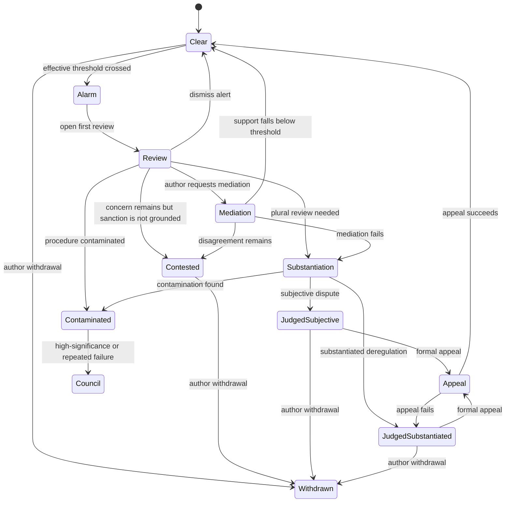

# Proposal 051: Swarm Membership, Reputation Bootstrap, and Public Adjudication

Based on:
- `doc/project/50-requirements/requirements-001-node-onboarding.md`
- `doc/project/40-proposals/015-nym-certificates-and-renewal-baseline.md`
- `doc/project/20-memos/nym-layer-roadmap-and-revocable-anonymity.md`
- `doc/project/20-memos/reputation-signal-v1-invariants.md`
- `doc/project/40-proposals/026-resource-opinions-and-discussion-surfaces.md`
- `doc/normative/50-constitutional-ops/pl/ROOT-IDENTITY-AND-NYMS.pl.md`
- `doc/normative/50-constitutional-ops/en/MEMBERSHIP-AND-SPONSORSHIP-POLICY.en.md`
- `doc/normative/50-constitutional-ops/en/PARTICIPANT-COVENANT.en.md`
- `doc/normative/50-constitutional-ops/en/ADVOCACY-AND-SOLICITATION-POLICY.en.md`
- `doc/normative/50-constitutional-ops/en/MARKETPLACE-ANTI-FRAUD-POLICY.en.md`

## Status

Draft

## Date

2026-04-23

## MVP Decisions Frozen on 2026-05-27

The following decisions are frozen for the MVP membership/sponsorship contract.
Later documents may refine scoring, UX, or federation policy without changing these primitives:

1. Entry is per influence surface, not one global membership bit.
2. Entry classes are defined by `doc/schemas/_shared/membership-enums.v1.schema.json`.
3. Influence surfaces are defined by the same shared enum; the high-trust surface is `public-trust`, while `public-trust-role` remains an entry class.
4. `surface-access-policy.v1` is the canonical policy-axis source of truth.
5. `participant-entry-profile.v1` is a computed subject read model, not an independent source of per-surface permission truth.
6. `participant-effective-limits.v1` is the runtime-facing composed read model for entry defaults, surface policies, capability sanctions, and appeal results.
7. Sponsorship gives candidacy, not authority.
8. Sponsor liability is one-hop by default and becomes wider only after an anti-collusion process establishes a sponsor ring.
9. Sponsorship uses named templates and ordinal liability classes instead of ad-hoc numeric exposure parameters.
10. Public-object adjudication separates alarm, review, mediation/appeal, sanction, and anti-collusion sweep.
11. Anti-collusion MVP baselines are sponsorship velocity, co-flagging coherence, and closed-loop receipt detection.

## Executive Summary

Orbiplex already states that reputation is a safety instrument rather than a
status ladder, that endorsements carry asymmetric risk, and that major
decisions must leave a trace and an appeal path. What is still missing is one
proposal that freezes the bootstrap shape of swarm membership and the first
adjudication layer for public pseudonymous objects.

This proposal covers:

- how a new member enters,
- how sponsorship works,
- how early trust and early accountability compose,
- how artifact-level judgments can turn into participant-level reputation
  events,
- how public objects should be flagged, reviewed, mediated, escalated, and
  appealed,
- and how anti-collusion logic should remain a separate layer rather than a
  hidden side effect of one case.

The decisions of this proposal are:

1. swarm membership SHOULD begin through invitation or sponsorship by at least
   one existing member rather than through anonymous open self-enrollment,
2. sponsorship is not a symbolic gesture; it creates bounded reputational
   exposure for the sponsor,
3. first-run node onboarding SHOULD guide the operator through identity
   creation, role choice, service posture, and community-surface selection,
4. participant reputation is procedural and event-based, not a single global
   score,
5. artifact reputation may affect author reputation only after explicit
   quantity and quality thresholds are crossed,
6. for public pseudonymous artifacts, signaling danger, community judgment, and
   reputational sanction MUST be treated as distinct layers,
7. a participant MAY choose mediation with the parties who influenced a
   reputation event before opening a formal appeal,
8. formal appeal is handled by a randomly selected independent community group
   that did not participate in the original decision and is at least as large
   as the decision-forming group,
9. a separate anti-collusion sweep SHOULD continuously look for correlated
   group behavior and procedural contamination across cases,
10. concrete mechanisms MUST vary by pseudonymization class and accountability
    surface rather than assuming one universal identity regime.

This keeps the stratification clean:

- constitutional and values documents define the principles,
- this proposal defines the bootstrap procedure and decision frame,
- later schemas and implementations specialize by community policy and
  pseudonymization class.

## Context and Problem Statement

Orbiplex already has strong language for:

- procedural reputation,
- appeal rights,
- asymmetric endorsement risk,
- revocable pseudonymity,
- and evidence-based challenge paths.

What it does not yet have is one explicit project-level contract for:

- the first phase of swarm membership,
- the transition from artifact-level judgments to reputation events,
- and the public-object adjudication path that separates alarm from sanction.

Without that contract:

- "joining the community" remains folklore,
- invitation and sponsorship have unclear operational meaning,
- artifact evaluation may drift into ad-hoc author scoring,
- public-object review can collapse into majoritarian reflex,
- appeal rights exist normatively but not yet as a concrete bootstrap flow,
- and privacy-sensitive communities may accidentally copy the wrong
  accountability posture from public or federation-facing layers.

The hard part is not only technical. The membership edge is where:

- trust is weakest,
- social attack cost is lowest,
- Sybil pressure is highest,
- and privacy/accountability trade-offs are easiest to oversimplify.

There is one more problem specific to public pseudonymous surfaces. Some public
objects become strongly nootically charged: an opinion, comment, rating, or
short utterance starts carrying one or several memes in the memetic sense. From
there, groups do not always behave like stable permanent factions. Sometimes the
system is facing exactly that; sometimes it is facing an ad-hoc cluster of
correlated action temporarily assembled around one charged symbol, fear,
identity marker, grievance, or worldview cue.

In a more apophatic and enactive reading, the system should avoid prematurely
reifying "the cartel" as a single durable substance. What must be detected
first is correlated procedural force:

- repeated co-flagging,
- unusually dense co-voting,
- synchronized threshold-pushing,
- asymmetric targeting,
- or self-reinforcing reputation exchange.

This proposal therefore treats collusion primarily as a dynamic procedural
pattern, not only as a named faction with stable membership.

## Goals

- Define the recommended bootstrap path for entering a swarm community.
- Define sponsorship as a first-class accountability relation.
- Freeze the distinction between artifact-level reputation and participant-level
  reputation.
- Define a bootstrap adjudication path for public pseudonymous artifacts.
- Separate alarm, review, sanction, and anti-collusion sweep.
- Define mediation and appeal ordering for bootstrap governance.
- Make pseudonymization class a first-class parameter of these mechanisms.
- Define membership as access to bounded influence surfaces rather than as one
  global "accepted participant" switch.
- Define newcomer capability slow-start as a default safety posture, not as a
  permanent caste.

## Non-Goals

- This proposal does not define the final global reputation engine.
- This proposal does not define exact scoring formulas, weight functions, or
  aggregation math.
- This proposal does not define private deniable communication moderation rules.
- This proposal does not define the final random-selection protocol for every
  review and appeal pool.
- This proposal does not define the final schema family for every membership,
  sponsorship, review, mediation, appeal, or collusion artifact.
- This proposal does not require one network-wide uniform policy. Federations,
  communities, organizations, and private groups may tune thresholds and
  visibility surfaces.

## Decision

### 1. Membership Bootstrap Is Relational

Joining a swarm community SHOULD begin through invitation or sponsorship by at
least one existing member.

The design intent is not aristocratic gatekeeping. The intent is to make entry
into a trust-bearing network social and auditable rather than purely
mechanical. An invitation means:

- an existing participant is willing to create a local trust edge,
- the new participant starts with bounded but non-zero social context,
- and the network can reason about early accountability without pretending that
  all fresh identities are equivalent.

Communities MAY require more than one sponsor for higher-risk roles or broader
service exposure.

Open self-enrollment is not forbidden forever, but if a community permits it,
that path SHOULD carry lower initial trust, tighter capability limits, and
slower eligibility for trust-bearing roles.

The practical rule is:

```text
Orbiplex does not build a wall around personhood.
It builds sluices around shared influence.
```

Membership SHOULD therefore be evaluated per influence surface rather than as a
single global admission bit. Common surfaces include:

- `local-read`,
- `contactability`,
- `public-comment`,
- `public-publishing`,
- `unsolicited-dm`,
- `broadcast`,
- `marketplace`,
- `custody`,
- `routing`,
- `moderation`,
- `arbitration`,
- `governance`,
- and `public-trust`.

Each surface may have its own threshold: contact attestation, sponsorship,
probation, reputation, IAL, source diversity, anti-collusion checks, conflict
disclosure, multisig, or manual review.

The entry class for high-stakes role eligibility remains `public-trust-role`.
The surface where that authority is exercised is `public-trust`.

The default entry ladder is:

- `guest`,
- `contactable-participant`,
- `sponsored-candidate`,
- `probationary-member`,
- `full-participant`,
- `public-trust-role`.

Contact attestation is useful for anti-spam and recovery, but it is not civil
identity and not a substitute for reputation, IAL, or public-trust screening.

### 2. Sponsorship Creates Bounded Reputational Exposure

Sponsorship is not a ceremonial marker. It is a bounded reputational relation.

If a sponsored participant later causes harm, repeatedly violates contracts, or
accumulates serious evidence-backed negative procedural events, the sponsors and
introducers MAY themselves receive derived reputation events proportional to:

- their proximity to the sponsored participant,
- the sponsorship template and declared scope,
- the freshness of that sponsorship,
- and the severity of the resulting harm.

This is the bootstrap form of endorsement asymmetry already present in the
normative layer. The purpose is not collective punishment. The purpose is to
make trust extension carry real care and discernment.

Federation or community policy SHOULD cap how far this derived liability can
propagate and MUST keep it challengeable by evidence and context.

The sponsor does not guarantee the moral essence of the invitee. The sponsor
states only:

> I know this subject well enough to introduce it to this Orbiplex surface, in
> this scope and risk limit, and I accept bounded reputational exposure if that
> act of trust proves grossly careless or collusive.

Sponsorship gives candidacy, not authority. The sponsored participant must still
pass the threshold of the target surface.

The first sponsorship artifact is `membership-sponsorship.v1`.
It SHOULD carry sponsor subject, invitee subject, scopes, `sponsorship/template`,
issued and expiry times, probation window, structured due-diligence references,
revocability, revocation-tail duration, and evidence policy.

Sponsorship templates avoid false precision. The first template set is:

- `light-vouch`,
- `standard-introduction`,
- `strong-vouch`,
- `mentor-with-liability`.

Derived liability SHOULD be bounded by policy and classified ordinally rather
than calculated as a product of local coefficients.
The first liability classes are:

- `negligible`,
- `mitigated`,
- `moderate`,
- `serious`,
- `collusive`.

Each liability decision should state the triggered conditions and evidence refs.
For example, "classified as `serious` because the sponsor ignored three prior
red flags and continued mass-sponsoring into the same surface" is more
auditable than an unexplained numeric score.

Derived sponsor liability is one-hop by default. It should propagate further
only when a separate anti-collusion process establishes an organized
`sponsor-ring`.

To prevent clan capture, a sponsor SHOULD only sponsor into surfaces where the
sponsor has sufficient reputation and authority. Higher-risk surfaces SHOULD
require multiple sponsors from sufficiently independent clusters, active
sponsorship caps, and anti-sponsor-ring monitoring.

### 3. First-Run Node Onboarding Should Be a Guided Wizard

A user starting a local Node SHOULD be guided by a multi-step onboarding wizard
rather than dropped into raw configuration.

The wizard SHOULD at minimum:

- generate or import the operator's identity material,
- explain the selected accountability surface and pseudonymization posture,
- ask which services or roles the operator wants to expose,
- ask whether the node is joining an existing community or starting a new local
  one,
- collect invitation or sponsorship material when applicable,
- and explain the consequences of joining with a public, accountable, or more
  private participation surface.

The first-run experience matters because social bootstrap is part of system
security. Incorrectly defaulting a participant into the wrong visibility or
accountability surface is not a cosmetic error; it can become a privacy breach
or a governance mismatch.

### 4. Reputation Is Event-Based and Multi-Surface

Every participant identity that is visible on a reputation-bearing surface has
reputation, but that reputation MUST be modeled as a history of events and
domain-specific projections rather than as one timeless scalar score.

The practical bootstrap invariant is:

- evidence or judgments produce append-only reputation events,
- read models derive local, domain, and community views from those events,
- and authority decisions should key off those bounded views, not off a myth of
  one universal number.

This keeps reputation auditable and lets communities apply different thresholds
for:

- safety,
- competence,
- reliability,
- social care,
- moderation,
- or service stewardship.

### 5. Artifact Reputation Precedes Author Reputation

When a community evaluates an artifact, service output, publication, or other
user-authored result, the first reputation subject SHOULD be the artifact or
event itself. Participant-level reputation impact should arise only after an
explicit threshold is crossed.

Examples of threshold parameters include:

- minimum number of independent evaluations,
- minimum evidence quality,
- minimum evaluator diversity,
- waiting period before projection to author reputation,
- and conflict-of-interest filtering.

This avoids premature personal scoring from a handful of reactions and keeps the
system closer to facts before identity-level consequences are derived.

A later implementation MAY emit an explicit derived event such as:

- "artifact X crossed threshold T and now contributes procedural/community
  signal Y to author Z".

The threshold policy is local or federation-scoped, not global protocol law.

### 6. Public Adjudication Must Separate Alarm from Sanction

For public objects in a public or otherwise reputation-bearing pseudonymous
surface, Orbiplex SHOULD explicitly distinguish at least four layers:

- `flagging`
- `review`
- `appeal`
- `cartel-detection`

The core invariant is:

```text
Flagging raises an alarm.
Review forms a provisional social judgment.
Appeal challenges that judgment.
Sanction happens only after the judgment path is sufficiently grounded.
```

A cluster of flags MUST NOT by itself be treated as a final reputation penalty.
Otherwise the system becomes cheap to weaponize by:

- majoritarian pressure,
- factional mobilization,
- dynamic meme-driven clustering,
- or ordinary ideological bubbles.

The default public adjudication flow is:



Mediation and council review are branches of one state machine, not parallel
systems of authority.

### 7. Public Adjudication Applies to Publicly Indexed User Objects

The protocol described here is intended for public objects in a public or
otherwise reputation-bearing pseudonymous mode, especially:

- opinions,
- comments,
- ratings,
- short public statements,
- and other publicly indexed user-authored content.

It does not directly govern private deniable communication. At most, aggregate
and anonymized traces from private layers may inform higher-level abuse
detection, but not by silently importing private content into public
adjudication.

### 8. Protocol States Must Preserve Semantic Distinctions

A public object under adjudication SHOULD move through explicit protocol states
rather than a binary "acceptable / punished" model.

The minimum recommended state shape is three orthogonal axes:

- `lifecycle`: `clear`, `under-review`, `judged`, `withdrawn`
- `judgment_qualifier`: `contested`, `subjective`, `substantiated`, `contaminated`
- `withdrawal_reverts_event`: boolean, meaningful only when `lifecycle = withdrawn`

The equivalent diagnostic labels can be rendered as `judged.substantiated`,
`under-review.contaminated`, or `withdrawn.reverted` without multiplying the
wire enum into every possible combination.
These axes matter because the system must be able to say:

- "this object triggered concern",
- "this object is controversial",
- "this object was judged procedurally unsafe",
- or "this case was contaminated and cannot ground a clean sanction"

without collapsing all of those into one punitive label.

### 9. Alarm Thresholds Must Use Independence, Not Raw Count

When participants flag an object as potentially deregulating, the system SHOULD
store not only the raw signal but also enough metadata to reason about
independence and contamination.

At minimum this includes:

- object identity,
- flagger pseudonyms,
- timestamps,
- local justification or reason codes,
- and correlation hints between participating flaggers.

The system SHOULD then derive at least:

- raw flag count,
- effective independent support,
- cluster dispersion,
- growth velocity,
- and historical co-action coherence.

An alert should trigger only when all of the following are true:

- the raw threshold is reached,
- the effective independent threshold is reached,
- and initial contamination is not already too high.

Crossing that threshold creates an alert and review state, not a final author
sanction.

### 10. Provisional Holds Must Stay Mild and Reversible

If a deployment wants immediate defensive reaction, it MAY apply only a mild and
reversible provisional hold at alert time.

The hold:

- MUST be reversible,
- MUST NOT be treated as final guilt,
- and MUST automatically roll back if the later review path does not
  substantiate the case.

This keeps the safety posture responsive without letting the alert threshold
silently become punishment.

### 11. First Review Must Be Anti-Collusive and Temporarily Blind

The first review answers a narrower question than the final sanction path:

> does this alert appear to come from plural enough social concern, or mainly
> from a local faction, correlated cluster, or contaminated process?

The reviewing group SHOULD therefore be:

- smaller than the later escalation jury,
- selected with anti-collusion filters,
- and hidden until the voting window closes.

Selection SHOULD be drawn from several baskets at once, for example:

- high procedural reputation,
- medium but stable reputation,
- graph distance from the author and principal flaggers,
- topic competence,
- and low historical co-voting correlation.

Candidates SHOULD be excluded when they:

- are too close to the author,
- are too close to the primary flagging cluster,
- belong to an already overrepresented dense cluster,
- show strong prior signs of collusive co-action,
- or have an active conflict of interest.

The first review SHOULD be able to emit at least:

- `dismiss-alert`
- `continue-as-contested`
- `continue-to-mediation`
- `continue-to-substantiation`
- `mark-review-contaminated`

### 12. Mediation Comes Before Formal Appeal When the Participant Chooses It

Before opening a formal appeal, the affected participant MAY choose mediation
with the person or group that influenced the reputation event.

Typical cases include:

- evaluators of an artifact,
- a moderation subgroup,
- sponsors contesting how derived liability was applied,
- or other participants whose judgments contributed directly to the event.

Mediation is not mandatory. It is an optional lower-cost path that can:

- correct misunderstanding,
- add missing context,
- retract low-quality inputs,
- or narrow the dispute before it reaches a formal review group.

If mediation fails, is refused, or is inappropriate due to direct safety risk,
the participant retains the full right to formal appeal.

For public-object adjudication, mediation is especially useful after a first
review but before larger escalation. It is one bounded chance to let the author
submit justification and let original flaggers:

- maintain their flag,
- withdraw it,
- soften their classification,
- or remain silent until expiry.

If mediation drops the effective support below the safety threshold, the object
SHOULD return to `contested` or `clear`, and any provisional hold MUST be
reverted.

### 13. Community Escalation Must Be Larger, More Plural, and Anti-Collusive

If the case continues, the next layer is community escalation through a larger,
plural, anti-collusively selected jury.

This jury SHOULD:

- be substantially larger than the first review pool,
- preserve strict anti-cluster composition rules,
- require both nominal quorum and effective pluralistic participation,
- and receive the object plus structured case material, but not a herd-forming
  "N people already condemned this" summary.

Jurors SHOULD be asked on multiple axes rather than by a single binary button.
The minimum useful questions are:

1. does the object violate conditions of cooperation?
2. is the current classification too strong?
3. does the case mainly express ideological disagreement?
4. does the input procedure appear contaminated?

Each juror SHOULD also choose one class such as:

- `not-deregulation`
- `subjective-dispute`
- `possible-deregulation`
- `substantiated-deregulation`
- `procedural-contamination`

and provide a short justification.

If quorum is insufficient, the result SHOULD be `insufficient-quorum` and the
protocol MAY re-open the case only through backoff windows rather than immediate
retries.

### 14. Final Reputation Events Require Substantiation

The cautious default is:

- alert stage -> at most provisional hold,
- substantiated escalation result -> final reputation event,
- successful challenge or contamination finding -> full rollback of the
  reputation consequence while preserving procedural metadata.

This is the point where the proposal most clearly rejects soft tyranny by raw
majority. The sanction should be grounded only after enough independent review
has survived:

- anti-collusion filtering,
- mediation or challenge opportunity,
- and a plural final review path.

### 15. Object Withdrawal Should Revert the Linked Reputation Event When Early Enough

The author MAY withdraw the object regardless of case status.

If the object is withdrawn within a policy-defined early window, the system MAY:

- mark the object as withdrawn,
- revert the linked reputation event,
- and keep only the procedural metadata needed for audit, cartel detection, and
  historical reconstruction.

This gives the protocol a repair path without pretending that the case never
happened.

### 16. Formal Appeal Uses an Independent Randomly Selected Community Group

A formal appeal MUST be handled by an independent randomly selected community
group whose members:

- did not participate in the original decision,
- do not have a declared conflict of interest in the matter,
- and are numerous enough to avoid being weaker than the original decision
  surface.

The bootstrap minimum is:

- the appeal group is at least as large as the group whose decision or combined
  judgments produced the original reputation event.

The purpose is procedural symmetry. A participant should not need to overturn a
group decision before a smaller or less independent body than the one that
produced it.

The exact random-selection machinery remains open. Different communities may use
different admissible pools, reputation gates, recusals, and quorum rules, so
long as the resulting process stays:

- auditable,
- conflict-aware,
- and challengeable.

This rule applies both to ordinary appeal of participant-level decisions and to
appeal of public-object adjudication results.

### 17. Newcomers Use Slow-Start Capability Limits

A new or low-evidence participant SHOULD receive narrow initial influence
limits.
The canonical newcomer fixtures are:

- `doc/schemas/examples/default.surface-access-policy.json`
- `doc/schemas/examples/newcomer.participant-entry-profile.json`
- `doc/schemas/examples/newcomer.participant-effective-limits.json`

These limits are not a punishment. They represent influence that has not yet
been earned. `participant-entry-profile.v1` is a computed subject read model.
`participant-effective-limits.v1` composes entry defaults, surface policy,
sanctions, and appeal results into the runtime-facing view.
A separate `participant-capability-limits.v1` artifact may express sanctions or
explicit restrictions, but it should not be confused with ordinary newcomer
entry policy.

### 18. Spam, Solicitation, Advocacy, and Fraud Are Surface-Abuse Classes

Orbiplex SHOULD avoid global worldview bans. It SHOULD instead regulate how
shared communication and marketplace surfaces are used.

The default abuse rules are:

- no broadcast or unlimited unsolicited DM for fresh participants,
- no mass import of contacts without relationship or recipient consent,
- no unsolicited political, ideological, religious, campaign, or financial
  persuasion outside opt-in surfaces,
- clear tags for advocacy and campaign content,
- material conflict-of-interest and sponsorship disclosure,
- marketplace offers through explicit marketplace/service surfaces, not hidden
  acquisition funnels,
- low value caps and escrow/procurement contracts for newcomers,
- no transferable reputation from self-dealing or closed receipt loops.

This preserves pluralism while defending the surfaces on which pluralism
depends.

### 19. Governance Council Is Reserved for High-Significance or Contaminated Cases

The governance-council layer SHOULD remain exceptional.

It is appropriate only for cases such as:

- highly precedent-setting disputes,
- very large or heavily contested public cases,
- repeated failed escalation attempts,
- explicit `review-contaminated` outcomes,
- or disputes that require constitutional interpretation.

The design goal is not to create a standing aristocracy. The goal is to provide
one higher procedural layer for rare cases where ordinary community escalation
is insufficient or itself compromised.

Council composition SHOULD mix:

- attested expertise,
- procedurally trusted participants,
- anti-cluster random selection,
- and rotating civic assessors.

Council decisions SHOULD permit:

- full justification,
- separate opinions,
- conflict-of-interest registry,
- ex post audit,
- and doctrinal revision later without forcing retroactive erasure of every old
  case.

### 20. Anti-Collusion Sweep Must Be a Separate Continuous Subsystem

Cartel detection should not live only inside one case file. Orbiplex SHOULD run
it as a separate periodic sweep over many cases.

Its purpose is not primarily punitive. It is to:

- detect correlated procedural force,
- reduce the influence of highly correlated groups,
- improve future jury selection,
- mark cases as potentially contaminated,
- and, only when needed, open separate procedural-abuse review.

Useful sweep inputs include:

- flagging history,
- co-voting history,
- co-occurrence in disputes,
- timing patterns,
- mutual reputation boosting,
- topic distribution,
- asymmetry of targeting,
- and mediation and escalation metadata.

The MVP baseline detectors are deliberately narrow:

- sponsorship: abnormal sponsorship velocity,
- public adjudication: co-flagging coherence across objects,
- marketplace: closed-loop receipt detection.

Additional detector families should be added only when a concrete operational
need appears, so "anti-collusion" does not become an unbounded bucket.

The sweep SHOULD prefer graded outputs such as:

- `low-correlation`
- `watch`
- `elevated-collusion-risk`
- `high-collusion-risk`

rather than a binary "cartel / not cartel" ontology.

This again matches the apophatic-enactive caution of the proposal: the system
should first see dynamic correlated patterns before it reifies them as enduring
factions.

### 21. Influence Weighting Must Track Independence

The effective force of a set of flags or votes SHOULD depend not only on the
number of accounts but on their independence.

In practice this weighting should inform:

- alert thresholds,
- mediation outcome assessment,
- escalation validity,
- contamination scoring,
- and future reviewer selection.

This means that 150 accounts from one dense correlation cluster need not count
as 150 independent judgments.

### 22. Public Agora Nodes May Host Aggregates, Not Final Authority

Public Agora nodes MAY host public aggregation and query surfaces for
reputation-relevant artifacts, for example:

- public counts of flags, reviews, and appeals,
- public timelines of object-case state transitions,
- public derived read models for artifact reputation,
- public candidate projections of participant or nym reputation,
- and public dashboards of collusion-risk or contamination markers.

This is acceptable because Agora is already the public substrate for ingest,
query, and subscription of relevant records. What MUST remain separated is the
difference between:

- storing and serving public facts,
- projecting those facts into one read model,
- and issuing an authoritative reputation judgment.

Therefore a public Agora-backed reputation surface is allowed only as:

- an index,
- a projection,
- a read model,
- or a publicly inspectable candidate view.

It MUST NOT silently become the sole authoritative reputation layer for the
network.

If a federation or community wants a public Agora-backed reputation service,
that service SHOULD be modeled as a separate policy-bearing component operating
over Agora data, not as Agora itself.

This preserves the stratification:

- Agora stores and serves records,
- reputation components evaluate policy and derive judgments,
- nodes remain free to accept, reject, or down-weight a given public projection
  under local policy.

### 23. Pseudonymization Class Changes the Appropriate Mechanism

The concrete membership, sponsorship, reputation, review, mediation, appeal,
and collusion-handling mechanics MUST depend on the pseudonymization class and
accountability surface defined elsewhere in Orbiplex.

This proposal explicitly does **not** assume that one mechanism fits:

- `accountable-nym`,
- `private-nym`,
- public federation participation,
- local community participation,
- organization-scoped membership,
- or future stronger anonymity constructions.

Examples:

- in an `accountable-nym` context, ordinary public or domain reputation and
  sponsor liability may be appropriate,
- in a `private-nym` context, community-local invite graphs, scoped reputation,
  sealed adjudication, or group-local exclusion handles may be more appropriate
  than portable public sanctions,
- a private group may need stronger local exclusion without creating a global
  cross-group correlation handle,
- and an organization may use different membership visibility and appeal pools
  from a public federation.

Therefore the invariant is:

```text
The stronger the public blast radius, the stronger the accountability hook.
The more consent-bound and private the context, the stronger the unlinkability default.
```

This proposal should be implemented in conjunction with the evolving nym and
root-identity documents, not as an independent identity regime.

### 24. Concrete Mechanisms Remain Community-Policy Objects

The following items are intentionally left as policy parameters or later
artifacts:

- sponsor count required for entry,
- sponsor-liability window,
- alert thresholds,
- minimum effective-independent support,
- contamination cutoffs,
- thresholds for artifact-to-author reputation projection,
- mediation timeout and admissibility,
- size and eligibility of review and appeal pools,
- evidence threshold for high-stakes sanctions,
- whether reputation is public, domain-local, community-local, or hidden,
- and how pseudonymization-class-specific exclusions are implemented.

Orbiplex should freeze the shape early, but not pretend that every community
must share identical social mechanics.

## Suggested Future Artifact Families

This proposal now freezes the first small membership and surface-policy artifact
family. These are the immediate contracts:

- `membership-invitation.v1`
- `membership-sponsorship.v1`
- `membership-acceptance.v1`
- `participant-entry-profile.v1`
- `participant-effective-limits.v1`
- `surface-access-policy.v1`

The broader public adjudication and reputation family remains future work:

- `object-review-case.v1`
- `object-flag-event.v1`
- `review-round.v1`
- `review-vote.v1`
- `reputation-event.v1` or a specialization of `reputation-signal.v1`
- `reputation-mediation-request.v1`
- `reputation-mediation-outcome.v1`
- `reputation-appeal-request.v1`
- `reputation-appeal-decision.v1`
- `collusion-signal.v1`

The preferred shape is append-only facts plus read models, not mutable
"membership status" rows as the primary source of truth.

## Resolved Design Decisions

- Sponsor liability is direct and one-hop by default; further propagation is
  reserved for proven sponsor-ring behavior.
- Contact attestation unlocks contactability and anti-spam affordances only; it
  is not legal identity and not public-trust eligibility.
- Open self-enrollment is allowed only as low-trust entry with tighter limits
  and slower access to high-impact surfaces.
- Newcomer limits are entry policy. `participant-capability-limits.v1` remains
  sanction or restriction policy.
- `surface-access-policy.v1` is the policy-axis source of truth.
  `participant-entry-profile.v1` and `participant-effective-limits.v1` are
  computed read models.
- Sponsorship uses templates and ordinal liability classes instead of numeric
  pseudo-precision.
- Public-object state uses lifecycle, judgment qualifier, and withdrawal-reverts
  axes instead of one compound enum.
- The first anti-collusion baselines are sponsorship velocity, co-flagging
  coherence, and closed-loop receipt detection.
- Political, ideological, religious, and campaign content is allowed on
  explicit opt-in surfaces; non-consensual high fan-out persuasion is the abuse
  class.
- Marketplace reputation must be evidence-backed through settled interactions,
  not self-dealing or closed-loop boosting.

## Open Questions

1. What minimal diversity constraints should be required before artifact-level
   sentiment becomes author-level reputation?
2. How should random selection for review and appeal groups be seeded and
   audited without creating a manipulable lottery?
3. Which contamination heuristics should remain only heuristic signals, and
   which are strong enough to trigger procedural rollback by default?
4. Which parts of membership bootstrap belong to the local node wizard, and
   which should remain explicit social actions performed outside the node?
5. Which bootstrap and dispute artifacts should be portable across communities,
   and which must remain local to the group's policy surface?

## Implementation Direction

The recommended order is:

1. freeze bootstrap invariants and terminology,
2. define the first small artifact family,
3. implement first-run onboarding wizard support,
4. implement community-local read models for sponsorship, reputation events,
   object review, mediation, appeals, and collusion-sweep signals,
5. add stricter pseudonymization-class-specific machinery where privacy posture
   requires it.

This keeps the first implementation usable without forcing the final reputation
or privacy architecture to be completed upfront.
