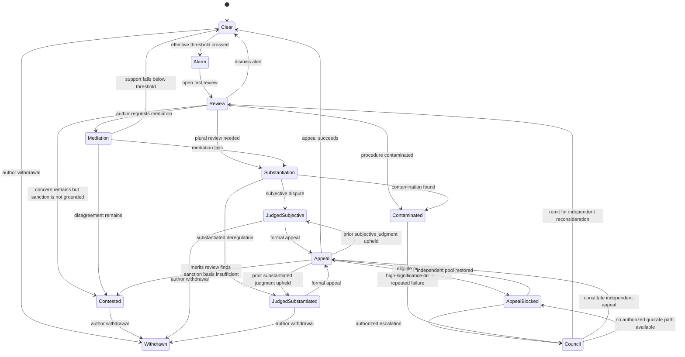

# Proposal 051: Swarm Membership, Reputation Bootstrap, and Public Adjudication

Based on:
- `doc/project/50-requirements/requirements-001-node-onboarding.md`
- `doc/project/40-proposals/015-nym-certificates-and-renewal-baseline.md`
- `doc/project/20-memos/nym-layer-roadmap-and-revocable-anonymity.md`
- `doc/project/20-memos/reputation-signal-v1-invariants.md`
- `doc/project/40-proposals/026-resource-opinions-and-discussion-surfaces.md`
- `doc/project/40-proposals/080-multiplexed-middleware-channel-executor.md`
- `doc/project/60-solutions/019-middleware/019-middleware.md`
- `doc/normative/50-constitutional-ops/pl/ROOT-IDENTITY-AND-NYMS.pl.md`
- `doc/normative/50-constitutional-ops/en/MEMBERSHIP-AND-SPONSORSHIP-POLICY.en.md`
- `doc/normative/50-constitutional-ops/en/PARTICIPANT-COVENANT.en.md`
- `doc/normative/50-constitutional-ops/en/ADVOCACY-AND-SOLICITATION-POLICY.en.md`
- `doc/normative/50-constitutional-ops/en/MARKETPLACE-ANTI-FRAUD-POLICY.en.md`
- `doc/normative/50-constitutional-ops/en/PANEL-SELECTION-PROTOCOL.en.md`
- `doc/normative/50-constitutional-ops/en/ABUSE-DISCLOSURE-PROTOCOL.en.md`
- `doc/normative/50-constitutional-ops/en/PROCEDURAL-REPUTATION-SPEC.en.md`
- `doc/normative/50-constitutional-ops/en/REPUTATION-VALIDATION-PROTOCOL.en.md`
- `doc/normative/50-constitutional-ops/en/NODE-RIGHTS-CARD.en.md`

## Status

Draft

## Date

2026-04-23

Design/reuse review: 2026-10-10. The original date and frozen decisions remain;
the social-correction integration below is planned, not a runtime completion claim.

## MVP Decisions Frozen on 2026-05-27

The following decisions are frozen for the MVP membership/sponsorship contract.
Later documents may refine scoring, UX, or federation policy without changing these primitives:

1. Entry is per influence surface, not one global membership bit.
2. Entry classes are defined by `doc/schemas/_shared/membership-enums.v1.schema.json`.
3. Influence surfaces are defined by the same shared enum; the high-trust surface is `public-trust`, while `public-trust-role` remains an entry class.
4. `surface-access-policy.v1` is the canonical policy-axis source of truth.
5. `participant-entry-profile.v1` is a computed subject read model, not an independent source of per-surface permission truth.
6. `participant-effective-limits.v1` is the runtime-facing composed read model for entry defaults, surface policies, capability sanctions, and appeal results.
7. Sponsorship gives candidacy, not authority.
8. Sponsor liability is one-hop by default and becomes wider only after an anti-collusion process establishes a sponsor ring.
9. Sponsorship uses named templates and ordinal liability classes instead of ad-hoc numeric exposure parameters.
10. Public-object adjudication separates alarm, review, mediation/appeal, sanction, and anti-collusion sweep.
11. Anti-collusion MVP baselines are sponsorship velocity, co-flagging coherence, and closed-loop receipt detection.

## Executive Summary

Orbiplex already states that reputation is a safety instrument rather than a
status ladder, that endorsements carry asymmetric risk, and that major
decisions must leave a trace and an appeal path. What is still missing is one
proposal that freezes the bootstrap shape of swarm membership and the first
adjudication layer for public pseudonymous objects.

This proposal covers:

- how a new member enters,
- how sponsorship works,
- how early trust and early accountability compose,
- how artifact-level judgments can turn into participant-level reputation
  events,
- how public objects should be flagged, reviewed, mediated, escalated, and
  appealed,
- and how anti-collusion logic should remain a separate layer rather than a
  hidden side effect of one case.

The decisions of this proposal are:

1. swarm membership SHOULD begin through invitation or sponsorship by at least
   one existing member rather than through anonymous open self-enrollment,
2. sponsorship is not a symbolic gesture; it creates bounded reputational
   exposure for the sponsor,
3. first-run node onboarding SHOULD guide the operator through identity
   creation, role choice, service posture, and community-surface selection,
4. participant reputation is procedural and event-based, not a single global
   score,
5. artifact reputation may affect author reputation only after explicit
   quantity and quality thresholds are crossed,
6. for public pseudonymous artifacts, signaling danger, community judgment, and
   reputational sanction MUST be treated as distinct layers,
7. a participant MAY choose mediation with the parties who influenced a
   reputation event before opening a formal appeal,
8. formal appeal is handled by a randomly selected independent community group
   that did not participate in the original decision and is at least as large
   as the decision-forming group within the applicable panel-size rules,
9. a separate anti-collusion sweep SHOULD continuously look for correlated
   group behavior and procedural contamination across cases,
10. concrete mechanisms MUST vary by pseudonymization class and accountability
    surface rather than assuming one universal identity regime.

This keeps the stratification clean:

- constitutional and values documents define the principles,
- this proposal defines the bootstrap procedure and decision frame,
- later schemas and implementations specialize by community policy and
  pseudonymization class.

## Context and Problem Statement

Orbiplex already has strong language for:

- procedural reputation,
- appeal rights,
- asymmetric endorsement risk,
- revocable pseudonymity,
- and evidence-based challenge paths.

What it does not yet have is one explicit project-level contract for:

- the first phase of swarm membership,
- the transition from artifact-level judgments to reputation events,
- and the public-object adjudication path that separates alarm from sanction.

Without that contract:

- "joining the community" remains folklore,
- invitation and sponsorship have unclear operational meaning,
- artifact evaluation may drift into ad-hoc author scoring,
- public-object review can collapse into majoritarian reflex,
- appeal rights exist normatively but not yet as a concrete bootstrap flow,
- and privacy-sensitive communities may accidentally copy the wrong
  accountability posture from public or federation-facing layers.

The hard part is not only technical. The membership edge is where:

- trust is weakest,
- social attack cost is lowest,
- Sybil pressure is highest,
- and privacy/accountability trade-offs are easiest to oversimplify.

There is one more problem specific to public pseudonymous surfaces. Some public
objects become strongly nootically charged: an opinion, comment, rating, or
short utterance starts carrying one or several memes in the memetic sense. From
there, groups do not always behave like stable permanent factions. Sometimes the
system is facing exactly that; sometimes it is facing an ad-hoc cluster of
correlated action temporarily assembled around one charged symbol, fear,
identity marker, grievance, or worldview cue.

In a more apophatic and enactive reading, the system should avoid prematurely
reifying "the cartel" as a single durable substance. What must be detected
first is correlated procedural force:

- repeated co-flagging,
- unusually dense co-voting,
- synchronized threshold-pushing,
- asymmetric targeting,
- or self-reinforcing reputation exchange.

This proposal therefore treats collusion primarily as a dynamic procedural
pattern, not only as a named faction with stable membership.

## Goals

- Define the recommended bootstrap path for entering a swarm community.
- Define sponsorship as a first-class accountability relation.
- Freeze the distinction between artifact-level reputation and participant-level
  reputation.
- Define a bootstrap adjudication path for public pseudonymous artifacts.
- Separate alarm, review, sanction, and anti-collusion sweep.
- Define mediation and appeal ordering for bootstrap governance.
- Make pseudonymization class a first-class parameter of these mechanisms.
- Define membership as access to bounded influence surfaces rather than as one
  global "accepted participant" switch.
- Define newcomer capability slow-start as a default safety posture, not as a
  permanent caste.

## Non-Goals

- This proposal does not define the final global reputation engine.
- This proposal does not define exact scoring formulas, weight functions, or
  aggregation math.
- This proposal does not define private deniable communication moderation rules.
- This proposal does not define the final random-selection protocol for every
  review and appeal pool.
- This proposal does not define the final schema family for every membership,
  sponsorship, review, mediation, appeal, or collusion artifact.
- This proposal does not require one network-wide uniform policy. Federations,
  communities, organizations, and private groups may tune thresholds and
  visibility surfaces.

## Decision

### 1. Membership Bootstrap Is Relational

Joining a swarm community SHOULD begin through invitation or sponsorship by at
least one existing member.

The design intent is not aristocratic gatekeeping. The intent is to make entry
into a trust-bearing network social and auditable rather than purely
mechanical. An invitation means:

- an existing participant is willing to create a local trust edge,
- the new participant starts with bounded but non-zero social context,
- and the network can reason about early accountability without pretending that
  all fresh identities are equivalent.

Communities MAY require more than one sponsor for higher-risk roles or broader
service exposure.

Open self-enrollment is not forbidden forever, but if a community permits it,
that path SHOULD carry lower initial trust, tighter capability limits, and
slower eligibility for trust-bearing roles.

The practical rule is:

```text
Orbiplex does not build a wall around personhood.
It builds sluices around shared influence.
```

Membership SHOULD therefore be evaluated per influence surface rather than as a
single global admission bit. Common surfaces include:

- `local-read`,
- `contactability`,
- `public-comment`,
- `public-publishing`,
- `unsolicited-dm`,
- `broadcast`,
- `marketplace`,
- `custody`,
- `routing`,
- `moderation`,
- `arbitration`,
- `governance`,
- and `public-trust`.

Each surface may have its own threshold: contact attestation, sponsorship,
probation, reputation, IAL, source diversity, anti-collusion checks, conflict
disclosure, multisig, or manual review.

The entry class for high-stakes role eligibility remains `public-trust-role`.
The surface where that authority is exercised is `public-trust`.

The default entry ladder is:

- `guest`,
- `contactable-participant`,
- `sponsored-candidate`,
- `probationary-member`,
- `full-participant`,
- `public-trust-role`.

Contact attestation is useful for anti-spam and recovery, but it is not civil
identity and not a substitute for reputation, IAL, or public-trust screening.

### 2. Sponsorship Creates Bounded Reputational Exposure

Sponsorship is not a ceremonial marker. It is a bounded reputational relation.

If a sponsored participant later causes harm, repeatedly violates contracts, or
accumulates serious evidence-backed negative procedural events, the sponsors and
introducers MAY themselves receive derived reputation events proportional to:

- their proximity to the sponsored participant,
- the sponsorship template and declared scope,
- the freshness of that sponsorship,
- and the severity of the resulting harm.

This is the bootstrap form of endorsement asymmetry already present in the
normative layer. The purpose is not collective punishment. The purpose is to
make trust extension carry real care and discernment.

Federation or community policy SHOULD cap how far this derived liability can
propagate and MUST keep it challengeable by evidence and context.

The sponsor does not guarantee the moral essence of the invitee. The sponsor
states only:

> I know this subject well enough to introduce it to this Orbiplex surface, in
> this scope and risk limit, and I accept bounded reputational exposure if that
> act of trust proves grossly careless or collusive.

Sponsorship gives candidacy, not authority. The sponsored participant must still
pass the threshold of the target surface.

The first sponsorship artifact is `membership-sponsorship.v1`.
It SHOULD carry sponsor subject, invitee subject, scopes, `sponsorship/template`,
issued and expiry times, probation window, structured due-diligence references,
revocability, revocation-tail duration, and evidence policy.

Sponsorship templates avoid false precision. The first template set is:

- `light-vouch`,
- `standard-introduction`,
- `strong-vouch`,
- `mentor-with-liability`.

Derived liability SHOULD be bounded by policy and classified ordinally rather
than calculated as a product of local coefficients.
The first liability classes are:

- `negligible`,
- `mitigated`,
- `moderate`,
- `serious`,
- `collusive`.

Each liability decision should state the triggered conditions and evidence refs.
For example, "classified as `serious` because the sponsor ignored three prior
red flags and continued mass-sponsoring into the same surface" is more
auditable than an unexplained numeric score.

Derived sponsor liability is one-hop by default. It should propagate further
only when a separate anti-collusion process establishes an organized
`sponsor-ring`.

To prevent clan capture, a sponsor SHOULD only sponsor into surfaces where the
sponsor has sufficient reputation and authority. Higher-risk surfaces SHOULD
require multiple sponsors from sufficiently independent clusters, active
sponsorship caps, and anti-sponsor-ring monitoring.

### 3. First-Run Node Onboarding Should Be a Guided Wizard

A user starting a local Node SHOULD be guided by a multi-step onboarding wizard
rather than dropped into raw configuration.

The wizard SHOULD at minimum:

- generate or import the operator's identity material,
- explain the selected accountability surface and pseudonymization posture,
- ask which services or roles the operator wants to expose,
- ask whether the node is joining an existing community or starting a new local
  one,
- collect invitation or sponsorship material when applicable,
- and explain the consequences of joining with a public, accountable, or more
  private participation surface.

The first-run experience matters because social bootstrap is part of system
security. Incorrectly defaulting a participant into the wrong visibility or
accountability surface is not a cosmetic error; it can become a privacy breach
or a governance mismatch.

### 4. Reputation Is Event-Based and Multi-Surface

Every participant identity that is visible on a reputation-bearing surface has
reputation, but that reputation MUST be modeled as a history of events and
domain-specific projections rather than as one timeless scalar score.

The practical bootstrap invariant is:

- evidence or judgments produce append-only reputation events,
- read models derive local, domain, and community views from those events,
- and authority decisions should key off those bounded views, not off a myth of
  one universal number.

This keeps reputation auditable and lets communities apply different thresholds
for:

- safety,
- competence,
- reliability,
- social care,
- moderation,
- or service stewardship.

### 5. Artifact Reputation Precedes Author Reputation

When a community evaluates an artifact, service output, publication, or other
user-authored result, the first reputation subject SHOULD be the artifact or
event itself. Participant-level reputation impact should arise only after an
explicit threshold is crossed.

Examples of threshold parameters include:

- minimum number of independent evaluations,
- minimum evidence quality,
- minimum evaluator diversity,
- waiting period before projection to author reputation,
- and conflict-of-interest filtering.

This avoids premature personal scoring from a handful of reactions and keeps the
system closer to facts before identity-level consequences are derived.

A later implementation MAY emit an explicit derived event such as:

- "artifact X crossed threshold T and now contributes procedural/community
  signal Y to author Z".

The threshold policy is local or federation-scoped, not global protocol law.

### 6. Public Adjudication Must Separate Alarm from Sanction

For public objects in a public or otherwise reputation-bearing pseudonymous
surface, Orbiplex SHOULD explicitly distinguish at least four layers:

- `flagging`
- `review`
- `appeal`
- `cartel-detection`

The core invariant is:

```text
Flagging raises an alarm.
Review forms a provisional social judgment.
Appeal challenges that judgment.
Sanction happens only after the judgment path is sufficiently grounded.
```

A cluster of flags MUST NOT by itself be treated as a final reputation penalty.
Otherwise the system becomes cheap to weaponize by:

- majoritarian pressure,
- factional mobilization,
- dynamic meme-driven clustering,
- or ordinary ideological bubbles.

The default public adjudication flow is:


```mermaid
stateDiagram-v2
    [*] --> Clear
    Clear --> Alarm: effective threshold crossed
    Alarm --> Review: open first review
    Review --> Clear: dismiss alert
    Review --> Contested: concern remains but sanction is not grounded
    Review --> Mediation: author requests mediation
    Review --> Substantiation: plural review needed
    Review --> Contaminated: procedure contaminated
    Mediation --> Clear: support falls below threshold
    Mediation --> Contested: disagreement remains
    Mediation --> Substantiation: mediation fails
    Substantiation --> JudgedSubjective: subjective dispute
    Substantiation --> JudgedSubstantiated: substantiated deregulation
    Substantiation --> Contaminated: contamination found
    JudgedSubjective --> Appeal: formal appeal
    JudgedSubstantiated --> Appeal: formal appeal
    Appeal --> Clear: appeal succeeds
    Appeal --> JudgedSubjective: prior subjective judgment upheld
    Appeal --> JudgedSubstantiated: prior substantiated judgment upheld
    Appeal --> Contested: merits review finds sanction basis insufficient
    Appeal --> AppealBlocked: eligible pool or quorum unavailable
    AppealBlocked --> Appeal: independent pool restored
    AppealBlocked --> Council: authorized escalation
    Contaminated --> Council: high-significance or repeated failure
    Council --> Review: remit for independent reconsideration
    Council --> Appeal: constitute independent appeal
    Council --> AppealBlocked: no authorized quorate path available
    Clear --> Withdrawn: author withdrawal
    Contested --> Withdrawn: author withdrawal
    JudgedSubjective --> Withdrawn: author withdrawal
    JudgedSubstantiated --> Withdrawn: author withdrawal
```

Mediation and council review are branches of one state machine, not parallel
systems of authority.
The diagram summarizes the procedure, not effect-application state. An unsuccessful
appeal does not upgrade a subjective dispute into substantiated misconduct;
only a competent merits review finding the sanction's basis insufficient leads
from appeal to `Contested`. An appellant's failure to supply new evidence does
not itself invalidate the prior finding.

`AppealBlocked` is a procedural-liveness state, neither exoneration nor confirmation
of the prior finding. Retain that finding as history; the recorded applicable
policy separately determines whether its effects are stayed or remain effective,
subject to current authority and expiry. Blockage cannot renew a hold, create guilt
or remove unrelated restrictions. The first local profile uses Council to remit
or arrange independent review, not as an additional unqualified merits authority.

### 7. Public Adjudication Applies to Publicly Indexed User Objects

The protocol described here is intended for public objects in a public or
otherwise reputation-bearing pseudonymous mode, especially:

- opinions,
- comments,
- ratings,
- short public statements,
- and other publicly indexed user-authored content.

It does not directly govern private deniable communication. At most, aggregate
and anonymized traces from private layers may inform higher-level abuse
detection, but not by silently importing private content into public
adjudication.

### 8. Protocol States Must Preserve Semantic Distinctions

A public object under adjudication SHOULD move through explicit protocol states
rather than a binary "acceptable / punished" model.

The minimum recommended state shape is three orthogonal axes:

- `lifecycle`: `clear`, `under-review`, `judged`, `withdrawn`
- `judgment_qualifier`: `contested`, `subjective`, `substantiated`, `contaminated`
- `withdrawal_reverts_event`: boolean, meaningful only when `lifecycle = withdrawn`

The equivalent diagnostic labels can be rendered as `judged.substantiated`,
`under-review.contaminated`, or `withdrawn.reverted` without multiplying the
wire enum into every possible combination.
Case-procedure progress, including `AppealBlocked`, and effect-application status
are separate from these public-object axes. Do not overwrite a judgment qualifier
with a scheduling or pool-availability failure.
These axes matter because the system must be able to say:

- "this object triggered concern",
- "this object is controversial",
- "this object was judged procedurally unsafe",
- or "this case was contaminated and cannot ground a clean sanction"

without collapsing all of those into one punitive label.

### 9. Alarm Thresholds Must Use Independence, Not Raw Count

When participants flag an object as potentially deregulating, the system SHOULD
store not only the raw signal but also enough metadata to reason about
independence and contamination.

At minimum this includes:

- object identity,
- flagger pseudonyms,
- timestamps,
- local justification or reason codes,
- and correlation hints between participating flaggers.

The system SHOULD then derive at least:

- raw flag count,
- effective independent support,
- cluster dispersion,
- growth velocity,
- and historical co-action coherence.

An alert should trigger only when all of the following are true:

- the raw threshold is reached,
- the effective independent threshold is reached,
- and initial contamination is not already too high.

Crossing that threshold creates an alert and review state, not a final author
sanction.

### 10. Provisional Holds Must Stay Mild and Reversible

If a deployment wants immediate defensive reaction, it MAY apply only a mild and
reversible provisional hold at alert time.

The hold:

- MUST have a bounded lifetime and an explicit removal/compensation path,
- MUST NOT be treated as final guilt,
- and MUST cease to affect current admission when it expires or the later review
  does not substantiate the case. A failed cleanup job must not prolong its authority.

"Reversible" concerns the continuing restriction, not erasure of past effects:
a missed opportunity or a disclosed allegation cannot be undone by clearing a
record. Preserve the original facts, append the correction, and identify any
remaining repair obligation. Soft penalties need their own validity boundary;
expiry of a hard block does not currently expire the soft factors in S040.

This keeps the safety posture responsive without letting the alert threshold
silently become punishment.

### 11. First Review Must Be Anti-Collusive and Temporarily Blind

The first review answers a narrower question than the final sanction path:

> does this alert appear to come from plural enough social concern, or mainly
> from a local faction, correlated cluster, or contaminated process?

The reviewing group SHOULD therefore be:

- smaller than the later escalation jury,
- selected with anti-collusion filters,
- and hidden until the voting window closes.

Selection SHOULD be drawn from several baskets at once, for example:

- high procedural reputation,
- medium but stable reputation,
- graph distance from the author and principal flaggers,
- topic competence,
- and low historical co-voting correlation.

Candidates SHOULD be excluded when they:

- are too close to the author,
- are too close to the primary flagging cluster,
- belong to an already overrepresented dense cluster,
- show strong prior signs of collusive co-action,
- or have an active conflict of interest.

The first review SHOULD be able to emit at least:

- `dismiss-alert`
- `continue-as-contested`
- `continue-to-mediation`
- `continue-to-substantiation`
- `mark-review-contaminated`

These baskets and temporary blindness describe lightweight anti-collusion triage,
not a replacement for a normative panel. Where `DIA-PANEL-SEL-001` applies,
reputation is an eligibility gate, not a draw weight; its uniform selection,
disclosure and party-veto rules take precedence. Hiding votes must not hide the
composition information needed to exercise those rights.

### 12. Mediation Comes Before Formal Appeal When the Participant Chooses It

Before opening a formal appeal, the affected participant MAY choose mediation
with the person or group that influenced the reputation event.

Typical cases include:

- evaluators of an artifact,
- a moderation subgroup,
- sponsors contesting how derived liability was applied,
- or other participants whose judgments contributed directly to the event.

Mediation is not mandatory. It is an optional lower-cost path that can:

- correct misunderstanding,
- add missing context,
- retract low-quality inputs,
- or narrow the dispute before it reaches a formal review group.

If mediation fails, is refused, or is inappropriate due to direct safety risk,
the participant retains the full right to formal appeal.

For public-object adjudication, mediation is especially useful after a first
review but before larger escalation. It is one bounded chance to let the author
submit justification and let original flaggers:

- maintain their flag,
- withdraw it,
- soften their classification,
- or remain silent until expiry.

If mediation drops the effective support below the safety threshold, the object
SHOULD return to `contested` or `clear`, and any provisional hold MUST be
reverted.

### 13. Community Escalation Must Be Larger, More Plural, and Anti-Collusive

If the case continues, the next layer is community escalation through a larger,
plural, anti-collusively selected jury.

This jury SHOULD:

- be substantially larger than the first review pool,
- preserve strict anti-cluster composition rules,
- require both nominal quorum and effective pluralistic participation,
- and receive the object plus structured case material, but not a herd-forming
  "N people already condemned this" summary.

Jurors SHOULD be asked on multiple axes rather than by a single binary button.
The minimum useful questions are:

1. does the object violate conditions of cooperation?
2. is the current classification too strong?
3. does the case mainly express ideological disagreement?
4. does the input procedure appear contaminated?

Each juror SHOULD also choose one class such as:

- `not-deregulation`
- `subjective-dispute`
- `possible-deregulation`
- `substantiated-deregulation`
- `procedural-contamination`

and provide a short justification.

Larger here means relative to lightweight first triage, not an unbounded crowd.
Where the normative panel protocol applies, its panel-size and quorum rules govern;
additional advisory reviewers do not acquire votes or expand the adjudicating panel.

If quorum is insufficient, the result SHOULD be `insufficient-quorum` and the
protocol MAY re-open the case only through backoff windows rather than immediate
retries.

### 14. Final Reputation Events Require Substantiation

The cautious default is:

- alert stage -> at most provisional hold,
- substantiated escalation result -> final reputation event,
- successful challenge or contamination finding -> retract or supersede the
  affected reputation consequence and recompute current projections while
  preserving procedural metadata. Already observed external effects require
  correction or compensation, not a claim that history was rolled back.

This is the point where the proposal most clearly rejects soft tyranny by raw
majority. The sanction should be grounded only after enough independent review
has survived:

- anti-collusion filtering,
- mediation or challenge opportunity,
- and a plural final review path.

### 15. Object Withdrawal Should Revert the Linked Reputation Event When Early Enough

The author MAY withdraw the object regardless of case status.

If the object is withdrawn within a policy-defined early window, the system MAY:

- mark the object as withdrawn,
- revert the linked reputation event,
- and keep only the procedural metadata needed for audit, cartel detection, and
  historical reconstruction.

This gives the protocol a repair path without pretending that the case never
happened.

### 16. Formal Appeal Uses an Independent Randomly Selected Community Group

A formal appeal MUST be handled by an independent randomly selected community
group whose members:

- did not participate in the original decision,
- have supplied an admissible COI declaration and have no disqualifying conflict
  of interest in the matter,
- and are numerous enough to avoid being weaker than the original decision
  surface.

The bootstrap minimum is:

- the appeal group is at least as large as the group whose decision or combined
  judgments produced the original reputation event, within the governing panel
  protocol's size limits. The admitted first-instance policy must make this
  compatible in advance; flaggers and advisory reviewers are not panel members.

The purpose is procedural symmetry. A participant should not need to overturn a
group decision before a smaller or less independent body than the one that
produced it.

The governing rules are not a blank slate: `DIA-PANEL-SEL-001` defines eligibility,
recusal, party veto, quorum and insufficient-pool escalation for panels in its scope.
Its VRF mechanism remains a hypothesis. Different lightweight local profiles may
specialize admissible pools and selection only within their declared competence
and the normative floor described in section 25. The resulting process stays:

- auditable,
- conflict-aware,
- and challengeable.

This rule applies both to ordinary appeal of participant-level decisions and to
appeal of public-object adjudication results.

### 17. Newcomers Use Slow-Start Capability Limits

A new or low-evidence participant SHOULD receive narrow initial influence
limits.
The canonical newcomer fixtures are:

- `doc/schemas/examples/default.surface-access-policy.json`
- `doc/schemas/examples/newcomer.participant-entry-profile.json`
- `doc/schemas/examples/newcomer.participant-effective-limits.json`

These limits are not a punishment. They represent influence that has not yet
been earned. `participant-entry-profile.v1` is a computed subject read model.
`participant-effective-limits.v1` composes entry defaults, surface policy,
sanctions, and appeal results into the runtime-facing view.
A separate `participant-capability-limits.v1` artifact may express sanctions or
explicit restrictions, but it should not be confused with ordinary newcomer
entry policy.

### 18. Spam, Solicitation, Advocacy, and Fraud Are Surface-Abuse Classes

Orbiplex SHOULD avoid global worldview bans. It SHOULD instead regulate how
shared communication and marketplace surfaces are used.

The default abuse rules are:

- no broadcast or unlimited unsolicited DM for fresh participants,
- no mass import of contacts without relationship or recipient consent,
- no unsolicited political, ideological, religious, campaign, or financial
  persuasion outside opt-in surfaces,
- clear tags for advocacy and campaign content,
- material conflict-of-interest and sponsorship disclosure,
- marketplace offers through explicit marketplace/service surfaces, not hidden
  acquisition funnels,
- low value caps and escrow/procurement contracts for newcomers,
- no transferable reputation from self-dealing or closed receipt loops.

This preserves pluralism while defending the surfaces on which pluralism
depends.

### 19. Governance Council Is Reserved for High-Significance or Contaminated Cases

The governance-council layer SHOULD remain exceptional.

It is appropriate only for cases such as:

- highly precedent-setting disputes,
- very large or heavily contested public cases,
- repeated failed escalation attempts,
- explicit `review-contaminated` outcomes,
- or disputes that require constitutional interpretation.

The design goal is not to create a standing aristocracy. The goal is to provide
one higher procedural layer for rare cases where ordinary community escalation
is insufficient or itself compromised.

Council composition SHOULD mix:

- attested expertise,
- procedurally trusted participants,
- anti-cluster random selection,
- and rotating civic assessors.

Council decisions SHOULD permit:

- full justification,
- separate opinions,
- conflict-of-interest registry,
- ex post audit,
- and doctrinal revision later without forcing retroactive erasure of every old
  case.

For the first local correction profile, the Council destination must identify an
authorized body able to arrange independent review or remit a contaminated case.
If that route is also unavailable, retain an explicit blockage, not a synthetic
ruling. Any later merits-adjudication role requires its own applicable mandate and
panel safeguards; the label `Council` alone grants none.

### 20. Anti-Collusion Sweep Must Be a Separate Continuous Subsystem

Cartel detection should not live only inside one case file. Orbiplex SHOULD run
it as a separate periodic sweep over many cases.

Its purpose is not primarily punitive. It is to:

- detect correlated procedural force,
- reduce the influence of highly correlated groups,
- improve future jury selection,
- mark cases as potentially contaminated,
- and, only when needed, open separate procedural-abuse review.

Useful sweep inputs include:

- flagging history,
- co-voting history,
- co-occurrence in disputes,
- timing patterns,
- mutual reputation boosting,
- topic distribution,
- asymmetry of targeting,
- and mediation and escalation metadata.

The MVP baseline detectors are deliberately narrow:

- sponsorship: abnormal sponsorship velocity,
- public adjudication: co-flagging coherence across objects,
- marketplace: closed-loop receipt detection.

Additional detector families should be added only when a concrete operational
need appears, so "anti-collusion" does not become an unbounded bucket.

The sweep SHOULD prefer graded outputs such as:

- `low-correlation`
- `watch`
- `elevated-collusion-risk`
- `high-collusion-risk`

rather than a binary "cartel / not cartel" ontology.

This again matches the apophatic-enactive caution of the proposal: the system
should first see dynamic correlated patterns before it reifies them as enduring
factions.

### 21. Influence Weighting Must Track Independence

The effective force of a set of flags or votes SHOULD depend not only on the
number of accounts but on their independence.

In practice this weighting should inform:

- alert thresholds,
- mediation outcome assessment,
- escalation validity,
- contamination scoring,
- and future reviewer selection.

This means that 150 accounts from one dense correlation cluster need not count
as 150 independent judgments.

### 22. Public Agora Nodes May Host Aggregates, Not Final Authority

Public Agora nodes MAY host public aggregation and query surfaces for
reputation-relevant artifacts, for example:

- public counts of flags, reviews, and appeals,
- public timelines of object-case state transitions,
- public derived read models for artifact reputation,
- public candidate projections of participant or nym reputation,
- and public dashboards of collusion-risk or contamination markers.

This is acceptable because Agora is already the public substrate for ingest,
query, and subscription of relevant records. What MUST remain separated is the
difference between:

- storing and serving public facts,
- projecting those facts into one read model,
- and issuing an authoritative reputation judgment.

Therefore a public Agora-backed reputation surface is allowed only as:

- an index,
- a projection,
- a read model,
- or a publicly inspectable candidate view.

It MUST NOT silently become the sole authoritative reputation layer for the
network.

If a federation or community wants a public Agora-backed reputation service,
that service SHOULD be modeled as a separate policy-bearing component operating
over Agora data, not as Agora itself.

This preserves the stratification:

- Agora stores and serves records,
- reputation components evaluate policy and derive judgments,
- nodes remain free to accept, reject, or down-weight a given public projection
  under local policy.

### 23. Pseudonymization Class Changes the Appropriate Mechanism

The concrete membership, sponsorship, reputation, review, mediation, appeal,
and collusion-handling mechanics MUST depend on the pseudonymization class and
accountability surface defined elsewhere in Orbiplex.

This proposal explicitly does **not** assume that one mechanism fits:

- `accountable-nym`,
- `private-nym`,
- public federation participation,
- local community participation,
- organization-scoped membership,
- or future stronger anonymity constructions.

Examples:

- in an `accountable-nym` context, ordinary public or domain reputation and
  sponsor liability may be appropriate,
- in a `private-nym` context, community-local invite graphs, scoped reputation,
  sealed adjudication, or group-local exclusion handles may be more appropriate
  than portable public sanctions,
- a private group may need stronger local exclusion without creating a global
  cross-group correlation handle,
- and an organization may use different membership visibility and appeal pools
  from a public federation.

Therefore the invariant is:

```text
The stronger the public blast radius, the stronger the accountability hook.
The more consent-bound and private the context, the stronger the unlinkability default.
```

This proposal should be implemented in conjunction with the evolving nym and
root-identity documents, not as an independent identity regime.

### 24. Concrete Mechanisms Remain Community-Policy Objects

The following items are intentionally left as policy parameters or later
artifacts:

- sponsor count required for entry,
- sponsor-liability window,
- alert thresholds,
- minimum effective-independent support,
- contamination cutoffs,
- thresholds for artifact-to-author reputation projection,
- mediation timeout and admissibility,
- size and eligibility of review and appeal pools,
- evidence threshold for high-stakes sanctions,
- whether reputation is public, domain-local, community-local, or hidden,
- and how pseudonymization-class-specific exclusions are implemented.

Orbiplex should freeze the shape early, but not pretend that every community
must share identical social mechanics.

### 25. Close the Correction Loop Without Creating Another Authority Plane

P051 owns the social procedure; [S040](../60-solutions/040-capability-limited-restrictions/040-capability-limited-restrictions.md)
owns restriction enforcement under P018. Neither a Room role, a Corpus Chair
decision, a signed artifact nor a notification action supplies adjudication
authority by itself. An admitted community policy must name the authorized
decision makers, affected surface, evidence threshold, conflict exclusions and
appeal path. Operator authority to run a host is not automatically authority to
judge its participants.

The first local profile is a bounded, non-disclosure community correction procedure,
not an implementation claim for the full constitutional panel system. It must
declare stakes, competence and limits. Constitutional, high-stakes or identifying
disclosure cases cannot remain in this lighter procedure merely because it is
locally available; route them to the applicable normative procedure or expose the
missing route as blocked. Local autonomy does not waive the rights floor.

| Upstream norm | What this slice preserves and newly determines |
| --- | --- |
| [Panel Selection](../../normative/50-constitutional-ops/en/PANEL-SELECTION-PROTOCOL.en.md), `DIA-PANEL-SEL-001`, sections 2–8 and 11 | Full panel rules govern constitutional/high-stakes/adversarial panels: eligibility, uniform draw, COI and prior-service exclusions, veto, quorum and tiered escalation. P051-002 names the lighter triage scope and the boundary requiring this procedure; it does not replace those rules with reputation baskets. VRF selection remains a mechanism hypothesis. |
| [Abuse Disclosure](../../normative/50-constitutional-ops/en/ABUSE-DISCLOSURE-PROTOCOL.en.md), section 9 | Notice, appeal and a new review composition apply on its sanction/disclosure track. The first local profile adopts at least 14 days to file an appeal; urgent protective isolation is a separate decision, not automatic closure of that window. |
| [Procedural Reputation](../../normative/50-constitutional-ops/en/PROCEDURAL-REPUTATION-SPEC.en.md), sections 2 and 8 | Procedural reputation and identity assurance remain separate eligibility gates; evidence is portable, not an automatically accepted score. Local fixtures do not validate the hypothetical scoring functions. |
| [Reputation Validation](../../normative/50-constitutional-ops/en/REPUTATION-VALIDATION-PROTOCOL.en.md), M11 and section 5 | Reuse M11's reason, review/expiry and appeal-path evidence for denials. P051-008 qualifies a local correction mechanism, not the simulation/shadow/pilot/adversarial-review sequence for reputation leverage. |
| [Node Rights Card](../../normative/50-constitutional-ops/en/NODE-RIGHTS-CARD.en.md), rights and graduated enforcement | Preserve inspection, appeal, subsidiarity and the rights floor against an operator. This slice binds each sanction to its author, basis, deadline and route back, without granting the operator adjudicative power. |

The 14-day local floor is an explicit profile decision, not a claim that every
normative track has the same deadline: Panel Selection section 7 lists 14 days for
normal and 7 for critical appeals, while Abuse Disclosure section 9 requires at
least 14 days with an earlier-isolation clause. P051-002 must pin the applicable
track and window-start/notice rule; neither a queued notice nor a failed delivery
alone proves that a participant had the required appeal opportunity. Longer
applicable protections remain in force.

The smallest useful implementation is one community-local public-object case:

```text
signal -> case + assigned owner -> bounded review / optional mediation
       -> reasoned decision -> authorized effect -> observed effect receipt
       -> notice + independent appeal -> correction -> recomputed effects + notice
```

This is a composition of existing contracts with a small case-domain state
machine, not a new transport, global reputation service or generic workflow engine.
No sanction, insufficient evidence, voluntary repair and contamination are legitimate
outcomes. Insufficient quorum is an explicit procedural blockage, not a merits
verdict. Silence, missed notification or an expired review window is not agreement,
guilt or permission to extend a hold.

Each open case must retain an accountable procedure owner, a next action, its
deadline, and an explicit escalation destination. Ownership transfers require
acceptance by the successor and a durable handoff. Departure, expiry or revocation
of an owner leaves an actionable unassigned/blocked state; it neither closes the
case nor silently delegates it to the infrastructure operator. Historical
decisions retain their authors after handoff.

The case owner persists distinct review deadlines, appeal-filing windows and
effect-validity limits. S020 owns wake-ups and bounded reconciliation launches,
not the meaning of those deadlines. Admission checks current mandate/effect validity
synchronously, independently of scheduled cleanup. Read-only inspection may derive
an overdue status but must not execute a correction. The baseline does not promise
proactive detection while Scheduler and all declared triggers are unavailable:
validity is enforced on use; durable reconciliation and notices resume through an
authorized execution path or resumed scheduled work. A stronger proactive guarantee
needs a separately declared independent monitor, outside this slice, not a private
timer loop hidden in the case service.

Record separately the signal author, subject, reviewer, decision authority,
effect executor and appeal authority. Bind actions to the exact case revision,
object revision/digest, policy revision, target decision and admitted mandate.
Historical replay uses retained inputs; new effects recheck current authority,
revocation and time validity. A policy change must not silently rewrite the
standards used to judge the original action.

Appeal can be filed without participating in the disputed Room or receiving a
notification. Selection retains auditable eligibility, recusal and randomness
evidence under the chosen policy; another agent or nym controlled by the original
decision maker is not evidence of independence. If a valid appeal pool cannot be
formed, expose that blockage and use the declared escalation path, not the
original group relabeled as an appeal body. Do not require civil-identity
disclosure or cross-community correlation merely to establish a review pool.
If the case owner or host operator is a party, they cannot accept the case as its
adjudicator, including through controlled alternate identities. Transfer requires
an independently authorized recipient's acceptance; otherwise record the blockage
and escalation destination. OQ6 concerns provisioning that route, not permission
for self-adjudication. The admitted policy must also state the effect-stay rule
during an appeal or blockage; runtime must not invent one.

### 26. Correct the Targeted Consequence, Not the Whole Participant

A correction targets identified decisions and their derived effects. It does not
grant new privileges, erase unrelated sanctions, override protected floors or
reopen revoked capability passports. Newcomer defaults remain entry policy, not
evidence of misconduct.

Maintain case/source attribution above S040 and recompute the remaining applicable
restrictions after a retraction. The current participant-wide clear operation is
not a case-specific undo. Likewise, `membership-policy-core`'s ordered overlays
are a deterministic composition mechanism, not authority precedence: an
`appeal-result` appended last must not defeat an unrelated case merely because
its value is `allow`.

The composition adapter must account for existing operator-imported restrictions
as independent sources and serialize or fence all competing writers. Unknown
source attribution blocks automatic relaxation and is visible for reconciliation;
it is not permission to retain an already-expired case effect. Recompute only
from still-applicable sources, with explicit bounds on sources and evidence.

Before the adapter's first case effect or correction, P018-13 must inventory the
existing restriction records and clear tombstones and retain a revision/digest-bound
baseline. Represent retained operator inputs as `legacy-operator-source`, preserving
their original evidence and unknown attribution; the label is not proof of a signed
verdict or recovered case ownership. Fence every writer during cutover and verify
effective restrictions at the same evaluation time for valid, unambiguous sources.
Malformed or ambiguous inputs retain their source and a typed refusal/diagnostic;
preserving a legacy fail-open result is not a compatibility goal. Resume a partial
migration idempotently before enabling correction. Unresolved inputs require
explicit reconciliation, not guessed attribution or silent removal.

Keep procedural outcome and effect application status separate. A successful
appeal can coexist with pending local recomposition or unacknowledged remote
correction delivery. Completion requires receipts for the declared effect scope;
unreachable consumers remain pending or explicitly unresolved. A local clear
cannot retract a publication already observed elsewhere.

## Reuse and Implementation Recommendations

### Existing Seams and Their Limits

Inspected on 2026-10-10 against the working tree and
`node:docs/implementation-ledger.toml`. These are implementation entry points,
not fresh runtime acceptance results. Reverify them when starting the slice.

| Concern | Reuse | Boundary still to implement for P051 |
| --- | --- | --- |
| Surface policy and effective limits | `node:membership-policy-core/src/lib.rs`: `decide_surface`, `project_effective_limits`, source-tagged overlays and fixture/property tests | Ledger `membership-surface-access-policy-core` is `partial`: no complete daemon/storage/UI admission path. Admit sources, check validity and authority, then supply deterministic, case-aware composition. |
| Restriction application | S040/P018; `node:daemon/src/execution_host.rs`, `node:daemon/src/lib.rs`, `node:daemon/src/state_checkpoint.rs`, `node:daemon/src/tests/participant_policy.rs` | One current record per participant; clear is participant-wide; one hard expiry does not cover the soft layer or several independently expiring cases. Schema validation and `decision/author` text do not authenticate a community verdict. The snapshot's `.ok()?` currently drops an unparseable hard expiry; P018-13/14 must reject ambiguous validity with diagnostics at recovery/admission, not silently remove the block. |
| Identity and bounded relationships | P034 and S032; existing caller bindings and `local-relationship-core` | Reuse verified actor/owner context and private eligibility inputs. Relationship membership is not a grant; node-operator assurance is not reputation or a jury mandate. |
| Facts and recovery | S028; `node:temporal-event-log`, `node:storage-runtime`; existing restriction commit stream and notification store | One case-domain source of truth, rebuildable projections and an idempotent effect outbox; do not invent a global transaction registry or copy the case history into S040. |
| Attention and human action | [S039](../60-solutions/039-notifications/039-notifications.md), P057; `node:notification-core`, `node:notification-store`, `node:daemon/src/notifications_host.rs` | Recipient-bound case notices and registered actions must call the case owner, recheck revision/mandate, and report its result. Queue insertion, delivery, opening and substantive response are distinct. |
| Deadlines and long work | S020 Replay Scheduler; S029/P055 Bounded Deferred Operations | Scheduler wakes bounded reconciliation jobs; deferred handles describe individual work, not the lifetime of a social case. Admission itself checks expiry even if the scheduler is down. |
| Evidence exchange and provenance | S023 Artifact Delivery; S043/P081 causal context and execution receipts; P090/P086 evidence distinctions | Add domain acceptors and case-specific evidence references. Delivery, signature verification and host observation do not establish guilt, independent support or final adjudication. |
| Optional deliberation and policy extension | S036 Room, S038 Corpus, S047 Agent; P085 and `node:semantic-registry-core` | Reuse conversation/review assistance and exact revision-bound policy admission patterns. No existing generic social-policy registry or autonomous adjudicator is claimed. Agent output remains advisory; private case data needs its own disclosure/egress admission. |

Canonical companion contracts:

- [S019 Middleware](../60-solutions/019-middleware/019-middleware.md) and
  [P080 channel executor](080-multiplexed-middleware-channel-executor.md), with
  [S015 Module Store](../60-solutions/015-host-owned-module-store/015-host-owned-module-store.md)
  and [S016 bounded runtime](../60-solutions/016-bounded-local-server-runtime/016-bounded-local-server-runtime.md);
- [P034 operator binding](034-node-operator-binding-and-derived-node-assurance.md)
  and [S032 local relationships](../60-solutions/032-local-relationship-layer/032-local-relationship-layer.md);
- [S028 temporal storage](../60-solutions/028-temporal-storage-convention/028-temporal-storage-convention.md),
  [S020 Scheduler](../60-solutions/020-scheduler/020-scheduler.md) and
  [S029 deferred operations](../60-solutions/029-bounded-deferred-operations/029-bounded-deferred-operations.md);
- [S023 Artifact Delivery](../60-solutions/023-artifact-delivery/023-artifact-delivery.md)
  and [S043 horizontal primitives](../60-solutions/043-horizontal-protocol-primitives/043-horizontal-protocol-primitives.md);
- [S036 Room](../60-solutions/036-room/036-room.md),
  [S038 Corpus](../60-solutions/038-corpus/038-corpus.md) and
  [S047 Agent](../60-solutions/047-agent/047-agent.md);
- [P085 extension admission](085-operator-sovereign-extensibility-and-experiment-packages.md),
  [P090 inference provenance](090-inference-execution-provenance-and-non-local-disclosure.md)
  and [P086 observation](086-component-communication-observation-and-trace-sessions.md).

### Case Service Hosting Decision

The implementation direction is a small Rust domain core, a case service hosted
through existing middleware, and a host-owned enforcement adapter. The service
records and guards the procedure; it is not an autonomous judge, a generic ticket
system or a new workflow engine. A procedural owner recorded in a case remains an
accountable actor, not the service process or its infrastructure operator.

1. **Rust core.** Keep case data, the transition table, semantic validation and
   replay/projection pure. Supply time and verified authority context explicitly;
   the core does not read the clock, files, network or daemon state. Reuse
   `membership-policy-core` vocabulary and evaluators where their semantics match;
   do not move the case lifecycle into that kernel or copy its policy composition.
   Keep runtime dependencies above the core and enforce that direction in tests.
2. **Middleware-hosted service.** Use S019/P080's supervised `channel_json`
   lifecycle, authenticated session, module reports, declared routes and host-call
   bridge. Reuse existing package admission, module data-directory and bounded
   runtime facilities instead of adding a private supervisor, listener or IPC
   protocol. The service owns the case fact store, rebuildable read models and
   durable effect outbox under S028, reusing existing storage primitives. Case
   transition and pending-effect intent share a transaction; host application is
   a separate, recoverable step, not a cross-store atomicity claim.
3. **Host-owned enforcement adapter.** Keep P018/S040 source composition, current
   authorization and restriction application behind the host boundary. The service
   requests a case-scoped effect through the existing host-call mechanism; the
   host checks caller binding, case/decision revision, mandate, target, revocation,
   validity and idempotency before applying it and returning an outcome. Module
   admission is not adjudicative authority. Do not expose unrestricted operator
   import/clear to the service or let it write the restriction store directly.

P051-002 defines the narrow command/outcome boundary jointly with P018-12. Any
missing operation is explicitly registered and schema-gated under P072; the
existing bridge is reused, not assumed to already provide a case-effect API.
P051-003 settles package/crate names and runtime packaging without duplicating the
Rust rules in a second implementation. Follow `node:DEV-GUIDELINES.md`; create
separate crates only where the dependency boundary warrants them. Daemon routing
stays a thin adapter, not the owner of social procedure.

Reuse S039 for notices and action delivery, S020 for bounded reconciliation
launches, and S029 when one operation needs a deferred handle. None replaces the
case's durable history. Detachment or loss of a required host capability leaves
pending work and an explicit unavailable/blocked outcome; reattachment revalidates
authority before retrying. It cannot transfer adjudication to the host operator,
renew a restriction or turn an unacknowledged effect into success. Existing host
admission continues to enforce effect validity independently of service uptime.

### Small Contracts Before Endpoints

Specialize only the first required artifacts from the family below. Freeze a
transition table and semantic validators before implementing UI or importing
remote judgments. Common case bindings should include `case/id`, `case/revision`,
`subject/ref`, `object/ref` plus digest, `surface/id`, `policy/ref` plus revision,
actor/mandate references, validity and targeted predecessor/effect references.
These are design requirements, not newly published schema fields.

Keep community criteria and thresholds in admitted policy data; do not create a
closed repertoire of acceptable opinions, problem topics or successful outcomes.
Start with explicit local policy admission; portability and signed community
packages are later adapters, not prerequisites for local correction. Where a
semantic-registry specialization is used, preserve exact binding, expiry,
revocation and unresolved-ceiling semantics. Package admission cannot create
adjudicative authority by itself.

Schema Gate must protect the exposed contracts, with semantic checks for current
mandates, target identity and permitted transitions in the owning core/host.
Register operations under P072 with their actual dispatch/host-route boundaries;
an inspection capability must not expose operator mutation. Reuse existing
signing, canonicalization, delivery and caller-binding facilities, not ad hoc
signatures, HTTP callbacks or UI-supplied actor identities.

### Durable Correction and Bounded Attention

Persist the authorized case transition and pending effects atomically in the case
store. Apply effects through existing owners with a case/effect-scoped idempotency
key; append their outcome references. Retry after restart without double sanction,
duplicate reputation events or repeated notices. Cross-store failure stays a
reconcilable pending effect, not a fabricated atomic success.

Use source-addressed retractions/supersessions for reputation projections. Keep
sealed or access-controlled evidence separate from minimal case metadata and
public corrections; neither notifications, SSE nor traces may export the full
private case. Bound retention, payload size, fan-out, queue length and retry time;
cleanup must preserve live appeal obligations and disclose evidence-retention gaps.

Protected access needs a real path: an affected participant must be able to read
the admissible reasons and file a bounded appeal despite a publication/marketplace
restriction, Room removal or muted notifications. "Not hard-blocked" alone is
insufficient; test soft cooldowns and ordinary anti-abuse limits for starvation.
This does not grant unlimited messaging or bypass recipient privacy.

## Cross-Component Acceptance: Local Accountability

P051 owns the semantic acceptance scenario and aggregate closure, not a new
protocol. Proposed Node homes, to be created with executable work under P051-008:

- `node:tools/acceptance/local-accountability/README.md` and its runner for
  reproducible procedures, linked from the acceptance index;
- `node:docs/evidence/local-accountability/` for revision-bound results, linked
  from the evidence index;
- a short `node:docs/integration/` guide only if the implemented flow needs one,
  linked from its index and owning service README, not another tracker.

First prove one host with separately authorized participant roles and deterministic
fixtures, not an LLM or physical multi-host dependency. Seed review-pool eligibility
explicitly and exercise the selected selection policy; report that seeded identities
prove separation of authority, not real-world human independence. Add a two-host
Artifact Delivery correction profile only after local closure. Corpus/Room-assisted
review is optional and must not become necessary to file an appeal.

| Case | Required retained evidence |
| --- | --- |
| Signal, review, decision, notice, appeal, correction | Each transition names actor, mandate, policy, target and next owner; decision and observed enforcement are separate receipts. |
| Two independent restrictions, appeal of one | Corrected case disappears from the current effect; unrelated case and newcomer defaults remain. Duplicate or reordered correction cannot resurrect it. |
| Hard hold and soft penalty expire during outage | Current checks stop both expired effects; reconciliation after restart records the transition without renewal or fabricated consent. |
| Scheduler unavailable, then resumed | Persisted review/appeal/effect deadlines remain distinct. With no access or other trigger, no proactive notice is claimed; read-only inspection exposes overdue state without mutation. Admission enforces validity; resumed reconciliation is idempotent and does not renew effects. |
| Legacy restrictions at adapter activation | Pinned record/tombstone inventory, explicit legacy sources, all-writer fencing and same-time effective-value equivalence for valid sources; malformed/ambiguous inputs retain evidence and typed refusal, not a legacy fail-open result. Restart cannot lose a source or enable premature correction. |
| Malformed expiry in recovered restriction data | Recovery/admission exposes a typed validity failure; affected privileged admission is refused, not silently unblocked. Protected inspection/appeal remains usable; corruption is not a new misconduct finding. |
| Crash or middleware detachment between decision, effect and notification | Real channel-hosted service replay/reattachment converges to the same projection; retries revalidate authority and do not duplicate effects; pending work remains inspectable without fallback to operator authority. |
| Owner revoked or leaves with an open case | Stale approval/action is refused; accepted handoff preserves the original authors and deadlines, or exposes an unassigned blockage. |
| No independent pool or insufficient appeal quorum | `AppealBlocked` preserves prior findings as history; effects follow the explicit stay/expiry policy. Council remits/arranges independent review or records continued blockage, never automatic exoneration, guilt or renewal. |
| Optional mediation refused | Direct formal appeal remains available; refusal is not guilt and mediation is not mandatory. |
| Host operator or case owner is a party | Self-adjudication and controlled alternate identities are refused; an independently authorized recipient accepts durable handoff, or the case exposes blockage and escalation. Existing deadlines and effect policy are preserved. |
| Restricted participant with Room removal and quiet notifications | Direct authorized case inspection and bounded appeal remain usable; no cross-recipient evidence disclosure. |
| Correction crosses hosts | Recipient authenticates domain authority and target, records application or refusal, and exposes delivery/retention gaps; transport acknowledgement alone does not close the case. |

The cross-host row belongs to P051-009; the other rows form the P051-008 local gate.
The local profile must exercise actual case, enforcement and notification adapters,
not merely unit reducers or manually imported synthetic final states. Reports name
real/substituted boundaries, repository revisions, commands, failures and remaining
limits. Passing it demonstrates a correction mechanism, not fairness of every
community policy or measured reduction of the Ringelmann effect. Denial fixtures
must retain M11's reason, review/expiry and appeal path, without claiming the wider
reputation-validation programme has passed.

P051-008 must freeze a versioned Node-local report contract and executable qualifier
before implementing its runner. Reuse the scope and source-retention patterns in
`node:tools/acceptance/story-013-qmail-task-pack/README.md` and `retain_report.py`,
not their qmail-specific profile, run identifiers or assertions. This is an
acceptance artifact, not another federation protocol. At minimum:

- reports declare `profile/id`, `evidence/class`, `qualification/scope` and
  `qualification/exclusions`; CLI arguments check these claims, not promote them;
- each required case binds observed owner receipts, refusals and pending outcomes,
  rather than only asserting success booleans;
- pin the tested Node commit/tree, scenario/policy/fixture digests and qualifier
  revision; retain exact source and original report bytes/digest immutably;
- requalification preserves original execution scope: old, unit-only or local
  evidence cannot become a fresh or cross-host runtime run;
- redacted exports retain verifiable bindings for their declared scope, or state
  which qualification they cannot preserve. Do not expose private evidence merely
  to obtain a public passing report.

Qualifier fixtures must reject missing/duplicate cases, substituted bindings,
scope mismatches, mismatched source pins and historical-scope promotion. Its job
is to verify the declared evidence contract, not automate the social truth of a
judgment. Reuse existing atomic report persistence; extract genuinely shared
retention helpers only where needed rather than cloning Story 013's runner.

## Trade-offs and Failure Modes

- Composition avoids parallel stores, transports and UI engines, but source-aware
  correction is still new domain work; existing timestamps and `reason/ref` do
  not supply it automatically.
- Pinned case policy supports audit; fresh authority/expiry checks prevent replay
  from granting expired power. Preserve both contexts rather than choosing one.
- Independent review costs time and available people. Bounded holds and explicit
  unresolved outcomes are safer than relaxing independence to force completion.
- Multiple identities or models can share one controller. Unknown independence is
  not plural support; scoped evidence must not become an ambient surveillance graph.
- Provisional actions can cause irreversible external harm. State the remaining
  repair obligation even after the current restriction has been removed.

## Suggested Future Artifact Families

This proposal now freezes the first small membership and surface-policy artifact
family. These are the immediate contracts:

- `membership-invitation.v1`
- `membership-sponsorship.v1`
- `membership-acceptance.v1`
- `participant-entry-profile.v1`
- `participant-effective-limits.v1`
- `surface-access-policy.v1`

The broader public adjudication and reputation family remains future work:

- `object-review-case.v1`
- `object-flag-event.v1`
- `review-round.v1`
- `review-vote.v1`
- `reputation-event.v1` or a specialization of `reputation-signal.v1`
- `reputation-mediation-request.v1`
- `reputation-mediation-outcome.v1`
- `reputation-appeal-request.v1`
- `reputation-appeal-decision.v1`
- `collusion-signal.v1`

The preferred shape is append-only facts plus read models, not mutable
"membership status" rows as the primary source of truth.

## Resolved Design Decisions

- Sponsor liability is direct and one-hop by default; further propagation is
  reserved for proven sponsor-ring behavior.
- Contact attestation unlocks contactability and anti-spam affordances only; it
  is not legal identity and not public-trust eligibility.
- Open self-enrollment is allowed only as low-trust entry with tighter limits
  and slower access to high-impact surfaces.
- Newcomer limits are entry policy. `participant-capability-limits.v1` remains
  sanction or restriction policy.
- `surface-access-policy.v1` is the policy-axis source of truth.
  `participant-entry-profile.v1` and `participant-effective-limits.v1` are
  computed read models.
- Sponsorship uses templates and ordinal liability classes instead of numeric
  pseudo-precision.
- Public-object state uses lifecycle, judgment qualifier, and withdrawal-reverts
  axes instead of one compound enum.
- The first anti-collusion baselines are sponsorship velocity, co-flagging
  coherence, and closed-loop receipt detection.
- Political, ideological, religious, and campaign content is allowed on
  explicit opt-in surfaces; non-consensual high fan-out persuasion is the abuse
  class.
- Marketplace reputation must be evidence-backed through settled interactions,
  not self-dealing or closed-loop boosting.

## Open Questions

1. What minimal diversity constraints should be required before artifact-level
   sentiment becomes author-level reputation?
2. Which implementation and audit profile should realize the remaining random
   selection mechanism? `DIA-PANEL-SEL-001` already fixes in-scope eligibility,
   recusal, uniform drawing, veto and escalation; its VRF/entropy construction
   remains a hypothesis, not a reason to redesign those settled safeguards.
3. Which contamination heuristics should remain only heuristic signals, and
   which are strong enough to trigger procedural rollback by default?
4. Which parts of membership bootstrap belong to the local node wizard, and
   which should remain explicit social actions performed outside the node?
5. Which bootstrap and dispute artifacts should be portable across communities,
   and which must remain local to the group's policy surface?
6. Which first community policy supplies a sufficiently independent appeal pool
   and an escalation destination when the local operator is a party? Until selected,
   fixtures may demonstrate the contract but cannot certify live social readiness.
   The prohibition on self-adjudication is settled; only the independent recipient
   and operational availability of that path remain open.
7. Which source-aware restriction representation preserves per-case validity,
   soft-factor expiry and scoped operation effects without loss in the current
   participant-wide v1 artifact? P018-12 must decide compatibility before runtime
   adoption; the existing single-record API is not the answer by default.

## Implementation Direction

The earlier bootstrap-first sequence remains useful for onboarding, but the pure
policy kernel and restriction runtime now let the correction work proceed without
waiting for a complete wizard, reputation engine or anti-collusion service.

### Implementation Tracker

Statuses: `todo`, `partial`, `done`, `deferred`. `done` requires the named evidence
and matching Node ledger scope; contract maturity, hard-MVP inclusion and runtime
qualification remain separate. This review does not promote P051 to accepted or
expand the current release scope. Implementation tasks must update the Node ledger,
regenerate its view and reconcile `docs/MVP.md` when its covered scope changes.

| ID | Work / owner | Status | Depends on | Completion gate |
| --- | --- | --- | --- | --- |
| P051-001 | Membership policy baseline / membership-policy-core | partial | Existing frozen family | Preserve current pure evaluator tests; add schema-gated source admission, validity and host consumption before claiming the runtime entry-policy path. Do not duplicate the kernel. |
| P051-002 | First case/policy contract and ownership / Rust domain core boundary | todo | Existing P051/S040 contracts | Freeze transitions, actor/mandate/target bindings, independence, appeal blockage and effect-stay policy; declare light-profile competence and normative escalation, the local 14-day appeal floor and window-start/notice rule. Separate review, appeal and effect deadlines; freeze redaction/recovery classes, canonical schemas, Node mirrors and negative fixtures. Define pure Rust inputs/outputs and the middleware-to-host effect/outcome contract with P018-12; map reused primitives and any missing P072 operation explicitly. Can run alongside 001. |
| P051-003 | Rust case core and durable middleware-hosted service / case domain | todo | 002 | Implement pure transitions/projection with supplied time/authority context and dependency-boundary tests. Reuse S019/P080 supervision, channel, reports, routes and package/data-directory conventions; S028 storage primitives for authorized facts, accepted handoff, bounded evidence, projections and atomic transition/outbox intent. Prove crash/replay, detachment/reattachment, stale owner and cross-case substitution. No private supervisor/listener, duplicate policy evaluator or social state machine in daemon routing. |
| P051-004 | Targeted restriction and entry-policy integration / host-owned P018-S040 adapter | todo | 001, 003, P018-12, P018-13 | Consume revision-bound case-effect requests over the existing authenticated host-call bridge; schema/mandate/target/revocation/validity checks precede effects. Recompute admitted active sources, including legacy operator inputs; appeal of A cannot clear B or grant missing authority; real host application and expiry receipts. Reuse membership-policy-core and S040; no raw appeal-to-clear shortcut, operator-authority passthrough or direct module writes to enforcement storage. |
| P051-005 | Participant notice, case inspection and appeal actions / case service consuming P057-S039 | todo | 003 | Reuse S039 queue/actions through admitted host calls and S019 routes for case inspection/appeal; actions return to the case owner for fresh validation. Prove recipient isolation, stale action refusal and direct appeal without notification or Room membership, atomic/outbox retry and non-starvation under soft limits. No second inbox, private callback transport or UI authority. |
| P051-006 | Independent appeal and repair / case domain | todo | 003, 004, 005 | Policy-bound pool with recusal/randomness evidence and applicable DIA-PANEL-SEL-001 safeguards; no self-review or reuse of original decision makers. Exercise AppealBlocked, explicit effect-stay policy and Council exits without a merits verdict from missing quorum; source-addressed correction survives restart. Agent/Corpus advice cannot decide sanctions. |
| P051-007 | Bounded deadlines, ownership and contamination inputs / domain jobs | todo | 003 | Persist separate review/appeal/effect deadlines; shared S020 Scheduler launches bounded case-service actions through existing dispatch, not a private timer loop; use S029 for deferred individual operations where needed. Host admission enforces current validity. Prove outage with no proactive-notice claim, read-only overdue inspection and idempotent resumed reconciliation. Unavailable owner, dropped notice or failed job never extend a hold or imply guilt. Sweep signals enter review, not direct sanctions. |
| P051-008 | Local-accountability acceptance / cross-component harness | todo | 004, 005, 006, 007, P018-14 | Freeze the report/qualifier contract above before the runner; pass its negative fixtures and qualify retained/redacted evidence for the exact scope. Run every local row through the real middleware-hosted service, channel host-call bridge and host enforcement adapter, including detach/restart, operator-as-party, legacy cutover, corrupted expiry and M11 denial evidence. Link harness/evidence indexes; reconcile P051/P018/S040 and Node ledger without upgrading unrelated capabilities. |
| P051-009 | Remote correction acceptance / case Artifact Delivery acceptor | deferred | 008 | Two-host authenticated decision/correction delivery, local admission, duplicate/reorder/restart and unreachable-recipient evidence; bounded P081 causal/replication primitives only where needed, no global sanction propagation. |

The detailed enforcement work belongs to P018-12 through P018-14, linked from S040;
P051 owns integration and social semantics. P057 and P081 are dependencies, not
duplicate backlog owners: add tasks there only if implementation exposes a missing
generic notification or causal primitive. Their existing completion claims do not
cover this new consumer. Broader onboarding, sponsor-ring detection and public
reputation projections remain separate follow-ups, not hidden acceptance prerequisites.

### Next Actions

1. Start P051-002 and P018-12 together: settle exact case scope, first policy and
   non-lossy source-aware restriction mapping before exposing mutation routes.
2. Build the small Rust case core and middleware-hosted service, connect the
   host-owned P018/S040 adapter and existing notifications, and prove replay/refusal
   plus detach/reattach behavior through the real channel boundary.
3. Run P051-008; only then consider P051-009 and optional deliberation assistance.
