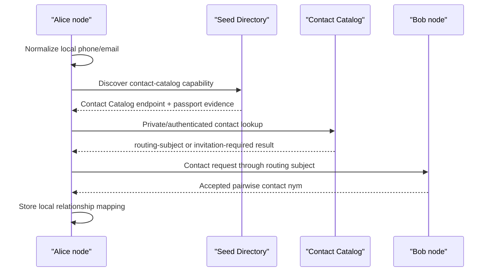

# Proposal 058: Contact Catalog and Private Contact Discovery

Based on:

- `doc/project/40-proposals/023-federated-offer-distribution-and-catalog-listener.md`
- `doc/project/40-proposals/025-seed-directory-as-capability-catalog.md`
- `doc/project/40-proposals/028-service-schema-catalog.md`
- `doc/project/40-proposals/054-user-maintained-federated-seed-directory.md`
- `doc/normative/50-constitutional-ops/pl/ROOT-IDENTITY-AND-NYMS.pl.md`
- `doc/schemas/routing-subject-binding.v1.schema.json`

## Status

Draft, MVP contract seeded

## Date

2026-05-15

MVP contract update: 2026-05-16

## Executive Summary

Contact discovery is the problem of answering:

```text
Given a phone number, email address, or other human contact handle, is there a
safe Orbiplex contact path for the person who controls it?
```

This proposal introduces a **Contact Catalog** as a separate domain catalog,
inspired by the offer catalog but not merged with Seed Directory.

The core decision is:

```text
Seed Directory discovers infrastructure and capabilities.
Contact Catalog discovers opt-in contact routes.
```

A Contact Catalog may be discovered through Seed Directory as a capability, but
the catalog's own data model remains separate. It MUST NOT publish raw public
maps such as `phone -> participant` or `email -> participant` as its default
mode. Contact identifiers are high-risk correlation handles; the catalog should
return a privacy-preserving `routing-subject`, `contact_nym`, or invitation flow
rather than a root `participant:did:key`.

For one-to-one communication, the preferred model is a **pairwise contact nym**
or pairwise routing subject: each relationship may use a distinct pseudonymous
handle, while accountability remains anchored in the participant/node layer and
can be revealed only through explicit policy and high-stakes procedures.

## Context and Problem Statement

Orbiplex already has several catalog-like mechanisms:

- the service-offer catalog indexes `service-offer.v1` artifacts for marketplace
  discovery,
- the schema catalog lets modules publish descriptive contract metadata,
- the workflow template catalog lets users reuse plans and offer templates,
- Seed Directory indexes node endpoints and passport-backed capabilities.

These catalogs share a common pattern:

```text
source artifacts -> admission policy -> local/observed catalog projection -> query
```

Contact discovery looks similar at first glance, but it has a different risk
profile. Phone numbers and email addresses are not merely routing hints. They
are globally recognizable, low-entropy, and easily enumerated. A public mapping
from phone or email to `participant:did:key` would become a deanonymization
service.

At the same time, users reasonably expect to find contacts by phone or email,
especially during onboarding. The system therefore needs a contact-discovery
surface that:

- works with familiar human identifiers,
- remains opt-in,
- avoids public raw identifier mappings,
- supports privacy-preserving relationship setup,
- composes with routing subjects and nym semantics,
- keeps Seed Directory focused on infrastructure discovery.

## Goals

- Define Contact Catalog as a domain catalog distinct from Seed Directory.
- Reuse the generic catalog pattern where practical: catalog endpoint
  registration, local projections, observed catalog provenance, and explicit
  admission policy.
- Define the default contact-discovery result as a privacy-preserving contact
  route, not as a root participant identity.
- Support phone and email lookup without normalizing the network around public
  `phone/email -> participant` maps.
- Define pairwise contact nym usage for relationship-level decorrelation.
- Define failure modes and mitigations for enumeration, hash reversal, unwanted
  disclosure, stale contact routes, and whitewashing.

## Non-Goals

- This proposal does not define final JSON Schemas for contact catalog records.
- This proposal does not mandate a specific private set intersection protocol.
- This proposal does not make Seed Directory a people directory.
- This proposal does not define a global address book.
- This proposal does not bypass the existing nym, participant, node, and
  identity-assurance layers.
- This proposal does not define legal identity verification for phone or email;
  those remain lower-assurance contact controls unless combined with stronger
  attestation.

## Proposed Model

## MVP Decisions Frozen on 2026-05-16

These decisions define the first implementation contract. They are deliberately
conservative; stronger private-discovery protocols can replace the lookup edge
later without changing the high-level Contact Catalog boundary.

1. **Lookup mode:** MVP Contact Catalog uses authenticated invitation-only
   lookup with strict rate limiting. A successful lookup returns a route
   candidate or invitation-required result, not the owner identity.
2. **Capability id:** `contact-catalog` is a standalone domain capability id
   with wire name `role/contact-catalog`.
3. **Contact-control proof ids:** `email-control` and `phone-control` are
   standalone capability ids used by contact-control attestation services.
4. **Messaging contact consent id:** `messaging-receive` is the narrow passport
   profile minted after accepting a `contact-request.v1`. The earlier
   story-local spelling `messaging.receive@v1` should be treated as superseded
   by this registry-safe bare capability id.
5. **Claim signer:** MVP contact claims are signed by the controlling
   participant or by a participant-authorized delegated signing key. A node may
   add hosting evidence, but a node signature alone is not sufficient to bind a
   human contact handle to a route.
6. **Control-proof TTL:** email and phone control proofs SHOULD use a default
   maximum freshness window of 90 days for MVP catalog admission. Local policy
   MAY require shorter windows, especially for phone numbers or known unstable
   providers.
7. **Routes per claim:** the MVP schema allows one preferred route per claim,
   with purposes naming the allowed uses. Multi-route publication remains a
   later extension through additional claims or a v2 route set.
8. **Pairwise nyms:** pairwise contact nyms are the default privacy posture for
   ordinary one-to-one relationships, but not mandatory for public handles or
   governance/high-stakes procedures.
9. **Agora non-goal:** Contact Catalog records are not published through
   Agora, and future Contact Catalog closure work MUST NOT depend on Agora
   propagation. Discovery stays with Seed Directory; contact lookup stays with
   the Contact Catalog service and its privacy policy.
10. **No-match audit:** no-match lookups may emit redacted aggregate or
    digest-bound audit events, but MUST NOT store raw queried handles in shared
    audit records.
11. **Public fetch boundary:** a network-reachable Contact Catalog is not an
    anonymous full-dump endpoint. Ordinary clients use authenticated lookup.
    Bulk/list fetch is reserved for local operator APIs or explicitly trusted
    provider sync, under policy and audit.
12. **Provider sync control/data plane:** host/daemon policy owns discovery,
    trust state, passport validation, auth material, and revocation freshness.
    Once a provider is trusted, catalog-to-catalog record fetch may use a
    direct data-plane call between Contact Catalog services.
13. **Generic sync mechanics:** transport-neutral catalog sync mechanics
    belong in `node/catalog`, not in Contact Catalog runtime. Contact Catalog
    supplies the domain record, filter, admission, privacy policy, and HTTP
    worker/runtime.

The corresponding initial schemas are:

- `contact-claim.v1`
- `contact-lookup-result.v1`
- `contact-request.v1`

The solution-level component contract is:

- `doc/project/60-solutions/025-contact-catalog/025-contact-catalog.md`

### 1. Contact Catalog Is a Domain Catalog

Contact Catalog follows the same broad shape as the offer catalog:

```text
contact claim artifacts
  -> catalog admission policy
  -> local/observed contact projection
  -> contact lookup
  -> invitation or routing-subject contact path
```

It should be exposed as a catalog kind:

```json
{
  "catalog_kind": "contact",
  "path": "/v1/contact-catalog"
}
```

This fits the `catalog_endpoints` abstraction introduced for schema/template
catalogs. A module or attached role can provide contact catalog behavior without
teaching the daemon contact-domain semantics.

The daemon MAY later expose an aggregated read proxy such as:

```text
GET /v1/catalog/contact?lookup=...
```

but the aggregated proxy should remain a transport/read-model convenience. It
must not become the authority over contact identity.

### 2. Seed Directory Discovers Contact Catalogs, Not Contacts

Seed Directory MAY advertise that a node or community runs a
`contact-catalog` or `contact-discovery` capability:

```text
capability_id = contact-catalog
```

Seed Directory SHOULD NOT store raw contact mappings as its own native data.
Its role is limited to infrastructure discovery:

```text
Who runs a Contact Catalog I may query?
What endpoint and capability passport backs that catalog?
What trust tier or governance scope is attached to that catalog?
```

The Contact Catalog then owns the domain policy:

```text
Who may query?
What contact identifiers are accepted?
How are identifiers blinded or normalized?
What result can be returned?
What consent or opt-in is required?
```

This keeps the Seed Directory small and auditable while avoiding a global
people-directory coupling.

### 3. Contact Identifiers Are Not Stable Public Keys

Phone numbers and email addresses are contact claims, not identities.

The catalog MUST treat them as:

- low-entropy identifiers,
- potentially recycled or reassigned,
- externally governed by telecom or email providers,
- useful for bootstrapping contact, not for durable accountability.

Therefore a successful lookup SHOULD NOT return:

```text
participant:did:key:...
```

by default.

It SHOULD return one of:

- `routing-subject/id` for direct delivery or inbox contact,
- `contact_nym` for relationship-level communication,
- an invitation token or contact request flow,
- a present-on-demand proof that lets the owner decide what to disclose.

### 4. Contact Claim Artifact

A participant or node may publish a contact claim to a Contact Catalog. The
catalog MUST require a fresh attestation proving control of the contact handle
before admitting the claim. In other words: only the party that has confirmed a
phone number, email address, or equivalent contact channel may associate that
contact with itself, its nym, or its routing subject. A contact claim without
control proof is not an opt-in contact route; it is an unauthenticated assertion
about someone else's address book.

The future schema should carry at least:

```text
contact-claim.v1
  claim/id
  contact/kind                 # phone | email | other
  contact/normalized-digest     # never raw by default
  contact/attestation-ref       # proof of control, not raw OTP transcript
  contact/attested-at
  contact/attestation-expires-at
  owner/routing-subject-id?
  owner/contact-nym-id?
  owner/participant-id?         # optional and disclosure-gated
  disclosure/mode               # private-lookup | invite-only | public-handle | present-on-demand
  purposes[]                    # contact | inbox | direct-delivery | recovery
  issued/at
  expires/at
  revocation/ref?
  proof/signature
```

The raw phone number or email address should not be stored in a public catalog
record. A local personal address book may store raw contacts, but that is a
different trust boundary.

### 5. Lookup Result Artifact

A successful lookup should return a route, not a person record:

```text
contact-lookup-result.v1
  lookup/id
  catalog/id?                  # optional in MVP
  match/class                 # exact-control-proof | invitation-available | ambiguous | no-match
  result/route?
    routing-subject/id?
    contact-nym/id?
    node/id?
    purposes[]
    valid/until
  result/presentation-required?
  result/invitation-required?
  policy/ref?
  audit/ref?
```

The result is a **contact route candidate**. A consumer must still complete the
normal invitation, messaging, or direct-delivery handshake before assuming a
relationship exists.

The canonical v1 contract requires only `schema`, `schema/v`, `lookup/id`,
`match/class`, and `issued/at`; `result/route` is additionally required when
`match/class = "invitation-available"`. Transitional service fields such as
`message` or legacy `result` may appear for local diagnostics, but clients must
not rely on them.

### 6. Pairwise Contact Nyms

For one-to-one communication, the preferred privacy posture is pairwise
pseudonymity:

```text
participant A
  -> local private contact map
  -> contact_nym_for_B
  -> routing-subject_for_B
```

Participant B may receive a stable handle for the relationship, but that handle
does not automatically link to A's other relationships. Participant C may see a
different nym for the same underlying participant.

This should be configurable by relationship class:

| Relationship class | Suggested handle |
| :--- | :--- |
| one-time invitation | one-shot invitation token or `case_nym` |
| ordinary one-to-one chat | pairwise `persistent_nym` or pairwise routing subject |
| public profile contact | public contact handle that still routes through a nym |
| governance or high-stakes procedure | stable `participant:did:key` or procedural pseudonym, not ordinary contact nym |

Pairwise nyms improve decorrelation, but they are not a reputation reset
mechanism. Abuse, sanctions, and recovery procedures must be able to reason
through the private mapping under explicit policy thresholds.

### 7. Local Contact Store vs Federated Contact Catalog

The node should distinguish:

1. **Local contact store**
   - raw address book entries,
   - user labels,
   - local relationship state,
   - pairwise nym mappings,
   - never published by default.

2. **Contact Catalog**
   - opt-in contact claims,
   - privacy-preserving lookup indexes,
   - contact routes or invitations,
   - query policy and audit.

3. **Seed Directory**
   - discovery of Contact Catalog providers,
   - endpoint and capability evidence,
   - no people-directory semantics.

This mirrors the local/observed split in the offer catalog: local knowledge and
network-observed projections are different stores with different provenance.

### 8. Query Privacy Profiles

Contact Catalog implementations may support multiple lookup modes.

#### 8.1 Authenticated Exact Lookup

The caller authenticates and submits a normalized contact token. The catalog
returns a match only if local policy permits.

This is simple but leaks lookup intent to the catalog.

#### 8.2 Blinded Digest Lookup

The caller sends a blinded or keyed digest. The catalog can answer without
receiving raw phone/email. This still requires careful design because phone
numbers and common email addresses are dictionary-sized.

#### 8.3 Private Set Intersection

The caller and catalog compare sets without revealing non-matches. This is the
best long-term shape for address-book discovery, but it is not required for MVP.

#### 8.4 Invitation-Only Lookup

The catalog never answers "who owns this contact". It only allows the caller to
submit a contact request, which the owner may accept, reject, or ignore.

This is the safest default for public or semi-public catalogs.

### 9. Admission Policy

A Contact Catalog should admit claims only after checking:

- proof of contact control, such as email link or phone challenge; this proof is
  mandatory for any claim that associates a contact handle with a participant,
  nym, routing subject, or invitation route,
- claim signature by the participant, node, or delegated nym,
- expiry and revocation,
- disclosure mode,
- purpose allowlist,
- abuse limits for frequent re-registration,
- whether the contact identifier was recently reassigned or flagged as unstable.

Phone verification is a contact-control proof. It is not, by itself, strong
identity assurance.

### 10. Contact Discovery Flow

Example sequence:

1. Alice imports Bob's phone number into her local contact store.
2. Alice's node normalizes the phone number locally.
3. Alice's node discovers a trusted Contact Catalog through Seed Directory.
4. Alice's node performs an authenticated or private lookup.
5. The catalog returns an invitation-required result with a `routing-subject/id`.
6. Alice sends a contact request to that routing subject.
7. Bob's node decides locally whether to reveal a pairwise contact nym.
8. If Bob accepts, both nodes store a pairwise relationship record.
9. Future messages use the pairwise nym or routing subject, not Bob's phone
   number.



### 11. Catalog Provider Role

Across the Orbiplex node, several domains share the same architectural shape:
a node-attached, supervised middleware that owns one typed catalog and
exposes it through a domain-specific HTTP API. The offer-catalog
implementation in Dator is the existing concrete instance; Contact Catalog
is the next instance, for the contact domain. This shared shape is named
explicitly as the **Catalog Provider Role**:

```text
Catalog Provider Role
  -> typed domain records (CatalogRecord implementations)
  -> domain admission policy on the publish edge
  -> local published store (CatalogStore<T>) + optional observed store
  -> domain-specific HTTP API (publish, query, admin)
  -> capability id discoverable through Seed Directory
  -> optional domain-specific federation/fetch policy, if the domain accepts it
```

A node may host many Catalog Provider middleware instances side by side
(offers, contacts, schemas, templates, workflow templates) without
duplicating the storage layer, because the storage primitives live once in
the shared `node/catalog` crate (see §12 below) and each provider
parameterises them by its own record type.

The role contract that every Catalog Provider middleware must follow:

1. Declare one or more typed `CatalogRecord` implementations naming the
   domain artifacts the provider admits.
2. Use `CatalogStore<T>` for the local published store and, if federation is
   in scope, `ObservedCatalogStore<T>` for relay-observed records of the
   same type.
3. Expose a supervised domain-specific HTTP surface for publish, query, and
   admin, attached through the existing Node Middleware extension-host.
4. Declare a `catalog_kind` and a stable capability id so Seed Directory can
   advertise the endpoint and trust evidence without learning domain
   semantics.
5. Run a domain admission policy before any `CatalogStore::upsert`.
6. Optionally participate in domain-specific federated fetch or observed-store
   ingestion only if the domain accepts the privacy model. Contact Catalog does
   not use Agora for this role. Provider-to-provider Contact Catalog fetch is a
   direct catalog data-plane operation after host policy has accepted the
   provider; it is not a public dump and not a relay path.

Naming this role explicitly serves two purposes. First, Contact Catalog can
inherit the pattern instead of reinventing it. Second, future catalogs
(schema catalog, workflow template catalog, any community-defined catalog)
get a stable role contract to satisfy and a clear answer to "what crate do
I link?".

## Implementation Sketch: `node/catalog` Reuse

The Orbiplex node already exposes the catalog mechanics this proposal
needs, in the `orbiplex-node-catalog` crate at `node/catalog/`. Contact
Catalog must not invent a parallel storage layer; it must reuse these
primitives. This section is non-normative implementation guidance for the
future Contact Catalog middleware crate, intended to make the reuse path
explicit and to keep the `node/catalog` adapter trait open to
parameterisation when Contact Catalog (the second consumer after offers)
lands.

### 12.1 `node/catalog` Primitives Reused As-Is

- `CatalogRecord` trait — minimal contract: `record_id`, `sequence_no`,
  `expires_at_str`, `validate_record`. The first reuse decision is to
  implement this trait on the Contact Catalog domain record.
- `CatalogStore<T>` trait — typed local store with `upsert`, `get`, `list`,
  `expire_stale`, and the `UpsertOutcome::{Inserted, Replaced,
  IgnoredStale}` family. Sequence-aware idempotency for free.
- `InMemoryCatalog<T>` — in-memory store for tests and tiny deployments.
- `SqliteCatalog<T>` — persistent SQLite store under the `sqlite` feature.
  Recommended path:
  `<node-data-dir>/storage/contact-catalog.sqlite`.
- `ObservedCatalogStore<T>` + `InMemoryObservedStore<T>` + `TrustLevel` —
  for domain-specific observed claims when a catalog type has an accepted
  federation model. Contact Catalog has no Agora-backed observed projection in
  this plan.
- `CatalogResolver<T, L, O>` — composes local published and observed stores
  into one record-id-deduplicated view.
- `CatalogPredicate<T>` + `CatalogFilter<T>` — composable filters, with
  `active_only` automatically pushed down to SQLite via the existing
  `is_active_only` hook.
- `TrustedProviderStore` + `TrustedProviderFact` — append-only whitelist for
  trusted Contact Catalog peers (useful in invitation-only or
  federation-trusted profiles).

### 12.2 Contact-Catalog-Specific Types

Define a Contact Catalog domain record implementing `CatalogRecord` (sketch;
field names align with §4):

```rust
pub struct ContactClaimRecord {
    pub schema_v: u32,
    pub claim_id: String,                       // "contact-claim:..."
    pub contact_kind: ContactKind,              // Phone | Email | Other
    pub contact_normalized_digest: String,
    pub contact_attestation_ref: String,
    pub contact_attested_at: String,
    pub contact_attestation_expires_at: String,
    pub owner_routing_subject_id: Option<String>,
    pub owner_contact_nym_id: Option<String>,
    pub owner_participant_id: Option<String>,   // disclosure-gated
    pub disclosure_mode: DisclosureMode,
    pub purposes: Vec<String>,
    pub issued_at: String,
    pub expires_at: String,
    pub sequence_no: u64,
    pub revocation_ref: Option<String>,
    pub signature: ContactClaimSignature,
}

impl CatalogRecord for ContactClaimRecord {
    fn record_id(&self) -> &str { &self.claim_id }
    fn sequence_no(&self) -> u64 { self.sequence_no }
    fn expires_at_str(&self) -> Option<&str> { Some(&self.expires_at) }
    fn validate_record(&self) -> Result<(), CatalogError> {
        // schema/v check, claim/id prefix, signature shape,
        // attestation expiry presence, purpose allowlist, etc.
    }
}
```

The same trait holds contact-specific validation on the edge while the
generic store stays unaware of contact semantics. `ContactLookupResultRecord`
follows the same pattern for query-side artifacts when these need to be
cached or relayed.

Contact-specific filters live as `CatalogPredicate<ContactClaimRecord>`
implementations: lookup by normalised handle digest, lookup by purpose,
active-only, and so on. They compose with `CatalogFilter`.

### 12.3 Adapter Trait Generalisation

The current `CatalogAdapter` trait in `node/catalog/src/adapter.rs` is
specialised to `ServiceOfferRecord`:

```rust
async fn fetch_offers(...) -> Result<Vec<ObservedOfferRecord>, CatalogError>;
async fn notify_offer(offer: &ServiceOfferRecord, ...) -> Result<...>;
```

Contact Catalog is the second consumer of this surface. The right move is
to generalise the trait over `T: CatalogRecord` (and `ObservedRecord<T>` for
the fetch payload), so contact and offer providers can share one async
remote-fetch contract. Without this generalisation Contact Catalog would
need a parallel `ContactCatalogAdapter` trait that duplicates the
abstraction. The generalisation is tracked as P058-018.

### 12.4 Generic Catalog Sync Mechanic

The shared catalog crate should own the transport-neutral mechanics of
provider sync. A future `CatalogSynchronizer<T, F, A, S>` or equivalent
function over `CatalogAdapter<T, F>` and `ObservedCatalogStore<T>` should:

- fetch `ObservedRecord<T>` from one provider using a typed filter and cursor;
- validate every observed record through `T: CatalogRecord`;
- apply sequence-aware upsert and trust-level admission;
- preserve provider origin, relay hop counts, and any `do_not_forward` or
  `intended_node` constraints;
- return counted outcomes such as inserted, replaced, stale/ignored, and
  rejected;
- carry cursor or high-water metadata derived from accepted provider records
  without knowing the provider auth runtime;
- prevent loops when records have crossed multiple providers, including
  rejecting self-originated records when the runtime supplies the local node id.

This mechanic must not own HTTP routes, provider authentication, Seed
Directory discovery, revocation snapshots, or Contact Catalog privacy policy.
Those are runtime and policy concerns of the domain service and the host.

### 12.5 Deployment Shape

The Contact Catalog middleware runs as a supervised HTTP middleware,
analogous to Dator. Recommended language: **Rust**, specifically so that the
middleware can link `orbiplex-node-catalog` as a library and use the typed
primitives directly, rather than going through an HTTP hop into the
daemon for storage operations. The middleware:

- declares `catalog_kind = "contact"` and a `catalog_endpoints` entry that
  Seed Directory advertises (per §1);
- exposes domain HTTP under `/v1/contact-catalog/...` (publish, query,
  admin);
- owns one `SqliteCatalog<ContactClaimRecord>` (and optionally one
  `InMemoryObservedStore<ContactClaimRecord>` for federation);
- runs the admission policy from §9 before each `upsert`;
- publishes a `contact-catalog` capability passport through Seed Directory
  so consumers can find it without learning domain semantics.

### 12.6 Storage Boundary

Contact Catalog storage stays inside the middleware's own data directory.
It does **not** become part of Memarium's fact stream by default. This
matches the storage-stratification reasoning in story-010 §11: per-record
catalog rows are operational state that the provider owns and may
vacuum/shard/rebuild independently. Memarium remains relevant only for
semantic facts about a catalog (audit events, policy changes), not for the
catalog rows themselves.

```text
contact-catalog middleware (Rust, supervised HTTP)
  -> uses orbiplex-node-catalog                          (Layer A: shared primitives)
  -> accepts contact-claim.v1                            (Layer B: domain admission)
  -> enforces admission policy
  -> stores in SqliteCatalog<ContactClaimRecord>         (Layer C: middleware-owned storage)
  -> exposes contact lookup HTTP API                     (Layer D: domain HTTP surface)

Seed Directory
  -> discovers contact-catalog capability
  -> returns endpoint + passport/evidence

client (messaging middleware or other domain consumer)
  -> queries catalog directly over HTTP at the
     Seed-Directory-discovered provider endpoint
  -> receives routing-subject / contact_nym / invitation flow
  -> hands Artifact Delivery a normal routing-subject (or node)
     selector for the subsequent contact-request / message delivery
```

Note: contact lookup is a **recipient-resolution** step. It is intentionally
not registered as an `artifact/ref` resolver scheme in AD, because resolver
schemes answer "where do I fetch the payload bytes?" while contact lookup
answers "to whom and over which route should this be delivered?" — two
different axes.

Artifact Delivery now exposes `selector/kind = "contact-lookup"` as a
host-composed recipient selector. AD core owns only the DTO, validation and
`ContactLookupNodeLookup` trait; the daemon calls the configured local Contact
Catalog provider, consumes canonical `contact-lookup-result.v1`, and normalizes
`invitation-available` results to a `routing-subject` or concrete `node`
target. MVP accepts only `lookup/mode = "invitation-only"`, `purpose =
"messaging"`, `selector/purpose = "contact-request/messaging"`, and
`max/nodes = 1`.

`selector/purpose` is allowed to use a slash as a lightweight hierarchy: the
left side names the selector use case, while the right side names the domain
capability being approached. This is intentionally more specific than the
Contact Catalog `purpose = "messaging"` field, because future subsystems may
have their own contact-request flows. MVP policy should allow
`contact-request/messaging` only for small `contact-request.v1` artifacts, not
for full message delivery before a `messaging-receive` passport exists.

## Relationship to Existing Mechanisms

### Seed Directory

Seed Directory discovers the Contact Catalog role and its endpoint. It should
not become the contact catalog itself.

### Routing Subject Binding

`routing-subject-binding.v1` already provides a privacy-preserving routing
subject that may be delegated by a participant without revealing the root
relationship. Contact Catalog lookup results should reuse this shape for
contactable routes.

### Nym Layer

The nym layer supplies relationship-specific and context-specific public keys.
Contact Catalog should prefer nym/routing-subject results over root participant
results.

### Offer Catalog

Offer Catalog indexes exchange-facing service artifacts. Contact Catalog indexes
contactability claims. Both use admission policy and observed projections, but
their privacy risks differ sharply.

### `node/catalog` and the Catalog Provider Role

`orbiplex-node-catalog` (`node/catalog/`) is the shared crate that owns the
typed catalog mechanics — records, stores, observed projections, resolvers,
adapters, and SQLite/in-memory backends. Some domains may add their own relay
bridges, but those bridges are not part of the Contact Catalog plan. The crate
is mechanism, not domain authority: it provides primitives and stays unaware
of the domain that instantiates them.

Dator is the existing concrete instance of the Catalog Provider Role for
the offer domain (today as a Python supervised HTTP middleware that does
not link the crate directly). Contact Catalog is the proposed next
instance, recommended as a Rust supervised HTTP middleware that **does**
link `orbiplex-node-catalog` directly and parameterises it with a
`ContactClaimRecord`. See §11 for the role contract and §12 for the
implementation sketch.

### Agora Non-Goal

Contact Catalog does not publish records, observed contact projections,
lookup indexes, routes, or relationship facts through Agora. If a deployment
needs broader discovery, it should advertise the `contact-catalog` capability
through Seed Directory and expose policy-controlled lookup or fetch endpoints.
Agora may still exist for other Orbiplex domains, but it is not a Contact
Catalog dependency. Trusted provider sync/fetch, if enabled, is direct between
Contact Catalog services after host authorization; records are not published,
relayed, or fanned out through Agora.

## Failure Modes and Mitigations

| Failure mode | Mitigation |
| :--- | :--- |
| Public deanonymization through `phone/email -> participant` | Do not return root participant by default; return routing subject, nym, or invitation flow. |
| Enumeration of phone/email space | Require authentication, rate limits, query audit, invitation-only mode, and future PSI for address-book discovery. |
| Hash reversal of low-entropy contacts | Do not treat unsalted hashes as privacy. Use keyed/blinded indexes and avoid public dumps. |
| Contact provider reassignment | Short TTLs, proof freshness, revocation, and re-verification windows. |
| Unwanted relationship linking | Use pairwise nyms or pairwise routing subjects. |
| Whitewashing through new contact nyms | Keep private accountability mapping and sanction thresholds at participant/node layer. |
| Catalog operator overreach | Catalog results remain route candidates; final trust comes from local policy, invitation acceptance, and cryptographic handshakes. |
| Stale contact routes | Expiry on claims and lookup results; direct-delivery still requires current routing evidence. |

## Trade-offs

### Benefits

- Familiar discovery UX without turning Seed Directory into a people directory.
- Better privacy by default than public contact maps.
- Clear reuse of the catalog pattern already present in offers, schemas, and
  templates.
- Pairwise nyms reduce accidental correlation across relationships.
- Contact discovery can evolve from simple authenticated lookup to PSI without
  changing the high-level catalog boundary.

### Costs

- More state: local contact store, pairwise nym mappings, revocation, and
  relationship records.
- Harder debugging: the same person may appear under different nyms in different
  contexts.
- More policy surface: consent, rate limits, disclosure modes, and abuse
  procedures must be explicit.
- Contact lookup requires careful UX to avoid giving users a false sense that a
  phone number is a durable identity.

## Open Questions

The original MVP questions have been answered in
[`MVP Decisions Frozen on 2026-05-16`](#mvp-decisions-frozen-on-2026-05-16).
The remaining open questions are post-MVP:

1. Which blinded lookup or PSI protocol should replace or supplement
   invitation-only lookup for address-book discovery?
2. Should a future `contact-claim.v2` support a first-class route set instead
   of one preferred route plus purposes?
3. What operator-facing aggregate metrics are useful for abuse defense without
   leaking address-book contents?

## Next Actions

1. Harden the daemon-managed Contact Catalog provider trust policy beyond the
   MVP trusted/uncertain/blocked cache.
2. Exercise `contact-request.v1` accept/reject through end-to-end Artifact
   Delivery tests with real participant signatures.
3. Extend the local contact store with operator UX and recovery/backup policy.
4. Extend the provider-to-provider sync contract beyond the current snapshot
   endpoint with tombstone or revocation replay and persisted incremental
   cursors.
5. Exercise trusted provider refresh through multi-process daemon/service
   federation acceptance tests.
6. Decide which blinded lookup or PSI profile should supplement
   invitation-only lookup after MVP.
7. Define a future route-set shape for multi-route contact results.

## Tracking

Status legend: `todo` (no implementation work started), `planned` (design
defined, awaiting implementation), `partial` (partially implemented), `done`
(fully implemented and integrated), `open` (a design decision is still
required before implementation can proceed), `deferred` (explicitly post-MVP
for this proposal). Status values are kept consistent with other tracker
tables in this project (see Proposal 057 §Tracking for precedent).

| ID | Feature | Status | Evidence |
|---|---|---|---|
| P058-001 | `contact-claim.v1` schema (fields per §4, signing key class decision) | done | `doc/schemas/contact-claim.v1.schema.json` defines the draft contract; MVP signer rule is frozen in the 2026-05-16 decisions. |
| P058-002 | `contact-lookup-result.v1` schema (fields per §5) | done | `doc/schemas/contact-lookup-result.v1.schema.json` defines the draft route-candidate result. |
| P058-003 | `contact-catalog` capability id and minimal profile registered in the Capability Registry | done | `contact-catalog` is registered in `doc/project/60-solutions/CAPABILITY-REGISTRY.en.md` / `.pl.md` with wire name `role/contact-catalog`. |
| P058-004 | `catalog_kind: contact` registration through the existing `catalog_endpoints` plug-in pattern | partial | Node `contact-catalog-service` now issues a daemon-managed `contact-catalog` passport with `catalog_kind = "contact"`, `catalog_endpoints`, `lookup_modes = ["invitation-only"]`, and publishes it through the daemon host capability path when daemon-managed. Daemon `/v1/contact-catalog/status` proxies service state for UI/operator flows. Full federation/Seed Directory operator UX remains open. |
| P058-005 | Contact Catalog admission policy (attestation freshness, signature, expiry, purpose allowlist, TTL recommendation) | done | Node `contact-catalog-core` validates `contact-claim.v1`, verifies participant/delegated participant claim signatures, rejects node-only signatures, requires first-class `email-control@v1` / `phone-control@v1` `capability-passport.v1` profiles, checks passport signatures, expiry, profile match, and revocation freshness. |
| P058-006 | Privacy-preserving lookup index implementation (normalized or blinded) | partial | Node `contact-catalog-service` exposes authenticated `POST /v1/contact-catalog/lookups` for keyed/digest invitation-only lookup, rejects raw handle-like inputs, returns `contact-lookup-result.v1`, and rate-limits by token fingerprint + digest + purpose. Stronger blinded/PSI profiles are deferred. |
| P058-007 | First MVP query mode decision (authenticated exact / invitation-only / blinded digest) | done | MVP is authenticated invitation-only lookup with strict rate limiting. |
| P058-008 | Local contact store model (raw handles, labels, pairwise nym mappings, never-published-by-default) | partial | Node daemon now owns `<node-data-dir>/storage/local-contacts.sqlite` and exposes local operator/control API routes `GET/POST/PATCH/DELETE /v1/local-contacts...`; raw handles stay in the daemon-local store and are not used in Contact Catalog claims, lookup responses, Seed Directory records, or shared lookup audit. |
| P058-009 | Pairwise contact nym handling for one-to-one relationships | partial | `contact-request.v1` acceptance creates a deterministic local `contact-nym:*` mapping and scopes `messaging-receive@v1` to that local nym, sender, route, request and purpose. Broader nym lifecycle/recovery policy remains open. |
| P058-010 | Routing-subject / contact-nym as default lookup result (never root participant by default), with multi-route support | partial | Lookup MVP prefers `owner/routing-subject-id`, then `owner/contact-nym-id`, then `owner/invitation-route`, and never returns `owner/participant-id`. Multi-route result sets remain deferred to additional claims or a future v2 route set. |
| P058-011 | Contact claim revocation and expiry pipeline for rotated or removed handles | partial | Contact Catalog admission and lookup consume daemon revocation snapshots, and `contact-catalog-service` now runs a daemon-managed background projector that periodically refreshes `capability.revocation.snapshot`, replays `SqliteCatalog<ContactClaimRecord>`, records projection runs, materializes `active | expired | revoked | unknown`, and fails closed when projection/revocation freshness is unavailable. Richer as-of/operator replay tooling remains open. |
| P058-012 | Operator / user UI wording distinguishing contact-control proof from identity assurance | partial | Node UI exposes `/admin/contact-catalog` and contact-request notifications state that `contact-control` proves control of a contact channel, not full identity assurance. More end-user copy can still be refined. |
| P058-013 | No Agora publication path for Contact Catalog records | done | Contact Catalog has no Agora publication path: records, lookup indexes, routes, relationship facts, and observed contact projections are not planned for Agora. Discovery stays with Seed Directory and lookup/fetch policy stays with Contact Catalog providers. |
| P058-014 | Contact Catalog solution document and capability sidecar | done | `doc/project/60-solutions/025-contact-catalog/025-contact-catalog.md` and `025-contact-catalog-caps.edn`. |
| P058-015 | No-match audit event policy (avoiding address-book leakage) | partial | `contact-catalog-service` records redacted lookup audit rows for no-match, ambiguous, policy-denied, rate-limited and success classes using auth fingerprint, contact-index digest, purpose and count class; status exposes counters plus recent redacted policy/rate-limit events. It does not persist raw query bodies, raw handles, raw lookup values or root participant ids. |
| P058-016 | Catalog Provider Role contract documented (role shared by Dator and Contact Catalog: typed `CatalogRecord` + `CatalogStore<T>` + supervised HTTP + capability id + admission policy) | done | §11 Catalog Provider Role. Dator named as existing offer-domain instance; Contact Catalog named as next contact-domain instance. |
| P058-017 | Contact Catalog Rust supervised HTTP middleware crate scaffold reusing `orbiplex-node-catalog` (`ContactClaimRecord: CatalogRecord`, `SqliteCatalog<ContactClaimRecord>`, `ContactClaimPredicate` variants implementing `CatalogPredicate`, admission gate before `upsert`) | partial | Node now has `contact-catalog-core`, `contact-catalog-service`, daemon-owned local contacts, and a daemon in-process `contact-request.v1` acceptor. The service includes lifecycle, passport-backed admission, SQLite claim store, lookup, active projection worker, provider-cache/remote-claim-cache, redacted audit sidecars, and opt-in daemon-managed runtime on stable loopback. A daemon process smoke now starts the real supervised binary and verifies `/v1/contact-catalog/status` readiness/projection state through the daemon proxy; deeper multi-process contact-request, admission/lookup, and trusted-provider acceptance remains pending. Still pending post-MVP: richer provider policy UX, blinded lookup/PSI, route-set v2 and broader contact recovery flows. |
| P058-018 | Generalise `node/catalog` `CatalogAdapter` trait over `T: CatalogRecord` (and `ObservedRecord<T>` for the fetch payload), so contact and offer providers share one async remote-fetch contract instead of duplicating it | partial | `node/catalog::CatalogAdapter<T, F>` now fetches `ObservedRecord<T>` and notifies `T: CatalogRecord`, while offer-specific HTTP/in-memory adapters keep compatibility wrappers. `node/catalog` also exposes `CatalogSyncOptions`, `CatalogSyncReport`, `CatalogSyncSink`, and `sync_catalog_provider(...)` for transport-neutral fetch/validate/merge/count mechanics. `contact-catalog-core::RemoteContactClaimFilter` defines the Contact Catalog remote fetch filter, and `contact-catalog-service` uses a `RemoteContactCatalogHttpAdapter` plus generic sync to refresh trusted providers into a sidecar remote claim cache. Broader federation acceptance tests and operator policy UX remain open. |
| P058-019 | `selector/kind = "contact-lookup"` as a host-composed *recipient selector kind* in Artifact Delivery, normalising lookup-safe contact references into `routing-subject` / `node` targets via a configured Contact Catalog provider. | done | AD core defines `RecipientSelector::ContactLookup`, selector shape validation, `SelectorClass::ContactLookup`, `ContactLookupNodeLookup`, and selector-purpose-aware outbound allow. Daemon wires the trait to local supervised HTTP `contact-catalog-service`, consumes canonical `contact-lookup-result.v1`, rejects raw handles, supports only `invitation-only` / `contact-request/messaging` / `max/nodes = 1`, and fails closed for `no-match`, `ambiguous`, `policy-denied`, `rate-limited`, unavailable provider, and `contact-nym/id` without a routable target. Explicitly distinguished from an `artifact/ref` resolver scheme. |
| P058-020 | Provider-to-provider Contact Catalog sync contract without Agora: no anonymous public dumps, host-authorized direct fetch, cursor/high-water replay, tombstone/revocation handling, and loop prevention over generic catalog mechanics. | partial | Decision captured in MVP decisions, §11, §12.4, and the Agora non-goal. Node now exposes authenticated `GET /v1/contact-catalog/sync/claims` as a trusted-provider snapshot fetch contract, extends `RemoteContactClaimFilter` with an opaque cursor, runs trusted-provider refresh through generic `node/catalog::sync_catalog_provider(...)`, derives high-water from accepted provider records, rejects self-originated records when the daemon injects the local node id, stores provider sync last-run counts, cumulative total counts, high-water/cursor/error state in the service sidecar, and surfaces provider sync status. Still pending: real tombstone/revocation replay contract, incremental cursor semantics beyond snapshot high-water, and multi-process federation acceptance tests. |
