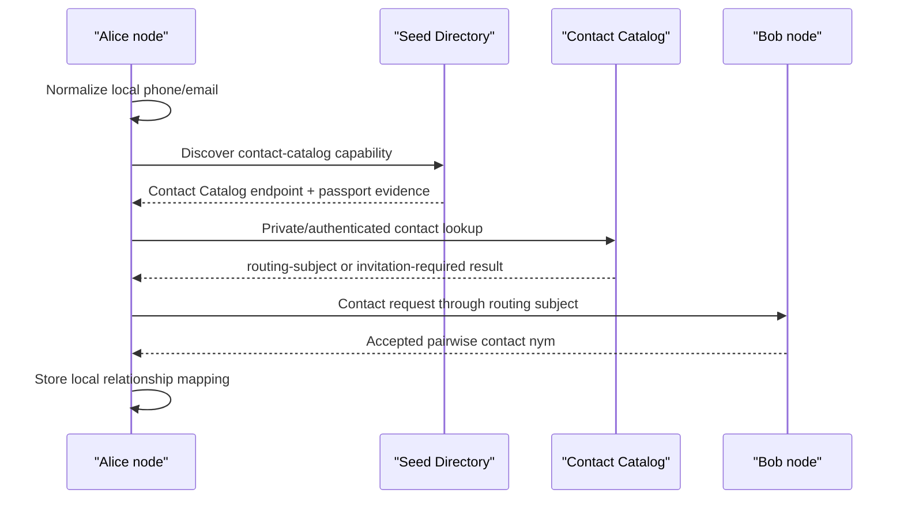

# Proposal 058: Contact Catalog and Private Contact Discovery

Based on:

- `doc/project/40-proposals/023-federated-offer-distribution-and-catalog-listener.md`
- `doc/project/40-proposals/025-seed-directory-as-capability-catalog.md`
- `doc/project/40-proposals/028-service-schema-catalog.md`
- `doc/project/40-proposals/054-user-maintained-federated-seed-directory.md`
- `doc/normative/50-constitutional-ops/pl/ROOT-IDENTITY-AND-NYMS.pl.md`
- `doc/schemas/routing-subject-binding.v1.schema.json`

## Status

Draft

## Date

2026-05-15

## Executive Summary

Contact discovery is the problem of answering:

```text
Given a phone number, email address, or other human contact handle, is there a
safe Orbiplex contact path for the person who controls it?
```

This proposal introduces a **Contact Catalog** as a separate domain catalog,
inspired by the offer catalog but not merged with Seed Directory.

The core decision is:

```text
Seed Directory discovers infrastructure and capabilities.
Contact Catalog discovers opt-in contact routes.
```

A Contact Catalog may be discovered through Seed Directory as a capability, but
the catalog's own data model remains separate. It MUST NOT publish raw public
maps such as `phone -> participant` or `email -> participant` as its default
mode. Contact identifiers are high-risk correlation handles; the catalog should
return a privacy-preserving `routing-subject`, `contact_nym`, or invitation flow
rather than a root `participant:did:key`.

For one-to-one communication, the preferred model is a **pairwise contact nym**
or pairwise routing subject: each relationship may use a distinct pseudonymous
handle, while accountability remains anchored in the participant/node layer and
can be revealed only through explicit policy and high-stakes procedures.

## Context and Problem Statement

Orbiplex already has several catalog-like mechanisms:

- the service-offer catalog indexes `service-offer.v1` artifacts for marketplace
  discovery,
- the schema catalog lets modules publish descriptive contract metadata,
- the workflow template catalog lets users reuse plans and offer templates,
- Seed Directory indexes node endpoints and passport-backed capabilities.

These catalogs share a common pattern:

```text
source artifacts -> admission policy -> local/observed catalog projection -> query
```

Contact discovery looks similar at first glance, but it has a different risk
profile. Phone numbers and email addresses are not merely routing hints. They
are globally recognizable, low-entropy, and easily enumerated. A public mapping
from phone or email to `participant:did:key` would become a deanonymization
service.

At the same time, users reasonably expect to find contacts by phone or email,
especially during onboarding. The system therefore needs a contact-discovery
surface that:

- works with familiar human identifiers,
- remains opt-in,
- avoids public raw identifier mappings,
- supports privacy-preserving relationship setup,
- composes with routing subjects and nym semantics,
- keeps Seed Directory focused on infrastructure discovery.

## Goals

- Define Contact Catalog as a domain catalog distinct from Seed Directory.
- Reuse the generic catalog pattern where practical: catalog endpoint
  registration, local projections, observed catalog provenance, and explicit
  admission policy.
- Define the default contact-discovery result as a privacy-preserving contact
  route, not as a root participant identity.
- Support phone and email lookup without normalizing the network around public
  `phone/email -> participant` maps.
- Define pairwise contact nym usage for relationship-level decorrelation.
- Define failure modes and mitigations for enumeration, hash reversal, unwanted
  disclosure, stale contact routes, and whitewashing.

## Non-Goals

- This proposal does not define final JSON Schemas for contact catalog records.
- This proposal does not mandate a specific private set intersection protocol.
- This proposal does not make Seed Directory a people directory.
- This proposal does not define a global address book.
- This proposal does not bypass the existing nym, participant, node, and
  identity-assurance layers.
- This proposal does not define legal identity verification for phone or email;
  those remain lower-assurance contact controls unless combined with stronger
  attestation.

## Proposed Model

### 1. Contact Catalog Is a Domain Catalog

Contact Catalog follows the same broad shape as the offer catalog:

```text
contact claim artifacts
  -> catalog admission policy
  -> local/observed contact projection
  -> contact lookup
  -> invitation or routing-subject contact path
```

It should be exposed as a catalog kind:

```json
{
  "catalog_kind": "contact",
  "path": "/v1/contact-catalog"
}
```

This fits the `catalog_endpoints` abstraction introduced for schema/template
catalogs. A module or attached role can provide contact catalog behavior without
teaching the daemon contact-domain semantics.

The daemon MAY later expose an aggregated read proxy such as:

```text
GET /v1/catalog/contact?lookup=...
```

but the aggregated proxy should remain a transport/read-model convenience. It
must not become the authority over contact identity.

### 2. Seed Directory Discovers Contact Catalogs, Not Contacts

Seed Directory MAY advertise that a node or community runs a
`contact-catalog` or `contact-discovery` capability:

```text
capability_id = contact-catalog
```

Seed Directory SHOULD NOT store raw contact mappings as its own native data.
Its role is limited to infrastructure discovery:

```text
Who runs a Contact Catalog I may query?
What endpoint and capability passport backs that catalog?
What trust tier or governance scope is attached to that catalog?
```

The Contact Catalog then owns the domain policy:

```text
Who may query?
What contact identifiers are accepted?
How are identifiers blinded or normalized?
What result can be returned?
What consent or opt-in is required?
```

This keeps the Seed Directory small and auditable while avoiding a global
people-directory coupling.

### 3. Contact Identifiers Are Not Stable Public Keys

Phone numbers and email addresses are contact claims, not identities.

The catalog MUST treat them as:

- low-entropy identifiers,
- potentially recycled or reassigned,
- externally governed by telecom or email providers,
- useful for bootstrapping contact, not for durable accountability.

Therefore a successful lookup SHOULD NOT return:

```text
participant:did:key:...
```

by default.

It SHOULD return one of:

- `routing-subject/id` for direct delivery or inbox contact,
- `contact_nym` for relationship-level communication,
- an invitation token or contact request flow,
- a present-on-demand proof that lets the owner decide what to disclose.

### 4. Contact Claim Artifact

A participant or node may publish a contact claim to a Contact Catalog. The
catalog MUST require a fresh attestation proving control of the contact handle
before admitting the claim. In other words: only the party that has confirmed a
phone number, email address, or equivalent contact channel may associate that
contact with itself, its nym, or its routing subject. A contact claim without
control proof is not an opt-in contact route; it is an unauthenticated assertion
about someone else's address book.

The future schema should carry at least:

```text
contact-claim.v1
  claim/id
  contact/kind                 # phone | email | other
  contact/normalized-digest     # never raw by default
  contact/attestation-ref       # proof of control, not raw OTP transcript
  contact/attested-at
  contact/attestation-expires-at
  owner/routing-subject-id?
  owner/contact-nym-id?
  owner/participant-id?         # optional and disclosure-gated
  disclosure/mode               # private-lookup | invite-only | public-handle | present-on-demand
  purposes[]                    # contact | inbox | direct-delivery | recovery
  issued/at
  expires/at
  revocation/ref?
  proof/signature
```

The raw phone number or email address should not be stored in a public catalog
record. A local personal address book may store raw contacts, but that is a
different trust boundary.

### 5. Lookup Result Artifact

A successful lookup should return a route, not a person record:

```text
contact-lookup-result.v1
  lookup/id
  catalog/id
  match/class                 # exact-control-proof | invitation-available | ambiguous | no-match
  result/route?
    routing-subject/id?
    contact-nym/id?
    node/id?
    purposes[]
    valid/until
  result/presentation-required?
  result/invitation-required?
  policy/ref
  audit/ref?
```

The result is a **contact route candidate**. A consumer must still complete the
normal invitation, messaging, or direct-delivery handshake before assuming a
relationship exists.

### 6. Pairwise Contact Nyms

For one-to-one communication, the preferred privacy posture is pairwise
pseudonymity:

```text
participant A
  -> local private contact map
  -> contact_nym_for_B
  -> routing-subject_for_B
```

Participant B may receive a stable handle for the relationship, but that handle
does not automatically link to A's other relationships. Participant C may see a
different nym for the same underlying participant.

This should be configurable by relationship class:

| Relationship class | Suggested handle |
| :--- | :--- |
| one-time invitation | one-shot invitation token or `case_nym` |
| ordinary one-to-one chat | pairwise `persistent_nym` or pairwise routing subject |
| public profile contact | public contact handle that still routes through a nym |
| governance or high-stakes procedure | stable `participant:did:key` or procedural pseudonym, not ordinary contact nym |

Pairwise nyms improve decorrelation, but they are not a reputation reset
mechanism. Abuse, sanctions, and recovery procedures must be able to reason
through the private mapping under explicit policy thresholds.

### 7. Local Contact Store vs Federated Contact Catalog

The node should distinguish:

1. **Local contact store**
   - raw address book entries,
   - user labels,
   - local relationship state,
   - pairwise nym mappings,
   - never published by default.

2. **Contact Catalog**
   - opt-in contact claims,
   - privacy-preserving lookup indexes,
   - contact routes or invitations,
   - query policy and audit.

3. **Seed Directory**
   - discovery of Contact Catalog providers,
   - endpoint and capability evidence,
   - no people-directory semantics.

This mirrors the local/observed split in the offer catalog: local knowledge and
network-observed projections are different stores with different provenance.

### 8. Query Privacy Profiles

Contact Catalog implementations may support multiple lookup modes.

#### 8.1 Authenticated Exact Lookup

The caller authenticates and submits a normalized contact token. The catalog
returns a match only if local policy permits.

This is simple but leaks lookup intent to the catalog.

#### 8.2 Blinded Digest Lookup

The caller sends a blinded or keyed digest. The catalog can answer without
receiving raw phone/email. This still requires careful design because phone
numbers and common email addresses are dictionary-sized.

#### 8.3 Private Set Intersection

The caller and catalog compare sets without revealing non-matches. This is the
best long-term shape for address-book discovery, but it is not required for MVP.

#### 8.4 Invitation-Only Lookup

The catalog never answers "who owns this contact". It only allows the caller to
submit a contact request, which the owner may accept, reject, or ignore.

This is the safest default for public or semi-public catalogs.

### 9. Admission Policy

A Contact Catalog should admit claims only after checking:

- proof of contact control, such as email link or phone challenge; this proof is
  mandatory for any claim that associates a contact handle with a participant,
  nym, routing subject, or invitation route,
- claim signature by the participant, node, or delegated nym,
- expiry and revocation,
- disclosure mode,
- purpose allowlist,
- abuse limits for frequent re-registration,
- whether the contact identifier was recently reassigned or flagged as unstable.

Phone verification is a contact-control proof. It is not, by itself, strong
identity assurance.

### 10. Contact Discovery Flow

Example sequence:

1. Alice imports Bob's phone number into her local contact store.
2. Alice's node normalizes the phone number locally.
3. Alice's node discovers a trusted Contact Catalog through Seed Directory.
4. Alice's node performs an authenticated or private lookup.
5. The catalog returns an invitation-required result with a `routing-subject/id`.
6. Alice sends a contact request to that routing subject.
7. Bob's node decides locally whether to reveal a pairwise contact nym.
8. If Bob accepts, both nodes store a pairwise relationship record.
9. Future messages use the pairwise nym or routing subject, not Bob's phone
   number.



## Relationship to Existing Mechanisms

### Seed Directory

Seed Directory discovers the Contact Catalog role and its endpoint. It should
not become the contact catalog itself.

### Routing Subject Binding

`routing-subject-binding.v1` already provides a privacy-preserving routing
subject that may be delegated by a participant without revealing the root
relationship. Contact Catalog lookup results should reuse this shape for
contactable routes.

### Nym Layer

The nym layer supplies relationship-specific and context-specific public keys.
Contact Catalog should prefer nym/routing-subject results over root participant
results.

### Offer Catalog

Offer Catalog indexes exchange-facing service artifacts. Contact Catalog indexes
contactability claims. Both use admission policy and observed projections, but
their privacy risks differ sharply.

### Agora

Agora may store public contact catalog artifacts if a community explicitly wants
public contactability records. Agora should not learn private address-book
semantics or raw contact identifiers.

## Failure Modes and Mitigations

| Failure mode | Mitigation |
| :--- | :--- |
| Public deanonymization through `phone/email -> participant` | Do not return root participant by default; return routing subject, nym, or invitation flow. |
| Enumeration of phone/email space | Require authentication, rate limits, query audit, invitation-only mode, and future PSI for address-book discovery. |
| Hash reversal of low-entropy contacts | Do not treat unsalted hashes as privacy. Use keyed/blinded indexes and avoid public dumps. |
| Contact provider reassignment | Short TTLs, proof freshness, revocation, and re-verification windows. |
| Unwanted relationship linking | Use pairwise nyms or pairwise routing subjects. |
| Whitewashing through new contact nyms | Keep private accountability mapping and sanction thresholds at participant/node layer. |
| Catalog operator overreach | Catalog results remain route candidates; final trust comes from local policy, invitation acceptance, and cryptographic handshakes. |
| Stale contact routes | Expiry on claims and lookup results; direct-delivery still requires current routing evidence. |

## Trade-offs

### Benefits

- Familiar discovery UX without turning Seed Directory into a people directory.
- Better privacy by default than public contact maps.
- Clear reuse of the catalog pattern already present in offers, schemas, and
  templates.
- Pairwise nyms reduce accidental correlation across relationships.
- Contact discovery can evolve from simple authenticated lookup to PSI without
  changing the high-level catalog boundary.

### Costs

- More state: local contact store, pairwise nym mappings, revocation, and
  relationship records.
- Harder debugging: the same person may appear under different nyms in different
  contexts.
- More policy surface: consent, rate limits, disclosure modes, and abuse
  procedures must be explicit.
- Contact lookup requires careful UX to avoid giving users a false sense that a
  phone number is a durable identity.

## Open Questions

1. What is the first MVP lookup mode: authenticated exact lookup,
   invitation-only, or a minimal blinded digest?
2. Should `contact-catalog` be a standalone capability id, or should it be a
   profile under a broader `catalog` capability?
3. Should contact claims be signed by `participant`, `node`, or a delegated
   `contact_nym` key?
4. What TTL should be recommended for phone and email control proofs?
5. Should contact catalog entries support multiple routes per contact claim, for
   example chat, inbox, direct-delivery, and recovery?
6. Should pairwise contact nyms be mandatory for user-to-user communication, or
   only the default when a relationship is not public?
7. What audit event should be emitted when a catalog lookup produces no match,
   given that no-match events can themselves leak address-book contents?

## Next Actions

1. Define `contact-claim.v1` and `contact-lookup-result.v1` draft schemas.
2. Define a minimal `contact-catalog` capability profile and decide whether it
   is registered through Seed Directory.
3. Add a local contact store model: raw contacts, labels, pairwise nym mappings,
   and relationship state.
4. Define the first MVP query mode. The conservative default is
   invitation-only lookup with authenticated callers and strict rate limiting.
5. Add operator/user UI wording that clearly distinguishes contact control from
   identity assurance.
6. Decide how Contact Catalog records may be published through Agora without
   leaking raw contact identifiers.

## Tracking

Status legend: `todo` (no implementation work started), `planned` (design
defined, awaiting implementation), `partial` (partially implemented), `done`
(fully implemented and integrated), `open` (a design decision is still
required before implementation can proceed), `deferred` (explicitly post-MVP
for this proposal). Status values are kept consistent with other tracker
tables in this project (see Proposal 057 §Tracking for precedent).

| ID | Feature | Status | Evidence |
|---|---|---|---|
| P058-001 | `contact-claim.v1` schema (fields per §4, signing key class decision) | todo | Field list sketched in §4; named in Next Actions #1; signing key class is Open Question #3; no `doc/schemas/contact-claim.v1.schema.json` yet. |
| P058-002 | `contact-lookup-result.v1` schema (fields per §5) | todo | Field list sketched in §5; named in Next Actions #1; no `doc/schemas/contact-lookup-result.v1.schema.json` yet. |
| P058-003 | `contact-catalog` capability id and minimal profile registered in the Capability Registry | todo | Named in §1 and Next Actions #2; not in `doc/project/60-solutions/CAPABILITY-REGISTRY.en.md`. |
| P058-004 | `catalog_kind: contact` registration through the existing `catalog_endpoints` plug-in pattern | todo | Shape in §1; reuses the offer / schema / template catalog precedent; no registration yet. |
| P058-005 | Contact Catalog admission policy (attestation freshness, signature, expiry, purpose allowlist, TTL recommendation) | todo | Requirements enumerated in §9; TTL recommendation is Open Question #4; no admission policy implementation. |
| P058-006 | Privacy-preserving lookup index implementation (normalized or blinded) | todo | Discussed in §3 and §8; depends on P058-007. |
| P058-007 | First MVP query mode decision (authenticated exact / invitation-only / blinded digest) | open | Open Question #1; conservative default named in Next Actions #4 as invitation-only with authenticated callers and strict rate limiting. |
| P058-008 | Local contact store model (raw handles, labels, pairwise nym mappings, never-published-by-default) | todo | Distinguished in §7; named in Next Actions #3; no implementation. |
| P058-009 | Pairwise contact nym handling for one-to-one relationships | planned | Preferred posture defined in §6; mandatory-vs-default decision is Open Question #6. |
| P058-010 | Routing-subject / contact-nym as default lookup result (never root participant by default), with multi-route support | planned | Invariant defined in §3 and §5; multi-route support is Open Question #5; implementation depends on P058-002 and P058-006. |
| P058-011 | Contact claim revocation and expiry pipeline for rotated or removed handles | todo | Required by §4 and Failure Modes; no pipeline yet. |
| P058-012 | Operator / user UI wording distinguishing contact-control proof from identity assurance | todo | Named in Next Actions #5; no UI surface. |
| P058-013 | Agora publication policy for catalog records, if any | open | Next Actions #6; not yet decided; must avoid leaking raw contact identifiers. |
| P058-014 | Contact Catalog solution document and capability sidecar | todo | No `doc/project/60-solutions/NNN-contact-catalog/` directory yet. |
| P058-015 | No-match audit event policy (avoiding address-book leakage) | open | Open Question #7. |
