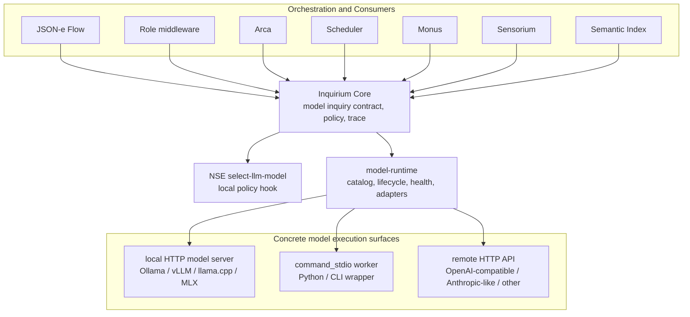

# Proposal 063: Inquirium as a Model Inquiry Organ

Based on:
- `doc/project/40-proposals/019-supervised-local-http-json-middleware-executor.md`
- `doc/project/40-proposals/045-sensorium-local-enaction-stratum.md`
- `doc/project/40-proposals/048-sensorium-os-connector-action-classes.md`
- `doc/project/40-proposals/049-json-e-middleware-transformer-executor.md`
- `doc/project/40-proposals/055-bounded-deferred-operation-contract.md`
- `doc/project/60-solutions/019-middleware/019-middleware.md`
- `node:model-runtime/README.md`
- `node:nse/README.md`

## Status

Accepted

## Date

2026-05-19

## Executive Summary

Orbiplex should introduce **Inquirium** as the node organ for model-backed
inquiry and inference. Sensorium remains the node's organ of contact with the
world: observation, directive mediation, external signals, OS actions, and
sensorimotor outcomes. Inquirium owns a different domain: acts of asking models
to generate, classify, embed, summarize, rerank, transform, or otherwise infer
from a bounded context.

This proposal does not remove the existing `model-runtime` work. It reframes it
as the lower execution substrate of Inquirium: runtime catalogs, model profiles,
provider adapters, local process lifecycle, health checks, transport mappings,
resource policies, egress policies, and model selection hooks. Workflow
components should not call `model-runtime` directly. They should call Inquirium
capabilities. Inquirium may then use `model-runtime` to choose and invoke a
concrete runtime.

The core decision is:

> Sensorium exchanges signals with the world. Inquirium performs bounded acts of
> model inquiry. `model-runtime` is not a user-facing organ; it is the execution
> substrate under Inquirium.

This preserves stratification. JSON-e Flow, Arca, role middleware, Scheduler,
Monus, Semantic Index, and Sensorium can all request inference without learning
provider-specific model protocols. Python model servers and vendor APIs remain
implementation details behind runtime adapters, not semantic authorities inside
Orbiplex.

## Context and Problem Statement

Early Orbiplex model-integration thinking tended to treat LLM use as a possible
Sensorium connector. That works for narrow cases where a model wrapper is just
one finite OS action, for example a script that prepares a Whisper redaction
draft or summarizes a local artifact.

It becomes semantically wrong as soon as model use needs host-level operational
knowledge:

- sampling parameters such as temperature, top-p, top-k, seed, and max tokens;
- context-window limits and truncation policy;
- embedding dimensions and vector normalization;
- locality and egress policy;
- provider cost, quota, rate limits, and retry behavior;
- model profile selection;
- prompt and response retention rules;
- redaction and trace disclosure policy;
- KV/cache policy and later learning loops;
- health, lifecycle, and protocol differences between model servers.

Those are not merely connector details. They are part of the contract of an
inference act. If they live inside a Sensorium connector, Sensorium becomes a
large model orchestration system rather than the thin enaction stratum defined
by proposal 045. If they live inside workflow definitions, every workflow learns
too much about provider mechanics. If they live inside Python workers, host
policy and audit become accidental.

The current Node code already contains a useful lower layer:

- `node:model-runtime` defines model/runtime/profile configuration contracts;
- `node:model-runtime-http` contains local and remote HTTP adapter logic;
- the daemon contains a model runtime supervisor for lifecycle and invocation;
- `node:nse` defines a `select-llm-model` hook for local policy-driven model
  selection.

That code is a useful substrate, but its name is too low-level to be the
semantic boundary seen by workflows and operators. The missing layer is the
organ that turns model runtime mechanics into an Orbiplex inference contract.

## Proposed Model / Decision

Introduce **Inquirium** as a node-local organ for model inquiry and inference.

Inquirium is responsible for:

- accepting bounded model inquiry requests from host-granted callers;
- validating request shape, model profile, policy, and output contract;
- applying host policy for locality, egress, retention, redaction, tracing, and
  resource ceilings;
- selecting a model profile or delegating model selection to NSE;
- invoking a concrete runtime through `model-runtime`;
- normalizing provider-specific responses into stable result contracts;
- returning synchronous results or canonical deferred operations;
- emitting audit records and redacted traces.

Inquirium is not responsible for:

- observing external reality directly;
- executing arbitrary OS actions;
- replacing Sensorium connectors;
- becoming a general workflow engine;
- giving models authority to mutate node state;
- deciding crisis activation, routing, publication, or governance outcomes on
  its own.

### Runtime Boundary Decision

Inquirium should not be implemented as one model runtime middleware, and it
should not copy Sensorium's connector ontology.

The settled shape is:

```text
Inquirium Core = semantic inference contract and policy boundary.
model-runtime = lower execution substrate for profiles, lifecycle, health, and adapters.
runtime/provider adapters = replaceable execution details.
```

This means Inquirium is one node organ at the capability and policy layer, but
the execution layer below it is plural. A caller asks for a bounded model
inquiry such as generation, classification, embedding, summarization, reranking,
structured transformation, image generation, image editing, transcription, or
speech synthesis. The caller does not choose or learn provider mechanics.

Sensorium and Inquirium may look similar as layered host organs, but their
domains differ:

- Sensorium connectors mediate contact with the external world.
- Inquirium runtime adapters mediate execution by model providers and local
  model servers.

A model is not treated as a sensor or an effector merely because it is reached
through an adapter. Its output is an inference artifact over supplied context,
not a direct observation of the world and not an authorized action by itself.

The practical rule is:

```text
Workflow/middleware calls Inquirium capabilities.
Inquirium validates, authorizes, selects, traces, and normalizes.
model-runtime invokes the selected runtime adapter.
Provider adapters absorb provider-specific protocols.
```

This keeps the trusted Inquirium core small and auditable while allowing new
model families, transports, and vendors to be added without changing the
workflow-facing contract.

### Control Plane and Data Plane

Inquirium should be stricter than a raw provider API, but it does not need to
proxy every byte of model input through the host.

The rule is:

```text
Host/Inquirium control plane = mandatory.
Host/Inquirium data plane = optional.
```

For ordinary bounded inference, passing compact request material through
Inquirium is acceptable and often useful. For large local data operations it is
the wrong abstraction. Post-training, fine-tuning, batch embedding, large-scale
reranking, vision/audio processing, and local dataset transforms may need direct
runtime access to data already present on disk or in a local object store.

That direct access must still be host-authorized. The host grants scoped data
handles, not ambient authority. A worker may read samples directly from an
approved dataset path, content-addressed artifact set, local object store
prefix, or query handle, but only under an explicit lease and runtime policy.

The intended shape is:

```text
Caller -> Inquirium:
  request operation, purpose, profile, dataset/artifact refs, output contract

Inquirium/host:
  authorize capability
  classify data access
  issue scoped read/write leases
  choose runtime/profile
  enforce sandbox, egress, resource, trace, and retention policy
  record manifest/provenance/status

Runtime worker:
  read granted inputs directly
  write checkpoints/adapters/embeddings/metrics/artifacts to granted outputs
  return bounded status and result refs
```

This is different from bypassing the host. The host remains the authority for
who may perform which operation, against which data, under which locality,
egress, budget, sandbox, retention, and audit policy. What changes is only the
data path: large samples, tensors, media files, and dataset shards need not move
through the host process as payloads.

The hard constraints are:

- no ambient filesystem access;
- no ambient network access;
- no worker-selected provider or model profile;
- no untracked dataset reads;
- no raw sample, prompt, or response logging by default;
- no mutation of Memarium, Agora, identity, publication, routing, or governance
  state by the worker.

The preferred primitives are:

- dataset handles;
- artifact refs;
- content-addressed manifests;
- scoped path or object-store leases;
- sandbox profiles;
- egress classes;
- resource budgets;
- output artifact refs;
- metadata-only audit by default.

For remote post-training or remote batch processing, the same direct data-plane
pattern may be allowed only under an explicit egress grant, data classification
decision, destination policy, and operator or policy approval appropriate to the
sensitivity class. Local trusted workers can use lighter leases, but they still
must not receive ambient authority.

### Layering



The important dependency direction is one-way:

```text
Sensorium may call Inquirium.
Inquirium must not depend on Sensorium.
model-runtime must not depend on Inquirium or Sensorium.
Providers must not know Orbiplex domain semantics.
```

### Naming

| Term | Meaning |
| --- | --- |
| Inquirium | The node organ for bounded model-backed inquiry and inference. |
| Inquirium Core | The host-owned component that validates, authorizes, selects, invokes, normalizes, traces, and audits inference requests. |
| Model Runtime | The lower substrate for model execution surfaces: profiles, lifecycle, health checks, transports, provider mappings, and resource/egress policy. |
| Model Profile | A host-defined policy bundle describing desired capability, locality, cost tier, context behavior, and output class. |
| Runtime Adapter | The concrete protocol adapter for local HTTP, command stdio, remote HTTP API, or later transports. |
| Provider Worker | A concrete server, process, or API implementing model execution. It is not an Orbiplex organ and does not own policy. |

### Relationship to Sensorium

Sensorium remains the sensorimotor contact surface with the world. Its
connectors adapt external systems into observations, directives, diagnostic
records, and artifacts. Sensorium can use Inquirium when it needs model-assisted
classification, summarization, or interpretation of an admitted observation.

Inquirium is different:

- Sensorium answers: "What signal or effect crosses the node/world boundary?"
- Inquirium answers: "What bounded model inquiry should be performed over this
  context?"

This avoids making LLMs look like sensors. A model may operate on Sensorium
signals, Memarium facts, Agora records, workflow context, or user-provided
messages. Its domain is not contact with the world; its domain is inference over
given context.

### Relationship to Middleware

Inquirium should be exposed through host capabilities and stable request/result
contracts, not as a generic supervised HTTP middleware interface.

Middleware can consume Inquirium:

- JSON-e Flow may call `inquirium.generate` or `inquirium.classify` as a
  host-capability step.
- Role middleware may request a model judgment but must not delegate authority
  to the model.
- Arca may use Inquirium for planning support, draft review, or task
  fulfillment evidence.
- Monus may use Inquirium to form local concern drafts from selected inputs.
- Semantic Index may use Inquirium embedding profiles.

This keeps middleware composition declarative while preventing each middleware
from inventing its own provider adapter and retention policy.

### Public Capability Surface

The first capability vocabulary should be small and verb-oriented:

| Capability | Purpose |
| --- | --- |
| `inquirium.generate` | Generate text or structured JSON from messages/context under a model profile. |
| `inquirium.classify` | Classify an input against a bounded label set or schema. |
| `inquirium.embed` | Produce embeddings under an embedding profile. |
| `inquirium.summarize` | Produce a summary under an explicit summary contract. |
| `inquirium.rerank` | Rank candidate items against a query or purpose. |
| `inquirium.transform` | Apply a bounded structured transformation where generation is constrained by an output schema. |
| `inquirium.image.generate` | Produce an image artifact under an explicit image generation contract. |
| `inquirium.image.edit` | Produce a derived image artifact from source image/context under an explicit edit contract. |
| `inquirium.audio.transcribe` | Produce text or structured transcript artifacts from audio input. |
| `inquirium.audio.synthesize` | Produce speech/audio artifacts from text or structured speech input. |
| `inquirium.train.adapt` | Run bounded local or approved-remote adaptation/post-training over granted dataset handles and produce model artifacts. |
| `inquirium.batch.embed` | Produce embeddings for a granted dataset/artifact set without proxying every sample through the host. |
| `inquirium.runtime.status` | Operator/status surface for model profiles and runtime health. |

The capability names are intentionally not provider-specific. A caller asks for
an act of inference, not for `ollama`, `vllm`, `mlx`, `openai`, or a Python
script.

The MVP may implement only a smaller subset of this vocabulary. The important
contract rule is that each operation is named by the inference act and output
class, not by the provider or transport that happens to execute it.

### Request Contract Shape

The exact schemas are future work, but the first request contract should carry
these concepts:

```json
{
  "schema": "inquirium-request.v1",
  "request/id": "inq:req:...",
  "operation": "generate",
  "profile/ref": "local-small-fast",
  "purpose": "story-draft/review",
  "input": {
    "messages": [],
    "context_refs": []
  },
  "constraints": {
    "max/output-tokens": 512,
    "temperature": 0.2,
    "response/schema-ref": "story-review.v1"
  },
  "retention": {
    "persist_prompt": false,
    "persist_response": false,
    "trace_level": "metadata-only"
  },
  "idempotency/key": "..."
}
```

The contract should distinguish:

- caller intent (`purpose`);
- model profile (`profile/ref`);
- operation class (`operation`);
- input material and references;
- inference constraints;
- retention and trace policy;
- idempotency and correlation.

Provider-specific fields may exist only behind host-owned profile/runtime
configuration, not as required fields on every caller request.

### Result Contract Shape

The result should normalize provider responses without pretending that model
output is fact:

```json
{
  "schema": "inquirium-result.v1",
  "request/id": "inq:req:...",
  "operation": "generate",
  "outcome": "completed",
  "result": {
    "text": "...",
    "json": {}
  },
  "model/used": {
    "model/id": "model:bielik",
    "runtime/id": "runtime:ollama-bielik-local",
    "profile/ref": "local-small-fast"
  },
  "usage": {
    "input/tokens": 1200,
    "output/tokens": 240
  },
  "trace": {
    "trace/ref": "trace:...",
    "redaction/profile": "metadata-only"
  }
}
```

For longer operations Inquirium should return `deferred-operation.v1` and later
complete with `deferred-operation-status.v1`, reusing proposal 055 rather than
inventing a second async contract.

### Model Selection

Model selection is host policy, not caller authority. A caller may request a
profile or capability class. Inquirium may:

1. accept the requested profile;
2. use NSE `select-llm-model` to choose among healthy candidates;
3. defer because no safe runtime is currently ready;
4. reject because the caller, purpose, locality, egress, cost, or retention
   policy does not permit the requested operation.

The model selector should see redacted request metadata and candidate runtime
metadata. It should not receive full prompt bodies unless explicitly allowed by
the relevant trace/retention policy.

### Runtime Execution

`model-runtime` should remain the lower layer that knows how to use concrete
execution surfaces:

- local HTTP model servers such as Ollama, vLLM, llama.cpp server, MLX server,
  or custom local APIs;
- `command_stdio` workers, including Python wrappers around model libraries;
- remote HTTP APIs such as OpenAI-compatible or Anthropic-like endpoints;
- diffusion, vision, audio, embedding, and reranking servers exposed through
  local or remote runtime adapters;
- future runtime kinds such as GPU pools, edge devices, or federated model
  providers.

This lower layer may supervise processes, probe health, map requests and
responses, enforce resource ceilings, and apply egress restrictions. It should
not know whether the caller is Arca, Sensorium, Monus, or a role middleware.

### Python and Model Libraries

The proposal explicitly allows model execution to live in Python, external
servers, or vendor APIs. Rust is not expected to link directly to every model
library.

The rule is:

```text
Python worker = execution detail.
Runtime adapter = host-owned protocol boundary.
Inquirium = inference contract and policy boundary.
Workflow = consumer of inquiry results.
```

Python workers should receive normalized model-runtime requests and return
bounded model-runtime responses. They should not receive ambient authority over
Orbiplex host capabilities, local identity, publication, routing, or storage.

When a worker needs large local inputs, it may receive host-issued data leases
and artifact handles instead of inline samples. This keeps Python, CLI, or
external model tooling useful for post-training and batch jobs without turning
those workers into host policy authorities.

### Authority Boundary

Model output is never authority by itself. Inquirium may produce:

- candidate text;
- candidate structured JSON;
- classification scores;
- embeddings;
- summaries;
- recommendations;
- routing suggestions;
- crisis-signal evidence.

The host, workflow, policy engine, or human operator must still decide whether
to act on that output. For example:

- a model may recommend a route, but Artifact Delivery policy decides whether
  the route is allowed;
- a model may classify a crisis-related signal, but crisis activation policy
  decides the operational mode;
- a model may summarize audit records, but the audit ledger remains the source
  of truth;
- a model may draft a Whisper redaction, but publication remains gated by the
  existing Whisper/Sensorium/operator path.

This is the same architectural rule as with Sensorium: the organ produces
bounded evidence or effects, not unilateral governance.

## Trade-offs

### Benefits

- Keeps Sensorium focused on local enaction and signal exchange.
- Gives model-backed inference a proper domain boundary.
- Reuses existing `model-runtime` and NSE work without exposing it as a
  workflow-facing surface.
- Prevents workflow definitions from learning provider-specific protocols.
- Allows Python model libraries without putting Python in charge of host policy.
- Allows LLMs, embedding models, rerankers, diffusion models, vision models, and
  audio models to share one host policy boundary without forcing one provider
  API or one runtime shape.
- Allows large local model operations to use direct, leased data paths without
  forcing the host to proxy every sample, tensor, image, audio file, or dataset
  shard.
- Makes sampling, context, retention, trace, egress, and resource limits explicit
  parts of an inference contract.
- Creates a natural home for future model lifecycle concerns such as KV cache,
  prompt retention, model provenance, evaluation, and training loops.

### Costs

- Introduces a new named organ and therefore another concept operators must
  learn.
- Requires clear documentation so Inquirium does not become a synonym for
  "anything AI".
- Requires request/result schemas and capability grants before it should be
  used by general middleware.
- May overlap with simple Sensorium OS script wrappers during migration.

### Migration Impact

Existing Sensorium OS scripts that call a local model can remain valid as
finite, bounded OS actions. They should be treated as compatibility or
bootstrapping paths, not as the long-term model interface.

The desired migration is:

```text
JSON-e Flow -> sensorium.directive.invoke -> sensorium-os script -> model
```

to:

```text
JSON-e Flow -> inquirium.generate/classify/embed -> model-runtime -> model
```

Sensorium may still call Inquirium internally when a Sensorium action needs
model assistance, but the model domain no longer lives inside Sensorium.

## Failure Modes and Mitigations

| Failure mode | Mitigation |
| --- | --- |
| Inquirium becomes a general AI agent with ambient authority. | Capabilities are operation-specific; model output is evidence, not authority; actions remain in workflow/policy/Sensorium/AD layers. |
| Inquirium becomes a monolithic runtime middleware. | Keep Inquirium as the semantic contract and policy layer; keep provider lifecycle, health, and invocation in `model-runtime` adapters. |
| Inquirium copies Sensorium connectors and treats models as sensors/effectors. | Document the ontology split: Sensorium mediates world contact; Inquirium mediates bounded inference over supplied context. |
| Provider-specific parameters leak into every caller request. | Keep provider details in model profiles and runtime configs; expose only stable inference constraints at the request boundary. |
| Direct data-plane operations bypass host policy. | Require host-issued dataset/artifact leases, sandbox profiles, egress classes, resource budgets, manifests, provenance, and metadata-only audit records. |
| Post-training workers gain ambient local filesystem or network access. | Grant scoped paths/object-store prefixes/query handles only; fail closed when a lease, sandbox profile, or egress policy is missing. |
| Sensorium and Inquirium both offer model actions. | Mark Sensorium model wrappers as finite OS compatibility actions; document Inquirium as the canonical model inquiry surface. |
| Python workers bypass host policy. | Workers run behind model-runtime adapters and receive only normalized requests; no direct host capability authority. |
| Prompts or outputs leak into logs/traces. | Inquirium owns trace and retention policy; default to metadata-only traces and explicit opt-in persistence. |
| Models are treated as truth. | Result contracts label outputs as candidates, scores, or generated artifacts; downstream components decide acceptance. |
| Runtime health and model selection become hidden magic. | Expose `inquirium.runtime.status`, model profile diagnostics, selected runtime metadata, and NSE trace summaries. |
| Long model calls block workflow threads. | Reuse `deferred-operation.v1` and bounded host poll/resume paths. |

## Open Questions

1. Should the first Inquirium implementation be in-process Rust in the daemon, a
   supervised local middleware module, or a Rust organ embedded similarly to
   `sensorium-core`?
2. What is the minimal schema set for MVP: only `inquirium-request.v1` and
   `inquirium-result.v1`, or separate operation-specific schemas for generate,
   classify, embed, summarize, and rerank?
3. Should `profile/ref` be mandatory for all callers, or may callers request an
   operation class and let host policy choose the profile entirely?
4. Which model parameters are stable request-level constraints and which belong
   only to host-owned runtime/profile configuration?
5. How should Inquirium expose prompt/context redaction failures: hard reject,
   degraded request, or deferred operator remediation?
6. Should embeddings be stored only by consuming components such as Semantic
   Index, or should Inquirium have a local embedding cache?
7. How much of NSE `select-llm-model` input may include prompt-derived metadata
   under default privacy policy?
8. What is the first practical consumer: Semantic Index embeddings, Whisper
   redaction, story-role generation, Monus summaries, or operator diagnostics?
9. What is the minimal lease schema for direct data-plane operations: scoped
   paths, object-store prefixes, artifact refs, query handles, or all of them?
10. Which operation classes may use direct data-plane leases in MVP: batch
   embeddings, local post-training, large media transforms, or only one pilot?

## Next Actions

1. Define the canonical Inquirium capability vocabulary and decide which
   operation classes are MVP.
2. Add schemas for `inquirium-request.v1` and `inquirium-result.v1`, or split
   them into operation-specific schemas if the contracts diverge.
3. Refactor documentation around model use so Sensorium OS model wrappers are
   described as compatibility actions, not the canonical LLM boundary.
4. Define a small `InquiriumCore` implementation surface that wraps the existing
   daemon model-runtime supervisor without exposing provider details to callers.
5. Add host capability authorization for the first Inquirium operation.
6. Connect NSE `select-llm-model` as the optional model selection policy hook.
7. Add operator diagnostics for configured profiles, candidate runtimes, health,
   and last selection decisions.
8. Migrate one existing bounded model-adjacent flow from Sensorium OS script
   invocation to Inquirium.

## Tracking

| ID | Work item | Status | Notes |
|---|---|---|---|
| P063-01 | Establish Inquirium as a separate model inquiry organ | accepted | This proposal defines the boundary and is now accepted for implementation planning. |
| P063-02 | Reframe `model-runtime` as Inquirium substrate | accepted | Existing Node crates are useful lower layers, but should not be workflow-facing. |
| P063-03 | Define Inquirium capability vocabulary | todo | Start with generate, classify, embed, summarize, rerank, transform, and runtime status. |
| P063-04 | Define request/result schemas | todo | Decide between one generic contract and operation-specific schemas. |
| P063-05 | Implement Inquirium Core wrapper over model-runtime | todo | Should preserve `model-runtime` independence from Inquirium and Sensorium. |
| P063-06 | Integrate NSE model selection | todo | Use `select-llm-model` as optional policy, not as domain truth. |
| P063-07 | Add host capability gate and audit | todo | Inference authority must be granted explicitly; model output is not authority. |
| P063-08 | Migrate one existing model-adjacent path | todo | Candidate paths: Whisper redaction, Semantic Index embedding, story-role generation, or Monus summary. |
