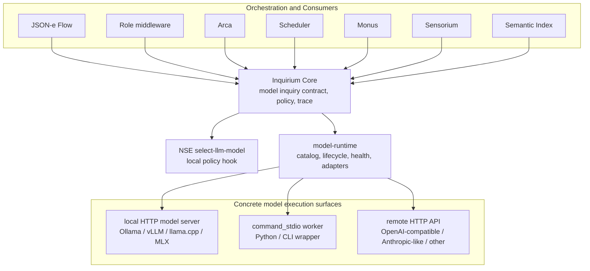

# Proposal 063: Inquirium as a Model Inquiry Organ

Based on:
- `doc/project/40-proposals/019-supervised-local-http-json-middleware-executor.md`
- `doc/project/40-proposals/045-sensorium-local-enaction-stratum.md`
- `doc/project/40-proposals/048-sensorium-os-connector-action-classes.md`
- `doc/project/40-proposals/049-json-e-middleware-transformer-executor.md`
- `doc/project/40-proposals/055-bounded-deferred-operation-contract.md`
- `doc/project/60-solutions/019-middleware/019-middleware.md`
- `node:model-runtime/README.md`
- `node:nse/README.md`

Refined by:
- `doc/project/40-proposals/064-inquirium-implementation-recommendations.md`
- `doc/project/40-proposals/066-inquirium-assistant-channel.md`

Related:
- `doc/project/40-proposals/078-weak-signal-harvester.md`

## Status

Accepted

## Date

2026-05-19

## Executive Summary

Orbiplex should introduce **Inquirium** as the node organ for model-backed
inquiry and inference. Sensorium remains the node's organ of contact with the
world: observation, directive mediation, external signals, OS actions, and
sensorimotor outcomes. Inquirium owns a different domain: acts of asking models
to generate, classify, embed, summarize, rerank, transform, or otherwise infer
from a bounded context.

This proposal does not remove the existing `model-runtime` work. It reframes it
as the lower execution substrate of Inquirium: runtime catalogs, model profiles,
provider adapters, local process lifecycle, health checks, transport mappings,
resource policies, egress policies, and model selection hooks. Workflow
components should not call `model-runtime` directly. They should call Inquirium
capabilities. Inquirium may then use `model-runtime` to choose and invoke a
concrete runtime.

The core decision is:

> Sensorium exchanges signals with the world. Inquirium performs bounded acts of
> model inquiry. `model-runtime` is not a user-facing organ; it is the execution
> substrate under Inquirium.

This preserves stratification. JSON-e Flow, Arca, role middleware, Scheduler,
Monus, Semantic Index, and Sensorium can all request inference without learning
provider-specific model protocols. Python model servers and vendor APIs remain
implementation details behind runtime adapters, not semantic authorities inside
Orbiplex.

## Context and Problem Statement

Early Orbiplex model-integration thinking tended to treat LLM use as a possible
Sensorium connector. That works for narrow cases where a model wrapper is just
one finite OS action, for example a script that prepares a Whisper redaction
draft or summarizes a local artifact.

It becomes semantically wrong as soon as model use needs host-level operational
knowledge:

- sampling parameters such as temperature, top-p, top-k, seed, and max tokens;
- context-window limits and truncation policy;
- embedding dimensions and vector normalization;
- locality and egress policy;
- provider cost, quota, rate limits, and retry behavior;
- model profile selection;
- prompt and response retention rules;
- redaction and trace disclosure policy;
- KV/cache policy and later learning loops;
- health, lifecycle, and protocol differences between model servers.

Those are not merely connector details. They are part of the contract of an
inference act. If they live inside a Sensorium connector, Sensorium becomes a
large model orchestration system rather than the thin enaction stratum defined
by proposal 045. If they live inside workflow definitions, every workflow learns
too much about provider mechanics. If they live inside Python workers, host
policy and audit become accidental.

The current Node code already contains a useful lower layer:

- `node:model-runtime` defines model/runtime/profile configuration contracts;
- `node:model-runtime-http` contains local and remote HTTP adapter logic;
- the daemon contains a model runtime supervisor for lifecycle and invocation;
- `node:nse` defines a `select-llm-model` hook for local policy-driven model
  selection.

That code is a useful substrate, but its name is too low-level to be the
semantic boundary seen by workflows and operators. The missing layer is the
organ that turns model runtime mechanics into an Orbiplex inference contract.

## Proposed Model / Decision

Introduce **Inquirium** as a node-local organ for model inquiry and inference.

Inquirium is responsible for:

- accepting bounded model inquiry requests from host-granted callers;
- validating request shape, model profile, policy, and output contract;
- applying host policy for locality, egress, retention, redaction, tracing, and
  resource ceilings;
- selecting a model profile or delegating model selection to NSE;
- invoking a concrete runtime through `model-runtime`;
- normalizing provider-specific responses into stable result contracts;
- returning synchronous results or canonical deferred operations;
- emitting audit records and redacted traces.

Inquirium is not responsible for:

- observing external reality directly;
- executing arbitrary OS actions;
- replacing Sensorium connectors;
- becoming a general workflow engine;
- giving models authority to mutate node state;
- deciding crisis activation, routing, publication, or governance outcomes on
  its own;
- acting as a model marketplace or model discovery service;
- acting as a retrieval/RAG system (context selection is a caller responsibility
  or a separate stratum; Inquirium consumes prepared context);
- acting as an agent orchestrator (a small Flow IR exists for multi-step
  inference, but cross-domain agency lives in workflow/Arca/role middleware);
- acting as a tool registry or tool authority (Inquirium consumes
  `allowed/tools` from policy; it does not own the tool catalog);
- acting as a training platform (`inquirium.train.adapt` is a bounded
  operation that produces artifacts; lifecycle/governance of training programs
  lives elsewhere).

### Runtime Boundary Decision

Inquirium should not be implemented as one model runtime middleware, and it
should not copy Sensorium's connector ontology.

The settled shape is:

```text
Inquirium Core = semantic inference contract and policy boundary.
model-runtime = lower execution substrate for profiles, lifecycle, health, and adapters.
runtime/provider adapters = replaceable execution details.
```

This means Inquirium is one node organ at the capability and policy layer, but
the execution layer below it is plural. A caller asks for a bounded model
inquiry such as generation, classification, embedding, summarization, reranking,
structured transformation, image generation, image editing, transcription, or
speech synthesis. The caller does not choose or learn provider mechanics.

Sensorium and Inquirium may look similar as layered host organs, but their
domains differ:

- Sensorium connectors mediate contact with the external world.
- Inquirium runtime adapters mediate execution by model providers and local
  model servers.

A model is not treated as a sensor or an effector merely because it is reached
through an adapter. Its output is an inference artifact over supplied context,
not a direct observation of the world and not an authorized action by itself.

**Core placement (resolved): built-in Rust; adapters are language-agnostic.**
Inquirium Core is a **built-in Rust organ** in the node, not a supervised middleware
module. This is deliberate: Inquirium is a constitutional organ expressed as a
technical mechanism — it owns model selection authority, egress/retention/trace policy,
content-addressed model identity, capability grants, and the "output is evidence, not
authority" invariant. Those are non-bypassable, auditable boundaries and therefore
belong in the minimal trusted core, the same way Artifact Delivery's runtime is
host-owned Rust.

The **adapters are intentionally plural and language-neutral.** Most ready-made LLM API
clients and locally-started inference engines are written in Python (some in C++), so
the design must let an operator or extension author wrap such an engine quickly without
linking Rust to every model library. One low-ceremony seam is the `command_stdio` worker contract
(see Runtime Execution): a worker reads one normalized `model-runtime` request on stdin
and writes one normalized response on stdout — nothing else. This is the same low-
ceremony "drop a script" experience as a Sensorium OS action, minus the provider/policy
boilerplate, because selection, policy, trace, and authority stay in the Rust core.

Two boundaries make "easy" also safe and trustworthy:

- **No ambient authority for adapters/workers** (already required by *Python and Model
  Libraries*): a worker receives only a normalized request and returns a bounded
  response; it gets no host capabilities, identity, publication, routing, or storage,
  and uses host-issued leases for large inputs.
- **Integrity parity with Sensorium's signed action catalog.** Adapter authoring is
  low-ceremony, but a runtime-adapter/worker is **registered through a signed/hashed
  manifest** (a runtime-adapter manifest analogous to the `sensorium.os.action-catalog`
  sidecar), so "wrap an engine in a Python script" never means "run unsigned arbitrary
  code in the operator's trust domain". The manifest declares adapter implementation
  identity, worker hash, protocol family, supported operation classes, declared
  capabilities, and optional candidate templates. **Host/`model-runtime` configuration
  materializes the routable runtime candidates, model bindings, and policy bundles** —
  the manifest may seed/template them but is not their authoritative source. This keeps
  selection and policy authority host-owned, not adapter-owned.

So the split is: **Rust core = constitutional authority and contract; agnostic adapters
= replaceable execution limbs**, registered as signed data, invoked through a
language-neutral worker/HTTP seam.

The practical rule is:

```text
Workflow/middleware calls Inquirium capabilities.
Inquirium validates, authorizes, selects, traces, and normalizes.
model-runtime invokes the selected runtime adapter.
Provider adapters absorb provider-specific protocols.
```

This keeps the trusted Inquirium core small and auditable while allowing new
model families, transports, and vendors to be added without changing the
workflow-facing contract.

#### Adapter Hosting Classification

An Inquirium runtime adapter may be middleware in the implementation and hosting
sense, but it is not generic middleware in the semantic sense. The precise
classification has two independent axes:

| Axis | Classification |
| --- | --- |
| Implementation / hosting | An adapter may be hosted through a middleware executor such as `command_stdio`, `local_http_json`, supervised `http_local_json`, or an in-process handler. |
| Semantic role / authority | The same component is an Inquirium runtime adapter: a narrow execution translator below Inquirium Core and `model-runtime`. |

The preferred term is **middleware-hosted runtime adapter**. This avoids saying
that "an Inquirium adapter is middleware" as an identity claim. It means the
adapter may use the middleware hosting fabric, init/report, health, lifecycle,
trace, and executor contracts, while its domain authority remains constrained by
Inquirium Core and `model-runtime`.

A middleware-hosted runtime adapter may report status, health, conformance,
supported protocol family, and adapter manifest data. It must not claim arbitrary
workflow hooks, local routes, peer dispatch surfaces, or host capabilities merely
because it is implemented as middleware. Its normal conversation partners are
Inquirium Core, `model-runtime`, provider workers, and explicit host capability
surfaces for scoped leases, artifacts, status, and diagnostics.

**Process supervision reuses the existing fabric — no second supervisor.** Where an
adapter needs process lifecycle (a local HTTP model server such as Ollama/vLLM, or a
`command_stdio` worker), `model-runtime` drives the **existing supervised-process fabric**
(the `middleware-supervisor` / supervised `http_local_json` executor that already starts,
stops, and health-checks supervised servers), rather than introducing a parallel model
process supervisor. The "model runtime supervisor" named in the layering is a thin
lifecycle/invocation coordinator over that shared fabric, not a duplicate of it. Two
consequences follow:

- **Local HTTP model servers** are supervised exactly like other supervised middleware
  processes; process supervision, health probes, and lifecycle are adapter-instance
  configuration (see Cardinality), reusing one supervisor.
- **Remote HTTP API adapters** have **no process lifecycle to supervise** — a stateless
  instance (base URL, auth reference, egress class, shared HTTP client, rate limits).
  They must not be forced through a process-supervision path that has nothing to manage.

#### Adapter, Runtime, and Model Cardinality

Inquirium should not multiply adapter code merely to run multiple models through
the same protocol. Reuse belongs at the adapter implementation and adapter
instance layers; routing, audit, conformance, and policy belong at the runtime
candidate layer.

The cardinality rule is:

```text
one adapter implementation -> many adapter instances
one adapter instance -> many runtime candidates
one runtime candidate -> one selected model binding and policy bundle
```

An adapter implementation is the code for a protocol family, such as a local
HTTP model server protocol or an OpenAI-compatible HTTP protocol. An adapter
instance is a configured use of that implementation: base URL, auth reference,
egress class, shared HTTP client, process supervision, queues, health probes,
and rate limits. A runtime candidate is the host-visible routable option:
adapter instance plus model binding plus operation support, default parameters,
resource policy, trace policy, retention policy, and conformance state.

This means a single local-model-server adapter instance may expose two runtime
candidates for two loaded or loadable models. A single OpenAI-compatible adapter
implementation may back several adapter instances when egress, credentials,
trust boundary, rate limits, or failure domain differ; each instance may then
expose several runtime candidates for different remote models. Creating one
adapter implementation per model is justified only when the model requires a
different protocol, isolation boundary, security policy, or response
normalization contract.

Adapters may implement the mechanics of loading, unloading, spawning, pooling, or
queueing model workers. The authority to materialize a routable runtime remains
with the host and `model-runtime`. When a spawn or load operation succeeds, the
result should become an explicit `runtime/ref` or `runtime.instance/ref` with
health, model identity, policy, and conformance visible to Inquirium.

#### Relation to Agent-Orchestrator Layering

Many agent orchestrators converge on a pragmatic split between provider, model,
execution runtime, and channel. Inquirium should preserve the useful part of
that pattern while making the strata more explicit: provider-facing concerns
belong to adapter implementations and adapter instances, model identity belongs
to model bindings, host-visible routing belongs to runtime candidates, and
conversation ingress/egress belongs outside Inquirium unless explicitly exposed
through host capabilities.

The important difference is authority. In an agent orchestrator, the execution
runtime often owns a prepared model loop, tool-call handling, and turn state. In
Orbiplex, Inquirium is not the agent loop. Inquirium owns bounded inquiry
semantics, policy enforcement, runtime selection, normalization, tracing, and
auditing. Flow, Arca, Sensorium, and the host own broader orchestration. This
keeps inference execution reusable without letting a model adapter become an
implicit workflow engine.

### Control Plane and Data Plane

Inquirium should be stricter than a raw provider API, but it does not need to
proxy every byte of model input through the host.

The rule is:

```text
Host/Inquirium control plane = mandatory.
Host/Inquirium data plane = optional.
```

For ordinary bounded inference, passing compact request material through
Inquirium is acceptable and often useful. For large local data operations it is
the wrong abstraction. Post-training, fine-tuning, batch embedding, large-scale
reranking, vision/audio processing, and local dataset transforms may need direct
runtime access to data already present on disk or in a local object store.

That direct access must still be host-authorized. The host grants scoped data
handles, not ambient authority. A worker may read samples directly from an
approved dataset path, content-addressed artifact set, local object store
prefix, or query handle, but only under an explicit lease and runtime policy.

The intended shape is:

```text
Caller -> Inquirium:
  request operation, purpose, profile, dataset/artifact refs, output contract

Inquirium/host:
  authorize capability
  classify data access
  issue scoped read/write leases
  choose runtime/profile
  enforce sandbox, egress, resource, trace, and retention policy
  record manifest/provenance/status

Runtime worker:
  read granted inputs directly
  write checkpoints/adapters/embeddings/metrics/artifacts to granted outputs
  return bounded status and result refs
```

This is different from bypassing the host. The host remains the authority for
who may perform which operation, against which data, under which locality,
egress, budget, sandbox, retention, and audit policy. What changes is only the
data path: large samples, tensors, media files, and dataset shards need not move
through the host process as payloads.

The hard constraints are:

- no ambient filesystem access;
- no ambient network access;
- no worker-selected provider or model profile;
- no untracked dataset reads;
- no raw sample, prompt, or response logging by default;
- no mutation of Memarium, Agora, identity, publication, routing, or governance
  state by the worker.

The preferred primitives are:

- dataset handles;
- artifact refs;
- content-addressed manifests;
- scoped path or object-store leases;
- sandbox profiles;
- egress classes;
- resource budgets;
- output artifact refs;
- metadata-only audit by default.

For remote post-training or remote batch processing, the same direct data-plane
pattern may be allowed only under an explicit egress grant, data classification
decision, destination policy, and operator or policy approval appropriate to the
sensitivity class. Local trusted workers can use lighter leases, but they still
must not receive ambient authority.

#### Provider-managed conversation state

Some providers retain conversation state, prompt cache, or KV cache on their
side and offer "continue this session" semantics. Inquirium treats this as a
distinct trust decision, not as a transparent optimization. A profile must
explicitly declare `provider-managed-memory: allowed | denied` (default
**denied**). Where allowed, the trace records that the provider holds
session state, and retention/egress policy applies to the *fact that state
exists at the provider*, not only to the local artifacts. A profile without
this declaration falls back to per-call statelessness and forbids the
runtime from using provider continuation APIs.

### Layering



The important dependency direction is one-way:

```text
Sensorium may call Inquirium.
Inquirium must not depend on Sensorium.
model-runtime must not depend on Inquirium or Sensorium.
Providers must not know Orbiplex domain semantics.
```

### Naming

| Term | Meaning |
| --- | --- |
| Inquirium | The node organ for bounded model-backed inquiry and inference. |
| Inquirium Core | The host-owned component that validates, authorizes, selects, invokes, normalizes, traces, and audits inference requests. |
| Model Runtime | The lower substrate for model execution surfaces: profiles, lifecycle, health checks, transports, provider mappings, and resource/egress policy. |
| Model Profile | A host-defined policy bundle describing desired capability, locality, cost tier, context behavior, and output class. |
| Adapter Implementation | The reusable code/package that speaks one protocol family or execution interface. |
| Adapter Instance | A configured and optionally supervised use of an adapter implementation: endpoints, credentials, process lifecycle, pools, limits, and health. |
| Runtime Adapter | The concrete protocol adapter for local HTTP, command stdio, remote HTTP API, or later transports. |
| Middleware-hosted Runtime Adapter | A runtime adapter implemented through the middleware hosting fabric while retaining the narrow Inquirium adapter role and authority boundary. |
| Runtime Candidate | A host-visible routable execution option: adapter instance plus model binding, operation support, policies, health, and conformance. |
| Runtime Instance | A materialized live process, loaded model, session, or worker instance created under host/model-runtime supervision. |
| Model Binding | The configured provider-facing model name or handle, mapped to a `model/ref`, optional digest/hash, defaults, and constraints. |
| Provider Worker | A concrete server, process, or API implementing model execution. It is not an Orbiplex organ and does not own policy. |

#### Responsibilities by Layer

The most common implementation drift puts decisions in the wrong layer. The
following matrix is the contract:

| Decision / concern | Inquirium Core | model-runtime | Runtime adapter | Provider worker |
| --- | --- | --- | --- | --- |
| Caller capability + purpose grant | **owns** | — | — | — |
| Operation semantics (`generate`, `embed`, …) | **owns** | — | — | — |
| Policy: locality, egress, retention, trace | **owns** | reads | applies | — |
| Profile selection (caller-requested or NSE) | **owns** | exposes candidates | — | — |
| Request/result schema normalization | **owns** | — | maps to/from provider | — |
| Audit/provenance/artifact manifest | **owns** | — | — | — |
| Lifecycle, supervision, health probes | calls | **owns** | implements | — |
| Resource ceilings, sandbox profile | enforces | **owns** | applies | runs under |
| Transport mapping (HTTP, stdio, …) | — | calls | **owns** | — |
| Provider protocol details, payload shape | — | — | **owns** | speaks |
| Actual inference computation | — | — | dispatches | **owns** |

The rule of thumb: if a decision concerns *what an inference act means* or
*who may do it*, it belongs in Inquirium Core. If it concerns *how a process
stays alive*, it belongs in model-runtime. If it concerns *which bytes go
over which wire*, it belongs in the runtime adapter. Provider workers
execute and return; they own no Orbiplex authority.

### Relationship to Sensorium

Sensorium remains the sensorimotor contact surface with the world. Its
connectors adapt external systems into observations, directives, diagnostic
records, and artifacts. Sensorium can use Inquirium when it needs model-assisted
classification, summarization, or interpretation of an admitted observation.

Inquirium is different:

- Sensorium answers: "What signal or effect crosses the node/world boundary?"
- Inquirium answers: "What bounded model inquiry should be performed over this
  context?"

This avoids making LLMs look like sensors. A model may operate on Sensorium
signals, Memarium facts, Agora records, workflow context, or user-provided
messages. Its domain is not contact with the world; its domain is inference over
given context.

### Relationship to Middleware

Inquirium should be exposed through host capabilities and stable request/result
contracts, not as a generic supervised HTTP middleware interface.

An Inquirium adapter may nevertheless be implemented as middleware. This is an
execution-hosting choice, not a semantic promotion. The adapter remains a
runtime adapter: it translates request/result data and provider protocol details
for Inquirium and `model-runtime`. It does not become a role middleware, workflow
engine, Sensorium connector, generic route owner, or authority over model
selection and retention policy.

Middleware can consume Inquirium:

- JSON-e Flow may call `inquirium.generate` or `inquirium.classify` as a
  host-capability step.
- Role middleware may request a model judgment but must not delegate authority
  to the model.
- Arca may use Inquirium for planning support, draft review, or task
  fulfillment evidence.
- Monus may use Inquirium to form local concern drafts from selected inputs.
- Weak Signal Harvester may use Inquirium to classify, redact, summarize, or
  group candidate findings, but the model result remains advisory and cannot
  authorize publication.
- Semantic Index may use Inquirium embedding profiles.

This keeps middleware composition declarative while preventing each middleware
from inventing its own provider adapter and retention policy.

Inquirium requests carry the `correlation_id` of the calling workflow/saga
(per the temporal storage convention in proposal 062) and propagate it into
every emitted event (`request.started`, `runtime.selected`, `usage.metrics`,
`artifact.produced`, …). This lets operators reconstruct a multi-component
saga — e.g. Whisper intake → Inquirium summarize → Artifact Delivery — by
joining on one identifier without per-component reconstruction logic.

### Architectural Style For Operators And Extension Developers

Inquirium should be implemented as a declarative model-inquiry surface for
operators and extension developers, not as a provider-specific programming API.
An operator or extension author should be able to express model-backed flows by
combining Inquirium configuration, adapter-instance configuration, and JSON-e /
JSON-e Flow definitions, without learning provider protocols or embedding model
selection logic inside their component.

The intended style is:

```text
operator/developer intent -> JSON-e Flow / component configuration
Inquirium configuration -> operation, profile, policy, trace, retention, output contract
adapter configuration -> provider endpoint, credentials, lifecycle, protocol mapping
model-runtime -> routable candidate selection and invocation
```

This allows models connected through Inquirium adapters to participate in
resource-producing and decision-support flows. For example, a Dator service may
use `inquirium.generate`, `inquirium.transform`, `inquirium.classify`, or
`inquirium.embed` to draft an artifact, prepare a structured resource, evaluate
a candidate output, enrich metadata, or produce evidence for an operator-visible
decision. The model participates in the flow, but it does not own the service
workflow, publication decision, settlement logic, routing decision, or governance
outcome.

The design goal is that extension developers compose model use through stable
Inquirium operations and JSON-e Flow steps, while operators control the
environment through profiles, adapter instances, runtime candidates, policy
bundles, leases, retention, and trace settings. Provider-specific parameters stay
behind host-owned model bindings and adapter configuration. Workflow intent stays
in JSON-e / JSON-e Flow. Authority remains with the host, policy layer, and
operator.

Practical guardrails:

- extension code should call Inquirium capabilities, not provider APIs directly;
- JSON-e Flow should describe the desired inference act and resource flow, not
  adapter mechanics;
- adapter-instance configuration should describe transport, credentials,
  lifecycle, health, and provider protocol details;
- Inquirium configuration should describe operation semantics, model profile,
  locality, egress, retention, trace, output contract, and resource policy;
- model output may become input to resource creation or decision support, but it
  is evidence or a draft unless a separate host-owned capability turns it into an
  effect;
- Dator, Arca, role middleware, Sensorium, and other components own their domain
  workflows; Inquirium owns bounded model inquiry within those workflows.

### Public Capability Surface

The first capability vocabulary should be small and verb-oriented:

| Capability | Purpose |
| --- | --- |
| `inquirium.generate` | Generate text or structured JSON from messages/context under a model profile. |
| `inquirium.classify` | Classify an input against a bounded label set or schema. |
| `inquirium.embed` | Produce embeddings under an embedding profile. Embedding output inherits the retention/egress class of its input — vectors are a lossy encoding of source material, not neutral numbers, and are subject to the same disclosure boundary. |
| `inquirium.summarize` | Produce a summary under an explicit summary contract. |
| `inquirium.rerank` | Rank candidate items against a query or purpose. |
| `inquirium.transform` | Apply a bounded structured transformation where generation is constrained by an output schema. |
| `inquirium.image.generate` | Produce an image artifact under an explicit image generation contract. |
| `inquirium.image.edit` | Produce a derived image artifact from source image/context under an explicit edit contract. |
| `inquirium.audio.transcribe` | Produce text or structured transcript artifacts from audio input. |
| `inquirium.audio.synthesize` | Produce speech/audio artifacts from text or structured speech input. |
| `inquirium.train.adapt` | Run bounded local or approved-remote adaptation/post-training over granted dataset handles and produce model artifacts. |
| `inquirium.batch.embed` | Produce embeddings for a granted dataset/artifact set without proxying every sample through the host. |
| `inquirium.runtime.status` | Operator/status surface for model profiles and runtime health. |

The capability names are intentionally not provider-specific. A caller asks for
an act of inference, not for `ollama`, `vllm`, `mlx`, `openai`, or a Python
script.

The MVP may implement only a smaller subset of this vocabulary. The important
contract rule is that each operation is named by the inference act and output
class, not by the provider or transport that happens to execute it.

### Request Contract Shape

The exact schemas are future work, but the first request contract should carry
these concepts:

```json
{
  "schema": "inquirium-request.v1",
  "request/id": "inq:req:...",
  "operation": "generate",
  "profile/ref": "local-small-fast",
  "purpose": "story-draft/review",
  "input": {
    "messages": [],
    "context_refs": []
  },
  "constraints": {
    "max/output-tokens": 512,
    "temperature": 0.2,
    "response/schema-ref": "story-review.v1"
  },
  "retention": {
    "persist_prompt": false,
    "persist_response": false,
    "trace_level": "metadata-only"
  },
  "idempotency/key": "..."
}
```

The contract should distinguish:

- caller intent (`purpose`);
- model profile (`profile/ref`);
- operation class (`operation`);
- input material and references;
- inference constraints;
- retention and trace policy;
- idempotency and correlation.

Provider-specific fields may exist only behind host-owned profile/runtime
configuration, not as required fields on every caller request.

### Result Contract Shape

The result should normalize provider responses without pretending that model
output is fact:

```json
{
  "schema": "inquirium-result.v1",
  "request/id": "inq:req:...",
  "operation": "generate",
  "outcome": "completed",
  "result": {
    "text": "...",
    "json": {}
  },
  "model/used": {
    "model/id": "model:bielik",
    "runtime/id": "runtime:ollama-bielik-local",
    "profile/ref": "local-small-fast"
  },
  "usage": {
    "input/tokens": 1200,
    "output/tokens": 240
  },
  "trace": {
    "trace/ref": "trace:...",
    "redaction/profile": "metadata-only"
  }
}
```

For longer operations Inquirium should return `deferred-operation.v1` and later
complete with `deferred-operation-status.v1`, reusing proposal 055 rather than
inventing a second async contract.

### Model Selection

Model selection is host policy, not caller authority. A caller may request a
profile or capability class. Inquirium may:

1. accept the requested profile;
2. use NSE `select-llm-model` to choose among healthy candidates;
3. defer because no safe runtime is currently ready;
4. reject because the caller, purpose, locality, egress, cost, or retention
   policy does not permit the requested operation.

The model selector should see redacted request metadata and candidate runtime
metadata. It should not receive full prompt bodies unless explicitly allowed by
the relevant trace/retention policy.

Model identity is content-addressed, not name-addressed. A profile may
declare `allowed-model-hashes[]` and/or `disallowed-model-hashes[]`; a
runtime whose currently-loaded model reports a hash outside the allowed
set produces a terminal `model-hash-denied` outcome, never a silent
substitution. This is the explicit defense against the "same model id,
different weights" failure mode where a provider rotates a model under a
stable name. Inquirium does not assume that `model/id` alone identifies
the artifact.

### Runtime Execution

`model-runtime` should remain the lower layer that knows how to use concrete
execution surfaces:

- local HTTP model servers such as Ollama, vLLM, llama.cpp server, MLX server,
  or custom local APIs;
- `command_stdio` workers, including Python wrappers around model libraries;
- remote HTTP APIs such as OpenAI-compatible or Anthropic-like endpoints;
- diffusion, vision, audio, embedding, and reranking servers exposed through
  local or remote runtime adapters;
- future runtime kinds such as GPU pools, edge devices, or federated model
  providers.

This lower layer may supervise processes, probe health, map requests and
responses, enforce resource ceilings, and apply egress restrictions. It should
not know whether the caller is Arca, Sensorium, Monus, or a role middleware.

**Deterministic stub runtime (acceptance bootstrap).** `model-runtime` must ship a
first-class **deterministic/echo runtime** — a near-zero-config candidate that returns
canned or rule-derived output for a profile, with no provider, network, or credentials.
This is the direct analog of today's `static_draft_body` fallback in the Sensorium OS
`draft_compose` action: it keeps acceptance tests (e.g. story-009) deterministic and
runnable without wiring a real model, and it makes `inquirium.generate`/`image.generate`
as easy to stand up as a static script. The stub is a real runtime candidate behind the
same contract, so swapping in a live adapter later is a config change, not a code change.
The acceptance/test profile should default to the stub when no real adapter is
configured. **Production profiles must opt into the stub explicitly and must not
silently satisfy a request that asked for a live model** — an operator who believes a
model is wired must never get echo/canned output by default. Absent an opt-in and a
configured adapter, a live request fails closed rather than degrading to the stub.

### Python and Model Libraries

The proposal explicitly allows model execution to live in Python, external
servers, or vendor APIs. Rust is not expected to link directly to every model
library.

The rule is:

```text
Python worker = execution detail.
Runtime adapter = host-owned protocol boundary.
Inquirium = inference contract and policy boundary.
Workflow = consumer of inquiry results.
```

Python workers should receive normalized model-runtime requests and return
bounded model-runtime responses. They should not receive ambient authority over
Orbiplex host capabilities, local identity, publication, routing, or storage.

When a worker needs large local inputs, it may receive host-issued data leases
and artifact handles instead of inline samples. This keeps Python, CLI, or
external model tooling useful for post-training and batch jobs without turning
those workers into host policy authorities.

### Authority Boundary

Model output is never authority by itself. Inquirium may produce:

- candidate text;
- candidate structured JSON;
- classification scores;
- embeddings;
- summaries;
- recommendations;
- routing suggestions;
- crisis-signal evidence.

The host, workflow, policy engine, or human operator must still decide whether
to act on that output. For example:

- a model may recommend a route, but Artifact Delivery policy decides whether
  the route is allowed;
- a model may classify a crisis-related signal, but crisis activation policy
  decides the operational mode;
- a model may summarize audit records, but the audit ledger remains the source
  of truth;
- a model may draft a Whisper redaction, but publication remains gated by the
  existing Whisper/Sensorium/operator path.

This is the same architectural rule as with Sensorium: the organ produces
bounded evidence or effects, not unilateral governance.

## Trade-offs

### Benefits

- Keeps Sensorium focused on local enaction and signal exchange.
- Gives model-backed inference a proper domain boundary.
- Reuses existing `model-runtime` and NSE work without exposing it as a
  workflow-facing surface.
- Prevents workflow definitions from learning provider-specific protocols.
- Allows Python model libraries without putting Python in charge of host policy.
- Allows LLMs, embedding models, rerankers, diffusion models, vision models, and
  audio models to share one host policy boundary without forcing one provider
  API or one runtime shape.
- Allows large local model operations to use direct, leased data paths without
  forcing the host to proxy every sample, tensor, image, audio file, or dataset
  shard.
- Makes sampling, context, retention, trace, egress, and resource limits explicit
  parts of an inference contract.
- Creates a natural home for future model lifecycle concerns such as KV cache,
  prompt retention, model provenance, evaluation, and training loops.

### Costs

- Introduces a new named organ and therefore another concept operators must
  learn.
- Requires clear documentation so Inquirium does not become a synonym for
  "anything AI".
- Requires request/result schemas and capability grants before it should be
  used by general middleware.
- May overlap with simple Sensorium OS script wrappers during migration.

### Migration Impact

Existing Sensorium OS scripts that call a local model can remain valid as
finite, bounded OS actions. They should be treated as compatibility or
bootstrapping paths, not as the long-term model interface.

The desired migration is:

```text
JSON-e Flow -> sensorium.directive.invoke -> sensorium-os script -> model
```

to:

```text
JSON-e Flow -> inquirium.generate/classify/embed -> model-runtime -> model
```

Sensorium may still call Inquirium internally when a Sensorium action needs
model assistance, but the model domain no longer lives inside Sensorium.

### Story-009 Replacement: Sensorium OS Model Actions

Story-009 currently generates text (and places images) through Sensorium OS action
scripts (`story009_draft_compose.py`, `story009_image_place.py`) that embed the model
call inline (e.g. an OpenRouter request with a static fallback). Inquirium replaces the
*model* half of those actions. Three points make the migration concrete and keep it at
least as easy for operators and extension authors:

**1. Decompose generation from effect — not a 1:1 script swap.** Today
`draft_compose` complects two concerns: it *generates* the draft and it *commits* it to
git. Inquirium only replaces generation. The split is:

```text
inquirium.generate         -> produces a draft/candidate artifact (evidence, not effect)
domain/host effect step    -> Dator (or Artifact Delivery / a Sensorium effect) commits,
                              publishes, or signs that artifact
```

This follows the Authority Boundary: model output is a draft until a separate host-owned
capability turns it into an effect. Implementers should not port the git/commit logic
into an adapter; it stays in the domain workflow. The reusable OpenRouter call from
`draft_compose` becomes a `model-runtime` adapter; the static fallback becomes the
deterministic stub runtime.

**2. Image path: contract + stub parity, live adapter as a separate milestone.**
`inquirium.image.generate` / `image.edit` cover the graphics side. For the Story-009
migration target, image generation must reach parity with text **at the contract and
deterministic-stub level** — the operation classes and an image stub runtime must exist
so the image action is not dropped. A **live** image provider adapter may remain a
separate implementation milestone, unless the MVP explicitly selects Story-009 image
generation as its first real provider path. This keeps images in scope without making a
live image adapter a blocker for the whole Inquirium MVP.

**3. Ergonomics thesis: equal or easier than a Sensorium action.** Adding a model-backed
generation to Dator should be no harder than adding a signed OS action — and for the
model dimension it is easier:

| What the author/operator does | Sensorium OS action (today) | Inquirium |
|---|---|---|
| Model/provider wiring | provider HTTP code inside each signed script | reusable **adapter manifest** (config), no per-action code |
| Add a new model | new script + new catalog hash/signature | new adapter manifest; consumers unchanged |
| Call site | `sensorium.directive.invoke{action_id, params}` | `inquirium.generate` JSON-e Flow step |
| Policy/retention/trace | hand-rolled per script | declarative Inquirium profile/policy |
| Domain effect (git/publish) | inline in the same script | stays a separate domain/host step |
| Integrity gate | signed action catalog | signed runtime-adapter manifest (parity) |
| Acceptance stub | `static_draft_body` in-script | deterministic stub runtime (config) |

The net is fewer moving parts per model use (provider details centralized in adapters,
not duplicated per action) while preserving the "drop a worker script" path for wrapping
a new engine. The replacement is acceptable only if this parity holds — it is the
explicit success criterion for retiring the Sensorium OS model actions.

## Failure Modes and Mitigations

| Failure mode | Mitigation |
| --- | --- |
| Inquirium becomes a general AI agent with ambient authority. | Capabilities are operation-specific; model output is evidence, not authority; actions remain in workflow/policy/Sensorium/AD layers. |
| Inquirium becomes a monolithic runtime middleware. | Keep Inquirium as the semantic contract and policy layer; keep provider lifecycle, health, and invocation in `model-runtime` adapters. |
| A runtime adapter gains broad middleware authority because it is middleware-hosted. | Treat hosting as a separate axis from semantic authority; allow only adapter manifest, status, health, conformance, provider invocation, and explicitly granted lease/artifact/status capabilities. |
| Multiple models hide behind one runtime candidate. | Keep one host-visible runtime candidate per model binding and policy bundle, even when they share one adapter instance and one server process. |
| Inquirium copies Sensorium connectors and treats models as sensors/effectors. | Document the ontology split: Sensorium mediates world contact; Inquirium mediates bounded inference over supplied context. |
| Provider-specific parameters leak into every caller request. | Keep provider details in model profiles and runtime configs; expose only stable inference constraints at the request boundary. |
| Direct data-plane operations bypass host policy. | Require host-issued dataset/artifact leases, sandbox profiles, egress classes, resource budgets, manifests, provenance, and metadata-only audit records. |
| Post-training workers gain ambient local filesystem or network access. | Grant scoped paths/object-store prefixes/query handles only; fail closed when a lease, sandbox profile, or egress policy is missing. |
| Sensorium and Inquirium both offer model actions. | Mark Sensorium model wrappers as finite OS compatibility actions; document Inquirium as the canonical model inquiry surface. |
| Python workers bypass host policy. | Workers run behind model-runtime adapters and receive only normalized requests; no direct host capability authority. |
| Prompts or outputs leak into logs/traces. | Inquirium owns trace and retention policy; default to metadata-only traces and explicit opt-in persistence. |
| Models are treated as truth. | Result contracts label outputs as candidates, scores, or generated artifacts; downstream components decide acceptance. |
| Runtime health and model selection become hidden magic. | Expose `inquirium.runtime.status`, model profile diagnostics, selected runtime metadata, and NSE trace summaries. |
| Long model calls block workflow threads. | Reuse `deferred-operation.v1` and bounded host poll/resume paths. |

## Open Questions

1. ~~Should the first Inquirium implementation be in-process Rust in the daemon, a
   supervised local middleware module, or a Rust organ embedded similarly to
   `sensorium-core`?~~ **Resolved: Inquirium Core is a built-in Rust organ** (like
   `sensorium-core`), because it is a constitutional organ owning non-bypassable
   policy/authority. Adapters are language-agnostic (Python/C++/HTTP) behind the
   `command_stdio` worker seam, registered via a signed runtime-adapter manifest. See
   *Runtime Boundary Decision → Core placement*.
2. ~~What is the minimal schema set for MVP: only `inquirium-request.v1` and
   `inquirium-result.v1`, or separate operation-specific schemas?~~ **Resolved:
   per-operation request/response schemas** `inquirium.<operation>.request.v1` /
   `inquirium.<operation>.response.v1`, not one generic discriminated envelope. This
   matches what is already implemented (`inquirium-core` ships
   `inquirium.generate.request.v1` / `.response.v1`) and the `inquirium.embed.*` naming in
   Proposal 066; a loose discriminated union would be the *more* complected option, since
   each operation gets a precise, independently validatable contract. A shared header
   convention may carry common fields (operation id, optional `profile/ref`,
   `classification`, trace ids), but the operation payload is its own schema.
   `AdapterImplementation` declares supported operation classes. MVP: `generate` then
   `embed`; `classify`/`summarize`/`rerank`/`transform`/image follow as their own
   contracts.
3. ~~Should `profile/ref` be mandatory for all callers, or may callers request an
   operation class and let host policy choose the profile?~~ **Resolved: operation class
   is mandatory; `profile/ref` is optional (the caller may pin).** Absent a pin, host
   policy — optionally via NSE `select-llm-model` — selects the profile; if no profile
   can be selected for the operation class, the request **fails closed** (never a silent
   pick). Selection authority stays host-owned while pinning is allowed; `profile/ref`
   already exists in `model-runtime` as a stable reference.
4. ~~Which model parameters are stable request-level constraints and which belong only
   to host-owned runtime/profile configuration?~~ **Resolved: a small host-bounded
   request-level allowlist; everything else is host/profile config.** Request-level
   params are a small operation-meaningful set (e.g. `temperature`, `max_tokens`) bounded
   from above by host-owned `ModelBindingConstraints` / `ModelInvocationDefaults`; a
   request may only *narrow within* host-permitted ranges, never expand them.
   Provider-specific knobs are host/profile config; unsupported params are rejected
   (`422`), not ignored. Already reflected in `lib/inquirium_adapter/core.py` (param
   allowlist + `reject_unsupported_*`).
5. ~~How should Inquirium expose prompt/context redaction failures: hard reject,
   degraded request, or deferred operator remediation?~~ **Resolved: hard reject,
   fail-closed.** A redaction failure on prompt/context yields a typed terminal failure
   (`terminal-redaction-failed`) plus a retained diagnostic; the request is **never sent
   to the model**. The model call is an irreversible egress, so degraded/deferred
   satisfaction is unsafe — operator remediation is a separate follow-up path, not a
   substitute. Per `DEV-GUIDELINES.md` §2 (Missing Authority Means Denial) and the
   Authority Boundary.
6. ~~Should embeddings be stored only by consuming components, or should Inquirium have
   a local embedding cache?~~ **Resolved: consumers store embeddings (Semantic Index /
   Memarium); Inquirium owns no embedding store.** Inquirium is an inquiry organ, not a
   storage organ; a private store would complect inference with persistence and mint a
   second store. An optional, off-by-default, content-addressed *result* cache (key:
   model-hash + input digest) is allowed purely as an idempotency/cost optimization,
   never as authoritative storage. (Mirrors Proposal 066: facts → Memarium, not a bespoke
   store.)
7. ~~How much of NSE `select-llm-model` input may include prompt-derived metadata under
   default privacy policy?~~ **Resolved: non-content signals plus a cryptographic content
   digest; no raw or semantic content.** The default selection input carries operation
   class, sensitivity tier, size buckets, required capabilities, and locality/egress
   constraints — **plus a content-address digest of the canonicalized input** (`sha256:*`)
   for audit correlation (decision ↔ input without storing content) and duplicate/replay
   detection. The digest is a one-way content address, **not** a semantic/fuzzy hash, so
   it carries no similarity leakage. Raw prompt text and derived semantic content stay
   excluded under default policy (content in selection requires explicit opt-in + a
   classification gate). Because a bare digest of low-entropy prompts is a confirmation
   oracle, when the selection input crosses into a less-trusted evaluator (e.g. an NSE
   `rhai` hook) or into exported traces, use a **host-keyed / domain-separated digest**
   (HMAC), not a bare hash; the trusted core may use the plain content-address internally.
8. ~~What is the first practical consumer: Semantic Index embeddings, Whisper
   redaction, story-role generation, Monus summaries, or operator diagnostics?~~
   **Resolved: story-role generation (story-009) first, Semantic Index embeddings
   second.** Story-009 is already the named migration target (P063-08): it exercises the
   full `generate` path, the deterministic stub, and the Sensorium-action-replacement
   parity goal end-to-end — a real vertical slice tied to work in flight. Semantic Index
   embeddings follow as the second consumer (high-volume, validates `embed` plus the
   data-plane lease pilot below).
9. ~~What is the minimal lease schema for direct data-plane operations?~~ **Resolved:
   scoped paths, object-store prefixes / artifact refs, and query handles** — all three as
   host-issued, scoped, time-boxed, audited lease shapes (the Artifact Delivery lease
   model). Query handles are **included in the plan** (not deferred) so query-backed
   operations — e.g. batch embeddings over a result set — are expressible from the start.
   Each lease grants only its named scope; no ambient data access, fail-closed on an
   unresolved or over-broad scope.
10. ~~Which operation classes may use direct data-plane leases in MVP: batch
   embeddings, local post-training, large media transforms, or only one pilot?~~
   **Resolved: one pilot — batch embeddings.** It is the clearest case where streaming
   large inputs through the host payload path is wasteful, and it pairs with the second
   consumer (Semantic Index, Q8). Local post-training and large media transforms stay out
   of MVP — heavier authority/lifecycle. The single pilot validates the lease contract
   (Q9) before any generalization.
11. ~~Which sensitivity-class taxonomy does Inquirium apply at the data boundary, and
   where does that taxonomy live?~~ **Resolved: import the existing taxonomy by reference;
   no new prerequisite proposal.** Inquirium applies `classification.v1` from
   `node/classification` (`Tier { Public, Community, Personal }`, `Classified<T>`, the
   `Join` lattice), with label propagation governed by Proposal 047 (Memarium-touching
   data) — the same `classification.v1` object already carried in the Artifact Delivery
   envelope. Unknown/absent tier fails closed to the most restrictive (`Personal`). No
   parallel taxonomy is minted.

## Next Actions

1. ~~Implement the first real `baseline-assistant` local runtime target through
   an OpenAI-compatible local HTTP adapter over an Ollama/`llama.cpp`-class
   server.~~ **Landed** — the local `http_local` baseline target is E2E-tested
   (conformance before `inquirium.assistant.turn`) and
   `node/config/examples/60-inquirium-baseline-ollama.json` is validated as a
   real daemon override (see Proposal 064 `inq-conformance-runner`, Proposal 066
   `assistant-local-runtime-target`). The remaining productization is
   packaging/deployment-profile work, tracked as Proposal 066 Next Action 2.
2. Add broader operation wrappers beyond `generate`, especially image/transform
   surfaces where workflow-facing callers still need an Inquirium boundary.
3. Continue assistant-channel Phase 2 work: Memarium-backed transcripts,
   operator-granted context assembly, operator-question widgets, feedback, and
   non-dopamine UX invariants.

## Tracking

| ID | Work item | Status | Notes |
|---|---|---|---|
| P063-01 | Establish Inquirium as a separate model inquiry organ | accepted | This proposal defines the boundary and is now accepted for implementation planning. |
| P063-02 | Reframe `model-runtime` as Inquirium substrate | accepted | Existing Node crates are useful lower layers, but should not be workflow-facing. |
| P063-03 | Define Inquirium capability vocabulary | partial | `model-runtime` now carries structured operation classes including generate/embed/batch-embed and routing capabilities; the workflow-facing Inquirium vocabulary still needs the remaining helper names and operator-facing phrasing. |
| P063-04 | Define request/result schemas | partial | First operation-specific contracts are implemented in `inquirium-core`: `inquirium.generate.{request,response}.v1`, `inquirium.embed.{request,response}.v1`, and `inquirium.batch-embed.{request,response}.v1`. Generate includes optional `profile/ref` and a narrow request-parameter allowlist; embedding contracts cover inline vectors plus lease-backed batch artifact output. Classify/transform/image contracts remain future work. |
| P063-05 | Implement Inquirium Core wrapper over model-runtime | partial | The `generate` vertical slice is wired: daemon exposes a Rust `inquirium.generate` host surface, local control-plane HTTP host capability ingress, optional `profile/ref` candidate pinning, JSON-e Flow call-step ingress, and HTTP adapter-instance invocation through the same host surface. The first direct embedding wrapper is also present as `inquirium.embed`, selecting local-only/strict-local routable runtime candidates with matching model bindings and a deterministic stub handler for contract/smoke coverage. Story 005 now exercises the generate path with an opt-in supervised Inquirium simulator runtime. Classify/transform/image wrappers and provider-backed embedding adapters remain future work. |
| P063-06 | Integrate NSE model selection | done | `inquirium.generate` can build a prompt-free `select-llm-model` request over host-filtered routable runtime candidates; NSE returns `UseRuntime { runtime/ref, reason }`, and the daemon validates the selected runtime against the host candidate set before invocation. |
| P063-07 | Add host capability gate and audit | partial | `POST /v1/host/capabilities/inquirium.generate` and `POST /v1/host/capabilities/inquirium.embed` require local control-plane auth or an explicit JSON-e/module inference grant; `allowed_calls` alone is not authority, and grants bound request size plus optional runtime/profile refs. Discovery advertises a ready provider only for routable candidates backed by an implemented handler. The implemented `generate` path enforces classification at the host boundary and writes metadata-only trace records under `trace/inquirium/generate`; the implemented `embed` path writes metadata-only trace records under `trace/inquirium/embed`. Both export only host-keyed/domain-separated HMAC request digests and avoid storing prompt/input text, model output, or vector values. Broader operation audit remains future work. |
| P063-08 | Migrate one existing model-adjacent path | done | Story-009 JSON-e Flow roles now use `inquirium.generate` preflight for the migrated text/model-adjacent path; remote Arca/Dator service-order dispatch uses explicit Artifact Delivery and INAC admission boundaries. Dedicated image-generation remains a separate future operation. |
| P063-09 | Confirm Inquirium Core as built-in Rust organ | accepted | Resolves Open Question 1; constitutional organ owning non-bypassable policy/authority. |
| P063-10 | Language-agnostic adapter seam + signed manifest | done | `command_stdio`, local HTTP, remote HTTP, bundled Python provider adapters, the local simulator adapter, and the `deterministic_stub` transport are present. Bundled Python Inquirium adapters now declare `inquirium.adapter.manifest.v1` as data and register it through the existing signed config artifact sidecar path, with a dedicated `orbiplex.inquirium.adapter-manifest.v1` signing domain. That domain is not eligible for node-self bootstrap; adapter-manifest activation requires an explicit operator sidecar, which keeps remote egress adapters behind operator intent rather than TOFU. Story 005 proves the supervised HTTP adapter seam without secrets or egress. |
| P063-11 | Deterministic stub runtime | done | Implemented as an explicit `deterministic_stub` adapter-instance transport with daemon `inquirium.generate` execution, local deterministic `inquirium.embed` vectors for contract/smoke coverage, and focused daemon tests; it is opt-in catalog data, not an ambient production fallback. |
| P063-12 | Apply classification taxonomy by reference | done | `inquirium.generate.request.v1` imports `classification.v1`; missing classification defaults fail-closed to Personal/quarantine, and daemon policy permits Personal data only through local-only/strict-local runtime candidates. Future operation surfaces should reuse the same boundary. |
| P063-13 | Data-plane lease schema + pilot | done | Daemon now persists model-runtime leases under `storage/model-runtime-leases.sqlite`, exposes local `POST /v1/model-runtime/leases` and `GET /v1/model-runtime/leases/{data-lease/ref}`, supports artifact/object-store/query scopes plus local-only `file://` leases with allowlisted canonical paths, rejects raw file leases for remote runtime candidates, hides expired leases from reads and operation admission, restricts caller metadata to a metadata-only allowlist, admits `batch.embed` through `DeferredOperationRegistry`, validates the selected model binding, requires read and write leases to match the operation/runtime/model-binding context, and verifies output artifact digest/size/content-type before object-store persistence with write-lease/runtime/model-binding/operation provenance. |
