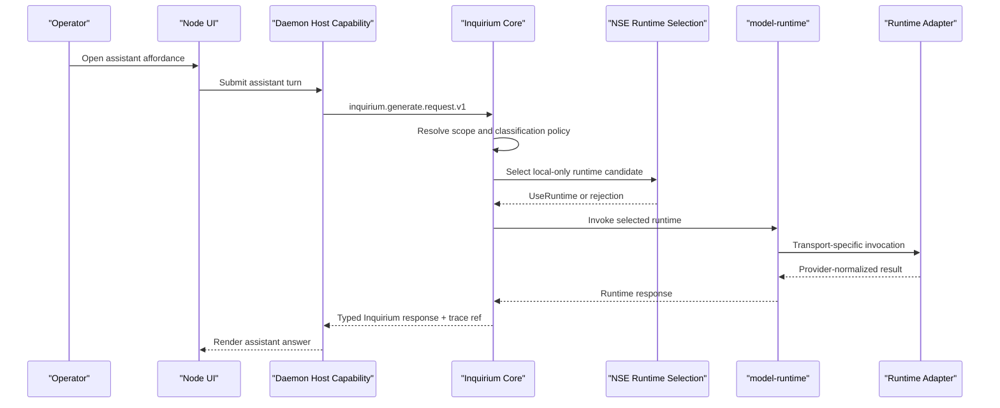

# Proposal 066: Inquirium Assistant Channel

Based on:
- `doc/project/40-proposals/047-classification-label-propagation.md`
- `doc/project/40-proposals/060-messaging-middleware.md`
- `doc/project/40-proposals/063-inquirium-model-inquiry-organ.md`
- `doc/project/40-proposals/064-inquirium-implementation-recommendations.md`
- `doc/project/40-proposals/065-local-relationship-layer.md`
- `doc/project/60-solutions/019-middleware/019-middleware.md`
- `doc/normative/50-constitutional-ops/en/UNIVERSAL-BASIC-COMPUTE.en.md`
- `doc/project/40-proposals/057-user-and-operator-notifications.md`

## Status

Draft

## Date

2026-06-03

## Executive Summary

Orbiplex should expose the default AI assistant as an **Assistant Channel**
backed by Inquirium, not as a system contact in the Local Relationship Layer.
The assistant may look contact-like in the user interface, but this is only a
presentation affordance. It is not a nym, not a relationship counterparty, not a
messaging peer, and not a route through INAC.

The proposed rule is:

```text
The assistant is a UI affordance for local model inquiry.
Inquirium owns the invocation channel.
Messaging and Local Relationship remain uninvolved.
```

The first implementation slice should be deliberately narrow: an advise-only,
local-only assistant surface that reads no node data except its own inquiry
session transcript. Later phases may add operator-granted context assembly,
classification-aware model selection, and a read-only observability feed over
Inquirium decision traces. Agentic effects remain opt-in, capability-gated, and
outside the MVP.

## Context and Problem Statement

Node UI is expected to grow a contact rail and conversation-style surfaces. It
is tempting to put the default AI assistant into that rail as "just another
contact". That would be the wrong ontology.

A real contact in Orbiplex participates in the relationship and messaging
strata: it may have pairwise continuity, nym continuity, trust posture,
capability passports, routing subjects, messaging policy gates, and transport
routes. The default assistant has none of those properties. It is a local organ
for invoking model-backed inquiry through Inquirium.

Treating the assistant as a contact would force false data into the Local
Relationship Layer and create special cases in Messaging:

- a fake nym or fake peer identity for a non-peer;
- special routing such as "if recipient is assistant, bypass Messaging";
- relationship records that do not represent a human or remote actor;
- contact deletion semantics that would accidentally conflict with inquiry
  transcript retention;
- policy confusion between counterparty trust and local model invocation scope.

The current implementation direction supports a cleaner split. Inquirium is
accepted as the node organ for model-backed inquiry. `model-runtime` exists as
its execution substrate. Messaging requires routing subjects, contact policy,
and INAC delivery. Local Relationship owns personal relationship classes and
pairwise continuity. The assistant belongs to none of those relationship or
messaging surfaces; it belongs to Inquirium.

## Current Implementation Evidence

As of 2026-06-03, the following facts are relevant:

- Proposal 063 defines Inquirium as the model inquiry organ.
- Proposal 064 defines Inquirium implementation guidance, including runtime
  adapters, model-runtime substrate, leases, artifacts, conformance, and
  operation contracts.
- `node:model-runtime` already has operation vocabulary for `generate`,
  `embed`, `batch_embed`, and related model operations.
- `node:model-runtime` already has explicit embedding DTOs following the
  `inquirium.embed.*` and `inquirium.batch-embed.*` schema pattern.
- A generate/chat DTO family is still missing and should be added before the
  assistant surface becomes a stable API.
- `node:daemon/model_runtime_host.rs` and the model-runtime host path already
  provide selected runtime invocation machinery.
- `node:node-ui` can synthesize rail entries at render time; a pinned assistant
  section does not require persistence in the relationship store.
- Messaging middleware is not the correct route for the assistant, because it
  is designed for peer message delivery with relationship and transport gates.

These are implementation facts, not guarantees that the assistant channel is
already implemented end to end.

## Proposed Model / Decision

### Decision 1: The Assistant Is A Quasi-Contact Affordance

The UI may render the assistant in a rail or conversation list, but this is a
view composition choice only. It must not create a durable contact-like record.

The following concepts stay separate:

| Concept | Owner | Persistence | Meaning |
| --- | --- | --- | --- |
| Assistant rail affordance | Node UI | None, unless user UI preferences pin or hide it | Contact-like render entry that opens the assistant surface. |
| Inquiry session | Inquirium | Inquirium retention policy | Actual assistant conversation transcript and invocation context. |
| Observability feed | Inquirium trace read projection | Existing trace/decision records | Read-only view of model-assisted decisions and host policy outcomes. |
| Contact | Local Relationship | Relationship store/vault projection | Human or peer relationship state, never the assistant. |
| Message thread | Messaging middleware | Messaging storage | Peer communication, never the assistant channel. |

Litmus test:

```text
If the assistant rail entry is removed, what disappears?
Only the render affordance disappears.
No contact, relationship member, messaging thread, nym, or routing subject is deleted.
```

If an implementation needs an `assistant-channel.v1` record beside
`local-contact.v1`, it has crossed the boundary and should be rejected.

Each concept has a distinct **home**, never a shared store: the rail affordance →
Node UI preferences (per profile/surface), **never** the relationship store; the
inquiry session → `InquiryTranscriptStore` (Memarium default, Decision 9); the
activity feed → the `trace/inquirium-assistant-turns` stream + a projection
(Decision 10). The litmus extends to independence of operations: hide/pin must not
erase the inquiry transcript, and deleting a conversation must not clear UI
preferences — the two are separate stores.

**Vocabulary lock.** The terms are fixed at four — *affordance*, *inquiry session*,
*transcript*, *activity feed* — plus *contact* and *message thread* as the things
the assistant is explicitly **not**. No fifth concept (no "assistant-channel-record")
is introduced.

### Decision 2: Inquirium Owns The Invocation Channel

Assistant turns are Inquirium operations. The UI asks the host to perform a
bounded model inquiry. The host applies Inquirium policy, selects a runtime,
invokes `model-runtime`, records trace/provenance, and returns a typed outcome.

The assistant channel must not:

- send through Messaging;
- read Local Relationship state directly;
- read Memarium directly;
- bypass classification, declassification, or egress policy;
- choose a remote runtime when local-only policy was requested;
- turn model output into authority without a host-side decision.

### Decision 3: Start With Advise-Only, Local-Only Scope

The MVP assistant should be an isolated local voice:

- local-only runtime candidates;
- `TrustMode::StrictLocal`;
- no relationship context;
- no Memarium context;
- no messaging thread context;
- no tool/action effects;
- no remote fallback;
- no hidden context assembly.

If no healthy local candidate exists, the assistant channel returns a typed
`handler-unavailable` or equivalent denial. It must not silently fall back to a
remote model.

### Decision 4: Context Access Requires Operator Grants And Existing Gates

A later "assistant with access" mode may exist, but it must use the same
boundary contracts as other consumers.

Allowed context sources must be resolved through host-owned gates:

- relationship-derived context through relationship policy decisions, not raw
  sealed relationship state;
- Memarium-derived context through classification-aware read/declassification
  contracts, not raw store access;
- messaging-derived context through messaging gates, not direct mailbox reads;
- artifact or dataset context through explicit leases.

JSON-e Flow may describe what context should be assembled. The host resolves
that declarative request through the existing boundary contracts. This preserves
the separation between "what context is requested" and "how protected sources
are accessed".

### Decision 5: Classification Travels With Every Context Element

Every context item supplied to Inquirium carries its classification label.
Unknown or missing classification is treated as the most restrictive class.

Inquirium applies model acceptance policy per element:

```text
if element classification <= model acceptance:
    include
else if element can be declassified under policy:
    declassify, include the declassified projection
else if policy is lenient:
    drop with trace
else:
    fail closed
```

Locality is a consequence of acceptance policy. A remote model normally has a
low acceptance ceiling. A local model may accept higher tiers if the operator
configured that policy. This avoids a separate brittle rule such as "remote is
always forbidden" while still preserving fail-closed information flow.

Classification is an **ambient label**, not an input consumed only at the final
gate. Carrying it to Inquirium opens the door to a late decision and makes the
data class visible to every component that wants to use it; it does not relocate
the decision to the end. Earlier layers (context assembly, middleware,
supervisor) **may and preferentially should** narrow, redact, or route on that
label before data reaches Inquirium (data minimization — do not carry context
deep into the stack only to drop it later). Inquirium and its adapter are the
**authoritative fail-closed backstop, not the sole gate**. All layer decisions
are **strictly narrowing**: a layer may only further restrict (drop, redact,
lower egress), never widen a prior restriction; the effective outcome is the
meet (most restrictive) across layers, using the classification lattice.

### Decision 6: `ClassKeyed<T>` Is The Configuration Counterpart Of `Classified<T>`

The assistant channel needs classification-dependent configuration without
turning configuration into a backdoor. The reusable idiom is:

```text
Classified<T> = data with classification
ClassKeyed<T> = configuration selected by classification
```

Example shape:

```text
feature {
  default: T
  by_class {
    public: T
    community: T
    personal: T
  }
}

resolve(classification) -> T
```

Useful axes include prompt template, retention profile, redaction profile,
trace level, KV/cache namespace, adapter parameters, and model acceptance
policy.

Guardrails:

- missing class config uses the most restrictive configured fallback;
- safety-sensitive axes must be monotonic as classification becomes more
  restrictive;
- prompt-per-class is behavior shaping, not enforcement;
- every resolved variant should be traceable.

**Home (resolves Open Question 6).** The generic *mechanism* — `ClassKeyed<T>`
plus `resolve(classification)` (most-restrictive fallback) and the
monotonicity validator — lives in the `classification` crate, beside
`Classified<T>` and the lattice. Rationale: it is the configuration dual of an
already node-wide primitive; its correctness depends on the classification
lattice (`is_at_least_as_restrictive_as`, `Join`) and must be uniform — a
safety-critical rule that must not be re-implemented per consumer; and it is tiny
and pure, so the shared home adds no heavy dependency. This is not premature
generalization: it places the dual where the original lives, with Inquirium as
its **first** consumer. Other consumers (e.g. Memarium's classification-aware
retention/declassification, which is already `ClassKeyed`-shaped) adopt it **when
touched**, not by anticipation. The class-keyed config *schemas* (prompt, KV,
retention, redaction, adapter params) stay in `inquirium-core`.

`ModeKeyed<T>` (Decision 8.4) remains a **separate named idiom** but shares the
same resolution **mechanism**: both are an ordered-axis keyed config with
most-restrictive/most-severe fallback and monotonicity. Share the mechanism, not a
type — a free function or `LatticeKeyedResolver` trait that both call, **not** a
generic `LatticeKeyed<Axis, T>` type. Two consumers prove a shared *mechanism*, not
a shared *type*; a generic "any lattice + any config" type would invite a fifth and
sixth axis (`TrustKeyed`, `TimeKeyed`, …) creeping into a safety primitive. The
shared `resolve()` is implemented once; `ClassKeyed` and `ModeKeyed` stay distinct
concrete types.

### Decision 7: Observability Is A Read Projection, Not A Chat Transcript

The assistant surface may later host an "Activity" view for model-assisted and
policy-assisted decisions: runtime selection, automatic redactions,
classification include/declassify/drop decisions, `ClassKeyed` resolution, and
related Inquirium trace events.

This feed is not a new store and not part of the chat transcript. It is a
read-only projection over existing trace/decision records.

Guardrails:

- separate "Conversation" and "Activity" views;
- label provenance honestly: host policy decided, model proposed, model
  produced, operator approved;
- keep the feed local-only and operator-facing;
- never feed observability records back into the model prompt by default;
- never publish assistant transcript, activity, or assistant-turn trace records
  into Agora, Seed Directory, Messaging, swarm gossip, or other federation paths
  by default; any export requires a later explicit publication contract;
- escalation from feed item to action belongs to the later agentic phase.

### Decision 8: Epistemic Posture And Dignity

The previous decisions secure the assistant *structurally* (ontology, data flow,
egress). This decision secures it *epistemically*. The ontological basis treats
intellect as a tool that becomes harmful when it turns into "the only adviser, a
carrier of prestige, or an identity", and the vision treats epistemic hygiene,
minimal stimulus, sovereignty, and a universal minimum as behavioral contract.
The assistant must therefore be a **non-oracular voice**, not a seat of knowing.

These properties are expressed as contract fields and config, so they are
testable, not aspirational.

**8.1 Output is evidence, framed as a bounded claim.** The generate response
carries an `epistemic` block. Output is never marked authoritative or
auto-actionable.

```json
"epistemic": {
  "stance": "advisory",            // advisory | hypothesis   (never "authoritative")
  "confidence": "unstated",        // unstated | low | medium | high
  "grounded_in": [],               // refs to context elements / trace; [] = model-only
  "caveats": []
}
```

Invariant: no request flag or response field may promote output to
`authoritative` or to a direct effect. Action remains Decision 3 / Phase 3 only.

**This is a schema gate, not a convention.** The `stance` enum has only
`{advisory, hypothesis}` — `authoritative` is structurally unrepresentable, not
merely discouraged. `generate.response.v1` has **no** `effects` field (effects
belong to a separate Phase-3 `inquirium.act.response.v1`, never a field here);
`plurality` carries a JSON-Schema `default: "preserve"`. Negative fixtures are part
of the contract: a payload with `stance: "authoritative"`, or any `effects` on a
generate response, is rejected by the schema gate.

**8.2 Plurality preserved, not collapsed.** Request policy gains
`plurality: preserve | collapse` (default `preserve`). Where the model has
multiple viable answers, the assistant surfaces them rather than imposing
premature closure — the epistemic analogue of "deliberate postponement of
decisions" and multi-paradigmatic knowing.

**8.3 Verification/correction loop, operator-driven.** A turn's claim can be
marked by the operator through an explicit feedback contract
`inquirium.inquiry-feedback.v1` (`verified | refuted | amended` + note). Feedback
targets a **single `inquiry-result.v1`**, not a whole session, and is itself an
append-only fact (facts over overwrite) — recorded with the inquiry session. No
hidden auto-learning; correction is an explicit operator act. This realizes "truth
as a feedback loop: prediction → outcome → update".

**8.4 Mode-aware rigor (`ModeKeyed<T>`).** `ModeKeyed<T>` is a **separate idiom**
from `ClassKeyed<T>`, not a merged key: the two axes are orthogonal —
classification is *what the data is*, mode is *which regime the node operates in*.
A given config may be `ClassKeyed`, `ModeKeyed`, or both, resolved independently.
Modes follow the vision work classes: `commons` (normal), `crisis`
(`disaster`/`war`/`blackout`), `support` (`shelter`/`food`/`legal`/`medical`).
Rigor is **monotone in mode severity**: a more severe mode may only tighten (more
verification, stricter egress, lower default `confidence` assertion), never
loosen. `resolve(mode)` shares the most-restrictive-fallback semantics and
monotonicity guard of `ClassKeyed`.

**8.5 Baseline assistant as universal minimum.** The Phase 1 local-only profile
is declared a **non-withdrawable baseline** (`baseline-assistant`): it must
function offline and without economic gating, as part of communication and
orientation dignity. Enhanced/remote behavior is an additive tier, never a
precondition for the baseline. This grounds "local-only" in sovereignty and the
universal minimum, not only in safety. The non-withdrawable guarantee is anchored
in `doc/normative/50-constitutional-ops/.../UNIVERSAL-BASIC-COMPUTE`: the
`baseline-assistant` is a communication/orientation facet of universal basic
compute, not a parallel notion invented here, and inherits its non-withdrawability
and no-fee-in-the-currency-of-dignity constraints.

`baseline-assistant` is a **capability profile, not a runtime class** — so the
constitutional minimum is never bound to one vendor. `BaselineAssistantProfile`
declares *requirements* (generate with a minimum context window, no tool surface,
local transport only, bounded output) and *guarantees* (no telemetry egress, no
remote fallback), anchored in UBC. A concrete runtime (Ollama, `llama-server`,
LM Studio, a future MLX/edge runtime) is an **instance** that passes a
`BaselineAssistantProfile` conformance suite; the OQ4 first target (Ollama) is the
first conformant instance, not the definition. Inquirium selects `baseline-assistant`
only among conformance-positive runtimes.

A runtime is not selectable as `baseline-assistant` by configuration label alone.
The current node environment must have a fresh passing
`BaselineAssistantProfile` conformance report for that runtime candidate. A stale
or missing report makes the candidate unavailable for the baseline profile, even
if ordinary non-baseline routing could still consider it.

**8.6 Non-dopamine UX (schema, not convention).** The assistant surface must not
use engagement-maximizing patterns: no unsolicited initiation, no streak/nudge/
re-open mechanics, advisory framing, and a clear separation of "the assistant
suggests" from "I decided". These are encoded in the assistant UI-preferences
schema — e.g. `streak_count` and `nudge_after` are forbidden fields, `initiation`
is an enum whose only value is `never` — and asserted by a CI test that the
preferences conform. Schema over convention, so the invariant cannot quietly drift.

Guardrails:

- output stance is never `authoritative`; promotion to action requires Phase 3
  capability + Protocol Gate;
- `plurality: preserve` is the default for the assistant surface;
- correction is explicit and operator-driven; no silent self-update;
- `ModeKeyed` rigor is monotone in severity, validated like `ClassKeyed`;
- the baseline assistant remains available local-only and unconditionally;
- non-dopamine UI invariants are covered by tests.

### Decision 9: Transcript Storage Contract (resolves Open Question 2)

Inquiry-session persistence is **not** a single store choice. It decomposes into
three layers, each at its proper stratum:

- **Fact (source of truth) → Memarium.** Each turn/result is an append-only
  Memarium fact carrying provenance (`runtime/ref`, `model.binding/ref`,
  `operation/id`), classification, and operator feedback (Decision 8.3). This
  reuses Memarium governance — classification, retention, excision, as-of,
  declassify, custody — instead of reinventing it. Writes go through the existing
  governed path: host capability `memarium.write` op `write_fact`, behind the
  capability/passport gate and space/classification/sealed-payload policy.
- **Blob (bulk/binary) → object-store, referenced from the fact.** Large content
  goes to the artifact/object store; Memarium holds only a
  descriptor/provenance/ref. **`memarium.write` is a governed fact-plane, not a
  high-throughput data plane** — bulk content must not be pushed through it.
- **Index (search + semantic/thematic tagging) → projection.** A read model over
  `memarium:{space}:entries` / `:facts`, rebuildable by replay; never a second
  source of truth.

**Contract, not concrete coupling.** Inquirium depends on an
`InquiryTranscriptStore` trait (append turn/result fact, query, retention, excise;
classification first-class), **not** on Memarium directly. Memarium is the default
implementation via `memarium.write`. Because that path requires `memarium_enabled`
plus a `memarium/write` grant, the `baseline-assistant` (Decision 8.5) on a node
without Memarium uses a **degenerate local implementation** (small local
JSONL/SQLite) behind the same trait. The trait is what makes the universal-minimum
baseline implementable without Memarium.

The degenerate implementation is intentionally small: local, participant-scoped,
non-federating, and limited to the baseline assistant. It must not grow into a
second Memarium or an alternate source of transcript truth. When Memarium later
becomes available, any migration or export is an explicit operator-visible
operation, not an automatic background merge.

**Nomenclature:** transcript facts are `inquirium.inquiry-turn.v1` and
`inquirium.inquiry-result.v1` — *not* `observation` (observation is Sensorium's
domain of perception/contact; Inquirium is the act of asking models).

**Scope (resolves Open Question 3): per participant.** Assistant history is scoped
to the **participant** (the accountable identity), not per node, per UI profile,
or per operator-role. This survives device and UI-profile changes (sovereignty),
keeps multiple participants on one node separate (multi-tenant boundary), and maps
onto the participant's Memarium space used for the transcript facts. It stays
**local and accountable** (the owner's own tool, not a pseudonymous activity) and
does not egress, so it creates no external linkability. `workspace` may be an
optional finer sub-partition *within* participant scope later, never the primary
scope.

All assistant session, trace, feedback, and transcript records use the same
canonical `participant/ref` format as caller binding, Memarium participant-space
allocation, and Local Relationship participant ownership. No UI-profile id, local
account label, node id, or operator-role id may replace it as the primary history
scope. The node hosts execution; the participant owns accountable continuity.

This gives the swarm a portable but local rule: assistant state is locally
accountable and does not gossip by default, while participant-controlled state may
move inquiry continuity between nodes where policy allows. Node identity records
where work happened; participant identity records whose assistant continuity it is.

**Retention:** Inquirium declares retention policy (`ClassKeyed`, Decision 6);
Memarium enforces it. This is consistent with Decision 1's "Inquiry session →
Inquirium retention policy": Inquirium owns the policy, Memarium is the governed
store that applies it.

### Decision 10: Assistant Turn Trace Contract (resolves Open Question 5)

Assistant-turn trace is an **operational trace**, not the transcript source of
truth. It records shape, decisions, policy outcomes, and effects without storing
prompt or response content by default.

The durable source of truth is a storage stream:

```text
stream:      trace/inquirium-assistant-turns
record_type: daemon/inquirium-assistant-turn-trace.v1
```

In the current Node storage runtime this stream is backed by the append-only
JSONL commit log, but the contract is the storage stream, not a file path or a
JSONL implementation detail. Inquirium should append trace records through the
host storage boundary. Trace read models, summaries, and UI activity feeds are
projections over that stream.

This follows the existing trace convention:

- `trace/model-invocations` for lower-level model invocation traces;
- `trace/middleware`, `trace/network`, and `trace/agora` for other operational
  traces;
- storage projector behavior that intentionally excludes `trace/*` streams from
  ordinary domain read-store projection.

Memarium remains the store for **domain facts**: transcript turn/result facts,
operator feedback, artifact provenance, or durable "assistant produced artifact
X" records. It is not the default sink for low-level technical trace events. If
an assistant turn needs both, it writes:

- an operational trace record to `trace/inquirium-assistant-turns`;
- transcript/domain facts through `InquiryTranscriptStore` (Memarium by default,
  Decision 9);
- bulk content or binary artifacts to the object store, referenced by facts and
  trace records only through descriptors.

Minimum trace shape:

```json
{
  "trace/schema": "inquirium.assistant-turn-trace.v1",
  "trace/id": "tr:...",
  "turn/id": "turn:...",
  "participant/ref": "participant:did:key:...",
  "operation/id": "op:...",
  "time/started-at": "2026-06-04T10:12:00Z",
  "time/finished-at": "2026-06-04T10:12:04Z",
  "status": "completed",
  "runtime/ref": "runtime/local-assistant",
  "model.binding/ref": "model.binding/local-assistant",
  "input/shape": {
    "message/count": 3,
    "token/approx-input": 812,
    "file/has-any": false,
    "tool/has-any": false
  },
  "output/shape": {
    "token/approx-output": 244,
    "artifact/refs": []
  },
  "policy": {
    "locality": "local_only",
    "trust/mode": "strict_local",
    "trace/level": "metadata_only",
    "persist/prompt": false,
    "persist/response": false,
    "egress/allowed": false
  },
  "decisions": [
    {
      "kind": "runtime-selection",
      "outcome": "use-runtime",
      "reason/code": "local-candidate-selected"
    }
  ],
  "effects": [
    {
      "kind": "memarium.write",
      "status": "ok",
      "target": "memarium:space:personal:kind:inquirium.inquiry-result.v1"
    }
  ],
  "diagnostics": {
    "error/code": null,
    "retry/count": 0
  }
}
```

The invariant is: **trace stores shape, decisions, and consequences; transcript
stores content under retention policy; neither stores prompt content by default**.
Prompt or response content may be persisted only when an explicit trace policy
allows it, and even then through a classified/redacted artifact or transcript
contract rather than incidental debug logging.

**One-way references; trace never absorbs the transcript.** The transcript fact
(`inquirium.inquiry-result.v1`) carries a forward `trace/ref`; the operational
trace record carries `turn/id` and `participant/ref`, **not** a `transcript/ref`.
A join requires the right to read *both* the trace stream and the Memarium space —
so the trace can never read itself into a transcript. `persist/prompt: false` /
`persist/response: false` are **schema defaults**, not adapter conventions.

**Naming convention.** Record type in a storage stream is
`<owner-component>/<artefact>.<vN>` (e.g. `daemon/inquirium-assistant-turn-trace.v1`);
payload schema in the record body is `<organ-domain>.<artefact>.<vN>` (e.g.
`inquirium.assistant-turn-trace.v1`). Each stream's contract names both, explicitly.

**Substrate ready from Phase 1.** Phase 1 emits the full
`daemon/inquirium-assistant-turn-trace.v1` shape to the stream even though the
Activity feed UI (Decision 7 / Phase 2b) is deferred; the feed is later a pure
projection and requires no shape change. Phase 1 done-criteria include: the stream
is writable and replayable, and records associate to `inquiry-result.v1` by
`turn/id` (without content absorption, per the one-way rule above).

### Decision 11: Notification Escalation And Operator Prompts (resolves Open Question 7)

This is wider than crisis detection; crisis is only its sharpest case. The
question is the threshold between three operator-facing levels, distinguished by
what each demands:

1. **Activity feed item** (Decision 7) — "X happened", browsable, no reaction
   required. The default for almost everything: runtime selection, successful
   generation, ordinary context drops, declassify/drop decisions, transcript/fact
   writes, adapter trace, the operator feedback loop.
2. **Notification** — "worth your attention beyond the feed" (P057
   `notification-create.v1`); informational, optional action.
3. **Operator prompt** — a **blocking** host-owned interaction request: the
   workflow cannot proceed until the operator answers (yes/no, select, approve,
   disambiguate). It does not merely inform; it demands a bounded decision.

**Default is feed-only.** Escalation to (2)/(3) happens only for a strong reason;
everything else stays a trace. This is the non-dopamine stance of Decision 8.6 —
escalation must never become an engagement vector. Escalate only when an item:

- **requires an operator decision** before proceeding (→ operator prompt);
- indicates **sustained loss of baseline capability** (baseline assistant
  unavailable, adapter persistently failing, conformance expired);
- exposes a **boundary-risk decision** (e.g. a remote runtime rejected for
  sensitive context — feed-only in normal mode, escalated under debug/security);
- requires **confirmation before egress/publication**;
- is a **crisis/safety candidate** (see below).

**The escalation threshold is `ModeKeyed` (and may be `ClassKeyed`).** What
escalates is a policy keyed by node mode (Decision 8.4), not a fixed list: in
`crisis`/`support` modes more items escalate (rigor rises); a boundary-risk that
is feed-only in `commons` becomes a notification under debug/security/crisis.

**Crisis is a candidate, not a verdict.** Inquirium never declares a crisis as an
authority (Decision 8: model output is evidence, not authority). It emits a
`crisis-candidate` signal for the **host-owned crisis layer**
(`node:daemon/crisis_detectors`), which owns formal crisis status. A
`crisis-candidate` is an input to that layer, not itself a notification. The host
emits notification escalation only after host policy classifies the candidate as
worth operator attention. Inquirium escalates "needs host/operator review", never
"crisis is active".

**The operator prompt is host-owned; the model proposes, the host shapes.** The
model may *propose* a question; it must not render a widget from arbitrary JSON.
Inquirium emits a typed, host-owned interaction request
`inquirium.operator-question.request.v1` (in `inquirium-core`, per OQ1); the host
validates and shapes it before any operator sees it.

```json
{
  "schema": "inquirium.operator-question.request.v1",
  "question/ref": "question/inquirium/op-7f3a/remote-runtime-approval",
  "operation/ref": "operation/inquirium/op-7f3a",
  "recipient/class": "operator",
  "reason/code": "operator-approval-required",
  "prompt": {
    "kind": "single-choice",
    "text": "Use remote runtime for this public-only context?"
  },
  "widget/kind": "single-choice",
  "widget/payload": {
    "options": [
      { "value": "yes", "title": "Yes" },
      { "value": "no", "title": "No" }
    ]
  },
  "default/on-timeout": {
    "answer": "no",
    "reason/code": "timeout-fail-closed"
  },
  "classification": {
    "input": "public",
    "output": "public"
  },
  "subject": {
    "runtime/ref": "...",
    "model.binding/ref": "...",
    "adapter.instance/ref": "..."
  },
  "response": {
    "target/ref": "inquirium.operator-question.respond",
    "method": "POST",
    "idempotency/key": "inquirium:op-7f3a:remote-runtime-approval"
  },
  "provenance": {
    "source/component": "inquirium-core",
    "requested/by": "runtime-selection",
    "reason/code": "remote-runtime-requires-operator-approval"
  }
}
```

The example intentionally does **not** include a `widget.input/schema` field. The
input schema is the registered
`inquirium.operator-question.widget.single-choice.v1` schema owned by
`inquirium-core`; the request carries only `widget/kind` plus typed payload.

Host validation before display: the question is permitted in this workflow;
allowed answers come from an allow-list; the text carries no secrets;
classification permits showing it to the operator; timeout/cancel behavior is
defined (default fail-closed); and the exact operation/lease/capability it
unblocks is named.

**The model picks a widget *kind*, never a schema.** Instead of an arbitrary
`widget.input/schema`, the request carries `widget/kind`:
`single-choice`, `multi-choice`, `confirm`, `free-text-with-allowlist`, etc. plus
a typed payload. Each kind has a **registered input schema in `inquirium-core`**
(e.g. `inquirium.operator-question.widget.single-choice.v1`); a
`RegisteredQuestionKinds` registry is the only source of widget schemas,
extensible only by change to core. Negative fixtures reject: an unknown
`widget/kind`, a `free-text` kind without an `allowlist`, and any raw input schema
supplied in place of a `widget/kind`. This closes the "model returns JSON, host
renders it" path — the structural route to UI prompt-injection (swapping a yes/no
widget for a "type your passphrase" one).

**Prompt lifecycle is explicit.** An operator question moves through:

```text
pending -> answered | timed_out | cancelled | superseded
```

Only `answered` may unblock the operation with operator-provided input.
`timed_out`, `cancelled`, and `superseded` fail closed unless the request declares
an explicit safe default such as `default/on-timeout`.

**Interaction contract ≠ notification contract.** The interaction request is the
blocking primitive. The host MAY *derive* a `notification-create.v1` with
`actions[]` (P057 `notification-action.v1`) as the attention vehicle, but the
request stays an interaction contract. Provenance is labeled honestly (Decision
8.2: host-policy vs model-proposed). Notification says "pay attention"; an
operator prompt says "decide — the flow is blocked".

Projection from interaction request to notification is mechanical and host-owned:

| Interaction field | Notification projection |
| --- | --- |
| `question/ref` | `subject/ref` or `body/ref` |
| `operation/ref` | `correlation/id` |
| `prompt.text` | `body/text` |
| `reason/code` | `reason/code` |
| `widget/kind` | `actions[].kind`, after `RegisteredQuestionKinds` resolution |
| `widget/payload` | `actions[].input/schema` projection or host-rendered widget model |
| `response.target/ref` | `actions[].target/ref` |
| `default/on-timeout` | Host-enforced timeout behavior, not a rendered answer |

The notification may expose an inline action only as a bounded projection of the
host-owned interaction. It may also point to a dedicated interaction page. In both
cases the interaction record remains the authoritative object that blocks and
unblocks the workflow.

**Phase staging.** Phase 1 escalations are minimal (baseline unavailable,
sustained degradation). Policy-approval prompts (remote-runtime / egress approval)
arrive with Phase 2 context/egress. Action-gating prompts belong to Phase 3
(agency) and require capability + Protocol Gate; a timeout there fails closed.

Resolution text:

```text
Activity feed items deserve notification escalation only when they require operator
action, indicate a sustained loss of baseline capability, expose a boundary-risk
decision, require confirmation before egress, or represent a crisis/safety
candidate that must be reviewed by a host-owned crisis/policy layer. Routine
runtime selection, successful generation, normal context drops, and ordinary trace
events remain feed-only. When an item requires a bounded operator answer before the
workflow can proceed, it escalates as a host-owned operator prompt — a typed
question contract (allowed answers, timeout/default, provenance, classification,
the operation it unblocks) — not merely as a notification. The model may propose a
question; the host validates, shapes, and owns the widget contract.
```

## Contract Sketch

The assistant MVP needs a generate/chat contract aligned with the already
introduced embedding contracts.

### Request

```json
{
  "schema": "inquirium.generate.request.v1",
  "operation": "generate",
  "turns": [
    {
      "role": "user",
      "content": [{ "type": "text", "text": "Help me think this through." }]
    }
  ],
  "context_assembly": {
    "schema": "inquirium.context-assembly.request.v1",
    "sources": []
  },
  "parameters": {
    "max_tokens": 1024,
    "temperature": 0.2
  },
  "policy": {
    "locality": "local_only",
    "trust_mode": "strict_local",
    "scope": "assistant-session-only",
    "on_context_denied": "fail_closed"
  },
  "metadata": {}
}
```

### Response

```json
{
  "schema": "inquirium.generate.response.v1",
  "operation": "generate",
  "outcome": "completed",
  "output": [
    { "type": "text", "text": "A bounded answer from a selected local runtime." }
  ],
  "runtime/ref": "runtime/local-assistant",
  "model.binding/ref": "model.binding/local-assistant",
  "locality": "local_only",
  "trace/ref": "trace/inquirium-assistant-turn",
  "usage": {},
  "diagnostics": {}
}
```

The DTO is finalized in a new `inquirium-core` crate (resolves Open Question 1),
not in `model-runtime`. `inquirium-core` is the **thin contract crate** for the
Inquirium organ — DTOs, schema ids, policy enums, and the `InquiryTranscriptStore`
/ `ClassKeyed` / `ClassKeyed`-sibling `ModeKeyed` traits — depending only on
`classification` (which puts the classification-aware contract at the organ layer,
not in the substrate `model-runtime`). The existing `inquirium.embed.*` /
`inquirium.batch-embed.*` DTOs should **move into `inquirium-core`** as well, so
the `inquirium.*` vocabulary is not split across crates; `model-runtime` and the
daemon depend on `inquirium-core`. The important properties are:

- operation is explicit;
- runtime selection remains host-owned;
- local-only policy is enforceable;
- context assembly is declarative and default-empty;
- typed denials are first-class outcomes;
- trace references are returned without leaking protected context.

### Implementation Notes (Phase 1 seam)

Code-grounded guidance verified against the current node, so the contract maps to
one injection point rather than scattered special cases.

**One candidate-filter seam.** Local-only enforcement is a single `retain` over
the candidate list produced by `daemon/src/model_runtime_host.rs::healthy_nse_candidates()`,
before `select-llm-model` chooses and `invoke_selected_runtime` runs. Phase 1:

```rust
candidates.retain(|c| locality_allows(LocalOnly, c));
// Phase 1 proxy: local == transport_kind in {"http_local", "command_stdio"}.
// Authoritative source is the runtime LocalityMode/TrustMode in config; the
// transport_kind proxy is sufficient for Phase 1.
```

**The same seam evolves for Phase 2 — no rewrite.** The predicate changes from
`locality_allows(constraint, c)` to `model_accepts(candidate, context)`: after
per-element redact/declassify/drop, a candidate qualifies when its
`accepts_max_tier` ≥ the tier of every non-droppable context element. Locality
falls out as a consequence (a remote model has a low `accepts_max_tier`). Phase 1
fixes exactly the filtering point Phase 2 enriches, so it does not paint into a
corner.

**Fail-closed:** an empty list after the filter returns `handler-unavailable`;
never a silent switch to remote.

**Confirm before coding:**
- whether `LocalityMode`/`TrustMode` is directly reachable in the
  `healthy_nse_candidates` loop (use it instead of the `transport_kind` proxy);
- the host-capability shape for inquiry — reuse the existing
  `module_capability`/host-capability dispatch, or add a dedicated
  `/v1/host/capabilities/inquirium.generate`;
- whether token `usage` belongs in the Phase 1 response or is deferred.

## Reference Flow



Messaging and Local Relationship do not participate in this flow.

## Phased Implementation

### Phase 1: Advise-Only, Local-Only

Goal: a safe assistant conversation with no node data access.

Tasks:

- add a pinned assistant affordance to the contact rail or adjacent rail
  section;
- add `inquirium.generate.request.v1` and `inquirium.generate.response.v1`;
- add a daemon host capability endpoint used by Node UI;
- bind caller identity to the local operator;
- route through Inquirium and model-runtime with hard
  `LocalOnly + StrictLocal` filtering;
- store transcript as an Inquirium inquiry session, not as a message thread;
- return typed unavailability when no local runtime qualifies.

Done criteria:

- end-to-end assistant conversation works through a local runtime;
- no Messaging dispatch occurs;
- no Local Relationship record is created;
- no Memarium or relationship context is read;
- no remote egress occurs;
- trace shows runtime selection and local-only enforcement.

### Phase 2: Advisor With Granted Context

Goal: allow the assistant to use operator-approved context while preserving
classification and boundary contracts.

Tasks:

- add context assembly through JSON-e Flow;
- resolve sources through existing gates;
- attach `Classification` to every context element;
- add model acceptance config such as `accepts_max_tier`, `accepts`, or
  `requires_declassification_above`;
- implement per-element include/declassify/drop/fail decisions;
- validate dangerous combinations such as remote provider plus high acceptance
  unless explicitly acknowledged by the operator;
- trace source, classification, decision, and egress per element;
- introduce `ClassKeyed<T>` resolution for prompt, retention, trace, redaction,
  and adapter parameters.

Done criteria:

- unknown classification fails closed;
- remote candidates cannot receive protected context unless policy explicitly
  allows it and operator acknowledgement exists;
- context denied by one layer cannot be reintroduced by a lower layer;
- trace explains every context item decision.

### Phase 2b: Observability Feed

Goal: expose model-assisted decisions without mixing them into chat.

Tasks:

- add an "Activity" view beside the assistant conversation;
- project over Inquirium trace/decision records;
- mark provenance for each item;
- keep it read-only, local-only, and operator-facing;
- define which activity items become notifications.

Done criteria:

- activity feed is not stored as transcript;
- feed records are not sent to model prompts by default;
- provenance and classification are visible to the operator.

### Phase 3: Agentic Effects

Goal: allow actions only when explicitly enabled and capability-gated.

Tasks:

- define action capabilities and protocol gates;
- require operator custody for relationship, governance, and egress effects;
- require human-in-the-loop approval for sensitive classes;
- allow feed intervention such as approve/revert only through explicit
  capability flows.

Done criteria:

- assistant can propose before acting;
- acting requires explicit authority;
- every effect is auditable and reversible where the domain supports reversal.

## Trade-offs

### Benefits

- avoids false contact ontology;
- keeps Messaging free of local model invocation special cases;
- preserves Local Relationship as a relationship layer, not a UI shortcut
  registry;
- gives the operator a familiar assistant surface without corrupting data
  semantics;
- keeps Inquirium as the single model inquiry boundary;
- supports later richer context access through explicit grants and
  classification-aware policy.

### Costs

- Node UI needs a presentation union or pinned assistant section rather than
  reusing contact records directly;
- Inquirium needs a generate/chat DTO family;
- assistant transcripts need their own retention model;
- context assembly requires careful host-side integration with existing gates;
- classification-aware model acceptance adds policy machinery before remote
  assistant use can be safe.

### Constraints

- the assistant cannot rely on remote fallback in Phase 1;
- missing local runtime means unavailable, not degraded remote behavior;
- model output remains evidence, not authority;
- prompt instructions cannot be the enforcement boundary;
- observability feed and chat transcript must remain separate read models;
- assistant transcript, activity, and trace records do not enter swarm gossip,
  Messaging, Agora, or Seed Directory paths by default.

## Failure Modes and Mitigations

| Failure mode | Risk | Mitigation |
| --- | --- | --- |
| Assistant implemented as a contact | Relationship store pollution and fake peer identity. | Render-only affordance; no contact/channel persistent record. |
| Assistant routed through Messaging | Special-case dispatch and false INAC semantics. | Direct host capability to Inquirium; no messaging-send path. |
| Remote fallback from local-only assistant | Protected local prompts may leave the node. | Hard `LocalOnly + StrictLocal` filter and typed unavailability. |
| Hidden context access | Backdoor reads from relationship, Memarium, or mailbox state. | Default-empty scope and context only through boundary contracts. |
| Classification stripped during context assembly | Egress policy cannot reason about data sensitivity. | `Classified<T>` context elements and fail-closed unknown labels. |
| Non-monotonic class-keyed config | Sensitive classes receive weaker controls than public data. | Monotonicity validation or explicit operator acknowledgement. |
| Observability feed becomes prompt context | Decision traces leak protected facts back into models. | Feed is local-only read projection and not prompt input by default. |
| Model advice becomes action | Accountability shifts from operator to model. | Advise-only Phase 1; later effects require capabilities and Protocol Gate. |
| Assistant becomes the oracle | Intellect turns into "the only adviser"; operator defers their own knowing. | `epistemic.stance` advisory, plurality preserved, output is evidence not authority, non-dopamine UX. |
| Belief instead of verification | Confident output treated as truth without check. | Bounded-claim framing + operator feedback loop (`inquiry-feedback.v1`); intelligence as corrigible prediction. |
| Crisis without raised rigor | High-stakes mode runs with normal egress/verification. | `ModeKeyed` monotone rigor; crisis/support tighten egress and verification. |
| Baseline gated behind economy/network | Assistant unavailable when most needed; dignity charged a fee. | `baseline-assistant` local-only, non-withdrawable; remote is additive only. |
| Fallback transcript store becomes a second Memarium | Two transcript sources of truth and unclear retention/excision. | Fallback is local, participant-scoped, non-federating, baseline-only; migration/export is explicit. |
| Assistant trace becomes swarm signal by accident | Local inquiry leaks into public/federated surfaces. | No default publication to Agora, Seed Directory, Messaging, or gossip; later export needs explicit contract. |
| Model-authored widget schema is rendered directly | UI prompt injection or credential-harvesting widget. | `widget/kind` registry in `inquirium-core`; host derives notification actions and schemas. |

## Open Questions

1. ~~Should `inquirium.generate.*` live in `model-runtime` or a future
   `inquirium-core` crate?~~ **Resolved:** `inquirium-core` from the start (thin
   contract crate, deps only `classification`); existing `inquirium.embed.*` move
   there too. See Contract Sketch.
2. ~~What is the exact transcript storage contract for inquiry sessions?~~
   **Resolved in Decision 9:** `InquiryTranscriptStore` trait; fact → Memarium
   (`memarium.write` op `write_fact`), bulk blob → object-store referenced from
   the fact, search/tagging → projection; degenerate local impl when
   `memarium_enabled` is false.
3. ~~Should assistant history be per node, per operator, per workspace, or per
   local UI profile?~~ **Resolved: per participant** (accountable identity),
   mapping onto the participant's Memarium space; `workspace` optional finer
   sub-partition later. See Decision 9.
4. ~~Which local runtime should be the first supported Phase 1 target?~~
   **Resolved:** first supported target is **Ollama** via an `http_local` adapter
   speaking an **OpenAI-compatible chat-completions** endpoint (consistent with the
   `local-ollama` provider already named in `node:nse`). The choice fixes the
   *protocol, not the vendor*: the same adapter generalizes to `llama-server` /
   LM Studio, and `inquirium.generate.*` stays provider-neutral. The
   `baseline-assistant` guarantee (Decision 8.5) is anchored to a
   `llama.cpp`/`llama-server`-class runtime (minimal footprint for constrained
   devices), reachable over the same `http_local` + OpenAI-compatible path. The
   concrete model is catalog/`select-llm-model` configuration, not part of this
   proposal.
5. ~~What is the minimum useful trace shape for assistant turns without exposing
   prompt content?~~ **Resolved in Decision 10:** operational trace goes to the
   `trace/inquirium-assistant-turns` storage stream with record type
   `daemon/inquirium-assistant-turn-trace.v1`; JSONL is the current physical
   backend, not the contract; Memarium is reserved for transcript/domain facts.
6. ~~Should `ClassKeyed<T>` become a generic reusable config type or stay an
   Inquirium idiom?~~ **Resolved:** the *mechanism* lives in the `classification`
   crate (with `Classified<T>` and the lattice), the *config schemas* stay in
   `inquirium-core`. See Decision 6.
7. ~~What activity feed items deserve notification escalation?~~ **Resolved in
   Decision 11:** feed-only by default; escalate (notification, or a blocking
   host-owned operator prompt) only for operator-decision / sustained-degradation
   / boundary-risk / pre-egress-confirmation / crisis-candidate; threshold is
   `ModeKeyed`. Model proposes a question, host shapes it.

## Next Actions

1. Add `inquirium.generate.request.v1` and `inquirium.generate.response.v1` DTOs
   in the same style as the embedding contracts.
2. Add a host capability endpoint for local assistant inquiry.
3. Add a Node UI assistant affordance that is composed at render time and does
   not touch Local Relationship storage.
4. Implement Phase 1 routing with strict local-only runtime selection and typed
   `handler-unavailable` denial.
5. Add tests proving no Messaging dispatch, no relationship record creation, no
   Memarium read, and no remote egress in Phase 1.
6. Design the Phase 2 context assembly envelope with `Classified<Element>`
   propagation and model acceptance policy.
7. Decide whether the observability feed belongs in the first UI iteration or
   remains a later read projection.
8. Add an `xtask` dependency-direction lint: `inquirium-core` depends only on
   `classification`; `model-runtime`/`model-runtime-http`/`daemon` depend on
   `inquirium-core`; `inquirium-core` must not import the substrate. Mirror it with
   a lint that no `trace/inquirium-assistant-turns` consumer imports
   `memarium-runtime` (transcript reads go through a separate capability).
9. Define `inquirium.operator-question.request.v1` and the
   `RegisteredQuestionKinds` registry, then derive notification actions from that
   host-owned interaction contract.

## Implementation Tracking

Status values:

- `todo` — not started;
- `in-progress` — design or implementation has started;
- `done` — implemented and covered by tests, schema validation, or documented
  operator evidence;
- `deferred` — intentionally postponed.

The earlier root-level `assistant-channel-advisory.md` tracker is mirrored here.
That advisory remains only a working note; this table is the canonical backlog.

| ID | Work item | Status | Done criteria / evidence |
| :--- | :--- | :--- | :--- |
| `assistant-affordance-render-only` | Add assistant as a UI affordance, not a contact record. | `todo` | Node UI renders assistant entry without writing Local Relationship or Messaging state. |
| `assistant-generate-contract` | Add `inquirium.generate.request/response.v1`. | `todo` | DTOs validate operation, turns, local-only policy, typed denials, trace refs, and output shape. |
| `assistant-host-capability` | Add operator-bound host capability endpoint for assistant inquiry. | `todo` | Node UI calls daemon endpoint; caller binding is local operator; missing authority fails closed. |
| `assistant-local-only-routing` | Route Phase 1 through local-only Inquirium selection. | `todo` | Healthy local runtime succeeds; missing local runtime returns typed unavailability; no remote fallback. |
| `assistant-local-runtime-target` | First target: Ollama via `http_local` + OpenAI-compatible chat; baseline anchored to `llama.cpp`-class runtime. | `todo` | Adapter fixes protocol not vendor (generalizes to `llama-server`/LM Studio); `inquirium.generate.*` stays provider-neutral; model is catalog config. |
| `inquirium-core-contract-crate` | Create `inquirium-core` (thin contract crate); move `inquirium.embed.*` there; `inquirium.generate.*` lands there. | `todo` | DTOs/schema-ids/policy enums/traits live in `inquirium-core` (deps only `classification`); model-runtime + daemon depend on it; `inquirium.*` vocabulary not split across crates. |
| `assistant-transcript-store-contract` | Define `InquiryTranscriptStore` trait (append fact, query, retention, excise; classification first-class). | `todo` | Inquirium depends on the trait, not on Memarium concretely; classification is a first-class field. |
| `assistant-history-per-participant` | Scope assistant history to the participant. | `todo` | History maps to the participant's Memarium space; survives device/UI change; multi-tenant isolation; local, non-egressing. |
| `assistant-transcript-memarium-impl` | Memarium-default impl via `memarium.write` op `write_fact`. | `todo` | Turn/result facts (`inquirium.inquiry-turn.v1`/`inquiry-result.v1`) with provenance + classification; behind capability/passport + space/classification policy. |
| `assistant-transcript-baseline-fallback` | Degenerate local transcript store when `memarium_enabled` is false. | `todo` | `baseline-assistant` keeps a local, participant-scoped, non-federating transcript without Memarium via the same trait; migration/export is explicit. |
| `assistant-transcript-blob-ref` | Bulk/binary content to object-store; only descriptor/provenance/ref in Memarium. | `todo` | `memarium.write` stays a fact-plane; no bulk content pushed through the governed append log. |
| `assistant-transcript-projection` | Search + semantic/thematic tagging as a projection over Memarium streams. | `todo` | Read model over `memarium:{space}:entries`/`:facts`; rebuildable by replay; not a second source of truth. |
| `assistant-transcript-retention` | Inquirium declares retention; Memarium enforces. | `todo` | Transcript is not a messaging thread; retention is `ClassKeyed` (Decision 6) applied by the governed store. |
| `assistant-turn-trace-stream` | Add operational assistant-turn trace stream. | `todo` | Append `daemon/inquirium-assistant-turn-trace.v1` records to `trace/inquirium-assistant-turns`; default trace shape contains metadata/decisions/effects only, with no prompt or response content. |
| `assistant-default-empty-scope` | Keep Phase 1 context scope empty. | `todo` | Tests prove no relationship, Memarium, messaging, artifact, or dataset context is read. |
| `assistant-local-only-e2e-gate` | Add Phase 1 end-to-end guard for the isolated assistant surface. | `todo` | E2E proves the assistant conversation works locally, produces no remote egress, and reads no node data beyond the assistant inquiry transcript. |
| `assistant-context-assembly` | Add operator-granted context assembly for Phase 2. | `todo` | JSON-e Flow describes requested context; host resolves through existing gates and attaches classification. |
| `assistant-context-source-grants` | Require explicit operator grants per context source and session. | `todo` | Relationship, Memarium, messaging, artifact, dataset, or other source access is unavailable unless the operator approved that source for the assistant session/scope. |
| `assistant-model-acceptance-policy` | Add classification-aware model acceptance policy. | `todo` | Inquirium can include/declassify/drop/fail per context element; unknown classification fails closed. |
| `assistant-model-egress-ack` | Validate high-sensitivity model acceptance and remote egress. | `todo` | Remote provider plus high `accepts_max_tier` is rejected unless an explicit operator acknowledgement exists; model locality remains a consequence of accepted classification bounds. |
| `assistant-context-decision-tracing` | Trace each context element's policy decision. | `todo` | Trace records source, full classification, include/declassify/drop/fail decision, model-egress outcome, and reason without storing protected prompt/output content by default. |
| `class-keyed-mechanism-in-classification` | Put generic `ClassKeyed<T>` mechanism (resolve + monotonicity validator) in the `classification` crate, beside `Classified<T>`. | `todo` | Mechanism lives with the lattice; safety resolution implemented once; shared `LatticeKeyed` kernel may back `ClassKeyed` and `ModeKeyed`. |
| `assistant-class-keyed-config` | Inquirium class-keyed config schemas in `inquirium-core` (Inquirium as first consumer). | `todo` | Schemas (prompt/KV/retention/redaction/params) use the `classification`-crate mechanism; most-restrictive fallback + monotonic validation for safety axes. |
| `assistant-observability-feed` | Add optional Activity feed over Inquirium traces. | `todo` | Feed is read-only, local-only, distinct from transcript, and has honest provenance labels. |
| `assistant-no-swarm-gossip` | Keep assistant transcript/activity/trace local by default. | `todo` | No default publication to Agora, Seed Directory, Messaging, or swarm gossip; any export uses an explicit later contract. |
| `assistant-escalation-policy` | `ModeKeyed` escalation threshold (feed → notification). | `todo` | Default feed-only; escalation governed by P057 delivery policy; threshold is `ModeKeyed`/`ClassKeyed`, not a fixed list; never an engagement vector. |
| `assistant-operator-question` | Host-owned `inquirium.operator-question.request.v1` (blocking operator prompt). | `todo` | Model proposes; host validates/shapes (allow-listed answers, no secrets, classification-gated, timeout-fail-closed, names unblocked operation); lifecycle is `pending -> answered | timed_out | cancelled | superseded`; widget from registered kind, not model JSON. |
| `assistant-interaction-notification-projection` | Derive notification actions from operator-question interactions. | `todo` | Host maps question/operation/prompt/reason/widget/response fields into `notification-create.v1`; interaction remains the authoritative blocker. |
| `assistant-crisis-candidate` | Inquirium emits `crisis-candidate` to the host crisis layer. | `todo` | Inquirium never declares crisis as authority; formal status owned by `daemon/crisis_detectors`. |
| `inquirium-core-dep-direction-lint` | `xtask` lint: `inquirium-core` deps only `classification`; substrate depends on core, not vice versa; trace consumers don't import `memarium-runtime`. | `todo` | CI fails if the organ crate imports the substrate or a trace consumer reaches the transcript store directly. |
| `epistemic-schema-gate` | Schema gate forbids `stance: authoritative` and any `effects` on `generate.response.v1`; `plurality` default `preserve`; negative fixtures. | `todo` | `authoritative`/`effects` payloads rejected by schema validation, not by convention. |
| `lattice-keyed-shared-resolve` | Shared `resolve()` mechanism (free fn / `LatticeKeyedResolver`) for `ClassKeyed` and `ModeKeyed`; no generic `LatticeKeyed<Axis,T>` type. | `todo` | Two distinct types, one resolution implementation; two independent monotonicity tests. |
| `operator-question-widget-kinds` | `widget/kind` enum + `RegisteredQuestionKinds` registry in `inquirium-core`; no raw model-supplied input schema. | `todo` | Unknown kind / free-text-without-allowlist / raw-schema payloads rejected; widget input schemas registered in core. |
| `baseline-assistant-conformance` | `BaselineAssistantProfile` (requires/guarantees, UBC-anchored) + conformance suite; runtimes are instances. | `todo` | At least one runtime passes conformance on CI; `baseline-assistant` selected only among conformance-positive runtimes. |
| `trace-transcript-one-way-refs` | Fact→`trace/ref` forward only; trace carries `turn/id`/`participant/ref`, not `transcript/ref`; `persist/prompt` and `persist/response` default to false. | `todo` | Join needs both capabilities; trace cannot read itself into a transcript; no content in trace by default. |
| `participant-identity-single-format` | One `participant:did:key:...` format shared by `memarium` space alloc, `caller-binding`, `local-relationship-core`, assistant scope. | `todo` | Same identity string resolves consistently across the four consumers. |
| `assistant-epistemic-block` | Add `epistemic` block to `generate.response.v1` (stance/confidence/grounded_in/caveats). | `todo` | Output never marked `authoritative`; stance defaults to `advisory`; no field promotes output to a direct effect. |
| `assistant-plurality-default` | Add `plurality: preserve\|collapse` to request policy. | `todo` | Default is `preserve`; multiple viable answers are surfaced, not collapsed. |
| `assistant-feedback-loop` | Add `inquirium.inquiry-feedback.v1` (verified/refuted/amended). | `todo` | Operator-driven correction recorded with the session; no silent self-update. |
| `assistant-mode-rigor` | Add `ModeKeyed<T>` (commons/crisis/support) with monotone rigor. | `todo` | More severe mode only tightens; validated like `ClassKeyed`; most-restrictive fallback. |
| `assistant-baseline-minimum` | Declare Phase 1 local-only as non-withdrawable `baseline-assistant`. | `todo` | Baseline works offline and without economic gating; remote is additive, not a precondition. |
| `assistant-nondopamine-ux` | Enforce non-dopamine UI invariants. | `todo` | No unsolicited initiation/streak/nudge; advisory framing; "suggests" vs "I decided" separated; covered by tests. |
| `assistant-agentic-effects` | Add opt-in action capability surface. | `deferred` | Actions are capability-gated, protocol-gated, operator-accountable, and auditable. |
| `assistant-human-in-loop-governance` | Keep relationship, governance, and egress actions human-in-the-loop. | `deferred` | Agentic proposals that affect relationships, external publication, or governance require explicit operator approval before any effect is committed. |
| `assistant-feed-intervention-controls` | Add approve/revoke controls from the Activity feed only through the agentic gate. | `deferred` | Feed intervention creates capability-gated operations with audit records; the read-only feed itself never mutates state. |
