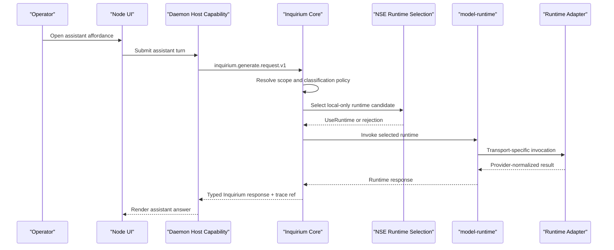

# Proposal 066: Inquirium Assistant Channel

Based on:
- `doc/project/40-proposals/047-classification-label-propagation.md`
- `doc/project/40-proposals/060-messaging-middleware.md`
- `doc/project/40-proposals/063-inquirium-model-inquiry-organ.md`
- `doc/project/40-proposals/064-inquirium-implementation-recommendations.md`
- `doc/project/40-proposals/065-local-relationship-layer.md`
- `doc/project/60-solutions/019-middleware/019-middleware.md`
- `doc/normative/50-constitutional-ops/en/UNIVERSAL-BASIC-COMPUTE.en.md`
- `doc/project/40-proposals/057-user-and-operator-notifications.md`

Promoted to:

- `doc/project/60-solutions/045-inquirium-assistant-channel/045-inquirium-assistant-channel.md`

## Status

`promoted`

## Date

2026-06-03

## Executive Summary

Orbiplex should expose the default AI assistant as an **Assistant Channel**
backed by Inquirium, not as a system contact in the Local Relationship Layer.
The assistant may look contact-like in the user interface, but this is only a
presentation affordance. It is not a nym, not a relationship counterparty, not a
messaging peer, and not a route through INAC.

The proposed rule is:

```text
The assistant is a UI affordance for local model inquiry.
Inquirium owns the invocation channel.
Messaging and Local Relationship remain uninvolved.
```

The first implementation slice should be deliberately narrow: an advise-only,
local-only assistant surface that reads no node data except its own inquiry
session transcript. Later phases may add operator-granted context assembly,
classification-aware model selection, and a read-only observability feed over
Inquirium decision traces. Agentic effects remain opt-in, capability-gated, and
outside the MVP.

## Context and Problem Statement

Node UI is expected to grow a contact rail and conversation-style surfaces. It
is tempting to put the default AI assistant into that rail as "just another
contact". That would be the wrong ontology.

A real contact in Orbiplex participates in the relationship and messaging
strata: it may have pairwise continuity, nym continuity, trust posture,
capability passports, routing subjects, messaging policy gates, and transport
routes. The default assistant has none of those properties. It is a local organ
for invoking model-backed inquiry through Inquirium.

Treating the assistant as a contact would force false data into the Local
Relationship Layer and create special cases in Messaging:

- a fake nym or fake peer identity for a non-peer;
- special routing such as "if recipient is assistant, bypass Messaging";
- relationship records that do not represent a human or remote actor;
- contact deletion semantics that would accidentally conflict with inquiry
  transcript retention;
- policy confusion between counterparty trust and local model invocation scope.

The current implementation direction supports a cleaner split. Inquirium is
accepted as the node organ for model-backed inquiry. `model-runtime` exists as
its execution substrate. Messaging requires routing subjects, contact policy,
and INAC delivery. Local Relationship owns personal relationship classes and
pairwise continuity. The assistant belongs to none of those relationship or
messaging surfaces; it belongs to Inquirium.

## Current Implementation Evidence

As of 2026-06-03, the following facts are relevant:

- Proposal 063 defines Inquirium as the model inquiry organ.
- Proposal 064 defines Inquirium implementation guidance, including runtime
  adapters, model-runtime substrate, leases, artifacts, conformance, and
  operation contracts.
- `node:model-runtime` already has operation vocabulary for `generate`,
  `embed`, `batch_embed`, and related model operations.
- `node:model-runtime` already has explicit embedding DTOs following the
  `inquirium.embed.*` and `inquirium.batch-embed.*` schema pattern.
- `node:inquirium-core` owns `inquirium.generate.request.v1`,
  `inquirium.generate.response.v1`, and the first
  `inquirium.assistant.turn.{request,response}.v1` DTOs.
- `node:daemon/model_runtime_host.rs` and the model-runtime host path provide
  selected runtime invocation machinery, including the host capability surfaces
  `inquirium.generate`, `inquirium.assistant.turn`, and the local-only
  `inquirium.assistant.activity.feed`.
- The current assistant implementation writes a local transcript fallback stream
  and metadata-only `daemon/inquirium-assistant-turn-trace.v1` records to
  `trace/inquirium-assistant-turns`; trace/feed records carry turn and
  participant audit keys but do not carry prompt, response, or transcript refs.
- `node:node-ui` can synthesize rail entries at render time; a pinned assistant
  section does not require persistence in the relationship store.
- Messaging middleware is not the correct route for the assistant, because it
  is designed for peer message delivery with relationship and transport gates.

These are implementation facts, not guarantees that the UI affordance,
Memarium-backed transcript implementation, baseline-assistant conformance, or
agentic effect surface is complete.

## Proposed Model / Decision

### Decision 1: The Assistant Is A Quasi-Contact Affordance

The UI may render the assistant in a rail or conversation list, but this is a
view composition choice only. It must not create a durable contact-like record.

The following concepts stay separate:

| Concept | Owner | Persistence | Meaning |
| --- | --- | --- | --- |
| Assistant rail affordance | Node UI | None, unless user UI preferences pin or hide it | Contact-like render entry that opens the assistant surface. |
| Inquiry session | Inquirium | Inquirium retention policy | Actual assistant conversation transcript and invocation context. |
| Observability feed | Inquirium trace read projection | Existing trace/decision records | Read-only view of model-assisted decisions and host policy outcomes. |
| Contact | Local Relationship | Relationship store/vault projection | Human or peer relationship state, never the assistant. |
| Message thread | Messaging middleware | Messaging storage | Peer communication, never the assistant channel. |

Litmus test:

```text
If the assistant rail entry is removed, what disappears?
Only the render affordance disappears.
No contact, relationship member, messaging thread, nym, or routing subject is deleted.
```

If an implementation needs an `assistant-channel.v1` record beside
`local-contact.v1`, it has crossed the boundary and should be rejected.

Each concept has a distinct **home**, never a shared store: the rail affordance →
Node UI preferences (per profile/surface), **never** the relationship store; the
inquiry session → `InquiryTranscriptStore` (Memarium default, Decision 9); the
activity feed → the `trace/inquirium-assistant-turns` stream + a projection
(Decision 10). The litmus extends to independence of operations: hide/pin must not
erase the inquiry transcript, and deleting a conversation must not clear UI
preferences — the two are separate stores.

**Vocabulary lock.** The terms are fixed at four — *affordance*, *inquiry session*,
*transcript*, *activity feed* — plus *contact* and *message thread* as the things
the assistant is explicitly **not**. No fifth concept (no "assistant-channel-record")
is introduced.

### Decision 2: Inquirium Owns The Invocation Channel

Assistant turns are Inquirium operations. The UI asks the host to perform a
bounded model inquiry. The host applies Inquirium policy, selects a runtime,
invokes `model-runtime`, records trace/provenance, and returns a typed outcome.

The assistant channel must not:

- send through Messaging;
- read Local Relationship state directly;
- read Memarium directly;
- bypass classification, declassification, or egress policy;
- choose a remote runtime when local-only policy was requested;
- turn model output into authority without a host-side decision.

### Decision 3: Start With Advise-Only, Local-Only Scope

The MVP assistant should be an isolated local voice:

- local-only runtime candidates;
- `TrustMode::StrictLocal`;
- no relationship context;
- no Memarium context;
- no messaging thread context;
- no tool/action effects;
- no remote fallback;
- no hidden context assembly.

If no healthy local candidate exists, the assistant channel returns a typed
`handler-unavailable` or equivalent denial. It must not silently fall back to a
remote model.

### Decision 4: Context Access Requires Operator Grants And Existing Gates

A later "assistant with access" mode may exist, but it must use the same
boundary contracts as other consumers.

Allowed context sources must be resolved through host-owned gates:

- relationship-derived context through relationship policy decisions, not raw
  sealed relationship state;
- Memarium-derived context through classification-aware read/declassification
  contracts, not raw store access;
- messaging-derived context through messaging gates, not direct mailbox reads;
- artifact or dataset context through explicit leases.

JSON-e Flow may describe what context should be assembled. The host resolves
that declarative request through the existing boundary contracts. This preserves
the separation between "what context is requested" and "how protected sources
are accessed".

### Decision 5: Classification Travels With Every Context Element

Every context item supplied to Inquirium carries its classification label.
Unknown or missing classification is treated as the most restrictive class.

Inquirium applies model acceptance policy per element:

```text
if element classification <= model acceptance:
    include
else if element can be declassified under policy:
    declassify, include the declassified projection
else if policy is lenient:
    drop with trace
else:
    fail closed
```

Locality is a consequence of acceptance policy. A remote model normally has a
low acceptance ceiling. A local model may accept higher tiers if the operator
configured that policy. This avoids a separate brittle rule such as "remote is
always forbidden" while still preserving fail-closed information flow.

Classification is an **ambient label**, not an input consumed only at the final
gate. Carrying it to Inquirium opens the door to a late decision and makes the
data class visible to every component that wants to use it; it does not relocate
the decision to the end. Earlier layers (context assembly, middleware,
supervisor) **may and preferentially should** narrow, redact, or route on that
label before data reaches Inquirium (data minimization — do not carry context
deep into the stack only to drop it later). Inquirium and its adapter are the
**authoritative fail-closed backstop, not the sole gate**. All layer decisions
are **strictly narrowing**: a layer may only further restrict (drop, redact,
lower egress), never widen a prior restriction; the effective outcome is the
meet (most restrictive) across layers, using the classification lattice.

### Decision 6: `ClassKeyed<T>` Is The Configuration Counterpart Of `Classified<T>`

The assistant channel needs classification-dependent configuration without
turning configuration into a backdoor. The reusable idiom is:

```text
Classified<T> = data with classification
ClassKeyed<T> = configuration selected by classification
```

Example shape:

```text
feature {
  default: T
  by_class {
    public: T
    community: T
    personal: T
  }
}

resolve(classification) -> T
```

Useful axes include prompt template, retention profile, redaction profile,
trace level, KV/cache namespace, adapter parameters, and model acceptance
policy.

Guardrails:

- missing class config uses the most restrictive configured fallback;
- safety-sensitive axes must be monotonic as classification becomes more
  restrictive;
- prompt-per-class is behavior shaping, not enforcement;
- every resolved variant should be traceable.

**Home (resolves Open Question 6).** The generic *mechanism* — ordered-axis
ranking plus shared resolution for closed ranked axes — lives in the
`classification` crate, beside `Classified<T>` and the lattice. The concrete
`ClassKeyed<T>` and `ModeKeyed<T>` DTOs stay in `inquirium-core`, where their
domain meaning is owned. Rationale: the reusable part is the tiny, pure
fallback resolver; the class-keyed schemas and monotonicity rules remain
domain-specific. This is not premature generalization: it places the common
mechanic where the original classification axis lives, with Inquirium as its
**first** consumer. Other consumers adopt the mechanism **when touched**, not by
anticipation. The class-keyed config *schemas* (prompt, KV, retention,
redaction, adapter params) stay in `inquirium-core`.

`ModeKeyed<T>` (Decision 8.4) remains a **separate named idiom** but shares the
same resolution **mechanism**: both are an ordered-axis keyed config with
most-restrictive/most-severe fallback and monotonicity. Share the mechanism, not a
type — a free function or `LatticeKeyedResolver` trait that both call, **not** a
generic `LatticeKeyed<Axis, T>` type. Two consumers prove a shared *mechanism*, not
a shared *type*; a generic "any lattice + any config" type would invite a fifth and
sixth axis (`TrustKeyed`, `TimeKeyed`, …) creeping into a safety primitive. The
shared `resolve()` is implemented once; `ClassKeyed` and `ModeKeyed` stay distinct
concrete types.

Implementation ownership: the shared ordered-axis resolver mechanism lives in the
`classification` crate as a tiny pure primitive (for example a free function or
trait over ranked keys). `inquirium-core` owns the concrete `ClassKeyed<T>` and
`ModeKeyed<T>` DTOs and calls that mechanism. "Most restrictive" is axis-specific: for
classification it means `Public < Community < Personal`; for assistant mode it
means `Commons < Support < Crisis`. The shared mechanism is the ordered fallback
and monotone validation pattern, not a claim that the two axes have the same
domain semantics. If no value exists on any configured tier, resolution fails
closed with a typed configuration error rather than panicking or inventing a
default.

Monotonicity is enforced both when keyed configuration is accepted and when it is
resolved for use. A stale or hand-edited config file must not bypass the guard
merely because validation happened earlier in the lifecycle.

### Decision 7: Observability Is A Read Projection, Not A Chat Transcript

The assistant surface may later host an "Activity" view for model-assisted and
policy-assisted decisions: runtime selection, automatic redactions,
classification include/declassify/drop decisions, `ClassKeyed` resolution, and
related Inquirium trace events.

This feed is not a new store and not part of the chat transcript. It is a
read-only projection over existing trace/decision records.

Guardrails:

- separate "Conversation" and "Activity" views;
- label provenance honestly: host policy decided, model proposed, model
  produced, operator approved;
- keep the feed local-only and operator-facing;
- never feed observability records back into the model prompt by default;
- never publish assistant transcript, activity, or assistant-turn trace records
  into Agora, Seed Directory, Messaging, swarm gossip, or other federation paths
  by default; any export requires a later explicit publication contract;
- escalation from feed item to action belongs to the later agentic phase.

### Decision 8: Epistemic Posture And Dignity

The previous decisions secure the assistant *structurally* (ontology, data flow,
egress). This decision secures it *epistemically*. The ontological basis treats
intellect as a tool that becomes harmful when it turns into "the only adviser, a
carrier of prestige, or an identity", and the vision treats epistemic hygiene,
minimal stimulus, sovereignty, and a universal minimum as behavioral contract.
The assistant must therefore be a **non-oracular voice**, not a seat of knowing.

These properties are expressed as contract fields and config, so they are
testable, not aspirational.

**8.1 Output is evidence, framed as a bounded claim.** The generate response
carries an `epistemic` block. Output is never marked authoritative or
auto-actionable.

```json
"epistemic": {
  "stance": "advisory",            // advisory | hypothesis   (never "authoritative")
  "confidence": "unstated",        // unstated | low | medium | high
  "grounded_in": [],               // refs to context elements / trace; [] = model-only
  "caveats": []
}
```

Invariant: no request flag or response field may promote output to
`authoritative` or to a direct effect. Action remains Decision 3 / Phase 3 only.

**This is a schema gate, not a convention.** The `stance` enum has only
`{advisory, hypothesis}` — `authoritative` is structurally unrepresentable, not
merely discouraged. `generate.response.v1` has **no** `effects` field (effects
belong to a separate Phase-3 `inquirium.act.response.v1`, never a field here);
`plurality` carries a JSON-Schema `default: "preserve"`. Negative fixtures are part
of the contract: a payload with `stance: "authoritative"`, or any `effects` on a
generate response, is rejected by the schema gate.

**8.2 Plurality preserved, not collapsed.** Request policy gains
`plurality: preserve | collapse` (default `preserve`). Where the model has
multiple viable answers, the assistant surfaces them rather than imposing
premature closure — the epistemic analogue of "deliberate postponement of
decisions" and multi-paradigmatic knowing.

**8.3 Verification/correction loop, operator-driven.** A turn's claim can be
marked by the operator through an explicit feedback contract
`inquirium.inquiry-feedback.v1` (`verified | refuted | amended` + note). Feedback
targets a **single `inquiry-result.v1`**, not a whole session, and is itself an
append-only fact (facts over overwrite) — recorded with the inquiry session. No
hidden auto-learning; correction is an explicit operator act. This realizes "truth
as a feedback loop: prediction → outcome → update".

Feedback projections use latest-valid-fact-wins for display while preserving the
full append-only history. A feedback fact may become a training candidate only
when it carries an explicit training-candidate flag and a separate operator grant;
unknown training-related fields are rejected at the schema boundary rather than
silently interpreted.

**8.4 Mode-aware rigor (`ModeKeyed<T>`).** `ModeKeyed<T>` is a **separate idiom**
from `ClassKeyed<T>`, not a merged key: the two axes are orthogonal —
classification is *what the data is*, mode is *which regime the node operates in*.
A given config may be `ClassKeyed`, `ModeKeyed`, or both, resolved independently.
Modes follow the vision work classes: `commons` (normal), `crisis`
(`disaster`/`war`/`blackout`), `support` (`shelter`/`food`/`legal`/`medical`).
For the assistant rigor axis, `support` is treated as stricter than `commons`,
and `crisis` as stricter than `support`; deployments that need a different
ordering must define a new mode policy rather than silently reordering this one.
Rigor is **monotone in mode severity**: a more severe mode may only tighten (more
verification, stricter egress, lower default `confidence` assertion), never
loosen. `resolve(mode)` shares the most-restrictive-fallback mechanism and
monotonicity guard of `ClassKeyed`, while the two axes remain semantically
separate.

**8.5 Baseline assistant as universal minimum.** The Phase 1 local-only profile
is declared a **non-withdrawable baseline** (`baseline-assistant`): it must
function offline and without economic gating, as part of communication and
orientation dignity. Enhanced/remote behavior is an additive tier, never a
precondition for the baseline. This grounds "local-only" in sovereignty and the
universal minimum, not only in safety. The non-withdrawable guarantee is anchored
in `doc/normative/50-constitutional-ops/.../UNIVERSAL-BASIC-COMPUTE`: the
`baseline-assistant` is a communication/orientation facet of universal basic
compute, not a parallel notion invented here, and inherits its non-withdrawability
and no-fee-in-the-currency-of-dignity constraints.

`baseline-assistant` is a **capability profile, not a runtime class** — so the
constitutional minimum is never bound to one vendor. `BaselineAssistantProfile`
declares *requirements* (generate with a minimum context window, no tool surface,
local transport only, bounded output) and *guarantees* (no telemetry egress, no
remote fallback), anchored in UBC. A concrete runtime (Ollama, `llama-server`,
LM Studio, a future MLX/edge runtime) is an **instance** that passes a
`BaselineAssistantProfile` conformance suite; the OQ4 first target (Ollama) is the
first conformant instance, not the definition. Inquirium selects `baseline-assistant`
only among conformance-positive runtimes.

Implementation note: when the local provider already exposes an
OpenAI-compatible chat-completions HTTP endpoint, the reference path is direct
`http_local` invocation with the host-owned `openai_chat_completions`
request/response mapping. A Python middleware adapter is not required merely to
proxy loopback HTTP to loopback HTTP; middleware-hosted adapters remain useful
when there is real provider translation, remote egress policy, or simulator
logic to own.

The mapping pair is validated fail-closed. Both `request_mapping.format` and
`response_mapping.format` may be absent only for provider-native passthrough, or
both must be set to the same supported format such as
`openai_chat_completions`. Half-mapped configuration is not a degraded mode; it
is an invalid adapter-instance configuration.

Minimum profile for the first conformance suite:

- `generate` support with at least a 2048-token effective context window;
- local transport only through an explicitly reviewed allowlist: host-local
  in-process/deterministic execution or supervised/unmanaged loopback HTTP; no
  command-stdio or remote HTTP/API candidate in the first baseline suite;
- no tool surface, no MCP bridge, no provider-managed tool execution;
- output capped at 16 KiB before transcript persistence, matching the current
  host-enforced assistant output boundary;
- no telemetry, vendor logging, or network egress beyond the local runtime
  boundary; the runtime candidate and adapter instance must both declare
  `offline_ok`;
- no remote fallback when the local candidate is unavailable.

A runtime is not selectable as `baseline-assistant` by configuration label alone.
The current node environment must have a fresh passing
`BaselineAssistantProfile` conformance report for that runtime candidate. Fresh
means the report is for the current fixture digest, current runtime candidate,
current deployment-controlled `host-class/...` value, and is no older than the
configured baseline TTL (default: seven days). The reference is supplied by the
host configuration, with `host-class/local-node` as the default. A stale or
missing report makes the candidate unavailable for the baseline profile, even
if ordinary non-baseline routing could still consider it.
This does not contradict non-withdrawability: the **profile and right to a local
baseline** are non-withdrawable; a concrete runtime still has to prove that it
currently satisfies the profile.

Hard-MVP node profiles should additionally set a host readiness requirement for
the baseline. In the reference implementation this is the distributor/operator
configuration flag `inquirium.baseline_assistant_required = true`. When enabled,
the node reports not-ready unless at least one `profile/baseline-assistant`
candidate is currently routable with a fresh passing report. Operator status
should expose this as a separate baseline component with states such as
`ready`, `missing`, `registry-error`, `stale-conformance`,
`failed-conformance`, and `unavailable`, plus stable failure reason codes and
the host-owned `run-conformance` action path for each candidate. Readiness
failure causes may be retryable in the health-loop sense: the daemon will
re-evaluate after operator or runtime changes, but `missing` still requires
provisioning a baseline candidate. Deterministic or simulator-backed runtimes
may satisfy CI and smoke profiles, but a user-facing hard-MVP profile should
provision a real local model runtime behind the same conformance gate.

The baseline profile is not an ordinary operator-toggleable config item. Its
definition is deployment/constitutional surface: an operator may disable a
broken runtime candidate, but removing the `baseline-assistant` profile itself
requires the same level of change control as other universal-minimum guarantees.

### 8.5.1 Production Local Model Packaging Profile

The following post-MVP productization decisions are frozen as of 2026-07-20.
They define how a distributor may turn the implemented baseline profile renderer
into a production installation path without changing Inquirium semantics.

1. **Canonical managed runtime.** The production baseline is a supervised
   `llama-server`-class process exposing the existing OpenAI-compatible
   chat-completions contract over loopback HTTP. Ollama remains a supported
   operator-managed compatibility path; it is not the canonical packaged
   runtime.
2. **Apple Silicon companion candidate.** The macOS arm64 profile should evaluate
   an MLX-family server in parallel. The selected implementation must be the
   closest practical match to the `llama-server` operational contract: a
   supervised loopback service, OpenAI-compatible request/response mapping,
   offline operation, no undeclared telemetry, and the same baseline conformance
   gate. MLX-specific provider semantics must not leak into Inquirium. Until that
   candidate passes the shared suite and release gate, `llama-server` remains the
   required baseline on Apple Silicon as well.
3. **Initial platform set.** Production profile v1 targets macOS arm64 with Metal
   and Linux x86_64 with CPU execution. CUDA, ROCm, other architectures, and
   further acceleration profiles are additive release profiles rather than
   assumptions of the baseline contract.
4. **Manifest-driven model delivery.** Model weights are not silently bundled.
   Installation uses an explicit operator-approved download or offline import
   described by a signed package manifest. Each release names one pinned
   reference model profile; the concrete model family, quantization, context
   size, digest, size, resource requirements, source, license, and model-card
   reference are release data, not permanent proposal constants.
5. **Dedicated host-owned asset store.** Runtime and model artifacts live in an
   immutable, content-addressed store under a host-resolved model-storage root.
   The bulk root may be outside the node data directory so an operator can place
   large model assets on a dedicated volume. Store metadata, authority records,
   active-profile state, and recovery journals remain under the node data
   directory; moving bulk bytes must not move the control plane or its source of
   truth. Active profiles and rollback candidates refer to digests. This store is
   separate from middleware modules and from the transport-oriented object
   store; it owns quotas, references, interrupted-stage cleanup, and bounded
   garbage collection.
6. **Explicit update authority.** Discovery of a newer signed manifest may be
   automatic, but installation and activation require an operator decision.
   There is no silent model replacement and no remote fallback. Updates retain
   the previously active verified profile for rollback.
7. **Distributor trust.** Official artifacts require a distributor-signed
   manifest plus verification of every declared digest. The manifest binds the
   runtime, model, platform/backend, license and provenance as one installable
   profile rather than treating independent checksums as a complete trust root.
   Verification reuses the repository's canonical JSON and Ed25519 signature
   profile. Distributor release keys form a dedicated local trust set with key
   identifiers, rotation, and revocation; federation authority is not implicitly
   package-distribution authority.
8. **Operator-owned models.** An operator may import a model outside the
   distributor catalog. The host computes its bounded canonical manifest and
   digest first, then projects a registered operator question through the
   notification surface. Approval creates a detached signature with
   operator-held signing authority over that exact manifest. The signature means
   "approved for this node/profile"; it is not a claim that the model is safe,
   truthful, federation-endorsed, or equivalent to an Orbiplex release. Changed
   bytes or security-relevant metadata require a new approval. Without a usable
   operator signer, the artifact remains staged and unroutable.
9. **Scoped source trust.** The operator may approve a new HTTPS origin or a
   canonical local path root from the same host-owned interaction flow. Durable
   trust is represented by a detached operator signature, scoped to local-model
   provisioning, auditable, revocable, and may be narrower than the origin/root.
   HTTPS redirects are bounded by an explicit domain allowlist; local paths use
   canonical containment and reject symlink escape. Source trust permits fetching
   or importing bytes, but activation still requires digest verification and an
   accepted package manifest.
10. **Backend selection.** The host detects available CPU/Metal support and
    proposes a compatible profile; the operator confirms it before activation.
    Detection does not authorize a download or silently switch the active
    backend.
11. **Atomic lifecycle.** The operator path is `plan -> install -> verify ->
    activate`, with explicit `status`, `rollback`, and `remove` operations.
    Staging and activation are crash-safe; a failed verification cannot alter the
    active profile.
12. **Release gate.** Contract conformance, source and digest verification,
    loopback-only binding, offline guarantees, and negative security tests are
    hard release gates. Performance and resource measurements are operator- and
    NSE-visible diagnostics in v1, not universal correctness thresholds.

The corresponding host-local contract family should distinguish package
manifest, source trust, operator endorsement, installation receipt, and active
profile projection. A signature over a digest-bearing manifest is the authority
boundary; neither a mutable path nor a provider model name is sufficient
identity.

### 8.5.2 Model Storage Root And Native Runtime Layouts

The model-storage root is host-owned deployment configuration, not package
manifest authority. The host resolves exactly one bulk root at startup in this
order:

1. the explicit `inquirium.model_storage.root` configuration value;
2. the fixed `ORBIPLEX_MODEL_ROOT` environment variable;
3. `<data-dir>/storage/inquirium-model-assets`.

The resolved root must be absolute, canonicalized, writable, and bound to the
node's asset-store metadata through a versioned root marker, stable
`storage/root-id`, and one `control-plane/owner-id`. The first profile is
single-owner and single-writer: one `managed/` tree may be governed by exactly
one node data directory and its asset-store registry. A second node or a rebuilt
control plane cannot attach to it implicitly. It must either use a distinct root
or enter an explicit operator-authorized recovery/rebind flow with garbage
collection disabled until the authoritative reference projection has been
rebuilt and every retained object re-verified. This prevents one node's local
pin set from deleting bytes still referenced by another node.

The control registry generates the owner identity once and persists it under
`data-dir`; it is deliberately not an operator-configurable identifier. Trusted
reopen and migration code may carry the persisted identity as an exact
expectation, but a fresh registry cannot claim an existing root by copying its
marker value into configuration. Loss of that registry enters the recovery
ceremony above.

If an explicitly configured or environment-selected root is missing,
unavailable, locked by another owner, or no longer matches its recorded
identity, startup and model installation fail closed. The host must not silently
fall back to the default under `data-dir`, because doing so could fill the wrong
disk or make an active profile appear to have lost its assets. The canonical
model root, rather than `data-dir`, is the containment and anti-symlink anchor
for `managed/`, `engines/`, and `workspaces/`; the metadata database remains
separately contained under canonical `data-dir`.

The root separates three ownership and lifecycle domains:

```text
<model-root>/
  .orbiplex-model-root.v1
  managed/
    objects/sha256/
    staging/
  engines/
    <runtime-family>/
      host/
        models/
        runtimes/
        cache/
      shared/
        models/
        runtimes/
        cache/
  workspaces/
    fine-tuning/
    conversions/
    experiments/
```

`managed/` is the immutable Orbiplex content-addressed store and is the only
tree governed by its pinning and garbage-collection rules. It is not an
interoperability write surface. Host-exclusive ownership and restrictive
permissions are part of its integrity contract; external read-only access may
be permitted, but external read-write access is unsupported and invalidates the
store's immutability guarantee. The host must refuse use when permissions,
ownership, root identity, or object verification no longer support that
assumption.

`engines/` preserves runtime-native directory layouts where interoperability
with external tools is valuable. The namespace is a runtime or engine family,
not a remote provider: remote API providers do not own local model bytes, while
distinct local engines may require incompatible cache and file layouts.
Within each engine family, `host/` is the host-owned launch/runtime view and
`shared/` is the explicitly mutable interoperability view. The distinct
`host/` name avoids implying that engine materializations participate in the
pinning and garbage-collection semantics of root-level `managed/` CAS.
`workspaces/` contains mutable operator experiments and training/conversion
outputs. These two trees are the supported external read-write surfaces and are
therefore treated as untrusted mutable inputs. Their outputs become installable
only after explicit import, digesting, manifest construction, and the normal
trust and endorsement path. Mutable workspace or engine-cache paths are never
model identity.

An engine tree is a materialized view over admitted assets, not an alternative
authority store. Materialization should prefer reflink/copy-on-write where the
filesystem supports it and otherwise use a verified copy. It must not expose
immutable CAS objects through writable hard links or mutable symlinks. Existing
native caches may be inspected and explicitly imported, but the host must not
silently adopt arbitrary pre-existing bytes as verified assets. A supervised
runtime may load only from the host-exclusive CAS or from a host-owned immutable
launch materialization whose digest is re-verified immediately before use.
Writable shared engine paths cannot use a materialize-once-trust-forever rule;
they must be copied and verified into a host-owned launch view before admission.

Garbage collection of the managed tree must not recursively delete engine
caches or operator workspaces; each domain has a separate quota and lifecycle
policy. Logical quotas are admission ceilings, not physical-space reservations
on a volume that other software can consume. Every stage/write path must handle
`ENOSPC` and short writes as an ordinary typed failure: partial stage data is
never committed, and bounded recovery removes or resumes interrupted stages
without changing active-profile state. Profile v1 requires `managed/staging/`
and `managed/objects/` to reside on the same filesystem so final publication is
an atomic rename; a layout that cannot prove this property is rejected.

Each supported runtime family may declare a host-maintained, versioned storage
layout that maps semantic directories to a closed allowlist of native environment
variables, for example a model directory expected by a supervised local server.
These variables are rendered only into that adapter/runtime process environment.
Package manifests cannot inject arbitrary environment names or values, and the
daemon's global process environment is never mutated. A runtime-family layout
must define containment, ownership, migration, and cleanup behavior before the
host may materialize assets into it.

Changing the model root uses an explicit, journaled migration state machine.
The old root remains authoritative while objects are copied and verified under
a provisional destination marker. Only after every required digest and pin is
present may one atomic control-plane transaction advance the root generation and
activate the destination owner binding. A crash before that commit resumes or
rolls back the incomplete destination while the old root stays valid; a crash
after it treats the new root as authoritative. The host must never publish two
simultaneously active owner markers. Loss of the old root or `data-dir` is a
separate recovery ceremony, not a successful migration inferred from whichever
directory remains accessible.

Alternatives not selected for v1 are Ollama as the canonical managed package,
silently bundled model weights, reuse of middleware-module or transport-object
storage, provider-specific MLX semantics, unattended activation, and universal
performance thresholds. They remain possible distributor or later-profile
choices only where they preserve the authority, conformance, and lifecycle
boundaries above.

**8.6 Non-dopamine UX (schema, not convention).** The assistant surface must not
use engagement-maximizing patterns: no unsolicited initiation, no streak/nudge/
re-open mechanics, advisory framing, and a clear separation of "the assistant
suggests" from "I decided". These are encoded in the assistant UI-preferences
schema — e.g. `streak_count` and `nudge_after` are forbidden fields, `initiation`
is an enum whose only value is `never` — and asserted by a CI test that the
preferences conform. Schema over convention, so the invariant cannot quietly drift.
The forbidden-pattern list is intentionally non-exhaustive and should also reject
equivalent fields such as leaderboards, achievements, attention scores, and
"things waiting for you" counters on the assistant surface. This gate is scoped
to the assistant UI; it does not define every possible notification policy for
other surfaces.

Guardrails:

- output stance is never `authoritative`; promotion to action requires Phase 3
  capability + Protocol Gate;
- `plurality: preserve` is the default for the assistant surface;
- correction is explicit and operator-driven; no silent self-update;
- `ModeKeyed` rigor is monotone in severity, validated like `ClassKeyed`;
- the baseline assistant remains available local-only and unconditionally;
- non-dopamine UI invariants are covered by tests.

### Decision 9: Transcript Storage Contract (resolves Open Question 2)

Inquiry-session persistence is **not** a single store choice. It decomposes into
three layers, each at its proper stratum:

- **Fact (source of truth) → Memarium.** Each turn/result is an append-only
  Memarium fact carrying provenance (`runtime/ref`, `model.binding/ref`,
  `operation/id`), classification, and operator feedback (Decision 8.3). This
  reuses Memarium governance — classification, retention, excision, as-of,
  declassify, custody — instead of reinventing it. Writes go through the existing
  governed path: host capability `memarium.write` op `write_fact`, behind the
  capability/passport gate and space/classification/sealed-payload policy.
- **Blob (bulk/binary) → object-store, referenced from the fact.** Large content
  goes to the artifact/object store; Memarium holds only a
  descriptor/provenance/ref. **`memarium.write` is a governed fact-plane, not a
  high-throughput data plane** — bulk content must not be pushed through it.
- **Index (search + semantic/thematic tagging) → projection.** A read model over
  `memarium:{space}:entries` / `:facts`, rebuildable by replay; never a second
  source of truth.

**Contract, not concrete coupling.** Inquirium depends on an
`InquiryTranscriptStore` trait (append turn/result fact, query, retention, excise;
classification first-class), **not** on Memarium directly. Memarium is the default
implementation via `memarium.write`. Because that path requires `memarium_enabled`
plus a `memarium/write` grant, the `baseline-assistant` (Decision 8.5) on a node
without Memarium uses a **degenerate local implementation** (small local
JSONL/SQLite) behind the same trait. The trait is what makes the universal-minimum
baseline implementable without Memarium.

The degenerate implementation is intentionally small: local, participant-scoped,
non-federating, and limited to the baseline assistant. It must not grow into a
second Memarium or an alternate source of transcript truth. When Memarium later
becomes available, any migration or export is an explicit operator-visible
operation, not an automatic background merge.

Consequence: local fallback facts stay local-only until such an explicit
operator migration or export. The fallback path must not publish transcript facts
to Agora, Messaging, Seed Directory, federation, or any other swarm-visible
surface. This keeps "baseline assistant works without Memarium" separate from
"assistant transcript is a federated fact plane".

**Nomenclature:** transcript facts are `inquirium.inquiry-turn.v1` and
`inquirium.inquiry-result.v1` — *not* `observation` (observation is Sensorium's
domain of perception/contact; Inquirium is the act of asking models).
Completed result facts carry output or a classified content reference. Denied,
unavailable, invalid, and unsafe results may instead be metadata-only terminal
facts with an explicit `outcome`; this records the failed turn without inventing
model content, while a completed metadata-only result remains invalid.

**Scope (resolves Open Question 3): per participant.** Assistant history is scoped
to the **participant** (the accountable identity), not per node, per UI profile,
or per operator-role. This survives device and UI-profile changes (sovereignty),
keeps multiple participants on one node separate (multi-tenant boundary), and maps
onto the participant's Memarium space used for the transcript facts. It stays
**local and accountable** (the owner's own tool, not a pseudonymous activity) and
does not egress, so it creates no external linkability. `workspace` may be an
optional finer sub-partition *within* participant scope later, never the primary
scope.

All assistant session, trace, feedback, and transcript records use the same
canonical `participant/ref` format as caller binding, Memarium participant-space
allocation, and Local Relationship participant ownership. No UI-profile id, local
account label, node id, or operator-role id may replace it as the primary history
scope. The node hosts execution; the participant owns accountable continuity.

This gives the swarm a portable but local rule: assistant state is locally
accountable and does not gossip by default, while participant-controlled state may
move inquiry continuity between nodes where policy allows. Node identity records
where work happened; participant identity records whose assistant continuity it is.

**Retention:** Inquirium declares retention policy (`ClassKeyed`, Decision 6);
Memarium enforces it. This is consistent with Decision 1's "Inquiry session →
Inquirium retention policy": Inquirium owns the policy, Memarium is the governed
store that applies it.

### Decision 10: Assistant Turn Trace Contract (resolves Open Question 5)

Assistant-turn trace is an **operational trace**, not the transcript source of
truth. It records shape, decisions, policy outcomes, and effects without storing
prompt or response content by default.

The durable source of truth is a storage stream:

```text
stream:      trace/inquirium-assistant-turns
record_type: daemon/inquirium-assistant-turn-trace.v1
```

In the current Node storage runtime this stream is backed by the append-only
JSONL commit log, but the contract is the storage stream, not a file path or a
JSONL implementation detail. Inquirium should append trace records through the
host storage boundary. Trace read models, summaries, and UI activity feeds are
projections over that stream.

This follows the existing trace convention:

- `trace/model-invocations` for lower-level model invocation traces;
- `trace/middleware`, `trace/network`, and `trace/agora` for other operational
  traces;
- storage projector behavior that intentionally excludes `trace/*` streams from
  ordinary domain read-store projection.

Memarium remains the store for **domain facts**: transcript turn/result facts,
operator feedback, artifact provenance, or durable "assistant produced artifact
X" records. It is not the default sink for low-level technical trace events. If
an assistant turn needs both, it writes:

- an operational trace record to `trace/inquirium-assistant-turns`;
- transcript/domain facts through `InquiryTranscriptStore` (Memarium by default,
  Decision 9);
- bulk content or binary artifacts to the object store, referenced by facts and
  trace records only through descriptors.

Minimum trace shape:

```json
{
  "trace/schema": "inquirium.assistant-turn-trace.v1",
  "trace/id": "tr:...",
  "turn/id": "turn:...",
  "participant/ref": "participant:did:key:...",
  "operation/id": "op:...",
  "time/started-at": "2026-06-04T10:12:00Z",
  "time/finished-at": "2026-06-04T10:12:04Z",
  "status": "completed",
  "runtime/ref": "runtime/local-assistant",
  "model.binding/ref": "model.binding/local-assistant",
  "input/shape": {
    "message/count": 3,
    "token/approx-input": 812,
    "file/has-any": false,
    "tool/has-any": false
  },
  "output/shape": {
    "token/approx-output": 244,
    "artifact/refs": []
  },
  "policy": {
    "locality": "local_only",
    "trust/mode": "strict_local",
    "trace/level": "metadata_only",
    "persist/prompt": false,
    "persist/response": false,
    "egress/allowed": false
  },
  "decisions": [
    {
      "kind": "runtime-selection",
      "outcome": "use-runtime",
      "reason/code": "local-candidate-selected"
    }
  ],
  "effects": [
    {
      "kind": "memarium.write",
      "status": "ok",
      "target": "memarium:space:personal:kind:inquirium.inquiry-result.v1"
    }
  ],
  "diagnostics": {
    "error/code": null,
    "retry/count": 0
  }
}
```

The invariant is: **trace stores shape, decisions, and consequences; transcript
stores content under retention policy; neither stores prompt content by default**.
Prompt or response content may be persisted only when an explicit trace policy
allows it, and even then through a classified/redacted artifact or transcript
contract rather than incidental debug logging.

**One-way references; trace never absorbs the transcript.** The transcript fact
(`inquirium.inquiry-result.v1`) carries a forward `trace/ref`; the operational
trace record carries `turn/id` and `participant/ref`, **not** a `transcript/ref`.
A join requires the right to read *both* the trace stream and the Memarium space —
so the trace can never read itself into a transcript. `persist/prompt: false` /
`persist/response: false` are **schema defaults**, not adapter conventions.

The trace `policy` block records the **resolved effective policy** used for the
turn, not merely the caller-requested policy. Requested policy may be retained in
the transcript or request audit where classification permits, but trace readers
must be able to explain why the host admitted, narrowed, or denied the turn by
looking at the resolved policy alone. Optional diagnostics are omitted when
absent rather than represented as required `null` fields. Trace records are
bounded; oversize diagnostic values are summarized by digest/ref and never force
prompt or response content into the trace stream.

**Naming convention.** Record type in a storage stream is
`<owner-component>/<artefact>.<vN>` (e.g. `daemon/inquirium-assistant-turn-trace.v1`);
payload schema in the record body is `<organ-domain>.<artefact>.<vN>` (e.g.
`inquirium.assistant-turn-trace.v1`). Each stream's contract names both, explicitly.

**Substrate ready from Phase 1.** Phase 1 emits the full
`daemon/inquirium-assistant-turn-trace.v1` shape to the stream even though the
Activity feed UI (Decision 7 / Phase 2b) is deferred; the feed is later a pure
projection and requires no shape change. Phase 1 done-criteria include: the stream
is writable and replayable, and records associate to `inquiry-result.v1` by
`turn/id` (without content absorption, per the one-way rule above).

### Decision 11: Notification Escalation And Operator Prompts (resolves Open Question 7)

This is wider than crisis detection; crisis is only its sharpest case. The
question is the threshold between three operator-facing levels, distinguished by
what each demands:

1. **Activity feed item** (Decision 7) — "X happened", browsable, no reaction
   required. The default for almost everything: runtime selection, successful
   generation, ordinary context drops, declassify/drop decisions, transcript/fact
   writes, adapter trace, the operator feedback loop.
2. **Notification** — "worth your attention beyond the feed" (P057
   `notification-create.v1`); informational, optional action.
3. **Operator prompt** — a **blocking** host-owned interaction request: the
   workflow cannot proceed until the operator answers (yes/no, select, approve,
   disambiguate). It does not merely inform; it demands a bounded decision.

**Default is feed-only.** Escalation to (2)/(3) happens only for a strong reason;
everything else stays a trace. This is the non-dopamine stance of Decision 8.6 —
escalation must never become an engagement vector. Escalate only when an item:

- **requires an operator decision** before proceeding (→ operator prompt);
- indicates **sustained loss of baseline capability** (baseline assistant
  unavailable, adapter persistently failing, conformance expired);
- exposes a **boundary-risk decision** (e.g. a remote runtime rejected for
  sensitive context — feed-only in normal mode, escalated under debug/security);
- requires **confirmation before egress/publication**;
- is a **crisis/safety candidate** (see below).

**The escalation threshold is `ModeKeyed` (and may be `ClassKeyed`).** What
escalates is a policy keyed by node mode (Decision 8.4), not a fixed list: in
`crisis`/`support` modes more items escalate (rigor rises); a boundary-risk that
is feed-only in `commons` becomes a notification under debug/security/crisis.

**Crisis is a candidate, not a verdict.** Inquirium never declares a crisis as an
authority (Decision 8: model output is evidence, not authority). It emits a
`crisis-candidate` signal for the **host-owned crisis layer**
(`node:daemon/crisis_detectors`), which owns formal crisis status. A
`crisis-candidate` is an input to that layer, not itself a notification. The host
emits notification escalation only after host policy classifies the candidate as
worth operator attention. Inquirium escalates "needs host/operator review", never
"crisis is active".

**The operator prompt is host-owned; the model proposes, the host shapes.** The
model may *propose* a question; it must not render a widget from arbitrary JSON.
Inquirium emits a typed, host-owned interaction request
`inquirium.operator-question.request.v1` (in `inquirium-core`, per OQ1); the host
validates and shapes it before any operator sees it.

```json
{
  "schema": "inquirium.operator-question.request.v1",
  "question/ref": "question/inquirium/op-7f3a/remote-runtime-approval",
  "operation/ref": "operation/inquirium/op-7f3a",
  "recipient/class": "operator",
  "reason/code": "operator-approval-required",
  "escalation/reason": "operator-decision-required",
  "escalation/level": "operator-prompt",
  "prompt": {
    "kind": "single-choice",
    "text": "Use remote runtime for this public-only context?"
  },
  "widget/kind": "single-choice",
  "widget/payload": {
    "options": [
      { "value": "yes", "label": "Yes" },
      { "value": "no", "label": "No" }
    ]
  },
  "default/on-timeout": {
    "answer": "no",
    "reason/code": "timeout-fail-closed"
  },
  "expires/at": "2026-07-06T12:30:00Z",
  "classification": {
    "schema": "classification.v1",
    "source_tier": "Personal",
    "effective_tier": "Personal",
    "provenance": {
      "kind": "local-space",
      "space": "inquirium.operator-question"
    },
    "bound_subjects": {
      "personal_or_community": []
    }
  },
  "subject": {
    "runtime/ref": "...",
    "model.binding/ref": "...",
    "adapter.instance/ref": "..."
  },
  "response": {
    "target/ref": "inquirium.operator-question.respond",
    "method": "POST",
    "idempotency/key": "inquirium:op-7f3a:remote-runtime-approval"
  },
  "provenance": {
    "source/component": "inquirium-core",
    "requested/by": "runtime-selection",
    "reason/code": "remote-runtime-requires-operator-approval"
  }
}
```

The example intentionally does **not** include a `widget.input/schema` field. The
input schema is the registered
`inquirium.operator-question.widget.single-choice.v1` schema owned by
`inquirium-core`; the request carries only `widget/kind` plus typed payload.

Host validation before display: the question is permitted in this workflow;
allowed answers come from an allow-list; the text carries no secrets;
classification permits showing it to the operator; timeout/cancel behavior is
defined (default fail-closed); and the exact operation/lease/capability it
unblocks is named.

**The model picks a widget *kind*, never a schema.** Instead of an arbitrary
`widget.input/schema`, the request carries `widget/kind`:
`single-choice`, `multi-choice`, `confirm`, `free-text-with-allowlist`, etc. plus
a typed payload. Each kind has a **registered input schema in `inquirium-core`**
(e.g. `inquirium.operator-question.widget.single-choice.v1`); a
`RegisteredQuestionKinds` registry is the only source of widget schemas,
extensible only by change to core. Negative fixtures reject: an unknown
`widget/kind`, a `free-text` kind without an `allowlist`, and any raw input schema
supplied in place of a `widget/kind`. This closes the "model returns JSON, host
renders it" path — the structural route to UI prompt-injection (swapping a yes/no
widget for a "type your passphrase" one).

**Prompt lifecycle is explicit.** An operator question moves through:

```text
pending -> answered | timed_out | cancelled | superseded
```

Only `answered` may unblock the operation with operator-provided input. The
request is always the `ask` phase; answers use a separate host route/contract and
the model cannot answer its own prompt. `timed_out`, `cancelled`, and
`superseded` fail closed; only an explicitly declared safe default such as
`default/on-timeout` may unblock, and that default must be conservative for the
operation (normally `no`, `deny`, or `do-not-egress`).

The current node slice detects expiry lazily at the host boundary: registry open
performs recovery sweep, new question submission sweeps existing pending rows,
and a late answer to an expired question first applies the timeout default and
then rejects the late action. It also projects `expires/at` to notification and
action expiry fields so UI/read models can hide stale prompts. A scheduler-backed
periodic sweep remains a host-integration improvement, not a hidden private
timer inside the operator-question registry.

**Interaction contract ≠ notification contract.** The interaction request is the
blocking primitive. The host MAY *derive* a `notification-create.v1` with
`actions[]` (P057 `notification-action.v1`) as the attention vehicle, but the
request stays an interaction contract. Provenance is labeled honestly (Decision
8.2: host-policy vs model-proposed). Notification says "pay attention"; an
operator prompt says "decide — the flow is blocked".

Projection from interaction request to notification is mechanical and host-owned:

| Interaction field | Notification projection |
| --- | --- |
| `question/ref` | `subject/ref` or `body/ref` |
| `operation/ref` | `correlation/id` |
| `prompt.text` | `body/text` |
| `reason/code` | `reason/code` |
| `widget/kind` | `actions[].kind`, after `RegisteredQuestionKinds` resolution |
| `widget/payload` | `actions[].input/schema` projection or host-rendered widget model |
| `response.target/ref` | `actions[].target/ref` |
| `default/on-timeout` | Host-enforced timeout behavior, not a rendered answer |
| `expires/at` | `expires/at` and `actions[].action/expires-at` |

The notification may expose an inline action only as a bounded projection of the
host-owned interaction. It may also point to a dedicated interaction page. In both
cases the interaction record remains the authoritative object that blocks and
unblocks the workflow.

**Phase staging.** Phase 1 escalations are minimal and concrete: baseline
unavailable, repeated local runtime failures, and stale or expired baseline
conformance. "Sustained" means a configured threshold rather than a single
transient failure; a practical default is three consecutive failed attempts or
one expired required conformance report. Policy-approval prompts (remote-runtime
/ egress approval) arrive with Phase 2 context/egress. Action-gating prompts
belong to Phase 3 (agency) and require capability + Protocol Gate; a timeout
there fails closed.

Resolution text:

```text
Activity feed items deserve notification escalation only when they require operator
action, indicate a sustained loss of baseline capability, expose a boundary-risk
decision, require confirmation before egress, or represent a crisis/safety
candidate that must be reviewed by a host-owned crisis/policy layer. Routine
runtime selection, successful generation, normal context drops, and ordinary trace
events remain feed-only. When an item requires a bounded operator answer before the
workflow can proceed, it escalates as a host-owned operator prompt — a typed
question contract (allowed answers, timeout/default, provenance, classification,
the operation it unblocks) — not merely as a notification. The model may propose a
question; the host validates, shapes, and owns the widget contract.
```

### Decision 12: Terminal Context Grants Move To An Audit Archive

Expired and explicitly revoked assistant context grants stop authorizing reads
immediately and leave the active authorization registry through bounded pruning.
Before an active row is removed, the host appends a terminal grant fact to a
durable audit/archive projection. That projection, rather than the active grant
table, is the source for explaining historical context decisions.

The archive record preserves only the bounded authorization provenance needed
for audit: grant ref, participant and session binding, source kind/ref,
classification ceiling, egress acknowledgement binding, issue/expiry/revocation
timestamps, terminal reason, actor, and the digest of the admitted grant request.
It does not copy resolved context content. Archive append and active-row pruning
must be idempotent and crash-recoverable; a failed archive append leaves the
active terminal row in place, while a replay of a completed archive append may
safely finish pruning it.

Pruning runs in bounded batches through a shared maintenance/scheduler boundary.
It must not create an ad hoc unbounded daemon loop. Classification-keyed archive
retention may narrow how long audit facts remain, but it cannot make an expired
or revoked grant active again. Authorization remains fail-closed independently
of maintenance progress.

## Contract Sketch

The assistant MVP needs a generate/chat contract aligned with the already
introduced embedding contracts.

### Request

```json
{
  "schema": "inquirium.generate.request.v1",
  "operation": "generate",
  "turns": [
    {
      "role": "user",
      "content": [{ "type": "text", "text": "Help me think this through." }]
    }
  ],
  "context_assembly": {
    "schema": "inquirium.context-assembly.request.v1",
    "sources": []
  },
  "parameters": {
    "max_tokens": 1024,
    "temperature": 0.2
  },
  "policy": {
    "locality": "local_only",
    "trust_mode": "strict_local",
    "scope": "assistant-session-only",
    "on_context_denied": "fail_closed"
  },
  "metadata": {}
}
```

### Response

```json
{
  "schema": "inquirium.generate.response.v1",
  "operation": "generate",
  "outcome": "completed",
  "output": [
    { "type": "text", "text": "A bounded answer from a selected local runtime." }
  ],
  "runtime/ref": "runtime/local-assistant",
  "model.binding/ref": "model.binding/local-assistant",
  "locality": "local_only",
  "trace/ref": "trace/inquirium-assistant-turn",
  "usage": {},
  "diagnostics": {}
}
```

The DTO is finalized in a new `inquirium-core` crate (resolves Open Question 1),
not in `model-runtime`. `inquirium-core` is the **thin contract crate** for the
Inquirium organ — DTOs, schema ids, policy enums, and the `InquiryTranscriptStore`
/ `ClassKeyed` / `ClassKeyed`-sibling `ModeKeyed` traits — depending only on
`classification` (which puts the classification-aware contract at the organ layer,
not in the substrate `model-runtime`). The existing `inquirium.embed.*` /
`inquirium.batch-embed.*` DTOs should **move into `inquirium-core`** as well, so
the `inquirium.*` vocabulary is not split across crates; `model-runtime` and the
daemon depend on `inquirium-core`. The important properties are:

- operation is explicit;
- runtime selection remains host-owned;
- local-only policy is enforceable;
- context assembly is declarative and default-empty;
- typed denials are first-class outcomes;
- trace references are returned without leaking protected context.

### Assistant Turn Host Capability

The assistant channel itself is exposed as a narrower host capability over the
generate substrate:

```text
POST /v1/host/capabilities/inquirium.assistant.turn
GET /v1/host/capabilities/inquirium.assistant.turn
POST /v1/host/capabilities/inquirium.assistant.activity.feed
POST /v1/host/capabilities/inquirium.assistant.transcript.excise
```

Minimal request:

```json
{
  "schema": "inquirium.assistant.turn.request.v1",
  "session/ref": "assistant-session:local",
  "participant/ref": "participant:did:key:...",
  "turn": {
    "role": "user",
    "content": [{ "type": "text", "text": "Help me think this through." }]
  },
  "parameters": {},
  "policy": {
    "locality": "local_only",
    "trust_mode": "strict_local",
    "scope": "assistant-session-only",
    "on_context_denied": "fail_closed",
    "plurality": "preserve"
  },
  "metadata": {}
}
```

The host assigns `turn/id` when absent, preserves a valid caller-supplied
`turn/id`, maps the request to `inquirium.generate.request.v1` only after
assistant policy validation, persists transcript facts only through the
transcript boundary, and appends a metadata-only trace record to
`trace/inquirium-assistant-turns`. Module callers require explicit
`inference_grants[]` for `inquirium.assistant.turn`; the activity feed is
restricted to local control. Completed assistant output is capped by host policy
before it is written into the transcript; truncation is explicit in diagnostics
and epistemic caveats. Transcript excision is a local-control-only capability
that appends an audit-preserving `session_excised` marker rather than deleting
history.

### Implementation Notes (Phase 1 seam)

Code-grounded guidance verified against the current node, so the contract maps to
one injection point rather than scattered special cases.

**One candidate-filter seam.** Local-only enforcement is a single `retain` over
the candidate list produced by `daemon/src/model_runtime_host.rs::healthy_nse_candidates()`,
before `select-llm-model` chooses and `invoke_selected_runtime` runs. Phase 1:

```rust
candidates.retain(|c| locality_allows(LocalOnly, c));
// Phase 1 proxy: local == transport_kind in {"http_local", "command_stdio"}.
// Authoritative source is the runtime LocalityMode/TrustMode in config; the
// transport_kind proxy is sufficient for Phase 1.
```

**The same seam evolves for Phase 2 — no rewrite.** The predicate changes from
`locality_allows(constraint, c)` to `model_accepts(candidate, context)`: after
per-element redact/declassify/drop, a candidate qualifies when its
`accepts_max_tier` ≥ the tier of every non-droppable context element. Locality
falls out as a consequence (a remote model has a low `accepts_max_tier`). Phase 1
fixes exactly the filtering point Phase 2 enriches, so it does not paint into a
corner.

**Fail-closed:** an empty list after the filter returns `handler-unavailable`;
never a silent switch to remote.

**Confirm before coding:**
- whether `LocalityMode`/`TrustMode` is directly reachable in the
  `healthy_nse_candidates` loop (use it instead of the `transport_kind` proxy);
- the host-capability shape for inquiry — reuse the existing
  `module_capability`/host-capability dispatch, or add a dedicated
  `/v1/host/capabilities/inquirium.generate`;
- whether token `usage` belongs in the Phase 1 response or is deferred.

## Reference Flow



Messaging and Local Relationship do not participate in this flow.

## Phased Implementation

### Phase 1: Advise-Only, Local-Only

Goal: a safe assistant conversation with no node data access.

Tasks:

- add a pinned assistant affordance to the contact rail or adjacent rail
  section;
- add `inquirium.generate.request.v1` and `inquirium.generate.response.v1`;
- add a daemon host capability endpoint used by Node UI;
- bind caller identity to the local operator;
- route through Inquirium and model-runtime with hard
  `LocalOnly + StrictLocal` filtering;
- store transcript as an Inquirium inquiry session, not as a message thread;
- return typed unavailability when no local runtime qualifies.

Done criteria:

- end-to-end assistant conversation works through a local runtime;
- no Messaging dispatch occurs;
- no Local Relationship record is created;
- no Memarium or relationship context is read;
- no remote egress occurs;
- trace shows runtime selection and local-only enforcement.

### Phase 2: Advisor With Granted Context

Goal: allow the assistant to use operator-approved context while preserving
classification and boundary contracts.

Tasks:

- add context assembly through JSON-e Flow;
- resolve sources through existing gates;
- attach `Classification` to every context element;
- add model acceptance config such as `accepts_max_tier`, `accepts`, or
  `requires_declassification_above`;
- implement per-element include/declassify/drop/fail decisions;
- validate dangerous combinations such as remote provider plus high acceptance
  unless explicitly acknowledged by the operator;
- trace source, classification, decision, and egress per element;
- introduce `ClassKeyed<T>` resolution for prompt, retention, trace, redaction,
  and adapter parameters.

Done criteria:

- unknown classification fails closed;
- remote candidates cannot receive protected context unless policy explicitly
  allows it and operator acknowledgement exists;
- context denied by one layer cannot be reintroduced by a lower layer;
- trace explains every context item decision.

### Phase 2b: Observability Feed

Goal: expose model-assisted decisions without mixing them into chat.

Tasks:

- add an "Activity" view beside the assistant conversation;
- project over Inquirium trace/decision records;
- mark provenance for each item;
- keep it read-only, local-only, and operator-facing;
- define which activity items become notifications.

Done criteria:

- activity feed is not stored as transcript;
- feed records are not sent to model prompts by default;
- provenance and classification are visible to the operator.

### Phase 3: Agentic Effects

Goal: allow actions only when explicitly enabled and capability-gated.

These effects are realized through the Agent organ (Proposal 073), which owns the
bounded controller, lifecycle, budget, and spawn/stop semantics. The assistant is
one operator-facing surface that may drive an Agent under explicit capability and
human-in-the-loop; it never becomes an ambient agent of its own.

Tasks:

- define action capabilities and protocol gates;
- require operator custody for relationship, governance, and egress effects;
- require human-in-the-loop approval for sensitive classes;
- allow feed intervention such as approve/revert only through explicit
  capability flows.

Done criteria:

- assistant can propose before acting;
- acting requires explicit authority;
- every effect is auditable and reversible where the domain supports reversal.

## Trade-offs

### Benefits

- avoids false contact ontology;
- keeps Messaging free of local model invocation special cases;
- preserves Local Relationship as a relationship layer, not a UI shortcut
  registry;
- gives the operator a familiar assistant surface without corrupting data
  semantics;
- keeps Inquirium as the single model inquiry boundary;
- supports later richer context access through explicit grants and
  classification-aware policy.

### Costs

- Node UI needs a presentation union or pinned assistant section rather than
  reusing contact records directly;
- Inquirium needs a generate/chat DTO family;
- assistant transcripts need their own retention model;
- context assembly requires careful host-side integration with existing gates;
- classification-aware model acceptance adds policy machinery before remote
  assistant use can be safe.

### Constraints

- the assistant cannot rely on remote fallback in Phase 1;
- missing local runtime means unavailable, not degraded remote behavior;
- model output remains evidence, not authority;
- prompt instructions cannot be the enforcement boundary;
- observability feed and chat transcript must remain separate read models;
- assistant transcript, activity, and trace records do not enter swarm gossip,
  Messaging, Agora, or Seed Directory paths by default.

## Failure Modes and Mitigations

| Failure mode | Risk | Mitigation |
| --- | --- | --- |
| Assistant implemented as a contact | Relationship store pollution and fake peer identity. | Render-only affordance; no contact/channel persistent record. |
| Assistant routed through Messaging | Special-case dispatch and false INAC semantics. | Direct host capability to Inquirium; no messaging-send path. |
| Remote fallback from local-only assistant | Protected local prompts may leave the node. | Hard `LocalOnly + StrictLocal` filter and typed unavailability. |
| Hidden context access | Backdoor reads from relationship, Memarium, or mailbox state. | Default-empty scope and context only through boundary contracts. |
| Classification stripped during context assembly | Egress policy cannot reason about data sensitivity. | `Classified<T>` context elements and fail-closed unknown labels. |
| Non-monotonic class-keyed config | Sensitive classes receive weaker controls than public data. | Monotonicity validation or explicit operator acknowledgement. |
| Observability feed becomes prompt context | Decision traces leak protected facts back into models. | Feed is local-only read projection and not prompt input by default. |
| Model advice becomes action | Accountability shifts from operator to model. | Advise-only Phase 1; later effects require capabilities and Protocol Gate. |
| Assistant becomes the oracle | Intellect turns into "the only adviser"; operator defers their own knowing. | `epistemic.stance` advisory, plurality preserved, output is evidence not authority, non-dopamine UX. |
| Belief instead of verification | Confident output treated as truth without check. | Bounded-claim framing + operator feedback loop (`inquiry-feedback.v1`); intelligence as corrigible prediction. |
| Crisis without raised rigor | High-stakes mode runs with normal egress/verification. | `ModeKeyed` monotone rigor; crisis/support tighten egress and verification. |
| Baseline gated behind economy/network | Assistant unavailable when most needed; dignity charged a fee. | `baseline-assistant` local-only, non-withdrawable; remote is additive only. |
| Fallback transcript store becomes a second Memarium | Two transcript sources of truth and unclear retention/excision. | Fallback is local, participant-scoped, non-federating, baseline-only; migration/export is explicit. |
| Assistant trace becomes swarm signal by accident | Local inquiry leaks into public/federated surfaces. | No default publication to Agora, Seed Directory, Messaging, or gossip; later export needs explicit contract. |
| Model-authored widget schema is rendered directly | UI prompt injection or credential-harvesting widget. | `widget/kind` registry in `inquirium-core`; host derives notification actions and schemas. |

## Open Questions

No unresolved questions remain for this proposal's current contract.

1. ~~Should `inquirium.generate.*` live in `model-runtime` or a future
   `inquirium-core` crate?~~ **Resolved:** `inquirium-core` from the start (thin
   contract crate, deps only `classification`); existing `inquirium.embed.*` move
   there too. See Contract Sketch.
2. ~~What is the exact transcript storage contract for inquiry sessions?~~
   **Resolved in Decision 9:** `InquiryTranscriptStore` trait; fact → Memarium
   (`memarium.write` op `write_fact`), bulk blob → object-store referenced from
   the fact, search/tagging → projection; degenerate local impl when
   `memarium_enabled` is false.
3. ~~Should assistant history be per node, per operator, per workspace, or per
   local UI profile?~~ **Resolved: per participant** (accountable identity),
   mapping onto the participant's Memarium space; `workspace` optional finer
   sub-partition later. See Decision 9.
4. ~~Which local runtime should be the first supported Phase 1 target?~~
   **Resolved:** first supported target is **Ollama** via an `http_local` adapter
   speaking an **OpenAI-compatible chat-completions** endpoint (consistent with the
   `local-ollama` provider already named in `node:nse`). The choice fixes the
   *protocol, not the vendor*: the same adapter generalizes to `llama-server` /
   LM Studio, and `inquirium.generate.*` stays provider-neutral. The
   `baseline-assistant` guarantee (Decision 8.5) is anchored to a
   `llama.cpp`/`llama-server`-class runtime (minimal footprint for constrained
   devices), reachable over the same `http_local` + OpenAI-compatible path. The
   concrete model is catalog/`select-llm-model` configuration, not part of this
   proposal. This records the first landed compatibility target; Decision 8.5.1
   separately makes managed `llama-server` the canonical production package and
   treats Ollama as operator-managed compatibility.
5. ~~What is the minimum useful trace shape for assistant turns without exposing
   prompt content?~~ **Resolved in Decision 10:** operational trace goes to the
   `trace/inquirium-assistant-turns` storage stream with record type
   `daemon/inquirium-assistant-turn-trace.v1`; JSONL is the current physical
   backend, not the contract; Memarium is reserved for transcript/domain facts.
6. ~~Should `ClassKeyed<T>` become a generic reusable config type or stay an
   Inquirium idiom?~~ **Resolved:** the *mechanism* lives in the `classification`
   crate (with `Classified<T>` and the lattice), the *config schemas* stay in
   `inquirium-core`. See Decision 6.
7. ~~What activity feed items deserve notification escalation?~~ **Resolved in
   Decision 11:** feed-only by default; escalate (notification, or a blocking
   host-owned operator prompt) only for operator-decision / sustained-degradation
   / boundary-risk / pre-egress-confirmation / crisis-candidate; threshold is
   `ModeKeyed`. Model proposes a question, host shapes it.
8. ~~What should be the long-term principal source for local-control assistant
   turns on multi-operator hosts?~~ **Resolved:** bind to the authenticated
   local-control session participant when that boundary carries one; until then,
   use the configured sovereign participant, and if none exists use a
   data-dir-scoped `local-control:*` principal. The request body's
   `participant/ref` is not authoritative and may only be retained as requested
   metadata for diagnostics. The current daemon fallback already follows the
   sovereign/data-dir branch; wiring an authenticated local-control session
   participant into host-capability dispatch is the future refinement.
9. ~~What cursor model should the assistant Activity feed expose once local trace
   history becomes large?~~ **Resolved:** reuse the storage/trace cursor
   vocabulary with `limit`, `before/ref`, and newest-first ordering. Phase 1 UI
   may expose only a bounded `limit` selector; cursor pagination should be added
   when older trace navigation becomes a real operator workflow.
10. ~~What change-control level should apply when a hard-MVP profile disables
    `inquirium.baseline_assistant_required`?~~ **Resolved:** disabling the gate
    in hard-MVP distributions is a deployment/change-control event that
    requires the same level of confirmation as other universal-minimum
    guarantees. Ordinary development and CI profiles may remain
    opt-in/configurable.
11. ~~What durable lifecycle should expired or explicitly revoked assistant
    context grants follow after they stop authorizing reads?~~ **Resolved in
    Decision 12:** append a bounded terminal-grant fact to a durable audit/archive
    projection, then prune the active authorization table in bounded,
    crash-recoverable batches. The active table is not the audit source of truth,
    and failed maintenance never restores authorization.

## Next Actions

1. Continue conformance expansion after the landed generate/embed/classify/
   rerank and deterministic image runner slices when audio or live image
   provider contracts gain executable adapters. Summarize/transform reuse the
   hardened generate substrate rather than creating a parallel runner path.
2. Build distributor packaging and real operator installation UX around the
   landed baseline profile renderer; the tool records artifact lifecycle data
   but intentionally does not install binaries or model weights. Follow the
   frozen production packaging profile in Decisions 8.5.1 and 8.5.2 and the
   post-MVP productization tracker below. Resolve the model-storage root before
   adding download or activation effects so large assets never acquire an
   implicit physical location.
3. Keep the `inquirium-core` dependency-direction gate in CI as the vocabulary
   grows across summarize/transform/image and future audio/training contracts.
4. Add broader tests proving no Messaging dispatch, no relationship record
   creation, no Memarium read, and no remote egress in Phase 1.
5. Derive future remote egress acknowledgements from admitted route/provider
   evidence. Explicit model-acceptance ceilings, exact caller acknowledgements,
   protected-source egress grants, revocation, and Decision 12
   archive-before-prune maintenance are already landed.
6. Keep the landed dependency-direction lints in CI as new trace readers and
   operation families are added; transcript reads continue through a separate
   capability rather than Memarium runtime imports.
7. Add richer widget rendering and, only if operator UX requires non-lazy
   timeout surfacing, a shared-scheduler sweep. Cancel/supersede and paired
   notification closure are already implemented.

## Implementation Tracking

Status values:

- `todo` — not started;
- `in-progress` — design or implementation has started;
- `done` — implemented and covered by tests, schema validation, or documented
  operator evidence;
- `deferred` — intentionally postponed.

The earlier root-level `assistant-channel-advisory.md` tracker is mirrored here.
That advisory remains only a working note; this table is the canonical backlog.

| ID | Work item | Status | Done criteria / evidence |
| :--- | :--- | :--- | :--- |
| `assistant-affordance-render-only` | Add assistant as a UI affordance, not a contact record. | `done` | Node UI renders `/admin/inquirium/assistant`, submits only `inquirium.assistant.turn`, reads the metadata-only activity feed, exposes local transcript excision as an explicit operator action, and template tests assert no Local Relationship or Messaging action route is present. |
| `assistant-generate-contract` | Add `inquirium.generate.request/response.v1`. | `done` | DTOs validate operation, turns, local-only policy, typed denials, trace refs, and output shape. |
| `assistant-host-capability` | Add operator-bound host capability endpoint for assistant inquiry. | `done` | `inquirium.assistant.turn` is a host capability; module callers require explicit inference authority; local-control E2E passes. |
| `assistant-local-only-routing` | Route Phase 1 through local-only Inquirium selection. | `done` | Assistant turn maps through local-only/strict-local `inquirium.generate`; healthy local deterministic runtime succeeds and no remote fallback path is used. |
| `assistant-local-runtime-target` | First target: OpenAI-compatible local HTTP over Ollama/`llama.cpp`-class server; baseline anchored to `llama.cpp`-class runtime. | `done` | Daemon coverage proves profile pinning, required conformance, and direct local `http_local` chat-completions with host-owned model binding and no Python proxy. `node/config/examples/60-inquirium-baseline-ollama.json` is the reference catalog; `node/tools/inquirium-baseline-profile.py` renders loopback Ollama or managed `llama-server` configuration, verifies executable/model files, pins managed model digests, provides a non-redirecting loopback doctor, plans an Ollama model pull without executing it by default, performs the pull only under explicit `--execute`, and atomically activates/statuses/deactivates the reviewed profile. Provider-binary packaging remains distributor/operator owned. |
| `inquirium-core-contract-crate` | Create `inquirium-core` (thin contract crate); move `inquirium.embed.*` there; `inquirium.generate.*` lands there. | `done` | `inquirium-core` now owns generate, embed, batch-embed, classify, rerank, assistant-turn, policy, trace, transcript, operator-question, feedback, and rigor DTOs; request DTOs reject unknown fields; direct embed is bounded to 1024 text items, 32 KiB per UTF-8 text item, and 4096 requested dimensions; classify/rerank requests bound text inputs, simple classification label tokens, closed label/candidate sets, normalized confidence/relevance thresholds, duplicate-free outputs, request/response pair invariants, and `top_k`/`top_n` ceilings; `model-runtime` re-exports the embedding DTOs only for runtime-facing compatibility. |
| `assistant-transcript-store-contract` | Define `InquiryTranscriptStore` trait (append fact, query, retention, excise; classification first-class). | `done` | `inquirium-core` exposes the transcript trait and fact/receipt/query DTOs with classification fields and principal-scoped query/excision shape. Completed result facts require output or `content/ref`; denied, unavailable, invalid, and unsafe results use explicit metadata-only terminal facts so refusal paths remain persistable without fabricated content. |
| `assistant-history-per-participant` | Scope assistant history to the participant. | `done` | Daemon derives principal/participant from the authenticated host boundary; fallback stream refs, transcript projection/search, feedback lookup, and context grants are participant-scoped, while request-body `participant/ref` is not authority. Memarium facts carry principal/transcript refs and classification-derived spaces. Local-control export/import uses a canonical Ed25519 `participant:did:key:` identity, a bounded `inquirium.assistant.transcript.bundle.v1` artifact with canonical digest, exact participant binding, durable Memarium writes, and idempotent projection import; local-control fallback identities cannot export. |
| `assistant-transcript-memarium-impl` | Memarium-default impl via `memarium.write` op `write_fact`. | `done` | Daemon transcript writes first try host-owned `memarium.write` facts (`inquirium.inquiry-turn.v1`, `inquirium.inquiry-result.v1`, and audit excision markers) with classification-derived space mapping, provenance fields, tags, and idempotency keys; the local non-federating stream remains the bounded fallback/read-index when Memarium is disabled or rejects the write. |
| `assistant-transcript-baseline-fallback` | Degenerate local transcript store when `memarium_enabled` is false. | `done` | Daemon implements the `InquiryTranscriptStore` boundary with a local non-federating transcript stream keyed by host principal and session, including query and local-control-only metadata excision markers; it has no automatic Agora/Messaging/Seed Directory/federation publication or background merge path. Migration is explicit through the canonical participant-bound transcript bundle; import persists through Memarium before joining the local projection and never gossips or publishes the bundle. |
| `assistant-transcript-blob-ref` | Bulk/binary content to object-store; only descriptor/provenance/ref in Memarium. | `done` | Transcript facts above the inline threshold are written to the daemon object store and replaced by a digest/size/content-type descriptor before Memarium/local projection. Reads for idempotent replay verify and hydrate the object; descriptor binding mismatches fail closed. |
| `assistant-transcript-projection` | Search + semantic/thematic tagging as a projection over Memarium streams. | `done` | Daemon owns a participant-scoped SQLite read model with bounded full-text substring and exact-tag filters, content-ref visibility, excision projection, and local-control search capability. It derives stable classification/runtime/model-binding/outcome tags and admits bounded explicit `semantic/tags` from the transcript plan. `inquirium.assistant.transcript.rebuild` performs bounded participant-filtered Memarium replay with atomic replacement; bundle import is idempotent and conflict-detecting. Embedding-derived topic generation may be added by a future projection worker, but is not a prerequisite and does not turn Inquirium into an embedding store. |
| `assistant-transcript-retention` | Inquirium declares retention; Memarium enforces. | `done` | `AssistantRetentionPolicy` is class-keyed in `inquirium-core`; transcript planning resolves it against the effective classification before persistence, omits facts when retention is disabled, and stamps the resolved tier and decision into retained facts. The Memarium-facing transcript store rejects ordinary facts without that decision or with `transcript=false`, while excision remains an explicit audit fact. This contract version expresses retention as persist/do-not-persist; temporal TTLs require a future policy field rather than an implicit daemon constant. |
| `assistant-turn-trace-stream` | Add operational assistant-turn trace stream. | `done` | Daemon appends `daemon/inquirium-assistant-turn-trace.v1` records to `trace/inquirium-assistant-turns`; test proves the trace/feed omit prompt, response, and transcript refs. |
| `assistant-default-empty-scope` | Keep Phase 1 context scope empty. | `done` | Assistant context is empty by default and supplied context fails closed unless explicitly class-accepted. |
| `assistant-local-only-e2e-gate` | Add Phase 1 end-to-end guard for the isolated assistant surface. | `done` | Daemon E2E verifies a local deterministic runtime assistant turn, transcript persistence, metadata-only trace, read-only feed, and local transcript excision marker. |
| `assistant-context-assembly` | Add operator-granted context assembly for Phase 2. | `done` | `inquirium.context-assembly.request.v1` is carried by assistant/generate requests. Daemon resolves operator-inline plus host-owned Relationship, Memarium, Query, Messaging, Artifact, and Dataset sources into bounded context before invocation; protected source specs come from the grant registry, not request metadata. Unknown, unavailable, oversized, or over-classification sources fail closed unless the request explicitly chooses `drop_with_trace`. |
| `assistant-context-source-grants` | Require explicit operator grants per context source and session. | `done` | `inquirium.context-grant.issue.request.v1` and local-control issue/revoke capabilities persist grants in SQLite, bind them to the host-derived participant, session, source kind/ref, classification ceiling, expiry, and exact egress acknowledgement, reject caller-declared participant authority, and make revoke idempotent and participant-bound. Richer approval UI is tracked separately from grant authority. |
| `assistant-context-grant-retention` | Bound the active context-grant registry without erasing authorization provenance. | `done` | The versioned v2 registry migrates v1 rows, appends bounded terminal facts without source content, and removes active rows in the same transaction. Startup and issue paths perform bounded lazy maintenance; active Replay Scheduler instances also run the bounded maintenance job. Archived refs cannot be reissued, expiry wins over late revoke, and authorization remains fail-closed independently of maintenance progress. |
| `assistant-model-acceptance-policy` | Add classification-aware model acceptance policy. | `done` | `ContextAcceptancePolicy` evaluates class-keyed include/drop/fail-closed decisions after assembly. An explicit remote turn must use `remote_allowed + remote_capable` and carry `AssistantRemoteAcceptancePolicy` with `accepts/max-tier`; the user turn and every included context item are checked against that ceiling, while missing classification remains Personal. The strict-local baseline remains the default and carries no remote policy. |
| `assistant-model-egress-ack` | Validate high-sensitivity model acceptance and remote egress. | `done` | Remote assistant turns require an explicit `egress/ack-ref` and are local-control-only in this slice; module callers are denied until a module-scoped egress grant exists. Protected context must be resolved through `context_assembly`, where the durable participant/session/source grant must authorize egress and match the exact acknowledgement. Context traces record the effective tier, model ceiling, and acknowledgement ref; mismatches fail closed and can trigger host boundary-risk escalation. |
| `assistant-context-decision-tracing` | Trace each context element's policy decision. | `done` | Assistant trace and transcript facts carry prompt-free context decision records with `context/ref`, source metadata, grant ref, effective tier, and include/drop/fail decision; model-egress enrichment remains later work. |
| `class-keyed-mechanism-in-classification` | Put the shared ordered-axis resolve mechanism in the `classification` crate, beside `Classified<T>`. | `done` | `classification` owns `OrderedAxisRank`, `OrderedAxisKey`, `resolve_ordered_axis`, the shared three-value monotonicity predicate, and the full classification no-broadening relation over effective tier, bound subjects, and quarantine. `inquirium-core` keeps the concrete `ClassKeyed<T>` and `ModeKeyed<T>` DTOs and domain-specific error messages while using those shared mechanics for class- and mode-keyed escalation/rigor validation. Unit tests cover resolver, monotonic/non-monotonic axes, subject-set broadening, and quarantine preservation. |
| `assistant-class-keyed-config` | Inquirium class-keyed config schemas in `inquirium-core` (Inquirium as first consumer). | `done` | `ClassKeyed<T>` is present in `inquirium-core` and used for retention/context policy plus the class axis of assistant escalation over the shared `classification` ordered-axis resolver. The per-classification prompt template named here is realized through `PromptLayer.class/key` in the host-owned `PromptAssemblyPolicy` (P064, *Configurable Prompt Assembly Policy* / tracker `inq-prompt-assembly-policy`), so the assistant does not grow a second prompt-shaping path. Escalation composes this class axis under `ModeKeyed` and validates that stricter modes and more sensitive classes cannot lower the floor. |
| `assistant-observability-feed` | Add optional Activity feed over Inquirium traces. | `done` | `inquirium.assistant.activity.feed` returns metadata-only assistant trace items; module callers are denied, Node UI has a bounded limit selector, and local-control test covers the path. |
| `assistant-no-swarm-gossip` | Keep assistant transcript/activity/trace local by default. | `done` | Assistant transcript, trace, and feed are local storage/control surfaces only; no Agora, Seed Directory, Messaging, or swarm publication path is wired. |
| `assistant-principal-boundary` | Bind assistant audit and transcript namespace to host-authenticated principal, not request body. | `done` | Daemon derives `principal/ref` from the caller/module or configured local operator, scopes transcript refs by `(principal, session)`, and records request-body participant only as non-authoritative metadata. |
| `assistant-turn-idempotency` | Add idempotency for `inquirium.assistant.turn`. | `done` | `AssistantTurnRequest` accepts `idempotency/key`; daemon replays the prior principal/session-scoped result and records duplicate traces without appending duplicate transcript facts. |
| `assistant-output-boundary` | Cap assistant response output before transcript persistence. | `done` | `node/inquirium-host` applies the completed-output cap as a value-level host policy operation, preserving UTF-8 validity and recording diagnostics plus epistemic caveats when truncation happens; daemon supplies the configured cap and persists only the capped response. |
| `assistant-escalation-policy` | `ModeKeyed` escalation threshold (feed → notification). | `done` | `inquirium-core` owns typed escalation reasons, the configurable monotone `ModeKeyed<ClassKeyed<AssistantEscalationLevel>>` floor, and a bounded configurable sustained-loss threshold (default: three consecutive failures). The daemon owns the active mode, resets an ephemeral loss episode only after successful baseline invocation, escalates expired/failed conformance immediately, emits at most one durable notification per active loss episode, and raises boundary-risk above feed only when the resolved mode/class policy requires it. Model-supplied mode remains forbidden; blocking questions are host-shaped and must resolve to `operator-prompt`. |
| `assistant-operator-question` | Host-owned `inquirium.operator-question.request.v1` (blocking operator prompt). | `done` | Core validates the typed request, expiry/default, registered widgets, answers, and closed cancel/supersede transition request. Daemon owns a durable bounded registry with pending/answered/timed_out/cancelled/superseded facts, idempotent replay, fail-closed late answers, lazy startup/submit/answer sweeps, successor binding, and host-derived transition actor. A periodic timer remains intentionally optional and must belong to the shared scheduler if non-lazy surfacing becomes necessary. |
| `assistant-interaction-notification-projection` | Derive notification actions from operator-question interactions. | `done` | Pending questions project idempotently to durable notifications with expiry and typed input; answers route back before handled state. Cancel/supersede transitions close the paired notification, and replay repairs a prior notification-update failure. Notification detail rehydrates the validated request from the question registry rather than durable `body/input`; Node UI renders only the registered confirm, single-choice, multi-choice, and allowlisted-text widgets and submits typed answers through the existing notification action boundary for server-side revalidation. |
| `assistant-crisis-candidate` | Inquirium emits `crisis-candidate` to the host crisis layer. | `done` | The closed `inquirium.crisis-candidate.v1` control payload is metadata-only, bounded, classification-bearing, and tied to the host-owned assistant turn plus resolved runtime/model binding. The daemon rejects effective-tier lowering, bound-subject broadening, quarantine removal or drift, and malformed or unbound candidates; it persists an idempotent candidate fact to Memarium for host review and applies host escalation policy before notification projection. It never emits `crisis-detected`; formal crisis status remains owned by `daemon/crisis_detectors`. |
| `inquirium-core-dep-direction-lint` | Dependency lint: `inquirium-core` deps only contract primitives (`classification`, canonical JSON) plus narrow serde/error helpers; substrate depends on core, not vice versa; trace consumers don't import `memarium-runtime`. | `done` | `node:tools/check-inquirium-core-deps.py` is wired into CI and fails if `inquirium-core` imports model-runtime, daemon, HTTP, async runtime, or SQLite substrate crates. The canonical JSON dependency is allowed as a deterministic contract utility for prompt-assembly digests. `check-inquirium-host-deps.py` keeps the service stratum substrate-free, while `check-inquirium-trace-consumer-deps.py` treats any non-daemon crate naming the assistant trace stream as a reader and rejects direct Memarium runtime dependencies. |
| `epistemic-schema-gate` | Schema gate forbids `stance: authoritative` and any `effects` on `generate.response.v1`; `plurality` default `preserve`; negative fixtures. | `done` | `authoritative` stance is unrepresentable, unknown effect fields are rejected by `deny_unknown_fields`, and core tests cover both paths. |
| `lattice-keyed-shared-resolve` | Shared `resolve()` mechanism (free fn / `LatticeKeyedResolver`) for `ClassKeyed` and `ModeKeyed`; no generic `LatticeKeyed<Axis,T>` type. | `done` | `classification` owns the tiny pure ordered-axis resolver (`OrderedAxisRank`, `OrderedAxisKey`, `resolve_ordered_axis`) plus the value-level monotonicity predicate. `inquirium-core` keeps `ClassKeyed<T>` and `ModeKeyed<T>` as distinct DTOs that use those mechanics while retaining concrete axis semantics, field names, and denial messages. |
| `operator-question-widget-kinds` | `widget/kind` enum + `RegisteredQuestionKinds` registry in `inquirium-core`; no raw model-supplied input schema. | `done` | `inquirium-core` registers `confirm`, `single-choice`, `multi-choice`, and `free-text-with-allowlist` schemas; tests reject unknown kinds, free text without allow-list, raw schema fields, duplicate choice values, and kind/payload mismatches. |
| `baseline-assistant-conformance` | `BaselineAssistantProfile` (requires/guarantees, UBC-anchored) + conformance suite; runtimes are instances. | `done` | `node/model-runtime` and `node/daemon` now carry profile-scoped conformance fixtures and reports. The daemon runner verifies local-only/strict-local baseline requirements, an allowlisted local transport shape, no declared egress domains, explicit `offline_ok` at the candidate and adapter-instance levels, at least a 2048-token effective context window, the 16 KiB host-visible assistant output cap, and a fresh passing report for the current fixture digest, deployment-controlled `host-class/...`, and `profile/baseline-assistant` scope within the baseline TTL. Candidate requirement failures emit schema-gated `inquirium.conformance.candidate-requirements.v1` diagnostics. CI-covered daemon tests prove missing/failing/stale reports, remote and command-stdio transports, non-offline candidates, oversized outputs, unrepresentable TTLs, and profile mismatches deny baseline routing fail-closed and the local HTTP baseline target succeeds only after `run-conformance`. Invariants to preserve: the local-transport check stays an **allowlist** (new transport variants fail closed until explicitly allowed), and the 16 KiB output cap stays asserted in the conformance runner itself, not only at the host boundary — see Proposal 064 §Implementation Tracking invariants. |
| `trace-transcript-one-way-refs` | Fact→`trace/ref` forward only; trace carries `turn/id`/`participant/ref`, not `transcript/ref`; `persist/prompt` and `persist/response` default to false. | `done` | New retained turn/result facts carry a host-keyed deterministic `trace/ref`; older v1 facts without the optional field remain readable. The daemon commits the metadata-only trace before transcript effects, refuses transcript persistence when the trace write fails, and never writes `transcript/ref`, prompt, or response content into the trace. Idempotent replay restores the same forward ref from the result fact. Lifecycle coverage proves the fact and trace share the ref while the reverse link remains absent. |
| `participant-identity-single-format` | One `participant:did:key:...` format shared by `memarium` space alloc, `caller-binding`, `local-relationship-core`, assistant scope. | `done` | The small substrate-free `participant-id-core` crate owns the canonical `participant:did:key:z...` Ed25519 multicodec/base58btc validator and validated value type. `identity` delegates its public helper to that contract; `caller-binding` rejects malformed participant subjects before Memarium authorization can allocate/use their space; `local-relationship-core` validates explicit participant evidence; and assistant turn, context/training grant, training manifest, and transcript-bundle boundaries use the same validator. Cross-crate tests use canonical identities and malformed bindings fail closed. |
| `assistant-epistemic-block` | Add `epistemic` block to `generate.response.v1` (stance/confidence/grounded_in/caveats). | `done` | Output never marked `authoritative`; stance defaults to `advisory`; no field promotes output to a direct effect. |
| `assistant-plurality-default` | Add `plurality: preserve\|collapse` to request policy. | `done` | Default is `preserve`; multiple viable answers are surfaced, not collapsed. |
| `assistant-feedback-loop` | Add `inquirium.inquiry-feedback.v1` (verified/refuted/amended). | `done` | Core validates classified verified/refuted/amended facts, bounded metadata/grounding/amendments, and required human correction shape. Local-control append binds the active participant, requires an existing non-excised assistant result, persists an append-only participant-scoped projection, and attempts a Memarium fact with deterministic idempotency. Training-candidate marking requires an explicit flag and an active durable grant bound exactly to the host-derived participant and `feedback/ref`; a missing, expired, foreign, or mismatched grant fails closed. Future dataset builders and `train.adapt` admission must call the same registry authorization before consumption rather than trusting copied metadata. |
| `assistant-training-grant-registry` | Make feedback-to-training admission a separate operator authority. | `done` | Local-control `inquirium.training-grant.issue` persists idempotent grants under `storage/inquirium-training-grants.sqlite`, binds each grant to `(participant/ref, feedback/ref, expires/at)`, and derives the actor at the host boundary. Local-control `inquirium.training-grant.revoke` archives an idempotent participant-bound terminal fact and removes the grant from active authority; conflicting replays fail closed. Feedback candidate admission performs a live exact-binding, expiry, and revocation check; the grant ref alone is not authority. |
| `assistant-mode-rigor` | Add `ModeKeyed<T>` (commons/crisis/support) with monotone rigor. | `done` | `inquirium-core` now exposes distinct `ModeKeyed<T>`, `AssistantMode`, and `AssistantRigorPolicy`; tests prove commons/support/crisis resolution and reject weaker crisis/support rigor. |
| `assistant-baseline-minimum` | Declare Phase 1 local-only as non-withdrawable `baseline-assistant`. | `done` | `inquirium-core` defines the baseline profile ref, default TTL, minimum context window, and output cap constants. Daemon routing refuses `profile/baseline-assistant` candidates that lack required fresh conformance, and hard-MVP profiles can set `inquirium.baseline_assistant_required = true` so readiness fails closed until at least one baseline candidate is fresh and routable. Operator status exposes `inquirium.baseline-assistant` with `ready`, `missing`, `registry-error`, `stale-conformance`, `failed-conformance`, or `unavailable` plus stable failure reasons and `run-conformance` paths. Remote is additive and never a fallback precondition. |
| `assistant-nondopamine-ux` | Enforce non-dopamine UI invariants. | `done` | The assistant remains operator-initiated and has no streaks, nudges, leaderboards, achievements, attention scores, or "things waiting for you" counters. Model output is visibly labelled by epistemic stance, the activity feed stays read-only, operator questions are host-shaped registered widgets, and UI regression tests guard both the prohibited engagement vocabulary and the absence of Messaging/relationship mutation paths. |
| `assistant-agentic-effects` | Add opt-in action capability surface. | `done` | The channel emits only an inert `inquirium.assistant.agent-escalation.proposal.v1`. `agent.assistant.escalate` requires explicit caller grants plus an operator Confirm decision before it creates the exact strict-local, same-session Agent and Assistant Channel binding. The durable approval precedes materialization, derives actor/time from the durable question record, and drives idempotent recovery of interrupted materialization; replay rejects bindings without approval. The bounded Agent owns controller steps, the binding's effective narrowed budget and deadline, effect proposals, and effect dispatch. Direct ambient binding is rejected, and bounded `agent.assistant.draft.accept` returns only a render-only draft whose publication authority is fixed false. Process coverage proves restart recovery, denial, timeout, exact replay, outcome creation, and no generated-content projection before acceptance; fault-injected coverage proves decision-first recovery. |
| `assistant-human-in-loop-governance` | Keep relationship, governance, and egress actions human-in-the-loop. | `done` | Operator approval is mandatory for Assistant-to-Agent escalation, while every Agent effect still follows its capability-specific review policy and operator-question lifecycle. The Assistant binding cannot carry `artifact.delivery.send`; draft acceptance is local-control-only and grants neither publication nor effect authority. Relationship, governance, egress, and external publication therefore remain separately admitted effects rather than consequences of rendering a response. |
| `assistant-feed-intervention-controls` | Add approve/revoke controls from the Activity feed only through the agentic gate. | `deferred` | Feed intervention creates capability-gated operations with audit records; the read-only feed itself never mutates state. |

## Post-MVP Local Model Packaging Tracking

These items productize an already complete hard-MVP semantic/runtime contract.
They are intentionally excluded from the MVP readiness percentage.

| ID | Work item | Status | Done criteria / evidence |
| :--- | :--- | :--- | :--- |
| `assistant-model-package-contracts` | Freeze host-local package manifest, source-trust, operator-endorsement, install-receipt, and active-profile contracts. | `done` | Six accepted JSON Schemas are present in `node/protocol/contracts/schemas/`, mirrored from `orbidocs:doc/schemas/`, registered at Schema Gate import/export boundaries, and exercised by `schema-gate/tests/inquirium_model_package_contracts.rs`. Every family has a structural negative boundary assertion, including unknown manifest fields, non-HTTPS trust, missing endorsement signature, invalid receipt state, zero profile generation, and attempted effectful install plan. Together with `node/inquirium-model-package-core`, they bind canonical manifest digests, immutable asset descriptors, supported platform/backend pairs, model card, license, provenance, source policy, operator signatures, lifecycle state, active generation, rollback refs, and the inert install-plan shape. Semantic tests reject stale digests, asset aliases, unsafe runtime placeholders, non-executable runtimes, and unknown fields. Cryptographic key trust remains host-owned admission rather than a claim of this contract crate. |
| `assistant-model-asset-store` | Add a dedicated content-addressed runtime/model asset store with control metadata under `data-dir` and bulk bytes under the resolved model-storage root. | `done` | `node/inquirium-model-asset-store` keeps its versioned SQLite/WAL control registry under canonical `data-dir` while immutable objects and bounded staging live under the resolved model root. It provides streaming digest/size verification, atomic publication with rollback on post-rename or registry failure, quotas, active/installed/rollback pins, reference-aware GC, stale-stage cleanup, size-and-digest recovery diagnostics, explicit SQLite durability settings, schema migration/refusal, restrictive read-only permissions, and typed capacity failures. Download/resume and effectful installer operations remain separate tracker items rather than hidden store behavior. |
| `assistant-model-storage-root` | Resolve a configurable, single-owner bulk model root without moving host-owned control metadata. | `done` | Daemon config and the store implement `inquirium.model_storage.root` -> `ORBIPLEX_MODEL_ROOT` -> `<data-dir>/storage/inquirium-model-assets`. Explicit/environment roots must be absolute existing real directories and never silently fall back. A canonical versioned marker, random root and non-configurable persisted owner refs, generation, SQLite identity binding, and exclusive file lock reject path drift, marker tampering, a mismatched owner, or a second live writer before GC or asset use. Runtime layout preparation revalidates its mutable engines parent before creating children. Containment is anchored to the model root while control metadata remains under `data-dir`. |
| `assistant-model-storage-domains` | Separate immutable managed assets, runtime-native engine trees, and mutable operator workspaces. | `done` | The store creates host-exclusive `managed/{objects,staging}`, mutable `engines/<family>/{host,shared}`, and mutable `workspaces` as distinct roots. The `host/` name identifies the host-owned runtime view without conflating it with root-level CAS authority. Managed GC traverses only content-addressed objects; native/shared bytes enter it solely through explicit descriptor-bound verified import. Objects and staging must share one filesystem, publication is rename-based, stage write/open failures discard the partial database/file state, and `ENOSPC` is a typed capacity failure. External physical use remains outside logical quota guarantees by design. |
| `assistant-model-runtime-storage-layouts` | Define versioned per-runtime storage layouts and native environment projection. | `done` | `RuntimeStorageLayoutRegistry` validates unique lowercase runtime families, positive layout versions, semantic model/runtime/cache areas, and a host allowlist of native environment names. It rejects execution-sensitive variables such as `PATH`, `LD_*`, and `DYLD_*`, renders only canonical contained paths under one engine family, and returns a child-environment map without mutating daemon-global state. Store APIs accept the registry rather than raw package-supplied layouts; the future effectful installer may pass the projection only into the existing supervised-child environment boundary. |
| `assistant-model-native-materialization` | Materialize admitted immutable assets into interoperable runtime-native layouts without trusting external mutation. | `done` | The store verifies the source CAS object, materializes into the host-owned runtime view by reflink on supported Linux/macOS filesystems or verified-copy fallback, verifies the destination before publication, restricts its permissions, and re-verifies digest and size immediately before returning a launch path. It creates no writable hard-link or symlink alias. Existing shared native files require explicit descriptor-bound import and are streamed through normal staging before becoming authority. |
| `assistant-model-storage-root-migration` | Migrate or recover a model root without producing two active owners or a partially authoritative destination. | `done` | A journaled `copying -> committed` migration holds both root locks, rejects equal/overlapping roots, reused migration refs, non-empty destination authority trees, and pending stages, then verifies every object before one SQLite transaction advances identity and generation. Restart rolls back an uncommitted source marker and cleans only its matching owned provisional CAS, or promotes a committed provisional destination and retires the source. Cleanup validates the provisional marker and refuses symlinked authority trees before deletion. Tests cover both crash boundaries, competing destination locks, retained pins, no implicit interop copy, symlink refusal, and refusal to reopen the retired root. Lost-root or lost-`data-dir` rebind remains deliberately unsupported without a future explicit operator recovery ceremony; accessible bytes alone are never inferred as authority. |
| `assistant-model-package-installer` | Implement `plan -> install -> verify -> activate`, status, rollback, and remove. | `done` | `node/inquirium-model-package-installer` keeps canonical planning inert, then executes only from host-admitted authority projections. A separate SQLite/WAL lifecycle journal streams exact local or HTTPS source bytes through bounded asset-store staging, verifies every descriptor before a `verified` receipt, pins installed/active/rollback generations, provides status/remove/rollback, and recovers interrupted installs plus `planned` or `committed` profile transitions. Random attempt refs and renewable durable leases prevent parallel store instances from mutating or cleaning another attempt; primary failure is recorded before idempotent cleanup, while install and removal cleanup remain separately visible and restart-recoverable. Activation and rollback journal the host-derived release policy, repeat the gate before commit, recheck receipt state in the generation transaction, and exact replay cannot advance generation twice. Rollback additionally binds the expected current generation, current receipt, and exact target receipt. Process supervision remains in model-runtime rather than being hidden in the installer. |
| `assistant-model-source-trust` | Add operator-managed HTTPS-origin and canonical-local-root trust. | `in-progress` | `ModelPackageAuthorityStore` now verifies domain-separated Ed25519 trust artifacts against a host key resolver and an exact prior approved-decision projection, persists one-shot/durable rules, reserves one-shot authority by exact operation and manifest digest, and consumes it only after the lifecycle claim is durable. Active competing reservations, changed-manifest replay, expiry, and revocation fail closed; expired unconsumed reservations can be reclaimed. Canonical real local roots, contained regular files, and HTTPS redirects bounded to signed origins remain mandatory. Each HTTPS hop additionally resolves to an exclusively public address set that is pinned into that request, so loopback/private/link-local/special-use results and DNS rebinding fail closed. A total large-file timeout and rolling minimum-progress window bound slow sources independently. Remaining product wiring is the daemon-owned operator-question/notification and signer path; callers cannot treat the internal projection DTO as wire authority. |
| `assistant-model-operator-endorsement` | Permit operator-owned models through detached manifest signatures. | `in-progress` | The contract exposes canonical signature bytes that bind the manifest digest while excluding recursive signatures. The authority registry verifies the detached endorsement against the exact manifest, node, profile, operator, question, decision, and timestamps, and persists exact replay. The reference generator computes the manifest and digest without signing it. Remaining product wiring is bounded review rendering plus construction of the decision projection and detached signature through the daemon's operator-question and signer strata. |
| `assistant-model-llama-server-package` | Ship the canonical managed `llama-server` profile for macOS arm64/Metal and Linux x86_64/CPU. | `in-progress` | `node/tools/inquirium-model-package.py` produces an operator-endorsed manifest for either supported platform around an already reviewed local `llama-server` and the revision-pinned Apache-2.0 `speakleash/Bielik-1.5B-v3.0-Instruct-GGUF` Q8_0 asset (1,699,568,288 bytes, below the 5 GiB reference ceiling). Python and Rust share a golden manifest/digest fixture plus a Unicode, escaping, nested-value, and safe-integer JCS parity corpus; floating-point package values are rejected by the generator. A deterministic Rust test key covers distributor-signature admission and tamper refusal, but a production distributor manifest remains deliberately open until a real release key and ceremony exist. No model or runtime is silently downloaded. Supervised package-to-runtime activation and real conformance evidence on both release platforms are also open. |
| `assistant-model-mlx-profile` | Evaluate and, if conformant, ship an MLX-family Apple Silicon companion profile. | `todo` | Selection evidence compares operational/API parity with `llama-server`; the chosen server uses the same OpenAI-compatible adapter and conformance suite without adding MLX semantics to Inquirium. Failure to qualify does not block the canonical `llama-server` package. |
| `assistant-model-package-release-gate` | Add supply-chain, rollback, security, and platform acceptance gates. | `in-progress` | The host-side gate binds exact manifest/receipt/profile values and exact duplicate-free asset sets, then checks platform, verified asset descriptors, the configured model-size ceiling, loopback-only binding, empty egress, offline capability, and fresh passing conformance. Activation re-reads and verifies every referenced CAS object before creating a profile transition, so a receipt cannot activate bytes corrupted after installation. The gate is evaluated during activation/rollback and repeated immediately before durable commit rather than remaining an advisory preflight. Table-driven tests isolate every typed refusal; lifecycle tests cover authority reservation, schema migration, competing claims, stale-attempt CAS denial, post-receipt CAS corruption, partial-install cleanup, idempotent activation, expected-generation rollback, durable removal cleanup, and bounded recovery diagnostics. The request carries a trusted-host-derived policy snapshot rather than wire authority; daemon-side derivation is still open together with real TLS redirect fixtures, distributor release signatures, and process-level macOS/Linux package acceptance. |
