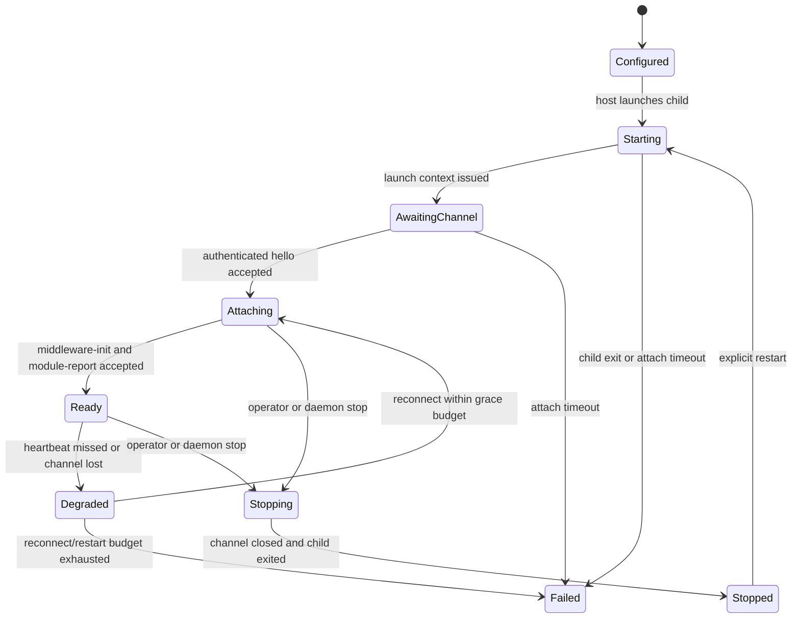

# Proposal 080: Multiplexed `channel_json` Middleware Executor

Based on:

- `doc/project/40-proposals/019-supervised-local-http-json-middleware-executor.md`
- `doc/project/40-proposals/020-bundled-python-middleware-modules.md`
- `doc/project/40-proposals/027-middleware-peer-message-dispatch.md`
- `doc/project/50-requirements/requirements-010-middleware-executor.md`
- `doc/project/60-solutions/015-host-owned-module-store/015-host-owned-module-store.md`
- `doc/project/60-solutions/016-bounded-local-server-runtime/016-bounded-local-server-runtime.md`
- `doc/project/60-solutions/019-middleware/019-middleware.md`
- `doc/project/60-solutions/029-bounded-deferred-operations/029-bounded-deferred-operations.md`
- `node:DEV-GUIDELINES.md`
- `node:middleware/README.md`
- `node:middleware-runtime/README.md`

## Status

Proposed (Draft)

## Date

2026-07-09

## Executive Summary

Orbiplex Node should add a supervised `channel_json` middleware executor. Each
module using this executor initiates one authenticated WebSocket session to one
shared host-owned loopback listener. The host and module then multiplex
independent request/response exchanges over that session in both directions.

The first purpose is operational: eligible supervised middleware no longer needs
one listener and TCP port per module merely so the host can invoke it. The second
purpose is architectural: host-to-module dispatch, module-to-host capability calls,
lifecycle control, health, cancellation, and host-mediated module HTTP/UI requests
use one explicit session contract instead of several incidental HTTP paths.

`channel_json` changes transport and lifecycle attachment only. Existing middleware
invoke envelopes, decisions, module reports, hook semantics, host-capability policy,
and domain contracts remain authoritative. A connected session grants no authority.

The migration is additive:

- `channel_json` becomes the preferred executor for long-lived supervised modules,
- `http_local_json` remains available while bundled and operator-installed modules
  migrate,
- `local_http_json` remains the unmanaged adapter for intentionally independent
  services,
- public or peer-facing middleware service listeners are outside this migration.

## Context and Problem Statement

`http_local_json` correctly established host-owned process supervision, readiness,
restart policy, module init/report, and operator-visible health. Its transport shape,
however, requires every supervised module to expose a loopback HTTP listener. The
host calls that listener for ordinary dispatch, readiness, health, init/report,
host-capability handler dispatch, workflow handlers, and some module-owned UI/API
surfaces. The module separately calls the daemon's host-capability HTTP API.

This has several operational costs:

- each eligible module consumes a listener and port,
- startup depends on per-module port allocation and bind readiness,
- local authentication exists in both directions as separate HTTP client/server
  concerns,
- health polling creates a second liveness mechanism beside process supervision,
- direct Node UI-to-module proxying leaks the current HTTP transport into a higher
  layer,
- adding concurrency requires every Python module to run and bound its own HTTP
  server correctly.

The semantic contracts are not the problem. The transport topology is. Orbiplex
already treats transport as subordinate to middleware semantics, so it can replace
the per-module listener without redefining middleware behavior.

## Goals

- Reduce eligible supervised middleware listeners from one per module to one shared
  host-owned loopback WebSocket listener.
- Preserve independent logical calls and bounded concurrency over one physical
  session.
- Carry host-to-module dispatch and module-to-host host-capability calls over the
  same authenticated session.
- Preserve existing module init/report, hook, decision, route, workflow, observer,
  and host-capability contracts.
- Replace readiness polling with authenticated session attachment plus application
  heartbeat.
- Keep lifecycle, authorization, dispatch selection, limits, and audit host-owned.
- Remove direct transport knowledge from Node UI and other higher-level consumers.
- Migrate bundled middleware incrementally with conformance tests and rollback to
  `http_local_json` while the migration is incomplete.

## Non-Goals

- This proposal does not create a remote middleware protocol.
- It does not expose middleware sessions on non-loopback interfaces.
- It does not replace public, peer-facing, browser-facing, or provider-facing
  service listeners that are part of a middleware product's actual network surface.
- It does not redefine middleware hooks, `WorkflowEnvelope`,
  `MiddlewareDecision`, `middleware-init`, or `middleware-module-report`.
- It does not make connection possession an authority grant.
- It does not add transparent replay of arbitrary in-flight calls after reconnect.
- It does not carry large artifacts inline when Artifact Delivery or a host-owned
  artifact reference is appropriate.
- It does not remove the unmanaged `local_http_json` adapter.
- It does not require HTTP/2, gRPC, WebTransport, or WebSocket compression.

## Architectural Decision

### One Shared Host Listener

The daemon owns one bounded WebSocket listener for all supervised `channel_json`
modules. The initial implementation binds an ephemeral loopback port and passes the
resolved URL to supervised children. This removes per-module port configuration and
avoids making the existing daemon HTTP parser responsible for WebSocket upgrade in
the first slice.

The listener MUST:

- bind only to loopback,
- use the Bounded Local Server Runtime or a documented equivalent bounded adapter,
- use a long-lived-session profile with a fixed worker/session ceiling rather than
  the ordinary short HTTP handler deadline,
- cap concurrent sessions and handshake work,
- refuse browser-originated connections by default,
- disable WebSocket compression in v1,
- enforce handshake, frame, idle, heartbeat, and shutdown limits,
- expose redacted operator diagnostics and counters.

Co-hosting the channel on the daemon's general HTTP listener may be considered
later. It is not required to obtain the main benefit: `N` module listeners become
one host listener.

### Middleware-Initiated Attachment

For each supervised launch the host creates a random `launch/instance-id` and a
module-specific authentication token. It passes these values and the shared channel
URL through host-owned environment variables or token files. Secrets MUST NOT be
placed in URL query parameters.

The module initiates the WebSocket connection and sends a hello message. The host
derives the configured executor, module, component, and capability binding from the
authenticated launch context; it MUST NOT trust identity fields supplied by the
module in isolation.

Only one active session is permitted per `(executor/id, launch/instance-id)`. A
duplicate or stale launch instance is refused. Restart creates a new launch instance
and therefore a new session epoch.

### Reuse, Not Semantic Forking

The channel is an executor transport. Existing payload contracts remain the unit of
meaning. The outer channel frame names the payload schema and operation, while the
host validates both the frame and the embedded contract through the schema gate
before concretizing it as a Rust type.

The implementation MUST factor transport-neutral dispatch beneath the HTTP and
channel adapters. In particular, a channel-based host-capability call MUST invoke the
same authorization and handler logic as the HTTP host-capability endpoint. It MUST
NOT call the daemon's own HTTP endpoint as an implementation shortcut.

## Layered Runtime Model

The implementation follows these strata:

1. **Middleware contracts**
   - channel hello, acceptance, frame, call result, and module HTTP bridge shapes,
   - existing invoke, decision, report, and host-capability payload contracts.
2. **Channel core**
   - pure frame validation,
   - session state transitions,
   - request/reply correlation,
   - negotiated limits,
   - typed failure classification.
3. **Channel transport**
   - bounded WebSocket accept/read/write,
   - text-frame encoding,
   - heartbeat and close handling,
   - no domain or capability policy.
4. **Middleware runtime and supervisor**
   - launch instance creation,
   - session registry,
   - lifecycle and restart composition,
   - transport-neutral dispatch targets,
   - module report persistence and component health.
5. **Daemon composition**
   - host-capability handler invocation,
   - claimed-route and workflow dispatch,
   - operator API and lifecycle audit.
6. **Node UI and clients**
   - consume daemon-owned module bridge and status APIs,
   - never connect directly to a module session.

The channel core should remain small. It may live in the existing `middleware`
contract crate plus `middleware-runtime` until a separate crate demonstrably reduces
coupling; crate proliferation is not a goal.

## Session Lifecycle

The supervised component state machine becomes:



Startup sequence:

1. The daemon validates executable, working directory, sandbox profile, channel
   limits, and restart policy.
2. It creates the launch instance and token binding.
3. It starts the child with the channel URL and credential references.
4. The child opens WebSocket using subprotocol
   `orbiplex.middleware-channel.v1` and sends `middleware-channel-hello.v1`.
5. The host authenticates the launch context and negotiates the lower of host and
   module resource limits.
6. The host sends the existing `middleware-init` payload as a channel request.
7. The module returns the existing `middleware-module-report` payload.
8. The host validates and persists the report, registers routes/handlers, sends
   `session-ready`, and marks the component ready.

Readiness means all of the following:

- child process is still running,
- authenticated channel is active,
- init/report completed successfully,
- application heartbeat is fresh,
- component is not stopping or restart-exhausted.

Transport Ping/Pong proves socket liveness. The application heartbeat additionally
proves that the module's channel loop is responsive. Neither proves domain health;
module-specific diagnostics remain report/status data.

## Wire Contracts

All new v1 contracts use kebab-case values and namespaced on-wire keys. Security
boundary schemas use `additionalProperties: false`. Extension data, if later needed,
must live under an explicit `extensions` object.

### `middleware-channel-hello.v1`

Sent once by the module after WebSocket upgrade:

```json
{
  "schema": "middleware-channel-hello.v1",
  "schema/v": 1,
  "executor/id": "dator-channel",
  "module/id": "dator",
  "component/id": "middleware.dator",
  "launch/instance-id": "middleware-launch:01...",
  "contract/versions": ["v1"],
  "channel/features": ["bidirectional-rpc", "cancellation", "heartbeat"],
  "limits/requested": {
    "frame/max-bytes": 262144,
    "in-flight/host-to-module": 32,
    "in-flight/module-to-host": 16,
    "observer/queue-capacity": 128
  }
}
```

Identity fields are consistency assertions. Authentication and configured launch
state remain authoritative.

### `middleware-channel-accepted.v1`

Returned by the host after authenticating the provisional session:

```json
{
  "schema": "middleware-channel-accepted.v1",
  "schema/v": 1,
  "session/id": "middleware-session:01...",
  "session/epoch": 1,
  "contract/version": "v1",
  "limits/effective": {
    "frame/max-bytes": 262144,
    "in-flight/host-to-module": 32,
    "in-flight/module-to-host": 16,
    "observer/queue-capacity": 128,
    "heartbeat/interval-ms": 5000,
    "heartbeat/timeout-ms": 15000
  }
}
```

The effective limit is always the most restrictive applicable host, component, and
module-requested value.

### `middleware-channel-frame.v1`

Every post-handshake application message uses one outer frame:

```json
{
  "schema": "middleware-channel-frame.v1",
  "schema/v": 1,
  "session/id": "middleware-session:01...",
  "session/epoch": 1,
  "frame/seq": 42,
  "message/kind": "request",
  "operation": "middleware.invoke",
  "request/id": "middleware-request:01...",
  "deadline/at": "2026-07-09T12:00:05Z",
  "trace/correlation-id": "correlation:01...",
  "payload/schema": "peer-message-invoke.v1",
  "payload": {}
}
```

Frame invariants:

- `frame/seq` is monotonic per direction and session epoch; it detects duplicate or
  regressing frames but is not a domain ordering authority,
- a `request` has `request/id` and no `reply/to`,
- a `response` has `reply/to` and no new `request/id`,
- `event` is permitted only for registered observational operations,
- `control` is limited to negotiated lifecycle operations,
- `request/id` is correlation, not idempotency; domain idempotency remains in the
  embedded payload contract,
- unknown operations or payload schemas fail closed,
- unknown replies, duplicate request ids, and sequence regressions are protocol
  violations.

V1 operations are:

| Direction | Operation | Payload |
|---|---|---|
| host -> module | `middleware.init` | existing `middleware-init` |
| host -> module | `middleware.invoke` | existing workflow/peer/local/role request contract |
| host -> module | `middleware.observe` | existing observer contract |
| host -> module | `module-http.invoke` | `middleware-module-http-request.v1` |
| either | `request.cancel` | request id and reason for a request initiated by that side |
| module -> host | `host-capability.invoke` | `middleware-channel-host-capability-call.v1` |
| either | `heartbeat` | bounded heartbeat control body |
| host -> module | `session.shutdown` | bounded shutdown deadline and reason |

The runtime derives traffic class from the operation. A module cannot mark its own
request as control traffic.

### Host-Capability Call and Result

`middleware-channel-host-capability-call.v1` carries:

```json
{
  "schema": "middleware-channel-host-capability-call.v1",
  "schema/v": 1,
  "capability/id": "artifact.delivery.send",
  "request/schema": "artifact-delivery-envelope.v1",
  "request": {},
  "idempotency/key": "optional-domain-key"
}
```

The session supplies caller identity and runtime binding. The module cannot override
them in this body. `idempotency/key` is optional at this wrapper layer and MUST be
forwarded only when the selected capability contract supports it.

`middleware-channel-call-result.v1` carries:

```json
{
  "schema": "middleware-channel-call-result.v1",
  "schema/v": 1,
  "outcome": "failed",
  "result/schema": null,
  "result": null,
  "failure": {
    "class": "retryable",
    "code": "host-capability-unavailable",
    "message": "host capability is temporarily unavailable",
    "tracking/id": "error:01..."
  }
}
```

Allowed outcomes are `succeeded`, `refused`, and `failed`. Failure class is explicit:
`retryable`, `terminal`, or `policy-denied`. Protocol-visible messages remain
redacted; provider-local details stay in host diagnostics keyed by `tracking/id`.

### Module HTTP Bridge

Current `server-html` and selected module-local API clients call middleware HTTP
endpoints directly. Migration requires a host-mediated replacement rather than a
hidden compatibility listener.

`middleware-module-http-request.v1` carries only a filtered request projection:

```json
{
  "schema": "middleware-module-http-request.v1",
  "schema/v": 1,
  "method": "GET",
  "path": "/ui/runs/42",
  "query": "tab=steps",
  "headers": {
    "accept": "text/html",
    "hx-request": "true"
  },
  "body/encoding": "base64url",
  "body": "",
  "caller/scope": "operator",
  "ui/mount": "/middleware/arca"
}
```

`middleware-module-http-response.v1` carries bounded status, allowlisted headers,
and body bytes:

```json
{
  "schema": "middleware-module-http-response.v1",
  "schema/v": 1,
  "status": 200,
  "headers": {
    "content-type": "text/html; charset=utf-8"
  },
  "body/encoding": "base64url",
  "body": "PG1haW4-"
}
```

The daemon owns path normalization, request/response header allowlists, body limits,
redirect policy, caller scope, CSRF boundary, timeout, and public mount. Node UI calls
the daemon bridge and never receives channel credentials. The bridge may dispatch
only a route or `server-html` entry path already accepted from the module report;
client-supplied paths cannot create an undeclared module endpoint.

## Multiplexing, Concurrency, and Flow Control

One WebSocket is a transport stream, not permission to serialize all work. Each side
uses:

- one dedicated session reader loop,
- one dedicated bounded writer queue,
- a pending request map keyed by `request/id`,
- bounded worker pools for inbound RPC,
- separate bounded queues for control, RPC, and observer traffic,
- per-direction in-flight semaphores,
- per-call deadlines and response-size limits.

The reader MUST validate and enqueue work without executing domain handlers while
holding the session or supervisor lock. Callers obtain a cheap channel dispatch
handle, release the supervisor registry lock, enqueue the request, and await only
their own result.

Scheduling rules:

- control traffic remains responsive during RPC load,
- observer traffic may be dropped under pressure and increments a drop counter,
- ordinary RPC receives a typed `channel-overloaded` retryable failure when its
  bounded queue is full,
- one slow module operation cannot occupy the reader loop,
- cancellation is best-effort for already-running work and never implies rollback,
- work that may legitimately outlive a request uses Bounded Deferred Operations.

WebSocket still inherits TCP head-of-line behavior. V1 mitigates this by limiting
frame size, disabling compression, and using artifact references for larger values.
HTTP/2 or QUIC-level stream independence is deferred until profiling demonstrates a
need.

## Failure and Recovery Semantics

The session itself is ephemeral and is not replayed after daemon restart. Durable
domain work must already have an idempotency or Deferred Operation contract.

On channel loss:

1. the component becomes `degraded`,
2. routing of new calls stops,
3. all in-flight calls complete with `channel-lost` and explicit retryability,
4. no call is transparently replayed,
5. the child may reconnect within a bounded grace period using the same launch
   instance,
6. after grace or restart-budget exhaustion, the host applies the existing
   supervised restart policy.

A reconnect creates a new `session/id` and increments the launch-local session
epoch. Late responses from an old session cannot satisfy requests in the new one.

Shutdown sequence:

1. stop admitting new RPC,
2. send `session.shutdown` with a deadline,
3. drain bounded in-flight work,
4. close WebSocket,
5. terminate and, if necessary, kill the child under existing supervisor policy,
6. surface residual processes and failed drain to the operator.

## Security and Authority Invariants

- The listener is loopback-only and rejects non-loopback configuration.
- Per-launch credentials are stored in host-owned files with restrictive
  permissions and compared in constant time.
- Credentials never appear in URLs, logs, traces, module reports, or status JSON.
- Browser `Origin` is rejected by default; the channel is not a browser API.
- Authentication binds the session to configured executor/module/component ids.
- Module report declarations grant nothing.
- Host capability authorization, passport, revocation, scope, and policy gates run
  before effects exactly as on HTTP ingress.
- Missing authority or unavailable policy fails closed.
- Outer and embedded schemas are validated before handler execution.
- Unknown fields are rejected in security-sensitive channel contracts.
- Frame, body, queue, in-flight, timeout, reconnect, and restart limits are explicit.
- Logs and lifecycle facts contain ids, digests, counters, and redacted errors, not
  request payloads or secrets.

## Configuration Projection

Illustrative effective runtime configuration:

```json
{
  "middleware_channel": {
    "enabled": true,
    "bind": "127.0.0.1:0",
    "max_sessions": 64,
    "handshake_timeout_ms": 5000,
    "frame_max_bytes": 262144,
    "heartbeat_interval_ms": 5000,
    "heartbeat_timeout_ms": 15000,
    "reconnect_grace_ms": 5000
  },
  "middleware_channel_services": {
    "dator": {
      "id": "dator-channel",
      "kind": "channel_json",
      "module_id": "dator",
      "component_id": "middleware.dator",
      "launch": {
        "executable": "run.sh",
        "args": [],
        "cwd": null,
        "env": {}
      },
      "channel": {
        "startup_timeout_ms": 15000,
        "request_timeout_ms": 5000,
        "max_response_bytes": 65536,
        "max_in_flight_host_to_module": 32,
        "max_in_flight_module_to_host": 16,
        "observer_queue_capacity": 128
      },
      "sandbox_profile": "module-restricted",
      "restart_policy": {
        "mode": "on_failure",
        "max_restarts": 3,
        "window_sec": 60
      }
    }
  }
}
```

These field names are implementation guidance, not yet frozen wire protocol. Runtime
config remains a host-owned projection assembled from package defaults and operator
overrides. The shared listener endpoint and launch credentials are generated runtime
facts and MUST NOT be persisted into package configuration.

`<data-dir>/middleware/<module-id>/bind` remains meaningful only for legacy HTTP
executors. A channel module may receive a host-owned session-status marker, but the
authoritative session state is the daemon read model, not a module-editable file.

## Dispatch Abstraction Changes

The current supervisor API leaks HTTP through types such as `MiddlewareHttpTarget`
and route claims containing `invoke_url`. The migration introduces a transport-neutral
target:

```text
MiddlewareDispatchTarget
  Http(MiddlewareHttpTarget)
  Channel(MiddlewareChannelTarget)
```

`MiddlewareChannelTarget` contains stable executor/module/component ids and a cheap
session dispatch handle; it does not expose a socket object or channel credentials.
Host-capability, module-route, workflow-kind, service-dispatch, observer, and UI
bridges resolve this common target and dispatch through the selected adapter.

No host path may hold the global supervisor mutex while waiting for a middleware
response. This is a migration acceptance criterion, not a later optimization.

## Operator Visibility and Audit

The component/status read model should expose:

- executor kind and module/component ids,
- process phase and channel phase,
- current session id or its redacted short form,
- launch instance id digest,
- connected/ready timestamps,
- last heartbeat age,
- negotiated limits,
- in-flight counts and queue depths,
- overload, observer-drop, timeout, cancellation, reconnect, and protocol-violation
  counters,
- restart count and last redacted error.

Persisted lifecycle facts should cover:

- launch-created,
- channel-connected,
- channel-authenticated,
- attach-completed,
- channel-lost,
- reconnect-attempted,
- session-superseded,
- overload-rejected,
- protocol-violation,
- shutdown-started,
- shutdown-completed.

The existing temporal storage convention applies. The session and pending request map
are ephemeral; lifecycle facts and module reports are durable audit inputs, while
operator status is a rebuildable read model. No second durable RPC queue is created.

## Migration Plan

### Phase 0: Freeze Contracts and Inventory

- Inventory every `http_local_json` module and classify each listener as:
  host-only loopback, mixed host/product surface, or intentional network service.
- Freeze channel schemas, state transitions, limits, failure classes, and the
  transport-neutral dispatch target.
- Add positive, negative, oversized, replay, duplicate-sequence, unknown-reply, and
  authorization fixtures.
- Add capability/ledger mappings only if implementation introduces a new host
  capability. The transport itself is not a capability id.

### Phase 1: Channel Primitive and Conformance Peer

- Add Rust channel contract types and schema-gate validators.
- Add pure session correlation/state logic independent of WebSocket I/O.
- Add a bounded WebSocket connection adapter using the existing `tungstenite` and
  Bounded Local Server Runtime patterns.
- Add a shared Python channel client with one reader loop, bounded workers, and
  bounded writer queues.
- Build a fixture module that exercises bidirectional concurrent calls without any
  domain behavior.

### Phase 2: Supervisor and Daemon Integration

- Add shared listener lifecycle and session registry.
- Add `channel_json` config projection and supervised launch environment.
- Integrate hello, init/report, readiness, heartbeat, reconnect, shutdown, and
  restart policy.
- Introduce `MiddlewareDispatchTarget` and remove HTTP-specific assumptions from
  common resolution paths.
- Factor host-capability dispatch beneath HTTP and channel adapters.
- Add redacted status, runtime metrics, lifecycle facts, and operator controls.

### Phase 3: Complete Local Surface Bridging

- Route claimed local paths over `module-http.invoke` or existing typed local-input
  dispatch as appropriate.
- Add daemon-owned module HTTP bridge for `server-html` and host-mediated module API
  calls.
- Change Node UI to call the daemon bridge instead of a module endpoint.
- Preserve header, body, path, redirect, timeout, caller-scope, CSRF, and response
  limits with negative tests.

### Phase 4: Pilot Migration

- Migrate a fixture and one observer-oriented module first to validate overload and
  fire-and-forget behavior.
- Migrate one module with a host-capability call.
- Migrate one module with a `server-html` or claimed local route.
- Keep per-module rollback to `http_local_json` until each conformance gate passes.

### Phase 5: Bundled Module Cohorts

Migrate by behavior rather than by directory order:

1. observer and stateless adapters,
2. Dator and Arca role/workflow modules,
3. Inquirium adapters,
4. Sensorium OS and Sensorium Workbench,
5. Contact Catalog, Attestation, Messaging, Offer Catalog, Whisper Intake, and other
   eligible stateful modules.

For mixed or network-facing services, migrate only the host-control plane when doing
so removes a distinct host-only listener. Preserve the product listener when it is an
intentional service API.

### Phase 6: Default Switch and Legacy Retirement

- Make `channel_json` the generated default for eligible bundled middleware.
- Stop allocating per-module host-only ports and stop writing legacy `bind` markers
  for channel modules.
- Mark `http_local_json` legacy for operator-installed packages.
- Retain explicit opt-in compatibility until the package migration policy is
  resolved; do not silently reinterpret an HTTP executor config as channel config.
- Remove bundled dependency on `http_local_json` only after Story acceptance and
  port-inventory assertions pass.

## Test and Acceptance Plan

### Contract and Core Tests

- hello/accepted/frame/call/result/module-HTTP positive round trips,
- unknown fields and malformed ids rejected,
- request versus response field invariants,
- monotonic per-direction sequence enforcement,
- duplicate request and unknown reply rejection,
- frame and embedded payload size enforcement,
- host/module negotiated limit uses the stricter value,
- failure retryability preserved as data.

### Security and Refusal Tests

- missing, wrong, stale, and cross-module token,
- stale launch instance and duplicate active session,
- non-loopback bind configuration,
- browser Origin refusal,
- undeclared host capability,
- missing passport, stale revocation, and policy denial through the common host
  capability dispatcher,
- embedded schema mismatch,
- payload and response over limit,
- attempt to classify module traffic as control.

### Concurrency and Failure Tests

- at least 32 overlapping calls correlated correctly,
- one slow call does not block an unrelated fast call,
- a host-to-module request that synchronously performs a module-to-host capability
  call completes without deadlock,
- observer flood does not starve control or RPC,
- bounded overload returns a typed retryable result,
- cancellation reaches the selected request only,
- heartbeat timeout degrades the component,
- disconnect fails in-flight calls without transparent replay,
- reconnect cannot complete old-session requests,
- shutdown drains bounded work and surfaces residual child failure.

### Integration and Acceptance

- fixture with several `channel_json` modules proves one shared listener and no
  per-module listeners,
- Story-009 validates Dator, Arca, Sensorium OS, role/workflow dispatch, host
  capabilities, and failure tracking over the channel,
- Story-010 validates the stateful catalog/attestation/messaging cohort,
- Story-011 validates Corpus/Inquirium collaboration where migrated adapters are in
  scope,
- an explicit port inventory assertion distinguishes intentional network service
  listeners from removed host-only middleware listeners.

## Trade-offs

### Benefits

- one host listener replaces many host-only module listeners,
- process readiness and communication readiness become one coherent session model,
- module implementations no longer need an HTTP server merely to be invoked,
- bidirectional calls share correlation, deadlines, cancellation, and diagnostics,
- transport details stop leaking into Node UI and common dispatch APIs,
- bounded concurrency becomes a host/module session contract instead of module
  folklore.

### Costs

- a new session state machine and frame contract,
- more complex correlation, queueing, reconnect, and shutdown code,
- one connection loss affects all in-flight calls for that module,
- Python modules need a shared channel runtime,
- mixed network-service modules still need careful listener inventory rather than a
  mechanical conversion.

### Alternatives Considered

- **HTTP/1.1 long polling or SSE plus POST**: fewer module listeners but not one true
  bidirectional session and weaker correlation/cancellation semantics.
- **HTTP/2/gRPC bidirectional streaming**: strong stream semantics but a heavier
  cross-language stack than current needs justify.
- **Unix-domain sockets**: remove TCP ports but add platform-specific attachment and
  still require a multiplexing contract.
- **Persistent stdio**: attractive for supervised children and may be added later as
  another transport under the same channel contract; WebSocket is selected first
  because it also supports attachable process boundaries and reuses existing Node
  dependencies.
- **Keep per-module HTTP**: operationally simple per module but retains the listener,
  port, health polling, and transport-leakage problems.

## Failure Modes and Mitigations

### Session reader is blocked by domain work

Mitigation: reader only validates and enqueues; bounded workers execute handlers.

### One large message delays unrelated calls

Mitigation: strict frame caps, no compression, bounded result sizes, and artifact
references for larger data.

### Channel reconnect duplicates a side effect

Mitigation: no transparent replay; callers retry only through existing idempotency or
Deferred Operation contracts.

### Observer traffic exhausts the session

Mitigation: separate bounded observer queue, drop counters, and lower scheduling
priority than control/RPC.

### Module impersonates another configured component

Mitigation: per-launch token and instance binding; body identity is only a consistency
assertion.

### Shared listener becomes a larger local attack surface

Mitigation: loopback-only bind, bounded accepts, handshake timeout, strict schemas,
constant-time token checks, origin refusal, frame limits, and per-module quotas.

### Higher layers continue depending on module URLs

Mitigation: transport-neutral dispatch targets and daemon-owned module HTTP/UI bridge
are required before migrating modules that expose those surfaces.

## Frozen Initial Decisions

1. V1 uses one shared host-owned WebSocket listener on loopback.
2. The first listener may use a dedicated ephemeral port; sharing the daemon HTTP port
   is deferred.
3. V1 uses JSON text frames without WebSocket compression.
4. Large payloads use host-owned artifact references instead of increasing frame
   limits without evidence.
5. Session connection grants no host capability.
6. No arbitrary request is replayed automatically after disconnect.
7. Node UI reaches module-owned server HTML through a daemon bridge.
8. `local_http_json` remains the unmanaged-service adapter.
9. Intentional network service listeners are not migration targets.

## Open Questions

No question blocks the first implementation phases. Before final removal of bundled
`http_local_json` defaults, the project should decide how long operator-installed
legacy packages remain supported and whether a later persistent-stdio adapter should
share the same channel contract.

## Implementation Tracker

| ID | Deliverable | Status | Notes |
|---|---|---|---|
| P080-001 | Document `channel_json` architecture, migration boundary, initial decisions, and acceptance criteria | done | This proposal records the implementation plan and frozen initial defaults. |
| P080-002 | Inventory `http_local_json` listeners as host-only, mixed, or intentional network service surfaces | todo | Inventory must precede mechanical module conversion. |
| P080-003 | Add canonical channel hello, accepted, frame, host-capability call/result, and module HTTP bridge schemas with fixtures | todo | Validate outer and embedded contracts; use strict security-boundary schemas. |
| P080-004 | Add Rust channel contract/state/correlation core and schema-gate integration | todo | Keep WebSocket I/O and daemon policy outside the pure core. |
| P080-005 | Add bounded shared WebSocket listener and session registry | todo | Reuse `tungstenite` and Bounded Local Server Runtime patterns. |
| P080-006 | Add shared Python `channel_json` client/runtime and cross-language golden vectors | todo | One reader, bounded workers, bounded writer queues, no unbounded thread-per-request behavior. |
| P080-007 | Add `channel_json` config projection, launch instance credentials, init/report attach, heartbeat, reconnect, and shutdown lifecycle | todo | Session readiness replaces per-module HTTP readiness polling. |
| P080-008 | Introduce transport-neutral `MiddlewareDispatchTarget` and remove common `invoke_url` assumptions | todo | No supervisor mutex may be held while waiting for a reply. |
| P080-009 | Factor host-capability dispatch beneath HTTP and channel adapters | todo | Authorization, revocation, scope, policy, error tracking, and audit remain one implementation path. |
| P080-010 | Implement bounded multiplexing, per-direction in-flight limits, cancellation, fairness, overload, and typed failure semantics | todo | Control, RPC, and observer traffic receive separate bounded treatment. |
| P080-011 | Add daemon module HTTP/UI bridge and migrate Node UI away from direct module endpoints | todo | Required before migrating `server-html` modules. |
| P080-012 | Add operator session status, metrics, redacted lifecycle facts, and component controls | todo | Session state is ephemeral; audit facts and module reports are durable. |
| P080-013 | Add fixture/conformance suite for concurrency, refusal, reconnect, shutdown, and port inventory | todo | Include cross-language Rust/Python behavior equivalence. |
| P080-014 | Pilot one observer, one host-capability caller, and one module HTTP/UI surface on `channel_json` | todo | Keep explicit rollback to `http_local_json` during pilot. |
| P080-015 | Migrate Dator and Arca and pass Story-009 acceptance | todo | Covers role/workflow dispatch and host-capability use. |
| P080-016 | Migrate eligible Inquirium and Sensorium modules | todo | Preserve external model-provider and OS actuation boundaries. |
| P080-017 | Migrate eligible Contact Catalog, Attestation, Messaging, Offer Catalog, Whisper Intake, and related stateful modules | todo | Pass Story-010 and relevant focused tests. |
| P080-018 | Update implementation ledger, Middleware solution, FAQ/HOWTO, config docs, and package authoring guidance | todo | Track runtime ownership and legacy executor status without changing capability semantics. |
| P080-019 | Make `channel_json` the default for eligible bundled modules and stop allocating their host-only ports/bind markers | todo | Intentional network listeners remain. |
| P080-020 | Decide and execute final `http_local_json` legacy-package support policy | todo | No silent config reinterpretation; removal requires an explicit compatibility decision. |

## Next Actions

1. Complete P080-002 and turn the listener inventory into a checked repository
   artifact or test input.
2. Freeze P080-003 schemas and golden vectors before writing WebSocket lifecycle
   code.
3. Implement the pure channel core and fixture peer before daemon integration.
4. Add the shared listener/session registry and one end-to-end fixture.
5. Refactor dispatch targets and host-capability invocation before migrating a real
   module.
6. Migrate the three pilot behavior classes, review the resulting traces and failure
   modes, and only then move bundled module cohorts.
