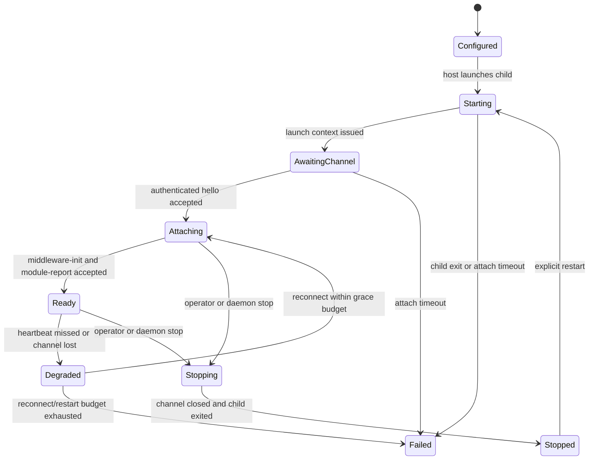

# Proposal 080: Multiplexed `channel_json` Middleware Executor

Based on:

- `doc/project/40-proposals/019-supervised-local-http-json-middleware-executor.md`
- `doc/project/40-proposals/020-bundled-python-middleware-modules.md`
- `doc/project/40-proposals/027-middleware-peer-message-dispatch.md`
- `doc/project/50-requirements/requirements-010-middleware-executor.md`
- `doc/project/60-solutions/015-host-owned-module-store/015-host-owned-module-store.md`
- `doc/project/60-solutions/016-bounded-local-server-runtime/016-bounded-local-server-runtime.md`
- `doc/project/60-solutions/019-middleware/019-middleware.md`
- `doc/project/60-solutions/029-bounded-deferred-operations/029-bounded-deferred-operations.md`
- `node:DEV-GUIDELINES.md`
- `node:middleware/README.md`
- `node:middleware-runtime/README.md`

## Status

Accepted (hard-MVP implemented; post-MVP hardening tracked)

## Date

2026-07-09

## Executive Summary

Orbiplex Node should add a supervised `channel_json` middleware executor. Each
module using this executor initiates one authenticated WebSocket session to one
shared host-owned loopback listener. The host and module then multiplex
independent request/response exchanges over that session in both directions.

The first purpose is operational: eligible supervised middleware no longer needs
one listener and TCP port per module merely so the host can invoke it. The second
purpose is architectural: host-to-module dispatch, module-to-host capability calls,
lifecycle control, health, cancellation, and host-mediated module HTTP/UI requests
use one explicit session contract instead of several incidental HTTP paths.

`channel_json` changes transport and lifecycle attachment only. Existing middleware
invoke envelopes, decisions, module reports, hook semantics, host-capability policy,
and domain contracts remain authoritative. A connected session grants no authority.

The transport migration was initially additive. Phase 7 is now implemented:

- `channel_json` becomes the preferred executor for long-lived supervised modules,
- all bundled supervised modules use `channel_json`, and the retired
  `http_local_json` executor is rejected in configuration and package manifests,
- `local_http_json` remains the unmanaged adapter for intentionally independent
  services,
- public or peer-facing middleware service listeners may remain as product surfaces,
  but their host lifecycle and middleware attachment move to `channel_json`.

## Context and Problem Statement

`http_local_json` correctly established host-owned process supervision, readiness,
restart policy, module init/report, and operator-visible health. Its transport shape,
however, requires every supervised module to expose a loopback HTTP listener. The
host calls that listener for ordinary dispatch, readiness, health, init/report,
host-capability handler dispatch, workflow handlers, and some module-owned UI/API
surfaces. The module separately calls the daemon's host-capability HTTP API.

This has several operational costs:

- each eligible module consumes a listener and port,
- startup depends on per-module port allocation and bind readiness,
- local authentication exists in both directions as separate HTTP client/server
  concerns,
- health polling creates a second liveness mechanism beside process supervision,
- direct Node UI-to-module proxying leaks the current HTTP transport into a higher
  layer,
- adding concurrency requires every Python module to run and bound its own HTTP
  server correctly.

The semantic contracts are not the problem. The transport topology is. Orbiplex
already treats transport as subordinate to middleware semantics, so it can replace
the per-module listener without redefining middleware behavior.

## Goals

- Reduce eligible supervised middleware listeners from one per module to one shared
  host-owned loopback WebSocket listener.
- Preserve independent logical calls and bounded concurrency over one physical
  session.
- Carry host-to-module dispatch and module-to-host host-capability calls over the
  same authenticated session.
- Preserve existing module init/report, hook, decision, route, workflow, observer,
  and host-capability contracts.
- Replace readiness polling with authenticated session attachment plus application
  heartbeat.
- Keep lifecycle, authorization, dispatch selection, limits, and audit host-owned.
- Remove direct transport knowledge from Node UI and other higher-level consumers.
- Migrate bundled middleware incrementally with conformance tests and an explicit
  pre-retirement rollback window; once Phase 7 lands, old executor declarations fail
  validation rather than falling back to another transport.

## Non-Goals

- This proposal does not create a remote middleware protocol.
- It does not expose middleware sessions on non-loopback interfaces.
- It does not replace public, peer-facing, browser-facing, or provider-facing
  service listeners that are part of a middleware product's actual network surface.
- It does not redefine middleware hooks, `WorkflowEnvelope`,
  `MiddlewareDecision`, `middleware-init`, or `middleware-module-report`.
- It does not make connection possession an authority grant.
- It does not add transparent replay of arbitrary in-flight calls after reconnect.
- It does not carry large artifacts inline when Artifact Delivery or a host-owned
  artifact reference is appropriate.
- It does not remove the unmanaged `local_http_json` adapter.
- It does not require HTTP/2, gRPC, WebTransport, or WebSocket compression.

## Architectural Decision

### One Shared Host Listener

The daemon owns one bounded WebSocket listener for all supervised `channel_json`
modules. The initial implementation binds an ephemeral loopback port and passes the
resolved URL to supervised children. This removes per-module port configuration and
avoids making the existing daemon HTTP parser responsible for WebSocket upgrade in
the first slice.

The listener MUST:

- bind only to loopback,
- use the Bounded Local Server Runtime or a documented equivalent bounded adapter,
- use a long-lived-session profile with a fixed worker/session ceiling rather than
  the ordinary short HTTP handler deadline,
- keep the whole-connection handler timeout disabled for the long-lived WebSocket;
  bound module-to-host work with the negotiated in-flight ceiling and return a
  typed retryable overload result when that worker gate is exhausted,
- cap concurrent sessions and handshake work,
- refuse browser-originated connections by default,
- disable WebSocket compression in v1,
- enforce handshake, frame, idle, heartbeat, and shutdown limits,
- expose redacted operator diagnostics and counters.

Co-hosting the channel on the daemon's general HTTP listener may be considered
later. It is not required to obtain the main benefit: `N` module listeners become
one host listener.

### Middleware-Initiated Attachment

For each supervised launch the host creates a random `launch/instance-id` and a
module-specific authentication token. It passes these values and the shared channel
URL through host-owned environment variables or token files. Secrets MUST NOT be
placed in URL query parameters.

The module initiates the WebSocket connection and sends a hello message. The host
derives the configured executor, module, component, and capability binding from the
authenticated launch context; it MUST NOT trust identity fields supplied by the
module in isolation.

Only one active session is permitted per `(executor/id, launch/instance-id)`. A
duplicate or stale launch instance is refused. Restart creates a new launch instance
and therefore a new session epoch.

### Reuse, Not Semantic Forking

The channel is an executor transport. Existing payload contracts remain the unit of
meaning. The outer channel frame names the payload schema and operation, while the
host validates both the frame and the embedded contract through the schema gate
before concretizing it as a Rust type.

The implementation MUST factor transport-neutral dispatch beneath the HTTP and
channel adapters. In particular, a channel-based host-capability call MUST invoke the
same authorization and handler logic as the HTTP host-capability endpoint. It MUST
NOT call the daemon's own HTTP endpoint as an implementation shortcut.

## Layered Runtime Model

The implementation follows these strata:

1. **Middleware contracts**
   - channel hello, acceptance, frame, call result, and module HTTP bridge shapes,
   - existing invoke, decision, report, and host-capability payload contracts.
2. **Channel core**
   - pure frame validation,
   - session state transitions,
   - request/reply correlation,
   - negotiated limits,
   - typed failure classification.
3. **Channel transport**
   - bounded WebSocket accept/read/write,
   - text-frame encoding,
   - heartbeat and close handling,
   - no domain or capability policy.
4. **Middleware runtime and supervisor**
   - launch instance creation,
   - session registry,
   - lifecycle and restart composition,
   - transport-neutral dispatch targets,
   - module report persistence and component health.
5. **Daemon composition**
   - host-capability handler invocation,
   - claimed-route and workflow dispatch,
   - operator API and lifecycle audit.
6. **Node UI and clients**
   - consume daemon-owned module bridge and status APIs,
   - never connect directly to a module session.

The channel core should remain small. It may live in the existing `middleware`
contract crate plus `middleware-runtime` until a separate crate demonstrably reduces
coupling; crate proliferation is not a goal.

## Session Lifecycle

The supervised component state machine becomes:


```mermaid
stateDiagram-v2
  [*] --> Configured
  Configured --> Starting: host launches child
  Starting --> AwaitingChannel: launch context issued
  AwaitingChannel --> Attaching: authenticated hello accepted
  Attaching --> Ready: middleware-init and module-report accepted
  Ready --> Degraded: heartbeat missed or channel lost
  Degraded --> Attaching: reconnect within grace budget
  Degraded --> Failed: reconnect/restart budget exhausted
  Ready --> Stopping: operator or daemon stop
  Attaching --> Stopping: operator or daemon stop
  Stopping --> Stopped: channel closed and child exited
  Starting --> Failed: child exit or attach timeout
  AwaitingChannel --> Failed: attach timeout
  Stopped --> Starting: explicit restart
```

Startup sequence:

1. The daemon validates executable, working directory, sandbox profile, channel
   limits, and restart policy.
2. It creates the launch instance and token binding.
3. It starts the child with the channel URL and credential references.
4. The child opens WebSocket using subprotocol
   `orbiplex.middleware-channel.v1` and sends `middleware-channel-hello.v1`.
5. The host authenticates the launch context and negotiates the lower of host and
   module resource limits.
6. The host sends the existing `middleware-init` payload as a channel request.
7. The module returns the existing `middleware-module-report` payload.
8. The host validates and persists the report, registers routes/handlers, sends
   `session-ready`, and marks the component ready.

Readiness means all of the following:

- child process is still running,
- authenticated channel is active,
- init/report completed successfully,
- application heartbeat is fresh,
- component is not stopping or restart-exhausted.

Transport Ping/Pong proves socket liveness. The application heartbeat additionally
proves that the module's channel loop is responsive. Neither proves domain health;
module-specific diagnostics remain report/status data.

## Wire Contracts

All new v1 contracts use kebab-case values and namespaced on-wire keys. Security
boundary schemas use `additionalProperties: false`. Extension data, if later needed,
must live under an explicit `extensions` object.

### `middleware-channel-hello.v1`

Sent once by the module after WebSocket upgrade:

```json
{
  "schema": "middleware-channel-hello.v1",
  "schema/v": 1,
  "executor/id": "dator-channel",
  "module/id": "dator",
  "component/id": "middleware.dator",
  "launch/instance-id": "middleware-launch:01...",
  "contract/versions": ["v1"],
  "channel/features": ["bidirectional-rpc", "cancellation", "heartbeat"],
  "limits/requested": {
    "frame/max-bytes": 262144,
    "in-flight/host-to-module": 32,
    "in-flight/module-to-host": 16,
    "observer/queue-capacity": 128
  }
}
```

Identity fields are consistency assertions. Authentication and configured launch
state remain authoritative.

### `middleware-channel-accepted.v1`

Returned by the host after authenticating the provisional session:

```json
{
  "schema": "middleware-channel-accepted.v1",
  "schema/v": 1,
  "session/id": "middleware-session:01...",
  "session/epoch": 1,
  "contract/version": "v1",
  "limits/effective": {
    "frame/max-bytes": 262144,
    "in-flight/host-to-module": 32,
    "in-flight/module-to-host": 16,
    "observer/queue-capacity": 128,
    "heartbeat/interval-ms": 5000,
    "heartbeat/timeout-ms": 15000
  }
}
```

The effective limit is always the most restrictive applicable host, component, and
module-requested value.

### `middleware-channel-frame.v1`

Every post-handshake application message uses one outer frame:

```json
{
  "schema": "middleware-channel-frame.v1",
  "schema/v": 1,
  "session/id": "middleware-session:01...",
  "session/epoch": 1,
  "frame/seq": 42,
  "message/kind": "request",
  "operation": "middleware.invoke",
  "request/id": "middleware-request:01...",
  "deadline/at": "2026-07-09T12:00:05Z",
  "trace/correlation-id": "correlation:01...",
  "payload/schema": "peer-message-invoke.v1",
  "payload": {}
}
```

Frame invariants:

- `frame/seq` is monotonic per direction and session epoch; it detects duplicate or
  regressing frames but is not a domain ordering authority,
- a `request` has `request/id` and no `reply/to`,
- a `response` has `reply/to` and no new `request/id`,
- `event` is permitted only for registered observational operations,
- `control` is limited to negotiated lifecycle operations,
- `request/id` is correlation, not idempotency; domain idempotency remains in the
  embedded payload contract,
- unknown operations or payload schemas fail closed,
- unknown replies, duplicate request ids, and sequence regressions are protocol
  violations.

V1 operations are:

| Direction | Operation | Payload |
|---|---|---|
| host -> module | `middleware.init` | existing `middleware-init` |
| host -> module | `middleware.invoke` | existing workflow/peer/local/role request contract |
| host -> module | `middleware.observe` | existing observer contract |
| host -> module | `module-http.invoke` | `middleware-module-http-request.v1` |
| either | `request.cancel` | `middleware-channel-request-cancel.v1` with the request id and reason for a request initiated by that side |
| module -> host | `host-capability.invoke` | `middleware-channel-host-capability-call.v1` |
| either | `heartbeat` | `middleware-channel-heartbeat.v1` with a bounded sender timestamp |
| host -> module | `session.shutdown` | `middleware-channel-session-shutdown.v1` with a bounded shutdown deadline and reason |

The runtime derives traffic class from the operation. A module cannot mark its own
request as control traffic.

### Host-Capability Call and Result

`middleware-channel-host-capability-call.v1` carries:

```json
{
  "schema": "middleware-channel-host-capability-call.v1",
  "schema/v": 1,
  "operation": "invoke",
  "capability/id": "artifact.delivery.send",
  "request/schema": "artifact-delivery-envelope.v1",
  "request": {},
  "completion/mode": "deferred",
  "idempotency/key": "optional-domain-key"
}
```

The session supplies caller identity and runtime binding. The module cannot override
them in this body. `idempotency/key` is optional at this wrapper layer and MUST be
forwarded only when the selected capability contract supports it.
`capability/id` is one host Capability Registry identifier matching
`^[a-z0-9][a-z0-9._-]*$`; slash-separated peer protocol wire names such as
`core/messaging` are a different namespace and MUST fail channel admission.

`operation` defaults to `invoke`. `lookup` is the explicit read-only variant for
host-owned capability routing inspection: it requires an empty
`host-capability-routing-request.v1`, must complete immediately, and returns the
same routing view as the daemon HTTP `GET` surface without dispatching the
capability handler. An unknown local provider remains a readable `404` lookup
result, not an effect attempt and not a reason to invent a fallback provider.
`completion/mode` defaults to `immediate`; `deferred` is an explicit semantic
request, not a URL query or part of `capability/id`, and MUST fail closed when the
selected capability does not support bounded deferred completion.

`middleware-channel-call-result.v1` carries:

```json
{
  "schema": "middleware-channel-call-result.v1",
  "schema/v": 1,
  "outcome": "failed",
  "result/schema": null,
  "result": null,
  "failure": {
    "class": "retryable",
    "code": "host-capability-unavailable",
    "message": "host capability is temporarily unavailable",
    "tracking/id": "error:01..."
  }
}
```

Allowed outcomes are `succeeded`, `refused`, and `failed`. Failure class is explicit:
`retryable`, `terminal`, or `policy-denied`. Protocol-visible messages remain
redacted; provider-local details stay in host diagnostics keyed by `tracking/id`.

### Module HTTP Bridge

Current `server-html` and selected module-local API clients call middleware HTTP
endpoints directly. Migration requires a host-mediated replacement rather than a
hidden compatibility listener.

`middleware-module-http-request.v1` carries only a filtered request projection:

```json
{
  "schema": "middleware-module-http-request.v1",
  "schema/v": 1,
  "method": "GET",
  "path": "/ui/runs/42",
  "query": "tab=steps",
  "headers": {
    "accept": "text/html",
    "hx-request": "true"
  },
  "body/encoding": "base64url",
  "body": "",
  "caller/scope": "operator",
  "ui/mount": "/middleware/arca"
}
```

`middleware-module-http-response.v1` carries bounded status, allowlisted headers,
and body bytes:

```json
{
  "schema": "middleware-module-http-response.v1",
  "schema/v": 1,
  "status": 200,
  "headers": {
    "content-type": "text/html; charset=utf-8"
  },
  "body/encoding": "base64url",
  "body": "PG1haW4-"
}
```

The daemon owns path normalization, request/response header allowlists, body limits,
redirect policy, caller scope, CSRF boundary, timeout, and public mount. Node UI calls
the daemon bridge and never receives channel credentials. The bridge may dispatch
only a route or `server-html` entry path already accepted from the module report;
client-supplied paths cannot create an undeclared module endpoint.

## Multiplexing, Concurrency, and Flow Control

One WebSocket is a transport stream, not permission to serialize all work. Each side
uses:

- one dedicated session reader loop,
- one dedicated bounded writer queue,
- a pending request map keyed by `request/id`,
- bounded worker pools for inbound RPC,
- separate bounded queues for control, RPC, and observer traffic,
- per-direction in-flight semaphores,
- per-call deadlines and response-size limits.

The reader MUST validate and enqueue work without executing domain handlers while
holding the session or supervisor lock. Callers obtain a cheap channel dispatch
handle, release the supervisor registry lock, enqueue the request, and await only
their own result.

Scheduling rules:

- control traffic remains responsive during RPC load,
- observer traffic may be dropped under pressure and increments a drop counter,
- ordinary RPC receives a typed `channel-overloaded` retryable failure when its
  bounded queue is full,
- one slow module operation cannot occupy the reader loop,
- cancellation is best-effort for already-running work and never implies rollback,
- work that may legitimately outlive a request uses Bounded Deferred Operations.

Per-direction request-id history is host-bounded and monotonic within one session
epoch. Implementations MUST NOT evict old ids and silently permit their reuse. When
the configured history capacity is exhausted, new RPC requests fail closed and the
module must attach a new session epoch before issuing further requests.

WebSocket still inherits TCP head-of-line behavior. V1 mitigates this by limiting
frame size, disabling compression, and using artifact references for larger values.
HTTP/2 or QUIC-level stream independence is deferred until profiling demonstrates a
need.

## Failure and Recovery Semantics

The session itself is ephemeral and is not replayed after daemon restart. Durable
domain work must already have an idempotency or Deferred Operation contract.

On channel loss:

1. the component becomes `degraded`,
2. routing of new calls stops,
3. all in-flight calls complete with `channel-lost` and explicit retryability,
4. no call is transparently replayed,
5. the child may reconnect within a bounded grace period using the same launch
   instance,
6. after grace exhaustion the host terminates the current child, removes its runtime
   markers and launch binding, records `failed`, and only then applies the existing
   bounded supervised restart policy.

A failed application-heartbeat proof follows the same fail-closed cleanup path. A
session handle that has not proved the heartbeat cannot remain routable merely because
its process still exists.

A reconnect creates a new `session/id` and increments the launch-local session
epoch. Late responses from an old session cannot satisfy requests in the new one.

Shutdown sequence:

1. stop admitting new RPC,
2. send `session.shutdown` with a deadline,
3. drain bounded in-flight work,
4. close WebSocket,
5. terminate and, if necessary, kill the child under existing supervisor policy,
6. surface residual processes and failed drain to the operator.

## Security and Authority Invariants

- The listener is loopback-only and rejects non-loopback configuration.
- Per-launch credentials are stored in host-owned files with restrictive
  permissions and compared in constant time.
- Credentials never appear in URLs, logs, traces, module reports, or status JSON.
- Browser `Origin` is rejected by default; the channel is not a browser API.
- Authentication binds the session to configured executor/module/component ids.
- Module report declarations grant nothing.
- Host capability authorization, passport, revocation, scope, and policy gates run
  before effects exactly as on HTTP ingress.
- Missing authority or unavailable policy fails closed.
- Outer and embedded schemas are validated before handler execution.
- Unknown fields are rejected in security-sensitive channel contracts.
- Frame, body, queue, in-flight, timeout, reconnect, and restart limits are explicit.
- Logs and lifecycle facts contain ids, digests, counters, and redacted errors, not
  request payloads or secrets.
- Component requirements bind the exact contract digest; a matching capability name
  does not authorize a different contract revision.
- The admitted component graph is acyclic and has one deterministic startup and
  shutdown order.
- Dependency loss is represented as `dependency_unavailable`, not collapsed into an
  ordinary call failure or an operator stop.
- Every declared effect has one recovery class; imperative disposal is restricted to
  typed host-local resources.

## Configuration Projection

Illustrative effective runtime configuration:

```json
{
  "middleware_channel": {
    "enabled": true,
    "bind": "127.0.0.1:0",
    "max_sessions": 64,
    "handshake_timeout_ms": 5000,
    "frame_max_bytes": 262144,
    "heartbeat_interval_ms": 5000,
    "heartbeat_timeout_ms": 15000,
    "reconnect_grace_ms": 5000
  },
  "middleware_channel_services": {
    "dator": {
      "id": "dator-channel",
      "kind": "channel_json",
      "module_id": "dator",
      "component_id": "middleware.dator",
      "launch": {
        "executable": "run.sh",
        "args": [],
        "cwd": null,
        "env": {}
      },
      "channel": {
        "startup_timeout_ms": 15000,
        "request_timeout_ms": 5000,
        "max_response_bytes": 65536,
        "max_in_flight_host_to_module": 32,
        "max_in_flight_module_to_host": 16,
        "observer_queue_capacity": 128
      },
      "sandbox_profile": "module-restricted",
      "restart_policy": {
        "mode": "on_failure",
        "max_restarts": 3,
        "window_sec": 60
      }
    }
  }
}
```

These field names are implementation guidance, not yet frozen wire protocol. Runtime
config remains a host-owned projection assembled from package defaults and operator
overrides. The shared listener endpoint and launch credentials are generated runtime
facts and MUST NOT be persisted into package configuration.

`<data-dir>/middleware/<module-id>/bind` is meaningful only when the module owns an
independently retained product HTTP listener. Channel-only modules do not create it.
A channel module may receive a host-owned session-status marker, but the authoritative
session state is the daemon read model, not a module-editable file.

### Component Contracts, Dependency Order, and Effect Recovery

`middleware-component-contract.v1` is the transport-neutral composition contract for
supervised components independently of their transport. It carries:

- `provides[]`: a capability ref plus the canonical digest of the provided contract;
- `requires[]`: the same pair, optionally pinned to one provider component;
- `effects`: a map keyed by unique `effect/id`; ownership is inherited from the
  enclosing `component/id`, so neither identity nor ownership is caller-overridable
  inside an effect declaration.

The host resolves requirements by the exact `(capability/ref, contract/digest)` pair.
A name match with a different digest is a contract mismatch, not a fallback. Multiple
matching providers require an explicit `provider/component-id`; missing required
providers, ambiguous providers, unknown components, and cycles refuse daemon
preflight before child processes start. An optional requirement tolerates only the
complete absence of its capability. A present but digest-incompatible capability or
an unsatisfied `provider/component-id` pin is a configuration error, not degraded
success.

The graph is bounded to 128 components and rebuilt from the current admitted
contracts for each lifecycle operation and reconciliation pass. V1 deliberately
does not cache this authority-bearing projection: a config or contract revision must
not leave a stale dependency edge authorized in memory.

Initial HTTP runtime materialization fails closed if any configured executor cannot
produce a runtime state. Hot configuration apply stages every replacement first,
then publishes the runtime snapshot and component-contract snapshot while holding
one lifecycle guard; reconciliation cannot observe only one half of that revision.
Channel shutdown removes host-owned PID and launch-token files plus the conventional
product-listener `bind` marker after the child has stopped. Correct cleanup therefore
does not depend on the child finishing its language-runtime finalizers before a
bounded termination escalation.

The accepted graph is deterministic. Startup follows topological provider-first
order; shutdown follows the reverse order. Stopping or restarting a provider first
makes the affected subgraph non-routable, performs bounded transport shutdown for
dependents, and releases the provider last. A partial start rolls back only the
components started by that operation. An unexpected provider loss moves dependents
to `dependency_unavailable`; they resume in topological order only after every exact
required contract is actually `ready` again. Starting a process establishes only
`starting`/running state; it does not synthesize readiness for the same pass.
`operator_stopped` remains distinct and is never silently treated as an
automatic-recovery request.

Dependency reconciliation runs on its own bounded daemon schedule. Read-only health
and status queries inspect the latest state but never start or stop components.
Operator start, stop, and restart responses expose the ordered component closure
affected by the command, including transitive dependents stopped with a provider.

Effects use four closed recovery classes:

| Class | Meaning | Admitted recovery |
|---|---|---|
| `ephemeral-revertible` | Process-owned host-local resource. | Typed idempotent disposer for a timer, subscription, route registration, temporary root, local service binding, process, or channel session. |
| `transactional-withheld` | Visibility is withheld until the durable commit point. | Transaction or replayable journal. |
| `compensatable` | The original fact cannot be erased, but its consequences can be offset. | Separate compensation operation or append-only fact. |
| `irreversible-external` | The point of no return crosses an external or federated boundary. | Prior approval, bounded execution, and durable audit; no claimed rollback. |

V1 carries no per-effect ordering or deadline fields. Lifecycle order derives only
from the exact `requires[]` graph, while execution deadlines remain owned and
enforced by the selected executor or runtime contract.

An imperative disposer is legal only for `host-local` resources and its operation
must match the declared resource kind. Durable and federated state is corrected by
tombstone, supersession, compensation, or journal replay. Deleting a local record is
never described as undoing an effect already observed by another component or node.

## Dispatch Abstraction Changes

The current supervisor API leaks HTTP through types such as `MiddlewareHttpTarget`
and route claims containing `invoke_url`. The migration introduces a transport-neutral
target:

```text
MiddlewareDispatchTarget
  Http(MiddlewareHttpTarget)
  Channel(MiddlewareChannelTarget)
```

`MiddlewareChannelTarget` contains stable executor/module/component ids and a cheap
session dispatch handle; it does not expose a socket object or channel credentials.
Host-capability, module-route, workflow-kind, service-dispatch, observer, and UI
bridges resolve this common target and dispatch through the selected adapter.

No host path may hold the global supervisor mutex while waiting for a middleware
response. This is a migration acceptance criterion, not a later optimization.

## Operator Visibility and Audit

The component/status read model should expose:

- executor kind and module/component ids,
- process phase and channel phase,
- current session id or its redacted short form,
- launch instance id digest,
- connected/ready timestamps,
- last heartbeat age,
- negotiated limits,
- in-flight counts and queue depths,
- overload, observer-drop, timeout, cancellation, reconnect, and protocol-violation
  counters,
- restart count and last redacted error.

Persisted lifecycle facts should cover:

- launch-created,
- channel-connected,
- channel-authenticated,
- attach-completed,
- channel-lost,
- reconnect-attempted,
- session-superseded,
- overload-rejected,
- protocol-violation,
- shutdown-started,
- shutdown-completed.

The existing temporal storage convention applies. The session and pending request map
are ephemeral; lifecycle facts and module reports are durable audit inputs, while
operator status is a rebuildable read model. No second durable RPC queue is created.

## Migration Plan

### Phase 0: Freeze Contracts and Inventory

- Inventory every `http_local_json` module and classify each listener as:
  host-only loopback, mixed host/product surface, or intentional network service.
- Freeze channel schemas, state transitions, limits, failure classes, and the
  transport-neutral dispatch target.
- Add positive, negative, oversized, replay, duplicate-sequence, unknown-reply, and
  authorization fixtures.
- Add capability/ledger mappings only if implementation introduces a new host
  capability. The transport itself is not a capability id.

#### Listener Inventory Baseline

The checked Node inventory lives at
`node:docs/middleware-product-listener-inventory.v1.json`. Its repository checker
compares the decision table with every bundled `middleware-modules/*/config/00-*.json`
factory config, so a new factory listener cannot enter the tree without an explicit
migration classification.

The historical baseline contained 18 modules:

- 7 host-only loopback listeners targeted for complete replacement by the shared
  channel,
- 7 mixed host/product listeners whose host control plane moves to the channel while
  the product surface is retained or split,
- 4 intentional network services whose service listeners are not channel migration
  targets, although their host lifecycle and middleware attachment are.

The current inventory still covers all 18 modules, all of which select
`channel_json`. Eight independently owned product listeners remain for Agora, Arca,
Attestation, Contact Catalog, Dator, Messaging, Recovery, and Whisper. The inventory
records product-listener ownership and must not be interpreted as an executor
compatibility allowlist.

### Phase 1: Channel Primitive and Conformance Peer

- Add Rust channel contract types and schema-gate validators.
- Add pure session correlation/state logic independent of WebSocket I/O.
- Add a bounded WebSocket connection adapter using the existing `tungstenite` and
  Bounded Local Server Runtime patterns.
- Add a shared Python channel client with one reader loop, bounded workers, and
  bounded writer queues.
- Build a fixture module that exercises bidirectional concurrent calls without any
  domain behavior.

### Phase 2: Supervisor and Daemon Integration

- Add shared listener lifecycle and session registry.
- Add `channel_json` config projection and supervised launch environment.
- Integrate hello, init/report, readiness, heartbeat, reconnect, shutdown, and
  restart policy.
- Introduce `MiddlewareDispatchTarget` and remove HTTP-specific assumptions from
  common resolution paths.
- Factor host-capability dispatch beneath HTTP and channel adapters.
- Add redacted status, runtime metrics, lifecycle facts, and operator controls.

### Phase 3: Complete Local Surface Bridging

- Route claimed local paths over `module-http.invoke` or existing typed local-input
  dispatch as appropriate.
- Add daemon-owned module HTTP bridge for `server-html` and host-mediated module API
  calls.
- Change Node UI to call the daemon bridge instead of a module endpoint.
- Preserve header, body, path, redirect, timeout, caller-scope, CSRF, and response
  limits with negative tests.

### Phase 4: Pilot Migration

- Migrate a fixture and one observer-oriented module first to validate overload and
  fire-and-forget behavior.
- Migrate one module with a host-capability call.
- Migrate one module with a `server-html` or claimed local route.
- During migration, keep per-module rollback to `http_local_json` until each
  conformance gate passes. Phase 7 later removes that rollback path.

### Phase 5: Bundled Module Cohorts

Migrate by behavior rather than by directory order:

1. observer and stateless adapters,
2. Dator and Arca role/workflow modules,
3. Inquirium adapters,
4. Sensorium OS and Sensorium Workbench,
5. Contact Catalog, Attestation, Messaging, Offer Catalog, Whisper Intake, and other
   eligible stateful modules.

For mixed or network-facing services, migrate only the host-control plane when doing
so removes a distinct host-only listener. Preserve the product listener when it is an
intentional service API.

### Phase 6: Default Switch and Legacy Retirement

- Make `channel_json` the generated default for eligible bundled middleware.
- Stop allocating per-module host-only ports and stop writing legacy `bind` markers
  for channel modules.
- Mark `http_local_json` legacy for operator-installed packages during the migration.
- Retain explicit opt-in compatibility only until the package migration policy is
  resolved; never silently reinterpret an HTTP executor config as channel config.
- Remove bundled dependency on `http_local_json` after Story acceptance and
  product-listener inventory assertions pass. Phase 7 completes that removal and
  rejects the old configuration explicitly.

## Test and Acceptance Plan

### Contract and Core Tests

- hello/accepted/frame/call/result/module-HTTP positive round trips,
- unknown fields and malformed ids rejected,
- request versus response field invariants,
- monotonic per-direction sequence enforcement,
- duplicate request and unknown reply rejection,
- frame and embedded payload size enforcement,
- host/module negotiated limit uses the stricter value,
- failure retryability preserved as data.

### Security and Refusal Tests

- missing, wrong, stale, and cross-module token,
- stale launch instance and duplicate active session,
- non-loopback bind configuration,
- browser Origin refusal,
- undeclared host capability,
- missing passport, stale revocation, and policy denial through the common host
  capability dispatcher,
- embedded schema mismatch,
- payload and response over limit,
- attempt to classify module traffic as control.

### Concurrency and Failure Tests

- at least 32 overlapping calls correlated correctly,
- one slow call does not block an unrelated fast call,
- a host-to-module request that synchronously performs a module-to-host capability
  call completes without deadlock,
- observer flood does not starve control or RPC,
- bounded overload returns a typed retryable result,
- cancellation reaches the selected request only,
- heartbeat timeout degrades and then fails or restarts the component after bounded
  child cleanup,
- disconnect fails in-flight calls without transparent replay,
- reconnect cannot complete old-session requests,
- shutdown drains bounded work and surfaces residual child failure.

### Integration and Acceptance

- fixture with several `channel_json` modules proves one shared listener and no
  per-module listeners,
- Story-009 validates Dator, Arca, Sensorium OS, role/workflow dispatch, host
  capabilities, and failure tracking over the channel,
- Story-010 validates the stateful catalog/attestation/messaging cohort,
- Story-011 validates Corpus/Inquirium collaboration where migrated adapters are in
  scope,
- an explicit port inventory assertion distinguishes intentional network service
  listeners from removed host-only middleware listeners.

## Trade-offs

### Benefits

- one host listener replaces many host-only module listeners,
- process readiness and communication readiness become one coherent session model,
- module implementations no longer need an HTTP server merely to be invoked,
- bidirectional calls share correlation, deadlines, cancellation, and diagnostics,
- transport details stop leaking into Node UI and common dispatch APIs,
- bounded concurrency becomes a host/module session contract instead of module
  folklore.

### Costs

- a new session state machine and frame contract,
- more complex correlation, queueing, reconnect, and shutdown code,
- one connection loss affects all in-flight calls for that module,
- Python modules need a shared channel runtime,
- mixed network-service modules still need careful listener inventory rather than a
  mechanical conversion.

### Alternatives Considered

- **HTTP/1.1 long polling or SSE plus POST**: fewer module listeners but not one true
  bidirectional session and weaker correlation/cancellation semantics.
- **HTTP/2/gRPC bidirectional streaming**: strong stream semantics but a heavier
  cross-language stack than current needs justify.
- **Unix-domain sockets**: remove TCP ports but add platform-specific attachment and
  still require a multiplexing contract.
- **Persistent stdio**: attractive for supervised children and may be added later as
  another transport under the same channel contract; WebSocket is selected first
  because it also supports attachable process boundaries and reuses existing Node
  dependencies.
- **Keep per-module HTTP**: operationally simple per module but retains the listener,
  port, health polling, and transport-leakage problems.

## Failure Modes and Mitigations

### Session reader is blocked by domain work

Mitigation: reader only validates and enqueues; bounded workers execute handlers.

### One large message delays unrelated calls

Mitigation: strict frame caps, no compression, bounded result sizes, and artifact
references for larger data.

### Channel reconnect duplicates a side effect

Mitigation: no transparent replay; callers retry only through existing idempotency or
Deferred Operation contracts.

### Observer traffic exhausts the session

Mitigation: separate bounded observer queue, drop counters, and lower scheduling
priority than control/RPC.

### Module impersonates another configured component

Mitigation: per-launch token and instance binding; body identity is only a consistency
assertion.

### Shared listener becomes a larger local attack surface

Mitigation: loopback-only bind, bounded accepts, handshake timeout, strict schemas,
constant-time token checks, origin refusal, frame limits, and per-module quotas.

### Higher layers continue depending on module URLs

Mitigation: transport-neutral dispatch targets and daemon-owned module HTTP/UI bridge
are required before migrating modules that expose those surfaces.

## Frozen Initial Decisions

1. V1 uses one shared host-owned WebSocket listener on loopback.
2. The first listener may use a dedicated ephemeral port; sharing the daemon HTTP port
   is deferred.
3. V1 uses JSON text frames without WebSocket compression.
4. Large payloads use host-owned artifact references instead of increasing frame
   limits without evidence.
5. Session connection grants no host capability.
6. No arbitrary request is replayed automatically after disconnect.
7. Node UI reaches module-owned server HTML through a daemon bridge.
8. `local_http_json` remains the unmanaged-service adapter.
9. Intentional product and network service listeners are not removal targets. Their
   host lifecycle and middleware attachment are migration targets and must use
   `channel_json` after Phase 7.
10. `observer/queue-capacity` bounds ephemeral fire-and-forget observation traffic.
    Pressure drops observations and increments counters; replay requires a separate
    durable delivery contract outside the channel session.
11. A launch credential remains valid for the lifetime of one supervised process
    launch, including bounded reconnects. Process stop or restart invalidates it and
    provisions a new credential. V1 has no wall-clock expiry or live rotation.
12. A persistent-stdio transport adapter is not implemented speculatively. It may be
    proposed only for a concrete package that cannot reasonably use `channel_json`.
13. `http_local_json` was retained as an explicit operator-selected compatibility
    adapter through `P080-020`. The Phase 7 retirement decision below supersedes that
    compatibility policy; historical configurations are still never inferred or
    silently converted to `channel_json`.
14. `transactional-withheld` and `compensatable` effects require `durable`,
    `external`, or `federated` scope. A `host-local` effect uses the typed
    `ephemeral-revertible` disposer contract instead.
15. The bounded dependency graph is rebuilt from current admitted declarations after
    each relevant revision. V1 intentionally has no authority-bearing graph cache.

## Phase 7 Decision: Retire `http_local_json`

As of 2026-08-20, the accepted target is to remove `http_local_json` from Node rather
than preserve it indefinitely as a compatibility executor. This changes the
host-to-module transport and lifecycle attachment only. It does not prohibit a
component from exposing an intentional product, participant, peer, browser, relay,
or provider HTTP API beside its channel attachment.

The final bundled migration started with seven modules. `nse-evidence-reference`
provided the channel-only reference; Whisper Intake and Recovery established the
mixed-surface split. Agora Service, Attestation Service, Contact Catalog, and
Messaging completed the intentional-network-service cohort. Lifecycle, readiness,
init/report, host capability calls, and middleware invocation now use `channel_json`,
while independently justified product HTTP listeners remain owned by their domain
services.

There is no backward-compatibility reader for the retired executor. A daemon config
containing `middleware_http_local_services`, or an operator package manifest naming
`http_local_json`, fails validation with a stable diagnostic that identifies the
unsupported executor and directs the operator to `channel_json`. Node does not
silently rewrite endpoints, commands, auth headers, listener ownership, or package
contracts. Configuration migration is an explicit operator action.

This retirement does not remove `local_http_json`, which remains the separately named
unmanaged adapter for intentionally independent local services, and does not remove
the one-shot `command_stdio` model-runtime transport. Any later retirement of either
requires its own inventory and decision.

## Post-MVP Phase 8: Daemon-Owned Capability Passport Publication Reconciler

The completed channel migration gives supervised modules one host-owned path for
calling `capability.passport.issue` and `capability.passport.publish`, but it does not
yet give them one publication lifecycle. Offer Catalog and Contact Catalog currently
own separate issue/persist/publish/retry loops, while daemon local-readiness can issue
and optionally publish another class of required passports. This is a lifecycle seam,
not a reason to make every passport public.

Phase 8 introduces one daemon-owned desired-state reconciler. The reconciler owns
issuance, durable local storage, publication, bounded retry, renewal before expiry,
revocation or supersession handling, and operator-visible observed state. A module or
host-owned deployment declaration states the desired passport and publication mode;
it does not implement another publication loop.

The target contract has these invariants:

1. `capability.passport.issue` and `capability.passport.publish` remain separate
   auditable effects. Issuance does not imply publication, and the low-level publish
   operation remains available to the reconciler and explicit operator flows.
2. Publication defaults fail-closed to `local-only`. Missing configuration, an empty
   enabled set, an unknown mode, or unavailable policy never falls back to Seed
   Directory publication.
3. Provider/discovery passports may declare `seed-directory`; local bearer,
   participant-control, pairwise, contact-specific, and ephemeral passports remain
   `local-only` unless a later domain contract explicitly proves otherwise.
4. A passport record binds `issued_for_module_id`, publication mode, policy reference
   and revision, and the requesting host/module principal. A module cannot publish a
   different locally issued passport merely by learning its `passport/id`.
5. Reconciliation decisions and effects are durable facts. Restart rebuilds desired
   and observed state without consulting an unversioned current default, and
   revocation or supersession never rewrites historical issue/publish facts.

The declarative shape should distinguish intent from observation. The exact schema is
frozen during P080-035, but its semantic shape is:

```json
{
  "capability_id": "contact-catalog",
  "module_id": "contact-catalog-service",
  "publication": {
    "mode": "local-only"
  }
}
```

`publication.mode` is a closed v1 set containing `local-only` and
`seed-directory`. `local-only` is the schema default and the behavior when no
publication declaration exists. The read model separately reports desired mode,
passport id and revision, issue/expiry timestamps, attempted and successful Seed
Directory endpoints, retry deadline, last bounded error, supersession/revocation
refs, and an observed state from this closed set:

```text
local-only | publish-pending | published | degraded | revoked | superseded
```

Seed Directory publication succeeds only when at least one intended endpoint accepts
the exact passport advertisement. Partial success is explicit: already successful
endpoints are retained in observed state, failed endpoints are retried with bounded
backoff, and sequence advancement remains host-owned. Readiness may require
`published` only when the deployment declaration explicitly marks federated
discoverability as required; a local-only passport must not become unavailable merely
because Seed Directory is absent.

Offer Catalog and Contact Catalog are the first migration targets because they own
custom publication loops today. Public provider passports for Agora relay and
Attestation may then use the same reconciler when their deployment declarations
explicitly request discovery. Subject-control passports issued by Attestation and
local authorization passports used by Dator or Messaging are not migration targets
for public publication.

## Post-MVP Phase 9: Repeated `channel_json` Reconnect Hardening

The implemented v1 transport supports bounded reconnect for the same supervised
process launch. A reconnect authenticates the existing launch credential, creates a
new `session/id`, advances `session/epoch`, repeats init/report and application
heartbeat, and returns the component to `ready`. In-flight requests from the lost
session fail and are never transparently replayed.

The Python and Rust client loops currently retain the first outage deadline for the
remaining lifetime of the process. After one successful reconnect and a later second
disconnect, that stale deadline may already be exhausted. Phase 9 makes reconnect
budget explicitly per outage rather than per process lifetime.

The target contract has these invariants:

1. Each newly observed disconnect starts one fresh bounded reconnect window. The
   client treats the session as restored only after authenticated attach and a valid
   application-heartbeat exchange, not after TCP/WebSocket connection alone. The
   supervisor returns the component to `ready` only after valid init/report and that
   heartbeat; this full transition resets host-side reconnect accounting.
2. Reconnect remains same-launch only. Process restart or full daemon restart
   invalidates the old launch credential and provisions a new launch; durable domain
   continuation comes from storage/replay, not from transport session resurrection.
3. Every old-session pending request fails with a typed unavailable/dispatch result.
   New calls while detached fail `not-ready`; they are not buffered into the next
   session. Old-epoch frames and late replies remain fail-closed.
4. No arbitrary request is transparently replayed. A caller retries an effect only
   through an existing idempotency key, durable operation id, or Deferred Operation
   contract.
5. Retry cadence, grace, restart budget, queue bounds, and diagnostics remain
   explicit. Repeated reconnects update counters and lifecycle facts without logging
   credentials or payloads.

The Python and Rust clients must implement identical externally visible behavior.
Tests cover at least `connect -> disconnect -> reconnect -> disconnect -> reconnect`,
an old reply arriving after each epoch transition, requests issued while detached,
grace exhaustion, and recovery through the supervisor restart policy. A daemon-level
test temporarily stops and restores the shared listener without stopping the child,
then proves renewed init/report, heartbeat, routing, and readiness.

Current generated profiles commonly use `reconnect_grace_ms = 1000`. P080-042 must
measure and freeze a safer generated default, with 5 seconds as the candidate, while
keeping a bounded operator override. This tuning must not weaken shutdown deadlines
or turn permanent authentication/protocol refusal into an unbounded retry loop.

## Open Questions

None for the hard-MVP contract. Credential lifetime, persistent-stdio scope,
product-listener ownership, and the fail-closed `http_local_json` retirement policy
are frozen above. Phase 8 freezes `local-only` as the publication default and Phase 9
freezes per-outage reconnect without transparent request replay; P080-042 remains an
implementation measurement for the bounded default duration, not an authority or
protocol-semantics decision.

## Implementation Tracker

| ID | Deliverable | Status | Notes |
|---|---|---|---|
| P080-001 | Document `channel_json` architecture, migration boundary, initial decisions, and acceptance criteria | done | This proposal records the implementation plan and frozen initial defaults. |
| P080-002 | Inventory `http_local_json` listeners as host-only, mixed, or intentional network service surfaces | done | The checked Node inventory covers all 18 bundled factory modules and fails CI on missing, stale, duplicate, non-loopback, contradictory, or endpoint-colliding entries. Classification records pre-migration topology and intent; `default_executor` plus `product_listener_retained` record current runtime ownership. |
| P080-003 | Add canonical channel hello, accepted, frame, control payload, host-capability call/result, and module HTTP bridge schemas with fixtures | done | Ten strict schemas, positive/negative fixtures, host-boundary schema-gate coverage, and cross-language semantic golden vectors are synchronized from Orbidocs into Node protocol contracts. Host capability ids are path-free Capability Registry identifiers, while peer `core/*` wire names remain a separate namespace. Control frames bind explicit cancel, heartbeat, and shutdown payload contracts. |
| P080-004 | Add Rust channel contract/state/correlation core and schema-gate integration | done | `middleware-channel-core` owns typed DTOs, schema-gated host boundaries, deterministic limit negotiation, direction checks, JSON-safe sequence bounds, bounded request-id history, and refusal-first correlation tests without WebSocket or supervisor dependencies. |
| P080-005 | Add bounded shared WebSocket listener and session registry | done | `middleware-channel-transport` combines the Bounded Local Server Runtime with `tungstenite`, rejects non-loopback/origin/extensions/bad launch auth, and exposes credential-free session handles outside the registry lock. |
| P080-006 | Add shared Python `channel_json` client/runtime and cross-language golden vectors | done | The standard-library runtime uses one reader, one bounded writer queue, a bounded worker pool, host-negotiated limits, fail-closed correlation, and a behavior-free conformance peer exercised through a real WebSocket handshake. Isolated runtime tests pin sequence exhaustion, writer overflow, monotonic inbound order, and exact session id/epoch binding. |
| P080-007 | Add `channel_json` config projection, launch instance credentials, init/report attach, heartbeat, reconnect, and shutdown lifecycle | done | The shared supervisor launches a process with file-backed per-launch credentials, derives readiness from schema-gated init/report plus an application heartbeat, allows bounded same-launch reconnect, applies the existing restart policy, and escalates shutdown through graceful channel control, terminate, then kill. Reconnect-grace exhaustion and failed heartbeat proof terminate the current child and clear its launch/runtime state before any restart. |
| P080-008 | Introduce transport-neutral `MiddlewareDispatchTarget` and remove common `invoke_url` assumptions | done | Daemon config accepts `middleware_channel_services`; the daemon-owned supervisor starts and stops them beside HTTP middleware, resolves declared service types to an HTTP-or-channel sum type, and waits through cloned credential-free handles outside the supervisor lock. A daemon smoke test proves config -> attach -> channel dispatch. |
| P080-009 | Factor host-capability dispatch beneath HTTP and channel adapters | done | Daemon composition supplies `HostCapabilityChannelInboundHandler`, provisions channel modules in host-capability admission bindings, and delegates authenticated calls to `HostCapabilitiesHost::dispatch_response`, preserving caller identity and the common authorization/revocation/scope/policy/audit path. |
| P080-010 | Implement bounded multiplexing, per-direction in-flight limits, cancellation, fairness, overload, and typed failure semantics | done | Control, RPC, and ephemeral observer traffic use separately configurable bounded queues with control-first fair draining. Timeout cancellation is request-bound, RPC overload and timeout are typed, module-to-host workers retain negotiated concurrency permits for their full lifetime, and observer pressure is drop-and-count. |
| P080-011 | Add daemon module HTTP/UI bridge and migrate Node UI away from direct module endpoints | done | The control-authenticated operator bridge enforces `caller/scope=operator`, canonicalizes percent-encoded paths before dispatch, resolves exactly one module executor and a declared method/path, and dispatches `module-http.invoke` over a ready channel. The temporary explicit HTTP fallback from this phase was removed by P080-030. |
| P080-012 | Add operator session status, metrics, redacted lifecycle facts, and component controls | done | Component details include the redacted ephemeral session and flow counters; start, stop, restart, healthcheck, and config validation cover channel services; initial ready, reconnect-ready, and operator-stop transitions append durable lifecycle facts and emit component-change events. |
| P080-013 | Add fixture/conformance suite for concurrency, refusal, reconnect, shutdown, and port inventory | done | Rust and Python tests cover reconnect epochs, stale-session and concurrent-attach refusal, binary frames, bounded admission, canonical path refusal, cancellation, observer overflow and real observer dispatch, reconnect-grace exhaustion, heartbeat failure cleanup, lifecycle events, shutdown, eight unique retained loopback endpoints, and the checked listener inventory. |
| P080-014 | Pilot one observer, one host-capability caller, and one module HTTP/UI surface on `channel_json` | done | The supervised conformance peer exercises all three behavior classes over one session. The explicit compatibility fallback retained at this historical phase was removed by P080-030. |
| P080-015 | Migrate Dator and Arca and pass Story-009 acceptance | done | Both modules attach and dispatch through `channel_json`; Dator service work and module-to-host capability calls use the channel. Their intentional product/workflow HTTP surfaces remain explicit rather than being silently removed before P080-019. |
| P080-016 | Migrate eligible Inquirium and Sensorium modules | done | The three Python Inquirium adapters and Sensorium OS run without per-module listeners in channel mode; Sensorium Workbench routes its host-owned JSON surface directly over `module-http.invoke`. Model-runtime resolves a channel adapter by `runtime/ref`, module id, and declared invoke path while retaining the host-owned model binding. The full Story-005 smoke proves generation, caller-model override refusal, stop/non-routable, and restart. Provider egress and OS actuation policy remain unchanged. |
| P080-017 | Migrate eligible Contact Catalog, Attestation, Messaging, Offer Catalog, Whisper Intake, and related stateful modules | done | Offer Catalog is channel-only and covered by the cohort smoke. Contact Catalog, Attestation, and Messaging attach through the channel while retaining intentional product listeners. Whisper Intake now uses the channel for supervision, host capabilities, middleware calls, and module HTTP bridging while retaining its separately authenticated product/operator listener. Strict Story-010 passes at the unchanged domain boundary; its acceptance root refresh attests imported story participants without copying their private keys between nodes. |
| P080-018 | Update implementation ledger, Middleware solution, FAQ/HOWTO, config docs, and package authoring guidance | done | Runtime ownership, model-runtime channel configuration, opt-in authoring, mixed-surface exceptions, cohort evidence, and the remaining P080-019/P080-020 work are synchronized. |
| P080-019 | Make `channel_json` the default for eligible bundled modules and stop allocating their host-only ports/bind markers | done | Bundled factory configs declare `factory_executor` plus `product_listener_retained`; channel-only modules project to `middleware_channel_services` without listen host, port, or `bind`, while intentional product listeners remain explicit. Channel-owned mixed modules publish `bind` only for their live retained product endpoints and remove it on shutdown. Agora Verifier and Snooper use the shared Python channel adapter; Whisper Intake uses the same channel for host traffic while retaining its independently authenticated product/operator listener. |
| P080-020 | Decide and execute the first `http_local_json` legacy-package support policy | done | This historical compatibility slice retained `http_local_json` as an explicit operator-installed/rollback adapter, exposed `explicit-http-local-json-legacy`, and rejected stale listener keys in channel-only bundled config. The later completed Phase 7 decision superseded that compatibility and rejects the old config and package forms before effects. |
| P080-021 | Add the transport-neutral component contract and deterministic dependency graph | done | `middleware-component-contract.v1` is synchronized into Node, registered as a Schema Gate import, and parsed into typed Rust declarations. Exact capability/digest resolution rejects unknown, missing, mismatched, ambiguous, duplicate, and cyclic contracts before runtime effects. |
| P080-022 | Apply dependency order to middleware lifecycle and provider-loss recovery | done | Daemon start, shutdown, and component start/stop/restart use one graph. Providers start first and stop last; affected components become non-routable before bounded transport shutdown; partial-start rollback preserves components that predated the operation. A dedicated reconciliation loop exposes `dependency_unavailable`, waits for observed `ready` state before resuming downstream components, and leaves health/status reads side-effect free. Operator control receipts list the affected closure. |
| P080-023 | Freeze effect recovery classes and host-local disposer boundaries | done | The shared contract uses an effect-id-keyed map, closes four effect classes, admits typed disposers only for seven host-local resource kinds, binds disposer operations to resource kinds, and requires non-local scope for journals/compensation plus external or federated scope for irreversible effects. Positive and refusal fixtures prove that federated effects cannot claim imperative undo and host-local effects cannot claim durable compensation. |
| P080-024 | Migrate `nse-evidence-reference` to the channel-only reference path | done | The module attaches through the shared Python `channel_json` runtime, exposes its evidence invocation and lifecycle through declared channel operations, allocates no per-module listener or bind marker, and passes evidence/refusal/conformance tests without any HTTP-local fallback. |
| P080-025 | Migrate Whisper Intake and separate host control from product/operator surfaces | done | Whisper attaches, reports readiness, accepts middleware/module-HTTP calls, and invokes host capabilities through schema-gated `channel_json`. Its bounded loopback HTTP listener remains an independently authenticated product/operator surface for intake, trace, and UI routes; channel launch credentials and product-listener credentials are separate. The channel path reuses the host-owned operator-consent submission boundary, binds module identity at the host, prevents proxied requests from overriding product auth, and preserves Story-005 privacy, redaction, trace, restart, and refusal behavior. |
| P080-026 | Migrate Recovery and separate host control from recovery product APIs | done | Recovery supervision, readiness, middleware calls, module HTTP bridge, and `recovery.{sign,hsm.store,hsm.unseal}` host capabilities use schema-gated `channel_json` with fail-closed pre-attach behavior and status-preserving refusal diagnostics. Its independently authenticated bounded product listener retains registration, ciphertext, challenge, and unseal APIs; bearer headers survive the daemon bridge, channel and product credentials remain separate, bind state follows the live listener, and product shutdown terminates the channel session. OTP/DEK authority, rate limits, persistence, idempotency, and standalone development mode are unchanged. |
| P080-027 | Migrate the intentional-network-service cohort: Agora, Attestation, Contact Catalog, and Messaging | done | All four services attach and report through `channel_json`; host capability calls and host-to-module invocations use the channel and reuse the same module-capability admission boundary as HTTP. Relay, attestation, catalog, and messaging HTTP APIs remain separately authenticated product listeners with bounded-server, bind-marker, shutdown, and health contracts. Focused service tests and the channel-hosted Story-005 smoke prove that removing the executor listener does not remove the product service or host Signer/trace access. |
| P080-028 | Switch every bundled factory module away from `http_local_json` and close the listener inventory | done | All 18 bundled factory records select `channel_json`; the checked inventory reports zero `default_executor=http_local_json`, with eight independently owned product listeners. Its refusal-first structural gate accepts only `channel_json`, verifies listener ownership and loopback bounds, and prevents a new bundled HTTP-local default. |
| P080-029 | Reject retired executor configuration and package manifests explicitly | done | Daemon config, persisted settings, loose config artifacts, and admitted package manifests naming `middleware_http_local_services` or executor kind `http_local_json` fail before effects with stable migration diagnostics. Unknown-field handling cannot discard the legacy subtree, no automatic conversion occurs, and refusal-first fixtures cover each admitted ingress. |
| P080-030 | Remove the daemon HTTP-local supervisor, routing fallback, and operator compatibility projection | done | Daemon composition no longer starts, stores, reconciles, healthchecks, controls, inventories, or routes through `MiddlewareHttpLocalSupervisor`; dispatch and the module HTTP/UI bridge are channel/product-listener explicit without fallback. Component health and Node UI contain no compatibility state, while product HTTP services remain independently inspectable. |
| P080-031 | Remove the `http_local_json` runtime contract, schema, and implementation | done | `HttpLocalJsonExecutorConfig`, the supervised HTTP-local runtime/supervisor, executor-specific auth injection, schema, exports, dependencies, factory branches, and enum cases are removed. Shared lifecycle primitives moved to transport-neutral owners. The renamed product-listener inventory and structural drift gate replace the old compatibility checker. `local_http_json` remains intact. |
| P080-032 | Replace legacy tests and run migration acceptance | done | Tests that asserted HTTP-local compatibility are replaced by explicit legacy-config/package refusal tests and channel lifecycle tests. Inventory checker, Python channel conformance, daemon middleware/component tests, Story-005, Story-009, strict Story-010, and focused Agora/Attestation/Contact/Messaging/Recovery acceptance pass with zero production `http_local_json` construction or configuration. A repository structural check allows the token only in migration diagnostics, historical documentation, and refusal fixtures. |
| P080-033 | Synchronize final retirement documentation and implementation evidence | done | Middleware Solution, FAQ/HOWTO, package authoring guidance, config references, Capability Matrix where applicable, Node MVP tracker, implementation ledger and generated view, and readiness snapshot describe channel-first supervision plus independent product HTTP listeners. The checked inventory and code searches provide evidence for zero active `http_local_json`; retained historical references are clearly marked as superseded. |
| P080-034 | Preserve separate capability-passport issue and publish effects | todo | Keep `capability.passport.publish` as the low-level host-owned, auditable Seed Directory effect rather than folding it into issue or making issue imply public discovery. Document retryability and effect receipts separately for both operations. |
| P080-035 | Define fail-closed passport publication desired state and caller binding | todo | Add a schema-gated declaration with closed `publication.mode = local-only | seed-directory`, default and missing-value behavior fixed to `local-only`, plus `issued_for_module_id`, caller principal, policy ref/revision, and publication intent binding. Refuse unknown modes, cross-module passport ids, and policy/revision mismatch before effects. |
| P080-036 | Implement the daemon-owned passport publication reconciler | todo | Own issue, persistence, publish, partial endpoint progress, bounded retry, renewal, revocation/supersession and restart rebuild in one daemon service. Expose desired/observed state and append-only facts; require at least one accepted intended endpoint before `published`, without making local-only readiness depend on Seed Directory. |
| P080-037 | Migrate provider passport publication to the reconciler | todo | Remove custom Offer Catalog and Contact Catalog publication loops. Route explicitly discoverable Agora relay and Attestation provider passports through the same declaration where configured, while keeping Dator/local authorization, subject-control, pairwise, contact-specific and ephemeral passports local-only. |
| P080-038 | Prove passport reconciliation refusal, recovery and migration | todo | Add restart/rebuild, partial endpoint, expiry/renewal, revoke/supersede, missing policy, unknown mode, absent Seed Directory, cross-module id and no-silent-publication tests. Synchronize operator status, runbooks, implementation ledger and relevant capability documentation after code lands. |
| P080-039 | Reset reconnect grace after each fully restored channel session | todo | Make Python and Rust reconnect budgets per outage. Client restoration requires authenticated attach plus an application-heartbeat exchange; supervisor `ready` additionally requires valid init/report. Reset host-side accounting only after that transition, retain bounded cadence, and let grace exhaustion flow into the existing supervised restart policy. |
| P080-040 | Add repeated-disconnect client conformance tests | todo | Cover two consecutive disconnect/reconnect cycles in Python and Rust, session epoch advancement, stale replies, detached-call refusal, pending-call failure and grace exhaustion. Keep externally visible failure codes aligned across both clients. |
| P080-041 | Add daemon-level shared-listener flap acceptance | todo | Stop and restore the shared listener while supervised children remain alive, then prove same-launch re-authentication, new epoch, renewed report/heartbeat, restored routing/readiness and no completion from an old session. Also prove full daemon restart creates a new launch rather than resurrecting the old session. |
| P080-042 | Measure and freeze the generated reconnect grace default | todo | Evaluate the current 1-second profiles against listener reload and scheduling jitter, use 5 seconds as the candidate generated default, preserve a bounded operator override, and prove permanent auth/protocol failures do not retry indefinitely or delay bounded shutdown. |
| P080-043 | Preserve no-transparent-replay across reconnect | todo | Keep every old-session in-flight call terminally failed and every detached call fail-fast. Add effectful refusal tests proving retry occurs only through idempotency, durable operation ids or Deferred Operation, never because the transport silently replays a frame. |

## Next Actions

1. Implement P080-034 and P080-035 before migrating any additional module-owned
   passport publication loop; do not broaden the current coarse publish authority.
2. Implement the reconciler in P080-036, migrate the existing loops in P080-037, and
   close its refusal/recovery evidence in P080-038.
3. Fix the per-process reconnect deadline in P080-039 before treating repeated
   transient channel loss as self-healing; complete P080-040 through P080-043 as one
   conformance and acceptance slice.
4. Keep the P080-002 product-listener inventory and retired-executor drift gates green
   as bundled factory modules are added or their listener ownership changes.
5. Keep the P080-003 schemas, fixtures, and semantic golden vectors synchronized
   through the Orbidocs-to-Node mirror and schema gate.
6. Preserve the distinction between channel-owned middleware traffic and independently
   authenticated product HTTP APIs.
7. Keep factory executor ownership and retained-listener metadata aligned with the
   checked inventory whenever a bundled module changes transport.
8. Keep the daemon bridge as the sole Node UI path to channel-owned server HTML.
9. Require every new cross-component dependency or effectful middleware package to
   carry `middleware-component-contract.v1`; do not reconstruct the graph from
   successful runtime lookups.
10. Treat live launch-credential rotation and re-authentication as a separate protocol
   hardening slice; do not weaken per-launch identity binding with ad hoc refresh.
