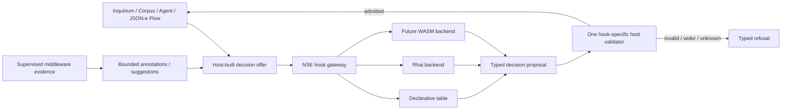

# Proposal 085: Operator-Sovereign Extensibility and Experiment Packages

Based on:

- `doc/normative/30-core-values/en/CORE-VALUES.en.md`
- `doc/project/40-proposals/019-supervised-local-http-json-middleware-executor.md`
- `doc/project/40-proposals/034-node-operator-binding-and-derived-node-assurance.md`
- `doc/project/40-proposals/044-host-owned-generic-module-store.md`
- `doc/project/40-proposals/049-json-e-middleware-transformer-executor.md`
- `doc/project/40-proposals/057-user-and-operator-notifications.md`
- `doc/project/40-proposals/063-inquirium-model-inquiry-organ.md`
- `doc/project/40-proposals/064-inquirium-implementation-recommendations.md`
- `doc/project/40-proposals/069-corpus.md`
- `doc/project/40-proposals/072-capability-registry.md`
- `doc/project/40-proposals/073-agent-orchestration-organ.md`
- `doc/project/40-proposals/076-federation-identity-and-network-selector.md`
- `doc/project/40-proposals/080-multiplexed-middleware-channel-executor.md`
- `doc/project/40-proposals/081-horizontal-protocol-primitives.md`
- `doc/project/40-proposals/082-sensorium-interfaces.md`
- `doc/project/40-proposals/084-sensorium-web-observation-connector.md`
- `doc/project/60-solutions/015-host-owned-module-store/015-host-owned-module-store.md`
- `doc/project/60-solutions/019-middleware/019-middleware.md`

## Status

Draft

## Date

2026-08-01

## Executive Summary

Orbiplex needs a deliberate path through which a node operator can alter local
resource envelopes, compose already granted capabilities, install decision
policies, and exchange reversible experiment packages without asking the core
project to predict every useful orchestration pattern. That path must increase
expressive power without creating a second source of authority.

This proposal defines **operator-sovereign extensibility**: many policy producers
may propose a typed decision, but one host-owned validator decides whether that
decision belongs to the exact offer already admitted by the owning component. A
table, Rhai program, or future WASM module does not authorize an effect by being
executable. It may select, order, narrow, defer, or raise caution inside a
host-supplied decision space. A supervised middleware process may contribute bounded
evidence or suggestions to that space but is not a direct decision backend in V1. A
JSON-e Flow may invoke and consume the admitted decision, but does not become another
policy backend.

The model adds eight related but separate mechanisms:

1. a classification of normative, boundary-safety, federated, and operational
   limits;
2. operator-signed resource envelopes whose revisions are append-only facts;
3. a runtime-agnostic NSE decision contract with a default declarative table
   backend and one validator per hook contract;
4. operator-declared monotonic guard hooks bound to host-registered admission
   anchors;
5. derived capability sets that are intersections of registered base
   capabilities, never new kinds of authority;
6. operator attention budgets and a named non-delegable core;
7. signed experiment packages containing policies, profiles, fixtures, and a
   mandatory refusal corpus, plus an explicitly enabled local import path for
   loose signed files;
8. signed distribution posture for builds that change the reviewed boundary
   baseline.

The proposal is cross-cutting rather than a new organ or domain feature. Inquirium,
Corpus, and Agent retain their semantics and authority owners. Middleware remains
replaceable mechanics. JSON-e Flow remains orchestration of already authorized
calls. Capability Registry remains the source of base capability identity. Sensorium
operational context remains source-owned evidence about live-system impact rather
than a general extension authority.

This proposal is post-MVP enablement. It must not reopen completed hard-MVP status
until a concrete hard-MVP story adopts one of its mechanisms.

## Context and Problem Statement

### Existing Power Is Unevenly Expressed

The current implementation already contains useful examples of operator-owned
policy:

- `CorpusReasoningRoomPolicy` carries typed room exposure, answer acceptance,
  chair mode, quorum, tie-break, revocation, budget, access list, and expiry;
- Agent production profiles are operator-defined, while built-in controller values
  are conservative developer defaults and child authority narrows monotonically;
- Inquirium `PromptAssemblyCaps` is data with positive-value and relational
  validation;
- JSON-e and JSON-e Flow let an operator compose transforms and already granted
  host calls;
- supervised middleware packages already have identities, signed package/config
  material, capability declarations, lifecycle, and host-owned execution
  boundaries.

Inquirium nevertheless mixes configurable policy with compile-time maxima. Some
constants express operation policy, such as candidate or label counts. Others
protect parsing, recursive validation, or memory allocation before an operator
policy can safely be consulted. Treating every `MAX_*` as either sacred or
arbitrary would be equally wrong. The repository lacks an explicit inventory and
classification rule.

### NSE Is a Contract Seed, Not Yet a General Extension Boundary

The `nse` crate correctly describes itself as a policy and orchestration boundary,
not a semantic core. It currently defines three hooks:

- `select-llm-model`;
- `before-broadcast-send`;
- `on-broadcast-received`.

The first hook selects one host-supplied runtime candidate. The two broadcast hooks
also admit arbitrary payload rewrites. Rhai is the only direct script backend.
Daemon integration proves the contract can remain advisory: the host filters the
candidate set first and revalidates the selected runtime before use.

The missing abstraction is therefore not "more Rhai". It is a stable family of
typed decision offers and validators that can have several producers. A common
selection such as "prefer a local model below 8B parameters when context is below
4K tokens" should be expressible as reviewable data. A novel scorer may use a
replaceable process to contribute bounded evidence to the offer, but the configured
decision backend and the one shared validator retain the decision boundary.

### Extension Mechanisms Answer Different Questions

Three existing mechanisms are complementary:

| Mechanism | Question answered | Authority boundary |
| :--- | :--- | :--- |
| JSON-e Flow | What already authorized calls occur, and in what order? | Flow grants and every called host capability remain authoritative. |
| NSE decision hook | Which offered alternative should be selected, ordered, narrowed, or refused? | The host-owned offer and hook validator remain authoritative. |
| Middleware package | How is replaceable mechanics implemented or how is evidence proposed? | Package identity, module grants, channel bounds, and the receiving host remain authoritative. |

Collapsing these mechanisms would make the system less expressive. Letting each of
them invent its own decision validation would make it unsafe. The desired design is
pluralism of producers with a single validation boundary for each decision
contract.

### Module Storage Is Not Package Installation

The Host-Owned Module Store persists small module-scoped JSON records. It does not
install binaries, activate executable packages, or validate arbitrary package
payloads. An experiment package therefore reuses the middleware package lifecycle
for executable material and the artifact/object stores for large immutable bytes.
The Module Store may retain host-owned activation records, policy projections,
cursors, and rollback metadata. It must not silently grow into a second package
manager.

## Goals

- Let an authenticated node operator replace conservative operational defaults
  with explicit local envelopes where doing so is safe.
- Keep protocol, signature, causality, authority, and refusal invariants
  non-configurable by extension packages.
- Make NSE a runtime-agnostic decision contract with several interchangeable
  producers and shared validators.
- Provide a declarative table backend before adding another embedded language.
- Let JSON-e Flow consume typed NSE decisions without growing a second policy
  language.
- Let supervised middleware propose features, scores, annotations, or candidate
  suggestions without becoming a direct decision backend or acquiring ambient host
  authority.
- Let operators declare new monotonic guard instances at registered host admission
  anchors without inventing semantic call sites.
- Allow named composition of existing capabilities through monotonic
  intersection.
- Make wider experimental policy visible, attributable, reversible, and bounded
  by context.
- Protect operator attention as a scarce resource and name operations that cannot
  be delegated or durably pre-approved.
- Make operator experiments portable through signed packages with provenance,
  compatibility bounds, rollback, and refusal evidence.
- Let a power user explicitly enable local loose-file import without making file
  discovery, installation, or activation implicit.
- Let a power user iterate through bounded, expiring session activations in
  `research` or `experimental` context without weakening durable activation.
- Let operators choose among installed domain behaviors and narrow closed semantic
  vocabularies without recompiling the Node or turning arbitrary strings into
  executable behavior.
- Preserve node sovereignty at federation boundaries through explicit declaration
  and intersection rather than a universal built-in resource ceiling.
- Preserve source-level freedom to rebuild the Node while making a changed boundary
  posture explicit to peers.
- Make the effective extension policy cognitively inspectable: an operator should be
  able to identify the decisive restriction, its source, and the material
  `requested -> effective` differences without reading a flat dump of every limit,
  registry entry, and federated declaration. Complete bounded provenance remains
  available through stable drill-down references.

## Non-Goals

- No arbitrary code execution merely because a schema, package, or artifact is
  signed.
- No schema that grants authority by validating successfully.
- No extension mechanism that bypasses Capability Registry, current grants,
  sanctions, revocation, classification, or effect admission.
- No content-derived authority. Model output, a prompt, a Room message, a file, or
  a web page may propose but never grant.
- No universal plug-in API that exposes daemon internals.
- No operator-declared hook that invents an unregistered execution point, merge
  direction, candidate set, or selecting behavior.
- No unbounded parser, allocator, queue, recursion, wall-time, or output behavior.
- No federation-wide default imposed by one node's local operator envelope.
- No automatic promotion of an experimental package to production or critical
  context.
- No requirement to implement WASM before the table backend and shared validators
  have operational evidence.
- No replacement for the middleware package lifecycle, Artifact Delivery, Module
  Store, JSON-e Flow, Inquirium, Corpus, Agent, or Sensorium.

## Terminology

| Term | Meaning |
| :--- | :--- |
| **Decision offer** | A bounded set of candidates, orderings, profiles, or restrictions admitted by the owning host component before policy runs. |
| **Decision producer** | A table, script runtime, or WASM module that returns one typed proposal for an exact offer. Supervised middleware contributes bounded evidence to the offer instead. |
| **Decision validator** | Host-owned, hook-specific logic that proves the proposal is contained in the offer and obeys normative and current policy constraints. |
| **Admission anchor** | A host-registered pre-effect or pre-scope gate with a closed projection and monotonic merge algebra to which operator guard policy may bind. |
| **Operational envelope** | Operator-authored limits and allowed choices for a declared component, operation family, and context. |
| **Boundary-safety limit** | A pre-policy parser, allocator, recursion, frame, or process bound required to evaluate untrusted input safely. |
| **Derived capability set** | A named intersection of registered base capabilities plus additional restrictions. It is not a new primitive authority. |
| **Experiment package** | A signed, inert package manifest that binds policy tables or scripts, envelopes, derived sets, prompt profiles, fixtures, and refusal evidence. |
| **Non-delegable operation** | An operation requiring a fresh live `node-operator-binding`; it cannot be authorized by an Agent, peer, middleware module, or remembered consent. |
| **Attention budget** | Operator policy limiting and grouping human-in-the-loop requests without ever converting exhaustion into approval. |
| **Distribution posture** | A signed claim about implementation/build identity and the boundary profile in force; it is accountable evidence, not automatic proof of the running binary. |

Posture `evidence/refs` are signed, content-addressed audit locators for the exact
local projection used to build the declaration. They are not independent peer
authority and are not treated as proof merely because they occur in a signed
posture. Peer admission remains based on the verified posture and declaration,
the exact semantic-entry bindings, and the receiver's current local trust and
revocation policy. A future evidence resolver may strengthen attestation, but
absence of such a resolver must not silently strengthen `self-declared` posture.
The distributor and operator may configure the receiver's minimum accepted
attestation strength; `self-declared` is only the compatibility default, not a
hard-coded ceiling.

## Proposed Model

### Decisions

- Limits are classified as normative, boundary-safety, federated, operational, or
  temporarily unclassified; a final boundary-safety classification requires
  checkable evidence.
- Decision production is plural, while admission remains singular and host-owned.
- Core-declared semantic hooks may select or order; operator-declared guard hooks
  may only restrict, narrow, or raise risk at registered host admission anchors.
- Multiple active producers compose deterministically under a hook-owned algebra;
  ambiguous selection and required-producer failure are refusals.
- Operator envelopes use one signed revision header with organ-owned typed profiles;
  the default table backend uses a closed hook-owned predicate vocabulary.
- Existing broadcast rewrites migrate to selection of host-registered transform
  profiles and remain subject to owning-boundary validation.
- Derived capability sets remain local overlays; federated proofs continue to name
  their registered base capabilities.
- The middleware package manifest is the canonical experiment container. A
  host-configured loose-signed-file import mode exists locally, is disabled by
  default, and converges on the same inert package and activation lifecycle.
- Corpus exchanges bounded signed envelope compatibility declarations and computes
  an intersection rather than disclosing complete local envelopes.
- Durable activation or envelope widening requires a fresh operator binding and a
  detached signature over the exact activation-plan digest.
- Python middleware may contribute bounded evidence or suggestions to an offer, but
  is not a direct NSE decision backend in V1.
- Active monotonic guards receive reserved execution budget; any explicitly admitted
  advisory fallback is visible as `partially-narrowed`, never as full policy
  application.
- Durable activation uses a journaled `planned -> committed -> finalized` transition;
  only the committed generation can become routable.
- A live-operator-only extension safe mode can remove extension policy from the path
  even when a required producer is permanently failing.
- Session activation is local, expiring, limited to `research|experimental`, and is
  never restored after restart or accepted as a federated envelope declaration.
- Operator defaults, operator-authored policy, and modified-distribution posture
  remain distinguishable in every effective-policy explanation.
- Extensible behavior is exposed through domain-owned, code-backed registries;
  normative state machines and protocol algebras remain closed, while operator
  configuration may only select or narrow entries admitted by the host.
- Extension packages are inert until locally activated and cannot create authority,
  suppress current revocation, or substitute for live-operator-only operations.

### 1. Four Classes of Limits

The implementation must classify every limit before moving it into configuration.

| Class | Owner | Examples | Runtime relaxation |
| :--- | :--- | :--- | :--- |
| **Normative invariant** | Protocol and constitutional architecture | signature domains, causal chain, authorize-before-effects, monotonic delegation, `unknown != success`, content is not authority | Never. A protocol revision is required. |
| **Boundary safety** | Host implementation and deployment profile | maximum pre-parse body, JSON depth, recursive schema complexity, frame size, process memory emergency bound | An extension cannot raise it. A host distribution may expose a separately reviewed deployment setting where evaluation remains safe. |
| **Federated compatibility** | Every participating node | accepted operation class, disclosure, TTL, room budget, extension digest, remote payload cap | The effective value is the intersection of declarations. Every node may be stricter or refuse. |
| **Operational policy** | Local node operator | candidate counts, token and time budgets, fan-out, retention, model preference, prompt assembly choices | Operator may raise or lower it inside boundary safety and current authority. Changes are signed facts. |

This fourth, boundary-safety class is necessary because a policy cannot protect the
host from an object that must already be parsed or allocated before the policy is
known. A constant is not automatically normative merely because it is compiled,
but neither is every size limit safe to make package-controlled.

A limit is classified as boundary safety only through a reviewed
`limit-classification.v1` record that names the threatened resource or failure mode,
the layer at which refusal occurs, and executable evidence that the limit prevents
that failure before operator policy is consulted. A limit without enough evidence
is `unclassified`, not silently operational and not permanently boundary safety. A
distribution may retain the current guard provisionally, but must expose that status,
an owner, and a `review-by` date. Passing that date does not remove the guard
automatically; it blocks P085 conformance and operator override on that axis until
review. The distribution cannot advertise an unclassified limit as a proven
federation safety property.

The implementation inventory is one host-validated
`limit-classification-registry.v1` envelope. Its stable `registry/ref` identifies the
review lineage, while a JCS `registry/digest` binds that ref, all classification
records, and every reviewed exclusion. A non-limit identifier, an alias of an already
classified limit, or a representation threshold that externalizes rather than
refuses data is represented as an explicit exclusion with source, reason, rationale,
owner, and review deadline. Those decisions must not survive only as source comments.
The source scanner traverses inline and file-backed modules and recognizes every Rust
unsigned integer width. A signed or floating-point limit candidate fails the audit;
a non-numeric candidate requires an explicit reviewed non-limit exclusion rather than
being silently ignored. An explicit zero is a valid limit value, for example zero
retries or zero inline items.

Review expiry is checked by a dedicated, named conformance test so that it cannot be
misreported as symbol or evaluated-value drift. It has no grace or bypass. The first
inventory remains one intentionally shared review cohort; later records and exclusions
receive their own explicit future deadlines when reviewed.

For numeric maxima, the effective value is normally the minimum. For allowed sets,
it is set intersection. For required caution or classification, it is the maximum.
For time horizons, the owning domain specifies whether smaller means safer; no
generic merger guesses this relation.

Conceptually:

```text
effective policy =
  boundary-safety profile
  INTERSECT operator envelope
  INTERSECT current task/session budget
  INTERSECT current restrictions and revocations
  INTERSECT every applicable remote declaration
```

### 2. Decision Producers Are Plural; Validation Is Singular

Every NSE hook owns one typed offer, one typed decision, and one validator. The
validator lives with the contract, not in Rhai, a table evaluator, WASM, Python, a
caller, or daemon route glue.



The validator must receive the exact offer digest and reject a decision produced for
another invocation. Unknown hook versions, unknown outcomes, missing candidates,
backend timeout, malformed annotations, and inconsistent offer bindings are typed
failures, never implicit allow.

Composition is part of the decision contract, not backend convention:

1. the signed local activation selects the active producers, their local priority,
   and whether each producer is `required` or `advisory`; a package may suggest but
   cannot assign its own effective priority; execution reserves budget first for all
   required producers and for every active `narrow`, `restrict`, or `raise-risk`
   producer, then orders each mode by descending local priority and package digest;
   inability to reserve every such bound is `producer/budget-unavailable` and refuses
   before producer execution;
2. every producer receives the identical offer and bounds and cannot observe another
   producer's result;
3. `narrow`, `restrict`, and `raise-risk` results fold with the hook-owned
   commutative meet or maximum operation;
4. `select`, `select-profile`, and `order` producers must agree on the exact admitted
   result; disagreement is `ambiguous-decision`, not a hidden tie-break;
5. failure of a required producer refuses the hook; failure of an advisory producer
   may be omitted only when the activation explicitly admits that fallback; an
   admitted result that omits a failed monotonic guard is marked
   `partially-narrowed`, names every omitted producer, and cannot satisfy a caller or
   remote declaration requiring the exact guard set;
6. if no producer yields an admitted result, the host uses an explicitly identified
   distribution default or refuses according to the hook contract. It never records
   the default as an operator decision.

The deterministic order is retained for execution budgets and audit, but cannot
change the algebraic result of monotonic guard classes. This prevents package order
from becoming ambient authority.

Per-request budget exhaustion is a producer failure, not absence of policy. It is
never converted into `defer-to-host` merely because a producer was labelled
`advisory`. The operator-visible result distinguishes `fully-evaluated`,
`partially-narrowed`, and `refused`; only the first proves that every activated guard
participated. The first two are projections of successful composition, while
`refused` is projected from the typed error branch; the operator read model must join
both sources rather than infer refusal from a boolean completion flag. A required
producer timeout or crash is always a refusal under this hook contract. `Defer` is an
explicit, successfully validated producer result and is never synthesized from a
backend failure.

### 3. Closed Hook Classes

New decision hooks belong to one of these classes:

| Hook class | Permitted result | Forbidden result |
| :--- | :--- | :--- |
| `select` | One or more members of the offered candidate set. | A synthesized candidate or capability. |
| `order` | A permutation or stable ranked subset of offered members. | An extra member or changed identity. |
| `narrow` | Reduced limits, scopes, audiences, grants, or expiry. | Any widened axis. |
| `restrict` | Allow an already admitted option, deny, defer, or request stronger review. | Granting authority absent from the offer. |
| `raise-risk` | The same or a higher impact, classification, or HIL requirement. | Lowering the host-computed floor. |
| `select-profile` | A reference to one host-registered transform, repair, or prompt profile. | Arbitrary replacement content or an inline executable transform. |

The first hook expansion should include:

| Organ / surface | Proposed hook | Contract class |
| :--- | :--- | :--- |
| Inquirium | `assemble-prompt` | `order` plus subset selection; required host-root and caution layers cannot be dropped. |
| Inquirium | `select-output-schema` | `select` from host-admitted schema refs. |
| Inquirium | `select-repair-profile` | `select-profile`; repair itself remains Inquirium mechanics. |
| Inquirium | `score-candidate` | `order`; score vocabulary and deterministic tie handling are hook-versioned. |
| Corpus | `select-turn-order` | `order` over currently eligible participants. At an already approved floor-effect boundary, the effective order may refuse an intent whose digest-bound target is not first, but it cannot rewrite that target after HIL. |
| Corpus | `weigh-bid` | `order` over admitted bids with bounded, auditable weight components. |
| Corpus | `resolve-tie` | `select` from the exact tied set. |
| Corpus | `admit-participant` | `restrict`; it may remove candidates but cannot bypass `access/list`, Room, grants, or sanctions. |
| Agent | `choose-next-step` | `select` from host-produced controller choices. |
| Agent | `shape-fanout` | `narrow`; children, budgets, grants, depth, and concurrency remain no wider than the parent and profile. |
| Agent | `classify-effect-risk` | `raise-risk`; it may require stronger HIL but never reduce the host floor. |

The host may additionally admit **operator-declared guard hooks**. Such a declaration
creates a named policy instance, not a new semantic call site. It must bind to a
host-registered admission anchor, such as `before-effect`, `before-scope-expansion`,
or an exact capability-owned gate, and may use only `restrict`, `narrow`, or
`raise-risk`. The anchor publishes its closed input projection, merge directions,
and admissible outcomes. The declaration cannot add an anchor, field, capability,
effect, candidate, or `select`/`order` behavior that the owning host component did
not register.

V1 closes executable guard semantics as data rather than accepting the Cartesian
product of enum values. The five canonical anchors admit `restrict/grant-set`.
`agent-effect-admission` additionally admits `narrow/budget` and
`raise-risk/operational-class`; every other anchor-operation-axis tuple is rejected
at signed declaration admission. All three Agent-effect meanings resolve under one
current operator/service snapshot. Budget maxima can only lower the host-offered
finite ceilings (or replace the established zero-as-unbounded sentinel with a finite
ceiling), while risk can only rise above the host floor. A configured guard maximum
MUST therefore be a positive finite value; `0` is reserved for the unbounded host
sentinel and is rejected as a producer ceiling. The first process-level consumer
proves the finite proposal budget and HIL escalation. A future backend or axis
expands this closed table explicitly; enum presence alone never creates an executable
guard meaning.

This closed matrix is an explicit pre-stable-package correction to the accepted V1
schema, which formerly admitted a Cartesian product that the host never executed.
Existing `restrict/grant-set` declarations remain valid. Any stored declaration in
another tuple was never executable and MUST be refused and reissued under one of the
seven canonical meanings; implementations MUST NOT reinterpret its old labels as a
different guard. This migration rule is intentionally fail-closed and is recorded
here instead of pretending that the former schema-only acceptance was runtime
compatibility.

Every admission anchor declares a boundary-safety maximum for active guard instances
and projected guard bytes. The operator envelope may set a lower
`guards/max-active-per-anchor`, and activation applies the minimum. Pending session
activations count toward the same bound. Exceeding it refuses the whole activation;
the host never truncates the guard list or audit fan-out silently.

For a guard, `allow` means only "this producer adds no further restriction". It is
never sufficient to pass the ordinary capability, sanction, revocation,
classification, HIL, or domain admission checks. This lets operators introduce new
policy combinations without inventing new authority or requiring the core to
predict every useful guard instance.

Only an admitted `restrict/grant-set` guard contributes a capability allowlist at
its anchor. A budget-only or risk-only guard preserves ordinary capability admission
and narrows only its named axis; the mere presence of a guard at an anchor does not
create a grant-set policy.

`repair-io` is deliberately not an arbitrary content-producing decision hook. A
policy may select an admitted repair profile; the owning Inquirium implementation
performs and validates the repair. This keeps semantic transformation out of the
policy boundary.

The existing broadcast `Rewrite` outcomes do not satisfy this restricted model and
must migrate to host-registered transform-profile selection. Each former rewrite
choice becomes a profile reference offered by the owning broadcast boundary. NSE may
select only one offered profile; the owning boundary performs the transformation and
then validates its schema, size, provenance, and current policy before any effect.
There is no legacy arbitrary-rewrite exemption in V1.

### 4. Declarative Table Backend First

The default backend is a closed, ordered rule table, not a general expression
language. A conceptual `nse-policy-table.v1` contains:

```json
{
  "schema": "nse-policy-table.v1",
  "schema/v": 1,
  "policy/id": "nse-policy:01K1...",
  "policy/name": "local-small-model",
  "hook/id": "select-llm-model",
  "hook/v": 1,
  "rules": [
    {
      "when/all": [
        {"field": "context/token-estimate", "op": "lte", "value": 4096},
        {"field": "candidate/location", "op": "eq", "value": "local"},
        {"field": "candidate/parameter-count", "op": "lt", "value": 8000000000}
      ],
      "decision": {"kind": "prefer-candidate"}
    }
  ],
  "default/decision": {"kind": "defer-to-host"}
}
```

The exact field paths and operators are hook-owned allowlists. No arbitrary property
walk, function call, regex engine, filesystem access, clock access, randomness, or
network access is implicit. Evaluation is deterministic over the supplied offer.
Rules are ordered, bounded in count and depth, and canonicalizable for review and
signature.

Rhai remains an opt-in backend for policies that exceed the table vocabulary. WASM
is a later backend for portable policies from less trusted authors. Both return the
same typed decisions and receive no host object other than the bounded invocation.

### 5. JSON-e Flow Calls Decisions; It Does Not Fork NSE

JSON-e Flow gains a typed `decision` step that invokes an NSE hook and branches on
its admitted outcome. It does not gain a parallel candidate-selection language.

```json
{
  "step/kind": "decision",
  "hook/id": "select-llm-model",
  "offer/ref": "$context.model_offer_ref",
  "bind/result": "model_decision",
  "on/refused": "fallback-local-policy"
}
```

The host resolves `offer/ref`; rendered flow data cannot construct or widen the
offer. The flow may inspect only the decision projection explicitly exposed by the
hook contract. It still needs its ordinary capability grants to perform later calls.

The reference host keeps these refs in a bounded, process-local registry rather than
in Flow state. An entry is bound to the exact Flow executor, hook, final offer digest,
producer activations, and aggregate producer budget; it expires after 60 seconds by
default on a monotonic process clock, is single-use by default, and disappears
unconditionally on restart. The host caps the registry at 256 live entries, rejects
TTLs above 300 seconds and reuse counts above eight, consumes an admitted use before
producer execution, and exposes only the hook-owned decision projection. The TTL
bounds authority lifetime, while the 30-second aggregate budget bounds one
resolution; neither value is derived from the other. Aggregate-budget refusal is
non-retryable for the same immutable offer and activation set, so changed inputs
require a newly admitted offer. Resolution writes a prompt-free trace of
refs, digests, producer refs, evidence count, status, and refusal code. The trace is
host-operator diagnostics rather than caller output: `lookup/status` distinguishes a
matched entry, an unknown offer, a foreign caller, an unavailable registry, and a
hook refused before registry lookup. The caller still receives the same
`identifier/invalid` refusal for unknown and foreign offers, while invocation and
offer-digest metadata remain absent unless lookup matched and caller authority was
valid. A matched but unknown hook may therefore retain bound entry metadata; this
asymmetry is intentional and must not be normalized into a caller-visible existence
oracle. The Flow id embedded in `caller/ref` uses one canonical segmented lowercase
ASCII grammar: `.`/`_`/`-` are internal separators only, so leading, trailing, or
adjacent separators and path-like values such as `..` fail closed at Flow loading,
offer registration, and trace-schema validation.

### 6. Supervised Middleware Proposes Through Bounded Contracts

A Python or other supervised module may compute features, candidate annotations,
scores, or a bounded candidate suggestion. In V1 it is not registered as a direct NSE
decision backend. The host admits its output as typed evidence in the offer, after
which the configured table, Rhai, or future WASM backend produces the decision. A
middleware suggestion is never an `nse-hook-decision.v1` merely because it names an
offered candidate.

The host binds module identity, declared hook, package digest, input schema, output
schema, timeout, payload cap, and invocation id before dispatch. The evidence schema
also states which closed offer fields may receive the resulting annotations. Unknown
annotations or a suggestion outside the candidate set are refused before decision
evaluation.

The reference daemon dispatches this contract through the ordinary supervised local
HTTP middleware executor. It checks the configured executor identity and transport
bounds against the host-owned binding, validates the complete returned middleware
decision, admits only a terminal `nse/evidence` return, and then rechecks package,
grant, schema, causal, offer-field, candidate, and byte bindings. Admitted evidence is
inserted under a reserved host-owned context key and the offer digest is recomputed
before registration. The opt-in reference Python package now executes a
content-addressed positive/refusal corpus before activation and proves the local
process path through the ordinary supervised HTTP runtime. Before dispatch and again
after the process responds, the daemon requires the exact producer to remain present
in the canonical durable activation. A caller-supplied package digest is never proof
of package activation, and revocation during execution prevents the evidence from
changing the final offer digest.

The conformance launch specification is host-owned data. It names the exact runner
implementation, optional interpreter, runtime implementation, and refusal-corpus
file. The host resolves each path canonically, requires root or daemon ownership,
rejects group/world-writable files and path components, rejects setuid/setgid bits on
every pinned file, pins file identity and SHA-256 at startup, and rechecks those pins
immediately before every invocation. An
optional working directory is likewise canonicalized, must resolve entirely through
root- or daemon-owned non-group/world-writable directories, and is revalidated before
the process is spawned. A
passing `operator-extension-conformance-report.v1` binds the package ref/digest,
refusal-corpus ref/digest, and configured runtime digest. A report from a substituted
runner, foreign runtime, or different corpus is therefore inert even when its counts
claim success. The host recomputes `report/digest` over the admitted canonical report;
the runner does not get to choose the content-addressed report identity.

The current Unix reference runner still performs the final process launch by the
verified canonical path. Consequently, a narrow residual TOCTOU window remains
between the last identity/digest check and `spawn`; exploiting it requires a local
actor able to replace that path despite the validated ownership and non-writable
ancestor policy. Fully eliminating this residual requires a descriptor-backed launch
that executes the already verified file (for example, an `fexecve`-equivalent design)
rather than reopening it by path. The current recheck is defense in depth, not a claim
of atomic verify-and-execute semantics.

No middleware proposal may:

- add a capability or candidate absent from the host offer;
- replace an actor, audience, classification, causal context, or operator binding;
- invoke an effect as part of decision evaluation;
- retain a host secret or receive unredacted context not required by the hook;
- convert timeout, crash, malformed output, or `unknown` into allow.

Middleware that implements replaceable mechanics should continue to expose domain
results through its owning organ rather than disguising mechanics as policy.

### 7. Operator Resource Envelopes Are Signed Facts

The common contract should use a shared signed header plus organ-owned typed limit
profiles rather than one unbounded map interpreted differently everywhere.

Conceptual shape:

```json
{
  "schema": "operator-resource-envelope.v1",
  "schema/v": 1,
  "envelope/id": "operator-envelope:01K1...",
  "revision/no": 3,
  "supersedes/ref": "operator-envelope:01K0...",
  "scope": {
    "component": "inquirium",
    "operations": ["classify", "rerank", "generate"]
  },
  "experiment/classes": ["research", "experimental"],
  "profile/schema": "inquirium-resource-profile.v1",
  "profile/digest": "sha256:437a145249927075dce53a02fc3b802b1a7c655495440a8f8f3c0ec16d41f38c",
  "profile": {
    "schema": "inquirium-resource-profile.v1",
    "schema/v": 1,
    "profile/ref": "profile/inquirium/operator-research",
    "limits": {
      "classify/labels-max": 16,
      "rerank/candidates-max": 32,
      "text-operation/input-bytes-max": 1048576
    }
  },
  "operator/binding-ref": "node-operator-binding:01JZ...",
  "reason": "local taxonomy research",
  "issued-at": "2026-08-01T12:00:00Z",
  "expires-at": "2026-08-08T12:00:00Z",
  "signature": {}
}
```

The common header owns identity, revision, provenance, temporal validity, scope, and
signature. The profile schema owns field vocabulary and relational validation. The
host refuses unknown profile schemas or profile keys. A package may request an
envelope but cannot sign or activate it on behalf of the operator.

The accepted `inquirium-resource-profile.v1` payload is a sparse overlay over a
closed vocabulary of 38 operational axes derived from the reviewed limit registry.
An omitted axis inherits the preceding source and never means unbounded. V1 resolves
the source chain `distribution-default -> operator-local-config -> operator-envelope
-> task-session` once. Unsigned local and task/session overlays are tighten-only:
maximum axes use `min`, while the required context minimum uses `max`. A signed
operator envelope may widen the compiled default only for an axis carrying an
explicit distribution-configured safety range and only inside that range; it cannot
undo an unsigned local restriction. Missing or exceeded ranges refuse rather than
silently retaining a looser proposal. Equal declarations retain the preceding value
and provenance. The nine reviewed
boundary-safety limits are absent from the schema and remain non-overridable
pre-policy guards.

The first implementation vertical accepts a local operator overlay from daemon
configuration, records the complete effective profile, winning source per axis,
source refs, and canonical digest in prompt-free classify/rerank traces, and applies
the same effective limits to both request and response validation. The next vertical
adds accepted, closed `operator-resource-envelope.v1` and
`operator-resource-envelope-revocation.v1` contracts, an exact active local
`node-operator-binding.v1` signature gate, monotonic revisions, append-only
activation/supersession/revocation/expiry facts, SQLite recovery, and immediate
fallback to unsigned local configuration only when no active signed fact exists or
the active fact has reached a valid revocation or expiry transition. An active
committed fact that cannot be parsed, verified, or tied to the exact current operator
binding is an integrity or authority failure: startup recovery and affected runtime
operations fail closed instead of silently widening to unsigned configuration.

Signed-envelope V1 makes scope executable rather than descriptive. Its local
operation vocabulary is closed to the thirteen host-owned resource operations, its
experiment-class vocabulary is closed to `production`, `research`, `experimental`,
and `critical`, and every profile axis must belong to one declared operation. The
runtime applies an envelope only to
an exact operation-and-class match and rechecks the exact current operator binding
at every applicable use. Calls without an explicit experiment class are
`production`. The signed-envelope V1 profile may contain any of the 38 operational
axes because every axis now has an owning local runtime boundary. The accepted
operation scope must include at least one operation that enforces each supplied axis;
unknown or out-of-scope axes remain fail-closed.
The runtime sources task/session tightening and performs bounded signed-envelope
widening through the distribution safety-range map. Federated use carries a complete
`inquirium-federated-resource-profile.v1` projection and is intentionally narrower:
only the ten operations backed by a portable Inquirium operation descriptor may
cross that boundary; host-only `assistant.turn`, `assistant.feedback`, and
`operator.question` scopes remain local. The federation-owning transport supplies
an independently authenticated peer id to one narrow daemon port. That port verifies
the node-signed posture publication, exact peer/envelope/profile digests, current
local operation-registry agreement, runtime ref, and operation both at admission and
immediately before inference, then applies the stricter local/peer intersection.
Remote declarations never become local operator authority and no local runtime
substitute is inferred.
This distinction is normative: a local config overlay is an explicit
`operator-local-config` source and is not evidence of a signed operator fact. Changing
the distribution range changes node posture and must become externally distinguishable
when `P085-021` posture publication is completed.
Profile refs are operator-visible provenance identifiers and MUST NOT encode secrets
or sensitive free text; prompt-free traces may retain them for causal reconstruction.
The ref `profile/inquirium/distribution-default` is reserved for the distribution
source and MUST be rejected when supplied by an operator or task/session overlay.

Profile vocabulary and runtime enforcement are separate contracts. The current
vertical binds all 38 operational axes to local request, response,
prompt/output-schema, conformance, memory, locale, feedback, operator-question,
image, training, embedding, classification, reranking, or text-operation boundaries.
An implementation MUST retain the direct registry-to-enum-to-boundary drift gate and
negative tests; merely adding a future profile property does not make it enforced.
Federated transport remains a separate authority contract and MUST NOT be inferred
from local signed-envelope enforcement.

Digest grammars remain contract-local in this revision. The reviewed
limit-classification registry uses JCS V1 with a 43-character base64url SHA-256
payload, while the effective resource profile uses JCS with NFC-normalized strings
and a 64-character lowercase hexadecimal SHA-256 payload. Both retain the `sha256:`
prefix. Implementations MUST validate against the owning contract rather than a
generic `sha256:*` parser. The signed envelope freezes `profile/digest` to the
effective-profile grammar: JCS with NFC-normalized strings and a 64-character
lowercase hexadecimal SHA-256 payload. Its Ed25519 signature covers the same JCS+NFC
canonical envelope with `signature` removed, wrapped in the exact
`operator-resource-envelope.v1` domain; revocation uses its own
`operator-resource-envelope-revocation.v1` domain.

An envelope revision is an append-only fact. Activation, supersession, expiry,
revocation, and rollback produce separate facts or an immutable revision chain. The
runtime read model may cache an effective envelope, but startup and warm recovery
must rebuild it from current signed facts and current policy.

The effective read model always distinguishes `distribution-default`,
`operator-envelope`, and `federated-intersection` sources. When no operator envelope
applies, it reports `operator-policy: absent` and the exact distribution-default
profile digest. Absence never becomes an implied operator choice merely because the
host can continue safely.

The Inquirium implementation begins with an inventory of every
`INQUIRIUM_MAX_*`/`BASELINE_*` constant. Each item must be classified as normative,
boundary-safety, federated, or operational. Only the operational items are migrated
to an operator profile. A broad pre-parse byte cap and schema complexity bounds
remain host safety controls even when a lower operation cap becomes configurable.

### 8. Federated Use Is Explicit Intersection

An operator envelope is local authority. It cannot make a peer accept larger input,
longer execution, wider disclosure, more participants, or a less cautious effect.

The local operator-policy admission boundary accepts only declarations whose
authority is local and directly attributable to the current operator binding:
`capability-derived.v1`, `operator-guard-hook.v1`, and
`operator-attention-budget.v1`. `federated-envelope-declaration.v1` and
`node-extension-posture.v1` are node-signed public federation projections. They
must use the publication and peer-evaluation path defined by this section and must
not be inserted into the local operator-policy store merely because they share the
same validation library. This keeps local policy authority separate from evidence
published about the node.

For a Corpus deliberation that uses extension policy, the signed Corpus invitation
or later policy fact containing `CorpusReasoningRoomPolicy` should bind
`envelope/ref` and `envelope/digest` for the requester/chair policy declaration.
Each participant supplies a signed compatibility declaration for its own effective
envelope or refuses the room. The effective room policy is the intersection of:

- the validated Corpus room policy and budget bound by that signed artifact;
- the requester's declared envelope;
- each participating node's local envelope;
- current Room, capability, sanction, revocation, and operational-context policy.

This policy-envelope intersection must not be confused with semantic-entry
compatibility. For the finite semantic-entry set explicitly required by the owning
protocol, receiver admission is all-or-nothing: every required entry must occur in
the peer declaration, remain locally available, and agree exactly on entry revision,
canonical digest, and implementation ref. One absent, revoked, or mismatched entry
refuses the complete evaluation; the receiver never starts the Room on a smaller
supported subset. Entries declared by the peer but not required by the owning
protocol remain inert evidence.

The envelope reference does not replace `budget`; it explains which operator policy
admitted that budget and hook set. A peer verifies the digest and compatibility, not
the private local configuration behind it. A node may disclose only the bounded
public projection necessary for negotiation.

Changing an active room envelope creates a new signed policy revision. It never
silently changes the semantics of an already signed turn or answer.

Source freedom remains explicit: an operator may rebuild or fork the Node with
different boundary-safety values. Such a build is a different distribution posture,
not a runtime package override. Before federated use it publishes a signed
`node-extension-posture.v1` declaration containing at least the implementation
profile, build digest, limit-classification digest, boundary-profile digest, and
whether the distribution baseline was modified. A self-signed posture is an
accountable declaration, not proof that the running binary matches the claim;
reproducible-build, measured-boot, or third-party evidence may strengthen it. Remote
nodes apply local trust policy and may restrict or refuse a modified or insufficiently
attested posture.

### 9. Derived Capabilities Are Intersections, Not Registry Bypasses

`capability-derived.v1` names a composition such as:

```json
{
  "schema": "capability-derived.v1",
  "schema/v": 1,
  "capability/id": "~corpus/reviewer@participant:did:key:z6Mk...",
  "components": [
    {"capability/id": "inquirium.generate", "grant/ref": "grant:..."},
    {"capability/id": "corpus.room.turn", "grant/ref": "grant:..."}
  ],
  "restrictions": {
    "room/ids": ["room:01K1..."],
    "output/schema-refs": ["corpus-reasoning-turn-proposal.v1"],
    "expires-at": "2026-08-01T18:00:00Z"
  },
  "operator/binding-ref": "node-operator-binding:01JZ...",
  "signature": {}
}
```

The effective grant is recomputed at every admission from all current components
and restrictions. Revocation, expiry, quarantine, or narrowing of any component
immediately narrows or invalidates the derived set.

P072 remains the source of identity and eligibility for base capabilities. A
derived set uses the existing sovereign/custom identifier grammar but lives in a
separate operator overlay. It does not obtain a new wire name, signing domain,
advertisement eligibility, passport eligibility, or host route merely by existing.
Federated use requires explicit policy support and proof of the underlying base
capabilities.

### 10. Operational Context Bounds Promotion, Not Truth

P082's `sensorium-operational-context.v1` remains the authoritative description of
the impact class of a published Sensorium resource. P085 must not turn Sensorium
vocabulary into a universal authority object.

An experiment activation may nevertheless use the same ordered vocabulary:

```text
research < experimental < test < production < critical
```

This is an activation and caution class. When a Sensorium source participates, the
effective class is the maximum of the activation class, every current source-owned
operational context, and the local host floor. No extension may lower it.

Wide or unreviewed extension packages default to `research` or `experimental`.
Promotion to `test`, `production`, or `critical` is a new signed activation fact
requiring stronger conformance evidence and current operator approval. A higher
class does not create the isolation, redundancy, or review required by that class;
the host must verify those prerequisites separately.

The effective class and exact source/context digests propagate through P081 causal
context, operation traces, Agent evidence, Corpus turn/answer provenance, and effect
receipts without promoting free-form source summaries to privileged instructions.

### 11. Operator Attention Is a Bounded Sovereign Resource

`operator-attention-budget.v1` should define at least:

- operator and node binding scope;
- request classes, such as `effect-consent`, `package-activation`,
  `authority-change`, and `security-notice`;
- maximum prompts per rolling window;
- one or more availability windows with an IANA time-zone identifier and bounded exceptional
  overrides;
- grouping key and maximum group size;
- minimum repeat interval for equivalent requests;
- timeout and expiry behavior;
- outside-window behavior: defer until the next window or deny, never approve;
- whether overflow is grouped, deferred, or denied;
- an emergency/security lane that remains visible but is itself aggregated.

Exhaustion never grants authority. The only automatic outcomes are grouping,
deferral, denial, or a bounded summary notification. A producer cannot bypass the
budget by changing wording while retaining the same canonical operation digest.
Outside an availability window, ordinary HIL requests follow the declared defer or
deny policy. For a request admitted during an active window, the host computes one
effective deadline as the earliest of the request expiry, budget declaration expiry,
request-timeout deadline, and end of the contiguous active availability interval.
An exact replay retains the already persisted deadline rather than extending it.
If no current signed budget matches the request class, the domain-owned request
expiry remains the explicit distribution baseline and is not presented as operator
policy. A later budget revision does not mutate an existing question fact; timeout,
cancellation, or supersession is a separate explicit lifecycle transition.
The security lane may bypass the quiet window for visibility, but not for approval
or authority.

Equivalent requests append independent operator-question facts while sharing one
bounded attention-group projection anchored to the first visible notification. The
projection exposes only question refs, counts, timestamps, security class, and budget
identity; prompt, answer, and grouping-key content remain absent. The host derives the
grouping identity from the request class and a closed canonical semantic descriptor. A
bounded declared operation, argument, or manifest digest sharpens that descriptor when
present;
when absent, the missing value remains explicit and never falls back to the per-attempt
`operation/ref`. Prompt wording, operation and question refs, expiry, metadata, and
caller-selected response idempotency keys are excluded, so they cannot fragment a
semantically equivalent group. Startup and ordinary
admission perform bounded expiry reconciliation. Active reads also fence by current
time, so an interrupted sweep cannot resurrect an expired group. Restart scans the
entire fixed store ceiling, while normal admission performs a smaller pass and, only
under capacity pressure, one bounded global stale-event reclamation before refusal.

The operator may prefer class-level consent, for example an exact action-catalog
entry or bounded argv prefix, where the existing consent contract allows it. Such a
choice remains a scoped, expiring, revocable grant. It is not inferred merely to
reduce prompt volume.

### 12. A Named Non-Delegable Core

The host must maintain a checked policy class, `live-operator-only`, for operations
that require a fresh authenticated `node-operator-binding` and cannot use remembered
consent. An extension may add operations to this class locally but cannot remove the
distribution baseline.

The initial inventory should evaluate at least:

- federation-root and node-root key ceremony changes;
- trust-root or package-signing-authority admission;
- disabling or materially weakening audit and trace policy;
- changing the non-delegable baseline itself;
- permanent or public authority grants;
- HSM/recovery unseal and equivalent root recovery operations;
- promotion of an unreviewed extension into `production` or `critical` context.
- entry into or exit from extension safe mode and forced extension deactivation.

Being non-delegable does not mean one click is sufficient. Existing multisig,
quorum, role separation, or legal/governance policy continues to apply. The rule
only states that no Agent, peer, middleware module, Flow, script, or durable consent
can substitute for the required live operator participation.

The daemon must expose an **extension safe mode** whose admission path does not invoke
NSE, package backends, operator guard hooks, or middleware modules. A fresh live
operator binding may use it to revoke session activations, deactivate or quarantine
one or all extension packages, restore explicit distribution defaults, and request a
projection rebuild. Safe mode cannot activate a package, widen an envelope, grant a
capability, or suppress ordinary audit. Its enter, recovery, and exit actions are
append-only facts and remain available when an organ is refusing because a required
producer is permanently unavailable.

### 13. Experiment Package

`operator-experiment-package.v1` is a signed P085 submanifest of the existing
middleware package manifest and artifact mechanisms. It is the canonical portable
container and contains refs and digests, not arbitrary unbounded inline content:

- package identity, version, author, source, and canonical digest;
- compatible Node, hook-contract, schema, and profile versions;
- requested NSE hook registrations and backend kinds;
- suggested producer priority and required/advisory mode, which local activation
  must accept or replace explicitly;
- policy-table, Rhai, or future WASM module refs;
- requested resource-envelope profile and context classes;
- derived capability-set definitions;
- prompt and output-schema profile refs;
- required base capabilities and module grants;
- an exact `middleware-component-contract.v1` ref and digest on every supervised
  middleware package referenced as executable material when that component
  provides or requires another supervised component or declares an effect;
- positive conformance fixtures;
- mandatory refusal corpus;
- migration, rollback, expiry, and uninstall declarations;
- disclosure, egress, filesystem, process, and retention requirements.

The V1 component contract intentionally contains no per-effect ordering or deadline
fields. Its only lifecycle order comes from the exact `requires[]` graph; execution
deadlines remain properties of the selected executor or runtime contract and must be
enforced there rather than merely declared by a package.

Installation is inert. Activation requires an operator-visible plan showing:

- which resources become wider or narrower;
- which hooks and candidate fields become visible;
- which base capabilities are required;
- that no derived set widens authority;
- which local files, processes, endpoints, stores, and egress classes are used;
- the provider-first start order, dependent-first stop order, and recovery class of
  every declared effect;
- the refusal-corpus result;
- the effective operational class;
- the rollback path.

Author signatures prove package provenance, not local trust. Local activation is
bound to the current node operator and package digest. Durable activation or envelope
widening requires a fresh validated `node-operator-binding` and a detached operator
signature over the exact canonical activation-plan digest. Editing signed material
makes the package stale and requires a new digest and activation.

The package signing key is resolved only through the current node trust roots and an
admitted `package-signing-authority` binding. A key or certificate carried inside the
package is untrusted input and can at most name a candidate for a separate admission
ceremony; it never validates the package that contains it.

The middleware package directory owns executable package material and sidecars.
Artifact/object stores own large immutable assets. The Host-Owned Module Store may
hold activation projections, cursors, bounded policy state, and rollback metadata.

For local power-user work, the host additionally exposes
`operator_extensions.allow_loose_signed_files`, with a required default of `false`.
Only host configuration may enable this mode; a package, Flow, middleware module, or
remote declaration cannot turn it on. When enabled, an authenticated operator may
import individually signed, content-addressed files from explicitly admitted local
roots. The host validates every signature and digest, then materializes a deterministic
local `operator-experiment-package.v1` projection whose `container/mode` is
`loose-file-import` and whose `distribution/eligible` value is `false`.

Loose files are therefore an alternative local ingress form, not a second package
manager or activation model. The host does not watch, install, or activate them merely
because they appear on disk. Import must still bind compatibility, dependencies,
refusal corpus, operational class, exact source digests, rollback behavior, and the
ordinary inert-install and signed-activation sequence. A changed file invalidates the
materialized projection and requires a new import and activation. Portable exchange
requires repackaging into the canonical signed middleware container.

An already installed, verified, and conformant package may also receive a **session
activation** for rapid local iteration. It requires a fresh authenticated operator
session and current `node-operator-binding`, but not the detached signature required
for durable activation. The activation binds the exact plan and package digests, has
a mandatory short TTL, is limited to `research` or `experimental`, and expires on
operator-session end, explicit revocation, TTL, or daemon restart. It cannot change
trust roots, the non-delegable baseline, durable envelopes, durable derived sets,
`production|critical` policy, or any federated declaration. Start, use, refusal,
expiry, and revocation remain audit events even though the activation itself is not
recovered.

Package dependencies on `derived-capability/refs` are resolved only under the exact
operator binding carried by the durable or session activation. A declaration signed
under another currently active operator binding cannot satisfy that dependency. The
same exact-binding rule is rechecked before each producer use, so package activation
does not turn another operator's local overlay into shared ambient authority.

Durability means that a signed activation generation can be reconstructed after a
restart; it does not make the issuing operator authority permanent. Before every
producer use, the host revalidates the exact current `node-operator-binding` carried
by either a durable or session activation. Binding revocation, supersession, expiry,
or loss therefore fences new use synchronously. Session audit `recorded_at` is the
host observation time, and the store admits at most one fact for each
`(package/ref, activation/ref, event-kind)` tuple.

### 14. Refusal Corpus Is Part of the Package Contract

Every experiment package includes machine-readable negative fixtures proving at
least that:

- a decision cannot select a candidate absent from the offer;
- a hook cannot add a grant, actor, audience, or capability;
- a child/fan-out decision cannot widen parent limits;
- an effect-risk decision cannot lower the host floor;
- unknown hook versions and outcomes fail closed;
- expired, superseded, or revoked envelopes are refused;
- a revoked base capability invalidates the derived set;
- attention-budget exhaustion does not grant;
- a non-delegable operation rejects Agent, peer, middleware, Flow, and remembered
  consent authority;
- package crash, timeout, malformed output, and replay do not become success;
- causal context and package/envelope digests cannot be changed by policy output.

The package may add domain-specific refusals. Passing the corpus is necessary but
not sufficient for activation; it is evidence, not certification of safety.

### 15. Audit and Recovery

The host appends immutable facts for:

- envelope issue, activation, supersession, expiry, and revocation;
- package install, verification, refusal-corpus result, activation, rollback, and
  uninstall;
- activation transition planning, commit, finalization, interruption, and recovery;
- session activation start, use, expiry, revocation, and restart discard;
- derived capability-set activation and invalidation;
- hook invocation metadata, backend identity, offer digest, decision digest,
  validator outcome, registered refusal code, and bounded diagnostic projection;
- attention-budget consumption, grouping, overflow, and operator response;
- non-delegable admission and refusal;
- effective use of a distribution default while operator policy is absent;
- extension safe-mode entry, forced deactivation, projection rebuild, and exit;
- distribution-posture publication, supersession, and evidence changes.

Raw prompts, model outputs, package secrets, and private source content are absent
from default operator traces. Content is referenced by classification-aware digest
or artifact ref when needed.

On restart, the runtime first discards every session activation, then rebuilds durable
active generations, envelopes, derived sets, and attention projections from the
canonical journal and signed facts plus current registry, grants, sanctions,
revocations, trust roots, and package inventory. A missing package, changed digest,
unknown hook, failed refusal corpus, or no-longer-admitted base capability produces a
quarantined or inactive extension. It does not block unrelated daemon services unless
the extension was explicitly configured as readiness-critical.

## Contract Family

The first implementation should freeze these contracts before runtime effects:

| Contract | Purpose |
| :--- | :--- |
| `limit-classification.v1` | Versioned classification, proof obligation, review owner, and review deadline for one implementation limit. |
| `enum-classification.v1` | Machine-checked classification of one discovered domain enum as a closed invariant, configurable subset, code-backed registry candidate, or temporarily unclassified subject. |
| `dispatch-classification.v1` | Machine-checked classification of one discovered hard-coded semantic dispatch site, including its owning domain, branch fingerprint, disposition, and review deadline. |
| `operator-resource-envelope.v1` | Shared signed revision header and typed profile binding. |
| `operator-resource-envelope-revocation.v1` | Signed terminal revocation of the exact active envelope. |
| `inquirium-resource-profile.v1` | Operator-owned Inquirium operation limits after constant classification. |
| `nse-hook-offer.v1` | Common invocation identity, hook/version, offer digest, backend bounds, and causal context. |
| `nse-hook-decision.v1` | Common decision binding to hook/version, invocation, offer digest, producer, and typed outcome. |
| `nse-middleware-evidence.v1` | Bounded feature, score, annotation, or candidate suggestion admitted into a closed offer; never a direct NSE decision. |
| `operator-extension-refusal-code.v1` | Closed versioned refusal vocabulary shared by hook, package, envelope, guard, and activation boundaries. |
| `operator-extension-refusal.v1` | Bounded diagnostic binding one refusal code to producer, hook or anchor, affected axis, winning declaration, invocation, and causal context. |
| hook-specific offer/decision payload schemas | Closed candidate, guard-axis, and outcome vocabulary for each hook. |
| `operator-guard-hook.v1` | Signed local binding of a guard policy to one registered admission anchor and a closed monotonic hook class. |
| `nse-policy-table.v1` | Deterministic ordered declarative rule table. |
| `capability-derived.v1` | Signed local intersection of registered base capabilities plus restrictions. |
| `operator-attention-budget.v1` | HIL request limits, grouping, availability windows, timeout, and overflow/outside-window policy. |
| `operator-experiment-package.v1` | Portable manifest over policies, profiles, capabilities, fixtures, rollback, and exact domain-owned semantic-entry registrations. A package may carry hooks, semantic entries, or both, but never an empty executable declaration. |
| `middleware-component-contract.v1` | Transport-neutral exact provides/requires graph plus effect-recovery declarations for supervised package components. It creates lifecycle order, not authority. |
| `operator-extension-activation.v1` | Durable local activation or promotion fact bound to operator and package digest, including local producer priority and required/advisory mode. |
| `operator-extension-session-activation.v1` | Local expiring `research|experimental` activation bound to a live operator session and discarded on restart. |
| `operator-extension-transition.v1` | Journaled activation, rollback, revocation, or safe-mode transition with expected generation and `planned|committed|finalized|failed` state. |
| `operator-extension-revocation.v1` | Durable local revocation fact and bounded reason. |
| `operator-extension-conformance-report.v1` | Positive and refusal-corpus results bound to an exact package, refusal corpus, and host-pinned runtime combination. |
| `operator-extension-inspection.v1` | Bounded prompt-free local read model of safe mode, package identity, active producer composition, lifecycle state, conformance, session activation, revocation, and current operator-attention usage/groups. |
| `operator-effective-policy-inspection-input.v1` | Prompt-free owner-supplied composition input joining the audited extension view with Inquirium axes, domain registries, federation evidence, and explicit unavailable sources. |
| `operator-effective-policy-inspection.v1` | Cognitively bounded summary of material default/request/effective differences, the decisive restriction, separate domain/federation views, and stable bounded drill-down refs. |
| `operator-extension-loose-import.v1` | Disabled-by-default request for one detached-signature-bound, content-addressed file below a host allowlisted root. |
| `operator-extension-import-receipt.v1` | Inert import receipt proving exact package and artifact identity without activation authority. |
| `operator-extension-conformance-run.v1` | Request to run a host-owned bounded conformance runner for one installed package. |
| `operator-extension-conformance-run-result.v1` | Passing result projection bound to the package and persisted report identity. |
| `federated-envelope-declaration.v1` | Legacy bounded public compatibility projection without exact semantic-entry bindings. |
| `federated-envelope-declaration.v2` | Node-signed compatibility projection binding the exact domain, entry ref, revision, implementation ref, and entry digest required by a federated consumer. |
| `node-extension-federation-publication.v1` | Atomic carrier for one signed node posture and one exact v2 declaration bound to that posture digest. |
| `node-extension-posture.v1` | Signed distribution/build and boundary-profile declaration with optional stronger attestation evidence. |
| `node-extension-posture-evaluation.v1` | Narrow prompt-free receiver projection of an admitted peer posture, exact declaration, local effective profile, and bounded effective entry set. |

All security-gate schemas are closed by default. Optional evolution uses explicit
versioned extension namespaces. Schema acceptance never implies package activation,
capability admission, or effect authority.

## Named Invariants

- `inv-extension-content-not-authority`: content can propose but cannot grant,
  register, bind, delegate, or activate authority.
- `inv-extension-agent-flow-stratified`: an operator-authored Flow may order or
  condition already admitted Agent passages, but Agent retains lifecycle, budget,
  grant, and product authority; Inquirium retains inference and prompt assembly;
  Corpus retains Room admission and publication.
- `inv-extension-agent-passes-bounded`: every operator-defined inference passage
  consumes explicit Flow, Agent, Inquirium, token, cost, and wall-time budgets; no
  branch, retry, or repetition creates an unmetered side loop.
- `inv-extension-agent-final-product-explicit`: a terminal Agent outcome names one
  host-admitted product from the exact passage lineage; neither newest-product nor
  last-writer-wins behavior may select it implicitly.
- `inv-extension-agent-intermediate-not-ambient`: an intermediate inference product
  has an explicit classification and visibility, is content-addressed when retained,
  and never becomes a Room turn, Corpus answer, effect, or later prompt input merely
  because it exists.
- `inv-extension-agent-no-hidden-reasoning-contract`: Orbiplex contracts may request
  separate bounded inference passages and structured intermediate products, but do
  not request, preserve, or expose a model's private token-level chain of thought.
- `inv-extension-offer-contained`: every admitted decision is contained in the exact
  host-built offer identified by its digest.
- `inv-extension-many-producers-one-validator`: every backend for one hook uses the
  same hook-specific host validator.
- `inv-extension-boundary-limit-proven`: a final boundary-safety classification has
  a versioned evidence record and a pre-policy refusal test for the concrete failure
  it prevents; an unproven limit remains visibly unclassified.
- `inv-extension-monotone-authority`: hooks and derived sets may only preserve or
  narrow effective authority.
- `inv-extension-composition-cannot-widen`: activating or reordering several
  producers cannot produce authority wider than any host-built offer or current
  restriction; ambiguous selecting results and required-producer failures refuse.
- `inv-extension-guard-budget-reserved`: every active monotonic guard has budget
  reserved before execution; omitted advisory guards are reported as
  `partially-narrowed`, never full policy application.
- `inv-extension-risk-raise-only`: extension policy may preserve or raise caution,
  classification, and HIL requirements, never lower the host floor.
- `inv-extension-unknown-not-success`: unknown, timeout, crash, malformed output,
  incompatible version, or unavailable policy is never success.
- `inv-extension-causal-chain-fixed`: policy cannot replace actor, operator binding,
  causal context, offer digest, or source provenance.
- `inv-extension-federated-intersection`: a local envelope cannot compel a peer;
  federated execution uses the intersection of all current declarations.
- `inv-extension-derived-no-new-authority`: a derived capability set has no authority
  outside the current intersection of its base grants and restrictions.
- `inv-registry-entry-no-new-authority`: a registry entry executes only under
  authority already admitted at its invocation point; required capability ids are
  current-use preconditions and never grants.
- `inv-registry-decision-revision-bound`: every registry-backed decision and effect
  fact binds the exact entry ref, revision, implementation ref, and canonical digest,
  so replay never consults current mutable registry configuration.
- `inv-registry-empty-set-refuses`: an empty effective registry intersection is a
  typed refusal and never falls back to a built-in, distribution-default, or
  previously active implementation.
- `inv-extension-install-inert`: package installation and schema acceptance do not
  activate behavior.
- `inv-extension-package-trust-external`: package signing authority is resolved from
  current admitted trust state, never from key material carried by the package.
- `inv-extension-transition-journaled`: coupled activation state becomes routable
  only through one committed generation in the canonical transition journal.
- `inv-extension-cache-current-facts`: no cache entry or compiled object can establish
  eligibility without a current activation, revocation, restriction, and generation
  check.
- `inv-extension-safe-mode-recoverable`: a live operator can remove extension policy
  from the execution path without invoking that policy.
- `inv-extension-session-activation-ephemeral`: session activation is local,
  `research|experimental`, TTL-bounded, and discarded rather than recovered after
  restart.
- `inv-extension-live-operator-only`: a non-delegable operation cannot be authorized
  by Agent, peer, middleware, Flow, script, or remembered consent.
- `inv-extension-attention-default-deny`: an exhausted, expired, or unanswered HIL
  request cannot become approval.
- `inv-extension-operator-not-substituted`: absence of operator policy uses an
  explicitly identified distribution default and is never recorded or displayed as
  an operator decision.
- `inv-extension-modified-distribution-disclosed`: a build that changes the declared
  distribution boundary baseline cannot claim the unmodified extension posture.
- `inv-extension-recovery-revalidates-current-policy`: restart never restores an
  extension solely because it was active before shutdown.
- `inv-extension-refusal-closed-and-diagnosable`: every refusal uses a registered code
  and identifies the deciding boundary and winning restriction without leaking
  protected content.
- `inv-extension-effective-policy-explainable`: the default operator projection shows
  the decisive restriction, its source, and material `requested -> effective`
  differences before optional bounded detail; complete provenance remains reachable
  through stable refs, and summary, explanation, and graph views cannot disagree about
  the deciding fact.
- `inv-extension-identifiers-canonical`: every new semantic identifier uses its
  registered prefix and canonical suffix validator; a display label never substitutes
  for identity.

## Concrete Scenario

An operator installs a package named `local-small-model-deliberation` containing:

- an Inquirium resource profile raising local rerank candidates from the developer
  default to 512 in `research` and `experimental` contexts;
- a table policy preferring local models below 8B parameters for contexts below 4K
  tokens;
- a Corpus bid scorer that orders only already admitted bids;
- an Agent fan-out policy that selects at most three children while preserving the
  parent budget and grants;
- a JSON-e Flow that invokes the model-selection decision and then calls an already
  granted Inquirium capability;
- a refusal corpus proving absent-candidate, widened-child, lowered-risk, revoked
  capability, and timeout failures.

The host verifies the package and shows an inert activation plan. The operator signs
one expiring activation. Corpus publishes an envelope ref and digest in its room
policy. A remote node accepts only if its local envelope is compatible and may use a
stricter candidate or token cap. The package changes orchestration and resource use,
but it cannot add a participant, grant a capability, publish an answer, actuate a
system, lower a Sensorium impact class, or bypass HIL.

## Implementation Guidance

### Layering

Recommended strata:

```text
protocol schemas
  signed facts, manifests, closed offers/decisions, conformance reports

nse
  runtime-agnostic hook DTOs, offer digests, hook-specific validators

nse-table / nse-rhai / future nse-wasm
  replaceable decision producers; no authority or effects

organ cores
  Inquirium, Corpus, and Agent candidate construction and domain validation

host policy
  operator envelopes, capability intersections, restrictions, HIL, non-delegable core

daemon composition
  persistence, package lifecycle, backend supervision, recovery, operator APIs

node-ui / CLI
  inspect plan, sign activation, compare revisions, revoke, diagnose
```

No generic extension core should absorb Inquirium prompt semantics, Corpus election
semantics, Agent lifecycle, Capability Registry admission, or Sensorium impact
meaning. Shared code owns mechanics and algebra; each organ owns its vocabulary.

### Reuse Map

This proposal introduces algebra and identity, not new infrastructure. Treat a
deviation from this mapping as a recorded decision rather than an implementation
detail.

| Need | Existing owner | Do not build |
| :--- | :--- | :--- |
| Canonical digest inputs for offers, decisions, tables, envelopes, packages | `canonical-json` | per-call serialization for digests |
| Causal context, receipts, cursors on every hook invocation | `horizontal-protocol-core` | private correlation ids or trace shapes |
| Base capability identity and eligibility | `capability`, Capability Registry (P072) | a second registry behind derived sets |
| Operator identity, consent scopes, single-use consumption, durable-grant allowlists | `operator-consent-core` | a parallel approval store for activation |
| Append-only operator sidecars and effective config merge | `config-sidecar-core` | direct mutation of module config trees |
| Package identity, signature, activation, provenance | middleware package lifecycle, Solution 015 | a second installer inside Module Store |
| Bounded periodic revalidation of envelopes and packages | `replay-scheduler`, Solution 020 | private timer loops |
| Activation or conformance work outliving one request | `deferred-operation`, Solution 029 | untracked background threads |
| Supervised backend processes and channel bounds | `middleware-supervisor`, `middleware-channel-core` | bespoke process wrappers |
| Durable facts with an explicit time axis | `temporal-event-log`, `storage-sqlite` conventions | ad hoc JSON directories |
| Operator-visible grouping and delivery of attention requests | `notification-core`, `notification-store` (P057) | a private prompt queue |
| Contract enforcement at every boundary | `schema-gate` | application-level shape checks |

### Crate Purity Guard

`nse` must be enforced contract-only, not merely described as such. The repository
already carries this mechanism for `agent-core`, `corpus-core`, `inquirium-core`, and
their host counterparts: build guards that fail on banned dependencies **and** on
banned source terms. Add an equivalent guard in the same commit that first expands
`nse`, banning at minimum script runtimes, WASM engines, HTTP clients, database
drivers, async runtimes, filesystem and process access, and clock or randomness
sources. Determinism of the decision boundary is a property that must be mechanically
checkable, because it is the reason several untrusted backends can share one
validator.

Dependency direction is one-way: `nse` knows nothing about `nse-table`, `nse-rhai`,
`nse-wasm`, the organs, or the daemon.

Validator uniqueness should be enforced by the type boundary, not only by naming or
source lint. Backends return an untrusted `DecisionProposal<T>`. Only the
hook-specific validator inside `nse` can construct an opaque
`AdmittedDecision<T>`, and organ/host effect paths accept only that admitted form.
Compile-fail tests prove that backend crates cannot construct it. Dependency guards
also reject backend-owned admission APIs, but the unforgeable admitted type is the
mechanical authority boundary.

### Offer Identity and Decision Binding

The offer digest is the anti-replay primitive of this whole design, so specify it
before any backend exists.

```json
{
  "schema": "nse-hook-offer.v1",
  "schema/v": 1,
  "hook/id": "select-llm-model",
  "hook/v": 1,
  "invocation/id": "nse-invocation:01K1...",
  "offer/digest": "sha256:...",
  "causal/context-ref": "causal:01K1...",
  "policy/source": "operator-envelope",
  "operator/binding-ref": "node-operator-binding:01JZ...",
  "envelope/refs": ["operator-envelope:01K1..."],
  "backend/bounds": {
    "wall-time-ms": 250,
    "output-bytes": 16384,
    "fuel": 1000000
  },
  "candidates": [],
  "context": {}
}
```

The digest is computed with `canonical-json` over the offer with `offer/digest`
removed, and it must cover `hook/id`, `hook/v`, `invocation/id`, the exact ordered
candidate identities, the projected context, and `causal/context-ref`. Omitting
`invocation/id` or the causal ref would let a decision produced for one request be
replayed into another with an identical candidate set — the same class of defect the
node already guards against with generation and boot-nonce fencing elsewhere.

Every decision carries `hook/id`, `hook/v`, `invocation/id`, and `offer/digest`. The
validator compares all four before examining the outcome, and a mismatch is a typed
refusal rather than a fallback to the host default. `policy/source` is required;
`operator/binding-ref` is required only when an operator-authored policy participates.
Backend identity and package digest are checked during producer dispatch and recorded
with elapsed time. They do not replace semantic containment validation, while elapsed
time still enforces the declared execution bound.

### Field Projection and Table Evaluation

Give each hook one host-owned projector that flattens its offer into a closed map
before any producer runs:

```text
project(offer) -> BTreeMap<&'static str, Scalar>
Scalar = Bool | Int | FixedDecimal | String | Enum
```

`FixedDecimal` has a schema-owned scale and rounding rule with one canonical textual
form. Binary floating-point, NaN, infinity, and backend-local coercions are excluded
from the shared table contract so Rhai, WASM, Python-supplied evidence, and Rust
tables cannot describe the same score differently because of numeric representation.

Strings compare as unsigned bytes of their exact canonical UTF-8 encoding. The table
evaluator performs no Unicode normalization, locale-dependent collation, case folding,
or backend-specific coercion. A hook that needs normalized text must publish the
normalized value as a separate host-owned projected field with a versioned rule; a
backend cannot normalize it privately.

The projector is the entire vocabulary a table may reference. Two consequences follow
and both matter: a table can never walk arbitrary structure, and predicate evaluation
is an `O(1)` map lookup rather than a path traversal. Fields absent from the
projection are not addressable, so extending the vocabulary is a deliberate,
reviewable act on the hook contract.

Evaluation is a single ordered pass with no backtracking, bounded by declared rule
and predicate counts, giving `O(rules × predicates-per-rule)` with no allocation
inside the loop. Fold semantics differ per hook class and must be stated in the
contract rather than left to the evaluator:

| Hook class | Fold over matching rules |
| :--- | :--- |
| `select`, `select-profile` | first match wins; unmatched falls to `default/decision` |
| `order` | first matching rule supplies the ranking; later rules are ignored |
| `narrow` | every match applies; per-axis minimum |
| `restrict` | every match applies; deny wins over defer, defer wins over allow |
| `raise-risk` | every match applies; per-axis maximum |

Compile tables into an evaluation structure at **activation** time, not per
invocation. The pure compiled object is content-addressed by table digest, hook
contract digest, and compiler-profile digest, but dispatch eligibility is a separate
fact-bound binding keyed by activation generation and package digest. A table digest
alone can never make compiled policy executable. Predicate operators are a closed
hook-owned allowlist; there is no regex engine, no arithmetic on untrusted strings,
and no user-defined function.

### Merge Algebra Is Data, Not Scattered Code

Section 1 states that numeric maxima take the minimum, allowed sets intersect, caution
takes the maximum, and time horizons are domain-specified. Implement that once. Each
profile schema annotates every field with its merge direction:

```json
{
  "classify/max-labels": {"type": "integer", "merge/direction": "min"},
  "allowed/model-locations": {"type": "array", "merge/direction": "intersect"},
  "hil/minimum-class": {"type": "string", "merge/direction": "max"},
  "session/max-wall-time-ms": {"type": "integer", "merge/direction": "domain:agent"}
}
```

One generic folder consumes those annotations across the boundary-safety profile,
operator envelope, session budget, current restrictions, and every remote declaration.
Only a host-registered profile schema may define merge directions; an experiment
package may reference that schema but cannot add or override its annotations. A field
without a declared direction is a schema error, not a default, because the silent
default is precisely where a widening bug would hide. `domain:*` directions dispatch
only to a named, tested function registered by the owning organ.

This is also what makes the effective-policy explanation in the operator UI possible:
the folder can return, per field, the winning value and which declaration supplied it.

### Operator Inspection Has a Cognitive Budget

Completeness of an inspection payload is not sufficient if the operator must manually
join dozens of limits, several domain registries, and peer declarations to explain one
decision. The default read model therefore presents information progressively:

1. a bounded summary of effective posture and lifecycle health;
2. material differences from the distribution default and from the requested policy;
3. the decisive restriction and its immediate source for an admission or refusal;
4. separate domain-registry and federation sections rather than one flattened list;
5. stable refs and digests through which the operator may request bounded provenance
   and the complete effective-policy projection.

The summary is a projection of the canonical facts, not a second policy model. It may
omit unchanged detail from the initial view, but it must not hide an effective
restriction, invent causality, or make the detailed projection unreachable. Acceptance
uses a realistic five-domain, 38-axis, federated fixture and requires `inspect`,
`explain`, and `graph` to identify the same decisive restriction and source without
exposing prompts, model output, signatures, or protected payload content.

The optional composition input is trusted host-side transport between fact owners and
the read model, not a signed policy artifact. The inspector verifies its embedded
extension facts against the extension owner store, while the composing host must
obtain resource-axis, domain-registry, and federation facts from their owning strata.
The inspector validates bounds, source accounting, and canonical ordering, but must
not duplicate those strata's resolution or certification logic. Its append-only audit
digest identifies the exact resulting projection for later comparison; the digest is
not independent proof that the supplied owner facts were true.

### Inquirium Constant Audit

The migration must produce a checked table with one row per current maximum:

| Field | Current constant | Class | Pre-parse bound | Operator profile key | Federation relevance | Decision |
| :--- | :--- | :--- | :--- | :--- | :--- | :--- |

The audit must explicitly cover text/image input, labels, rerank candidates,
embeddings, prompt adjustments, repair attempts, output-schema complexity, control
payloads, memory, flow nodes/edges, feedback, locales, and assistant output. A value
may have both a hard boundary-safety cap and a lower operator default. Removing a
constant without identifying the earlier safe boundary is a review failure.

**Proof obligation for the boundary-safety class.** The boundary-safety class is the
one place where this proposal could quietly re-centralize the power it intends to
devolve, because any inconvenient limit can be relabelled as a safety bound. Close
that door with a checkable rule: every limit finally classified as boundary safety
carries a test demonstrating the concrete failure it prevents, such as allocation
growth, recursion depth, parser blowup, frame exhaustion, or unbounded wall time, and
the test refuses the over-limit input before policy is consulted. Absence of evidence
does not prove that relaxation is safe: the value remains visibly `unclassified` and
blocks completion of the classification task. The current guard may remain after its
`review-by` date to avoid an unsafe automatic relaxation, but the implementation then
loses P085 conformance for that axis and cannot enable an operator override until the
review closes. The classification table is a reviewed, versioned artifact rather than
a source comment, so an operator can inspect and contest the reasoning through
ordinary proposal review rather than a private patch.

### Storage and Recovery

Every new SQLite store follows the repository Storage and Database Schema Design
rules: explicit migrations, WAL, `busy_timeout`, foreign keys, idempotency keys,
bounded pages, and one canonical recovery owner. Prefer existing operator-consent,
module-store, temporal-log, and package sidecar stores over creating another database
when their ownership and key model fit.

The first operator-resource-envelope store uses schema version 1, a 64 MiB main
database page ceiling, and an 8 MiB WAL checkpoint target. It retains immutable
revision and lifecycle facts without compaction in this vertical; reaching the main
database ceiling refuses further admission rather than deleting authority history.
Startup and the explicit mutating reconcile transition rebuild runtime state from the
canonical active fact. `GET` status is a pure read and may report effective expiry
without appending an expiry fact or changing runtime state; lifecycle reconciliation
is exposed separately as a mutating operation.

### Activation Journal and State Machine

Extension activation follows the existing local-model package transition pattern:
stage and validate all inputs, write one canonical journal record, atomically commit
the active generation, then finalize derived projections and external side effects
idempotently. The canonical activation store is the source of routability. Module
Store records, compiled bindings, caches, UI projections, and backend processes are
rebuildable consequences, not parallel authority.

The durable commit binds in one generation at least the package and plan digests,
passing conformance report, envelope revision, derived-set refs, guard bindings,
producer priorities and modes, expected previous generation, operator binding, and
detached signature. When all values share one SQLite database, the active generation,
activation fact, and journal state change in one transaction. When bytes or
projections have different storage owners, they are staged first and referenced by
digest; only the canonical `committed` journal transition makes them eligible. A
post-commit side effect has an idempotency key and is replayed from the journal.

The read model joins three orthogonal state machines rather than flattening package,
activation, and transition state into one enum. Package lifecycle is:

| Package state | Entered by | Allowed next states |
| :--- | :--- | :--- |
| `absent` | no accepted package identity | `staged` |
| `staged` | bounded import/download and exact digest plan | `installed`, `quarantined`, `absent` |
| `installed` | immutable bytes and inert manifest committed | `verified`, `quarantined`, `uninstalled` |
| `verified` | signature, trust-root, compatibility, and schema checks pass | `ready`, `quarantined`, `uninstalled` |
| `ready` | fresh passing conformance report exists | `quarantined`, `uninstalled`; it may originate new activation generations without leaving `ready` |
| `quarantined` | package integrity, trust, compatibility, or conformance fails | `verified` or `ready` after new evidence, `uninstalled` |
| `uninstalled` | no live activation/rollback refs remain and owned bytes are released under retention policy | `staged` as a new install |

Each activation generation has a separate lifecycle:

| Activation state | Entered by | Routable? | Allowed next states |
| :--- | :--- | :--- | :--- |
| `session-active` | admitted expiring local session activation over a `ready` package | local session only | `expired`, `revoked`, `quarantined` |
| `active` | durable activation generation commits over a `ready` package | yes, after current-policy check | `superseded`, `expired`, `revoked`, `quarantined`, `rolled-back` |
| `superseded` | a newer generation commits | no | terminal for this generation |
| `expired` | activation or envelope validity ends | no | terminal for this generation |
| `revoked` | a current revocation fact commits | no | terminal for this generation |
| `quarantined` | activation binding, recovery, or current-policy validation fails | no | terminal; a repaired package uses a new activation generation |
| `rolled-back` | a previous `ready` package is activated as a new current generation | no for the retired generation | terminal for this generation |

`unclassified` is an activation blocker reported by `limit-classification.v1`, not a
package or activation lifecycle state. Repeated valid transitions are idempotent by
transition ref and exact request digest; every disallowed transition returns a typed
refusal. Expiring or revoking one generation does not destroy the independently
verified package or silently reactivate an earlier generation.

The transition journal itself has the following interruption semantics:

| Journal state | Authority meaning | Restart or interruption resolution |
| :--- | :--- | :--- |
| `planned` | no active authority; all referenced material remains staged | resume validation or abort and clean staging; never route |
| `committed` | the named generation is canonical, but finalization may be incomplete | revalidate current facts, rebuild bindings/projections, replay idempotent side effects, then finalize; affected routes stay degraded until this succeeds |
| `finalized` | canonical state and projections agree | ordinary current-policy checks continue on every use |
| `failed` | no new generation became authoritative | retain bounded diagnostics, release inactive staging, and permit a new transition ref |

A revocation, expiry, supersession, safe-mode action, or trust-root change uses the
same journal. Its committed fact wins immediately even when cache invalidation or
backend shutdown is still being finalized.

### Runtime Cache, Projection, and Temp Lifecycle

The runtime keeps content caches separate from authority bindings. Every structure
introduced by this proposal has an owner, key, bound, cleanup path, indexes where
durable, and restart rule:

| Structure | Owner and key / idempotency | Bound and retention | Cleanup and indexes | Restart and authority rule |
| :--- | :--- | :--- | :--- | :--- |
| Pure compiled-table cache | `nse-table`; `(table-digest, hook-contract-digest, compiler-profile-digest)` | operator entry/byte cap below a boundary-safety cap plus bounded idle TTL | memory LRU by last use and bytes | starts empty; compiled content is inert and cannot be dispatched without a current fact-bound binding |
| Activation-to-compiled binding cache | host extension policy; `(activation-generation, package-digest, hook-id, hook-v, table-digest)` | active-producer and per-anchor caps; lifetime no longer than the activation | synchronous invalidation on committed revoke, expiry, supersession, safe mode, trust, sanction, or restriction change; index by generation and package | rebuilt only from current committed facts; digest equality never preserves eligibility across invalidation |
| Effective-envelope cache | host policy; `(scope, envelope-fact-high-water, restriction-generation, remote-declaration-digests)` | entry/byte cap and idle TTL shorter than mandatory policy revalidation | LRU plus invalidation indexes by envelope, operator binding, sanction, revocation, and remote declaration | starts empty and folds current facts; cached value never bypasses a current generation check |
| Per-invocation offer projection | NSE gateway; `(invocation-id, offer-digest)` | one bounded projection per active invocation and the hook byte cap | drop on completion, cancellation, or invocation deadline | never persisted or recovered |
| Attention rolling-window projection | operator consent/notification owner; `(operator-binding, request-class, grouping-key, window-id)` | bounded buckets, groups, records, bytes, and maximum window horizon | expiry index plus bounded periodic compaction that preserves active windows | rebuilt from durable consumption facts; absence or corruption denies rather than resets the budget |
| Package and loose-file staging | middleware package lifecycle; `(import-operation-id, idempotency-key, source-digest)` | file, byte, operation, and staging-TTL caps | cleanup index by state and expiry; cleanup cannot remove committed or referenced material | resume an exact planned import or discard stale staging; never infer installation or activation from files on disk |

The important split is between a reusable compiled value and permission to execute
it. Revocation may leave a pure compiled object in the bounded LRU until eviction,
but synchronously removes every fact-bound dispatch binding. No lookup path accepts a
table digest without the current activation generation and current policy check.
Cleanup never removes an active invocation, current attention window, committed
generation, referenced rollback target, or material still owned by a planned
transition.

V1 deliberately has no generic cache-invalidation command or cross-owner mutable
cache service. It has a closed, read-only runtime-state ownership registry. Each
descriptor names one state id, exactly one owner, a positive finite capacity, a
revision key, durability, restart policy, and use-time fence. The current registry
contains compiled content, NSE offers, operator attention, and the Inquirium resource
profile projection. Their owners respectively fence on active package generation;
host incarnation plus caller, TTL, and remaining uses; attention budget revision,
window, and expiry; and exact envelope revision, digest, operator binding, and expiry.
The host exposes this registry for inspection and a structural test requires the
exact four-owner set. This common description does not weaken or replace the
domain-specific revalidation performed at use.

### Refusal Vocabulary and Diagnostics

`operator-extension-refusal-code.v1` is a closed, versioned vocabulary. V1 includes
at least:

```text
contract/unknown-schema
hook/unknown
hook/version-mismatch
offer/digest-mismatch
offer/invocation-mismatch
decision/not-contained
decision/ambiguous
decision/unknown-outcome
producer/budget-unavailable
producer/required-failed
producer/output-malformed
producer/timeout
producer/crash
package/signing-authority-untrusted
package/digest-mismatch
package/conformance-failed
activation/plan-stale
activation/operator-binding-missing
activation/signature-invalid
activation/state-conflict
activation/session-not-eligible
guard/anchor-unknown
guard/cap-exceeded
guard/semantic-unsupported
identifier/invalid
policy/revoked
policy/expired
extension/safe-mode
```

Hook-specific additions require a new vocabulary version rather than free-form codes.
Every declared code has at least one negative fixture that reaches it, every emitted
code belongs to the registry, and an unreachable declared code or unregistered emitted
code fails contract coverage in CI.

`operator-extension-refusal.v1` carries the code and retryability plus the relevant
producer/backend/package ref, hook id and version or admission anchor, affected axis
or field, invocation and offer digests, causal ref, and the declaration ref/digest
that supplied the winning restriction. `partially-narrowed` outcomes additionally
name omitted advisory producers. Operator text is derived from these bounded fields;
classified values, prompts, source content, and secrets remain redacted or represented
only by permitted refs and digests.

### Identifier Grammar

New identifiers are opaque correlation handles with exact prefixes and uppercase
Crockford-Base32 ULID suffixes:

| Family | Canonical grammar |
| :--- | :--- |
| NSE invocation | `nse-invocation:<ULID>` |
| NSE offer | `nse-offer:<ULID>` |
| Operator envelope | `operator-envelope:<ULID>` |
| NSE policy | `nse-policy:<ULID>` |
| Operator guard hook | `operator-guard-hook:<ULID>` |
| Limit classification | `limit-classification:<ULID>` |
| Limit-classification registry | `limit-classification-registry:<ULID>` |
| Extension transition | `operator-extension-transition:<ULID>` |

Validators enforce the exact ASCII prefix and a 26-character ULID suffix using the
alphabet `[0-9A-HJKMNP-TV-Z]`; Unicode separators, case folding, whitespace, digest
fallbacks, and display names are rejected. Stable human labels live in separate
`*/name` fields. Code must not infer authority or behavior from the prefix beyond
selecting the registered validator for the already known field.

### Schema Gate Registration Checklist

Every P085 contract follows the ten-point checklist in
[P084, Schema Gate registration is a checklist, not a step](084-sensorium-web-observation-connector.md#schema-gate-registration-is-a-checklist-not-a-step):
family variant, validator static, contract spec, public and private validators, all
embedded aliases, embedded source, positive and negative examples, and family
coverage membership. Canonical `orbidocs` schemas, Node mirrors, both fixture sets,
and generated coverage move in one change. Partial registration is a CI failure even
when the crate compiles.

### Capability and Ledger Mapping

Before exposing a new host route or module-invokable hook, register every formal
capability id in P072 and add Node implementation-ledger rows. Internal pure function
calls do not need invented capability ids. Derived capability sets do not become
base registry entries merely to satisfy tooling.

### Validation Order

For every invocation:

1. bound transport/frame admission before parse;
2. schema gate;
3. caller, operator, package, hook, and current-policy admission;
4. host offer construction and canonical digest;
5. bounded producer execution;
6. hook-specific decision validation against the exact offer;
7. owning organ validation;
8. effect/HIL admission where applicable;
9. append-only audit and typed response.

No producer executes between validation steps 1 and 4. No effect occurs before step
8.

### Hot-Path Cost

Several proposed hooks sit on paths executed many times per request rather than once
per session — `assemble-prompt`, `score-candidate`, `weigh-bid`, and `select-turn-order`
in particular. A decision boundary that is safe but slow will be disabled by operators,
which is the same outcome as not shipping it. Four measures keep the cost honest:

- project the offer once per invocation and share the projection across every producer
  for that hook;
- resolve the effective envelope once per session or request and cache it under the
  complete fact-high-water and restriction generation, invalidating it on every
  relevant envelope, revocation, sanction, remote-declaration, or operator-binding
  change;
- keep pure compiled tables in the bounded content cache, while resolving executable
  eligibility only through the current activation-generation binding;
- declare a total policy-evaluation budget per request alongside the per-invocation
  bounds and reserve every active monotonic guard before execution, so a chain of
  cheap hooks cannot aggregate into an expensive request or disappear silently.

Report per-hook invocation counts, backend wall time, and refusal counts as ordinary
metadata. The first acceptance run should record them for a request with no active
extensions and for one with a representative package, so the cost of sovereignty is a
measured number rather than an assumption.

### Operator HOWTO: Publish and Inspect Federation Posture

The operator configures the Corpus receiver with exact trusted peer node ids,
whether a modified distribution baseline is acceptable, and exact revoked
implementation refs or semantic-entry digests. The daemon validates those sets at
startup. `operator-extensionctl posture <http://loopback:port> <authtok-file>` reads
the local node-signed publication; after an invitation is admitted,
`operator-extensionctl peer-posture <http://loopback:port> <authtok-file>
<corpus-room-invite:id>` reads the stored prompt-free comparison. Neither command
grants trust, changes policy, or activates a package.

A package that supplies domain semantics lists each entry in `semantic-entries` by
exact domain, entry ref, revision, implementation ref, and digest. The signature
therefore covers the executable semantic identity rather than only a package ref.
The package may also provide policy hooks, but a semantic-only package does not need
a placeholder hook. Installation remains inert; conformance, signed activation,
current capability checks, generation fencing, and owning-domain admission are all
still required before use.

### Federation FAQ

**Does a locally available equivalent implementation satisfy a remote declaration?**
No. Receiver evaluation requires the exact declared implementation and entry digest.
A semantically similar local entry is not a fallback.

**Does a signed posture prove which bytes are running?** No. It is accountable
node-signed evidence. Restart-bound local trust policy decides whether self-declared
posture is sufficient or a configured stronger attestation is required.

**What happens when trust, a capability, an implementation, or an entry digest is
revoked?** New selection refuses immediately. Historical facts retain the exact
generation and digest under which they were admitted; they are not reinterpreted.

**Why is the peer comparison prompt-free?** It is an authority trace, not a content
trace. Refs, digests, the effective entry count, and local/peer profile digests are
sufficient to explain admission without exposing package payloads, prompts, model
output, or signatures.

## Trade-offs

### Benefits

- Power users can innovate without waiting for every policy to become a built-in
  Rust branch.
- Declarative tables cover common policy with reviewable, diffable data.
- The same decision contract supports table, Rhai, and future WASM producers, while
  supervised middleware can contribute bounded evidence without multiplying
  authorization code.
- Resource freedom becomes attributable and reversible rather than hidden in local
  patches.
- Federated peers negotiate compatibility without surrendering local sovereignty.
- Refusal corpora make negative behavior a distributable part of extension quality.

### Costs

- Every hook needs a typed offer and a semantic validator; a generic JSON callback is
  intentionally insufficient.
- Operator UIs must explain effective intersections, provenance, and revocation.
- Envelope revisions and package activation add durable facts and recovery work.
- Fact-bound invalidation, activation journaling, and refusal-code coverage add
  implementation and test surface that simple content caching would avoid.
- Derived capability sets require careful projection and invalidation.
- Table vocabulary will not express every novel policy, so Rhai/WASM remain useful.

### Deliberate Asymmetries

- The operator may widen operational budgets but cannot relax normative authority or
  boundary safety through a package.
- A remote peer may always be stricter and refuse an offered envelope.
- An extension may increase caution but cannot lower it.
- Installation may be automated; durable activation and non-delegable operations
  require stronger operator participation.
- Session activation reduces iteration ceremony only by being local, short-lived,
  non-federated, restart-discarded, and restricted to `research|experimental`.
- Positive package provenance does not imply local trust.

## Failure Modes and Mitigations

| Failure mode | Consequence | Mitigation |
| :--- | :--- | :--- |
| Compile-time safety limit is mislabeled operational and removed | memory, parser, or recursion exhaustion before policy | mandatory constant audit; retain an earlier hard boundary and test over-limit refusal before migration |
| Ordinary operational limit is mislabeled boundary safety | operator sovereignty is silently reclaimed by the distribution | `limit-classification.v1`, concrete failure evidence, pre-policy refusal test, review owner/deadline, and visible `unclassified` state |
| Every backend validates its own output | inconsistent authority and backend-specific bypasses | one hook-specific validator in `nse`; opaque `AdmittedDecision<T>`; compile-fail backend tests reuse golden offers and refusals |
| Hook synthesizes a new candidate or capability | extension creates ambient authority | closed offer identity; membership/subset validation; no generic arbitrary JSON decision |
| Operator-declared hook invents an execution point or merge axis | local policy becomes hidden host semantics | bind only to registered admission anchors and host-owned monotonic axes; reject `select` and `order` declarations |
| Package assigns itself priority or a required producer fails open | package ordering or failure bypasses a restriction | local activation owns priority and required/advisory mode; required failure refuses; selecting disagreement is ambiguous |
| An advisory monotonic guard is skipped after budget exhaustion | effective policy is wider than the activated guard set while appearing complete | reserve every monotonic guard before execution; refuse unavailable budget; mark an admitted failure fallback `partially-narrowed` with omitted producers |
| Too many guards bind to one anchor | latency and audit fan-out grow despite a per-request time budget | boundary and operator caps on active guards and projected bytes; refuse activation rather than truncate |
| Existing broadcast rewrite remains an arbitrary payload replacement | payload semantics change outside the claimed offer-contained model | migrate every rewrite to selection of a host-registered transform profile and revalidate the result at the owning boundary |
| JSON-e Flow grows its own selection DSL | two policy vocabularies drift | one `decision` step calling NSE; Flow only branches on admitted outcome |
| Python middleware suggestion is treated as an admitted decision | replaceable mechanics becomes a direct policy root | admit only bounded evidence or candidate suggestions into the closed offer; table, Rhai, or WASM remains the configured direct decision backend |
| Python module receives daemon internals | replaceable mechanics becomes semantic authority | bounded invocation schema, redacted fields, module grants, timeout, no host object references |
| Derived capability is advertised as primitive authority | peers cannot prove its scope or revocation | require base proofs; local overlay by default; no automatic passport or advertisement eligibility |
| Envelope signature is accepted as effect authority | operator resource policy bypasses operation grants | envelope only bounds an already authorized call; normal capability/HIL checks remain required |
| Wide local envelope is imposed on peers | federation loses node sovereignty | explicit compatibility declaration and effective intersection; peer may refuse |
| Recompiled node claims the stock boundary posture | peer evaluates the wrong safety baseline | signed build/profile posture, explicit modified-baseline flag, local trust policy, and optional stronger build evidence |
| Source impact class is lowered by experiment metadata | agents act on a live system with false caution | maximum across activation, source-owned contexts, and host floor |
| Prompt fatigue causes blanket approval | human process becomes the weak link | attention budgets, grouping, class-level scoped consent, default deny, non-delegable core |
| Quiet hours are ignored | the swarm controls when the operator must attend | availability windows, bounded overrides, defer/deny outside windows, and visibility-only security bypass |
| Security alerts consume the ordinary attention budget | critical notice is hidden | separate aggregated security lane; never convert suppression into success |
| Distribution default is displayed as operator policy | operator is falsely attributed a decision they did not make | explicit `operator-policy: absent` plus distribution profile digest in read model, audit, and UI |
| Package author signature is treated as trust | malicious package activates automatically | inert install, local operator activation, refusal corpus, grants, sandbox, and current-policy validation |
| Conformance runner changes process authority or is replaced between verification and launch | privileged or substituted code runs under daemon authority | reject setuid/setgid and unsafe ownership/modes; pin device, inode, and digest; recheck immediately before launch; retain the narrow path-based verify-to-spawn race as an explicit residual until descriptor-backed execution is implemented |
| Package validates a key carried inside itself | a self-consistent attacker-controlled key is mistaken for provenance | resolve the signer through current trust roots and admitted package-signing authority only |
| Loose signed files are discovered or activated implicitly | dropping a file into `data-dir` changes node behavior without a reviewed plan | disabled-by-default host option, admitted roots, explicit import, deterministic non-distributable package projection, and the ordinary signed activation path |
| A transient authenticated session authorizes durable widening | durable extension authority lacks portable evidence of the exact approved plan | fresh `node-operator-binding` plus detached operator signature over the canonical activation-plan digest |
| Session activation survives restart or enters production/federation | low-friction experiment becomes undeclared durable authority | mandatory TTL, `research|experimental` only, local-only use, audit, and unconditional restart discard |
| Activation fails between package, envelope, guard, and derived-set writes | read models disagree about which extension is authoritative | stage all inputs, atomically commit one canonical generation journal, then replay idempotent finalization |
| A required producer fails permanently and intercepts its own deactivation | operator loses the recovery path to their own node | live-operator-only safe mode independent of NSE and middleware can revoke or quarantine extensions and restore defaults |
| A digest-keyed compiled table remains dispatchable after revocation | stale policy regains authority without changing bytes | separate inert compiled content from fact-bound dispatch bindings and invalidate bindings synchronously on committed policy facts |
| Lifecycle states are inferred differently by runtime and UI | operator sees misleading actions or interrupted work is retried incorrectly | one transition table, typed invalid transitions, idempotent journal recovery, and read models derived from canonical state |
| Refusal reasons are free-form or unreachable | hooks drift and refusal corpora cannot assert machine behavior | closed versioned code registry; every code has a reaching fixture and every emitted code is registered |
| Text comparison depends on backend locale or Unicode normalization | backends order the same offer differently | exact canonical UTF-8 byte comparison; normalization is a separate host-owned projected field |
| A malformed or display-derived id enters a signed fact | replay and correlation become ambiguous | exact prefix plus canonical ULID validators; labels remain separate fields |
| Only part of a contract family is registered in Schema Gate | a compiling build leaves one boundary unvalidated | enforce the complete P084 ten-point checklist for every P085 schema and both contract trees |
| A closed enum is replaced by an unconstrained configured string | typos or unreviewed values silently become new semantics | keep invariant vocabularies closed; resolve extensible ids only through an installed, domain-owned, code-backed registry and refuse unknown or disabled entries |
| A registry revision changes the meaning of an old fact | replay and audit depend on current mutable configuration | bind entry ref, revision, implementation ref, and canonical digest in every durable decision or effect fact |
| One global semantic registry owns unrelated organs | domains become coupled and a generic extension layer acquires accidental authority | share only envelope and lifecycle mechanics; keep entry schemas, validators, capabilities, and selection policy owned by Inquirium, Agent, Corpus, Dator, or Arca |
| Module Store becomes an executable package manager | storage and execution lifecycles complect | keep bytes and package install in existing owners; store only bounded host-owned records |
| Restart restores stale authority | revoked package or grant becomes live again | rebuild from immutable facts and current registry/grants/revocations; quarantine on mismatch |
| Refusal corpus passes but omitted attack class remains | false sense of certification | corpus is necessary evidence, not proof of safety; retain review, sandbox, and runtime limits |

## Resolved Decisions

| Former question | Decision | Consequence |
| :--- | :--- | :--- |
| `P085-OQ1` | Use one shared signed envelope revision header with organ-owned typed profile schemas. | Revision and provenance mechanics are shared without flattening Inquirium, Corpus, and Agent vocabularies into a generic limits map. |
| `P085-OQ2` | Use a closed hook-owned predicate vocabulary, ordered rules, and no arbitrary functions or regular expressions in the default table backend. | Table policies remain deterministic, reviewable, and separate from JSON-e transformation semantics. |
| `P085-OQ3` | Replace arbitrary broadcast `Rewrite` outcomes with selection of host-registered transform profiles followed by owning-boundary validation. | NSE retains one offer-contained decision model and no legacy rewrite exemption. |
| `P085-OQ4` | Keep named derived capability sets in a local operator overlay; federated declarations may bind their digest, while passports and advertisements prove base capabilities. | P072 remains the source of primitive capability authority and peers need not interpret local composition as a new wire capability. |
| `P085-OQ5` | Reuse the P082 ordinal labels in a distinct activation contract and take the maximum with source-owned Sensorium context and the host floor. | Extension context remains a caution input and does not acquire Sensorium authority. |
| `P085-OQ6` | Use the signed middleware package manifest with a P085 submanifest as the canonical container, and provide an optional local loose-signed-file import mode controlled by `operator_extensions.allow_loose_signed_files`, which defaults to `false`. | Loose files remain an explicit, non-distributable ingress form that materializes the same inert package projection and uses the same signed activation, conformance, and rollback lifecycle. |
| `P085-OQ7` | The non-delegable baseline is distribution-owned, locally tighten-only at runtime, and explicitly disclosed when a rebuilt distribution changes it. | A fork remains possible, but cannot claim the stock posture; the baseline is not protocol-global. |
| `P085-OQ8` | Group equivalent requests, then defer or deny; keep a separate aggregated security lane and never auto-grant. | Attention exhaustion and quiet windows cannot become authority. |
| `P085-OQ9` | Implement WASM only after table policy, shared validators, and refusal-corpus evidence. | Portable untrusted policy does not enlarge the first implementation slice. |
| `P085-OQ10` | Bind requester/chair envelope ref and digest in Corpus policy, exchange bounded signed compatibility declarations, and compute the effective intersection. | Nodes preserve local policy privacy and sovereignty while making cross-node compatibility explicit. |
| `P085-OQ11` | Require a fresh `node-operator-binding` and detached signature over the exact canonical activation-plan digest for durable activation or envelope widening. | Durable authority changes have portable evidence independent of a transient operator session or remembered consent; separately bounded session activation is local and deliberately non-durable. |
| `P085-OQ12` | Let Python middleware contribute bounded evidence, scores, annotations, or candidate suggestions, while table, Rhai, or WASM remains the configured direct NSE decision backend. | Python remains an accessible extension mechanism without turning every supervised module into a policy root. |

## Open Questions

No V1 questions remain open as of 2026-08-01. New implementation discoveries must
be added here rather than silently weakening a resolved invariant or changing an
accepted contract.

## Implementation Tracker

Status values: `todo`, `in-progress`, `partial`, `done`, `deferred`.

`P085-016` has an additional cognitive-load exit criterion: a realistic five-domain,
38-axis, federated fixture must prove that the initial operator view foregrounds only
material default and `requested -> effective` differences, identifies the decisive
restriction and source, separates domain from federation detail, and exposes stable
bounded drill-down refs. `inspect`, `explain`, and `graph` must agree on the deciding
fact, and an operator must not need the full flat state projection to explain an
admission or refusal.

| ID | Work item | Status | Done criteria / evidence |
| :--- | :--- | :--- | :--- |
| `P085-001` | Freeze V1 decisions, limit classes, hook classes, named invariants, and Open Questions | `done` | Accepted decisions distinguish normative, proven boundary-safety, federated, operational, and temporary unclassified limits; no hook or package can create authority; all twelve design questions are resolved and recorded separately from the empty V1 Open Questions register. |
| `P085-002` | Inventory and classify all Inquirium compile-time maxima | `done` | A reviewed, JCS-digested `limit-classification-registry.v1` envelope covers 47 current public numeric `INQUIRIUM_MAX_*`, `INQUIRIUM_DEFAULT_*`, and `BASELINE_*` contracts in `inquirium-core`/`inquirium-host`, plus the daemon context-source boundary, and binds reviewed exclusions for the baseline profile ref, daemon output-cap alias, and transcript inline-to-object-store representation threshold. A structural Rust gate recursively scans inline and file-backed modules, recognizes all unsigned widths, rejects signed or floating-point candidates, requires explicit review for non-numeric candidates, compares symbols and evaluated values, and rejects duplicate entries or digest drift. Nine boundary-safety records resolve by complete crate-and-module path to concrete pre-policy Rust tests rather than substring-matched function names. A separate no-grace deadline gate covers classifications and exclusions. The initial audit remains one review cohort; newly reviewed entries receive an explicit future deadline. The inventory is complete; the first operational runtime projection is tracked separately under P085-006. |
| `P085-003` | Freeze the P085 schema family and positive/negative fixtures | `done` | The accepted limit/resource-envelope, lifecycle, signed local-policy, federation-declaration, posture, NSE offer/decision/table/evidence, refusal, inspection, import, conformance, session, and safe-mode families have synchronized positive/negative fixtures and are registered in the complete-family Schema Gate drift guard. Operator-binding references accept the canonical generated `node-operator-binding:<time>:<suffix>` grammar rather than only a one-segment placeholder. Package compatibility now has a closed host OS/architecture shape, inspection carries bounded runtime and policy-hook metadata, and the refusal family includes the reaching `package/incompatible` code. The NSE offer/decision schemas close the eleven Inquirium, Corpus, and Agent policy-hook identifiers and reject hook-class mismatch and arbitrary broadcast rewrite. Phase 2 semantic-registry and dispatch-classification contracts remain independently tracked by `P085-026` through `P085-033`; they no longer keep this V1 foundation item open. |
| `P085-004` | Refactor `nse` into versioned hook contracts with shared offer-bound validators | `done` | `select-llm-model` retains its digest-bound selecting contract and pre-execution aggregate budget reservation. One additional generic offer-bound algebra now validates all eleven declared Inquirium, Corpus, and Agent policy hooks through a closed hook/class/version table; selection, ordering, narrowing, restriction, risk raising, and transform-profile choice are contained by the host offer, byte bounded, and incapable of effects. Broadcast hooks no longer expose arbitrary payload `Rewrite`: they may select only one host-offered transform-profile ref, and the owning boundary still validates or refuses the eventual transformation. Golden tests cover every hook and reject root removal, fan-out widening, risk lowering, unknown profiles, class mismatch, oversized values, and arbitrary rewrite. |
| `P085-005` | Implement deterministic `nse-table` backend | `done` | `nse-table` compiles closed ordered rules over hook-owned fields/operators, computes a canonical digest, uses exact ordinary Rust string comparison without locale/normalization, and evaluates without filesystem, network, clock, randomness, regex, arbitrary JSON traversal, or effects. Golden tests prove deterministic digest/result, offered-candidate containment, and refusal of an implicit default candidate. |
| `P085-006` | Add Inquirium resource envelopes and initial NSE hook expansion | `done` | `inquirium-core` owns the 38-axis closed profile, complete distribution defaults, pure source-chain resolution, per-axis provenance, canonical digest, and distributor-owned per-axis safety ranges. The daemon validates every configured range against its distribution value during startup, persists, recovers, and rechecks signed envelopes, and shares immutable effective profiles. A signed envelope may widen an axis only inside its configured distribution range; an axis without a range refuses widening, while unsigned local configuration and task/session overlays remain tighten-only. Equal-valued local configuration does not claim false narrowing provenance, so an explicitly ranged envelope may still widen the unchanged distribution value; an actual local or task narrowing always wins. Multiple independently revised active envelopes intersect per operation and experiment class; lower maxima and higher minima win. All 38 operational axes now reach their local owning request, response, prompt/output-schema, conformance, memory, locale, feedback, operator-question, image, training, embedding, classification, reranking, or text-operation boundary. The Agent memory projection obtains the current `assistant.turn` profile through a narrow daemon port before policy persistence and again on projection. Cached effective profiles bind every exact envelope ref, profile digest, and operator binding; callers receive a current-use permit that rechecks the read-only current projection when materialized. A deterministic two-thread test resolves the permit, commits revocation, and proves that later materialization refuses, while expiry, supersession, or operator replacement use the same fence without a hot-path write transaction. The daemon applies `score-candidate`, `select-output-schema`, `select-repair-profile`, and `assemble-prompt` at the owning generate boundary; the same prompt-assembly path is reused by summarize, transform, and Assistant Channel generation. Static producers still pass the ordinary package activation and offer-bound NSE admission path. A complete federated projection is schema-gated and bound by one production daemon port to the independently authenticated peer, node-signed posture publication, exact envelope and profile digests, current local operation registry, runtime ref, operation, and the host-selected `production` experiment class at admission and immediately before inference; peer content cannot choose a wider local class. The permit retains the exact restart-bound trust-policy snapshot for its process generation and rechecks mutable registry and publication facts on use; changing trust configuration requires restart and creates a new permit generation. A real deterministic runtime test proves successful use plus fail-closed runtime, operation, and class mismatches. Configured host prompt framing remains active; the federated port merely admits no additional caller-supplied operation overlay. |
| `P085-007` | Add Corpus decision hooks and federated envelope binding | `done` | The shared offer-bound validator covers `select-turn-order`, `weigh-bid`, `resolve-tie`, and `admit-participant`, and rejects removal of host-required roots or any widening beyond offered sets and bounds. Corpus invokes them over current eligible participants, admitted priced bids, the host-derived exact-price tied set, and the exact accepted role assignment; ordinary Room, bid-state, settlement, membership, sanction, and role validators remain authoritative. `corpus-reasoning-room-policy.v3` and its signed invitation bind one exact `node-extension-federation-publication.v1`, declaration digest, and required registry-entry set. Receiver admission verifies the peer signature, current trust and sanction policy, every exact domain/ref/revision/implementation/digest tuple, and refuses unknown, modified, revoked, or substituted implementations without local semantic fallback. Core admission fixtures and the three-daemon acceptance prove the binding and federation boundary. |
| `P085-008` | Add Agent decision hooks | `done` | The shared validator covers `choose-next-step`, `shape-fanout`, and `classify-effect-risk`; fan-out may only narrow host bounds and risk may only increase. Agent invokes those hooks at the controller-decision, child-fork, and effect-proposal boundaries. Existing lifecycle choices, monotonic fork validation, review policy, and host risk floor remain authoritative: a hook cannot invent completion, widen a child, lower risk, or repair a missing required HIL declaration. Every admitted or refused package-backed decision is recorded as a content-addressed prompt-free authority fact carrying the exact hook, effective decision class, package/producer provenance, operator binding, causal subject, and typed refusal where applicable; the bounded operator inspection projects those facts after restart. |
| `P085-009` | Add JSON-e Flow `decision` step | `done` | The executor has a typed `decision` step, an allowlist of hook ids, opaque `offer/ref` resolution through its host invoker, admitted/refused branching, bounded output validation, traces, and refusal-first tests. The daemon owns a 256-entry process-local registry with a monotonic 60-second default and 300-second maximum TTL, single-use default, bounded optional reuse, exact Flow-executor/hook/digest/producer/budget binding, consume-before-execute semantics, restart invalidation, narrow decision projection, and prompt-free durable resolution trace. Flow loading, offer registration, and trace Schema Gate share one segmented lowercase ASCII Flow-id grammar that rejects leading, trailing, or adjacent separators. Deterministic aggregate-budget refusal is non-retryable for the same offer, while a host-only lookup status distinguishes unknown and foreign refs without changing their identical caller refusal or exposing bound metadata. The default invoker still fails closed as `decision-invoker-unavailable`. |
| `P085-010` | Add bounded supervised middleware evidence input | `done` | `nse-middleware-evidence.v1` closes annotations, scores, features, and candidate suggestions and rejects candidates outside the host set. The daemon dispatches through the ordinary supervised local HTTP executor, checks configured module and transport bounds, revalidates the returned middleware decision, and applies a host-owned binding over module, package digest, grants, hook/version, schemas, timeout, byte caps, causal ref, invocation, offer fields, and candidate set. At most eight evidence executors and 256 total evidence items may contribute; admitted evidence occupies a reserved host context key and produces a new final offer digest. Evidence never constructs an admitted NSE decision. The opt-in reference Python process and package-specific conformance corpus prove this boundary through `P085-018`. |
| `P085-011` | Implement derived capability-set overlay and invalidation | `done` | The pure authority stratum recomputes every derived set from current base-grant snapshots on each use and fails on missing, inactive, quarantined, untrusted, sanctioned, expired, substituted, ambiguous, or wrong-operator components while intersecting restrictions and applying exact Room, output-schema, runtime, profile, request-byte, and Corpus-role context. Every declared component is rechecked against P072 dispatch eligibility without registering the sovereign overlay or creating a route, passport, advertisement, or federation surface. Signed declarations cross Schema Gate, verify the exact operator binding and signature, persist as sequential append-only revisions, recover after restart, and produce content-addressed prompt-free authority decisions. A bounded, source-identifying `SourceGrantSnapshotProvider` composition adapts the exact active JSON-e Flow `inference_grants` and, when both Corpus bindings are declared, one mutation-fenced snapshot of current role-assignment plus Room membership facts. The first reviewer-derived capability is evaluated only at the selected `inquirium.generate` use boundary; missing active Flow, incomplete Corpus binding pairs, grant revocation, role or membership loss, trust/sanction/quarantine, expiry, fact-digest substitution, operator replacement, unsupported restrictions, and source ambiguity fail closed. A daemon-process smoke traverses the real Flow and runtime boundary before and after restart and verifies the durable admitted decision. |
| `P085-012` | Implement operator attention budgets, grouping, and availability windows | `done` | Signed budgets cross Schema Gate, verify operator authority, persist and recover, require at least one explicit availability window, resolve real IANA time-zone windows including DST gaps, and drive the daemon's operator-question notification boundary. The effective question deadline is the earliest request, timeout, budget-expiry, and active contiguous-window deadline, while exact replay preserves the stored deadline. Rolling prompt/group caps, repeat suppression, overflow defer/deny, and a separate never-approving security lane use a bounded 4,096-event durable ledger. Equivalent questions retain independent facts but share one durable bounded group and notification collapse key derived by the host from a closed canonical semantic descriptor; an optional bounded declared operation digest sharpens the descriptor, while its absence remains explicit and never falls back to the per-attempt operation ref. Caller-selected response idempotency, prompt wording, and attempt refs cannot fragment it. Prompt-free inspection reports bounded rolling counters, security events, active group counts, the first notification ref, and bounded member refs. Startup reconciles the complete fixed store ceiling; ordinary admission performs a smaller expiry pass, and capacity pressure performs one bounded global stale-event reclamation before refusing. Read-time expiry fencing prevents stale resurrection. Unit, Schema Gate, and daemon-process restart tests cover quiet windows, DST, semantic grouping with and without a declared digest, caller-key and wording variation, overflow, live-capacity refusal, stale-capacity reclamation, deadline clamping, persistence, complete restart reconciliation, and recovery. |
| `P085-013` | Implement and register the non-delegable core | `done` | A checked fresh `local-control` proof rejects Agent, peer, middleware, Flow, remembered consent, wrong binding, stale time, and future time. The lifecycle service persists extension safe mode across restart, blocks compiled executable bindings, and exposes forced session/package/all deactivation plus restore-defaults/rebuild actions without invoking NSE, package code, or middleware. The accepted safe-mode request crosses Schema Gate, every transition appends a metadata-only control fact in the same immediate transaction as its authority mutation, and three formal `operator.extension.*` capabilities admit only host-local routes while refusing dispatch, passports, advertisement, and federated discovery. |
| `P085-014` | Implement experiment package install/activate/revoke/rollback and composition lifecycle | `done` | The daemon owns one durable SQLite lifecycle host implementing signed allowlisted import, inert install, exact passing-conformance binding, self-verifying domain-separated Ed25519 activation and revocation signatures, activation plan digest and current operator gates, `planned -> committed -> finalized` recovery, one authoritative generation, rollback only after a finalized generation, terminal revocation, synchronous cache invalidation, and exact idempotent replay with conflicting package/transition/revocation content refused. Bounded resumable package-byte staging is durable across restart, enforces contiguous chunks and exact replay, expires stale stages, and commits bytes plus inert package installation in one immediate transaction only after current trust, signature, digest, and package-contract checks. Revocation/deactivation and every dependent session terminal fact commit in one immediate transaction; fault injection proves that an audit failure leaves authority and the in-memory session projection unchanged. Authenticated loopback routes expose import, host-owned conformance, durable/session activation, rollback, revocation, session deactivation, safe mode, and status; all ingress and successful egress values cross Schema Gate. WAL, `synchronous=FULL`, bounded busy wait, schema versioning, and immediate write transactions serialize commit, recovery, safe-mode, and terminal lifecycle changes across store connections. Durable activation, session activation, and every producer use recheck structurally valid signed package host OS/architecture compatibility, P072 dispatch eligibility of required primitive capabilities, and current exact derived-capability refs under the same operator binding carried by the activation, in addition to package, conformance, producer, expiry, revocation, safe mode, and operator binding. Another active operator's derived declarations cannot satisfy package dependencies. A package may bind multiple unique current resource-envelope refs under the activation's exact operator. Independent profile lineages may reuse the same revision number, the daemon intersects every matching envelope deterministically, and activation rejects any envelope whose admitted experiment classes do not contain the package's closed operational class (`research`, `experimental`, `production`, or `critical`). Store V1 migration removes the former global revision constraint transactionally and restart tests prove independent lineage recovery. |
| `P085-015` | Require and execute package refusal corpora | `done` | The package binds a refusal-corpus ref/digest and activation requires a current fully passing content-addressed conformance report with bounded positive/refusal totals. The host pins the configured runner implementation, optional interpreter, runtime, and corpus by safe ownership/permissions, absence of setuid/setgid bits, file identity, and SHA-256, rechecks every pin before execution, canonicalizes and revalidates the optional host-owned non-group/world-writable working directory, and requires the report to bind the exact package, corpus ref/digest, and runtime digest. Substituted or privilege-bearing files, an unsafe working directory, a foreign runtime digest, or a mismatched corpus fail closed. Path-based launch retains a documented narrow verify-to-spawn TOCTOU residual until descriptor-backed execution is implemented. The reference Python NSE evidence runner verifies its content digest and executes one positive plus eight package-specific refusals. The common closed 29-code vocabulary is bound to 29 distinct reaching test functions by a reviewed fixture registry and a dedicated CI workflow; enum/fixture/test-source drift or a dead mapping fails the build. |
| `P085-016` | Add operator CLI/UI for effective policy and authority inspection | `done` | `operator-extensionctl inspect <store-root> [inspection-context-json]` remains a canonical owner-store, permission-checked, audited offline read. `inspect`, `explain`, and `graph` now consume one accepted `operator-effective-policy-inspection.v1` projection built from the audited lifecycle facts plus an optional validated owner-composed context. The context must repeat the exact audited extension view and must account for every Inquirium, five-domain registry, and federation source as populated or explicitly unavailable. Only the extension section is rechecked against this store; the host composes the remaining facts from their owning strata, and the projection digest identifies rather than independently certifies them. The initial text and Mermaid views expose at most twelve material/domain/federation details plus an omitted count; the JSON view retains bounded stable drill-down refs. Process acceptance composes all 38 Inquirium axes, Agent/Corpus/Arca/Dator/Inquirium registries, overlapping requested/effective values, federation evidence, and one decisive refusal; all three views agree on that refusal and omit prompt, secret, signature, and model-output content. Schema Gate carries positive and negative fixtures and semantic validation for both composition input and projection. `posture`, narrow `peer-posture`, and Trace Explorer retain their existing prompt-free local/peer comparison surfaces. Rich interactive attention and peer/refusal navigation is separately tracked by `P085-042`; it no longer keeps the core inspection contract partial. |
| `P085-017` | Implement WASM NSE backend | `deferred` | Begins only after the resolved P085-OQ9 prerequisite and operational evidence; deterministic host imports, memory/fuel/time caps, no ambient I/O, signature/provenance, and shared-validator conformance are mandatory. |
| `P085-018` | Add local and three-node acceptance plus trace-explorer evidence | `done` | Existing local lifecycle, refusal, attention, guard, hook, source-grant, profile, and restart acceptance remains in place. A structural CI gate requires Agent, Corpus, and Inquirium to depend on and compose `semantic-registry-core`, requires Arca and Dator to use the shared Python mirror, and names reaching evidence for empty-set/no-fallback, stale binding, capability loss, revoke, rollback, restart, trust loss, and sanction loss. The workflow runs those shared algebra, five-domain lifecycle, three-daemon federation, and Python mirror suites rather than accepting source markers alone. The shared signed package lifecycle binds exact semantic-entry registrations and proves one activation generation, current-grant invalidation, rollback, restart recovery, and revocation across Dator, Corpus, Arca, Agent, and Inquirium. A process-level three-daemon profile obtains real node-signed publications, admits trusted B/C posture, rejects untrusted A, a validly re-signed modified baseline, a currently sanctioned entry digest, and a local implementation substitute. Corpus core accepts only an exact v3 invitation binding and rejects declaration-digest substitution. Trace Explorer emits one deterministic prompt-free posture-comparison event carrying only refs, digests, profile comparison, and entry count. Together with the semantic-registry algebra/replay and domain boundary suites, this covers enable/disable, empty set, stale binding, revoke, rollback, restart, capability/trust/sanction invalidation, federated resolution, and no-fallback behavior. |
| `P085-019` | Synchronize Capability Registry, Node ledger, solutions, FAQ/HOWTO, and readiness classification | `done` | The P085 tracker, Node implementation ledger and generated view, crate and root README guidance, five owning solution documents, Schema Gate pages, FAQ/HOWTO material below, and MVP readiness snapshot describe the signed package/lifecycle substrate, domain-owned registries, exact posture publication and peer evaluation, Corpus v3 invitation binding, prompt-free inspection/trace, and three-node evidence while retaining the post-MVP classification. Capability Registry remains limited to primitive dispatch eligibility because semantic entries deliberately do not create capabilities, routes, passports, or advertisements. |
| `P085-020` | Implement operator-declared guard hooks | `done` | The pure authority layer closes anchors, axes, and operations to host-owned `restrict|narrow|raise-risk`, checks registered anchors, and enforces per-anchor count and byte caps. Signed declarations cross Schema Gate, verify exact operator authority, persist as sequential revisions, and recover after restart. The daemon now registers all five canonical anchors. `restrict/grant-set` is enforced at package activation, the shared `inquirium.generate` capability-use path, `sensorium.directive.invoke` actuation, Agent effect-proposal admission before any effect fact, and Inquirium model-selection offer admission. Guard tables may name active local dispatch capabilities or active host-route lifecycle capabilities, but not unregistered, reserved, or purely federated ids. One daemon-process smoke admits a single signed five-anchor policy set and reaches all five owning boundaries; it also proves restart survival and typed fail-closed behavior after safe mode and package revocation. Every table is daemon-configured, content-addressed, bound to an exact active package producer, intersected once under one current-operator/service snapshot, capped at 32 capability ids, revalidated against current activation/operator/package/conformance/revocation state, and recorded as a content-addressed prompt-free decision. The decision projects only guard types that completed resolution; unsupported or failed later guards are not reported as applied. Empty intersections, stale operator binding, missing producer, digest substitution, and package revocation fail closed, while complete policy absence remains an explicit inert audit fact rather than a refusal. The closed V1 executable matrix contains seven meanings: `restrict/grant-set` at all five anchors plus Agent-effect `narrow/budget` and `raise-risk/operational-class`; unsupported tuples fail at signed admission. One process smoke proves the budget ceiling and risk-driven HIL under the same current snapshot. |
| `P085-021` | Publish and evaluate node extension posture | `done` | `node-extension-posture.v1`, `federated-envelope-declaration.v2`, and `node-extension-federation-publication.v1` bind implementation/build/classification/boundary digests, modified-baseline state, attestation strength, validity, exact domain/ref/revision/implementation/digest entries, and detached node signatures. The daemon publishes the current Corpus registry posture on an authenticated loopback read surface. Its signed `evidence/refs` identify the exact content-addressed registry projection but remain audit locators rather than peer authority. Receiver evaluation verifies exact posture/declaration digest linkage, peer trust, minimum attestation strength, modified-baseline policy, implementation and entry-digest revocations, and all-or-nothing exact agreement for the owning protocol's required semantic-entry set without semantic substitution or partial-set degradation. Configuration accepts exact trusted node ids and revocation sets; tests cover current publication, projection-bound evidence identity, exact required-set agreement, modified posture, sanctions, and no local fallback. |
| `P085-022` | Implement disabled-by-default loose signed file import | `done` | `operator_extensions.allow_loose_signed_files` defaults to `false` and only daemon configuration can enable it. Explicit local import accepts one detached-signature-bound content-addressed regular file below a canonical allowlisted root, rejects traversal, symlinks, unknown keys, signature or digest mismatch, performs no watch or auto-activation, installs an inert deterministic non-distributable package projection, and then reuses the ordinary host-owned conformance, signed activation, invalidation, rollback, and revocation lifecycle. |
| `P085-023` | Implement bounded runtime caches and fact-driven invalidation | `done` | The lifecycle service owns a 64-entry generation-bound compiled-content cache and the daemon owns a 256-entry ephemeral NSE offer registry with bounded TTL/reuse and restart invalidation. The attention ledger is capped at 4,096 durable events; durable aggregate groups, bounded member refs, complete fixed-ceiling startup reconciliation, smaller ordinary-admission cleanup, capacity-pressure global stale reclamation, and read-time expiry fencing now close the attention-notification lifecycle. The signed policy projection refuses a 257th current declaration while retaining expired history outside the active view. Derived-capability and guarded-anchor decisions deliberately bypass caches and re-read current operator, declaration, exact source grant or producer, trust, sanction, restriction, expiry, package, conformance, safe-mode, and revocation facts at use. Inquirium effective-profile cache entries carry every envelope ref, profile digest, and operator binding; every use performs a read-only exact-current check, so revocation, supersession, expiry, or operator loss refuses even before asynchronous reconciliation replaces the cache. The prompt-free authority-decision store retains at most 4,096 facts and projects the newest 256. Operator diagnostics report current cache and durable-store occupancy against their ceilings, inert and active package counts, active policy count, nearest known expiry through an active-only indexed query, and required SQLite-index health. Resumable package-byte staging is bounded, expiring, restart-safe, and transactionally discarded or committed. Cross-domain trust and sanction invalidation is proven for semantic registries. V1 explicitly rejects a generic invalidation vocabulary: a closed structural registry names the exact four state owners, positive finite capacities, revision keys, durability, restart policy, and domain-owned use fence, while a read-only host projection and exact-set test prevent an unowned or unbounded cache from entering silently. |
| `P085-024` | Implement expiring local session activation | `done` | Session activation is unsigned, exact-plan/package/conformance bound, `research|experimental` only, capped at one hour, tied to the current operator binding, local in memory, removed by exact deactivation, revocation, safe-mode recovery, bounded scheduler expiry, and unconditionally discarded on owner restart. Producer use rechecks current package, conformance, producer, expiry, safe mode, revocation, and the exact active operator binding. Metadata-only audit records start plus reasoned expiry, explicit terminal removal, revocation, safe-mode removal, and restart discard without restoring session authority; operator-driven facts carry the independently verified operator binding, while scheduler and restart facts remain explicitly actorless. Accepted activate/deactivate/status contracts and authenticated loopback routes are process-tested, while capability admission proves the surface cannot be dispatched, passported, advertised, or discovered federatively. |
| `P085-025` | Implement the closed refusal registry and diagnostic projection | `done` | A closed 29-code Rust vocabulary has an exact JSON Schema enum and bounded prompt-free projection carrying producer/package/hook/anchor/field/invocation/offer/causal/declaration/omission metadata. Unknown codes and duplicate or oversized omission projections fail. A checked fixture registry maps every code, including package incompatibility and unsupported guard semantics, to one distinct reaching Rust test across NSE, authority, and lifecycle boundaries; missing, duplicate, dead, or mismatched mappings fail CI. The former `limit/unclassified` member was removed after all 38 profile axes became enforced and its last purported fixture no longer reached that refusal; the closed vocabulary does not retain dead compatibility codes. |

### Phase 2: Domain-Owned Semantic Registries

This phase begins after the applicable common package, activation, refusal,
inspection, and recovery boundaries tracked by `P085-001` through `P085-025` are
stable. The deferred WASM backend in `P085-017` is not a prerequisite. The inventory
may be maintained earlier, but runtime migration must not create a second activation
path or bypass the preceding controls.

The purpose is not to turn enums into strings. Three distinct cases remain explicit:

| Case | Representation | Operator power |
| :--- | :--- | :--- |
| Protocol invariant, lifecycle state, authority algebra, or refusal class | Closed enum or closed tagged union | None beyond selecting an already authorized operation; extension requires an explicit contract revision. |
| Closed semantic vocabulary with deployment choice | Enum plus an operator-configurable admitted subset | The operator may narrow installed values but cannot invent a new value or exceed distribution, federation, capability, or safety ceilings. |
| Replaceable domain behavior | Domain-owned code-backed registry entry | The operator may enable and select an installed implementation whose schemas, capabilities, constraints, and provenance have been admitted. Data alone cannot manufacture executable behavior. |

This separation is necessary because exhaustive types prove protocol and
state-machine completeness, while domain registries let operators change operational
composition without a source rebuild or a cross-organ switch. Durable facts remain
replayable because they bind the exact registry meaning used at decision time rather
than consulting today's mutable configuration.

The classification inventory is machine-checked rather than editorial. Structural
scanners enumerate Rust enum declarations with `syn`, Python enum declarations with
`ast`, and reviewed semantic dispatch anchors in the five target domains. The
discovered declarations and branch fingerprints are compared with versioned
`enum-classification.v1` and `dispatch-classification.v1` records. A new or changed
subject enters `unclassified`, carries an owner and `review-by`, and blocks Phase 2
conformance until reviewed. The same no-grace drift gate used by the Inquirium limit
audit rejects missing records, stale source locators, fingerprint drift, duplicate
subjects, and expired reviews.

For every invocation, the effective selectable set is the intersection of installed
code-backed entries, the distribution ceiling, current federation and policy
ceilings, the operator-enabled set, and any request-local narrowing. Every optional
ceiling is represented explicitly as `not-applicable`, `resolved(set)`, or
`unresolved`; `unresolved` refuses before selection and cannot be confused with an
absent restriction. The resolved intersection is an immutable value that may be
reused for a bounded invocation batch rather than recomputed for every lookup. The
shared resolver and exact-binding selector are public lower-stratum APIs for the
domain migrations tracked by `P085-029` through `P085-032`; the Python Dator vertical
is the first consumer of the same mechanics, not evidence that the Rust API should be
made domain-private. An empty
intersection, unknown id, disabled entry, stale revision, digest mismatch, missing
capability, or unavailable implementation is a typed fail-closed refusal. It never
falls back to a built-in, distribution default, previously active entry, or the first
registered implementation. A caller cannot select an entry outside the effective
set.

Unknown and installed-but-disabled entries remain distinct in the host-owned
diagnostic vocabulary because registry catalogs are durable and explicitly visible
to the operator. They are not opaque bearer-authority references like ephemeral NSE
offers. A less-trusted external projection may collapse those outcomes to avoid an
existence oracle, but the shared core preserves the distinction for audit.

A built-in has no privileged registry semantics. It is a distribution-installed
entry with the same ref, revision, implementation ref, canonical digest, capability
checks, current binding, inspection, and replay rules as a package-installed entry.
The distribution may enable it by default, but the binding records
`distribution-default` provenance and is never attributed to the operator or treated
as a signed operator activation. The operator may disable it, including every
built-in in a domain; the resulting empty set refuses. A behavior that must remain
available for safe mode or the non-delegable recovery core stays outside the registry
and is documented as a closed invariant rather than disguised as a mandatory
built-in.

Each entry executes only under authority already admitted at its invocation point.
Its declared required capability ids are admission and current-use preconditions,
never authority grants. Effectful Dator, Arca, or Agent entries still pass the owning
effect-admission boundary after selection; selection itself cannot authorize an
effect.

Each domain owns its entry schema, validators, capability mapping, selection policy,
and refusal projection. Only the signed envelope header, revision and digest rules,
activation journal, package binding, and inspection mechanics are shared. Every
activated entry binds at least `entry/ref`, `entry/revision`,
`implementation/ref`, request and response schema refs, required capability ids,
constraints, provenance, and a canonical digest. Durable decisions and effect facts
repeat the entry ref, revision, implementation ref, digest, and activation generation.
Replay uses a separate binding-selection operation in which all of those values are
mandatory; the ordinary fresh-selection operation may not be substituted for replay.
Entry-content digest inconsistency and caller expectation mismatch are separate
refusal classes, so reachability evidence cannot satisfy both paths with one fixture.
Field-level entry diagnostics belong to admission; use-time selection projects them
as bounded `entry-invalid`. Entry-content digest inconsistency remains an integrity
refusal even during binding replay and is not relabeled as ordinary binding staleness.
Configuration or package changes therefore create a new effective revision and
generation and never reinterpret history.

The owning request or session resolves the complete ceiling intersection once and
passes that immutable resolved value to every entry selection and binding replay.
The shared Rust selection API does not accept unresolved ceilings and returns a view
that borrows the resolved effective set rather than cloning it. The reference Python
vertical caches the equivalent immutable effective set and sorted inspection
projection, replacing both together after revocation. Domain migrations must reuse
this boundary instead of rebuilding distribution and restriction intersections for
each dispatch.

An `entry/ref` present in any federated artifact must be resolvable by the receiving
node to a compatible entry revision and digest before the artifact is admitted. An
unknown, unavailable, stale, or incompatible entry is a typed refusal; the receiver
does not guess equivalent behavior or treat an opaque id as advisory. The natural
compatibility carrier is the versioned `node-extension-posture.v1` family from
`P085-021`, while each domain retains ownership of its compatibility semantics.

Initial activation is restart-bound: an activation fact may commit and invalidate
old bindings immediately, but a newly enabled implementation becomes executable only
through the ordinary supervisor or host startup path. Deactivation is deliberately
asymmetric and immediate. Revocation, expiry, supersession, safe mode, trust loss,
sanction, or restriction synchronously invalidates the executable binding and cannot
wait for restart. Every deactivation fact is generation-bound: an older fact remains
durable history but cannot revoke a newly activated generation, while replay of an
executable binding from an older generation refuses as `binding-stale`. Hot activation
is a later optimization and must preserve the same atomic generation, invalidation,
and rollback semantics.

For the restart-bound Dator and Arca reference verticals, activation generation is an
explicit operator/distributor configuration value rather than a database-migration
counter. V1 rotates it only through admitted configuration plus restart; no timer or
hot-rotation endpoint owns this authority. The store persists its monotonic high-water:
startup may retain or advance the value but refuses a decrease, and rollback creates a
newer generation rather than reusing an older one. A generation belongs to one local
registry instance: equal integers on different nodes do not imply shared authority or
compatibility. Staggered federation deployment is therefore permitted, but every
portable binding is admitted against the receiving node's local generation, revision,
and digest; no node waits for a swarm-wide counter. Legacy event migration is one
atomic transaction and refuses conflicting terminal facts without leaving a partially
migrated table or index.

Operator inspection shows installed, enabled, effective, refused, stale, and
unavailable entries, but never stops at the state label. It reuses the closed refusal
and diagnostic projection from `inv-extension-refusal-closed-and-diagnosable` to
identify the deciding boundary, winning distribution/federation/operator/request
restriction, entry revision and digest, retryability, and causal refs without
exposing secrets or model content.

Dator is the reference vertical because replacing its one hard-coded dispatch kind
with one registered adapter exercises entry identity, selection, capability checks,
effect admission, refusal, replay, restart activation, immediate deactivation, and
inspection with the smallest domain surface. `P085-028` supplied the required golden
fixtures and operator evidence before the completed `P085-029` through `P085-032`
migrations began. The other domains reuse that mechanism and may add only
domain-owned schemas and validators, not divergent lifecycle or fallback rules.

This second table is the canonical continuation of the first P085 tracker, not a
parallel source of truth. Both tables share one identifier sequence. The Phase 3
table below continues that sequence at `P085-034`.

| ID | Phase 2 work item | Status | Done criteria / evidence |
| :--- | :--- | :--- | :--- |
| `P085-026` | Machine-classify candidate enums and hard-coded dispatch across Inquirium, Agent, Corpus, Dator, and Arca | `done` | Recursive Rust `syn` and Python `ast` scanners plus reviewed dispatch-anchor extractors cover the five target domains. Accepted `enum-classification.v1` and `dispatch-classification.v1` records carry stable source fingerprints, disposition, owner, call sites, wire impact, capability owner, refusal behavior, evidence, and `review-by`; duplicate, missing, stale, changed, unclassified, or overdue subjects fail the no-grace CI workflow. Regeneration preserves reviewed dispositions and assigns `unclassified` to every newly discovered enum until an explicit review changes it. Both inventories form one review cohort owned by `operator-extension-maintainers`, share one review deadline, and are checked by the same CI workflow. The initial inventory records 93 Rust enums and four reviewed Python dispatch anchors while retaining lifecycle, authority, status, error, and transition enums as closed invariants. |
| `P085-027` | Freeze shared registry envelope, activation binding, and read-model mechanics | `done` | `semantic-registry-core` and the matching Python middleware library share canonical entry identity, revision/digest validation, provenance, exact monotone ceiling intersection, typed refusal, generation-fenced activation binding, replay, and prompt-free inspection. Optional ceilings use explicit `not-applicable|resolved|unresolved` states; unresolved authority refuses. Selection borrows one reusable resolved effective set, and property tests prove commutativity, idempotence, and non-growth. Dator, Corpus, Arca, Agent, and Inquirium preserve domain-owned entry schemas and closed semantic algebras above that substrate. The signed package manifest now binds every package-owned semantic entry by exact domain/ref/revision/implementation/digest; a semantic-only package needs no placeholder NSE hook, while an empty or unregistered declaration refuses. The durable lifecycle projects one exact package/operator/generation binding, rechecks current capabilities, conformance evidence, and operator authority on use, preserves rollback and restart generation, and removes authority synchronously on revocation. Shared tests prove the same lifecycle across all five domains. No global semantic entry schema, mega-registry, inferred capability, or semantic fallback exists. |
| `P085-028` | Complete the Dator dispatch-adapter reference vertical | `done` | Dator's former hard-coded dispatch kind is now selected as one of two ordinary distribution-installed `dator-dispatch-entry.v1` records with exact ref, revision, implementation ref, digest, request/response schemas, required capability, timeout/retry constraints, and provenance. The effective set is the distribution/operator/request intersection; empty, disabled, stale, digest-inconsistent, expectation-mismatched, unavailable, and capability-missing selections refuse without fallback or service-offer-driven installation. A request-local unknown ref collapses to an empty effective set at the external Dator boundary, while host-owned registry diagnostics retain the distinct `entry-unknown` code. Operator configuration is restart-bound, while exact deactivation is immediate, generation-fenced, append-only in SQLite, restored after process restart, and projected with the causal event ref. The operator/distributor advances activation generation explicitly; a durable high-water refuses rollback to an older configured value. One terminal deactivation fact is admitted per entry and generation: exact replay is idempotent, a conflicting second event refuses before persistence, and old-generation facts cannot revoke a new generation. Legacy migration is transactional and refuses conflicting facts without retaining a partial schema change. Shared golden tests, refusal-first, generation-fencing, rollback, and migration unit tests, Schema Gate fixtures, and a supervised two-start process smoke cover the vertical. |
| `P085-029` | Add Corpus role-policy and instruction-overlay registries | `done` | Corpus owns distribution-installed, code-backed entries for the closed implementer, reviewer, adversarial-critic, and summarizer role policies plus task-guidance, review-criteria, adversarial-check, and summary-criteria instruction overlays. Operator configuration narrows each set, startup rejects unknown refs, and the daemon rechecks both registries at proposal and decision boundaries so a disabled entry cannot remain executable after a policy change. Golden fixtures and refusal tests preserve the wire vocabulary and prove no configurable role extension opens the closed Corpus algebra. |
| `P085-030` | Add Arca fulfillment, selection, and fan-in strategy registries | `done` | Arca owns code-backed selection, host-fan-out, and fulfillment entries above the shared Python registry library. Operator configuration narrows exact refs; preferred-provider selection, host fan-out, and step fulfillment all fail closed before their prior branches when an entry is disabled. The local lifecycle store preserves monotonic activation generation and exact deactivation across restart, while the channel module report carries an optional prompt-free registry projection whose nested value is validated as `semantic-registry-inspection.v1` without becoming an authority grant. Tests cover real execution paths rather than registry construction alone. No strategy entry can create a workflow action, bypass DAG validation, or widen the existing dispatch contract. |
| `P085-031` | Add Agent consumer, output-sink, and effect-policy adapter registries | `done` | `agent-core` owns distribution entries for all four closed consumer kinds and four output sinks; `agent-host` owns five capability-bound effect-policy entries that compile only the existing monotonic effect plans. Operator configuration can narrow all three sets but cannot add an enum value or target. Binding creation, durable binding recovery, and effect dispatch pass through the registries before existing grant, budget, ownership, classification, HIL, lease, and idempotency admission. Disabled bindings remain durable history but recover inert, and disabled effect adapters cannot reach target dispatch. |
| `P085-032` | Add Inquirium operation descriptors without opening operation semantics | `done` | `inquirium-core` owns one descriptor for each of the ten closed `InquiriumOperation` variants, with operation-specific request/response schemas, implementation refs, runtime requirements, capability ownership, and deferred metadata. The daemon validates the operator-enabled subset at startup and gates generate, embed, batch-embed, classify, rerank, summarize, transform, image-generate, image-edit, and train-adapt before their owning handlers. Unknown configured refs and empty effective sets fail closed; adding an operation still requires a typed enum and contract revision. Golden fixtures, Schema Gate semantics, and disabled-handler tests pin the boundary. |
| `P085-033` | Prove cross-domain registry conformance and synchronize operator documentation | `done` | **Dependency:** this item depends on the shared lifecycle completion in `P085-027`. No `P095-027` work item exists in the current proposal namespace, so it cannot serve as a satisfiable tracker dependency. Unit, refusal-first, restart-recovery, stale-binding, digest/revision replay, capability and current-conformance invalidation, rollback, and package-manifest tests cover Dator, Corpus, Arca, Agent, and Inquirium. The structural Phase 2 gate binds each domain owner to the shared Rust primitive or Python mirror and fails when any named lifecycle/federation evidence anchor disappears; its CI workflow executes the referenced suites. The three-daemon profile proves exact signed posture and federation-envelope binding, trust and sanction invalidation, modified-posture refusal, and no local implementation fallback; Corpus v3 fixtures prove invitation binding. CLI inspection and Trace Explorer expose prompt-free local/peer policy comparison. Capability Registry, implementation ledger, five owning solutions, FAQ/HOWTO, and readiness trackers match the boundary. The structural inventory gate continues to reject every unclassified or unrecorded hard-coded dispatch. |

### Phase 3: Operator-Defined Agent Inference Orchestration

This phase lets an operator use JSON-e Flow to declare a bounded sequence such as
`draft -> critique -> revise -> final`, including branches and an explicitly selected
terminal product. It does not turn Flow into another Agent runtime or let data invent
an Inquirium operation. A "reasoning pass" means a separate, metered Inquirium
invocation with a host-admitted input profile and a structured product. It does not
mean access to a model's private token-level reasoning.

Ownership remains stratified:

| Owner | Canonical responsibility in this workstream |
| :--- | :--- |
| P049 / JSON-e Flow | Declarative order, bounded branch and repetition semantics, registers, execution budgets, and Flow trace. |
| P064 / Inquirium | One inference invocation, prompt-layer assembly, output-schema enforcement, repair policy, and provider-neutral result. |
| P073 / Agent | Durable passage lifecycle, grants, budget accounting, product lineage, suspension, recovery, and terminal outcome. |
| P069 / Corpus | Participant role, accepted per-role or per-turn instruction overlay, Room visibility, answer acceptance, and publication. |
| P085 | Experiment-package composition, operator activation and rollback, cross-domain validation, refusal corpus, inspection, and integrated acceptance. |

The first vertical uses only the existing closed Agent actions, Inquirium operations,
Corpus role vocabulary, output sinks, and prompt-policy references. Configuration may
compose them but cannot mint a new protocol meaning. Package-installed code-backed
roles, operations, sinks, or policy adapters remain dependent on `P085-029`,
`P085-031`, and `P085-032`. The deferred WASM backend is not a prerequisite.

| ID | Phase 3 work item | Status | Done criteria / evidence |
| :--- | :--- | :--- | :--- |
| `P085-034` | Freeze the cross-domain inference-orchestration contract and invariants | `todo` | P049, P064, P069, P073, and P085 identify one owner for every state transition and wire field. The versioned Flow-to-Agent binding, passage input, structured intermediate-product, visibility, final-product selection, and trace projections have closed schemas, canonical identifier/digest rules, positive fixtures, and refusal-first negatives. Structural tests cover all five `inv-extension-agent-*` invariants, including the absence of any raw chain-of-thought field or generic inline privileged-instruction escape hatch. |
| `P085-035` | Add bounded Agent-passage control to JSON-e Flow | `todo` | P049 gains the smallest explicit branch and bounded repetition semantics needed for fixed multi-pass and critique/revision flows. Load-time validation owns step kinds, call targets, profile refs, output contracts, branch fields, and ceilings; rendered data cannot choose a capability or synthesize an NSE offer. Flow enforces its total steps, loop steps, timeout, and register bytes, while every Agent/Inquirium call independently enforces Agent steps, wall time, tokens, and cost; exhaustion emits a typed refusal rather than truncation or implicit fallthrough. The production P085-009 offer resolver is reused for every `decision` step; no second selection DSL appears. |
| `P085-036` | Add durable Agent passage lineage and explicit terminal-product selection | `todo` | P073-owned contracts distinguish passage input, structured intermediate product, review or revision relation, and the product explicitly selected for `agent.outcome.v1`. Selection is contained in the exact current binding and product lineage, cannot use `latest_product_ref` or last-writer-wins behavior, and rechecks classification, sink, budget, current policy, and content digest before commit. Suspend, stop, expiry, quarantine, and dirty restart preserve committed lineage without ambiently reissuing an already committed inference. |
| `P085-037` | Add per-passage Inquirium assembly and structured-product profiles | `todo` | Each passage references a host-admitted P064 prompt policy adjustment, output schema, repair profile, model/runtime ceiling, and visibility; Flow may select only from the exact offered refs. Required host-root, temporal, operational-impact, and caution layers remain non-droppable. Intermediate products are content-addressed when retained and may feed a later passage only through an explicit host-validated edge. Traces retain refs, digests, instruction hashes, usage, and decisions but no prompt text, model output, private chain of thought, or protected source content. |
| `P085-038` | Bind operator-defined flows to Corpus roles, turns, and disclosure policy | `todo` | A Room-bound flow binds the exact query, Room, Agent binding, participant, current role assignment, accepted instruction-overlay revision, turn or cycle, policy generation, classification, exposure, and expiry. P069 local policy decides whether an inert role/turn overlay enters P064 assembly; remote prose cannot become a privileged instruction. Intermediate products remain local unless an explicit visibility contract admits them, and only the existing Corpus-owned transitions may create a Room turn, accepted answer, publication, settlement, or effect handoff. |
| `P085-039` | Package, activate, revoke, and roll back reusable inference flows | `todo` | `operator-experiment-package.v1` can bind the Flow, admitted prompt/output/repair refs, Agent profile narrowing, Corpus role/overlay refs, resource envelope, refusal corpus, and expected compatibility posture by canonical digest. Install remains inert; durable and session activation reuse `P085-014`, `P085-015`, and `P085-024`; revocation, safe mode, trust loss, or current-binding loss synchronously prevents new passages. The initial profile composes existing meanings only; new code-backed semantic entries require the applicable Phase 2 registry evidence. |
| `P085-040` | Expose prompt-free inference-flow inspection, audit, and closed refusals | `todo` | Operator inspection reports package/activation, Flow and Agent refs, current passage, admitted profile refs, product lineage and visibility, selected terminal product, budget use, omitted producers, and the decisive restriction without exposing prompt or product content. The closed refusal registry covers invalid transition, stale binding or policy, unavailable profile, budget exhaustion, unadmitted intermediate edge, visibility leak, ambiguous final product, and publication/effect attempts. Every emitted code has a distinct reaching fixture; dead or unregistered codes fail CI. |
| `P085-041` | Prove local and Room-bound multi-pass acceptance and synchronize documentation | `todo` | One local acceptance and one Corpus/Room acceptance execute at least `draft -> critique -> revise -> final`, prove explicit final-product selection, keep private structured intermediates out of Room and operator traces, and require ordinary HIL plus owning capability admission for every effect. Exact retries do not duplicate committed passages or charges; dirty restart reconstructs lineage, activation, budgets, and visibility from durable facts and never treats `unknown` as success. Refusal cases cover widened authority, unbounded repetition, stale overlays, product ambiguity, content leakage, revoked packages, and attempted direct publication. P049, P064, P069, P073, relevant solutions, FAQ/HOWTO, implementation ledger, Schema Gate registration, and readiness trackers match the evidenced boundary. |
| `P085-042` | Add interactive attention and peer/refusal drill-down UI | `todo` | Build UI interaction above the accepted effective-policy projection without introducing a second policy model. Navigation follows stable bounded artifact refs, applies per-view result caps, distinguishes unavailable from empty sources, and never fetches prompt, signature, secret, or protected payload bytes. Attention groups, peer posture mismatches, and refusal provenance remain separate views with explicit back-links to the same decisive fact. |

### Cross-Cutting Package Composition

| ID | Work item | Status | Done criteria / evidence |
| :--- | :--- | :--- | :--- |
| `P085-043` | Bind supervised experiment-package components to dependency and effect-recovery contracts | `done` | A supervised middleware package referenced by an experiment package may carry an exact `middleware-component-contract.v1`; installation/config preflight rejects unknown components, contract-digest mismatch, missing or ambiguous providers, cycles, and invalid effect recovery. Runtime start/stop/restart and provider-loss transitions reuse the P080 graph rather than creating a package-local lifecycle engine. |

## Next Actions

The V1 schema family, first offer-bound hook, table and Rhai backends, activation
journal and recovery, safe mode, expiring sessions, refusal corpus, loose import,
middleware evidence, broadcast transform-profile migration, source-domain grant
snapshot adapters, and all eleven local owning hook call sites are implemented.
They remain regression obligations, not future actions.

1. Build the separately tracked `P085-042` interactive attention and peer/refusal
   drill-down above the completed cognitively bounded projection. The accepted
   `P085-016` five-domain, 38-axis, federated fixture, cross-view agreement, CLI
   posture publication, persisted peer comparison, and render-only
   `inspect`/`explain`/Mermaid `graph` views are regression obligations.
2. Begin Phase 3 with its fixed-vocabulary vertical only after the production Flow
   decision resolver and applicable package lifecycle remain stable. Add code-backed
   role, sink, operation, or policy semantics only after their Phase 2 registries
   exist; never model private chain of thought as an Orbiplex contract.
