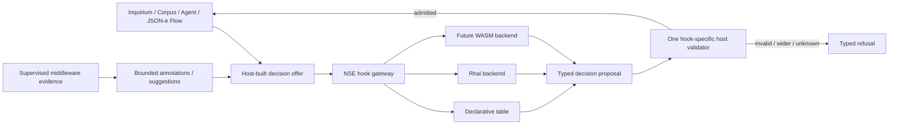

# Proposal 085: Operator-Sovereign Extensibility and Experiment Packages

Based on:

- `doc/normative/30-core-values/en/CORE-VALUES.en.md`
- `doc/project/40-proposals/019-supervised-local-http-json-middleware-executor.md`
- `doc/project/40-proposals/034-node-operator-binding-and-derived-node-assurance.md`
- `doc/project/40-proposals/044-host-owned-generic-module-store.md`
- `doc/project/40-proposals/049-json-e-middleware-transformer-executor.md`
- `doc/project/40-proposals/057-user-and-operator-notifications.md`
- `doc/project/40-proposals/063-inquirium-model-inquiry-organ.md`
- `doc/project/40-proposals/064-inquirium-implementation-recommendations.md`
- `doc/project/40-proposals/069-corpus.md`
- `doc/project/40-proposals/072-capability-registry.md`
- `doc/project/40-proposals/073-agent-orchestration-organ.md`
- `doc/project/40-proposals/076-federation-identity-and-network-selector.md`
- `doc/project/40-proposals/080-multiplexed-middleware-channel-executor.md`
- `doc/project/40-proposals/081-horizontal-protocol-primitives.md`
- `doc/project/40-proposals/082-sensorium-interfaces.md`
- `doc/project/40-proposals/084-sensorium-web-observation-connector.md`
- `doc/project/60-solutions/015-host-owned-module-store/015-host-owned-module-store.md`
- `doc/project/60-solutions/019-middleware/019-middleware.md`

## Status

Draft

## Date

2026-08-01

## Executive Summary

Orbiplex needs a deliberate path through which a node operator can alter local
resource envelopes, compose already granted capabilities, install decision
policies, and exchange reversible experiment packages without asking the core
project to predict every useful orchestration pattern. That path must increase
expressive power without creating a second source of authority.

This proposal defines **operator-sovereign extensibility**: many policy producers
may propose a typed decision, but one host-owned validator decides whether that
decision belongs to the exact offer already admitted by the owning component. A
table, Rhai program, or future WASM module does not authorize an effect by being
executable. It may select, order, narrow, defer, or raise caution inside a
host-supplied decision space. A supervised middleware process may contribute bounded
evidence or suggestions to that space but is not a direct decision backend in V1. A
JSON-e Flow may invoke and consume the admitted decision, but does not become another
policy backend.

The model adds eight related but separate mechanisms:

1. a classification of normative, boundary-safety, federated, and operational
   limits;
2. operator-signed resource envelopes whose revisions are append-only facts;
3. a runtime-agnostic NSE decision contract with a default declarative table
   backend and one validator per hook contract;
4. operator-declared monotonic guard hooks bound to host-registered admission
   anchors;
5. derived capability sets that are intersections of registered base
   capabilities, never new kinds of authority;
6. operator attention budgets and a named non-delegable core;
7. signed experiment packages containing policies, profiles, fixtures, and a
   mandatory refusal corpus, plus an explicitly enabled local import path for
   loose signed files;
8. signed distribution posture for builds that change the reviewed boundary
   baseline.

The proposal is cross-cutting rather than a new organ or domain feature. Inquirium,
Corpus, and Agent retain their semantics and authority owners. Middleware remains
replaceable mechanics. JSON-e Flow remains orchestration of already authorized
calls. Capability Registry remains the source of base capability identity. Sensorium
operational context remains source-owned evidence about live-system impact rather
than a general extension authority.

This proposal is post-MVP enablement. It must not reopen completed hard-MVP status
until a concrete hard-MVP story adopts one of its mechanisms.

## Context and Problem Statement

### Existing Power Is Unevenly Expressed

The current implementation already contains useful examples of operator-owned
policy:

- `CorpusReasoningRoomPolicy` carries typed room exposure, answer acceptance,
  chair mode, quorum, tie-break, revocation, budget, access list, and expiry;
- Agent production profiles are operator-defined, while built-in controller values
  are conservative developer defaults and child authority narrows monotonically;
- Inquirium `PromptAssemblyCaps` is data with positive-value and relational
  validation;
- JSON-e and JSON-e Flow let an operator compose transforms and already granted
  host calls;
- supervised middleware packages already have identities, signed package/config
  material, capability declarations, lifecycle, and host-owned execution
  boundaries.

Inquirium nevertheless mixes configurable policy with compile-time maxima. Some
constants express operation policy, such as candidate or label counts. Others
protect parsing, recursive validation, or memory allocation before an operator
policy can safely be consulted. Treating every `MAX_*` as either sacred or
arbitrary would be equally wrong. The repository lacks an explicit inventory and
classification rule.

### NSE Is a Contract Seed, Not Yet a General Extension Boundary

The `nse` crate correctly describes itself as a policy and orchestration boundary,
not a semantic core. It currently defines three hooks:

- `select-llm-model`;
- `before-broadcast-send`;
- `on-broadcast-received`.

The first hook selects one host-supplied runtime candidate. The two broadcast hooks
also admit arbitrary payload rewrites. Rhai is the only direct script backend.
Daemon integration proves the contract can remain advisory: the host filters the
candidate set first and revalidates the selected runtime before use.

The missing abstraction is therefore not "more Rhai". It is a stable family of
typed decision offers and validators that can have several producers. A common
selection such as "prefer a local model below 8B parameters when context is below
4K tokens" should be expressible as reviewable data. A novel scorer may use a
replaceable process to contribute bounded evidence to the offer, but the configured
decision backend and the one shared validator retain the decision boundary.

### Extension Mechanisms Answer Different Questions

Three existing mechanisms are complementary:

| Mechanism | Question answered | Authority boundary |
| :--- | :--- | :--- |
| JSON-e Flow | What already authorized calls occur, and in what order? | Flow grants and every called host capability remain authoritative. |
| NSE decision hook | Which offered alternative should be selected, ordered, narrowed, or refused? | The host-owned offer and hook validator remain authoritative. |
| Middleware package | How is replaceable mechanics implemented or how is evidence proposed? | Package identity, module grants, channel bounds, and the receiving host remain authoritative. |

Collapsing these mechanisms would make the system less expressive. Letting each of
them invent its own decision validation would make it unsafe. The desired design is
pluralism of producers with a single validation boundary for each decision
contract.

### Module Storage Is Not Package Installation

The Host-Owned Module Store persists small module-scoped JSON records. It does not
install binaries, activate executable packages, or validate arbitrary package
payloads. An experiment package therefore reuses the middleware package lifecycle
for executable material and the artifact/object stores for large immutable bytes.
The Module Store may retain host-owned activation records, policy projections,
cursors, and rollback metadata. It must not silently grow into a second package
manager.

## Goals

- Let an authenticated node operator replace conservative operational defaults
  with explicit local envelopes where doing so is safe.
- Keep protocol, signature, causality, authority, and refusal invariants
  non-configurable by extension packages.
- Make NSE a runtime-agnostic decision contract with several interchangeable
  producers and shared validators.
- Provide a declarative table backend before adding another embedded language.
- Let JSON-e Flow consume typed NSE decisions without growing a second policy
  language.
- Let supervised middleware propose features, scores, annotations, or candidate
  suggestions without becoming a direct decision backend or acquiring ambient host
  authority.
- Let operators declare new monotonic guard instances at registered host admission
  anchors without inventing semantic call sites.
- Allow named composition of existing capabilities through monotonic
  intersection.
- Make wider experimental policy visible, attributable, reversible, and bounded
  by context.
- Protect operator attention as a scarce resource and name operations that cannot
  be delegated or durably pre-approved.
- Make operator experiments portable through signed packages with provenance,
  compatibility bounds, rollback, and refusal evidence.
- Let a power user explicitly enable local loose-file import without making file
  discovery, installation, or activation implicit.
- Let a power user iterate through bounded, expiring session activations in
  `research` or `experimental` context without weakening durable activation.
- Preserve node sovereignty at federation boundaries through explicit declaration
  and intersection rather than a universal built-in resource ceiling.
- Preserve source-level freedom to rebuild the Node while making a changed boundary
  posture explicit to peers.

## Non-Goals

- No arbitrary code execution merely because a schema, package, or artifact is
  signed.
- No schema that grants authority by validating successfully.
- No extension mechanism that bypasses Capability Registry, current grants,
  sanctions, revocation, classification, or effect admission.
- No content-derived authority. Model output, a prompt, a Room message, a file, or
  a web page may propose but never grant.
- No universal plug-in API that exposes daemon internals.
- No operator-declared hook that invents an unregistered execution point, merge
  direction, candidate set, or selecting behavior.
- No unbounded parser, allocator, queue, recursion, wall-time, or output behavior.
- No federation-wide default imposed by one node's local operator envelope.
- No automatic promotion of an experimental package to production or critical
  context.
- No requirement to implement WASM before the table backend and shared validators
  have operational evidence.
- No replacement for the middleware package lifecycle, Artifact Delivery, Module
  Store, JSON-e Flow, Inquirium, Corpus, Agent, or Sensorium.

## Terminology

| Term | Meaning |
| :--- | :--- |
| **Decision offer** | A bounded set of candidates, orderings, profiles, or restrictions admitted by the owning host component before policy runs. |
| **Decision producer** | A table, script runtime, or WASM module that returns one typed proposal for an exact offer. Supervised middleware contributes bounded evidence to the offer instead. |
| **Decision validator** | Host-owned, hook-specific logic that proves the proposal is contained in the offer and obeys normative and current policy constraints. |
| **Admission anchor** | A host-registered pre-effect or pre-scope gate with a closed projection and monotonic merge algebra to which operator guard policy may bind. |
| **Operational envelope** | Operator-authored limits and allowed choices for a declared component, operation family, and context. |
| **Boundary-safety limit** | A pre-policy parser, allocator, recursion, frame, or process bound required to evaluate untrusted input safely. |
| **Derived capability set** | A named intersection of registered base capabilities plus additional restrictions. It is not a new primitive authority. |
| **Experiment package** | A signed, inert package manifest that binds policy tables or scripts, envelopes, derived sets, prompt profiles, fixtures, and refusal evidence. |
| **Non-delegable operation** | An operation requiring a fresh live `node-operator-binding`; it cannot be authorized by an Agent, peer, middleware module, or remembered consent. |
| **Attention budget** | Operator policy limiting and grouping human-in-the-loop requests without ever converting exhaustion into approval. |
| **Distribution posture** | A signed claim about implementation/build identity and the boundary profile in force; it is accountable evidence, not automatic proof of the running binary. |

## Proposed Model

### Decisions

- Limits are classified as normative, boundary-safety, federated, operational, or
  temporarily unclassified; a final boundary-safety classification requires
  checkable evidence.
- Decision production is plural, while admission remains singular and host-owned.
- Core-declared semantic hooks may select or order; operator-declared guard hooks
  may only restrict, narrow, or raise risk at registered host admission anchors.
- Multiple active producers compose deterministically under a hook-owned algebra;
  ambiguous selection and required-producer failure are refusals.
- Operator envelopes use one signed revision header with organ-owned typed profiles;
  the default table backend uses a closed hook-owned predicate vocabulary.
- Existing broadcast rewrites migrate to selection of host-registered transform
  profiles and remain subject to owning-boundary validation.
- Derived capability sets remain local overlays; federated proofs continue to name
  their registered base capabilities.
- The middleware package manifest is the canonical experiment container. A
  host-configured loose-signed-file import mode exists locally, is disabled by
  default, and converges on the same inert package and activation lifecycle.
- Corpus exchanges bounded signed envelope compatibility declarations and computes
  an intersection rather than disclosing complete local envelopes.
- Durable activation or envelope widening requires a fresh operator binding and a
  detached signature over the exact activation-plan digest.
- Python middleware may contribute bounded evidence or suggestions to an offer, but
  is not a direct NSE decision backend in V1.
- Active monotonic guards receive reserved execution budget; any explicitly admitted
  advisory fallback is visible as `partially-narrowed`, never as full policy
  application.
- Durable activation uses a journaled `planned -> committed -> finalized` transition;
  only the committed generation can become routable.
- A live-operator-only extension safe mode can remove extension policy from the path
  even when a required producer is permanently failing.
- Session activation is local, expiring, limited to `research|experimental`, and is
  never restored after restart or accepted as a federated envelope declaration.
- Operator defaults, operator-authored policy, and modified-distribution posture
  remain distinguishable in every effective-policy explanation.
- Extension packages are inert until locally activated and cannot create authority,
  suppress current revocation, or substitute for live-operator-only operations.

### 1. Four Classes of Limits

The implementation must classify every limit before moving it into configuration.

| Class | Owner | Examples | Runtime relaxation |
| :--- | :--- | :--- | :--- |
| **Normative invariant** | Protocol and constitutional architecture | signature domains, causal chain, authorize-before-effects, monotonic delegation, `unknown != success`, content is not authority | Never. A protocol revision is required. |
| **Boundary safety** | Host implementation and deployment profile | maximum pre-parse body, JSON depth, recursive schema complexity, frame size, process memory emergency bound | An extension cannot raise it. A host distribution may expose a separately reviewed deployment setting where evaluation remains safe. |
| **Federated compatibility** | Every participating node | accepted operation class, disclosure, TTL, room budget, extension digest, remote payload cap | The effective value is the intersection of declarations. Every node may be stricter or refuse. |
| **Operational policy** | Local node operator | candidate counts, token and time budgets, fan-out, retention, model preference, prompt assembly choices | Operator may raise or lower it inside boundary safety and current authority. Changes are signed facts. |

This fourth, boundary-safety class is necessary because a policy cannot protect the
host from an object that must already be parsed or allocated before the policy is
known. A constant is not automatically normative merely because it is compiled,
but neither is every size limit safe to make package-controlled.

A limit is classified as boundary safety only through a reviewed
`limit-classification.v1` record that names the threatened resource or failure mode,
the layer at which refusal occurs, and executable evidence that the limit prevents
that failure before operator policy is consulted. A limit without enough evidence
is `unclassified`, not silently operational and not permanently boundary safety. A
distribution may retain the current guard provisionally, but must expose that status,
an owner, and a `review-by` date. Passing that date does not remove the guard
automatically; it blocks P085 conformance and operator override on that axis until
review. The distribution cannot advertise an unclassified limit as a proven
federation safety property.

For numeric maxima, the effective value is normally the minimum. For allowed sets,
it is set intersection. For required caution or classification, it is the maximum.
For time horizons, the owning domain specifies whether smaller means safer; no
generic merger guesses this relation.

Conceptually:

```text
effective policy =
  boundary-safety profile
  INTERSECT operator envelope
  INTERSECT current task/session budget
  INTERSECT current restrictions and revocations
  INTERSECT every applicable remote declaration
```

### 2. Decision Producers Are Plural; Validation Is Singular

Every NSE hook owns one typed offer, one typed decision, and one validator. The
validator lives with the contract, not in Rhai, a table evaluator, WASM, Python, a
caller, or daemon route glue.



The validator must receive the exact offer digest and reject a decision produced for
another invocation. Unknown hook versions, unknown outcomes, missing candidates,
backend timeout, malformed annotations, and inconsistent offer bindings are typed
failures, never implicit allow.

Composition is part of the decision contract, not backend convention:

1. the signed local activation selects the active producers, their local priority,
   and whether each producer is `required` or `advisory`; a package may suggest but
   cannot assign its own effective priority; execution reserves budget first for all
   required producers and for every active `narrow`, `restrict`, or `raise-risk`
   producer, then orders each mode by descending local priority and package digest;
   inability to reserve every such bound is `producer/budget-unavailable` and refuses
   before producer execution;
2. every producer receives the identical offer and bounds and cannot observe another
   producer's result;
3. `narrow`, `restrict`, and `raise-risk` results fold with the hook-owned
   commutative meet or maximum operation;
4. `select`, `select-profile`, and `order` producers must agree on the exact admitted
   result; disagreement is `ambiguous-decision`, not a hidden tie-break;
5. failure of a required producer refuses the hook; failure of an advisory producer
   may be omitted only when the activation explicitly admits that fallback; an
   admitted result that omits a failed monotonic guard is marked
   `partially-narrowed`, names every omitted producer, and cannot satisfy a caller or
   remote declaration requiring the exact guard set;
6. if no producer yields an admitted result, the host uses an explicitly identified
   distribution default or refuses according to the hook contract. It never records
   the default as an operator decision.

The deterministic order is retained for execution budgets and audit, but cannot
change the algebraic result of monotonic guard classes. This prevents package order
from becoming ambient authority.

Per-request budget exhaustion is a producer failure, not absence of policy. It is
never converted into `defer-to-host` merely because a producer was labelled
`advisory`. The operator-visible result distinguishes `fully-evaluated`,
`partially-narrowed`, and `refused`; only the first proves that every activated guard
participated.

### 3. Closed Hook Classes

New decision hooks belong to one of these classes:

| Hook class | Permitted result | Forbidden result |
| :--- | :--- | :--- |
| `select` | One or more members of the offered candidate set. | A synthesized candidate or capability. |
| `order` | A permutation or stable ranked subset of offered members. | An extra member or changed identity. |
| `narrow` | Reduced limits, scopes, audiences, grants, or expiry. | Any widened axis. |
| `restrict` | Allow an already admitted option, deny, defer, or request stronger review. | Granting authority absent from the offer. |
| `raise-risk` | The same or a higher impact, classification, or HIL requirement. | Lowering the host-computed floor. |
| `select-profile` | A reference to one host-registered transform, repair, or prompt profile. | Arbitrary replacement content or an inline executable transform. |

The first hook expansion should include:

| Organ / surface | Proposed hook | Contract class |
| :--- | :--- | :--- |
| Inquirium | `assemble-prompt` | `order` plus subset selection; required host-root and caution layers cannot be dropped. |
| Inquirium | `select-output-schema` | `select` from host-admitted schema refs. |
| Inquirium | `select-repair-profile` | `select-profile`; repair itself remains Inquirium mechanics. |
| Inquirium | `score-candidate` | `order`; score vocabulary and deterministic tie handling are hook-versioned. |
| Corpus | `select-turn-order` | `order` over currently eligible participants. |
| Corpus | `weigh-bid` | `order` over admitted bids with bounded, auditable weight components. |
| Corpus | `resolve-tie` | `select` from the exact tied set. |
| Corpus | `admit-participant` | `restrict`; it may remove candidates but cannot bypass `access/list`, Room, grants, or sanctions. |
| Agent | `choose-next-step` | `select` from host-produced controller choices. |
| Agent | `shape-fanout` | `narrow`; children, budgets, grants, depth, and concurrency remain no wider than the parent and profile. |
| Agent | `classify-effect-risk` | `raise-risk`; it may require stronger HIL but never reduce the host floor. |

The host may additionally admit **operator-declared guard hooks**. Such a declaration
creates a named policy instance, not a new semantic call site. It must bind to a
host-registered admission anchor, such as `before-effect`, `before-scope-expansion`,
or an exact capability-owned gate, and may use only `restrict`, `narrow`, or
`raise-risk`. The anchor publishes its closed input projection, merge directions,
and admissible outcomes. The declaration cannot add an anchor, field, capability,
effect, candidate, or `select`/`order` behavior that the owning host component did
not register.

Every admission anchor declares a boundary-safety maximum for active guard instances
and projected guard bytes. The operator envelope may set a lower
`guards/max-active-per-anchor`, and activation applies the minimum. Pending session
activations count toward the same bound. Exceeding it refuses the whole activation;
the host never truncates the guard list or audit fan-out silently.

For a guard, `allow` means only "this producer adds no further restriction". It is
never sufficient to pass the ordinary capability, sanction, revocation,
classification, HIL, or domain admission checks. This lets operators introduce new
policy combinations without inventing new authority or requiring the core to
predict every useful guard instance.

`repair-io` is deliberately not an arbitrary content-producing decision hook. A
policy may select an admitted repair profile; the owning Inquirium implementation
performs and validates the repair. This keeps semantic transformation out of the
policy boundary.

The existing broadcast `Rewrite` outcomes do not satisfy this restricted model and
must migrate to host-registered transform-profile selection. Each former rewrite
choice becomes a profile reference offered by the owning broadcast boundary. NSE may
select only one offered profile; the owning boundary performs the transformation and
then validates its schema, size, provenance, and current policy before any effect.
There is no legacy arbitrary-rewrite exemption in V1.

### 4. Declarative Table Backend First

The default backend is a closed, ordered rule table, not a general expression
language. A conceptual `nse-policy-table.v1` contains:

```json
{
  "schema": "nse-policy-table.v1",
  "schema/v": 1,
  "policy/id": "nse-policy:01K1...",
  "policy/name": "local-small-model",
  "hook/id": "select-llm-model",
  "hook/v": 1,
  "rules": [
    {
      "when/all": [
        {"field": "context/token-estimate", "op": "lte", "value": 4096},
        {"field": "candidate/location", "op": "eq", "value": "local"},
        {"field": "candidate/parameter-count", "op": "lt", "value": 8000000000}
      ],
      "decision": {"kind": "prefer-candidate"}
    }
  ],
  "default/decision": {"kind": "defer-to-host"}
}
```

The exact field paths and operators are hook-owned allowlists. No arbitrary property
walk, function call, regex engine, filesystem access, clock access, randomness, or
network access is implicit. Evaluation is deterministic over the supplied offer.
Rules are ordered, bounded in count and depth, and canonicalizable for review and
signature.

Rhai remains an opt-in backend for policies that exceed the table vocabulary. WASM
is a later backend for portable policies from less trusted authors. Both return the
same typed decisions and receive no host object other than the bounded invocation.

### 5. JSON-e Flow Calls Decisions; It Does Not Fork NSE

JSON-e Flow gains a typed `decision` step that invokes an NSE hook and branches on
its admitted outcome. It does not gain a parallel candidate-selection language.

```json
{
  "step/kind": "decision",
  "hook/id": "select-llm-model",
  "offer/ref": "$context.model_offer_ref",
  "bind/result": "model_decision",
  "on/refused": "fallback-local-policy"
}
```

The host resolves `offer/ref`; rendered flow data cannot construct or widen the
offer. The flow may inspect only the decision projection explicitly exposed by the
hook contract. It still needs its ordinary capability grants to perform later calls.

### 6. Supervised Middleware Proposes Through Bounded Contracts

A Python or other supervised module may compute features, candidate annotations,
scores, or a bounded candidate suggestion. In V1 it is not registered as a direct NSE
decision backend. The host admits its output as typed evidence in the offer, after
which the configured table, Rhai, or future WASM backend produces the decision. A
middleware suggestion is never an `nse-hook-decision.v1` merely because it names an
offered candidate.

The host binds module identity, declared hook, package digest, input schema, output
schema, timeout, payload cap, and invocation id before dispatch. The evidence schema
also states which closed offer fields may receive the resulting annotations. Unknown
annotations or a suggestion outside the candidate set are refused before decision
evaluation.

No middleware proposal may:

- add a capability or candidate absent from the host offer;
- replace an actor, audience, classification, causal context, or operator binding;
- invoke an effect as part of decision evaluation;
- retain a host secret or receive unredacted context not required by the hook;
- convert timeout, crash, malformed output, or `unknown` into allow.

Middleware that implements replaceable mechanics should continue to expose domain
results through its owning organ rather than disguising mechanics as policy.

### 7. Operator Resource Envelopes Are Signed Facts

The common contract should use a shared signed header plus organ-owned typed limit
profiles rather than one unbounded map interpreted differently everywhere.

Conceptual shape:

```json
{
  "schema": "operator-resource-envelope.v1",
  "schema/v": 1,
  "envelope/id": "operator-envelope:01K1...",
  "revision/no": 3,
  "supersedes/ref": "operator-envelope:01K0...",
  "scope": {
    "component": "inquirium",
    "operations": ["classify", "rerank", "generate"]
  },
  "experiment/classes": ["research", "experimental"],
  "profile/schema": "inquirium-resource-profile.v1",
  "profile": {
    "classify/max-labels": 256,
    "rerank/max-candidates": 512,
    "text/max-input-bytes": 1048576
  },
  "operator/binding-ref": "node-operator-binding:01JZ...",
  "reason": "local taxonomy research",
  "issued-at": "2026-08-01T12:00:00Z",
  "expires-at": "2026-08-08T12:00:00Z",
  "signature": {}
}
```

The common header owns identity, revision, provenance, temporal validity, scope, and
signature. The profile schema owns field vocabulary and relational validation. The
host refuses unknown profile schemas or profile keys. A package may request an
envelope but cannot sign or activate it on behalf of the operator.

An envelope revision is an append-only fact. Activation, supersession, expiry,
revocation, and rollback produce separate facts or an immutable revision chain. The
runtime read model may cache an effective envelope, but startup and warm recovery
must rebuild it from current signed facts and current policy.

The effective read model always distinguishes `distribution-default`,
`operator-envelope`, and `federated-intersection` sources. When no operator envelope
applies, it reports `operator-policy: absent` and the exact distribution-default
profile digest. Absence never becomes an implied operator choice merely because the
host can continue safely.

The Inquirium implementation begins with an inventory of every
`INQUIRIUM_MAX_*`/`BASELINE_*` constant. Each item must be classified as normative,
boundary-safety, federated, or operational. Only the operational items are migrated
to an operator profile. A broad pre-parse byte cap and schema complexity bounds
remain host safety controls even when a lower operation cap becomes configurable.

### 8. Federated Use Is Explicit Intersection

An operator envelope is local authority. It cannot make a peer accept larger input,
longer execution, wider disclosure, more participants, or a less cautious effect.

For a Corpus deliberation that uses extension policy, the signed Corpus invitation
or later policy fact containing `CorpusReasoningRoomPolicy` should bind
`envelope/ref` and `envelope/digest` for the requester/chair policy declaration.
Each participant supplies a signed compatibility declaration for its own effective
envelope or refuses the room. The effective room policy is the intersection of:

- the validated Corpus room policy and budget bound by that signed artifact;
- the requester's declared envelope;
- each participating node's local envelope;
- current Room, capability, sanction, revocation, and operational-context policy.

The envelope reference does not replace `budget`; it explains which operator policy
admitted that budget and hook set. A peer verifies the digest and compatibility, not
the private local configuration behind it. A node may disclose only the bounded
public projection necessary for negotiation.

Changing an active room envelope creates a new signed policy revision. It never
silently changes the semantics of an already signed turn or answer.

Source freedom remains explicit: an operator may rebuild or fork the Node with
different boundary-safety values. Such a build is a different distribution posture,
not a runtime package override. Before federated use it publishes a signed
`node-extension-posture.v1` declaration containing at least the implementation
profile, build digest, limit-classification digest, boundary-profile digest, and
whether the distribution baseline was modified. A self-signed posture is an
accountable declaration, not proof that the running binary matches the claim;
reproducible-build, measured-boot, or third-party evidence may strengthen it. Remote
nodes apply local trust policy and may restrict or refuse a modified or insufficiently
attested posture.

### 9. Derived Capabilities Are Intersections, Not Registry Bypasses

`capability-derived.v1` names a composition such as:

```json
{
  "schema": "capability-derived.v1",
  "schema/v": 1,
  "capability/id": "~corpus/reviewer@participant:did:key:z6Mk...",
  "components": [
    {"capability/id": "inquirium.generate", "grant/ref": "grant:..."},
    {"capability/id": "corpus.room.turn", "grant/ref": "grant:..."}
  ],
  "restrictions": {
    "room/ids": ["room:01K1..."],
    "output/schema-refs": ["corpus-reasoning-turn-proposal.v1"],
    "expires-at": "2026-08-01T18:00:00Z"
  },
  "operator/binding-ref": "node-operator-binding:01JZ...",
  "signature": {}
}
```

The effective grant is recomputed at every admission from all current components
and restrictions. Revocation, expiry, quarantine, or narrowing of any component
immediately narrows or invalidates the derived set.

P072 remains the source of identity and eligibility for base capabilities. A
derived set uses the existing sovereign/custom identifier grammar but lives in a
separate operator overlay. It does not obtain a new wire name, signing domain,
advertisement eligibility, passport eligibility, or host route merely by existing.
Federated use requires explicit policy support and proof of the underlying base
capabilities.

### 10. Operational Context Bounds Promotion, Not Truth

P082's `sensorium-operational-context.v1` remains the authoritative description of
the impact class of a published Sensorium resource. P085 must not turn Sensorium
vocabulary into a universal authority object.

An experiment activation may nevertheless use the same ordered vocabulary:

```text
research < experimental < test < production < critical
```

This is an activation and caution class. When a Sensorium source participates, the
effective class is the maximum of the activation class, every current source-owned
operational context, and the local host floor. No extension may lower it.

Wide or unreviewed extension packages default to `research` or `experimental`.
Promotion to `test`, `production`, or `critical` is a new signed activation fact
requiring stronger conformance evidence and current operator approval. A higher
class does not create the isolation, redundancy, or review required by that class;
the host must verify those prerequisites separately.

The effective class and exact source/context digests propagate through P081 causal
context, operation traces, Agent evidence, Corpus turn/answer provenance, and effect
receipts without promoting free-form source summaries to privileged instructions.

### 11. Operator Attention Is a Bounded Sovereign Resource

`operator-attention-budget.v1` should define at least:

- operator and node binding scope;
- request classes, such as `effect-consent`, `package-activation`,
  `authority-change`, and `security-notice`;
- maximum prompts per rolling window;
- availability windows with an IANA time-zone identifier and bounded exceptional
  overrides;
- grouping key and maximum group size;
- minimum repeat interval for equivalent requests;
- timeout and expiry behavior;
- outside-window behavior: defer until the next window or deny, never approve;
- whether overflow is grouped, deferred, or denied;
- an emergency/security lane that remains visible but is itself aggregated.

Exhaustion never grants authority. The only automatic outcomes are grouping,
deferral, denial, or a bounded summary notification. A producer cannot bypass the
budget by changing wording while retaining the same canonical operation digest.
Outside an availability window, ordinary HIL requests follow the declared defer or
deny policy and still expire at their original deadline. The security lane may bypass
the quiet window for visibility, but not for approval or authority.

The operator may prefer class-level consent, for example an exact action-catalog
entry or bounded argv prefix, where the existing consent contract allows it. Such a
choice remains a scoped, expiring, revocable grant. It is not inferred merely to
reduce prompt volume.

### 12. A Named Non-Delegable Core

The host must maintain a checked policy class, `live-operator-only`, for operations
that require a fresh authenticated `node-operator-binding` and cannot use remembered
consent. An extension may add operations to this class locally but cannot remove the
distribution baseline.

The initial inventory should evaluate at least:

- federation-root and node-root key ceremony changes;
- trust-root or package-signing-authority admission;
- disabling or materially weakening audit and trace policy;
- changing the non-delegable baseline itself;
- permanent or public authority grants;
- HSM/recovery unseal and equivalent root recovery operations;
- promotion of an unreviewed extension into `production` or `critical` context.
- entry into or exit from extension safe mode and forced extension deactivation.

Being non-delegable does not mean one click is sufficient. Existing multisig,
quorum, role separation, or legal/governance policy continues to apply. The rule
only states that no Agent, peer, middleware module, Flow, script, or durable consent
can substitute for the required live operator participation.

The daemon must expose an **extension safe mode** whose admission path does not invoke
NSE, package backends, operator guard hooks, or middleware modules. A fresh live
operator binding may use it to revoke session activations, deactivate or quarantine
one or all extension packages, restore explicit distribution defaults, and request a
projection rebuild. Safe mode cannot activate a package, widen an envelope, grant a
capability, or suppress ordinary audit. Its enter, recovery, and exit actions are
append-only facts and remain available when an organ is refusing because a required
producer is permanently unavailable.

### 13. Experiment Package

`operator-experiment-package.v1` is a signed P085 submanifest of the existing
middleware package manifest and artifact mechanisms. It is the canonical portable
container and contains refs and digests, not arbitrary unbounded inline content:

- package identity, version, author, source, and canonical digest;
- compatible Node, hook-contract, schema, and profile versions;
- requested NSE hook registrations and backend kinds;
- suggested producer priority and required/advisory mode, which local activation
  must accept or replace explicitly;
- policy-table, Rhai, or future WASM module refs;
- requested resource-envelope profile and context classes;
- derived capability-set definitions;
- prompt and output-schema profile refs;
- required base capabilities and module grants;
- positive conformance fixtures;
- mandatory refusal corpus;
- migration, rollback, expiry, and uninstall declarations;
- disclosure, egress, filesystem, process, and retention requirements.

Installation is inert. Activation requires an operator-visible plan showing:

- which resources become wider or narrower;
- which hooks and candidate fields become visible;
- which base capabilities are required;
- that no derived set widens authority;
- which local files, processes, endpoints, stores, and egress classes are used;
- the refusal-corpus result;
- the effective operational class;
- the rollback path.

Author signatures prove package provenance, not local trust. Local activation is
bound to the current node operator and package digest. Durable activation or envelope
widening requires a fresh validated `node-operator-binding` and a detached operator
signature over the exact canonical activation-plan digest. Editing signed material
makes the package stale and requires a new digest and activation.

The package signing key is resolved only through the current node trust roots and an
admitted `package-signing-authority` binding. A key or certificate carried inside the
package is untrusted input and can at most name a candidate for a separate admission
ceremony; it never validates the package that contains it.

The middleware package directory owns executable package material and sidecars.
Artifact/object stores own large immutable assets. The Host-Owned Module Store may
hold activation projections, cursors, bounded policy state, and rollback metadata.

For local power-user work, the host additionally exposes
`operator_extensions.allow_loose_signed_files`, with a required default of `false`.
Only host configuration may enable this mode; a package, Flow, middleware module, or
remote declaration cannot turn it on. When enabled, an authenticated operator may
import individually signed, content-addressed files from explicitly admitted local
roots. The host validates every signature and digest, then materializes a deterministic
local `operator-experiment-package.v1` projection whose `container/mode` is
`loose-file-import` and whose `distribution/eligible` value is `false`.

Loose files are therefore an alternative local ingress form, not a second package
manager or activation model. The host does not watch, install, or activate them merely
because they appear on disk. Import must still bind compatibility, dependencies,
refusal corpus, operational class, exact source digests, rollback behavior, and the
ordinary inert-install and signed-activation sequence. A changed file invalidates the
materialized projection and requires a new import and activation. Portable exchange
requires repackaging into the canonical signed middleware container.

An already installed, verified, and conformant package may also receive a **session
activation** for rapid local iteration. It requires a fresh authenticated operator
session and current `node-operator-binding`, but not the detached signature required
for durable activation. The activation binds the exact plan and package digests, has
a mandatory short TTL, is limited to `research` or `experimental`, and expires on
operator-session end, explicit revocation, TTL, or daemon restart. It cannot change
trust roots, the non-delegable baseline, durable envelopes, durable derived sets,
`production|critical` policy, or any federated declaration. Start, use, refusal,
expiry, and revocation remain audit events even though the activation itself is not
recovered.

### 14. Refusal Corpus Is Part of the Package Contract

Every experiment package includes machine-readable negative fixtures proving at
least that:

- a decision cannot select a candidate absent from the offer;
- a hook cannot add a grant, actor, audience, or capability;
- a child/fan-out decision cannot widen parent limits;
- an effect-risk decision cannot lower the host floor;
- unknown hook versions and outcomes fail closed;
- expired, superseded, or revoked envelopes are refused;
- a revoked base capability invalidates the derived set;
- attention-budget exhaustion does not grant;
- a non-delegable operation rejects Agent, peer, middleware, Flow, and remembered
  consent authority;
- package crash, timeout, malformed output, and replay do not become success;
- causal context and package/envelope digests cannot be changed by policy output.

The package may add domain-specific refusals. Passing the corpus is necessary but
not sufficient for activation; it is evidence, not certification of safety.

### 15. Audit and Recovery

The host appends immutable facts for:

- envelope issue, activation, supersession, expiry, and revocation;
- package install, verification, refusal-corpus result, activation, rollback, and
  uninstall;
- activation transition planning, commit, finalization, interruption, and recovery;
- session activation start, use, expiry, revocation, and restart discard;
- derived capability-set activation and invalidation;
- hook invocation metadata, backend identity, offer digest, decision digest,
  validator outcome, registered refusal code, and bounded diagnostic projection;
- attention-budget consumption, grouping, overflow, and operator response;
- non-delegable admission and refusal;
- effective use of a distribution default while operator policy is absent;
- extension safe-mode entry, forced deactivation, projection rebuild, and exit;
- distribution-posture publication, supersession, and evidence changes.

Raw prompts, model outputs, package secrets, and private source content are absent
from default operator traces. Content is referenced by classification-aware digest
or artifact ref when needed.

On restart, the runtime first discards every session activation, then rebuilds durable
active generations, envelopes, derived sets, and attention projections from the
canonical journal and signed facts plus current registry, grants, sanctions,
revocations, trust roots, and package inventory. A missing package, changed digest,
unknown hook, failed refusal corpus, or no-longer-admitted base capability produces a
quarantined or inactive extension. It does not block unrelated daemon services unless
the extension was explicitly configured as readiness-critical.

## Contract Family

The first implementation should freeze these contracts before runtime effects:

| Contract | Purpose |
| :--- | :--- |
| `limit-classification.v1` | Versioned classification, proof obligation, review owner, and review deadline for one implementation limit. |
| `operator-resource-envelope.v1` | Shared signed revision header and typed profile binding. |
| `inquirium-resource-profile.v1` | Operator-owned Inquirium operation limits after constant classification. |
| `nse-hook-offer.v1` | Common invocation identity, hook/version, offer digest, backend bounds, and causal context. |
| `nse-hook-decision.v1` | Common decision binding to hook/version, invocation, offer digest, producer, and typed outcome. |
| `nse-middleware-evidence.v1` | Bounded feature, score, annotation, or candidate suggestion admitted into a closed offer; never a direct NSE decision. |
| `operator-extension-refusal-code.v1` | Closed versioned refusal vocabulary shared by hook, package, envelope, guard, and activation boundaries. |
| `operator-extension-refusal.v1` | Bounded diagnostic binding one refusal code to producer, hook or anchor, affected axis, winning declaration, invocation, and causal context. |
| hook-specific offer/decision payload schemas | Closed candidate, guard-axis, and outcome vocabulary for each hook. |
| `operator-guard-hook.v1` | Signed local binding of a guard policy to one registered admission anchor and a closed monotonic hook class. |
| `nse-policy-table.v1` | Deterministic ordered declarative rule table. |
| `capability-derived.v1` | Signed local intersection of registered base capabilities plus restrictions. |
| `operator-attention-budget.v1` | HIL request limits, grouping, availability windows, timeout, and overflow/outside-window policy. |
| `operator-experiment-package.v1` | Portable manifest over policies, profiles, capabilities, fixtures, and rollback, plus the deterministic non-distributable projection used by opt-in loose-file import. |
| `operator-extension-activation.v1` | Durable local activation or promotion fact bound to operator and package digest, including local producer priority and required/advisory mode. |
| `operator-extension-session-activation.v1` | Local expiring `research|experimental` activation bound to a live operator session and discarded on restart. |
| `operator-extension-transition.v1` | Journaled activation, rollback, revocation, or safe-mode transition with expected generation and `planned|committed|finalized|failed` state. |
| `operator-extension-revocation.v1` | Durable local revocation fact and bounded reason. |
| `operator-extension-conformance-report.v1` | Positive and refusal-corpus results for an exact package/runtime combination. |
| `federated-envelope-declaration.v1` | Bounded public compatibility projection used by Corpus or another federated consumer. |
| `node-extension-posture.v1` | Signed distribution/build and boundary-profile declaration with optional stronger attestation evidence. |

All security-gate schemas are closed by default. Optional evolution uses explicit
versioned extension namespaces. Schema acceptance never implies package activation,
capability admission, or effect authority.

## Named Invariants

- `inv-extension-content-not-authority`: content can propose but cannot grant,
  register, bind, delegate, or activate authority.
- `inv-extension-offer-contained`: every admitted decision is contained in the exact
  host-built offer identified by its digest.
- `inv-extension-many-producers-one-validator`: every backend for one hook uses the
  same hook-specific host validator.
- `inv-extension-boundary-limit-proven`: a final boundary-safety classification has
  a versioned evidence record and a pre-policy refusal test for the concrete failure
  it prevents; an unproven limit remains visibly unclassified.
- `inv-extension-monotone-authority`: hooks and derived sets may only preserve or
  narrow effective authority.
- `inv-extension-composition-cannot-widen`: activating or reordering several
  producers cannot produce authority wider than any host-built offer or current
  restriction; ambiguous selecting results and required-producer failures refuse.
- `inv-extension-guard-budget-reserved`: every active monotonic guard has budget
  reserved before execution; omitted advisory guards are reported as
  `partially-narrowed`, never full policy application.
- `inv-extension-risk-raise-only`: extension policy may preserve or raise caution,
  classification, and HIL requirements, never lower the host floor.
- `inv-extension-unknown-not-success`: unknown, timeout, crash, malformed output,
  incompatible version, or unavailable policy is never success.
- `inv-extension-causal-chain-fixed`: policy cannot replace actor, operator binding,
  causal context, offer digest, or source provenance.
- `inv-extension-federated-intersection`: a local envelope cannot compel a peer;
  federated execution uses the intersection of all current declarations.
- `inv-extension-derived-no-new-authority`: a derived capability set has no authority
  outside the current intersection of its base grants and restrictions.
- `inv-extension-install-inert`: package installation and schema acceptance do not
  activate behavior.
- `inv-extension-package-trust-external`: package signing authority is resolved from
  current admitted trust state, never from key material carried by the package.
- `inv-extension-transition-journaled`: coupled activation state becomes routable
  only through one committed generation in the canonical transition journal.
- `inv-extension-cache-current-facts`: no cache entry or compiled object can establish
  eligibility without a current activation, revocation, restriction, and generation
  check.
- `inv-extension-safe-mode-recoverable`: a live operator can remove extension policy
  from the execution path without invoking that policy.
- `inv-extension-session-activation-ephemeral`: session activation is local,
  `research|experimental`, TTL-bounded, and discarded rather than recovered after
  restart.
- `inv-extension-live-operator-only`: a non-delegable operation cannot be authorized
  by Agent, peer, middleware, Flow, script, or remembered consent.
- `inv-extension-attention-default-deny`: an exhausted, expired, or unanswered HIL
  request cannot become approval.
- `inv-extension-operator-not-substituted`: absence of operator policy uses an
  explicitly identified distribution default and is never recorded or displayed as
  an operator decision.
- `inv-extension-modified-distribution-disclosed`: a build that changes the declared
  distribution boundary baseline cannot claim the unmodified extension posture.
- `inv-extension-recovery-revalidates-current-policy`: restart never restores an
  extension solely because it was active before shutdown.
- `inv-extension-refusal-closed-and-diagnosable`: every refusal uses a registered code
  and identifies the deciding boundary and winning restriction without leaking
  protected content.
- `inv-extension-identifiers-canonical`: every new semantic identifier uses its
  registered prefix and canonical suffix validator; a display label never substitutes
  for identity.

## Concrete Scenario

An operator installs a package named `local-small-model-deliberation` containing:

- an Inquirium resource profile raising local rerank candidates from the developer
  default to 512 in `research` and `experimental` contexts;
- a table policy preferring local models below 8B parameters for contexts below 4K
  tokens;
- a Corpus bid scorer that orders only already admitted bids;
- an Agent fan-out policy that selects at most three children while preserving the
  parent budget and grants;
- a JSON-e Flow that invokes the model-selection decision and then calls an already
  granted Inquirium capability;
- a refusal corpus proving absent-candidate, widened-child, lowered-risk, revoked
  capability, and timeout failures.

The host verifies the package and shows an inert activation plan. The operator signs
one expiring activation. Corpus publishes an envelope ref and digest in its room
policy. A remote node accepts only if its local envelope is compatible and may use a
stricter candidate or token cap. The package changes orchestration and resource use,
but it cannot add a participant, grant a capability, publish an answer, actuate a
system, lower a Sensorium impact class, or bypass HIL.

## Implementation Guidance

### Layering

Recommended strata:

```text
protocol schemas
  signed facts, manifests, closed offers/decisions, conformance reports

nse
  runtime-agnostic hook DTOs, offer digests, hook-specific validators

nse-table / nse-rhai / future nse-wasm
  replaceable decision producers; no authority or effects

organ cores
  Inquirium, Corpus, and Agent candidate construction and domain validation

host policy
  operator envelopes, capability intersections, restrictions, HIL, non-delegable core

daemon composition
  persistence, package lifecycle, backend supervision, recovery, operator APIs

node-ui / CLI
  inspect plan, sign activation, compare revisions, revoke, diagnose
```

No generic extension core should absorb Inquirium prompt semantics, Corpus election
semantics, Agent lifecycle, Capability Registry admission, or Sensorium impact
meaning. Shared code owns mechanics and algebra; each organ owns its vocabulary.

### Reuse Map

This proposal introduces algebra and identity, not new infrastructure. Treat a
deviation from this mapping as a recorded decision rather than an implementation
detail.

| Need | Existing owner | Do not build |
| :--- | :--- | :--- |
| Canonical digest inputs for offers, decisions, tables, envelopes, packages | `canonical-json` | per-call serialization for digests |
| Causal context, receipts, cursors on every hook invocation | `horizontal-protocol-core` | private correlation ids or trace shapes |
| Base capability identity and eligibility | `capability`, Capability Registry (P072) | a second registry behind derived sets |
| Operator identity, consent scopes, single-use consumption, durable-grant allowlists | `operator-consent-core` | a parallel approval store for activation |
| Append-only operator sidecars and effective config merge | `config-sidecar-core` | direct mutation of module config trees |
| Package identity, signature, activation, provenance | middleware package lifecycle, Solution 015 | a second installer inside Module Store |
| Bounded periodic revalidation of envelopes and packages | `replay-scheduler`, Solution 020 | private timer loops |
| Activation or conformance work outliving one request | `deferred-operation`, Solution 029 | untracked background threads |
| Supervised backend processes and channel bounds | `middleware-supervisor`, `middleware-channel-core` | bespoke process wrappers |
| Durable facts with an explicit time axis | `temporal-event-log`, `storage-sqlite` conventions | ad hoc JSON directories |
| Operator-visible grouping and delivery of attention requests | `notification-core`, `notification-store` (P057) | a private prompt queue |
| Contract enforcement at every boundary | `schema-gate` | application-level shape checks |

### Crate Purity Guard

`nse` must be enforced contract-only, not merely described as such. The repository
already carries this mechanism for `agent-core`, `corpus-core`, `inquirium-core`, and
their host counterparts: build guards that fail on banned dependencies **and** on
banned source terms. Add an equivalent guard in the same commit that first expands
`nse`, banning at minimum script runtimes, WASM engines, HTTP clients, database
drivers, async runtimes, filesystem and process access, and clock or randomness
sources. Determinism of the decision boundary is a property that must be mechanically
checkable, because it is the reason several untrusted backends can share one
validator.

Dependency direction is one-way: `nse` knows nothing about `nse-table`, `nse-rhai`,
`nse-wasm`, the organs, or the daemon.

Validator uniqueness should be enforced by the type boundary, not only by naming or
source lint. Backends return an untrusted `DecisionProposal<T>`. Only the
hook-specific validator inside `nse` can construct an opaque
`AdmittedDecision<T>`, and organ/host effect paths accept only that admitted form.
Compile-fail tests prove that backend crates cannot construct it. Dependency guards
also reject backend-owned admission APIs, but the unforgeable admitted type is the
mechanical authority boundary.

### Offer Identity and Decision Binding

The offer digest is the anti-replay primitive of this whole design, so specify it
before any backend exists.

```json
{
  "schema": "nse-hook-offer.v1",
  "schema/v": 1,
  "hook/id": "select-llm-model",
  "hook/v": 1,
  "invocation/id": "nse-invocation:01K1...",
  "offer/digest": "sha256:...",
  "causal/context-ref": "causal:01K1...",
  "policy/source": "operator-envelope",
  "operator/binding-ref": "node-operator-binding:01JZ...",
  "envelope/refs": ["operator-envelope:01K1..."],
  "backend/bounds": {
    "wall-time-ms": 250,
    "output-bytes": 16384,
    "fuel": 1000000
  },
  "candidates": [],
  "context": {}
}
```

The digest is computed with `canonical-json` over the offer with `offer/digest`
removed, and it must cover `hook/id`, `hook/v`, `invocation/id`, the exact ordered
candidate identities, the projected context, and `causal/context-ref`. Omitting
`invocation/id` or the causal ref would let a decision produced for one request be
replayed into another with an identical candidate set — the same class of defect the
node already guards against with generation and boot-nonce fencing elsewhere.

Every decision carries `hook/id`, `hook/v`, `invocation/id`, and `offer/digest`. The
validator compares all four before examining the outcome, and a mismatch is a typed
refusal rather than a fallback to the host default. `policy/source` is required;
`operator/binding-ref` is required only when an operator-authored policy participates.
Backend identity and package digest are checked during producer dispatch and recorded
with elapsed time. They do not replace semantic containment validation, while elapsed
time still enforces the declared execution bound.

### Field Projection and Table Evaluation

Give each hook one host-owned projector that flattens its offer into a closed map
before any producer runs:

```text
project(offer) -> BTreeMap<&'static str, Scalar>
Scalar = Bool | Int | FixedDecimal | String | Enum
```

`FixedDecimal` has a schema-owned scale and rounding rule with one canonical textual
form. Binary floating-point, NaN, infinity, and backend-local coercions are excluded
from the shared table contract so Rhai, WASM, Python-supplied evidence, and Rust
tables cannot describe the same score differently because of numeric representation.

Strings compare as unsigned bytes of their exact canonical UTF-8 encoding. The table
evaluator performs no Unicode normalization, locale-dependent collation, case folding,
or backend-specific coercion. A hook that needs normalized text must publish the
normalized value as a separate host-owned projected field with a versioned rule; a
backend cannot normalize it privately.

The projector is the entire vocabulary a table may reference. Two consequences follow
and both matter: a table can never walk arbitrary structure, and predicate evaluation
is an `O(1)` map lookup rather than a path traversal. Fields absent from the
projection are not addressable, so extending the vocabulary is a deliberate,
reviewable act on the hook contract.

Evaluation is a single ordered pass with no backtracking, bounded by declared rule
and predicate counts, giving `O(rules × predicates-per-rule)` with no allocation
inside the loop. Fold semantics differ per hook class and must be stated in the
contract rather than left to the evaluator:

| Hook class | Fold over matching rules |
| :--- | :--- |
| `select`, `select-profile` | first match wins; unmatched falls to `default/decision` |
| `order` | first matching rule supplies the ranking; later rules are ignored |
| `narrow` | every match applies; per-axis minimum |
| `restrict` | every match applies; deny wins over defer, defer wins over allow |
| `raise-risk` | every match applies; per-axis maximum |

Compile tables into an evaluation structure at **activation** time, not per
invocation. The pure compiled object is content-addressed by table digest, hook
contract digest, and compiler-profile digest, but dispatch eligibility is a separate
fact-bound binding keyed by activation generation and package digest. A table digest
alone can never make compiled policy executable. Predicate operators are a closed
hook-owned allowlist; there is no regex engine, no arithmetic on untrusted strings,
and no user-defined function.

### Merge Algebra Is Data, Not Scattered Code

Section 1 states that numeric maxima take the minimum, allowed sets intersect, caution
takes the maximum, and time horizons are domain-specified. Implement that once. Each
profile schema annotates every field with its merge direction:

```json
{
  "classify/max-labels": {"type": "integer", "merge/direction": "min"},
  "allowed/model-locations": {"type": "array", "merge/direction": "intersect"},
  "hil/minimum-class": {"type": "string", "merge/direction": "max"},
  "session/max-wall-time-ms": {"type": "integer", "merge/direction": "domain:agent"}
}
```

One generic folder consumes those annotations across the boundary-safety profile,
operator envelope, session budget, current restrictions, and every remote declaration.
Only a host-registered profile schema may define merge directions; an experiment
package may reference that schema but cannot add or override its annotations. A field
without a declared direction is a schema error, not a default, because the silent
default is precisely where a widening bug would hide. `domain:*` directions dispatch
only to a named, tested function registered by the owning organ.

This is also what makes the effective-policy explanation in the operator UI possible:
the folder can return, per field, the winning value and which declaration supplied it.

### Inquirium Constant Audit

The migration must produce a checked table with one row per current maximum:

| Field | Current constant | Class | Pre-parse bound | Operator profile key | Federation relevance | Decision |
| :--- | :--- | :--- | :--- | :--- | :--- | :--- |

The audit must explicitly cover text/image input, labels, rerank candidates,
embeddings, prompt adjustments, repair attempts, output-schema complexity, control
payloads, memory, flow nodes/edges, feedback, locales, and assistant output. A value
may have both a hard boundary-safety cap and a lower operator default. Removing a
constant without identifying the earlier safe boundary is a review failure.

**Proof obligation for the boundary-safety class.** The boundary-safety class is the
one place where this proposal could quietly re-centralize the power it intends to
devolve, because any inconvenient limit can be relabelled as a safety bound. Close
that door with a checkable rule: every limit finally classified as boundary safety
carries a test demonstrating the concrete failure it prevents, such as allocation
growth, recursion depth, parser blowup, frame exhaustion, or unbounded wall time, and
the test refuses the over-limit input before policy is consulted. Absence of evidence
does not prove that relaxation is safe: the value remains visibly `unclassified` and
blocks completion of the classification task. The current guard may remain after its
`review-by` date to avoid an unsafe automatic relaxation, but the implementation then
loses P085 conformance for that axis and cannot enable an operator override until the
review closes. The classification table is a reviewed, versioned artifact rather than
a source comment, so an operator can inspect and contest the reasoning through
ordinary proposal review rather than a private patch.

### Storage and Recovery

Every new SQLite store follows the repository Storage and Database Schema Design
rules: explicit migrations, WAL, `busy_timeout`, foreign keys, idempotency keys,
bounded pages, and one canonical recovery owner. Prefer existing operator-consent,
module-store, temporal-log, and package sidecar stores over creating another database
when their ownership and key model fit.

### Activation Journal and State Machine

Extension activation follows the existing local-model package transition pattern:
stage and validate all inputs, write one canonical journal record, atomically commit
the active generation, then finalize derived projections and external side effects
idempotently. The canonical activation store is the source of routability. Module
Store records, compiled bindings, caches, UI projections, and backend processes are
rebuildable consequences, not parallel authority.

The durable commit binds in one generation at least the package and plan digests,
passing conformance report, envelope revision, derived-set refs, guard bindings,
producer priorities and modes, expected previous generation, operator binding, and
detached signature. When all values share one SQLite database, the active generation,
activation fact, and journal state change in one transaction. When bytes or
projections have different storage owners, they are staged first and referenced by
digest; only the canonical `committed` journal transition makes them eligible. A
post-commit side effect has an idempotency key and is replayed from the journal.

The read model joins three orthogonal state machines rather than flattening package,
activation, and transition state into one enum. Package lifecycle is:

| Package state | Entered by | Allowed next states |
| :--- | :--- | :--- |
| `absent` | no accepted package identity | `staged` |
| `staged` | bounded import/download and exact digest plan | `installed`, `quarantined`, `absent` |
| `installed` | immutable bytes and inert manifest committed | `verified`, `quarantined`, `uninstalled` |
| `verified` | signature, trust-root, compatibility, and schema checks pass | `ready`, `quarantined`, `uninstalled` |
| `ready` | fresh passing conformance report exists | `quarantined`, `uninstalled`; it may originate new activation generations without leaving `ready` |
| `quarantined` | package integrity, trust, compatibility, or conformance fails | `verified` or `ready` after new evidence, `uninstalled` |
| `uninstalled` | no live activation/rollback refs remain and owned bytes are released under retention policy | `staged` as a new install |

Each activation generation has a separate lifecycle:

| Activation state | Entered by | Routable? | Allowed next states |
| :--- | :--- | :--- | :--- |
| `session-active` | admitted expiring local session activation over a `ready` package | local session only | `expired`, `revoked`, `quarantined` |
| `active` | durable activation generation commits over a `ready` package | yes, after current-policy check | `superseded`, `expired`, `revoked`, `quarantined`, `rolled-back` |
| `superseded` | a newer generation commits | no | terminal for this generation |
| `expired` | activation or envelope validity ends | no | terminal for this generation |
| `revoked` | a current revocation fact commits | no | terminal for this generation |
| `quarantined` | activation binding, recovery, or current-policy validation fails | no | terminal; a repaired package uses a new activation generation |
| `rolled-back` | a previous `ready` package is activated as a new current generation | no for the retired generation | terminal for this generation |

`unclassified` is an activation blocker reported by `limit-classification.v1`, not a
package or activation lifecycle state. Repeated valid transitions are idempotent by
transition ref and exact request digest; every disallowed transition returns a typed
refusal. Expiring or revoking one generation does not destroy the independently
verified package or silently reactivate an earlier generation.

The transition journal itself has the following interruption semantics:

| Journal state | Authority meaning | Restart or interruption resolution |
| :--- | :--- | :--- |
| `planned` | no active authority; all referenced material remains staged | resume validation or abort and clean staging; never route |
| `committed` | the named generation is canonical, but finalization may be incomplete | revalidate current facts, rebuild bindings/projections, replay idempotent side effects, then finalize; affected routes stay degraded until this succeeds |
| `finalized` | canonical state and projections agree | ordinary current-policy checks continue on every use |
| `failed` | no new generation became authoritative | retain bounded diagnostics, release inactive staging, and permit a new transition ref |

A revocation, expiry, supersession, safe-mode action, or trust-root change uses the
same journal. Its committed fact wins immediately even when cache invalidation or
backend shutdown is still being finalized.

### Runtime Cache, Projection, and Temp Lifecycle

The runtime keeps content caches separate from authority bindings. Every structure
introduced by this proposal has an owner, key, bound, cleanup path, indexes where
durable, and restart rule:

| Structure | Owner and key / idempotency | Bound and retention | Cleanup and indexes | Restart and authority rule |
| :--- | :--- | :--- | :--- | :--- |
| Pure compiled-table cache | `nse-table`; `(table-digest, hook-contract-digest, compiler-profile-digest)` | operator entry/byte cap below a boundary-safety cap plus bounded idle TTL | memory LRU by last use and bytes | starts empty; compiled content is inert and cannot be dispatched without a current fact-bound binding |
| Activation-to-compiled binding cache | host extension policy; `(activation-generation, package-digest, hook-id, hook-v, table-digest)` | active-producer and per-anchor caps; lifetime no longer than the activation | synchronous invalidation on committed revoke, expiry, supersession, safe mode, trust, sanction, or restriction change; index by generation and package | rebuilt only from current committed facts; digest equality never preserves eligibility across invalidation |
| Effective-envelope cache | host policy; `(scope, envelope-fact-high-water, restriction-generation, remote-declaration-digests)` | entry/byte cap and idle TTL shorter than mandatory policy revalidation | LRU plus invalidation indexes by envelope, operator binding, sanction, revocation, and remote declaration | starts empty and folds current facts; cached value never bypasses a current generation check |
| Per-invocation offer projection | NSE gateway; `(invocation-id, offer-digest)` | one bounded projection per active invocation and the hook byte cap | drop on completion, cancellation, or invocation deadline | never persisted or recovered |
| Attention rolling-window projection | operator consent/notification owner; `(operator-binding, request-class, grouping-key, window-id)` | bounded buckets, groups, records, bytes, and maximum window horizon | expiry index plus bounded periodic compaction that preserves active windows | rebuilt from durable consumption facts; absence or corruption denies rather than resets the budget |
| Package and loose-file staging | middleware package lifecycle; `(import-operation-id, idempotency-key, source-digest)` | file, byte, operation, and staging-TTL caps | cleanup index by state and expiry; cleanup cannot remove committed or referenced material | resume an exact planned import or discard stale staging; never infer installation or activation from files on disk |

The important split is between a reusable compiled value and permission to execute
it. Revocation may leave a pure compiled object in the bounded LRU until eviction,
but synchronously removes every fact-bound dispatch binding. No lookup path accepts a
table digest without the current activation generation and current policy check.
Cleanup never removes an active invocation, current attention window, committed
generation, referenced rollback target, or material still owned by a planned
transition.

### Refusal Vocabulary and Diagnostics

`operator-extension-refusal-code.v1` is a closed, versioned vocabulary. V1 includes
at least:

```text
contract/unknown-schema
hook/unknown
hook/version-mismatch
offer/digest-mismatch
offer/invocation-mismatch
decision/not-contained
decision/ambiguous
decision/unknown-outcome
producer/budget-unavailable
producer/required-failed
producer/output-malformed
producer/timeout
producer/crash
package/signing-authority-untrusted
package/digest-mismatch
package/conformance-failed
activation/plan-stale
activation/operator-binding-missing
activation/signature-invalid
activation/state-conflict
activation/session-not-eligible
limit/unclassified
guard/anchor-unknown
guard/cap-exceeded
identifier/invalid
policy/revoked
policy/expired
extension/safe-mode
```

Hook-specific additions require a new vocabulary version rather than free-form codes.
Every declared code has at least one negative fixture that reaches it, every emitted
code belongs to the registry, and an unreachable declared code or unregistered emitted
code fails contract coverage in CI.

`operator-extension-refusal.v1` carries the code and retryability plus the relevant
producer/backend/package ref, hook id and version or admission anchor, affected axis
or field, invocation and offer digests, causal ref, and the declaration ref/digest
that supplied the winning restriction. `partially-narrowed` outcomes additionally
name omitted advisory producers. Operator text is derived from these bounded fields;
classified values, prompts, source content, and secrets remain redacted or represented
only by permitted refs and digests.

### Identifier Grammar

New identifiers are opaque correlation handles with exact prefixes and uppercase
Crockford-Base32 ULID suffixes:

| Family | Canonical grammar |
| :--- | :--- |
| NSE invocation | `nse-invocation:<ULID>` |
| Operator envelope | `operator-envelope:<ULID>` |
| NSE policy | `nse-policy:<ULID>` |
| Operator guard hook | `operator-guard-hook:<ULID>` |
| Limit classification | `limit-classification:<ULID>` |
| Extension transition | `operator-extension-transition:<ULID>` |

Validators enforce the exact ASCII prefix and a 26-character ULID suffix using the
alphabet `[0-9A-HJKMNP-TV-Z]`; Unicode separators, case folding, whitespace, digest
fallbacks, and display names are rejected. Stable human labels live in separate
`*/name` fields. Code must not infer authority or behavior from the prefix beyond
selecting the registered validator for the already known field.

### Schema Gate Registration Checklist

Every P085 contract follows the ten-point checklist in
[P084, Schema Gate registration is a checklist, not a step](084-sensorium-web-observation-connector.md#schema-gate-registration-is-a-checklist-not-a-step):
family variant, validator static, contract spec, public and private validators, all
embedded aliases, embedded source, positive and negative examples, and family
coverage membership. Canonical `orbidocs` schemas, Node mirrors, both fixture sets,
and generated coverage move in one change. Partial registration is a CI failure even
when the crate compiles.

### Capability and Ledger Mapping

Before exposing a new host route or module-invokable hook, register every formal
capability id in P072 and add Node implementation-ledger rows. Internal pure function
calls do not need invented capability ids. Derived capability sets do not become
base registry entries merely to satisfy tooling.

### Validation Order

For every invocation:

1. bound transport/frame admission before parse;
2. schema gate;
3. caller, operator, package, hook, and current-policy admission;
4. host offer construction and canonical digest;
5. bounded producer execution;
6. hook-specific decision validation against the exact offer;
7. owning organ validation;
8. effect/HIL admission where applicable;
9. append-only audit and typed response.

No producer executes between validation steps 1 and 4. No effect occurs before step
8.

### Hot-Path Cost

Several proposed hooks sit on paths executed many times per request rather than once
per session — `assemble-prompt`, `score-candidate`, `weigh-bid`, and `select-turn-order`
in particular. A decision boundary that is safe but slow will be disabled by operators,
which is the same outcome as not shipping it. Four measures keep the cost honest:

- project the offer once per invocation and share the projection across every producer
  for that hook;
- resolve the effective envelope once per session or request and cache it under the
  complete fact-high-water and restriction generation, invalidating it on every
  relevant envelope, revocation, sanction, remote-declaration, or operator-binding
  change;
- keep pure compiled tables in the bounded content cache, while resolving executable
  eligibility only through the current activation-generation binding;
- declare a total policy-evaluation budget per request alongside the per-invocation
  bounds and reserve every active monotonic guard before execution, so a chain of
  cheap hooks cannot aggregate into an expensive request or disappear silently.

Report per-hook invocation counts, backend wall time, and refusal counts as ordinary
metadata. The first acceptance run should record them for a request with no active
extensions and for one with a representative package, so the cost of sovereignty is a
measured number rather than an assumption.

## Trade-offs

### Benefits

- Power users can innovate without waiting for every policy to become a built-in
  Rust branch.
- Declarative tables cover common policy with reviewable, diffable data.
- The same decision contract supports table, Rhai, and future WASM producers, while
  supervised middleware can contribute bounded evidence without multiplying
  authorization code.
- Resource freedom becomes attributable and reversible rather than hidden in local
  patches.
- Federated peers negotiate compatibility without surrendering local sovereignty.
- Refusal corpora make negative behavior a distributable part of extension quality.

### Costs

- Every hook needs a typed offer and a semantic validator; a generic JSON callback is
  intentionally insufficient.
- Operator UIs must explain effective intersections, provenance, and revocation.
- Envelope revisions and package activation add durable facts and recovery work.
- Fact-bound invalidation, activation journaling, and refusal-code coverage add
  implementation and test surface that simple content caching would avoid.
- Derived capability sets require careful projection and invalidation.
- Table vocabulary will not express every novel policy, so Rhai/WASM remain useful.

### Deliberate Asymmetries

- The operator may widen operational budgets but cannot relax normative authority or
  boundary safety through a package.
- A remote peer may always be stricter and refuse an offered envelope.
- An extension may increase caution but cannot lower it.
- Installation may be automated; durable activation and non-delegable operations
  require stronger operator participation.
- Session activation reduces iteration ceremony only by being local, short-lived,
  non-federated, restart-discarded, and restricted to `research|experimental`.
- Positive package provenance does not imply local trust.

## Failure Modes and Mitigations

| Failure mode | Consequence | Mitigation |
| :--- | :--- | :--- |
| Compile-time safety limit is mislabeled operational and removed | memory, parser, or recursion exhaustion before policy | mandatory constant audit; retain an earlier hard boundary and test over-limit refusal before migration |
| Ordinary operational limit is mislabeled boundary safety | operator sovereignty is silently reclaimed by the distribution | `limit-classification.v1`, concrete failure evidence, pre-policy refusal test, review owner/deadline, and visible `unclassified` state |
| Every backend validates its own output | inconsistent authority and backend-specific bypasses | one hook-specific validator in `nse`; opaque `AdmittedDecision<T>`; compile-fail backend tests reuse golden offers and refusals |
| Hook synthesizes a new candidate or capability | extension creates ambient authority | closed offer identity; membership/subset validation; no generic arbitrary JSON decision |
| Operator-declared hook invents an execution point or merge axis | local policy becomes hidden host semantics | bind only to registered admission anchors and host-owned monotonic axes; reject `select` and `order` declarations |
| Package assigns itself priority or a required producer fails open | package ordering or failure bypasses a restriction | local activation owns priority and required/advisory mode; required failure refuses; selecting disagreement is ambiguous |
| An advisory monotonic guard is skipped after budget exhaustion | effective policy is wider than the activated guard set while appearing complete | reserve every monotonic guard before execution; refuse unavailable budget; mark an admitted failure fallback `partially-narrowed` with omitted producers |
| Too many guards bind to one anchor | latency and audit fan-out grow despite a per-request time budget | boundary and operator caps on active guards and projected bytes; refuse activation rather than truncate |
| Existing broadcast rewrite remains an arbitrary payload replacement | payload semantics change outside the claimed offer-contained model | migrate every rewrite to selection of a host-registered transform profile and revalidate the result at the owning boundary |
| JSON-e Flow grows its own selection DSL | two policy vocabularies drift | one `decision` step calling NSE; Flow only branches on admitted outcome |
| Python middleware suggestion is treated as an admitted decision | replaceable mechanics becomes a direct policy root | admit only bounded evidence or candidate suggestions into the closed offer; table, Rhai, or WASM remains the configured direct decision backend |
| Python module receives daemon internals | replaceable mechanics becomes semantic authority | bounded invocation schema, redacted fields, module grants, timeout, no host object references |
| Derived capability is advertised as primitive authority | peers cannot prove its scope or revocation | require base proofs; local overlay by default; no automatic passport or advertisement eligibility |
| Envelope signature is accepted as effect authority | operator resource policy bypasses operation grants | envelope only bounds an already authorized call; normal capability/HIL checks remain required |
| Wide local envelope is imposed on peers | federation loses node sovereignty | explicit compatibility declaration and effective intersection; peer may refuse |
| Recompiled node claims the stock boundary posture | peer evaluates the wrong safety baseline | signed build/profile posture, explicit modified-baseline flag, local trust policy, and optional stronger build evidence |
| Source impact class is lowered by experiment metadata | agents act on a live system with false caution | maximum across activation, source-owned contexts, and host floor |
| Prompt fatigue causes blanket approval | human process becomes the weak link | attention budgets, grouping, class-level scoped consent, default deny, non-delegable core |
| Quiet hours are ignored | the swarm controls when the operator must attend | availability windows, bounded overrides, defer/deny outside windows, and visibility-only security bypass |
| Security alerts consume the ordinary attention budget | critical notice is hidden | separate aggregated security lane; never convert suppression into success |
| Distribution default is displayed as operator policy | operator is falsely attributed a decision they did not make | explicit `operator-policy: absent` plus distribution profile digest in read model, audit, and UI |
| Package author signature is treated as trust | malicious package activates automatically | inert install, local operator activation, refusal corpus, grants, sandbox, and current-policy validation |
| Package validates a key carried inside itself | a self-consistent attacker-controlled key is mistaken for provenance | resolve the signer through current trust roots and admitted package-signing authority only |
| Loose signed files are discovered or activated implicitly | dropping a file into `data-dir` changes node behavior without a reviewed plan | disabled-by-default host option, admitted roots, explicit import, deterministic non-distributable package projection, and the ordinary signed activation path |
| A transient authenticated session authorizes durable widening | durable extension authority lacks portable evidence of the exact approved plan | fresh `node-operator-binding` plus detached operator signature over the canonical activation-plan digest |
| Session activation survives restart or enters production/federation | low-friction experiment becomes undeclared durable authority | mandatory TTL, `research|experimental` only, local-only use, audit, and unconditional restart discard |
| Activation fails between package, envelope, guard, and derived-set writes | read models disagree about which extension is authoritative | stage all inputs, atomically commit one canonical generation journal, then replay idempotent finalization |
| A required producer fails permanently and intercepts its own deactivation | operator loses the recovery path to their own node | live-operator-only safe mode independent of NSE and middleware can revoke or quarantine extensions and restore defaults |
| A digest-keyed compiled table remains dispatchable after revocation | stale policy regains authority without changing bytes | separate inert compiled content from fact-bound dispatch bindings and invalidate bindings synchronously on committed policy facts |
| Lifecycle states are inferred differently by runtime and UI | operator sees misleading actions or interrupted work is retried incorrectly | one transition table, typed invalid transitions, idempotent journal recovery, and read models derived from canonical state |
| Refusal reasons are free-form or unreachable | hooks drift and refusal corpora cannot assert machine behavior | closed versioned code registry; every code has a reaching fixture and every emitted code is registered |
| Text comparison depends on backend locale or Unicode normalization | backends order the same offer differently | exact canonical UTF-8 byte comparison; normalization is a separate host-owned projected field |
| A malformed or display-derived id enters a signed fact | replay and correlation become ambiguous | exact prefix plus canonical ULID validators; labels remain separate fields |
| Only part of a contract family is registered in Schema Gate | a compiling build leaves one boundary unvalidated | enforce the complete P084 ten-point checklist for every P085 schema and both contract trees |
| Module Store becomes an executable package manager | storage and execution lifecycles complect | keep bytes and package install in existing owners; store only bounded host-owned records |
| Restart restores stale authority | revoked package or grant becomes live again | rebuild from immutable facts and current registry/grants/revocations; quarantine on mismatch |
| Refusal corpus passes but omitted attack class remains | false sense of certification | corpus is necessary evidence, not proof of safety; retain review, sandbox, and runtime limits |

## Resolved Decisions

| Former question | Decision | Consequence |
| :--- | :--- | :--- |
| `P085-OQ1` | Use one shared signed envelope revision header with organ-owned typed profile schemas. | Revision and provenance mechanics are shared without flattening Inquirium, Corpus, and Agent vocabularies into a generic limits map. |
| `P085-OQ2` | Use a closed hook-owned predicate vocabulary, ordered rules, and no arbitrary functions or regular expressions in the default table backend. | Table policies remain deterministic, reviewable, and separate from JSON-e transformation semantics. |
| `P085-OQ3` | Replace arbitrary broadcast `Rewrite` outcomes with selection of host-registered transform profiles followed by owning-boundary validation. | NSE retains one offer-contained decision model and no legacy rewrite exemption. |
| `P085-OQ4` | Keep named derived capability sets in a local operator overlay; federated declarations may bind their digest, while passports and advertisements prove base capabilities. | P072 remains the source of primitive capability authority and peers need not interpret local composition as a new wire capability. |
| `P085-OQ5` | Reuse the P082 ordinal labels in a distinct activation contract and take the maximum with source-owned Sensorium context and the host floor. | Extension context remains a caution input and does not acquire Sensorium authority. |
| `P085-OQ6` | Use the signed middleware package manifest with a P085 submanifest as the canonical container, and provide an optional local loose-signed-file import mode controlled by `operator_extensions.allow_loose_signed_files`, which defaults to `false`. | Loose files remain an explicit, non-distributable ingress form that materializes the same inert package projection and uses the same signed activation, conformance, and rollback lifecycle. |
| `P085-OQ7` | The non-delegable baseline is distribution-owned, locally tighten-only at runtime, and explicitly disclosed when a rebuilt distribution changes it. | A fork remains possible, but cannot claim the stock posture; the baseline is not protocol-global. |
| `P085-OQ8` | Group equivalent requests, then defer or deny; keep a separate aggregated security lane and never auto-grant. | Attention exhaustion and quiet windows cannot become authority. |
| `P085-OQ9` | Implement WASM only after table policy, shared validators, and refusal-corpus evidence. | Portable untrusted policy does not enlarge the first implementation slice. |
| `P085-OQ10` | Bind requester/chair envelope ref and digest in Corpus policy, exchange bounded signed compatibility declarations, and compute the effective intersection. | Nodes preserve local policy privacy and sovereignty while making cross-node compatibility explicit. |
| `P085-OQ11` | Require a fresh `node-operator-binding` and detached signature over the exact canonical activation-plan digest for durable activation or envelope widening. | Durable authority changes have portable evidence independent of a transient operator session or remembered consent; separately bounded session activation is local and deliberately non-durable. |
| `P085-OQ12` | Let Python middleware contribute bounded evidence, scores, annotations, or candidate suggestions, while table, Rhai, or WASM remains the configured direct NSE decision backend. | Python remains an accessible extension mechanism without turning every supervised module into a policy root. |

## Open Questions

No V1 questions remain open as of 2026-08-01. New implementation discoveries must
be added here rather than silently weakening a resolved invariant or changing an
accepted contract.

## Implementation Tracker

Status values: `todo`, `in-progress`, `partial`, `done`, `deferred`.

| ID | Work item | Status | Done criteria / evidence |
| :--- | :--- | :--- | :--- |
| `P085-001` | Freeze V1 decisions, limit classes, hook classes, named invariants, and Open Questions | `done` | Accepted decisions distinguish normative, proven boundary-safety, federated, operational, and temporary unclassified limits; no hook or package can create authority; all twelve design questions are resolved and recorded separately from the empty V1 Open Questions register. |
| `P085-002` | Inventory and classify all Inquirium compile-time maxima | `todo` | Versioned `limit-classification.v1` records cover every current `INQUIRIUM_MAX_*` and `BASELINE_*`, name owner/review deadline/evidence, and prove every final boundary limit with a concrete pre-policy refusal test before any operational constant migrates. |
| `P085-003` | Freeze the P085 schema family and positive/negative fixtures | `todo` | Closed schemas cover classifications, envelopes, hook offers/decisions, middleware evidence, refusal codes/diagnostics, guard declarations, table policy, derived sets, attention budget, canonical and loose-import package projections, durable/session activation, transition journal, revocation, conformance, federation declaration, and node posture; every semantic id has its prefix validator; every contract completes the P084 ten-point Schema Gate checklist in both trees. Multibyte, over-limit, unknown-field, stale, replay, and authority-widening fixtures fail. Structural tests prove exactly one validator per hook, no backend admission API, and commutative, associative, idempotent, monotonic folds for every guard class. |
| `P085-004` | Refactor `nse` into versioned hook contracts with shared offer-bound validators | `partial` | Existing `select-llm-model` already revalidates a host-filtered candidate. Completion requires common offer identity/digest, raw proposal versus opaque admitted-decision types, typed backend failures, hook classes, one validator per hook, and migration of broadcast rewrite outcomes to offered transform-profile selection. |
| `P085-005` | Implement deterministic `nse-table` backend | `todo` | Closed ordered rules, hook-owned fields/operators, canonical fixed-decimal semantics, exact UTF-8 byte string comparison without locale/normalization, bounded evaluation, canonical digest, golden vectors, and refusal-first tests pass without filesystem, network, clock, randomness, or effects. |
| `P085-006` | Add Inquirium resource envelopes and initial NSE hook expansion | `partial` | Existing prompt caps and model selection are reused; operational maxima move to typed profiles only after P085-002, and prompt/schema/repair/ranking hooks validate against exact host offers. |
| `P085-007` | Add Corpus decision hooks and federated envelope binding | `partial` | The existing validated room policy and budget, bound by a signed invitation or policy fact, remain authoritative; turn/bid/tie/admission hooks only narrow eligible sets, the signed artifact carries the envelope ref/digest, and multi-node intersection/refusal tests pass. |
| `P085-008` | Add Agent decision hooks | `partial` | Existing monotonic fork and operator profiles remain authoritative; next-step/fan-out/risk hooks cannot widen grants, budgets, descendants, classification, or HIL policy. |
| `P085-009` | Add JSON-e Flow `decision` step | `todo` | Flow resolves a host offer ref, calls one NSE hook, branches on the admitted typed outcome, and cannot construct or widen candidate sets. |
| `P085-010` | Add bounded supervised middleware evidence input | `todo` | Module identity, package digest, grants, hook/version, schemas, timeout, bytes, causal context, and exact invocation are bound; only closed annotations, scores, features, or candidate suggestions enter the offer; Python cannot register as a direct V1 decision backend; crash/timeout/malformed output fails closed. |
| `P085-011` | Implement derived capability-set overlay and invalidation | `todo` | P072 base registry remains canonical; effective intersections recompute on every use; expiry/revocation/quarantine narrows immediately; no ambient route/passport/advertisement is created. |
| `P085-012` | Implement operator attention budgets, grouping, and availability windows | `partial` | Existing operator-consent scope/dedup/durable-grant gates are reused; rolling budgets, canonical grouping, IANA-zone availability windows, bounded overrides, security lane, overflow/outside-window behavior, bounded durable bucket lifecycle, indexed cleanup, restart rebuild, operator projection, expiry, and default-deny tests are added. |
| `P085-013` | Implement and register the non-delegable core | `partial` | Existing durable-consent gating is generalized into checked `live-operator-only` policy; safe-mode entry/exit and forced extension deactivation remain callable without NSE or middleware; all formal capability ids and ledger rows are registered before routes; Agent, peer, module, Flow, and remembered-consent refusals pass. |
| `P085-014` | Implement experiment package install/activate/revoke/rollback and composition lifecycle | `partial` | The signed middleware package plus P085 submanifest is the canonical container; signer keys resolve only through current admitted trust; lifecycle and stores are reused without turning Module Store into an installer; install is inert; the pure state table and `planned -> committed -> finalized` journal make one generation authoritative atomically; cross-store finalization is idempotent; local activation owns producer priority and required/advisory mode; selecting disagreements and required failures refuse; a fresh operator binding and detached signature over the exact plan digest, conformance, compatibility, grants, context, and rollback gate durable activation. |
| `P085-015` | Require and execute package refusal corpora | `todo` | Every package runs the common negative matrix plus package-specific fixtures against the installed runtime; reports are content-addressed and operator-visible. |
| `P085-016` | Add operator CLI/UI for effective policy and authority inspection | `todo` | Operator can inspect canonical lifecycle/journal state, classification evidence, unclassified review deadlines, explicit distribution-default versus operator policy, package composition, posture, hook/envelope/derived/attention state, `fully-evaluated|partially-narrowed|refused`, winning declarations and omitted producers, compare revisions, activate, revoke, enter safe mode, rollback, and see bounded diagnostics without prompt or secret leakage. |
| `P085-017` | Implement WASM NSE backend | `deferred` | Begins only after the resolved P085-OQ9 prerequisite and operational evidence; deterministic host imports, memory/fuel/time caps, no ambient I/O, signature/provenance, and shared-validator conformance are mandatory. |
| `P085-018` | Add local and three-node acceptance plus trace-explorer evidence | `todo` | Acceptance proves table and scripted parity, Python evidence input without direct-backend registration, Flow consumption, interrupted activation recovery, fact-driven cache invalidation, derived revocation, guard-hook narrowing, producer-budget refusal and `partially-narrowed` diagnostics, composition conflict and required-failure refusal, exact refusal-code coverage, explicit default provenance, quiet-window deferral, session-activation restart discard, non-delegable safe-mode recovery, modified-distribution disclosure, federated intersection/refusal, rollback, and complete prompt-free causality. |
| `P085-019` | Synchronize Capability Registry, Node ledger, solutions, FAQ/HOWTO, and readiness classification | `todo` | All new formal capability ids and runtime owners are registered; P064/P069/P072/P073/P076/P082 and Middleware/Inquirium/Agent/Corpus solution docs reflect the implementation; P085 remains outside hard-MVP unless an accepted story changes that scope. |
| `P085-020` | Implement operator-declared guard hooks | `todo` | Signed declarations bind only to registered host admission anchors and host-owned merge axes; only `restrict`, `narrow`, and `raise-risk` are accepted; `allow` adds no authority; every monotonic guard receives reserved budget; per-anchor count/byte caps refuse without truncation; unknown anchors/fields and any selecting behavior fail closed. |
| `P085-021` | Publish and evaluate node extension posture | `todo` | A signed posture binds implementation profile, build digest, classification digest, boundary-profile digest, and modified-baseline status; self-attestation strength is explicit; peer policy can restrict/refuse; a modified build cannot present the stock posture. |
| `P085-022` | Implement disabled-by-default loose signed file import | `todo` | `operator_extensions.allow_loose_signed_files` exists in host configuration with default `false`; packages and remote input cannot enable it; explicit local import accepts only signed content-addressed files from admitted roots, performs no filesystem auto-watch or auto-activation, materializes a deterministic non-distributable package projection, and uses the ordinary conformance, signed activation, invalidation, and rollback lifecycle. |
| `P085-023` | Implement bounded runtime caches and fact-driven invalidation | `todo` | Pure compiled content, activation bindings, effective envelopes, per-invocation projections, attention windows, and staging each implement the declared owner/key/cap/TTL/cleanup/index/restart contract; revoke, expiry, supersession, safe mode, trust, sanction, and restriction commits synchronously invalidate executable bindings; digest-only dispatch is impossible. |
| `P085-024` | Implement expiring local session activation | `todo` | A verified conformant package can be activated under a fresh operator session without a detached durable signature only in `research|experimental`; exact plan/package digests and a short TTL are bound; activation is local and non-federated, cannot change durable or non-delegable state, is audited, and is discarded on session end, revoke, expiry, or restart. |
| `P085-025` | Implement the closed refusal registry and diagnostic projection | `todo` | Every emitted refusal uses `operator-extension-refusal-code.v1`; every declared code has a reaching fixture; diagnostics identify producer, hook/anchor, axis, winning declaration, offer/invocation, retryability, and omitted advisory guards under redaction; dead or unregistered codes fail CI. |

## Next Actions

1. Freeze `limit-classification.v1` and perform the Inquirium constant audit before
   designing `inquirium-resource-profile.v1`.
2. Freeze identifier grammars, refusal codes/diagnostics, transition/session
   contracts, and the complete schema family under the P084 Schema Gate checklist.
3. Freeze one existing hook (`select-llm-model`) as the first complete
   offer/decision/admitted-type/validator golden model, including structural tests
   that no backend can admit its own output.
4. Implement the declarative table backend, algebraic property tests, and bounded
   content/binding caches against that hook before adding semantic hooks.
5. Implement the canonical activation journal, state machine, interrupted-transition
   recovery, safe mode, and expiring session activation before operator UI work.
6. Migrate broadcast rewrite outcomes to offered transform-profile selection before
   claiming one monotonic NSE rule.
7. Freeze registered admission anchors, guard count/byte caps, budget reservation,
   and `operator-guard-hook.v1` before allowing operator-declared guard instances.
8. Freeze canonical package, deterministic loose-import projection, activation
   composition, middleware-evidence, and refusal-corpus contracts before executable
   package activation work.
9. Freeze `node-extension-posture.v1` before federating a non-stock boundary profile.
10. Register capability ids and implementation-ledger ownership before adding any
   host route or module-dispatch surface.
