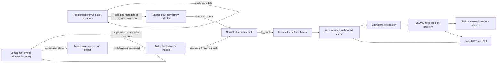
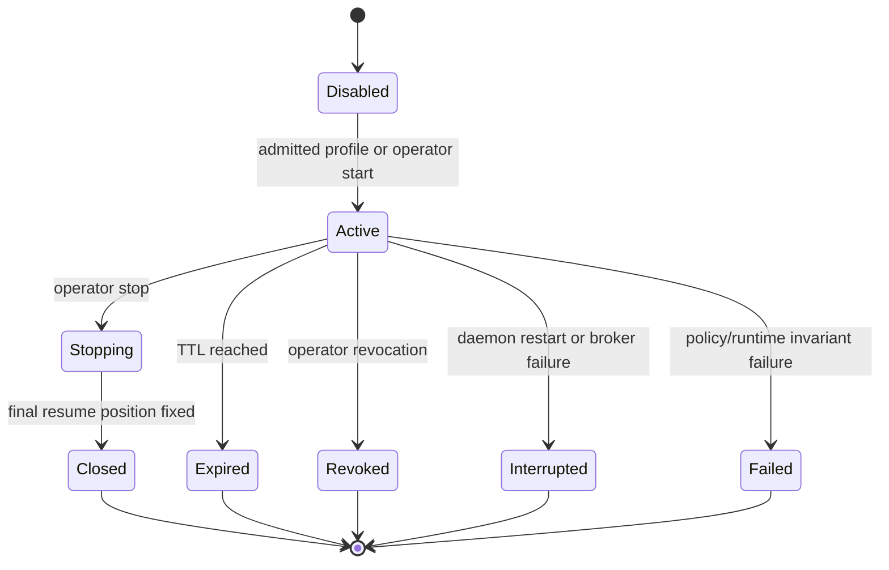
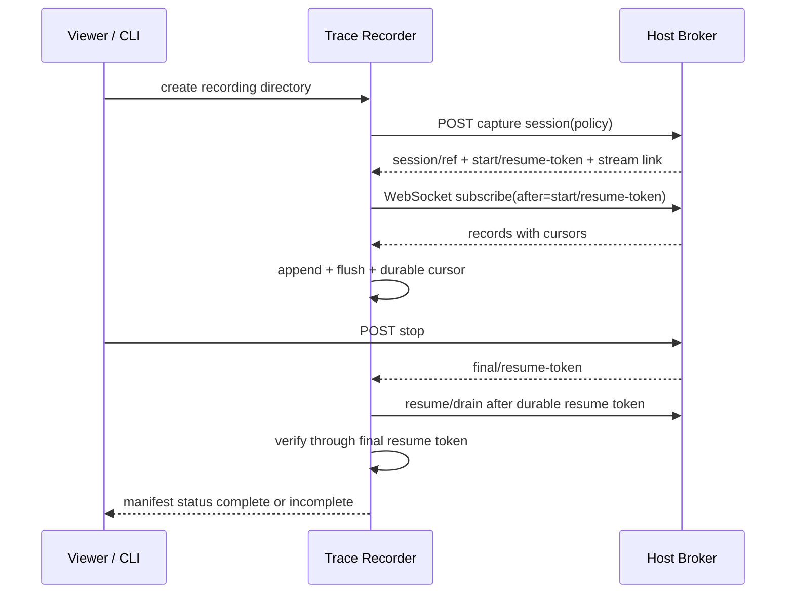

# Proposal 086: Component Communication Observation and Trace Sessions

Based on:

- `doc/project/30-stories/story-005-whisper-rumor-intake.md`
- `doc/project/30-stories/story-012-agents-share-chair-terminal.md`
- `doc/project/40-proposals/053-raw-signal-access.md`
- `doc/project/40-proposals/062-temporal-storage-convention.md`
- `doc/project/40-proposals/068-api-surface-projection.md`
- `doc/project/40-proposals/074-multi-node-federation-harness-and-trace-explorer.md`
- `doc/project/40-proposals/080-multiplexed-middleware-channel-executor.md`
- `doc/project/40-proposals/081-horizontal-protocol-primitives.md`
- `doc/project/60-solutions/013-raw-signal-access/013-raw-signal-access.md`
- `doc/project/60-solutions/019-middleware/019-middleware.md`
- `doc/project/60-solutions/034-api-surface-projection/034-api-surface-projection.md`
- `doc/project/60-solutions/043-horizontal-protocol-primitives/043-horizontal-protocol-primitives.md`
- `node:middleware-channel-core`
- `node:trace-explorer-core`

## Status

Draft

## Date

2026-08-20

## Executive Summary

Orbiplex should let an operator inspect communication between components as a
live, navigable stream without turning diagnostics into another transport,
authority source, or unbounded production log. A developer should be able to see
which component sent a message, which component received it, through which
boundary it travelled, which schema describes it, and which causal context links
it to surrounding work. When policy permits content capture, the same view should
show the JSON payload and field descriptions derived from the exact schema.

The repository already contains most lower-level ingredients: middleware
component paths and prior-input traces, multiplexed `channel_json` frames,
domain-specific daemon traces, P081 causal contexts and execution receipts, a
closed schema registry projected through OpenAPI, and the redacted P074 Trace
Explorer read model. What is missing is one neutral **communication observation
plane** joining those ingredients at explicit component boundaries. The plane has
one logical host-owned observation port and broker, but it does not force every
application message through one physical interception point. Shared transport and
dispatch owners contribute observations through a small number of reusable
boundary-family adapters.

Some middleware also communicates through an independently authorized channel
that the host does not carry, for example with an external service or a native
client. Such a component may voluntarily submit a bounded communication report
through its authenticated `channel_json` session. The host records only that the
component made the report. It does not silently upgrade the report into proof of
delivery, admission, or remote behavior.

This proposal adds that plane in five strata:

1. a registry of observable communication boundaries;
2. a schema-gated communication observation contract;
3. a bounded, non-blocking host broker with resumable cursors;
4. a reusable recorder that writes an append-only trace-session directory using
   JSONL, exact schema snapshots, and content-addressed large payloads;
5. a shared read model consumed by a browser UI, a future Tauri shell, CLI tools,
   and P074 Trace Explorer adapters.

Observation is disabled by default. Explicit development and test profiles enable
it; acceptance harnesses enable it deterministically. Production enables it only
through a bounded, expiring operator session. The host retains no durable raw
communication history by default. A viewer or CLI recorder owns session
persistence, retention, and export.

## Context and Problem Statement

Orbiplex components communicate through several different mechanisms:

- in-process typed ports and host-owned routers;
- supervised middleware hooks and host capabilities;
- the shared `channel_json` WebSocket;
- retained HTTP product or compatibility surfaces;
- Room, INAC, Artifact Delivery, Messaging, Sensorium, and other network-facing
  protocols;
- append-only stores and asynchronous continuations that connect work across
  time rather than through one live call stack.

A host-owned adapter can observe only boundaries that the host carries or invokes.
A supervised module may additionally own an authorized network or IPC boundary
outside the host data path. Requiring a custom trace broker in every such module
would duplicate lifecycle, queueing, schema, privacy, and persistence mechanics.
Ignoring those paths would instead make boundary coverage look stronger than it
is. P086 therefore separates host observation from component reporting while
feeding both through one logical collection port.

Each mechanism exposes a different fragment of diagnostic evidence. For example:

- P053 `component_io_trace[]` preserves selected prior component inputs for one
  middleware passage, but is intentionally not durable or a general debug flag;
- `middleware-channel-frame.v1` already carries session, sequence, direction,
  operation, correlation, payload schema, and payload;
- daemon streams such as `trace/middleware`, `trace/network`, and `trace/agora`
  retain domain-specific observations with different shapes;
- P081 provides canonical causal context and execution receipts;
- `trace-explorer-core` projects redacted evidence into P074 `trace-event.v1` and
  `trace-link.v1`, but does not collect arbitrary payloads or own a live broker;
- P068 exposes the daemon's closed schema registry through
  `GET /v1/openapi.json`, but communication observations do not consistently bind
  an exact schema digest suitable for offline field help.

The result is useful evidence without one coherent answer to a basic debugging
question:

> What entered this component, what left it, through which explicit boundary,
> under which schema and policy, and what happened before and after it?

Adding more ad hoc log lines would worsen the fragmentation. Routing all
communication through a new tracing service would instead make diagnostics part
of the operational data plane and create a new failure domain. The missing layer
must therefore observe existing explicit boundaries without owning their meaning,
authorization, delivery, or effects.

## Current Mechanisms and Their Boundaries

| Mechanism | Existing value | Boundary retained by this proposal |
| :--- | :--- | :--- |
| P053 Raw Signal Access | In-memory component path and selected prior inputs | Remains passage-local input for components, not an operator trace store |
| P080 `channel_json` | Central multiplexed frame with sequence, correlation, schema, and JSON payload | Becomes the first host-observed adapter and gains one bounded optional module-to-host report operation without changing invocation authority |
| Daemon trace streams | Durable domain-specific evidence and selected live SSE events | Remain source-owned facts; P086 does not replace their semantics |
| P081 causal context and receipts | Cross-component and cross-time causal identity | Reused when present; absence is explicit and never fabricated |
| P068 schema registry | Closed local resolution from schema URN to JSON Schema | Reused for exact local schema snapshots and tooltips |
| P074 Trace Explorer | Redacted, normalized causal timeline and graph | Consumes P086 session records through an adapter; does not become the capture plane |

The existing general daemon SSE bus is not suitable as the communication stream.
Its subscriber channels are not the bounded, cursor-addressable, backpressure-aware
contract required for potentially high-volume observations. P086 defines a
separate broker rather than silently changing the lifecycle and performance
semantics of general operator events.

## Goals

- Make communication across every registered component boundary observable in a
  common, schema-gated shape.
- Use one neutral logical observation port and host broker while keeping physical
  instrumentation inside a small number of shared boundary-family owners.
- Let an authenticated middleware component report communication over an admitted
  private boundary that the host cannot directly observe.
- Show source, target, direction, boundary, operation, sequencing, correlation,
  causal context, payload schema, digest, size, and capture disposition.
- Permit live JSON inspection under an explicit local capture policy.
- Keep the primary communication path independent from viewer speed, recorder
  failure, disk pressure, or trace consumers.
- Provide honest cursor and gap semantics instead of claiming complete history
  after overflow or reconnect loss.
- Let a viewer or CLI retain a navigable session after its observations later
  leave the host's bounded buffer.
- Use simple append-only JSONL as the durable session source of truth.
- Preserve exact schemas and large payload artifacts needed for offline inspection.
- Reuse one read model across Node UI, a future Tauri shell, CLI, and P074.
- Enable deterministic communication evidence in development, test, and acceptance
  profiles while remaining disabled by default in production.

## Non-Goals

- No transparent interception of arbitrary function calls. An interaction is
  observable only when it crosses a registered communication boundary.
- No claim that a component-reported communication happened merely because the
  host received its report.
- No replacement for domain audit logs, P081 execution receipts, or P074 traces.
- No new transport through which components communicate with each other.
- No network, IPC, capability, or effect authority created by trace reporting.
- No authority derived from an observed payload, schema, source label, or viewer
  action.
- No mandatory durable raw-payload retention by the daemon.
- No decryption performed solely for diagnostics.
- No automatic remote schema fetching.
- No production-wide packet capture enabled by a debug build or environment guess.
- No promise of a total order across nodes. Host cursor order is an observation
  order, not a causal or global-clock claim.
- No requirement that non-JSON bytes become JSON. Binary, sealed, and artifact
  traffic remains represented by typed metadata, digest, size, and safe references.

## Terminology

| Term | Meaning |
| :--- | :--- |
| **Communication boundary** | A registered place where one component or endpoint sends data to another through a typed port, router, channel, protocol adapter, or asynchronous handoff. |
| **Boundary-family adapter** | Shared infrastructure code owned by a transport, dispatcher, or typed-port decorator. One adapter implementation may project many registered logical boundaries. |
| **Observation sink** | The single neutral host-local port through which every boundary-family adapter and admitted component-report ingress submits an observation draft using non-blocking `try_emit`. |
| **Host-observed observation** | Evidence projected by a host-owned boundary that directly saw the described stage. |
| **Component-reported observation** | Evidence that an authenticated component reported a communication claim concerning one of its admitted boundaries. It does not prove the claimed remote event. |
| **Component trace report** | A bounded module-to-host `component-communication-report.v1` value carried by `middleware.trace.report`. |
| **Capture plane** | The host-local observation and broker path. It does not carry application messages or authorize effects. |
| **Capture session** | A bounded host-owned interval during which matching observations are emitted under one exact policy and cursor generation. |
| **Recording session** | A consumer-owned durable directory produced by the shared recorder from one capture stream. |
| **Trace recorder** | Reusable logic used by viewer and CLI to append session records, schemas, artifacts, cursor progress, and completeness evidence. |
| **Gap** | A typed statement that one or more observations are no longer available to a consumer. It is evidence of incompleteness, not an empty interval. |
| **Schema snapshot** | The exact local JSON Schema document resolved by canonical ref and verified digest, copied into the recording directory for offline use. |
| **Capture disposition** | Orthogonal content location (`none`, `inline`, or `artifact`) plus one decisive reason explaining omission, redaction, or externalization. A content digest is independent metadata, not a mode. |

## Proposed Model

### Decisions

1. P086 owns the local communication capture plane. P074 remains a redacted
   normalized consumer and cross-source explorer.
2. Observation occurs only at explicit, registered boundaries. A structural
   inventory makes missing coverage visible; instrumentation does not pretend to
   observe arbitrary in-process calls.
3. The capture plane is disabled for the production/default and unknown profiles.
   Explicit development and test profiles enable it. Acceptance harnesses enable
   it through checked configuration, never through build-mode inference.
4. Enabling observation and enabling payload disclosure are separate decisions.
   Development enables metadata and permitted digests for all registered
   boundaries and may include redacted JSON only through an admitted
   schema-specific redaction profile. Test and acceptance profiles may include
   full synthetic fixture payloads from an explicit allowlist. Content location,
   disposition reason, and digest presence remain separate data.
5. Production payload capture requires a fresh operator-authorized, expiring
   capture session. Durable remembered consent cannot silently enable indefinite
   capture.
6. Exactly one payload-bearing capture policy is effective per node process in V1.
   Several read-only subscribers may consume the same stream. This avoids
   conflicting redaction and payload-retention decisions in the hot path.
7. Observation is best-effort relative to application traffic. Capture failure,
   broker pressure, or viewer loss cannot change a domain result. Acceptance may
   fail after the scenario when required observations are missing, but tracing
   never blocks the observed operation.
8. The host owns only a bounded process-local ring and bounded subscriber queues.
   Restart clears them. Explicit production sessions are not restored after
   restart; development and test profiles start a new cursor generation.
9. The viewer does not own a private persistence format. Viewer and CLI use one
   shared trace recorder and one trace-session directory contract.
10. JSONL segment records and content-addressed artifacts are the durable session
    source of truth. A search index is an optional rebuildable cache.
11. Session completeness is a first-class state. Buffer eviction, recorder crash,
    storage exhaustion, schema loss, and an unclean final resume position produce an
    `incomplete` or `aborted` recording, never a false `complete` result.
12. Schema help uses only the host's trusted local registry and exact digests.
    Payload-supplied URLs are descriptive content and are never fetched.
13. Private keys, auth tokens, bearer tokens, cookies, passphrases, and other
    distribution-defined secret classes are never exposed as plaintext trace
    payloads, including in an operator raw-capture session.
14. Sealed payloads are not decrypted for tracing. Their outer schema, digest,
    size, route metadata, and already-visible headers may be observed.
15. P086 observations do not prove domain acceptance, delivery, or causation by
    themselves. Stage, source evidence, and P081/P074 links retain those
    distinctions.
16. A completeness-capable recorder consumes the whole effective capture stream
    without server-side presentation filters. Timeline, component, operation, and
    schema filters belong to the viewer read model. A deliberately filtered export
    is a projection and cannot claim complete capture-session coverage.
17. All observations enter the broker through one neutral logical observation
    sink. Domain components, middleware implementations, and transport adapters do
    not depend on the broker, recorder, daemon API, or viewer implementation.
18. Physical instrumentation is owned by shared boundary families, not repeated
    per component. One `channel_json` session adapter, middleware passage
    decorator, peer session adapter, Room carrier adapter, or HTTP boundary
    adapter may serve many registry entries supplied as data. Host-capability
    dispatch remains one logical family but may need several physical adapters
    until its existing dispatch signatures are unified.
19. The disabled path uses a no-op sink and checks a precomputed capture-interest
    table before copying, projecting, or serializing payload content. A disabled
    process performs one relaxed policy-generation check before any table lookup.
20. A supervised middleware component may submit `middleware.trace.report` for a
    boundary present in the startup registry. The host always overwrites reporter
    identity with data from the authenticated channel session; V1 does not add a
    separate anti-spoofing protocol, report-specific abuse window, or session-close
    policy.
21. Host-observed and component-reported records use the same boundary-stage
    vocabulary. A component trace report remains a claim because
    `evidence/kind` is `component-reported`, not because its stage uses a second
    enum or nesting field. Host receipt time is recorded separately.
22. Trace reporting never grants the communication being reported. The component
    must independently possess the capability, effect admission, sandbox policy,
    and network or IPC authority required for its private boundary.
23. In V1 the boundary registry is distribution or operator configuration read at
    startup. Runtime reports cannot add or change entries. Package-contributed
    boundary declarations, namespace ownership, replacement, and revocation are
    deferred until operating evidence shows that static configuration is
    insufficient.
24. Acceptance harnesses may use P086 in two explicit modes. The advisory-diagnostics
    mode records a bounded, policy-admitted trace for later replay but does not
    decide whether the scenario passes. Required evidence is declared by the story
    and may fail acceptance after the scenario when the recording is missing,
    incomplete, or contradicts a required communication assertion. Neither mode
    changes the observed runtime result.

### Architectural Strata



The self-edge on `Boundary` represents the existing application transport or
call path. Observation is a side projection. It is not inserted as a forwarding
hop between components. The self-edge on `Private` represents independently
authorized communication that does not traverse the host. Its report path carries
a claim about that communication, not the communication itself.

### One Logical Observation Port

P086 defines one logical port, provisionally named `CommunicationObservationSink`.
Its contract is intentionally smaller than the broker:

1. `interest(boundary_id, stage)` returns a small `Copy` value describing whether
   the current policy needs no observation, metadata, digest, a redacted
   projection, or admitted content;
2. `try_emit(observation_draft)` attempts a non-blocking submission and returns a
   bounded disposition such as `accepted`, `dropped`, `disabled`, or `refused`.

The broker rebuilds an immutable interest table indexed by `boundary/id` and stage
whenever effective policy changes. The hot path performs no selector evaluation.
Policy generation `0` means disabled and is checked through one relaxed atomic
before payload cloning, canonicalization, redaction, serialization, or table
lookup.

Transport and dispatcher constructors receive
`Arc<dyn CommunicationObservationSink>`, following the existing
`Arc<dyn HostCapabilitiesHost>` injection pattern. `NoopSink` is the default so
lower crates compile and run without daemon state. The daemon supplies the one
broker-backed implementation. These crates depend only on the neutral port and DTO
contract, never on recorder code, WebSocket presentation, or viewer types.

One logical port does not mean one physical interception point. Existing data
planes retain their own semantics and failure domains. Initial physical adapter
families are:

| Adapter family | Shared owner | Typical logical boundaries covered |
| :--- | :--- | :--- |
| `channel-json-session` | P080 channel transport | supervised module invoke, module HTTP, host capability, cancellation, control, and report ingress |
| `middleware-passage` | middleware runtime | ordered in-process hook executors and host-applied decisions |
| `host-capability-dispatch` | daemon host-capability dispatch seams | local component-to-host and host-to-provider capability calls; currently split across Inquirium, Agent, and Sensorium shapes |
| `peer-session` | peer runtime | authenticated peer WSS ingress, egress, response, and refusal |
| `room-carrier` | Room WSS runtime | Room join, live message, projection, relay, and disconnect stages |
| `http-boundary` | retained product HTTP router or client | component-significant request and response boundaries not already represented by another adapter |

The number of adapter implementations must not grow with the number of components,
operations, or registry entries. Boundary descriptors, endpoint refs, operation
families, and schema bindings are data supplied to a shared adapter. A structural
dependency guard should reject domain crates that import the broker runtime or
implement a private persistence path for P086 observations.

Asynchronous handoffs are explicitly outside V1. Enqueue, durable acceptance,
resume, expiry, and completion form a lifecycle rather than the live boundary-stage
machine below. A later extension must define that lifecycle without overloading the
V1 stage vocabulary.

### Communication Boundary Registry

`communication-boundary-registry.v1` is a versioned, reviewed inventory. Each
entry declares:

- stable `boundary/id` and owner;
- adapter family and adapter owner;
- source and target endpoint classes;
- carrier or call kind;
- supported operation family;
- where egress and ingress are observed;
- how message identity and transport sequence are obtained;
- whether P081 causal context is available;
- how payload schema refs are resolved;
- available content locations, disposition reasons, and required redaction profile;
- whether the boundary may carry hard-denied secret classes;
- whether component reporting is enabled and which stages, endpoint kinds, and
  payload schemas it may claim;
- declaration provenance: distribution or local operator configuration;
- lifecycle status: `planned`, `instrumented`, `verified`, or `retired`.

The registry is not a routing table and does not grant communication authority. A
CI checker should fail when an instrumented adapter lacks a registry entry, when a
registered schema no longer resolves, or when an entry marked `verified` has no
positive and refusal fixture. It cannot prove that every possible direct Rust call
has been registered; architectural dependency guards and review remain responsible
for preserving component boundaries.

The V1 registry is a closed configuration file loaded and validated at process
start. A runtime report cannot register a boundary or mutate the active table.
Changing the registry requires changing admitted configuration and restarting the
process; live package contribution is a post-V1 concern.

### Canonical Observation Points

Each adapter emits at most the stages it can prove:

| Stage | Observation point | Meaning |
| :--- | :--- | :--- |
| `egress-admitted` | After source-side contract and authority admission, before transport enqueue or call dispatch | The source boundary admitted an attempt; delivery is not implied |
| `egress-failed` | After an admitted attempt could not be enqueued or sent | The source-side carrier failed |
| `ingress-admitted` | After decode and receiving-boundary contract admission, before domain effects | The receiver admitted the message shape and local call |
| `ingress-refused` | At receiving-boundary refusal | Metadata and typed reason may be retained; content follows the refusal capture policy |
| `completed` | When the boundary owns an exact response or completion | Completion belongs to this boundary, not necessarily to the wider workflow |
| `timed-out` | When the owning boundary's deadline expires | Retryability comes from the owning contract |
| `canceled` | When the exact request is canceled | Cancellation does not imply effect rollback |

An egress and ingress observation may describe the same message. They share an
exact message, request, frame, or delivery ref where the underlying protocol
provides one. `message/ref` is comparable only within the join scope declared by
the registry. The V1 join key is `boundary/id` plus `message/ref`, and additionally
`transport/session-ref` when the registry declares session-scoped message refs.
`correlation/id` groups a wider workflow and never authorizes merging two boundary
events into one edge. Without an exact join key, the viewer keeps observations
separate.

`transport/sequence` is scoped by `transport/session-ref`; the JSON Schema uses
`dependentRequired` so a sequence cannot occur without its session ref.

### Component-Reported Observations

`middleware.observe` remains the host-to-module observer operation defined by
P080. P086 adds a separate module-to-host `middleware.trace.report` event carrying
`component-communication-report.v1`. Reusing the existing name would reverse its
direction and conflate observation delivery with report ingestion.

The module report contains only component-supplied claims:

- module-scoped `report/id` and optional local sequence;
- a `boundary/id` present in the startup registry;
- claimed `source` and `target`;
- `stage` from the same closed vocabulary as host-observed records;
- operation, optional message ref, `correlation/id`, and `causal/context-ref`;
- claimed occurrence time, kept separate from host receipt time;
- payload schema ref, representation, size, digest basis, optional content digest,
  and optional policy-admitted JSON value;
- bounded component reason code and retryability when reporting failure.

The host derives and overwrites the fields that establish provenance:

- reporter component and module refs from the authenticated channel session;
- channel session ref, epoch, and inbound frame sequence;
- host `observed/at`, process generation, and observation cursor;
- `evidence/kind: component-reported`;
- effective payload capture and redaction disposition.

An admitted report becomes a `component-communication-observation.v1` with the
claimed canonical stage and `evidence/kind: component-reported`. The viewer shows
reported edges differently from host-observed edges, for example as dashed lines,
and exposes the host-derived reporter without requiring the operator to inspect raw
JSON. Any assurance label is a read-model projection of evidence kind and
corroboration, not persisted source data.

The shared `channel_json` adapter may separately emit host-observed evidence for
the `middleware.trace.report` frame itself. That record proves that the host
received or admitted the report envelope; the resulting component-reported record
describes the claim about another boundary. They are not duplicates and are linked
by channel frame and report refs. Projecting the claim never sends a new report
frame and therefore cannot recursively amplify tracing.

Reporting is negotiated as an optional P080 channel operation. It reuses the
channel's existing frame-size, queue, fairness, and drop semantics rather than
introducing a report-specific rate window or abuse-triggered session closure. The
shared middleware helper may drop locally when reporting is disabled or the
observer path is saturated, and the host uses the same non-blocking observation
admission as its adapters.

The host applies its own classification and disclosure policy. Component-supplied
labels may narrow capture but cannot raise it. Unknown schemas omit content while
an independently admitted digest may remain; hard-denied secret classes enter the
broker as safe metadata only, without content or portable digest. Report content
cannot create a low-entropy-secret oracle. The report mechanism does not authorize
the private connection, grant a capability, admit an effect, or establish remote
delivery.

A shared middleware SDK helper owns framing, negotiation, a bounded local drop
counter, ids, and serialization. A middleware implementation chooses only where to
call the helper around a private boundary. It does not implement a broker, recorder,
session store, retry loop, or P086 persistence format.

### Activation Profiles

Profile selection is explicit validated data. It is not inferred from
`cfg(debug_assertions)`, executable path, hostname, or an environment variable that
is not part of the admitted node configuration.

| Runtime profile | Capture plane | Baseline payload policy | Persistence |
| :--- | :--- | :--- | :--- |
| `production` or omitted | disabled | none | none |
| unknown or malformed | disabled with typed diagnostic | none | none |
| `development` | enabled | metadata and permitted digest; content is `inline` only after admitted redaction | host ring only until a recorder attaches |
| `test` | enabled | fixture allowlist may retain exact inline content; all other schemas use development policy | recorder selected by the test |
| `acceptance` | enabled and asserted | exact scenario policy; raw fixture values may be required evidence | mandatory session bundle when the scenario requests P086 evidence |
| explicit operator debug session | enabled until stop, expiry, revocation, or restart | bounded by the signed/effective session policy and hard secret floor | recorder-owned, never daemon-default |

Profile layering is monotonic with respect to disclosure. Local policy may reduce
capture. A component, remote peer, payload, schema document, or viewer cannot raise
it. Acceptance fixture policy can permit full fixture content only because the
fixture schemas and values are controlled test data; the same declaration does not
authorize production content.

The negotiated `middleware.trace.report` feature is disabled whenever the capture
plane is disabled. A development, test, acceptance, or explicit operator session
may enable reporting for selected startup-registry boundaries. A module that sends
reports despite disabled negotiation receives no capture authority; the ordinary
channel contract drops the unsupported operation.

### Payload Projection

Every observation records the payload metadata admitted by policy even when
content is omitted:

- canonical schema ref when known;
- exact schema digest when resolved;
- content digest over the exact observed representation when policy permits one;
- digest basis such as `wire-bytes`, `canonical-json`, or `artifact-bytes`;
- encoded size;
- encoding or media type;
- capture content location: `none`, `inline`, or `artifact`;
- one decisive `disposition/reason`: `policy`, `redaction`, `size`,
  `secret-class`, `sealed`, `unknown-schema`, or `null` when no reduction or
  relocation occurred;
- redaction profile ref and digest when used;
- content-addressed artifact ref when externalized.

`capture.content` determines where admitted content is present. `payload.value` is
legal only for `inline`, `artifact/ref` only for `artifact`, and neither is legal
for `none`. The decisive reason explains the resulting disposition; it is not an
exhaustive transformation history. Presence of `content/digest` is independent of
that pair and remains governed by digest policy.

Unknown or unresolved schemas use `content: none` with
`disposition/reason: unknown-schema`, while policy may still permit a digest. Hard
secret classes omit both plaintext and portable content digest because a hash of a
low-entropy secret can become an oracle. Sealed payloads use `content: none` and
`disposition/reason: sealed`. A future host-scoped keyed fingerprint may be
specified separately, but is not a content digest and cannot leave the node. A
field-name denylist may provide defense in depth, but cannot substitute for
schema-specific classification and redaction. The redactor runs before content
enters the host ring, subscriber queue, recorder, or UI.

Consumers compare content digests only when their declared digest bases match. An
adapter must not silently compare canonical JSON with exact wire bytes or artifact
bytes.

Typical bounded JSON stays inline. Payloads above the recorder's inline threshold
are written once to `artifacts/` by content digest and referenced from JSONL with
`content: artifact` and `disposition/reason: size`. The host broker may
independently omit payload content to respect its own byte cap; it records
`content: none` and the decisive reason rather than emitting malformed or silently
truncated JSON.

### Host Trace Broker

The host broker owns one process generation and one monotonically increasing
`observation/cursor`. The cursor provides resumption and local observation order; it
is not a semantic event sequence.

Observation identity is derived from `node/ref`, process generation, and cursor.
Capture sessions and subscribers do not participate in that identity. Every record
has `occurred/at` and `observed/at`: the former belongs to the boundary event, while
the latter is assigned when the host submits it to the broker. A synchronous
host-owned adapter may set them equal.

V1 lifecycle declaration:

| Resource | Owner | Key | Initial default cap | Eviction / expiry | Restart |
| :--- | :--- | :--- | :--- | :--- | :--- |
| Capture-interest table | daemon trace runtime | policy generation + boundary id + stage | registry entry count times closed stage count | atomically replaced on policy change | rebuilt; generation `0` remains disabled until ready |
| Observation ring | daemon trace runtime | process generation + cursor | 16,384 records and 64 MiB | oldest first; creates an observable gap for lagging cursors | cleared |
| Subscriber queue | one stream connection | subscriber id | 1,024 records and 8 MiB | connection becomes lagged and must resume with a generation-bound token | removed |
| Causal-context snapshot store | daemon trace runtime | context ref + digest | 4,096 contexts and 16 MiB | evict only when no retained observation references the context; otherwise drop the new snapshot and expose it as unavailable | cleared |
| Explicit capture session | daemon trace runtime | capture session id | one payload-bearing session; eight subscribers | default TTL 30 minutes, configurable up to 8 hours; stop/revoke/expiry | interrupted, never restored |
| Development/test baseline | runtime profile | process generation | one rolling generation | ends at shutdown | recreated with a new generation |

The exact distribution safety ceilings must be justified by load tests before
implementation freeze. Operators may tighten the defaults. Widening remains below
the distribution's proven allocator and frame safety bounds.

`try_emit` never waits for a viewer, disk, schema resolver, or subscriber. Broker
overload increments bounded counters and advances gap evidence. The application
operation continues under its own contract.

Resume position is the pair `(process generation, observation cursor)`. The API
encodes that pair in an opaque `resume/token`; a cursor number alone is never
accepted after restart or across generations.

### Capture Session Lifecycle



Stopping fixes the final resume position: process generation plus `final/cursor`.
It does not erase buffered observations. A recorder may continue draining until
that cursor leaves the ring. Expiry and revocation also fix a final position when
the broker can do so safely. Restart cannot promise one and therefore leaves the
recording incomplete unless the recorder had already closed.

### Trace Recorder

`communication-trace-recorder` is reusable library/runtime logic below CLI and UI.
It owns:

- opening and locking one recording directory;
- subscribing from an exact start resume token;
- appending validated records to JSONL segments;
- advancing the durable resume position only after the corresponding append batch is
  flushed;
- rotating segments by byte cap;
- resolving and snapshotting each exact schema once per digest;
- snapshotting each causal context once per ref and digest;
- externalizing large payloads by digest;
- recording gaps and capture-policy transitions;
- draining to the final resume token on clean stop;
- producing an atomically replaced, rebuildable manifest projection;
- marking interrupted, storage-exhausted, corrupt, or incomplete recordings
  honestly.

Viewer and CLI must not implement separate persistence rules. A future Tauri shell
may package the recorder, but consumes the same contracts and directory format.

### Recording Session Directory

```text
trace-session-<recording-id>/
├── manifest.json
├── events-000001.jsonl
├── events-000002.jsonl
├── schemas/
│   └── sha256-<digest>.json
├── contexts/
│   └── sha256-<digest>.json
├── artifacts/
│   └── sha256-<digest>
└── index.sqlite             # optional, rebuildable, never authoritative
```

Each JSONL line is one closed `component-trace-record.v1` envelope with an explicit
`record/kind`. Lines are independently parseable and byte bounded. A crash may
leave only the final line incomplete; the reader discards that fragment, records
recovery evidence, and marks the recording `incomplete` unless all records through
the final resume position are present.

An observation carries `causal/context-ref` and `correlation/id`, not an embedded
`causal-context.v1`. An adapter draft may supply the exact context value alongside
the ref; the broker interns it by ref and digest, and the recorder stores it once
under `contexts/`. Stream setup supplies any retained context snapshot required by
the first dependent observation. Missing context is explicit and affects
completeness when the capture policy requires causal context.

Observations do not repeat `policy/ref` or `policy/digest`. The effective policy is
the latest preceding `policy-transition` record. The subscription handshake also
supplies the current policy ref and digest; a recorder writes an initial transition
or a changed transition before appending dependent observations. Historical policy
changes remain cursor-ordered stream records. If a required transition fell behind
a gap, the recording is incomplete rather than guessed.

V1 recorder lifecycle declaration:

| Resource | Owner | Key | Initial default cap | Cleanup | Recovery |
| :--- | :--- | :--- | :--- | :--- | :--- |
| JSONL segment | trace recorder | recording id + segment no | 64 MiB | retained by session policy | validate complete lines; final fragment may be discarded |
| Recording directory | operator/test harness | recording id | 1 GiB total by default | explicit retention policy; no silent rolling deletion | exceeding cap stops recording and marks it incomplete |
| Schema snapshots | trace recorder | schema digest | 4,096 schemas per recording | removed with recording | verify digest before use |
| Causal-context snapshots | trace recorder | context ref + digest | included in total recording cap | removed with recording | verify ref and digest before use |
| Payload artifacts | trace recorder | content digest | included in total recording cap | removed with recording | verify digest and size before display |
| SQLite index | viewer/CLI | recording id | rebuild-bounded by source records | freely removable | rebuild from JSONL, schemas, and artifacts |

Recording directories use owner-only permissions by default. The recorder refuses
symlink escapes, path traversal, non-regular segment targets, conflicting content at
one digest, and writes outside its admitted root. Portable encrypted export remains
separate from ordinary local recording.

### Completeness Contract

The recorder uses these states. A recorder capable of reaching `complete` consumes
the unfiltered effective session stream; UI filters are applied after local append:

| State | Meaning |
| :--- | :--- |
| `opening` | Directory admitted; capture start not yet bound |
| `recording` | Start resume position bound and records append normally |
| `draining` | Stop accepted; recorder is consuming through the final resume position |
| `complete` | Every cursor in the fixed generation from start through final is durably represented and all referenced local artifacts validate |
| `incomplete` | One or more typed gaps, missing cursors, missing required schemas or contexts, missing artifacts, or unclean termination exist |
| `aborted` | Recording was deliberately abandoned or cannot be parsed safely |

Completeness applies only to observations admitted by the capture policy and
boundaries instrumented in the registry. The manifest separately reports boundary
coverage, policy exclusions, omitted payloads, redactions, drops, and gaps.
It must never describe a partial boundary inventory as whole-node completeness.
For component-owned private boundaries it additionally reports whether evidence is
`component-reported`, host-observed, or corroborated by another admissible source.
`complete` means that the recorder retained every observation admitted to the P086
stream; it does not prove that a voluntarily reporting component described every
private communication event.

### Clean Start and Stop Sequence



Creating the host session before stream attachment is safe because the bounded ring
retains observations from the start resume position. If attachment occurs too late
and that position has already been evicted, the first returned record is a typed
gap and the recording is incomplete.

### Schema Resolution and Offline Help

An observation adapter converts short wire schema names, where necessary, into a
canonical local `schema/ref` and exact digest. Resolution uses the P068 closed schema
registry. A mismatch between declared ref, registry `$id`, and digest is a typed
capture diagnostic; it does not cause remote fetching or reinterpretation.

The recorder copies each referenced schema once into `schemas/`. The viewer follows
local `$ref` values within the admitted snapshot set and maps a hovered payload field
to JSON Pointer. Tooltips may display `title`, `description`, `type`, `format`, enum
values, bounds, and deprecation metadata. Unknown or missing schemas still allow a
bounded raw JSON tree when policy admitted the payload, but the viewer labels the
field meaning as unverified.

### Operator API

The first daemon surface should be operator-authenticated and local by default:

| Method and path | Purpose |
| :--- | :--- |
| `POST /v1/operator/component-trace-sessions` | Start one admitted capture session and return start resume token plus affordances |
| `GET /v1/operator/component-trace-sessions/{session_id}` | Inspect current state, policy digest, cursor window, counters, expiry, and links |
| `POST /v1/operator/component-trace-sessions/{session_id}/stop` | Stop capture and fix the final generation-bound resume position |
| `POST /v1/operator/component-trace-sessions/{session_id}/revoke` | Revoke the capture session immediately and retain bounded audit evidence |
| `GET /v1/operator/component-trace-sessions/{session_id}/stream?after={resume_token}` | Upgrade to the bounded WebSocket stream and resume after an exact generation-bound position |

Responses should expose HATEOAS links for status, stream, stop, revoke, OpenAPI, and
schema resolution. Tokens, raw policy secrets, absolute paths, and non-admitted
payloads are never returned in status projections.

WebSocket is selected over the general SSE bus because the client needs an explicit
subscription request, filters, cursor resumption, lag notification, and future
bounded control messages. The stream remains one-way for observations after
subscription; viewer commands do not travel in observation records.

`resume_token` is opaque, bounded, host-issued data encoding process generation and
cursor. It is scoped to the node and capture stream, is not an authority token, and
fails closed when malformed or presented to another generation.

### Viewer Read Model

The first useful viewer has four coordinated projections:

1. a virtualized event timeline with pause, follow, filters, gaps, and cursor state;
2. a component graph whose edges animate only from observed communication events;
3. a focused source/target view showing two endpoint tiles and the exact direction,
   boundary, stage, operation, sequence, and correlation;
4. a JSON panel with raw/redacted disposition, digest, schema link, JSON Pointer,
   and schema-derived field help.

The same read model opens a live stream or an existing recording directory. Offline
navigation cannot require the originating host. Tauri is a presentation and
packaging option, not another protocol or trace interpretation.

### P074 Integration

P086 recording sessions are detailed local diagnostic sources. P074 remains the
cross-store and cross-node normalized explorer:

- a P074 adapter projects selected P086 records into `trace-event.v1` and
  `trace-link.v1`;
- normalized P074 bundles remain metadata-first and redacted by default;
- P074 links may point to a local recording record, schema digest, or payload
  artifact without copying raw payload into the normalized bundle;
- P074 projection preserves whether an edge was host-observed or
  component-reported and never upgrades a component-reported stage into delivery
  proof;
- multi-node ordering still uses causal links and partial order, not host cursor
  comparison;
- a future harness may start one P086 recording per node and collect the resulting
  directories as test artifacts.

## Contract Family

### `communication-boundary-registry.v1`

Versioned inventory of observable boundaries, owners, endpoint classes, carrier
kinds, operation families, schema-resolution rules, adapters, capture dispositions,
and verification status. V1 loads this value from distribution and operator
configuration during startup.

```json
{
  "schema": "communication-boundary-registry.v1",
  "schema/v": 1,
  "registry/revision": "communication-boundaries:development:v1",
  "boundaries": [
    {
      "boundary/id": "middleware-channel",
      "owner/component-ref": "component:middleware-channel-transport",
      "adapter/family": "channel-json-session",
      "adapter/owner-ref": "component:middleware-channel-transport",
      "carrier/kind": "websocket",
      "source/endpoint-kinds": ["host", "middleware-module"],
      "target/endpoint-kinds": ["host", "middleware-module"],
      "operation/family": "middleware-channel",
      "observed/stages": [
        "egress-admitted",
        "egress-failed",
        "ingress-admitted",
        "ingress-refused",
        "completed",
        "timed-out",
        "canceled"
      ],
      "message/ref-scope": "transport-session",
      "transport/sequence-scope": "transport/session-ref",
      "payload/schema-source": "frame.payload/schema",
      "capture/content": ["none", "inline", "artifact"],
      "component/reporting": false,
      "status": "verified"
    }
  ]
}
```

`message/ref-scope: transport-session` means that the viewer joins observations
only by `(boundary/id, transport/session-ref, message/ref)`. A boundary with a
globally unique canonical message ref may declare `boundary` scope and omit the
transport session from the join key.

### `component-communication-observation.v1`

```json
{
  "schema": "component-communication-observation.v1",
  "schema/v": 1,
  "observation/id": "component-observation:node-local:process-generation-7:431",
  "observation/generation": "process-generation:7",
  "observation/cursor": 431,
  "occurred/at": "2026-08-20T12:00:00Z",
  "observed/at": "2026-08-20T12:00:00Z",
  "node/ref": "node:local",
  "boundary/id": "middleware-channel",
  "boundary/kind": "channel-json",
  "stage": "egress-admitted",
  "evidence": {
    "kind": "host-observed",
    "adapter/family": "channel-json-session",
    "observer/ref": "component:middleware-channel-transport"
  },
  "source": {"endpoint/kind": "component", "endpoint/ref": "component:daemon"},
  "target": {"endpoint/kind": "component", "endpoint/ref": "component:inquirium-adapter"},
  "message/ref": "middleware-request:req-123",
  "operation": "middleware.invoke",
  "transport/session-ref": "middleware-session:example",
  "transport/sequence": 42,
  "causal/context-ref": "causal-context:example",
  "correlation/id": "correlation:example",
  "payload": {
    "schema/ref": "urn:orbiplex:schema:inquirium-adapter-invoke:v1",
    "schema/digest": "sha256:...",
    "content/digest": "sha256:...",
    "content/digest-basis": "canonical-json",
    "size/bytes": 712,
    "capture": {
      "content": "inline",
      "disposition/reason": "redaction"
    },
    "redaction/profile-ref": "trace-redaction:inquirium-invoke:v1",
    "value": {}
  }
}
```

The exact schema closes endpoint kinds, stages, boundary kinds, content locations,
disposition reasons, evidence kinds, and payload-content alternatives. Payload
`value` and `artifact/ref` are mutually exclusive and constrained by
`capture.content`. `transport/sequence` requires `transport/session-ref`. For
`component-reported` evidence the schema additionally requires host-derived
reporter identity, report ref, and channel-session evidence.

`observation/id` is deterministically derived from `node/ref`,
`observation/generation`, and `observation/cursor`. It is stable across subscribers,
capture sessions, recordings, and P074 imports. Effective policy is determined by
the latest preceding `policy-transition` stream record rather than repeated in
every observation.

### `component-communication-report.v1`

Bounded component-supplied claim carried by the module-to-host
`middleware.trace.report` channel operation:

```json
{
  "schema": "component-communication-report.v1",
  "schema/v": 1,
  "report/id": "component-trace-report:mail-adapter:431",
  "boundary/id": "component:mail-adapter:smtp-client",
  "source": {"endpoint/kind": "component", "endpoint/ref": "component:mail-adapter"},
  "target": {"endpoint/kind": "network-service", "endpoint/ref": "smtp:example.net"},
  "stage": "egress-admitted",
  "operation": "smtp.message.submit",
  "message/ref": "message:sha256:...",
  "causal/context-ref": "causal-context:example",
  "correlation/id": "correlation:example",
  "occurred/at": "2026-08-20T12:00:00Z",
  "payload": {
    "schema/ref": "urn:orbiplex:schema:smtp-submission:v1",
    "content/digest": "sha256:...",
    "content/digest-basis": "canonical-json",
    "size/bytes": 1842
  }
}
```

The report cannot contain host-derived reporter identity, channel-session evidence,
host receipt time, observation cursor, capture disposition, effective classification,
or redaction result. Unknown fields are rejected. The host overwrites reporter
identity from the channel session and stamps `observed/at`; no body field can
override either value.

The V1 handler has one small, closed disposition vocabulary:

| Code | Meaning |
| :--- | :--- |
| `accepted` | The report names a configured boundary, has valid shape, and was submitted to the observation sink. |
| `reporting-disabled` | The current channel state did not negotiate component reporting. |
| `boundary-unregistered` | The startup registry has no current entry for the named boundary. |
| `report-invalid` | The report failed its closed schema or bounded semantic validation. |
| `observer-dropped` | The non-blocking observation path had no capacity. |

The host records bounded counters and safe diagnostics only; it does not echo
rejected payload content or synchronously acknowledge each event. This is handler
diagnostics, not a report-specific abuse or refusal protocol. Every non-success
code requires one reachability fixture.

### `component-trace-policy.v1`

Operator/distribution-authored selectors and disclosure bounds:

- runtime profile;
- component, boundary, operation, schema, and classification selectors;
- evidence-source and reporter selectors;
- effective content location, digest policy, and disposition bounds;
- per-record, per-session, and total-byte limits;
- redaction profile bindings;
- expiry and reason;
- hard secret exclusions inherited from the distribution;
- operator binding and detached signature for explicit production sessions.

### `component-trace-session.v1`

Host capture-session state, process generation, start/final cursors, effective
policy ref and digest, generation-bound start/final resume tokens, counters, expiry,
stop/revoke/interruption reason, and operator-visible links.

### `component-trace-gap.v1`

Closed gap evidence containing the requested cursor, earliest available cursor,
latest available cursor, known lost count when derivable, reason code, boundary
filters, and observation generation. Requested and available positions are always
generation-bound. It never contains payload data.

### `component-trace-record.v1`

One independently parseable JSONL line. `record/kind` is required and closed over:
`observation`, `gap`, `session`, `policy-transition`, `context-snapshot`,
`recovery`, or `recorder-diagnostic`. The envelope carries recording-local sequence
and exactly one value matching the discriminator.

### `component-trace-manifest.v1`

Rebuildable recording summary containing:

- recording and capture session refs;
- node and process generation;
- start, durable, and final cursors;
- start/end timestamps;
- effective policy and redaction digests;
- segment, schema, context, and artifact inventories with digests and sizes;
- boundary coverage and exclusions;
- observation, redaction, omission, drop, and gap counters;
- lifecycle status and bounded reason code;
- recorder version and format profile.

## Named Invariants

- `inv-component-trace-single-logical-sink`: every host-observed adapter and
  admitted component-report ingress submits through the same neutral observation
  port; no parallel broker or persistence semantics exist.
- `inv-component-trace-instrumentation-is-boundary-owned`: shared transport,
  dispatcher, or typed-port owners implement instrumentation; domain
  components do not depend on the broker runtime.
- `inv-component-trace-disabled-path-is-cheap`: policy generation `0` is checked
  before table lookup, and enabled capture resolves a precomputed
  `(boundary/id, stage)` interest entry before payload cloning, canonicalization,
  redaction, or serialization.
- `inv-component-trace-disabled-by-default`: production/default and unknown
  profiles emit no observations unless an operator capture session is admitted.
- `inv-component-trace-profile-is-explicit`: build type and ambient process
  environment do not select disclosure policy.
- `inv-component-trace-boundary-is-registered`: every observation names one current
  reviewed boundary entry and owning adapter.
- `inv-component-trace-boundary-registry-is-startup-data`: V1 reads distribution
  and operator boundary configuration at startup; runtime reports cannot add or
  mutate entries.
- `inv-component-trace-self-report-is-claim`: a component report uses the canonical
  boundary stage with `evidence/kind: component-reported`; the host overwrites
  reporter identity from the channel session, but does not upgrade the claim into
  host-observed delivery or admission evidence.
- `inv-component-trace-report-envelope-is-not-claim`: host observation of the
  `middleware.trace.report` frame and projection of its component claim remain two
  linked evidence records; neither creates another report frame.
- `inv-component-trace-report-does-not-authorize-channel`: reporting a private
  network, IPC, or client interaction does not grant the capability or effect that
  permits that interaction.
- `inv-component-trace-does-not-block-primary-flow`: tracing pressure or failure
  cannot delay, refuse, retry, or change the observed domain operation.
- `inv-component-trace-observation-does-not-create-authority`: payload, schema, trace
  policy, and viewer state are descriptive only.
- `inv-component-trace-disclosure-is-policy-bounded`: no component, peer, payload,
  or viewer can raise the host-selected content or digest disposition.
- `inv-component-trace-secrets-never-inline`: hard secret classes are omitted or
  represented only by approved non-content metadata, without portable plaintext
  digest, including during raw operator sessions.
- `inv-component-trace-sealed-content-stays-sealed`: tracing never introduces a
  decryption path.
- `inv-component-trace-schema-is-local-and-digest-bound`: tooltips and validation
  use an exact trusted local schema ref/digest pair and never remote content.
- `inv-component-trace-gap-is-visible`: a consumer cannot cross an unavailable
  cursor interval without typed gap evidence.
- `inv-component-trace-observation-id-is-generation-bound`: node ref, process
  generation, and cursor determine identity independently of capture session,
  subscriber, or recording.
- `inv-component-trace-resume-is-generation-bound`: a cursor without its process
  generation is never a valid resume position.
- `inv-component-trace-policy-is-stream-state`: an observation inherits the latest
  preceding policy transition; subscription handshake supplies current policy, and
  the recorder materializes a transition before dependent observations.
- `inv-component-trace-context-is-referenced`: observations carry a context ref and
  correlation id; exact causal contexts are digest-bound snapshots rather than
  repeated embedded values.
- `inv-component-trace-host-buffer-is-ephemeral`: restart clears host history and
  cannot silently restore an explicit production capture session.
- `inv-component-trace-recording-is-append-only`: durable session history is JSONL
  plus immutable schema, context, and payload artifacts; mutable indexes are
  projections.
- `inv-component-trace-completeness-is-proven`: `complete` requires every cursor in
  the fixed generation through the final resume position plus all policy-required
  local artifacts.
- `inv-component-trace-complete-recording-is-unfiltered`: a recording claiming
  complete capture-session coverage contains every effective stream cursor;
  presentation filters cannot alter its append path.
- `inv-component-trace-private-coverage-is-honest`: recording completeness does not
  imply that a component reported every event on a host-invisible private boundary.
- `inv-component-trace-viewer-is-a-consumer`: browser, Tauri, and CLI do not own
  domain state, routing, authorization, or trace semantics.
- `inv-component-trace-cursor-is-not-causality`: host observation order never
  replaces P081 causal context, protocol sequence, or P074 partial ordering.

## Security and Privacy

Full communication capture can expose personal content, model prompts and outputs,
private Room traffic, internal file paths, operational topology, and secrets. It is
therefore an effect with its own authority and lifecycle, not a harmless logging
flag.

Required controls:

- fresh operator authorization for production capture;
- bounded expiry and immediate revocation;
- exact source/boundary/schema selectors;
- reporter identity overwritten from the authenticated channel session;
- distinct viewer rendering for host-observed and component-reported evidence;
- schema-aware redaction before buffering;
- hard non-capturable secret classes;
- owner-only recording directories and files;
- explicit retention and deletion policy;
- no remote viewer exposure by default;
- no payload-driven schema fetch or code execution;
- bounded JSON rendering depth and size in the UI;
- audit metadata for session start, stop, revocation, expiry, and policy changes;
- ordinary P080 frame, queue, fairness, and drop bounds for component reports;
- conspicuous viewer indication of content location, disposition reason, evidence
  kind, and incomplete states.

An operator's authority over a node does not erase participant disclosure rights.
Where a source contract requires participant consent or narrower exposure, the trace
policy must intersect with that requirement. Operator authorization is necessary
for production capture, but is not automatically sufficient for every payload.

## Implementation Guidance

### Phase 0: Boundary and Data Inventory

- Freeze the example registry entry and the small handler-disposition vocabulary
  before freezing schemas.
- Inventory all cross-component communication paths in Node and bundled middleware.
- Group logical boundaries under the smallest practical set of shared physical
  adapter families; do not plan one implementation per registry entry.
- Identify host-invisible component-owned network and IPC boundaries that require
  optional component reporting rather than invented host observation.
- Record existing source/target ids, schema refs, correlation ids, sequence fields,
  classification, redaction, and lifecycle.
- Inventory the current Inquirium, Agent, and Sensorium host-capability dispatch
  signatures and define one neutral observation seam before adding that adapter.
- Reuse `DispatchTraceContext.component_path` as endpoint evidence where it is
  already threaded, adding a narrow read-only projection accessor rather than
  exposing mutable internals. Keep P053 raw-signal projection semantics separate,
  extend the same trace context to the Agent dispatch path where needed, and do not
  invent a second component-path vocabulary for P086.
- Distinguish component communication from ordinary internal helper calls.
- Publish the first `communication-boundary-registry.v1` fixture.

### Phase 1: Contract Core

- Freeze the P086 schema family and closed report-handler dispositions.
- Add positive, negative, oversized, unknown-schema, secret, disposition, resume-
  generation, join-key, and gap fixtures.
- Implement pure `communication-trace-core` DTO validation, filter matching,
  capture-disposition intersection, deterministic generation-bound event id
  derivation, resume-token validation, and payload disposition.
- Define the dependency-neutral `CommunicationObservationSink`, capture-interest
  query, no-op implementation, draft type, and non-blocking dispositions.
- Keep the core free from daemon, WebSocket, filesystem, and domain-service
  dependencies.

### Phase 2: Host Broker and Profiles

- Add explicit runtime-profile configuration and fail-closed unknown handling.
- Implement bounded ring, cursor generations, precomputed interest table, causal-
  context snapshot store, subscriber queues, gap calculation, session TTL, stop,
  revocation, restart interruption, and counters.
- Pass `Arc<dyn CommunicationObservationSink>` through adapter constructors with
  `NoopSink` as the lower-crate default. Inject exactly one broker-backed sink into
  registered adapter families; keep the broker out of domain components.
- Add the operator API and authenticated WebSocket stream.
- Keep broker writes non-blocking relative to domain traffic.

### Phase 3: First Boundary Adapter

- Instrument `channel_json` at canonical egress and ingress admission points.
- Reuse frame session, sequence, request/reply, correlation, operation, and payload
  schema rather than deriving replacements.
- Map short payload schema names through the P068 local registry.
- Prove request/response concurrency, refusal, cancellation, reconnect, and
  observer-pressure behavior.
- Keep `middleware.observe` host-to-module and reserve
  `middleware.trace.report` for the separately gated module-to-host claim path.
- Implement `middleware.trace.report` as one schema-gated, best-effort handler that
  overwrites reporter identity, checks only reporting enablement and registry
  presence, and reuses P080 frame/queue/drop bounds.

### Phase 4: Recorder and Offline Bundle

- Implement shared recorder library and CLI wrapper.
- Add safe directory creation, lock ownership, segmented JSONL append, batched
  flush, cursor checkpoint, schema snapshotting, payload externalization, total cap,
  clean drain, crash recovery, and manifest rebuild.
- Add an offline reader that works without the daemon.

### Phase 5: Schema-Aware Viewer

- Implement the live and offline shared read model.
- Add timeline, filters, gap display, component graph, source/target focus, payload
  tree, schema link, JSON Pointer, and tooltips.
- Start in Node UI. Keep the data/read-model boundary reusable by Tauri.

### Phase 6: Additional Adapters

- Normalize the existing Inquirium, Agent, and Sensorium host-capability dispatch
  seams, then add one logical host-capability adapter over the normalized event
  shape. Several temporary physical shims are acceptable; their number must not
  grow with capability registrations.
- Add the supervised middleware passage adapter.
- Add retained HTTP-local and product-surface client/server adapters where they
  represent component boundaries.
- Add selected INAC, Artifact Delivery, Messaging, Room, Sensorium, Corpus, and
  Matrix carrier adapters without duplicating their domain audit semantics.
- Add the authenticated `middleware.trace.report` ingress and shared middleware SDK
  helper for admitted host-invisible boundaries.
- Keep asynchronous handoffs and package-contributed boundary declarations outside
  V1 until each has its own lifecycle contract.

### Phase 7: P074 and Acceptance Adoption

- Add a P086 recording adapter to `trace-explorer-core`.
- Let the P074 harness start one recorder per node where configured.
- Support advisory diagnostics as the ordinary acceptance integration: retain a
  bounded and appropriately redacted recording on failure, reopen it offline, and
  replay the communication path to investigate routing, ordering, schema,
  refusal, correlation, or gap defects without turning trace presence into a
  default pass/fail condition.
- Support required-evidence mode only when a story explicitly names P086 evidence
  and its completeness criteria; evaluate that evidence after domain assertions.
- Use Story 005 as the first `channel_json` communication smoke.
- Use Story 012 as the first multi-organ viewer example spanning Agent, Inquirium,
  Corpus, Room, and Sensorium evidence.
- Upload redacted recording directories on CI failure under explicit artifact
  policy.

### Phase 8: Hardening and Promotion

- Benchmark disabled, metadata/digest, redacted inline, fixture-inline, and
  artifact-externalized overhead.
- Prove slow-consumer isolation, bounded memory, disk-cap behavior, crash recovery,
  gap honesty, expiry, revocation, and cleanup.
- Add structural dependency and registry checks.
- Promote stable implementation into a Solution and synchronize implementation
  ledger, generated schema docs, operator manuals, FAQ/HOWTO, and readiness
  evidence where the mechanism becomes an acceptance dependency.

## Concrete Acceptance Scenario

The first vertical slice is complete when a test can:

1. start a development or acceptance profile with P086 enabled;
2. open a recorder before beginning work;
3. invoke one supervised module through `channel_json`;
4. observe distinct egress and ingress records for the request and response with
   the same generation-bound observation ids across subscribers, exact component
   endpoints, frame sequence, operation, correlation, payload schema ref/digest,
   content digest, and capture disposition;
5. display an admitted fixture JSON payload and schema-derived field help;
6. overflow a deliberately tiny host ring without slowing the module and observe a
   typed gap from a lagging subscriber;
7. stop capture, drain through the fixed final resume position, and close one complete
   recording;
8. restart the daemon, prove that an old generation's resume token is refused,
   reopen the recording offline, and navigate payload, context, and schema after
   the host buffer no longer exists;
9. prove that a hard-denied secret never appears in host buffers, JSONL, artifacts,
   UI state, or failure output;
10. revoke a production-style session and prove that subsequent payload capture
    stops immediately while application communication continues;
11. let a fixture middleware report one synthetic private-client exchange and show
    one host-observed report envelope plus one linked `component-reported` dashed
    edge using the common stage vocabulary, reporter identity overwritten from the
    channel session, exact schema, and separate occurrence/observation times,
    without recursive observations.

Acceptance harnesses should normally treat the recording as advisory diagnostic
material: after a failure, they may reopen it and replay the communication path to
locate an unexpected route, order, refusal, schema, correlation, or gap. This
recording does not replace domain assertions and its absence does not fail an
otherwise unrelated scenario. A story that explicitly declares P086 evidence as
required should additionally assert that missing or incomplete evidence fails the
test after the scenario, not by changing the story's runtime result.

## Trade-offs

| Choice | Benefit | Cost |
| :--- | :--- | :--- |
| Observe registered boundaries rather than arbitrary calls | Stable semantics and bounded instrumentation | Coverage requires an explicit inventory and review discipline |
| One logical sink with several shared adapter families | One collection contract without a new application data plane or per-component broker | Physical transport families still require narrow instrumentation |
| Optional component reporting for host-invisible boundaries | Middleware can expose semantically rich private communication without duplicating capture infrastructure | Reports are lower-assurance claims and may be incomplete or dishonest |
| Dedicated broker rather than general daemon SSE | Correct cursor, queue, gap, and payload lifecycle | One additional local operator surface |
| Host ring plus consumer-owned recording | Host stays bounded; sessions survive buffer eviction and host restart | Viewer/CLI must run a recorder to retain history |
| JSONL plus immutable artifacts | Simple, inspectable, crash-tolerant source format | Rich queries benefit from a derived index |
| Schema snapshots by digest | Offline tooltips remain exact and reproducible | Session directories contain additional small files |
| One payload-bearing policy in V1 | Deterministic redaction and bounded copying | Concurrent operators cannot request conflicting payload views |
| Disabled production default | No accidental whole-node surveillance | Incidents cannot be reconstructed from raw traffic unless capture was enabled |
| Best-effort observation | Debugger cannot break application flow | Completeness must be proven separately and may fail |

## Failure Modes and Mitigations

| Failure mode | Mitigation |
| :--- | :--- |
| Viewer or recorder slows application communication | `try_emit`, bounded queues, cursor resume, lag state, and no synchronous disk work in adapters |
| Host memory grows with payload volume | Dual record/byte caps, pre-buffer redaction, external omission, and oldest-first ring eviction |
| Recording silently loses an interval | Typed gap record and `incomplete` manifest; no cursor skipping |
| Recording fills disk | Session total cap stops recording without deleting earlier segments; cleanup remains explicit |
| Recorder crashes during append | Independent JSONL records, durable cursor after flush, final-fragment recovery, and incomplete status |
| Restart restores stale raw capture | Explicit production sessions become interrupted and are never recovered automatically |
| Payload leaks a secret through an unknown schema | Unknown schema records no content; separately admitted digest policy and hard secret controls remain below schema policy |
| Remote payload causes schema fetch or code execution | Closed local registry only; schemas are inert JSON and digest verified |
| Trace event is mistaken for delivery proof | Closed stage vocabulary and P081/P074 evidence links retain separate claims |
| Component report is mistaken for host observation | Common stages retain explicit `component-reported` evidence, host-derived reporter display, and distinct graph rendering |
| Report body supplies a misleading reporter identity | The closed report schema has no reporter field; the host overwrites provenance from the authenticated channel session |
| Runtime report invents a boundary | V1 uses an immutable startup registry; an unregistered boundary is dropped and counted without mutating registry state |
| Trace report becomes a covert payload or secret channel | Effective host classification, schema gate, hard-secret floor, payload caps, redaction before broker entry, and no component-controlled disclosure raise |
| Report traffic competes with middleware RPC | Reporting reuses P080 frame, queue, fairness, and drop bounds and never gains a report-specific blocking path |
| Observing a trace-report frame recursively emits more trace reports | The channel adapter may emit one host-observed envelope record and report ingress may emit one linked claim record; neither path sends `middleware.trace.report` |
| Cursor resumes into the wrong process generation | Only opaque generation-bound resume tokens are accepted; a bare cursor is invalid |
| Two subscribers assign different identities to one observation | Identity derives only from node ref, process generation, and broker cursor, never from capture session or recording |
| Two adapters observe the same message inconsistently | Registry ownership, exact message refs, endpoint stages, and contract fixtures make duplication visible |
| Viewer index becomes a second source of truth | Index is rebuildable and disposable; JSONL plus immutable artifacts remain authoritative |
| Production capture becomes permanent surveillance | Disabled baseline, fresh operator binding, TTL, revocation, visible status, and no durable remembered activation |
| Component bypasses observation through a hidden channel | Boundary inventory, dependency guards, listener inventory, and review; no false claim of universal coverage |

## Open Questions

1. **P086-OQ1:** Should portable trace-session export containing admitted personal or private
   payloads require host-managed encryption in V1, or should V1 permit only
   owner-protected local directories and defer portable raw export?
2. **P086-OQ2:** After the first `channel_json` load benchmark, which record, byte, subscriber,
   and session ceilings should become distribution-owned boundary-safety limits
   rather than operational defaults?
3. **P086-OQ3:** Should a later multi-node live viewer subscribe independently to each node, or
   should P074 harness tooling relay already-redacted P086 records into one local
   viewer process? V1 uses independent per-node recordings and offline P074 import.

None of these questions blocks V1. P086-OQ1 and P086-OQ3 concern later export or
multi-node presentation, while P086-OQ2 blocks only the distribution-ceiling freeze
in P086-021 after measurement.

## Next Actions

1. Freeze the example boundary-registry shape and closed handler dispositions.
2. Produce the first communication-boundary inventory from P080 channel operations,
   host-capability dispatch, middleware passages, retained product surfaces, and
   one fixture component-owned private boundary.
3. Normalize the host-capability dispatch observation seam and reuse
   `DispatchTraceContext.component_path` before instrumenting that family.
4. Freeze the eight-contract P086 schema family with one host-observed
   `channel_json` fixture and one `component-communication-report.v1` fixture.
5. Implement the pure core, single logical observation port, and bounded broker
   before starting viewer work.
6. Add the first shared `channel_json` adapter and component-report ingress before
   adding protocol-specific adapters.
7. Add the recorder and offline reader before building graph animation, so UI work
   consumes the durable contract rather than inventing it.

## Implementation Tracker

Status values: `todo`, `in-progress`, `partial`, `done`, `deferred`.

| ID | Work item | Status | Done criteria / evidence |
| :--- | :--- | :--- | :--- |
| `P086-001` | Freeze initial proposal model, strata, defaults, lifecycle, invariants, and tracker | `done` | P086 separates boundary observation, one logical observation sink, shared boundary-family adapters, component-reported claims, host broker, recorder, session directory, read model, and UI; production is disabled by default, development/test are explicit profiles, persistence is recorder-owned, and completeness is gap-aware. |
| `P086-002` | Inventory component communication boundaries | `partial` | Existing P053, P068, P074, P080, P081, daemon trace, and `trace-explorer-core` seams are identified; host-capability dispatch is recognized as several current physical shapes. Completion requires checked logical entries grouped under the smallest practical adapter families, including host-invisible private boundaries, with owner, carrier, ids, schemas, redaction, evidence source, and adapter/report status. Asynchronous handoffs remain outside the V1 inventory. |
| `P086-003` | Freeze canonical P086 schema family and fixtures | `todo` | Canonical schemas for startup boundary registry, observation, component communication report, policy, capture session, gap, JSONL record, and manifest exist in orbidocs, are mirrored to Node, registered in Schema Gate, and have positive, negative, oversized, secret, every handler-disposition, generation/resume, join-key, context-ref, record-kind, and gap fixtures. |
| `P086-004` | Implement pure `communication-trace-core` and neutral observation port | `todo` | The crate owns DTO validation, generation-bound ids and resume tokens, shared stages, join-key validation, capture-interest table construction, capture-disposition intersection, context-ref handling, policy-transition semantics, record discriminators, report projection, closed handler dispositions, `NoopSink`, non-blocking sink contract, and golden vectors without daemon, filesystem, network, or domain dependencies. |
| `P086-005` | Add explicit runtime profiles and configuration validation | `todo` | Production/default and unknown profiles are disabled; development/test/acceptance behavior is explicit configuration; build mode cannot select capture; effective policy and diagnostics are operator visible. |
| `P086-006` | Implement bounded host broker and capture-session lifecycle | `todo` | Exactly one broker-backed logical sink, precomputed interest table, dual-cap ring, cursor generation, bounded context snapshot store, subscriber queues, lag/gap semantics, one payload-bearing policy, TTL, stop, revoke, interruption, counters, and non-blocking `try_emit` pass deterministic and load tests; domain components cannot depend on the broker runtime. |
| `P086-007` | Add operator API and authenticated WebSocket stream | `todo` | Start/status/stop/revoke/stream surfaces are operator-gated, HATEOAS-linked, schema-projected through P068, resumable only by opaque generation-bound tokens, bounded, and leak no credentials or absolute paths. |
| `P086-008` | Instrument `channel_json` as the first shared host-observed adapter | `todo` | One channel-session adapter covers all registered P080 operations; canonical ingress/egress points reuse exact frame ids, session-scoped sequence, operation, correlation, schema, payload, and occurrence time; request/response/refusal/cancel/reconnect tests prove no semantic or authority change. Depends on P080's implemented channel core/runtime. |
| `P086-009` | Add startup communication-boundary registry and dependency checkers | `todo` | Distribution/operator configuration loads and validates once at startup. CI rejects duplicate/stale boundary ids, unresolved schema or join-scope bindings, verified entries without fixtures, adapters without registry ownership, domain-crate broker imports, and one-off adapter implementations where a registered shared family exists; runtime reports cannot mutate registry data, and the checker remains honest about unregistered direct calls. |
| `P086-010` | Implement shared trace recorder and session directory writer | `todo` | Safe-root directory ownership, locks, discriminated segmented JSONL, batched flush, durable generation-bound position, schema/context snapshots, content-addressed artifacts, policy transitions, total cap, clean drain, recovery, and atomic rebuildable manifest satisfy filesystem adversarial tests. |
| `P086-011` | Implement offline reader and optional rebuildable index | `todo` | A recording opens without its source daemon, validates segments, schemas, contexts, and artifacts, reconstructs policy and completeness, and optionally rebuilds a bounded SQLite index without changing source records. |
| `P086-012` | Bind exact schemas and schema-derived field help | `todo` | P068 registry resolution yields exact ref/digest snapshots; local `$ref` traversal and JSON Pointer tooltips work offline; unknown/mismatched schemas are labelled and never fetched remotely. |
| `P086-013` | Build minimal Node UI live/offline viewer | `todo` | Timeline, filters, pause/follow, gap state, two-endpoint directional focus, payload tree, schema link, digest, content location, disposition reason, and tooltips share one read model for live and recorded data; host-observed and component-reported edges are visibly distinct, while any assurance label is derived rather than persisted. |
| `P086-014` | Expose reusable viewer/recorder boundary for a future Tauri shell | `deferred` | Tauri may package the same recorder and read model after Node UI evidence; no second protocol, persistence format, or semantic projection is introduced. |
| `P086-015` | Add host-capability, middleware-passage, and retained HTTP boundary adapters | `todo` | After P086-024, the host-capability adapter reuses `DispatchTraceContext.component_path` and one normalized dispatch event; middleware and HTTP adapters each have registered owners, canonical stages, exact endpoint/message refs, payload policy, fixtures, and no duplicate domain authority. Coordinate retirement of `http_local_json` with P080 rather than preserving it for tracing. |
| `P086-016` | Add selected live network protocol adapters | `todo` | INAC, Artifact Delivery, Messaging, Room, Sensorium, Corpus, and selected Matrix live boundaries emit neutral observations where useful while domain facts and sealed-content rules remain authoritative. Asynchronous handoffs are excluded. |
| `P086-017` | Add P086 recording adapter to P074 Trace Explorer | `todo` | `trace-explorer-core` projects selected records into redacted `trace-event.v1`/`trace-link.v1`, retains partial ordering and evidence source, never upgrades component claims into delivery proof, links back to source records, and does not copy raw payloads by default. |
| `P086-018` | Add Story 005 `channel_json` communication smoke | `todo` | Acceptance records one complete fixture-safe request/response session, proves exact schema help and offline reopening, and fails after the scenario when required observations are missing. |
| `P086-019` | Add Story 012 multi-organ trace-viewer acceptance | `todo` | One recording correlates Agent, Inquirium, Corpus, Room, and Sensorium communication evidence, displays exact endpoint transitions, and remains navigable after host buffers and processes are gone. Depends on the Story 012 runtime surfaces actually used by the scenario. |
| `P086-020` | Prove overload, gap, recovery, expiry, revocation, report-drop, and secret safety | `todo` | Slow consumers do not affect domain latency/result, overflow is gap-visible, restart interrupts explicit sessions and rejects old resume tokens, crash recovery is honest, disk cap stops without deletion, invalid or unregistered reports are dropped through the small handler vocabulary, and hard secrets never reach broker, files, UI, or logs. |
| `P086-021` | Benchmark and freeze proven distribution ceilings | `todo` | Disabled atomic check, enabled interest lookup, report handler, context interning, and adapter-family fan-in are measured; allocator, frame, ring, and queue evidence supports exact ceilings; operational defaults remain locally tightenable and are not misclassified as protocol authority. |
| `P086-022` | Synchronize implementation evidence and promote a Solution | `todo` | Schemas/generated docs, Node mirrors, implementation ledger, proposal/solution status, operator manuals, FAQ/HOWTO, and relevant readiness/acceptance trackers agree with shipped behavior. |
| `P086-023` | Implement component-report handler and shared middleware helper | `todo` | P080 negotiates `middleware.trace.report`; one handler overwrites reporter/session evidence, checks the closed report shape and startup-registry presence, applies ordinary disclosure projection, emits the canonical claimed stage through the single logical sink, keeps the host-observed envelope distinct and linked, prevents recursion, reuses P080 frame/queue/drop bounds, and exposes the small handler-disposition counters. The helper owns framing and local best-effort behavior. Depends on P086-003, P086-004, P086-006, P086-008, and P086-009. |
| `P086-024` | Normalize host-capability dispatch observation seams | `todo` | Inquirium, Agent, and Sensorium dispatch paths expose one neutral observation input despite their different handler signatures; a narrow read-only accessor projects `DispatchTraceContext.component_path`, Agent receives the same applicable path evidence as Inquirium, and adapter count is bounded by dispatch shape rather than capability registration count. Required before the host-capability part of P086-015. |
| `P086-025` | Define asynchronous-handoff observation lifecycle | `deferred` | A later contract models enqueue, durable acceptance, resume, expiry, and completion without forcing them into the V1 live boundary-stage vocabulary. It is not required for the first viewer or recorder. |
| `P086-026` | Integrate advisory recording and replay with acceptance harnesses | `todo` | A story or harness can opt into bounded, policy-admitted P086 recording, retain a redacted session directory under the CI artifact policy, and reopen it offline to diagnose a failed run. Advisory capture does not alter pass/fail; only an explicit story-level required-evidence declaration makes missing, incomplete, or contradictory trace evidence fail after domain assertions. Depends on P086-010 and P086-011; richer cross-source replay may additionally use P086-017. |
