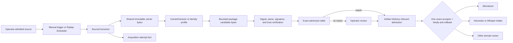
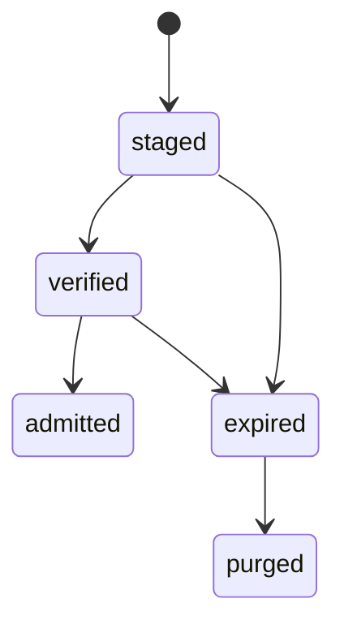
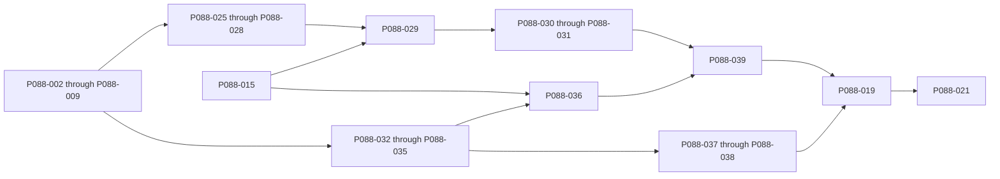

# Proposal 088: Pull-Based Artifact Acquisition

Based on:

- `doc/project/20-memos/resilient-pull-based-artifact-acquisition.md`
- `doc/project/40-proposals/036-memarium.md`
- `doc/project/40-proposals/039-crisis-space-seed-v1.md`
- `doc/project/40-proposals/042-inter-node-artifact-channel.md`
- `doc/project/40-proposals/062-temporal-storage-convention.md`
- `doc/project/40-proposals/078-weak-signal-harvester.md`
- `doc/project/40-proposals/081-horizontal-protocol-primitives.md`
- `doc/project/40-proposals/084-sensorium-web-observation-connector.md`
- `doc/project/40-proposals/085-operator-sovereign-extensibility-and-experiment-packages.md`
- `doc/project/40-proposals/086-component-communication-observation-and-trace-sessions.md`
- `doc/project/60-solutions/020-scheduler/020-scheduler.md`
- `doc/project/60-solutions/023-artifact-delivery/023-artifact-delivery.md`

## Status

Draft; all architectural Open Questions and the Phase 0 seam audit were completed
on 2026-08-24. The proposal is ready for the Phase 1 contract freeze.
Implementation is post-MVP and does not block current hard-MVP readiness.

## Date

2026-08-24

## Executive Summary

Orbiplex artifacts should remain usable when their usual delivery carrier is
unavailable. A node should be able to retrieve the exact same signed, sealed, or
otherwise content-addressed bytes through an operator-admitted source such as a
local file, paste surface, bounded HTTP endpoint, mailbox, or removable medium.
The carrier remains replaceable because artifact identity, trust, freshness,
classification, admission, retention, and publication are evaluated elsewhere.

P088 introduces a narrow host-governed **Artifact Acquisition** plane between
source-specific retrieval and the existing Artifact Delivery inbound-admission
boundary. It is a companion to Artifact Delivery, not another delivery transport
profile. Acquisition owns source orchestration, durable staging facts, receipts,
and carrier-neutral verification. Artifact Delivery continues to own inbound
admission and the one authoritative acceptor selected for an artifact class.

V1 deliberately includes only read-only connectors. It starts with one fixed-byte
fixture connector, operator paste, and a bounded local file. It reuses Bounded
Deferred Operations, Replay Scheduler, the existing content-addressed
`artifact-store:` reference format with separate live-reference accounting, and
the Artifact Delivery admission registry. It does not add a second scheduler,
object store, acceptor registry, Memarium write path, or publication path.

An acquired resource may be either the exact portable package or a bounded,
parseable carrier that contains one or more package candidates. A separate
extractor boundary handles static text, HTML, RFC 822/MIME, or future carrier
formats under an operator-owned profile. Neither a connector nor remotely supplied
content chooses executable parsing behavior. Optional INAC location advice may
name several exact alternates, fallbacks, or related artifacts in one control
message, but every location remains a non-authoritative retrieval hint.

The portable package is content-neutral outer framing. It carries digest, size,
encoding, and optional multi-file layout, but does not repeat the inner artifact's
schema, id, signer, sequence, classification, or provenance. Semantic routing
occurs only after the exact inner bytes and their authority have been verified.
Anti-rollback is declared by each family: ordered streams use sequence fences,
append-only revocations use monotonic fact union, and complete snapshots require
authenticated completeness. Signer rotation is resolved through existing
delegation and identity-succession proofs and resets none of those states.

The first acceptance criterion proves a carrier-independent safety effect: an
offline passport revocation acquired by paste or file makes the configured source
fresh and causes the dispatch gate to reject the passport. A second, separately
tracked criterion introduces one logical revocation source above several physical
carriers and proves ordinary crisis-detector recovery. Keeping those criteria
separate prevents a revocation-aggregation redesign from entering the first
operational slice disguised as acquisition plumbing.

## Context and Problem Statement

Artifact Delivery already makes outbound delivery transport-neutral, and INAC
supports exact peer pull. Those mechanisms still assume that a suitable live peer
or configured delivery carrier is available. They do not define how an operator
may retrieve an artifact from an independent medium, stage it safely, prove what
was obtained, apply anti-rollback checks, and submit it through the same local
admission path as network delivery.

Without a shared acquisition boundary, every domain is tempted to grow its own
fetcher, cache, source scheduler, receipt format, quarantine directory, and
admission shortcut. Sensorium Web could become a generic downloader, Weak Signal
Harvester could become a crawler, Memarium could gain an implicit import API, and
Artifact Delivery could acquire transport-specific source semantics. That would
couple custody, observation, memory, and publication.

The missing capability is not broad protocol support. It is the ability to
obtain a critical artifact through a second route while preserving the same
authority and domain effect. Passport revocation is the first case because stale
revocation data already has a fail-closed operational consequence.

P088 is grounded in five separations:

```text
source location != trust
acquisition != admission
staging != Memarium
admission != publication
artifact signature != truth of its content
```

A digest proves only byte identity relative to an expected digest. A signature
binds bytes to a key only after that key is resolved through current trust policy.
Encryption protects content only under its exact cryptographic profile. None of
those facts proves freshness, completeness, semantic truth, retrieval authority,
retention authority, or publication authority.

## Goals

- Let a node acquire a portable artifact through more than one independently
  governed carrier.
- Keep source retrieval, verification, anti-rollback, admission, memory, and
  publication as separate authority boundaries.
- Define one content-neutral at-rest package usable by operator paste, local file,
  future HTTP(S), backup, removable media, and extension connectors.
- Reuse one small `SourceConnector` behavior contract across source mechanisms.
- Reuse one bounded `CarrierExtractor` contract when the fetched resource embeds
  an artifact inside other content.
- Reuse Bounded Deferred Operations and Replay Scheduler rather than duplicate
  their lifecycles.
- Reuse shared immutable object bytes and the Artifact Delivery acceptor registry.
- Make source configuration, source generation, attempt results, receipts,
  staged-object transitions, and refusals explicit data.
- Make receipt identity deterministic across retry and restart.
- Prevent correctly signed stale artifacts from rolling back effective state.
- Allow exact policy-table admission without creating a second authorization path.
- Preserve operator review for every artifact not matching a closed automatic-
  admission tuple.
- Make source-query observability visible without letting configuration understate
  a connector's minimum disclosure.
- Carry bounded, plural, advisory artifact-location links through INAC without
  weakening its one-primary-payload-location invariant.
- Let an admitted source bind an exact extraction profile and selector budget for
  parseable carrier resources such as static web pages, e-mail messages, or text
  files obtained through a future torrent connector.
- Reuse acquired bytes for Memarium or public-gossip preparation only through
  separate derived artifacts and exact acceptors.
- Prove the abstraction with a fixture connector before adding a network source.

## Non-Goals

- No arbitrary crawler or ambient URL fetch API.
- No browser automation, JavaScript execution, remote subresource loading, fuzzy
  model extraction, or recursive link following in the normative extraction path.
- No requirement to implement every candidate protocol listed by the source memo.
- No consuming mailbox, POP deletion, remote acknowledgement, or destructive
  source mutation in V1.
- No second Artifact Delivery transport registry or inbound acceptor registry.
- No second scheduler, deferred-operation runtime, blob store, or Memarium.
- No automatic trust derived from a source URL, filesystem path, mail account,
  DNS record, package signature, or connector package author.
- No semantic routing based on unverified outer-package metadata.
- No automatic source registration from a pointer found in content.
- No interpretation of an advisory URI as proof of availability, identity,
  authority, freshness, or permission to contact its endpoint.
- No automatic Memarium write, Harvester finding, Whisper draft, or public gossip
  merely because acquisition or verification succeeded.
- No claim that receiver-authored source evidence is remote authorship.
- No change to crisis-detector aggregation in the first acceptance criterion.
- No federation requirement that peers enable the same source connectors.
- No new connector-specific crate split before two real implementations require
  it.

## Terminology

| Term | Meaning |
| :--- | :--- |
| Artifact Acquisition | Host-governed orchestration that obtains bytes from an admitted source, stages them, verifies portable framing and inner authority, and submits an explicit artifact to existing domain-owned admission and anti-rollback. |
| Source | Immutable operator-owned declaration of what one connector may read, under which limits and expected artifact constraints. |
| Source generation | Local revision of one activated source declaration. It scopes receipts and checkpoints; it is not an artifact-stream epoch. |
| Connector | Replaceable retrieval behavior implementing `probe` and `fetch` without owning trust, admission, retention, or publication. |
| Probe | Bounded check for source change or availability. It may become a Sensorium observation when explicitly projected. |
| Fetch | Custody transition that obtains exact carrier bytes or an existing object ref. It never becomes a Sensorium observation payload. |
| Carrier resource | Exact bounded representation returned by a connector. It may itself be a portable package or may contain package candidates within other static content. |
| Extraction profile | Immutable operator-admitted parser, selector grammar, framing rule, and resource budget used to derive package candidates from one carrier resource. |
| Carrier extractor | Replaceable bounded behavior that applies one admitted extraction profile without fetching subresources or owning trust, admission, or publication. |
| Location advice | Bounded non-authoritative links naming alternate or fallback locations of an exact artifact, or separately identified related artifacts. |
| Portable package | Content-neutral outer framing containing expected digest, size, encoding, and optional blob layout. |
| Inner artifact | Bytes interpreted only after package materialization and digest verification. It carries semantic schema, identity, signature, stream coordinates, classification, and provenance where applicable. |
| Receipt | Deterministically identified fact that one source generation durably staged one exact content digest. |
| Attempt | One acquisition invocation and its terminal result, including unchanged, refusal, retryable failure, or unknown. |
| Staged object | Inert content-addressed bytes referenced by acquisition facts but not yet admitted into a domain. |
| Admission table | Closed operator policy mapping exact verified inner coordinates to one existing Artifact Delivery acceptor. |
| Logical source | Stable domain source projected independently of the physical carrier that delivered its latest accepted data. |

## Proposed Model / Decisions

### Decision 1: Artifact Acquisition Is A Companion Plane

Artifact Acquisition sits below domain consumers and beside Artifact Delivery:



Acquisition does not deliver bytes to a remote node. Artifact Delivery does not
own source schedules or local-source credentials. Their shared seam is the exact
inbound admission contract and its authoritative acceptor registry.

### Decision 2: Outer Framing Does Not Repeat Inner Semantics

`portable-artifact-package.v1` is a framing manifest, not a second artifact
descriptor. Its V1 information budget is limited to:

- framing schema and layout;
- bounded payload encoding;
- expected content digest and size;
- for multi-file layout, relative digest-named blob entries and one root entry.

It does not carry semantic artifact schema, artifact id, signer, signature, trust
domain, stream id, sequence, classification, or domain provenance. If a carrier
adds its own signed manifest, that signature is transport evidence only and does
not replace verification of the inner artifact.

For a multi-blob layout, each blob is streamed into an unaddressable temporary
object while its byte count and digest are computed. Its digest must match the
digest-named manifest entry before the next entry is accepted. Any mismatch stops
materialization immediately; partial or unchecked blobs never become visible
through the shared object store. The complete package becomes addressable only
after every entry, total-size bound, root entry, and outer manifest digest pass.

An illustrative inline shape is:

```json
{
  "schema": "portable-artifact-package.v1",
  "schema/v": 1,
  "package/layout": "inline",
  "content/encoding": "base64url",
  "content/digest": "sha256:hnkKk42LO_pohEN5GsvHlF4wniMHn1a9X4cAC6Su33Y",
  "content/size": 14,
  "content/inline": "eyJzY2hlbWEvdiI6MX0"
}
```

The Phase 0 seam audit found that the existing archival manifest carries domain
policy and cannot be extracted or renamed without changing its meaning. P088
therefore introduces the smallest new `portable-artifact-package.v1` contract.
Archival and delivery may reference that primitive additively later, but P088 does
not require their migration. Framing must not import question lineage,
publication scope, delivery plans, or host paths.

### Decision 3: Verification Precedes Semantic Routing

The host applies this fixed order:

```text
authorize source and connector
  -> apply encoded and decoded byte caps
  -> fetch and bound the carrier resource
  -> apply one admitted extraction profile
  -> materialize bounded package candidate(s)
  -> verify outer digest and size
  -> parse the inner artifact safely
  -> verify inner signature, trust, expiry, and revocation
  -> derive family and classification coordinates
  -> evaluate the exact admission table
  -> call one existing acceptor, which atomically applies its anti-rollback
     profile and domain effect, or retain for review
```

No outer field, filename, URL, MIME type, connector id, or source label may select
a privileged acceptor before inner verification. Unknown inner schema is inert
staged data or a typed refusal according to source policy; it is never best-effort
domain input.

### Decision 4: Source Declarations Are Operator Authority

`artifact-source.v1` is immutable operator-owned data. Durable activation,
replacement, or revocation requires current local operator authority. Installation
of a connector or receipt of an artifact cannot activate a source.

A source declaration carries at least:

- stable `source/id`, monotonic `source/generation`, and `connector/id`;
- current `operator/binding-ref`, issue time, and detached activation evidence or
  an exact reference to the operator-authorized activation fact;
- locator or bounded local-root coordinates;
- manual and/or scheduled trigger mode;
- host-owned credential ref, never embedded credentials;
- allowed inner schemas, trust domains, artifact families, classification floor,
  and stream ids only where the family is ordered;
- exact admission-table ref or no automatic-admission table;
- byte, item, duration, concurrency, and staging-retention caps;
- source checkpoint policy;
- exact `extraction/profile-ref`, with `whole-resource` as the identity profile,
  plus a bounded selector only when the carrier may embed an artifact;
- optional `freshness/max-staleness` when freshness is claimed;
- required `consumption/mode: read-only` in V1;
- no source-registration or publication authority.

Changing any authority-bearing field creates a new source generation. Old
generations remain audit facts but cannot launch new work.

### Decision 5: One Small SourceConnector Contract

The first behavior surface is:

```text
SourceConnector
  probe(source, checkpoint) -> metadata | unchanged | refusal
  fetch(source, checkpoint, limits) -> carrier-bytes | object-ref | refusal
  query_observability() -> connector-level minimum class

CarrierExtractor
  extract(carrier-ref, profile, selector, limits)
    -> package-candidate-ref(s) | refusal
```

`probe` and `fetch` are separately authorized bounded operations. Enumeration, if
later needed for a mailbox or directory, is a separate paged operation rather than
an unbounded `fetch` mode.

`CarrierExtractor` performs no source, network, credential, or subresource I/O and
cannot select itself. The host supplies one immutable bounded carrier view and one
bounded candidate sink. The source generation binds an operator-admitted profile
ref and profile digest. A remotely supplied selector may only narrow the search
space allowed by that profile; it cannot change the parser, enable active content,
fetch another resource, or raise any limit. The identity `whole-resource` profile
proves that exact-resource and embedded-resource acquisition share one pipeline.

The trait is named now; crate decomposition is deferred. The first implementation
must not create hypothetical protocol-specific crate families. A second real
connector may justify extracting reusable host mechanics.

### Decision 6: The Host Retains Ambient Authority

The host owns filesystem roots, credentials, network admission, DNS resolution,
timeouts, process supervision, source activation, object storage, and publication
authority. A connector receives only one source generation, one operation, one
bounded locator, and exact capability grants.

P084's daemon-owned bounded HTTP fetch is the reference pattern for HTTP(S): the
connector cannot fall back to ambient sockets when host admission is absent. The
same isolation discipline may be reused by file or mailbox connectors without
making Sensorium the owner of custody semantics.

### Decision 7: V1 Is Read-Only

`consumption/mode` is required and has one accepted V1 value: `read-only`. Every
other value is refused before source activation or fetch.

A future consuming connector requires a separate versioned contract covering
durable staging before acknowledgement, idempotent remote commit, crash recovery,
unknown acknowledgement outcome, and operator-visible reconciliation. None of
that machinery is present but dormant in V1.

### Decision 8: Existing Operation And Schedule Lifecycles Are Reused

Long work runs as Bounded Deferred Operations. Recurring work runs through Replay
Scheduler. Acquisition owns source checkpoints, change detection, retry meaning,
and freshness; it owns no private queue timer or sleep loop.

`freshness/max-staleness` is the only source-level scheduling invariant. Effective
cadence derives from it plus bounded retry backoff and jitter. Energy-saving
posture may delay work while the invariant remains satisfied. If it cannot be
satisfied, the source becomes explicitly stale and existing fail-closed policy
applies. Byte, item, duration, concurrency, and queue caps remain ordinary
operation budgets rather than a second energy policy.

A successfully authorized check that returns `unchanged` under evidence bound to
the current source generation and prior accepted checkpoint advances
`last-success-checked-at` and therefore source freshness. It creates an attempt
fact, but no receipt, object transition, anti-rollback update, or domain effect.
Refusal, timeout, malformed conditional evidence, or unknown outcome never advances
freshness.

### Decision 9: One Pipeline Provides Two Operator Views

Every fetched representation follows one path:

```text
always stage -> verify -> evaluate exact admission table
             -> exact match: call named existing acceptor
             -> no match: retain for operator review
```

`stage` means that the table is empty or disabled. `admit-known` means that a
closed table of exact `(inner schema, authority or trust-domain ref,
classification ref, artifact family, anti-rollback profile ref, optional bound
stream id, acceptor id)` tuples is active. An omitted stream id means that the
family profile, rather than a wildcard, determines the verified domain
coordinates. They are configuration views, not different authorization code
paths.

An exact tuple authorizes only invocation of its named acceptor. It does not
replace the acceptor's domain policy. In particular, Memarium always applies one
named local classification, retention, and encryption policy after the tuple
matches; acquisition cannot infer, widen, or bypass that policy.

### Decision 10: Three State Models Stay Separate

P088 does not create one lifecycle that mixes operation, attempt, and object
states.

1. **Operation lifecycle** is the existing Bounded Deferred Operation machine.
2. **Attempt outcome** is an append-only fact: `receipts-created`, `unchanged`,
   `refused`, `failed-retryable`, or `unknown`. A successful bounded-many
   extraction carries a capped count and receipt refs, not inline receipt bodies.
3. **Staged-object lifecycle** is the only P088 object machine:



A refusal does not mutate bytes into a `refused` object. Unadmitted bytes remain
inert until review or expiry. `admitted` ends acquisition ownership; the shared
object store retains or removes bytes according to live domain, export, and cache
references.

### Decision 11: Receipt Identity Is Deterministic

Receipt identity is derived from canonical data with domain separation:

```text
receipt/id = "acquisition-receipt:sha256:" + sha256(canonical-json({
  "domain": "orbiplex/artifact-acquisition-receipt/v1",
  "source/id": source_id,
  "source/generation": source_generation,
  "content/digest": content_digest
}))
```

Raw string concatenation is forbidden. Retry and restart for the same source
generation and digest converge on one receipt. A different source or source
generation yields another receipt. Repeated unchanged polls create attempt facts,
not conflicting receipt bodies.

Carrier and extraction evidence is a separate append-only fact, not mutable receipt
content. Its identity is derived from source id and generation, carrier digest,
profile and selector digests, candidate ordinal, and candidate digest under its own
domain separator. If a changing web page, another e-mail, or another package layout
yields the same verified inner artifact, it adds another extraction fact while the
receipt remains byte-identical. A read model may group all such evidence under that
receipt; the receipt itself does not acquire a growing embedded array.

`source/generation` scopes local authority and checkpoints. It is not an artifact
stream epoch and cannot reset any family anti-rollback state.

### Decision 12: Anti-Rollback Is Family-Specific And Carrier-Neutral

P088 does not invent sequence coordinates for an inner family that has none. Each
admitted family declares exactly one anti-rollback profile owned by its exact
domain admission owner. All acquisition carriers for that family converge on the
same durable profile state.

The initial profiles are:

1. **Ordered stream.** The inner family binds `stream/id` and monotonic `sequence`
   under a stable trust-domain lineage. The domain owner stores a durable
   high-water mark and digest per `(trust domain, artifact family, stream id)`.
   Lower sequence refuses; equal sequence is idempotent only for the admitted
   digest; equal sequence with another digest is conflict.
2. **Append-only fact set.** The inner family binds a stable fact id and target but
   has no sequence. The domain owner monotonically unions independently verified
   facts. Repeating one fact id with the same digest is idempotent; reusing the id
   with another digest is conflict; absence never removes an accepted fact.
3. **Authenticated complete snapshot.** A family that claims replacement or
   completeness binds a manifest root, item count, authority scope, and explicit
   predecessor or equivalent continuity proof. A snapshot cannot shrink an
   append-only domain unless that domain defines a separately authorized reversal
   contract.

Signer rotation, delegation, succession, or node-identity rotation is admitted
through the existing verified authority chain. It resets neither ordered-stream
state nor append-only fact identity. The exact domain admission owner performs the
anti-rollback transition and domain effect as one transaction or recoverable
journaled transition. A shared persistence primitive may store opaque state, but
it does not own profile semantics or become a second admission authority.

### Decision 13: Criterion A Does Not Redesign Revocation Aggregation

The first operational acceptance slice, tracked in Phase 2, proves an effective
acquired revocation through the already configured source. One valid
implementation may atomically merge a verified append-only revocation into the
existing static source file and invoke its ordinary refresh.

`capability-passport-revocation.v1` carries no `stream/id` or `sequence` and uses
the append-only fact-set profile. Criterion A therefore requires no V2 revocation
contract and fabricates no stream coordinate. Its authoritative state is the
monotonic union of verified revocation facts keyed by `revocation_id`, with the
target and exact fact digest retained for conflict detection. A complete snapshot,
if added later, must prove completeness separately and cannot silently remove an
accepted revocation. Individual append-only revocation facts are the only initial
Criterion A representation.

The merge must never shrink prior revocations. The authoritative union and
per-fact digest conflict state belong to the revocation admission owner rather
than solely to replaceable carrier bytes. A crash may leave work replayable, but
cannot leave anti-rollback state advanced while the dispatch effect is absent
without a journal record that finishes or repairs the transition.

Criterion A is complete when the source diagnostics are fresh and dispatch
refuses the named passport. Aggregate crisis resolution is not required for
Phase 2.

### Decision 14: Logical Source Over Several Carriers Is Separate

Criterion B introduces a stable logical source identity independent of physical
carrier. A network poll, local file, paste action, or future connector may advance
the same logical source only after exact authority and the family's declared
anti-rollback checks. Aggregate freshness evaluates the logical source rather than
treating each carrier as a permanent independent veto.

This work may change revocation-source projection and crisis aggregation. It is a
separate phase and tracker item, not a retroactive expansion of Criterion A.

### Decision 15: Probe May Be Observation; Fetch Is Custody

A changing probe result may be projected through Sensorium Interfaces with its
own freshness, confidence, and operational context. Fetching package bytes is a
custody transition and goes directly to staging. It must not traverse a Sensorium
observation payload merely because Sensorium Web already uses the same bounded
host fetch primitive.

An explicit extractor may derive a Sensorium observation from staged or admitted
bytes. That derived observation has its own schema and lineage and does not change
the acquisition receipt.

### Decision 16: Reuse Does Not Mean Fan-Out

One immutable staged digest may anchor several explicit derived artifacts. It does
not cause one admission to invoke several acceptors.

- A Memarium artifact passes through the exact Memarium acceptor and its
  classification, encryption, retention, and authority policy.
- A Harvester or Whisper intake artifact passes through its own acceptor and may
  prepare a candidate or gossip draft.
- Only a separately approved and signed `public-gossip.v1` may be published to
  Agora.

Successful acquisition, verification, Memarium admission, grouping, or scheduled
refresh never implies publication.

A public gossip draft may retain only a bounded acquisition receipt ref and a
public-safe source class by default. A private locator, mailbox identity, private
source identity, or predictable digest of private content cannot cross into the
draft without a separate explicit disclosure approval. The approval is evidence
for disclosure only; it does not grant publication authority.

### Decision 17: Query Observability Is Connector-Class Data

A connector declares a minimum query-observability class, for example:

- `none`;
- `locator-and-timing`;
- `locator-timing-and-identity`.

The operator does not repeat or weaken that class in every source. Deployment-
specific facts may raise the effective class in the read model, for example when
an authenticated proxy reveals account identity. Effective disclosure can never
be lower than the connector's declared minimum.

### Decision 18: Classification Uses An Explicit Ingress Constructor

Before P088 emits classified derived artifacts, Node must expose one parameterized
constructor equivalent to:

```text
Classification::ingress(surface, peer_ref, quarantine_reason)
```

The existing `unlabeled_import()` and `unlabeled_for_space()` helpers currently
cross ingress provenance and quarantine reason in misleading ways. They should
become thin, semantically correct wrappers. Acquisition uses explicit ingress
provenance and `NoLabelAtIngress`; it never fabricates remote authorship.

### Decision 19: Connector Installation Does Not Activate A Source

A connector may be shipped as supervised middleware or a P085 experiment package,
but package signature proves provenance only. Installation is inert. The host
validates the connector manifest and refusal corpus, and a current operator then
activates each source declaration separately.

Both packaging surfaces admit the same connector manifest contract. P088 does not
introduce a connector-specific package manager, alternate manifest vocabulary, or
packaging-dependent validation path.

Content may suggest a draft source pointer for operator review but cannot add,
activate, replace, or widen the source graph.

### Decision 20: Unknown Never Becomes Success

Every terminal acquisition attempt has a closed outcome and typed refusal or
failure code with retryability as data. A crash, timeout with uncertain external
state, missing object, unresolved trust chain, unknown inner schema, stale source
generation, or interrupted admission remains `unknown`, refused, or retryable
according to the exact case. None is projected as receipt creation or admission.

### Decision 21: Artifact Location Advice Is Plural And Non-Authoritative

An INAC control message may carry bounded `artifact/location-advice` beside its
single primary payload location. Advice is control-plane data, not part of
`portable-artifact-package.v1`, and it does not weaken INAC's rule that an offer or
push has at most one authoritative inline, ref, or href payload location.

One advice value may describe several target artifacts and several locations per
target. Its closed relation vocabulary distinguishes:

- `alternate-exact`: another location expected to yield the exact target digest
  and usable immediately when the current sender has no copy;
- `fallback-exact`: another exact location to consider only after the primary
  location fails or is unavailable;
- `related-artifact`: a separately identified artifact that may provide context,
  evidence, continuation, or recovery material but cannot satisfy the current
  request.

Every exact alternate or fallback binds target artifact id, digest, and size.
These coordinates identify the verified inner artifact bytes, not the surrounding
carrier. Two locations may therefore use different package framing or parseable
carrier bytes and still resolve to the same target. A location may additionally
bind an expected carrier digest and size when they are known, but that evidence
never substitutes for the target check. Related links bind their own target
identity and remain discovery-only. A location contains a bounded URI, carrier
mode, expiry, and optional advisory preference. The preference is never a routing
command. Advice received over INAC is attributed to the authenticated peer session
by the host; sender-supplied identity fields cannot override that provenance.

The resolver follows advice automatically only when an existing local operator
policy already admits the URI scheme, peer or destination, artifact family,
extraction profile, byte budget, and one-shot retrieval. Otherwise it creates an
inert operator-visible candidate. Resolution never creates a durable source,
activates a connector, imports credentials, or inherits publication authority.
The fetched candidate still passes normal package, inner-signature, trust,
anti-rollback, classification, and admission checks.

V1 does not recursively follow advice found in a fetched carrier. It keeps a
bounded visited set, target count, locations-per-target count, total advice bytes,
attempt count, and deadline. Cycles, expired advice, unsupported schemes, and
budget exhaustion are typed results. Advice must not contain bearer tokens,
credentials, private absolute paths, or secret query parameters, and its exposure
cannot be wider than the artifact or request context that disclosed it.

An `artifact-not-present` or `artifact-temporarily-unavailable` INAC response may
carry `alternate-exact` advice to express "not here; try there". An offer or push
with one primary payload location may carry `fallback-exact` advice to express
"if this route fails, try there". Malformed advice cannot be treated as an
implicit redirect or as evidence that any target exists.

The canonical V1 logical INAC location URI is:

```text
inac:artifact:<peer-subject-pct>:<artifact-id-pct>:sha256:<digest-b64u>
```

`peer-subject-pct` and `artifact-id-pct` are non-empty UTF-8 values encoded as
single URI components: bytes outside the RFC 3986 unreserved set are percent-
encoded with uppercase hexadecimal digits. `digest-b64u` is the unpadded base64url
SHA-256 value. Authority, user-info, query, and fragment components are forbidden.
The artifact id and digest encoded by the URI must equal the surrounding advice
target. The peer subject selects a logical resolver identity; Peer Runtime and
Seed Directory resolve its current endpoint, which is never embedded in the URI.

### Decision 22: Parseable Carriers Use An Explicit Extraction Boundary

A source may declare either `carrier/mode: exact-resource` or
`carrier/mode: embedded-artifact`.

- `exact-resource` applies the identity `whole-resource` extraction profile; the
  complete fetched representation is one package candidate.
- `embedded-artifact` requires an exact operator-admitted extraction profile ref
  and profile digest. The extractor derives bounded package candidates from the
  carrier without executing active content or retrieving subresources.

This supports, without special admission paths:

- an armored portable package inside a static HTML comment or element;
- an armored package in an RFC 822 message body or an explicitly selected MIME
  part;
- an armored package in a plain-text file obtained locally or through a future
  torrent connector;
- future bounded JSON Pointer or other deterministic selectors admitted through a
  versioned profile.

The fetched carrier and extracted candidates are different byte identities. The
acquisition record binds at least carrier digest and size, extraction profile ref
and digest, normalized selector evidence, extractor implementation identity,
candidate ordinal, and extracted candidate digest and size. The carrier may use a
shorter retention policy than admitted candidates, but its lifecycle, deletion,
and restart behavior remain explicit.

Remote advice may suggest a standard extraction profile and a bounded selector,
but only the source generation or an already active one-shot resolution policy may
admit them. The selector can narrow an allowed profile; it cannot choose code,
change parser options, execute JavaScript, resolve external entities, load remote
CSS or media, recursively unpack nested messages, follow links, or raise parser
limits.

Extraction profiles declare input content types, deterministic selector grammar,
candidate framing, maximum parse depth, nodes or MIME parts, candidate count,
total extracted bytes, per-candidate bytes, CPU or wall time, and temporary-storage
bounds. An independent packaged extractor may be installed through supervised
middleware or P085, but installation remains inert and every profile activation is
operator-owned. Model-assisted or heuristic extraction may propose spans for
review, but it is not a normative admission path.

The V1 promotion set contains the identity `whole-resource`, armored plain-text,
static HTML, and bounded RFC 822/MIME profiles. Identity and armored text land
first; static HTML lands with bounded HTTP(S); RFC 822/MIME is a conformance
profile before any mailbox connector. Torrent remains a future connector
candidate and does not define a special extraction profile.

## Contract Family

V1 has five contract roles. Four are P088-owned schemas. The content-neutral
framing role is the new minimal `portable-artifact-package.v1` schema; the audited
archival manifest remains a separate policy-bearing contract.

### `portable-artifact-package.v1`

Owns only content-neutral framing. It is closed to unknown fields and has inline
and manifest layouts with strict encoded, decoded, file-count, relative-path, and
expansion caps. It does not contain semantic routing fields.

### `artifact-source.v1`

Owns immutable operator source authority, generation, connector binding, locator,
trigger modes, credential ref, allow constraints, operation limits,
`freshness/max-staleness`, read-only mode, checkpoint policy, and admission-table
ref. It carries no credentials, connector executable path, publication authority,
or active runtime handle.

An illustrative operator-authored draft is:

```json
{
  "schema": "artifact-source.v1",
  "schema/v": 1,
  "source/id": "artifact-source:passport-revocations:operator-file",
  "source/generation": 1,
  "connector/id": "artifact-source-connector:local-file-v1",
  "locator": {
    "kind": "operator-path-ref",
    "path/ref": "operator-path:revocation-dropbox"
  },
  "trigger/modes": ["manual", "scheduled"],
  "allow": {
    "inner/schemas": ["capability-passport-revocation.v1"],
    "artifact/families": ["capability-passport-revocation"],
    "trust/domains": ["federation:main"]
  },
  "extraction": {
    "carrier/mode": "embedded-artifact",
    "profile/ref": "artifact-extraction-profile:armored-text:v1",
    "profile/digest": "sha256:AAAAAAAAAAAAAAAAAAAAAAAAAAAAAAAAAAAAAAAAAAA"
  },
  "admission/table-ref": "artifact-admission-table:passport-revocations",
  "limits": {
    "carrier/bytes-max": 1048576,
    "candidates/max": 8,
    "candidate/bytes-max": 262144,
    "duration/ms-max": 5000
  },
  "freshness/max-staleness-seconds": 900,
  "consumption/mode": "read-only",
  "operator/binding-ref": "node-operator-binding:local:current"
}
```

The Phase 0 schema freeze may refine field names, but it must preserve this
information budget and keep drafts signable without embedding credentials or
absolute host paths.

### `artifact-extraction-profile.v1`

Owns a content-neutral extraction profile: parser id, accepted carrier content
types, selector grammar, candidate framing, deterministic profile digest, and all
parser and output limits. It contains no locator, credentials, source activation,
artifact authority, admission target, or publication authority.

The digest is computed from the canonical profile document and bound by the source
or one-shot resolution policy. It is not a self-referential field included in the
bytes it digests. Advice may suggest a profile ref, but only the local binding
resolves that ref to an admitted digest and implementation.

An illustrative bounded static profile is:

```json
{
  "schema": "artifact-extraction-profile.v1",
  "schema/v": 1,
  "profile/ref": "artifact-extraction-profile:armored-text:v1",
  "parser/id": "bounded-text-marker:v1",
  "carrier/content-types": ["text/plain"],
  "selector/kinds": ["whole-text", "line-range"],
  "candidate/framing": "orbiplex-armored-package:v1",
  "limits": {
    "parse/depth-max": 16,
    "nodes/max": 4096,
    "candidates/max": 8,
    "candidate/bytes-max": 262144,
    "total-extracted/bytes-max": 1048576,
    "duration/ms-max": 1000
  }
}
```

### `artifact-location-advice.v1`

Owns bounded advisory targets and locations independently of INAC framing. INAC
may embed this value in a control message, while another carrier may transport the
same value later. The schema has explicit caps and closed relation, carrier-mode,
selector-kind, and URI-scheme profiles.

An illustrative message fragment with two targets and several locations is shown
below. Its `inac:` values follow the canonical Decision 21 grammar.

```json
{
  "schema": "artifact-location-advice.v1",
  "schema/v": 1,
  "advice/items": [
    {
      "relation": "alternate-exact",
      "target": {
        "artifact/id": "passport-revocation:example",
        "artifact/digest": "sha256:BBBBBBBBBBBBBBBBBBBBBBBBBBBBBBBBBBBBBBBBBBB",
        "artifact/size-bytes": 2048
      },
      "locations": [
        {
          "href": "inac:artifact:node-example:passport-revocation%3Aexample:sha256:BBBBBBBBBBBBBBBBBBBBBBBBBBBBBBBBBBBBBBBBBBB",
          "carrier/mode": "exact-resource",
          "expires/at": "2026-08-25T12:00:00Z"
        },
        {
          "href": "https://example.invalid/archive/revocations.html",
          "carrier/mode": "embedded-artifact",
          "extraction/profile-ref": "artifact-extraction-profile:static-html-armored:v1",
          "selector": {
            "kind": "html-element-id",
            "value": "comment-42"
          },
          "expires/at": "2026-08-25T12:00:00Z"
        }
      ]
    },
    {
      "relation": "related-artifact",
      "target": {
        "artifact/id": "revocation-context:example",
        "artifact/digest": "sha256:CCCCCCCCCCCCCCCCCCCCCCCCCCCCCCCCCCCCCCCCCCC",
        "artifact/size-bytes": 4096
      },
      "locations": [
        {
          "href": "inac:artifact:node-example:revocation-context%3Aexample:sha256:CCCCCCCCCCCCCCCCCCCCCCCCCCCCCCCCCCCCCCCCCCC",
          "carrier/mode": "exact-resource",
          "expires/at": "2026-08-25T12:00:00Z"
        }
      ]
    }
  ]
}
```

### `artifact-acquisition-record.v1`

Uses a required `record/kind` discriminator with the closed V1 values:

- `attempt`;
- `receipt`;
- `extraction`;
- `object-transition`.

The schema contains the closed attempt outcomes and refusal vocabulary as shared
definitions rather than introducing backend-specific strings. Every refusal code
has at least one reaching negative fixture and declares `terminal`, `retryable`, or
`reconcile-required`.

An illustrative `unchanged` attempt also makes freshness semantics explicit:

```json
{
  "schema": "artifact-acquisition-record.v1",
  "schema/v": 1,
  "record/kind": "attempt",
  "attempt/id": "artifact-acquisition-attempt:01K4EXAMPLE",
  "operation/ref": "deferred-operation:01K4EXAMPLE",
  "source/id": "artifact-source:passport-revocations:operator-file",
  "source/generation": 1,
  "outcome": "unchanged",
  "checked/at": "2026-08-24T12:00:00Z",
  "freshness/advanced": true
}
```

An extraction fact keeps carrier evidence outside the stable receipt:

```json
{
  "schema": "artifact-acquisition-record.v1",
  "schema/v": 1,
  "record/kind": "extraction",
  "extraction/id": "artifact-extraction:sha256:DDDDDDDDDDDDDDDDDDDDDDDDDDDDDDDDDDDDDDDDDDD",
  "source/id": "artifact-source:passport-revocations:operator-file",
  "source/generation": 1,
  "carrier": {
    "digest": "sha256:EEEEEEEEEEEEEEEEEEEEEEEEEEEEEEEEEEEEEEEEEEE",
    "size-bytes": 8192
  },
  "profile": {
    "ref": "artifact-extraction-profile:armored-text:v1",
    "digest": "sha256:AAAAAAAAAAAAAAAAAAAAAAAAAAAAAAAAAAAAAAAAAAA",
    "implementation/digest": "sha256:FFFFFFFFFFFFFFFFFFFFFFFFFFFFFFFFFFFFFFFFFFF"
  },
  "selector": {
    "kind": "line-range",
    "digest": "sha256:GGGGGGGGGGGGGGGGGGGGGGGGGGGGGGGGGGGGGGGGGGG"
  },
  "candidate": {
    "ordinal": 0,
    "digest": "sha256:HHHHHHHHHHHHHHHHHHHHHHHHHHHHHHHHHHHHHHHHHHH",
    "size-bytes": 4096
  },
  "receipt/ref": "acquisition-receipt:sha256:IIIIIIIIIIIIIIIIIIIIIIIIIIIIIIIIIIIIIIIIIII"
}
```

The V1 refusal vocabulary is closed before implementation:

| Code | Retry class | Meaning |
| :--- | :--- | :--- |
| `source-generation-inactive` | `terminal` | The referenced source generation is not current or active. |
| `source-generation-stale` | `terminal` | Work was produced under an older generation than the admitted operation. |
| `consumption-mode-unsupported` | `terminal` | V1 received a mode other than `read-only`. |
| `connector-authority-refused` | `terminal` | The connector is absent, inactive, or outside the source grant. |
| `locator-authority-refused` | `terminal` | The locator, root, peer, destination, or scheme is outside local authority. |
| `source-unavailable` | `retryable` | An admitted read-only source could not currently be reached or read. |
| `operation-capacity-unavailable` | `retryable` | Queue or concurrency capacity was unavailable before external work. |
| `operation-deadline-exceeded` | `retryable` | Bounded work did not finish before its exact deadline. |
| `content-limit-exceeded` | `terminal` | Encoded, decoded, item, expansion, candidate, or total byte cap was exceeded. |
| `package-malformed` | `terminal` | Portable framing cannot be parsed under the frozen schema. |
| `package-layout-refused` | `terminal` | Layout, relative path, root entry, file count, or manifest relation is invalid. |
| `content-size-mismatch` | `terminal` | Materialized bytes do not match the declared size. |
| `content-digest-mismatch` | `terminal` | Package, blob, carrier-bound candidate, or exact-location bytes fail digest verification. |
| `carrier-content-type-refused` | `terminal` | The effective carrier type is outside the extraction profile. |
| `extraction-profile-refused` | `terminal` | The profile or implementation is absent, inactive, substituted, or outside policy. |
| `extraction-selector-refused` | `terminal` | The selector is malformed or wider than the active profile permits. |
| `extraction-no-candidate` | `terminal` | A successfully parsed immutable carrier contains no matching candidate. |
| `extraction-candidate-ambiguous` | `terminal` | Candidate selection is not deterministic within the declared profile. |
| `extraction-limit-exceeded` | `terminal` | Parser depth, nodes, MIME parts, time, temporary storage, or output caps were exceeded. |
| `inner-schema-unsupported` | `terminal` | No safe parser or admission family exists for the verified candidate. |
| `inner-signature-invalid` | `terminal` | Inner signature or signed bytes are invalid. |
| `inner-trust-unresolved` | `retryable` | Required current trust or revocation evidence is temporarily unavailable. |
| `inner-trust-refused` | `terminal` | Current trust policy rejects the signer or authority chain. |
| `anti-rollback-regression` | `terminal` | An ordered position regresses or an append-only domain would shrink. |
| `anti-rollback-conflict` | `terminal` | One sequence or fact id is bound to a different digest. |
| `snapshot-incomplete` | `terminal` | A claimed complete snapshot lacks or fails its completeness boundary. |
| `location-advice-refused` | `terminal` | Advice is malformed, expired, over cap, secret-bearing, or outside disclosure policy. |
| `location-resolution-unavailable` | `retryable` | An otherwise admitted advisory location is temporarily unavailable. |
| `location-cycle-detected` | `terminal` | Resolution revisits a bounded target/location pair. |
| `admission-acceptor-refused` | `terminal` | The authoritative domain acceptor refused after exact policy routing. |
| `operation-interrupted` | `retryable` | Read-only work stopped before an externally visible effect. |
| `external-outcome-unknown` | `reconcile-required` | Recovery cannot yet prove whether the journaled external effect became visible. |

Domain-specific acceptor codes remain nested causes and do not extend this
top-level vocabulary implicitly. A code added or removed from the canonical list
without a reaching fixture fails the schema and refusal-ledger checks.

## Storage And Recovery Contract

P088 owns a staging ledger, not a second blob store.

The current `artifact-store:` byte layer is the shared immutable object primitive.
Artifact Delivery's peer transfer cache is physically separate and its expiry
cannot reach these objects. Artifact Acquisition adds owner/role live-reference
accounting before it adds purge; deletion is permitted only at zero live
references. Delivery and acquisition retain separate ledgers and retention
decisions rather than acquiring a shared domain lifecycle.

| State holder | Owner | Key | Bounds and expiry | Restart behavior |
| :--- | :--- | :--- | :--- | :--- |
| Immutable carrier and candidate bytes | Shared host object store | Verified content digest plus role in the acquisition ledger | Global and per-source count/bytes; carrier retention may be shorter; evict only with no live staging, extraction, domain, export, or cache reference | Bytes regain no authority; missing referenced bytes are explicit corruption |
| Source projection | Acquisition host | `source/id` plus generation | Bounded active and historical generations; revoked/superseded generations cannot launch | Rebuilt from operator-owned activation facts or validated config |
| Acquisition attempt facts | Acquisition ledger | Operation ref or attempt id | Count and age per source; terminal facts compact only under explicit retention | Interrupted work resolves through BDO recovery and never defaults to success |
| Receipts | Acquisition ledger | Deterministic receipt id | Count and age with live-reference protection | Same source generation and digest converge on the same receipt |
| Extraction facts | Acquisition ledger | Deterministic extraction-fact id over source generation, carrier digest, profile digest, selector digest, candidate ordinal, and candidate digest | Candidate and total-output caps; carrier evidence retained only under declared policy | Rebuilt without rerunning code when referenced bytes exist; otherwise marked unavailable, never inferred |
| Location-advice candidates | Acquisition projection | Advice provenance, target digest, normalized URI digest | Strict target, location, byte, expiry, attempt, and visited-set caps | Ephemeral candidates do not reactivate; durable operator drafts require current policy revalidation |
| Object transitions | Acquisition ledger | Object ref plus transition sequence | Append-only; terminal expiry permits later purge | Replay reconstructs staged, verified, admitted, and expired projections |
| Family anti-rollback state | Exact domain admission owner; shared persistence may remain semantics-neutral | Ordered stream key or append-only fact-set key declared by the family profile | Durable; no TTL while replay, shrinkage, or equivocation remains harmful | Revalidated before recovery effects; signer rotation cannot reset or erase state |

The write path uses staging followed by one commit that makes a complete receipt
visible. Partial bytes and temporary files are never addressable as staged
objects. Verification and domain-owned anti-rollback plus admission use idempotency
or a journal so recovery can distinguish these cases:

| Interrupted point | Recovery rule |
| :--- | :--- |
| Fetch started, no durable carrier object | BDO resolves interrupted work explicitly; retry may read again because V1 sources are read-only |
| Object durable, no receipt | Reconcile as an orphan; create the deterministic receipt only with complete source evidence or expire the object |
| Carrier durable, extraction interrupted | Re-run the exact active profile only when implementation and profile digests still match; otherwise retain for review or expire |
| Receipt durable, object missing | Mark corruption and refuse; never refetch silently under the old receipt |
| Verified, anti-rollback state not advanced | Re-run current family profile and admission checks through the same domain owner |
| Anti-rollback state advanced, effect not visible | Complete or compensate through the same journal; do not accept unrelated newer work as proof of success |
| Domain effect visible, terminal attempt absent | Reconcile by exact idempotency key and append the missing terminal fact |

## Operator Surface

The operator surface should expose:

- source id, generation, connector id, activation and revocation state;
- locator class and redacted locator summary;
- effective query-observability class;
- trigger modes, checkpoint, last attempt, next eligible run, and staleness;
- operation and staging occupancy against caps;
- latest attempt outcome and typed refusal;
- receipt id, source generation, content digest, size, and object state;
- carrier digest and retention state, extraction profile and implementation
  digests, selector summary, candidate ordinal, and extraction refusal;
- advisory target, relation, redacted URI class, authenticated reporter,
  expiry, attempted state, and the exact local policy that admitted or refused
  one-shot resolution;
- verified inner schema, trust domain, declared anti-rollback profile and its
  ordered-stream, fact-set, or snapshot coordinates and completeness result;
- admission-table match or reason for operator review;
- links to run now, pause, resume, review, admit, revoke source, and inspect receipt
  when those transitions are authorized.

Raw credentials, absolute host paths, private payloads, sealed content, signing
keys, and predictable private-source details are omitted or redacted. Operator
inspection never grants admission or publication authority.

## Implementation Phases

### Phase 0: Seam Audit And Contract Freeze

- Audit Artifact Delivery inbound idempotency and acceptor ownership.
- Audit `artifact-store:` object, transfer-cache, reference, and garbage-
  collection lifecycles.
- Audit static revocation writes and refresh semantics.
- Classify each first-slice family as ordered stream, append-only fact set, or
  authenticated snapshot; for passport revocations, identify stable fact id,
  target, authority lineage, digest-conflict key, and durable domain owner without
  inventing stream coordinates.
- Audit Memarium quarantine and import idempotency.
- Audit backup and `archival-package.v1` manifests.
- Audit P084 bounded fetch, Replay Scheduler, BDO, and classification ingress.
- Apply the resolved framing decision to the seam audit and record whether the
  shared primitive is extracted or introduced.
- Freeze transaction boundaries, refusal vocabulary, and schema shapes before
  runtime code.

#### Phase 0 Audit Record

The audit was completed on 2026-08-24 against Orbidocs
`c7284552e54b394d33a9259d84349206514d10ef` and Node
`963b90860b62b026ce633cba8e75ca09dffde9e3`. `Reuse` below means that P088 calls
the existing owner through its current contract. `Adapt` means that the seam is
sound only after the named P088 task adds the missing boundary. `Do not reuse`
means that the existing component has different authority or lifecycle semantics.

| Seam | Evidence and verdict | Frozen ownership decision |
| :--- | :--- | :--- |
| Artifact Delivery inbound admission | The registry enforces exact/wildcard acceptor uniqueness and persisted replay does not reinvoke an acceptor. The acceptor is currently invoked before its admission record is committed, so a crash or concurrent first attempt can leave an effect without a durable outcome. **Adapt.** | Reuse the one acceptor registry. `P088-009` and `P088-011` must record a durable admission intent before invocation and reconcile the exact result, while the selected domain acceptor remains idempotent and owns its anti-rollback/effect transaction. `unknown` never admits. |
| Shared objects, transfer cache, and GC | `artifact-store:sha256:...` verifies size and digest and publishes by atomic rename. The `inac-peer-artifact:` transfer cache has a separate root, indexes, retention, and eviction; it cannot reach `artifact-store:` objects. The shared artifact store currently has no reference ledger or GC. **Reuse primitive; adapt lifecycle.** | Reuse the immutable `artifact-store:` byte layout, never the peer transfer cache as durable staging. `P088-007` adds owner/role references and permits deletion only at zero live references. Delivery and acquisition keep separate ledgers and retention policy. |
| Passport-revocation writes and refresh | Local file publication and in-memory freshness are separate writes. Static JSONL refresh replaces its in-memory set from the current file and can therefore shrink it. It has no stable revocation-id/digest conflict ledger. **Do not reuse as authority.** | The Node revocation admission owner persists append-only facts keyed by `revocation_id`, checks canonical full-artifact digest conflicts, and updates its dispatch/freshness projection transactionally or by recovery journal. Static files are carriers or projections, not the durable owner. `P088-009` and `P088-014` own the adaptation. |
| First-slice family model | `capability-passport-revocation.v1` already exposes a stable fact id, target, signed authority, and time. No authenticated complete-set or ordering proof exists. **Reuse schema as an append-only fact.** | Criterion A is an append-only fact set: key `(trust-domain lineage, family, revocation_id)`, conflict value canonical artifact digest, target `passport_id` or `target_id`, lineage from the signed authority chain. It must never invent stream coordinates or replace the accepted set. |
| Memarium ingress and quarantine | Memarium storage owns idempotent fact identity; quarantine decisions are separately authorized, terminal, and conflict-detecting. **Reuse.** | P088 may invoke only the named Memarium acceptor after an exact admission match. Memarium additionally requires a named local classification, retention, and encryption policy. P088 stages bytes but cannot write or unquarantine Memarium directly. Cross-owner recovery uses P088 admission intent plus Memarium idempotency, not a distributed transaction. |
| Backup and archival manifests | `archival-package.v1` and the backup builder include archival basis, publication scope, redaction, classification, provenance, integrity, and retention policy. **Do not extract or rename.** | Introduce a new minimal `portable-artifact-package.v1` containing only byte layout, encoding, digest, size, optional blob entries, and root binding. Archival and delivery may reference it additively later; P088 does not require their migration. |
| P084 bounded HTTP fetch | The daemon host enforces destination, DNS, redirect, deadline, header, byte, caller-binding, and artifact-handoff bounds. Sensorium Web binds `304` reuse to source generation, requested/final URL, profile, representation, fetch result, and body digest. **Reuse host; do not reuse SourceStore.** | HTTP connectors call only daemon `http.fetch.bounded`. P088 owns source, custody, staging, and freshness facts. `unchanged` may advance freshness only under the complete generation-bound evidence binding; HTTP validators never establish artifact freshness. |
| Bounded Deferred Operations | Operation ids and terminal states, including `unknown`, are explicit and deterministic. **Reuse.** | BDO owns long-work handles. Its seed/continuation binds source id, source generation, action, and checkpoint digest. P088 owns attempt facts and maps `unknown` to an inert acquisition outcome. |
| Replay Scheduler | The SQLite launch ledger survives restart, prevents duplicate launch ids, terminalizes ambiguous running launches, and supports `skip-if-running`. **Reuse as wake-up owner.** | One stable job wakes each source; manual and scheduled triggers enter the same P088 request path. The acquisition ledger, not the scheduler, enforces source-generation exclusion and freshness. |
| Classification ingress | Existing helpers encode two useful ingress cases but there is no parameterized constructor, and their names do not expose all provenance dimensions. **Adapt.** | `P088-012` adds `Classification::ingress(surface, peer_ref, reason)`. Acquired unlabeled bytes use their actual surface and `NoLabelAtIngress`; no connector fabricates remote authorship. Existing helpers become semantically checked wrappers. |
| INAC logical location | Current `inac-peer-artifact:` references address bytes already present in the peer transfer cache and do not carry the target digest. INAC control data keeps one primary payload location. **Do not reinterpret; add policy surface.** | P088 uses `inac:artifact:<peer-subject-pct>:<artifact-id-pct>:sha256:<digest-b64u>`. Peer Runtime and Seed Directory resolve the current endpoint. Resolution is bounded, one-shot, non-recursive, creates no source, and does not mutate the primary INAC payload location. |
| Parseable-carrier isolation | Sensorium Web parsing is supervised but coupled to observation-specific storage and fetch callbacks. **Do not reuse as `CarrierExtractor`.** | Add a pure offline extractor contract with one immutable carrier view and a bounded candidate sink. It receives no source, network, credential, arbitrary-filesystem, admission, publication, or Memarium authority. Reuse parsing algorithms or fixtures only below this boundary. |

The audit freezes these coupled-write boundaries:

| Coupled state | Required atomicity or recovery decision |
| :--- | :--- |
| Source activation/replacement and generation projection | One acquisition-ledger transaction; stale generations fail closed. |
| Staged bytes and visible object/receipt transition | Verify and atomically publish bytes, then commit the reference and transition in one ledger transaction; recovery removes unreferenced orphans and reports missing referenced objects as corruption. |
| Carrier extraction and candidate visibility | Candidate bytes remain invisible until their bounded digest/size and extraction fact commit; an interrupted candidate is reconciled from the extraction journal. |
| Family anti-rollback state and domain effect | One domain-owner transaction where available; otherwise a durable pre-effect journal plus idempotent effect and exact reconciliation. The anti-rollback state never advances on `unknown`. |
| Artifact Delivery acceptor invocation and admission outcome | Durable intent before invocation; exact terminal outcome after invocation; restart reconciles by deterministic admission id and acceptor idempotency. |
| Revocation fact, dispatch projection, and freshness | One Node revocation-owner transaction or a journal whose replay converges monotonically; a carrier checkpoint cannot replace accepted facts. |
| P088 intent and Memarium effect | P088 journal plus deterministic Memarium idempotency key; Memarium remains the sole transaction owner for its facts and quarantine. |
| Scheduler launch, BDO handle, and acquisition attempt | No distributed transaction: deterministic source-generation request identity makes scheduler/BDO replay converge on one acquisition attempt. |

This audit completes `P088-002`; it does not claim that the adaptations already
exist. Their implementation remains explicitly assigned to `P088-004` through
`P088-014`, with lifecycle hardening in `P088-019`.

### Phase 1: Contracts, Core, And Fixture Connector

- Add the four P088-owned canonical schemas plus the new shared framing primitive,
  positive fixtures, negative matrix, Node mirrors, Schema Gate coverage,
  generated docs, and canonical digest vectors.
- Implement pure ids, receipt derivation, source generation, package framing,
  lifecycle folds, refusal classification, admission-table matching, and stream
  and fact-set anti-rollback inputs.
- Define `SourceConnector` and implement a fixed-byte fixture through the common
  pipeline.
- Define `CarrierExtractor`; implement the identity `whole-resource` profile and a
  fixed embedded-candidate fixture through the same pipeline.
- Freeze the closed refusal vocabulary and make every code reachable by at least
  one fixture.
- Add dependency and source guards proving that connectors do not own admission,
  scheduling, storage, Memarium, or publication.

### Phase 2: Local Sources And Criterion A

- Implement operator paste and bounded local-file connectors.
- Implement the bounded armored-text extraction profile and prove the same
  revocation package can be acquired as an exact file or from surrounding text.
- Add operator source activation, replacement, revocation, run-now, review, and
  inspection surfaces.
- Add shared-object staging, deterministic receipts, BDO and Replay Scheduler
  integration, recovery, and exact admission-table routing.
- Add the explicit classification ingress constructor.
- Implement the monotonic revocation application path and pass Criterion A,
  including restart and negative rollback cases.

### Phase 3: Bounded HTTP(S)

- Add one HTTP(S) source connector using P084's daemon-owned bounded fetch host.
- Preserve destination, redirect, DNS, timeout, byte, and no-ambient-egress
  enforcement.
- Bind conditional hints to source generation and exact content evidence without
  treating `ETag`, `Last-Modified`, cache age, or HTTP status as artifact freshness.
- Expose effective query-observability and load evidence.
- Extend INAC with bounded `artifact-location-advice.v1` embedding while retaining
  one primary payload location.
- Add one-shot P088 resolution under pre-existing operator policy and no recursive
  following.
- Add a static-HTML fixture profile that extracts an armored package without
  scripts or subresource fetches.

### Phase 4: Logical Source And Criterion B

- Introduce carrier-neutral logical revocation-source identity and projection.
- Define carrier contribution, last accepted family state, freshness, refusal,
  and diagnostic semantics.
- Update crisis aggregation only after focused review and tests.
- Pass Criterion B without force-resolution or source duplication.

### Phase 5: Downstream Reuse And Hardening

- Prove one staged digest can anchor separate Memarium and Harvester-derived
  artifacts without acceptor fan-out.
- Add bounded RFC 822/MIME and plain-text carrier fixtures. A future mailbox or
  torrent connector must reuse these profiles rather than add a domain path.
- Prove only explicit approved gossip reaches Agora.
- Add overload, retention, expiry, purge, source-revocation, crash, rollback,
  pointer-inertness, and secret-safety tests.
- Use P086 recording as advisory acceptance diagnostics where useful; domain
  assertions remain decisive unless a story explicitly declares trace evidence
  required.
- Synchronize proposal, solutions, implementation ledger, operator docs, generated
  docs, and readiness scope; promote a Solution only after measured acceptance.

## Acceptance Criteria

### Connector-boundary acceptance

Adding the fixed-byte fixture connector must not modify package verification,
staging, admission, scheduling, or domain acceptors. The same fixture runs through
source authorization, BDO, receipt creation, verification, exact admission-table
routing, and the domain owner's family-specific anti-rollback profile.

Adding the fixed embedded-carrier extractor must not modify connectors, package
verification, admission, scheduling, or domain acceptors. Identity and embedded
profiles produce byte-identical package candidates. Their receipts remain
deterministically distinct when source identity or generation differs, while
domain admission converges through its exact idempotency key.

### Criterion A: carrier-independent revocation effect

1. The normal network route for a configured passport-revocation source is
   unavailable.
2. The operator supplies a newer valid revocation package by paste or local file.
3. The package is staged and produces the deterministic receipt.
4. The inner revocation and authority are verified.
5. The existing revocation owner atomically unions the fact by `revocation_id`,
   retains its target and digest conflict evidence, and applies the dispatch
   effect without any fabricated stream sequence.
6. The configured source diagnostics become fresh.
7. Dispatch refuses the exact revoked passport.
8. Restart between staging and admission converges exactly once.

The same acceptance refuses malformed framing, oversize, digest mismatch, bad
signature, wrong trust domain, conflicting bytes under one `revocation_id`, an
attempt to shrink the accepted set, incomplete snapshot claims, wrong family,
inactive source generation, and non-read-only source mode. An exact idempotent
revocation replay succeeds without duplicating the domain effect.

### Embedded-carrier acceptance

The same portable package is recovered byte-identically from:

1. a plain-text file containing unrelated surrounding text;
2. an armored block inside a static HTML comment or selected element;
3. an RFC 822 body or explicitly selected MIME part.

Every case records carrier and candidate digests, exact extraction-profile and
implementation digests, selector evidence, and candidate ordinal. Tests refuse
active content requirements, external entities, subresource fetches, malformed or
over-broad selectors, parser and output caps, ambiguous candidates, digest
substitution, profile revocation, and restart under a substituted implementation.
No surrounding carrier content reaches domain admission.

### Advisory-location acceptance

1. An INAC offer retains exactly one primary payload location and carries several
   `fallback-exact` locations without changing payload selection.
2. An `artifact-not-present` response carries several `alternate-exact` locations
   for the requested digest.
3. A related-artifact link is displayed but cannot satisfy the current request.
4. A pre-authorized one-shot INAC location resolves through P088 without creating
   a source; an unapproved HTTPS or embedded-carrier location becomes an inert
   operator candidate.
5. Resolution refuses expired advice, unsupported schemes, credentials in URI,
   digest substitution, over-cap arrays, cycles, recursive advice, revoked peers,
   disallowed extraction profiles, and query-observability downgrade.

### Criterion B: one logical source over several carriers

1. A stale physical route and an alternate admitted route bind the same logical
   source authority and append-only revocation fact set.
2. The alternate route advances the logical source through ordinary verification
   and the same domain-owned fact-set merge.
3. The stale physical route no longer remains an independent freshness veto.
4. Aggregate revocation freshness becomes current.
5. `revocation-freshness-stale` resolves through ordinary detector evaluation,
   not force-resolution.

### Reuse acceptance

One staged digest anchors two separately authorized derived artifacts. The
Memarium path cannot trigger Harvester or gossip admission. The Harvester path
cannot read private bytes outside its exact grant. No public artifact appears
until a separate publication decision and signature succeed.

## Implementation Recommendations

1. Treat the completed seam-audit ownership and recovery decisions as contract
   constraints for every implementation task.
2. Implement outer framing and digest checks before any inner parser dispatch.
3. Keep connector output opaque until the shared verifier has materialized and
   checked the complete package.
4. Keep `SourceConnector` over immutable values and typed results. Do not leak
   socket, file, credential, scheduler, database, or Artifact Delivery runtime
   types through the trait.
5. Put source generation, receipt derivation, refusal classification, lifecycle
   folds, admission-table matching, and anti-rollback comparisons in pure core
   functions with golden vectors.
6. Make all object, ledger, queue, checkpoint, and high-water stores declare owner,
   key, caps, expiry, cleanup, and restart behavior before implementation.
7. Reserve operation, byte, object, and queue budgets before external work. Never
   parse first and check expansion later.
8. Use atomic rename only as one step of the static-file path; pair it with
   monotonic merge, fsync policy, and the domain owner's durable anti-rollback
   journal.
9. Keep automatic admission as data. Do not duplicate it in connector-specific
   `if` branches.
10. Treat source hints as efficiency evidence. Digest, trust, family anti-rollback,
    and completeness remain independent checks.
11. Keep content-proposed source pointers inert and operator-visible.
12. Add the fixture connector before the first real connector so boundary drift
    fails during initial development rather than at future NNTP integration.
13. Keep primary INAC payload location and advisory links in different fields and
    validators. Never implement advice as another arm of the primary-location
    `oneOf`.
14. Normalize URI syntax only for policy and cycle detection. Never rewrite a URI
    into a different authority or treat normalization as proof that two remote
    resources contain the same bytes.
15. Hash and size-check every multi-blob entry while writing it to an
    unaddressable temporary object; stop on the first mismatch.
16. Keep carrier parsers pure and offline. Connector I/O finishes before
    extraction starts, and extractor output returns immutable candidate refs.
17. Treat `unchanged` as successful freshness evidence only when the connector
    binds it to the current source generation and prior accepted checkpoint.

## Security Invariants

- **INV-ACQ-SOURCE-IS-NOT-TRUST:** Locator, carrier, connector, and source label do
  not establish artifact authority.
- **INV-ACQ-IS-NOT-ADMISSION:** Retrieval and verification cannot bypass the
  existing inbound admission owner.
- **INV-ACQ-STAGING-IS-NOT-MEMARIUM:** Staged bytes are inert custody, not memory.
- **INV-ACQ-ADMISSION-IS-NOT-PUBLICATION:** No successful acquisition or admission
  implies publication.
- **INV-ACQ-OUTER-DOES-NOT-REPEAT-INNER:** Outer framing carries no semantic routing
  or authority fields duplicated from the inner artifact.
- **INV-ACQ-VERIFY-BEFORE-ROUTE:** Inner semantic parsing and acceptor selection
  occur only after bounded carrier extraction, package materialization, and exact
  digest verification; anti-rollback changes only inside the selected domain
  owner's admission transition.
- **INV-ACQ-ANTI-ROLLBACK-PROFILE-EXPLICIT:** Every admitted family declares one
  ordered-stream, append-only-set, or authenticated-snapshot profile; P088 never
  fabricates missing sequence coordinates.
- **INV-ACQ-ANTI-ROLLBACK-DOMAIN-OWNED:** The exact domain admission owner owns
  anti-rollback semantics and durable state even when persistence mechanics are
  shared.
- **INV-ACQ-ONE-ACCEPTOR-REGISTRY:** Artifact Delivery retains the single inbound
  acceptor registry.
- **INV-ACQ-ONE-SCHEDULER:** Replay Scheduler owns recurring wake-up behavior.
- **INV-ACQ-ONE-OBJECT-STORE:** Acquisition owns references and staging facts, not
  duplicate content bytes.
- **INV-ACQ-PROBE-IS-NOT-FETCH:** Probe observation never carries or authorizes
  custody bytes.
- **INV-ACQ-CONTENT-CANNOT-REGISTER-SOURCE:** Retrieved content cannot widen the
  source graph or activate connectors.
- **INV-ACQ-V1-READ-ONLY:** V1 never acknowledges, deletes, moves, or mutates remote
  source material.
- **INV-ACQ-RECEIPT-DETERMINISTIC:** One source generation and content digest derive
  one domain-separated receipt id.
- **INV-ACQ-ANTI-ROLLBACK-CARRIER-NEUTRAL:** All carriers for one domain family and
  authority scope share the same durable anti-rollback profile state.
- **INV-ACQ-ROTATION-DOES-NOT-RESET-ANTI-ROLLBACK:** A new authorized signer cannot
  replay an older stream position, reuse a fact id with conflicting bytes, or
  abandon required snapshot continuity.
- **INV-ACQ-LIFECYCLES-SEPARATE:** Operation state, attempt outcome, and object state
  are different contracts.
- **INV-ACQ-ONE-PIPELINE:** `stage` and `admit-known` cannot diverge into separate
  authorization paths.
- **INV-ACQ-QUERY-VISIBILITY-CANNOT-DOWNGRADE:** Effective query disclosure is never
  lower than the connector-class minimum.
- **INV-ACQ-PRIMARY-LOCATION-REMAINS-SINGLE:** Advisory locations never become a
  second authoritative INAC payload location.
- **INV-ACQ-LOCATION-ADVICE-IS-NOT-AUTHORITY:** A URI, relation, preference, or
  availability claim grants no source, retrieval, trust, or publication authority.
- **INV-ACQ-RELATED-IS-NOT-SUBSTITUTE:** A related-artifact link cannot satisfy an
  exact artifact request or digest expectation.
- **INV-ACQ-ADVICE-DOES-NOT-RECURSE:** V1 resolution never follows advice discovered
  during advice-driven retrieval.
- **INV-ACQ-EXTRACTOR-DOES-NOT-FETCH:** Extraction is offline and cannot resolve
  links, external entities, scripts, styles, media, or nested remote resources.
- **INV-ACQ-REMOTE-SELECTOR-ONLY-NARROWS:** Remote selector data can only narrow an
  already active local extraction profile and its budgets.
- **INV-ACQ-CARRIER-IS-NOT-CANDIDATE:** Carrier and extracted package bytes have
  separate digests, roles, retention, and lineage.
- **INV-ACQ-UNCHANGED-ADVANCES-ONLY-FRESHNESS:** A verified unchanged result may
  advance source freshness but creates no receipt, anti-rollback state, or effect.
- **INV-ACQ-UNKNOWN-IS-NOT-SUCCESS:** Interrupted or unresolved work never becomes a
  receipt or domain effect by default.

## Trade-offs

### Benefits

- Critical artifacts can cross independent carriers without transport becoming
  authority.
- One connector abstraction serves recovery, local import, future network pull,
  and downstream reuse.
- Minimal outer framing removes reconciliation checks and unverified routing
  metadata.
- Deterministic receipts make retry and restart convergence structural.
- Separate state models are smaller and mechanically testable.
- One pipeline prevents manual and automatic admission from drifting apart.
- Plural advice improves liveness without turning availability claims into a
  directory or weakening the primary INAC payload contract.
- A separate extractor boundary lets web, mail, local-file, and future torrent
  connectors reuse parsing without owning custody or admission.
- Read-only V1 avoids building a remote-commit subsystem before any V1 source
  needs it.

### Costs

- The shared object-store and admission seams need careful audit before code.
- Anti-rollback requires durable state whose loss is security-relevant.
- Content-neutral framing moves more work behind bounded inner parsing.
- Operator source activation and exact admission tables add configuration and UI
  surface.
- Logical-source projection remains separate work after the first useful slice.
- Query metadata remains visible to some source operators even when payloads are
  encrypted.
- Advisory URI processing adds SSRF, tracking, cycle, and fan-out risks that must
  remain behind existing operator policy and strict budgets.
- Reproducible extraction requires profile and implementation digests plus careful
  carrier retention or explicit loss of replayability.

## Failure Modes and Mitigations

| Failure mode | Consequence | Mitigation |
| :--- | :--- | :--- |
| Carrier replays a correctly signed old artifact | Effective safety state rolls back | Durable domain-owned ordered-stream, append-only-set, or snapshot state independent of carrier storage |
| Outer package repeats signer or schema | Carrier steers privileged parsing or acceptor selection | Content-neutral closed outer schema; verify inner before route |
| Static revocation file is blindly replaced | Prior revocations disappear | Domain-owned monotonic fact union, completeness rules, and journaled effect |
| Connector gains filesystem or network fallback | Missing host admission becomes ambient authority | Host-held grants and no-fallback conformance tests |
| Content activates another source | Pointer chain becomes an ambient crawler | Inert draft only; separate operator activation |
| Retry creates duplicate receipts or effects | Audit divergence and repeated domain writes | Deterministic receipt id plus exact domain idempotency key |
| An ordered family reuses one sequence for different bytes | Equivocation is accepted as retry | Same-sequence digest conflict refusal |
| Signer rotation resets family anti-rollback state | Old artifacts replay under a new key | Stable trust lineage and rotation-does-not-reset invariant |
| Operation state is confused with object state | Recovery invents impossible transitions | BDO, attempt facts, and object lifecycle remain separate |
| `admit-known` grows connector-specific branches | Automatic path diverges from review path | One exact admission table in the shared pipeline |
| Staging becomes shadow Memarium | Unbounded private retention and unclear authority | Explicit owner, key, caps, expiry, GC, and no memory semantics |
| Probe payload becomes custody path | Observation bypasses staging and receipt | Probe/fetch split and separate schemas |
| Query visibility is understated | Operator makes false privacy assumptions | Connector minimum class plus non-downgradable effective read model |
| INAC advice is implemented as several primary payload locations | Receiver cannot tell which bytes are authoritative | Keep one primary location; validate plural advice separately |
| Advice URI is followed as an implicit redirect | Remote content gains egress and source authority | Existing operator policy, one-shot bounded resolver, no source creation |
| Advice forms a cycle or link bomb | Unbounded requests and metadata leakage | No recursion in V1, visited set, strict item/attempt/deadline caps |
| Related artifact is accepted as an exact substitute | Different content satisfies the wrong request | Closed relation vocabulary and digest-bound `alternate-exact`/`fallback-exact` only |
| URI contains a bearer token or private locator | Secrets leak through logs, traces, or forwarded advice | Schema and policy refusal; credentials remain host-owned refs |
| Embedded HTML or mail activates subresource loading | Extractor becomes a crawler or ambient network client | Pure offline extractor and active-content/external-entity refusal |
| Remote selector chooses parser behavior | Content activates code or raises limits | Local profile ref and digest own parser; selector only narrows |
| Surrounding carrier text reaches admission | Unrelated or private content becomes a domain artifact | Separate carrier/candidate digests and candidate-only admission |
| Successful `unchanged` does not refresh source | Stable data becomes stale despite healthy checks | Generation-bound unchanged evidence advances freshness only |
| Crash occurs after anti-rollback advance but before effect | Newer work masks missing domain effect | Domain-owned transaction or recoverable journal with explicit reconciliation |
| Unknown outcome is treated as success | Authority or data appears without proof | Closed terminal outcomes; `unknown` never promotes |

## Open Questions

No unresolved questions remain. All eight questions were resolved and the
audit-dependent choices below were frozen by the Phase 0 seam audit.

Resolved 2026-08-24:

1. **P088-OQ1: Shared framing primitive.** Introduce the minimal new
   `portable-artifact-package.v1`. The existing archival package is not a source
   primitive because it carries archival basis, publication, redaction,
   classification, provenance, and retention semantics. Archival and delivery may
   reference the new content-neutral framing additively; P088 does not require an
   immediate migration.
2. **P088-OQ2: First revocation representation.** Criterion A carries individual
   append-only `capability-passport-revocation.v1` facts through the fact-set
   profile. A future complete snapshot requires an explicit completeness boundary
   and replacement proof; Criterion A adds no V2 sequence.
3. **P088-OQ3: Object-store lifecycle split.** Reuse `artifact-store:` as the shared
   immutable byte primitive. The audited peer transfer cache is physically and
   logically separate, so its expiry cannot delete `artifact-store:` bytes.
   Before P088 adds purge, `P088-007` must add owner/role references and permit
   shared-object deletion only at zero live references. Delivery and acquisition
   retain separate ledgers and retention policy.
4. **P088-OQ4: Automatic admission policy.** `admit-known` accepts only exact
   `(inner schema, authority or trust-domain ref, classification ref, artifact
   family, anti-rollback profile ref, optional bound stream id, acceptor id)`
   tuples. Omitted stream id is not a wildcard. Memarium always applies its
   additional named local classification, retention, and encryption policy.
5. **P088-OQ5: Connector packaging.** One connector manifest contract is admitted
   through supervised middleware or P085 experiment packages. P088 introduces no
   package manager or packaging-specific validation path.
6. **P088-OQ6: Public-gossip lineage.** A public gossip draft may retain only a
   bounded receipt ref and public-safe source class by default. Private locators,
   mailbox identities, source identities, and predictable private-content digests
   require separate explicit disclosure approval.
7. **P088-OQ7: INAC location URI profile.** Use the logical
   `inac:artifact:<peer-subject-pct>:<artifact-id-pct>:sha256:<digest-b64u>` URI.
   Peer Runtime and Seed Directory resolve the current endpoint; mutable network
   endpoints are not part of advice.
8. **P088-OQ8: Initial embedded-carrier profiles.** Implement identity and armored
   plain text first, static HTML with bounded HTTP(S), and bounded RFC 822/MIME as
   a conformance profile before any mailbox connector. Torrent remains a connector
   candidate rather than a special parser.

## Tracker

Status values: `todo`, `in-progress`, `partial`, `done`, `deferred`.

| ID | Work item | Status | Done criteria / evidence |
| :--- | :--- | :--- | :--- |
| `P088-001` | Freeze proposal architecture, authority boundaries, V1 scope, phases, invariants, and tracker | `done` | P088 exists; it defines content-neutral framing, operator-owned sources, connector and extractor boundaries, read-only V1, shared scheduling/storage/admission, deterministic receipts, separate lifecycles, family-specific anti-rollback, plural non-authoritative location advice, parseable carriers, one pipeline, two resilience criteria, and non-blocking future connectors. |
| `P088-002` | Complete the Phase 0 seam audit | `done` | The dated Phase 0 Audit Record covers Artifact Delivery idempotency/acceptors, object/cache/GC ownership, static revocation writes, family anti-rollback classification and domain owners, Memarium quarantine, backup manifests, P084 bounded fetch, BDO, Replay Scheduler, classification ingress, INAC locator resolution, and parser isolation. It introduces framing, proves transfer-cache GC cannot reach shared staging, requires zero-live-reference shared-object deletion, and assigns every coupled write a transaction or recovery journal. Focused Rust suites passed for Artifact Delivery (60), bounded-fetch core (6) and host (22), classification (24), BDO (12), Replay Scheduler (14), INAC (41), and Memarium (82); Sensorium Web passed 24 tests. |
| `P088-003` | Resolve Open Questions | `done` | The dated Resolved Questions record captures P088-OQ1 through P088-OQ8, and every accepted choice is reflected in the decisions, phases, contract family, and tracker. |
| `P088-004` | Freeze canonical P088 schemas, refusal vocabulary, and fixtures | `todo` | Four P088-owned schemas plus the new shared framing primitive have positive fixtures, the complete negative matrix, canonical receipt and extraction vectors, generated docs, Node mirrors, Schema Gate import/export coverage, and one reachable fixture per closed refusal code. |
| `P088-005` | Implement pure acquisition core | `todo` | Pure code owns package bounds, source generation validation, deterministic receipt ids, attempt/object/extraction folds, exact admission-table matching, family anti-rollback profile inputs, completeness checks, location-advice caps, and retry classification without daemon, network, filesystem, scheduler, database, Memarium, or domain dependencies. |
| `P088-006` | Define connector and extractor boundaries with conformance fixtures | `todo` | Fixed-byte `SourceConnector`, identity `whole-resource`, and fixed embedded `CarrierExtractor` fixtures reach the complete common pipeline; adding either changes no verifier, staging, scheduler, admission, or domain-acceptor implementation; one connector manifest validates through supervised middleware and P085 packaging without a P088 package manager; dependency/source guards enforce both boundaries. |
| `P088-007` | Implement shared-object staging ledger and recovery | `todo` | Carrier and candidate bytes become visible only after incremental size/digest checks and atomic staging; deterministic receipts, object transitions, bounded references, separate retention, expiry, purge, orphan recovery, missing-object corruption, restart convergence, and a generic append-fact extension seam pass without another blob store. Extraction-specific fact identity and projection remain `P088-035`. |
| `P088-008` | Integrate BDO and Replay Scheduler | `todo` | Manual and scheduled work share one request path; BDO owns long-work lifecycle, Replay Scheduler owns wake-up, no source overlaps its generation, max staleness is explicit, generation-bound `unchanged` advances freshness only, and interrupted work resolves to exact terminal data rather than success. |
| `P088-009` | Implement inner verification and carrier-neutral anti-rollback profiles | `todo` | Bounded parsing, canonicalization, signature/trust/expiry/revocation checks, ordered-stream fence, append-only fact union and id/digest conflict, authenticated snapshot completeness, signer rotation continuity, domain-owned transaction/journal recovery, and cross-carrier golden vectors pass without fabricating missing sequence coordinates. |
| `P088-010` | Implement operator source lifecycle and base inspection surfaces | `todo` | Current operator authority gates activation/replacement/revocation; source generations and extraction profile bindings are immutable; credentials and paths stay private; base APIs/UI expose sources, attempts, receipts, staging occupancy, run, pause, resume, review, admit, and revoke actions with extension slots for later advice and extraction projections; effective query observability cannot be lowered. |
| `P088-011` | Implement one admission pipeline and exact policy table | `todo` | `stage` and `admit-known` share code; only the frozen exact schema, authority/trust-domain, classification, family, anti-rollback-profile, optional bound-stream, and acceptor tuple calls one existing acceptor; omission is never a wildcard and no match waits for review; the selected domain owner applies one declared anti-rollback profile; Memarium additionally requires its named local classification, retention, and encryption policy; durable intent precedes acceptor invocation, refusal and unknown outcome are typed, and no connector or extractor can publish or write Memarium directly. |
| `P088-012` | Add explicit classification ingress constructor | `todo` | `Classification::ingress(surface, peer_ref, reason)` exists; legacy helpers are semantically correct wrappers; every existing caller is migrated or deliberately retained with unchanged behavior under regression tests; acquired unlabeled bytes use ingress provenance and `NoLabelAtIngress` without remote-authorship claims. |
| `P088-013` | Implement operator-paste and bounded local-file connectors | `todo` | Both connectors use `SourceConnector`, read only under exact bounds, reject traversal/symlink/TOCTOU substitutions, support exact-resource acquisition, produce deterministic carrier evidence, and have no hidden Memarium or publication path. Completion of their embedded armored-text path depends on `P088-034` and adds candidate/extraction evidence without changing connector authority. |
| `P088-014` | Pass Criterion A passport-revocation acceptance | `todo` | Offline paste/file acquisition makes the configured revocation source fresh and dispatch refuses the named passport through append-only fact union; restart converges once; conflict under one revocation id, attempted set shrink, oversize, malformed, bad signature, wrong authority/family, inactive generation, and unsupported consumption mode refuse; exact replay is idempotent. |
| `P088-015` | Add bounded HTTP(S) connector through the P084 host fetch seam | `todo` | No ambient egress path exists; destination, DNS, redirects, time, bytes, conditional evidence, source generation, staging, query-observability, and exact-resource acquisition are bound; the connector returns bounded carrier bytes without parsing HTML; HTTP hints never replace artifact freshness; load evidence is recorded. |
| `P088-016` | Implement logical revocation source over several carriers | `todo` | Carrier-neutral source identity, contribution, accepted fact-set state, freshness, and refusal projection are explicit; a stale physical carrier is not a permanent independent veto after an alternate admitted carrier advances the same logical source. |
| `P088-017` | Pass Criterion B crisis-detector acceptance | `todo` | Alternate-carrier refresh updates the logical source, aggregate revocation freshness becomes current, and `revocation-freshness-stale` resolves through ordinary lifecycle evaluation without force-resolution or duplicate source identity. |
| `P088-018` | Prove Memarium and Harvester reuse without authority fan-out | `todo` | One staged digest anchors separately admitted Memarium and Harvester-derived artifacts; each uses its exact acceptor and policy; no gossip reaches Agora without a separate approval and signature; default public lineage contains only a bounded receipt ref and public-safe source class, while every private locator, identity, or predictable digest requires separate disclosure approval. |
| `P088-019` | Complete overload, retention, recovery, rollback, and secret-safety evidence | `todo` | Tests cover caps, queue pressure, expiry/purge, source revocation races, crash points, missing carrier/candidate objects, pointer inertness, parser expansion, active-content refusal, location cycles/fan-out, stale credentials, ordered and set conflicts, whole-path logs, operator projections, and P086 advisory replay without secret leakage. |
| `P088-020` | Synchronize documentation, ledgers, guides, and readiness scope | `todo` | Proposal tracker, P042/INAC, Artifact Delivery, related proposals/solutions, implementation ledger, canonical schemas and mirrors, generated docs, operator HOWTO/FAQ, acceptance evidence, and explicit post-MVP readiness classification agree with code. |
| `P088-021` | Promote Artifact Acquisition to a Solution | `todo` | Criterion A, HTTP, identity, armored plain-text, static-HTML, bounded RFC 822/MIME conformance, and one INAC advisory-location path pass; no mailbox or torrent connector is required; remaining deferred scope is explicit; the Solution records actual owners and evidence rather than proposal intent. Criterion B may remain a named post-promotion hardening item only if no readiness claim depends on it. |
| `P088-022` | Define consuming-source protocol | `deferred` | A later versioned proposal may add acknowledge/delete semantics only with durable stage-before-ack, idempotent remote commit, unknown-outcome reconciliation, restart tests, and explicit operator authority. It is not V1 work. |
| `P088-023` | Implement bounded plural artifact-location advice and INAC integration | `todo` | Epic; complete only when `P088-025` through `P088-031` and shared integration `P088-039` are `done`. `artifact-location-advice.v1` supports capped exact alternates, exact fallbacks, related artifacts, and exact-resource or embedded-artifact locations in one message; INAC retains one primary payload location; host-derived reporter provenance, expiry, secret rejection, policy-gated one-shot resolution, no source creation, no recursion, visited-set/cycle handling, and operator inspection pass. |
| `P088-024` | Implement parseable-carrier extraction profiles | `todo` | Epic; complete only when `P088-032` through `P088-038` are `done`. `CarrierExtractor` is offline and host-bounded; identity, armored text, static HTML, and RFC 822/MIME fixtures bind carrier/profile/implementation/selector/candidate evidence; active content, external entities, subresource access, ambiguous output, profile substitution, and cap violations refuse before admission. `P088-039` composes this completed surface with INAC but is not required for local extraction. |

### P088-023/P088-024 implementation subtracker

The two workstreams share the frozen P088 core but remain independently testable
until `P088-039`. Advice can first resolve an exact resource without any embedded-
carrier parser. Extraction can first process an operator-provided local carrier
without INAC. This prevents either feature from becoming the other's hidden
bootstrap path.



The intended phase mapping is: `P088-025`, `P088-026`, and `P088-032` in Phase 1;
`P088-028` and `P088-033` through `P088-035` in Phase 2; `P088-027` and
`P088-029` through `P088-031`, `P088-036`, and `P088-039` in Phase 3; and
`P088-037` through `P088-038` in Phase 5. A task may move earlier only when all
listed dependencies and the same negative evidence are already available.

Every child item moves to `done` only with implementation, focused positive and
negative tests, review of the changed authority and recovery paths, and synchronized
schemas, mirrors, generated docs, implementation ledger, and tracker evidence where
those artifacts apply.

| ID | Work item | Depends on | Status | Done criteria / evidence |
| :--- | :--- | :--- | :--- | :--- |
| `P088-025` | Register the location-advice contract in INAC | `P088-002`, `P088-003`, `P088-004` | `todo` | The frozen advice schema is registered as an optional INAC control-plane value separate from the primary payload-location `oneOf`; the canonical logical `inac:artifact:<peer-subject-pct>:<artifact-id-pct>:sha256:<digest-b64u>` profile, relation vocabulary, exact inner-target coordinates, carrier modes, expiry, caps, secret-bearing URI refusals, unavailable-response variants, Node mirror, Schema Gate registration, and positive/negative fixtures agree. |
| `P088-026` | Implement the pure location-advice validator and resolution planner | `P088-005`, `P088-025` | `todo` | Pure code validates and normalizes policy-comparison keys without changing remote authority, enforces relation semantics and all caps, derives deterministic visited-set keys, rejects cycles and recursive plans, and returns an inert bounded plan or a closed refusal without network, daemon, filesystem, credentials, or Artifact Delivery dependencies. |
| `P088-027` | Wire advice into INAC ingress and egress | `P088-025`, `P088-026`, P042 INAC control runtime | `todo` | Offer/push keeps exactly one primary location; unavailable responses and ordinary control messages carry bounded advice; ingress overwrites reporter identity with authenticated session evidence; malformed advice is refused or omitted according to the frozen contract and never becomes an implicit redirect, source, payload, or Artifact Delivery call. |
| `P088-028` | Implement the host-owned one-shot resolution engine | `P088-006`, `P088-008`, `P088-026` | `todo` | One BDO-backed engine intersects advice with current operator policy, reserves target/location/attempt/time/byte budgets before work, dispatches only through an injected admitted resolver adapter, preserves visited state across retry, creates no durable source, follows no nested advice, and yields carrier bytes or a typed terminal/unknown result. A fixed resolver fixture proves the boundary before network adapters. |
| `P088-029` | Add INAC and HTTP(S) one-shot resolver adapters | `P088-015`, `P088-027`, `P088-028` | `todo` | Logical `inac:` resolution uses Peer Runtime and Seed Directory rather than embedded endpoints; HTTP(S) reuses the P084 bounded-fetch host; both bind the exact target and query-observability evidence, reject unsupported schemes and credential-bearing locations, and cannot fall back to ambient sockets or persistent source activation. The INAC adapter may land before HTTP once its own prerequisites pass. |
| `P088-030` | Add location-advice read model and operator controls | `P088-010`, `P088-027`, `P088-028` | `todo` | Operator APIs/UI expose redacted target, relation, URI class, authenticated reporter, expiry, policy decision, attempts, refusal, and HATEOAS actions for approved one-shot resolution; raw credentials, secret query data, private paths, and unauthorized payload bytes never enter list views, logs, P086 traces, or notifications. |
| `P088-031` | Pass exact-resource advice acceptance and recovery | `P088-029`, `P088-030` | `todo` | Advisory-location acceptance passes first with exact-resource alternates/fallbacks: primary-location preservation, not-present fallback, related-artifact non-substitution, idempotent restart, deadline and queue pressure, peer revocation, URI cycles, link bombs, digest mismatch, policy replacement, and unknown outcomes are covered without parser or source-graph dependencies. |
| `P088-032` | Register extraction profiles and the `CarrierExtractor` contract | `P088-003`, `P088-004`, `P088-006` | `todo` | The frozen profile schema, immutable ref/digest rules, parser implementation identity, selector grammar, exact-one/bounded-many cardinality, framing, input-type and resource caps, profile activation/revocation, fixture extractor, dependency guards, mirrors, generated docs, and Schema Gate fixtures agree; no backend can self-select or perform source I/O. |
| `P088-033` | Implement the bounded extraction host | `P088-007`, `P088-032` | `todo` | The host resolves an active profile and implementation digest, reserves parser/output/temp-store budgets, provides one immutable carrier view and bounded candidate sink, validates candidate count/size/digest before visibility, aborts on profile or source-generation replacement, and exposes no network, credentials, subresource loader, arbitrary filesystem, admission, Memarium, or publication handle. |
| `P088-034` | Implement identity and armored-text profiles | `P088-033` | `todo` | `whole-resource` and bounded armored-text profiles emit byte-identical portable package candidates under deterministic byte-oriented framing and selectors; empty, truncated, duplicated, overlapping, malformed, over-cap, control-character, ambiguous, and multi-candidate cases have explicit positive or refusal fixtures. |
| `P088-035` | Persist extraction facts and recovery projections | `P088-005`, `P088-007`, `P088-033` | `todo` | Deterministic extraction facts bind source generation, carrier, profile, implementation, selector, candidate ordinal/digest/size, and receipt ref without mutating receipt bodies; transaction/journal behavior covers interrupted extraction, missing carrier/candidate bytes, profile revocation, implementation substitution, retention/GC, restart replay, and bounded operator projection. |
| `P088-036` | Implement the static-HTML extraction profile | `P088-015`, `P088-033`, `P088-035` | `todo` | A bounded static parser extracts an armored package from an admitted comment or selected element without JavaScript, CSS/media loading, external entities, redirects, browser state, or network callbacks; DOM depth/node/text/time/output caps and malformed, duplicate, ambiguous, active-content-dependent, and subresource-dependent fixtures pass. |
| `P088-037` | Implement the RFC 822/MIME extraction profile | `P088-033`, `P088-035` | `todo` | A bounded parser extracts from the selected body or MIME part with exact transfer-decoding, header, part-count, nesting, decoded-byte, time, and temporary-storage caps; malformed boundaries, nested-message recursion, duplicate selectors, transfer-decoding expansion, charset ambiguity, external-content references, and unsupported encodings refuse. No mailbox connector is introduced. |
| `P088-038` | Pass cross-profile extraction conformance and recovery | `P088-034`, `P088-035`, `P088-036`, `P088-037` | `todo` | Exact file, surrounding text, static HTML, and RFC 822/MIME recover byte-identical package candidates and stable receipts while retaining distinct extraction facts; parser/version substitution, profile revocation, crash points, cap exhaustion, surrounding-content leakage, ambiguous cardinality, and platform-independent golden vectors pass. |
| `P088-039` | Integrate embedded location advice with extraction | `P088-028`, `P088-029`, `P088-030`, `P088-032`, `P088-035`, `P088-036` | `todo` | One INAC message carries several locations including a static-HTML embedded carrier; an already active local policy resolves the URI and profile digest, remote selector data only narrows the profile, carrier and candidate evidence remain separate, target inner digest is verified, one receipt is admitted through the ordinary pipeline, and unapproved profile, recursive advice, parser substitution, subresource access, or related-artifact substitution refuses. |

## Next Actions

1. Implement `P088-004` through `P088-009` before adding a real filesystem or
   network connector.
2. Treat `P088-006` as the architectural boundary proof and `P088-014` as the
   first user-value proof.
3. After the foundation, execute `P088-025` through `P088-031` and `P088-032`
   through `P088-038` as parallel workstreams; join them only in `P088-039`.
4. Keep `P088-023` open until the advice stream and `P088-039` pass; close
   `P088-024` independently when `P088-032` through `P088-038` pass.
5. Do not start Criterion B merely to make Criterion A pass.
6. Promote a Solution only through `P088-021`; a connector demo or successful
   download alone is insufficient.

## Related Documents

- [Source memo](../20-memos/resilient-pull-based-artifact-acquisition.md)
- [Constitution](../../normative/40-constitution/en/CONSTITUTION.en.md)
- [Crisis detector runbook](../../ops/runbooks/crisis-detectors.md)
- [`archival-package.v1`](../../schemas/archival-package.v1.schema.json)
- [`artifact-delivery-envelope.v1`](../../schemas/artifact-delivery-envelope.v1.schema.json)
- [`capability-passport-revocation.v1`](../../schemas/capability-passport-revocation.v1.schema.json)
- [Proposal 042: Inter-Node Artifact Channel](042-inter-node-artifact-channel.md)
- [INAC implementation guidelines](../60-solutions/017-inter-node-artifact-channel/017-inter-node-artifact-channel-impl.md)
- [Artifact Delivery](../60-solutions/023-artifact-delivery/023-artifact-delivery.md)
- [Replay Scheduler](../60-solutions/020-scheduler/020-scheduler.md)
- [Proposal 078: Weak Signal Harvester](078-weak-signal-harvester.md)
- [Proposal 084: Sensorium Web Observation Connector](084-sensorium-web-observation-connector.md)
- [Proposal 085: Operator-Sovereign Extensibility](085-operator-sovereign-extensibility-and-experiment-packages.md)
- [Proposal 086: Component Communication Observation](086-component-communication-observation-and-trace-sessions.md)
