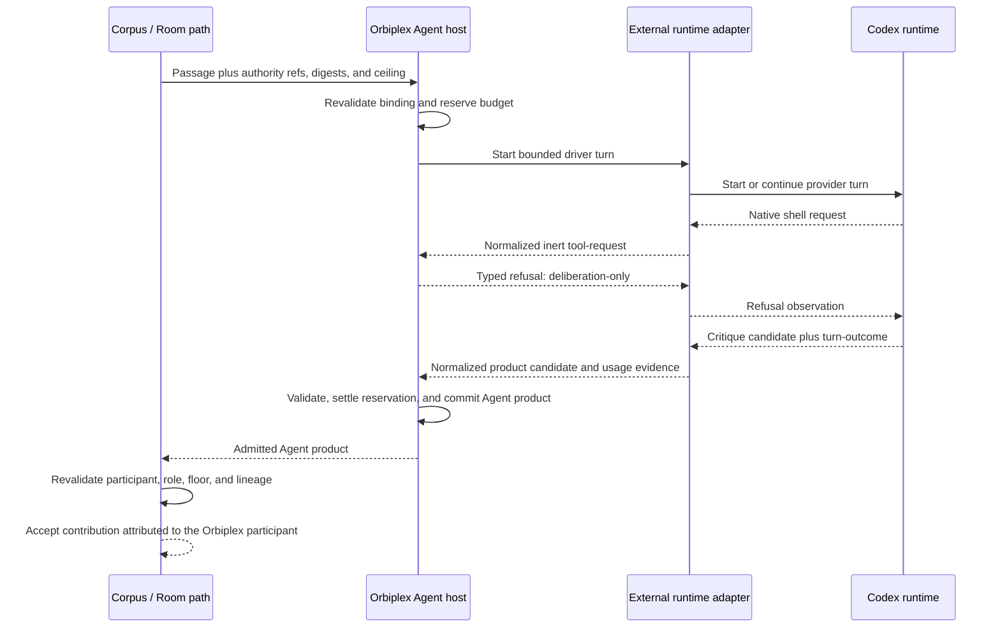
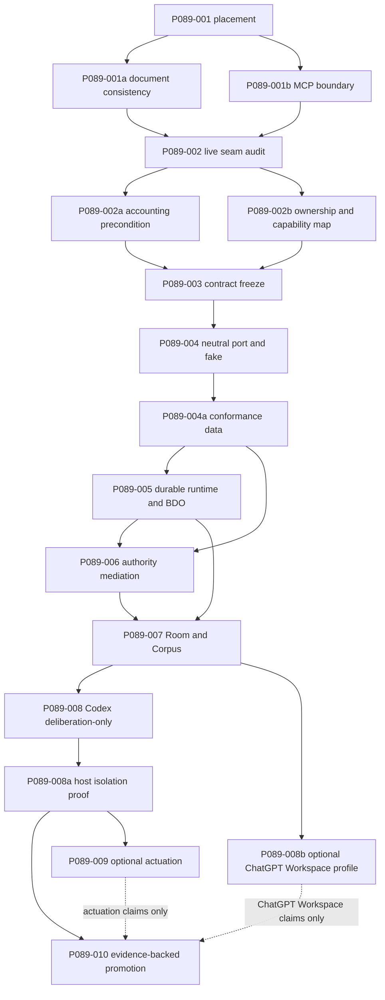

# Proposal 089: External Agent Runtime Adapter Contract

Based on:

- `doc/project/40-proposals/063-inquirium-model-inquiry-organ.md`
- `doc/project/40-proposals/064-inquirium-implementation-recommendations.md`
- `doc/project/40-proposals/069-corpus.md`
- `doc/project/40-proposals/070-room-primitive.md`
- `doc/project/40-proposals/071-sensorium-workbench.md`
- `doc/project/40-proposals/073-agent-orchestration-organ.md`
- `doc/project/60-solutions/036-room/036-room.md`
- `doc/project/60-solutions/038-corpus/038-corpus.md`
- `doc/project/60-solutions/042-sensorium-workbench/042-sensorium-workbench.md`
- `doc/project/60-solutions/044-inquirium/044-inquirium.md`
- `doc/project/60-solutions/047-agent/047-agent.md`

## Status

Draft. The architectural placement and authority boundary are recorded; exact
schemas, the Agent-host seam, a deterministic reference adapter, and every
provider profile remain unimplemented. This proposal carries no Codex, Room, or
runtime-acceptance claim.

## Date

2026-08-29

## Executive Summary

Orbiplex should support external agent runtimes such as Codex without making
them Inquirium adapters, Room members, or new authority roots. A full external
runtime belongs behind **Orbiplex Agent**, as one replaceable controller-driver
implementation governed by the existing Agent identity, lifecycle, budget,
memory, grants, and host admission.

The governing path is:

```text
Room / Corpus participant binding
  -> Orbiplex Agent identity and role
  -> Agent host controller and policy
     -> built-in passage driver -> Inquirium -> model-runtime adapter
     OR
     -> External Agent Runtime Adapter -> provider runtime such as Codex
  -> normalized candidate action, product, question, usage, or refusal
  -> ordinary Agent / Corpus / Room admission
```

Codex may therefore deliberate in a Room, but the speaking and accountable actor
is the Orbiplex Agent bound to that participant and role. A Codex thread id,
provider account, model runtime, or adapter instance is never a Room identity.
The user-facing label "Codex Agent" may describe the selected runtime profile;
semantically it means "Orbiplex Agent backed by a Codex runtime adapter."

The adapter standardizes the external runtime's session and event mechanics into
host-owned values. Tool calls, command approvals, file changes, network requests,
and operator questions remain inert requests until the Agent host and the owning
Orbiplex domain admit them. An external runtime never gains ambient filesystem,
shell, credential, network, publication, or Room authority.

## Context and Problem Statement

Solution 047 already defines Agent as the durable bounded controller above
Inquirium. Solution 044 defines Inquirium as bounded model inquiry and
`model-runtime` as the provider execution substrate. A full external agent
runtime does more than translate one model request: it may retain a session,
stream events, request tools, ask for approval, resume a conversation, and run an
internal loop.

Treating that runtime as an Inquirium adapter would collapse three strata:

```text
model inquiry translation
!= controller-driver execution
!= Agent identity, lifecycle, and authority
```

Admitting the raw runtime directly to Room would collapse identity with an
implementation process. Letting its native tool machinery act directly would
collapse a request for an effect with authority to perform the effect. Both
shortcuts contradict the existing Agent, Inquirium, Sensorium, and Room
boundaries.

The missing contract is a small host-side adapter that lets a bounded Orbiplex
Agent delegate one controller passage to an external agent runtime while
retaining all semantic ownership and authority in Orbiplex.

## Goals

- Keep Orbiplex Agent as the sole durable agent identity, lifecycle owner, budget
  owner, and accountable Room actor.
- Allow a provider-neutral external runtime profile to drive one bounded Agent
  passage and retain an opaque working session between admitted passages.
- Normalize candidate actions, products, progress, questions, tool requests,
  usage, cancellation, and terminal outcomes into typed host-owned values.
- Preserve existing Agent action, effect-proposal, observation, consumer,
  Corpus, and Room admission wherever their contracts already suffice.
- Keep provider session refs, protocol methods, authentication, and event shapes
  out of Agent Core, Corpus, and Room semantics.
- Make classification, egress, retention, model/account snapshot, budget,
  idempotency, recovery, and cancellation explicit adapter-profile facts.
- Prove the boundary first with a deterministic fake runtime, then with a
  deliberation-only Codex profile.

## Non-Goals

- No replacement of Agent by Codex or another provider runtime.
- No full agent loop inside Inquirium or `model-runtime`.
- No raw external runtime, provider account, or thread as a Room member.
- No direct provider-native tool execution that bypasses Agent, Sensorium,
  Workbench, Artifact Delivery, operator review, or another owning domain.
- No provider-specific fields in generic Agent, Corpus, Room, or effect schemas.
- No migration of a live Agent between nodes and no federated ownership transfer.
- No claim that provider progress, reasoning text, approval UI, or session
  history is authoritative Orbiplex evidence.
- No requirement that the first Codex profile support actuation.

## Terminology

| Term | Meaning |
| :--- | :--- |
| External Agent Runtime | A replaceable execution system with its own session/turn mechanics and possibly an internal reasoning or tool loop. It is not an Orbiplex identity or authority root. |
| External Agent Runtime Adapter | Host-side controller-driver adapter that translates one bounded Orbiplex Agent passage to and from an external runtime. It is not an Inquirium runtime adapter. |
| Runtime profile | Operator-admitted data fixing adapter family/version, transport, auth class, retention, egress, tool-mediation, session, cancellation, idempotency, and resource behavior. |
| Opaque runtime session | Provider-local session or thread reference retained only as a fenced execution checkpoint. It is not `agent/id`, `participant/ref`, or memory authority. |
| Driver turn | One bounded invocation of the external runtime for an exact Agent passage. Internal provider events do not become Agent steps unless normalized and admitted by the host. |
| Adapter instance epoch | A host-minted execution generation for one supervised adapter/runtime instance. Restart or replacement changes it and invalidates session reuse; it is an execution fence, not Agent identity. |
| Codex-backed Agent | An Orbiplex Agent whose admitted controller-driver profile selects a Codex adapter. "Codex Agent" is an optional presentation label only. |

## Proposed Model / Decision

### Decision 1: The adapter sits behind Agent, not inside Inquirium

The External Agent Runtime Adapter is an Agent-host execution seam. It may be
called when the host needs a candidate action or terminal product for an exact
Agent passage. It does not replace the pure Agent controller decision, durable
lifecycle facts, budget ledger, memory projection, or consumer binding.

The built-in path and external path remain peers below the same Agent boundary:

```text
Agent host
  -> built-in driver -> CallInquirium -> model-runtime
  -> external driver -> external agent runtime
```

The external path must not masquerade as `inquirium.generate`. Usage from that
path is external-runtime usage evidence and may not claim Inquirium conformance,
runtime selection, or provider-neutral model evidence that did not occur.

A one-shot A2A or similar bridge may still be an Inquirium edge adapter when it
reduces one external answer to untrusted candidate evidence and discards the
external agent's lifecycle and tool semantics. That is a different contract.

### Decision 2: Agent remains the identity and lifecycle envelope

Every external session is bound to exactly one current local `agent/id`, Agent
binding generation, adapter profile generation, and adapter instance epoch. The
provider session ref is opaque and may be reused only under that exact fence.

`spawn`, `fork`, `suspend`, `resume`, `stop`, deadline expiry, budget exhaustion,
and terminal state remain Agent lifecycle transitions. Provider operations may
implement mechanics needed by those transitions, but their status never
overrides the Agent ledger. A child Agent receives its own narrowed runtime
binding; it does not inherit an unfenced provider session.

### Decision 3: The adapter produces candidates, not decisions or effects

One driver turn returns an ordered bounded stream drawn from a closed normalized
set:

- `progress` — bounded host-derived counters, codes, or ephemeral live metadata;
- `action-candidate` — one existing or explicitly versioned Agent action value;
- `product-candidate` — bounded content or an inert content-addressed ref;
- `tool-request` — inert request for a host-owned capability;
- `operator-question` — inert typed question for the existing operator path;
- `usage` — provider/runtime accounting evidence with declared fidelity;
- `turn-outcome` — `completed`, `refused`, `failed`, `cancelled`, or `unknown`.

The host validates, meters, persists, and either admits or refuses each candidate.
Provider prose is never parsed directly into a shell command, Room message,
publication, lifecycle mutation, or grant.

Durable progress is metadata-only: bounded counters, digests, status codes, and
refs may enter Agent facts, Bounded Deferred Operation status, and operator
projections. Provider reasoning, progress prose, prompts, and generated text do
not. A separately admitted live operator projection may expose bounded ephemeral
metadata, but it is neither durable evidence nor a Room input.

### Decision 4: Tool and approval requests re-enter owning domains

An external runtime's tool call or approval request is not authority. The adapter
maps it to an inert request whose exact tool, input schema, payload digest,
classification, deadline, and runtime-turn ref are bounded before Agent admission.

```text
external tool request
  -> adapter normalization
  -> Agent candidate-action admission
  -> capability-specific effect proposal
  -> owning host domain and current grant
  -> optional HIL / lease / generation fence
  -> effect receipt or typed refusal
  -> normalized observation returned to the runtime
```

Provider-native approval prompts may be projected for operator ergonomics, but
an `accept` decision has no Orbiplex meaning unless the complete owning-domain
admission also succeeds. If the adapter cannot intercept an effect before native
execution and bind it to an Orbiplex receipt, that tool class is disabled.

The first real provider profile is deliberation-only: shell, file mutation,
network, and provider-native dynamic tools are refused. Actuation remains
deferred until the adapter proves the full path above.

This refusal is enforced by the Node host at the layer that owns process,
filesystem, credential, network, and tool admission. Provider sandbox and
approval settings are defense in depth, not the authority boundary. The exact
platform mechanism remains Node-owned, but acceptance must prove that a hostile
or deliberately permissive provider configuration still cannot mutate the
workspace, start an unadmitted child process, load arbitrary tool configuration,
reach unadmitted credentials or destinations, or emit an Orbiplex effect.

### Decision 5: Room participation reuses the Agent and Corpus authority path

No new Room actor kind is introduced. Corpus binds an Orbiplex Agent to an
accountable subject or node role and to the current participant, role, query,
turn, disclosure, generation, classification, and expiry context. The external
runtime receives only the bounded projection admitted for that passage.

That identity, authority, revalidation, attribution, and terminal-selection path
is reused; the current execution binding is not assumed reusable unchanged.
`agent.inference-flow-binding.v1` requires non-empty Inquirium prompt, repair,
model, and runtime refs, and `agent.inference-passage-product.v1` requires an
Inquirium-shaped model snapshot plus numeric usage. `P089-002` must therefore
name the smallest compatible driver variant or version revision before contract
freeze. Corpus and Room remain unaware of provider fields; whether their current
opaque binding refs and digests can remain unchanged is an audit result, not a
Draft claim.

Intermediate runtime events remain local operational data. A Room contribution
is emitted only after the external runtime's product becomes an admitted Agent
product and Corpus accepts it through its ordinary proposal/turn path. The
message is attributed to the Orbiplex participant and role, not to Codex or a
provider thread.

### Decision 6: Session state is a cache, not durable Agent memory

The provider session may improve continuity, but it is a discardable working
checkpoint. Memarium-backed Agent facts and the host-owned passage/product ledger
remain the recoverable source of truth.

The adapter profile must declare:

- whether sessions are local or remote and whether they survive process restart;
- provider retention and deletion behavior known to the deployment;
- context and artifact egress classes;
- whether exact resume, cancellation, and request idempotency are supported;
- which model, account/workspace, adapter version, and protocol version fence a
  session;
- whether usage and event ordering are authoritative, estimated, or unavailable.

Credentials, refresh tokens, API keys, and local authentication stores never
enter Agent facts, Room messages, artifacts, traces, or adapter manifests.

Before provider I/O, the host durably reserves the admitted per-turn ceiling on
every budget axis. Settlement is per axis: host-verifiable measured usage may
release unused reservation, while an unavailable, malformed, overflowed, or
ambiguous measurement retains the reserved ceiling unless an accepted
conservative host-owned rule proves a tighter non-zero charge. Missing usage is
never converted to zero, and restart or exact replay may neither duplicate nor
silently release the reservation.

### Decision 7: Unknown outcomes fail closed

The host derives one stable driver-turn ref from the Agent passage and binding
generation. Exact retry may reuse a committed result without another provider
call. It may resume a live external turn only when the profile proves exact
resume semantics under the current session fence.

If the process or connection fails after dispatch and the provider cannot prove
whether the turn or effect ran, the outcome is `unknown`. The host does not
blindly repeat the turn, charge it as zero, publish partial output, or advance the
Room floor. Reconciliation or an explicit operator decision is required.

Cancellation is cooperative until the provider confirms it. Agent stop still
prevents admission of later output even when the external runtime ignores or
cannot prove cancellation.

A driver turn that outlives one normal request or needs status, progress,
cancellation, or continuation uses the shared Bounded Deferred Operations (BDO)
contract. Agent/Memarium facts remain the domain source of dispatch intent,
reservation, outcome, and reconciliation truth; the BDO registry is the bounded
control-plane projection and join. BDO `unknown` is terminal operational state,
and Replay Scheduler may launch bounded reconciliation, but neither creates a
second Agent state machine. Synchronous turns may remain inside the already
bounded controller request. No component-private retry loop, background thread,
or ad hoc queue is introduced.

### Decision 8: The contract is provider-neutral and versioned

The candidate canonical namespace is `agent.external-runtime.*`; its exact
spelling and whether the first profile value is named a profile or manifest are
freeze decisions. The current candidate families are:

```text
agent.external-runtime.profile.v1
agent.external-runtime.binding.v1
agent.external-runtime.turn-request.v1
agent.external-runtime.event.v1
agent.external-runtime.turn-outcome.v1
```

The final schemas must carry refs and digests rather than provider payloads,
enforce closed event and outcome classes, and bound counts, text, artifacts,
deadlines, and usage values. Generic reviewed contracts that cross the
Agent-host/adapter boundary are canonical in Orbidocs and mirrored into Node;
purely internal Rust trait shapes need not become public schemas.
Provider-specific protocol mappings, process manifests, pins, and fixtures
remain in Node.

The behavior surface is intentionally small:

```text
ensure_session(binding, fence) -> session checkpoint or refusal
start_turn(exact passage request) -> bounded event stream
continue_turn(exact observation or decision) -> bounded event stream
cancel_turn(turn ref, reason) -> acknowledged | pending | unknown
inspect(binding or turn ref) -> metadata-only status
close_session(binding, reason) -> closed | pending | unknown
```

These operations describe the private host-to-driver behavior surface. They do
not automatically become six dispatchable capabilities. `P089-002` maps them to
the existing Agent admission surface and introduces a capability id only when a
behavior is independently grantable, routable, or operator-visible. Capability
Registry status changes accompany implementation evidence, not a Draft schema.

### Decision 9: Codex is first; a ChatGPT workspace agent is the second candidate

The first intended provider profile is `openai-codex`. It may be implemented
through either of two official surfaces:

- Codex SDK for starting, continuing, and resuming local Codex threads in a
  bounded job-like integration;
- Codex App Server for a richer bidirectional integration with conversation
  history, streamed events, approvals, and account/authentication state.

`openai-chatgpt-workspace-agent` is the candidate second provider profile
behind the same provider-neutral External Agent Runtime Adapter, alongside
`openai-codex`. It is not a new Agent kind, an Inquirium adapter, or a Room
identity. The profile may use only an official Workspace Agents integration
surface and must satisfy the same identity, authority, accounting, retention,
attribution, and conformance rules as every other provider profile.

As of 2026-08-31, the documented Workspace Agents API can enqueue a run and
expose beta run status, but the agent's response cannot be retrieved through the
API. The candidate therefore remains unimplemented and non-routable until an
official result-delivery surface can return enough bounded data for the host to
produce a `product-candidate` and `turn-outcome`. Browser or UI automation,
copied web sessions, session-cookie reuse, and conversation scraping are not
acceptable substitutes.

The Orbiplex contract does not expose either surface directly. Node owns the
sidecar/process model, exact protocol mapping, binary/package pin, generated
provider schema, transport choice, retries, and conformance fixtures. A local
App Server profile should begin with its default local stdio transport; an
experimental remote WebSocket is not baseline acceptance evidence.

Authentication is an operator deployment choice, not Room or Agent semantics.
The profile records only a non-secret auth class and policy snapshot. Trusted
local interactive use may use a locally authenticated ChatGPT session where
currently supported; unattended automation should use an operator-approved API
or enterprise automation credential. No profile may copy or distribute a local
Codex authentication store.

Official informative references:

- <https://learn.chatgpt.com/docs/codex-sdk> (accessed 2026-08-29)
- <https://learn.chatgpt.com/docs/app-server> (accessed 2026-08-29)
- <https://learn.chatgpt.com/docs/auth> (accessed 2026-08-29)
- <https://learn.chatgpt.com/workspace-agents/trigger-runs> (accessed 2026-08-31)
- <https://learn.chatgpt.com/workspace-agents/authentication> (accessed 2026-08-31)

These references are informative descriptions of a moving provider surface,
not Orbiplex contracts. A provider-side change may require a new Node profile or
make one unroutable; it does not change the semantics or authority boundary of
this proposal.

### Decision 10: Conformance precedes provider acceptance

The first implementation must use a deterministic fake external runtime with
controllable event ordering, duplicate events, crash points, delayed
cancellation, unknown outcomes, malformed products, over-budget usage, tool
requests, and stale-session replay. No real provider profile may become
routable until it passes the same generic suite plus provider-specific
lifecycle, authentication, result-delivery, and failure checks. `openai-codex`
remains the first intended admission; `openai-chatgpt-workspace-agent` remains
blocked by the provider limitation recorded in Decision 9.

## Concrete Scenario

An admitted Room participant is bound to Orbiplex Agent `agent:reviewer-17`.
Corpus asks that Agent for one critique passage under the current participant,
role, policy, classification, expiry, binding digest, and budget ceiling. The
selected `openai-codex` profile is deliberation-only. During the turn Codex asks
to run a shell command; the host returns a typed refusal as an observation, then
admits the later critique only as an Agent product. No shell process is started,
and Codex never becomes the speaking Room actor.



## Acceptance Criteria

1. A deterministic external runtime can drive one Agent passage through the
   audited Agent/Corpus authority path. Any required contract revision uses a
   closed provider-neutral driver variant; no provider field enters Agent Core,
   Corpus, or Room contracts.
2. Room and Corpus evidence names the Orbiplex Agent, participant, and role; no
   provider session or adapter instance appears as the speaking actor.
3. Missing, stale, mismatched, expired, or revoked Agent/runtime bindings fail
   before provider I/O and before product admission.
4. An external tool request cannot execute without the same capability, grant,
   policy, HIL, lease, generation, and receipt path used by its owning domain.
5. A stopped, suspended, expired, or budget-exhausted Agent cannot admit late
   provider output even if the provider completes successfully.
6. Every provider dispatch has a durable bounded reservation. Missing,
   malformed, overflowed, unavailable, or ambiguous usage never settles an
   unmeasured budget axis to zero, and restart cannot lose or duplicate a charge.
7. Exact committed retry returns the same product and accounting result without
   reinvocation; ambiguous dispatch becomes `unknown` rather than silent replay.
8. Provider session loss can rebuild the Agent from durable Orbiplex facts or
   terminate with a typed refusal; it never promotes provider history to the
   source of truth.
9. Classification and egress refusal happen before protected context reaches a
   remote runtime, and traces contain no prompt, credentials, provider output, or
   Room-private content. Durable progress contains only bounded host-derived
   counters, codes, digests, and refs.
10. A long-running driver turn reuses BDO plus Replay Scheduler for bounded
    status, cancellation, and reconciliation without creating a private queue,
    retry loop, or second Agent state machine.
11. The first Codex acceptance profile is deliberation-only and proves on a real
    supported platform that shell, file mutation, unadmitted child execution,
    unadmitted egress, credential reach, and unmediated tools remain unavailable
    even when provider configuration is deliberately permissive.
12. An actuation-capable Codex profile remains non-routable until it proves one
    complete tool-request-to-owning-domain receipt round trip and all negative
    cases in the generic conformance suite.

## Trade-offs

| Decision | Benefit | Cost |
| :--- | :--- | :--- |
| Put external runtimes behind Agent | Preserves identity, lifecycle, Room attribution, and authority. | Requires a translation layer instead of exposing provider sessions directly. |
| Keep Inquirium and external controller drivers separate | Prevents full agent semantics from leaking into model inquiry. | Two execution paths require explicit accounting and conformance distinctions. |
| Treat provider sessions as caches | Keeps Orbiplex recovery and audit authoritative. | Resume may lose provider-local context and require bounded reconstruction. |
| Start Codex deliberation-only | Proves deliberation before actuation. | Native coding-tool value is deferred until host mediation is demonstrable. |
| Normalize events into a closed contract | Makes providers replaceable and testable. | Some provider event detail is intentionally lost. |

## Failure Modes and Mitigations

| Failure | Mitigation |
| :--- | :--- |
| Provider thread becomes Room identity | Room/Corpus schemas accept only the existing participant and Agent binding; provider refs remain host-local metadata. |
| App Server approval is treated as authority | Translate it to an inert request and require the owning Orbiplex admission path; otherwise decline. |
| Provider settings drift or become permissive | Node host isolation independently denies workspace mutation, unadmitted process/tool configuration, credential reach, and unadmitted egress; provider settings remain defense in depth. |
| Provider session is mistaken for durable memory | Recovery always begins from Agent facts; session reuse is fenced and optional. |
| Unknown dispatch is retried and double-charged | Persist dispatch intent before I/O; return `unknown` without provider idempotency or exact resume evidence. |
| Missing usage becomes a free successful turn | Reserve each budget axis before I/O; unmeasured or ambiguous axes retain a conservative non-zero charge and never default to zero. |
| Driver reconciliation creates a second state machine | Agent facts own domain truth, BDO owns the control-plane projection, and Replay Scheduler launches one bounded reconciliation job; no private reaper or queue exists. |
| Provider progress prose leaks into durable status | Persist only bounded host-derived counters, codes, digests, and refs; provider text is excluded from Agent facts, BDO status, traces, and Room evidence. |
| Provider-specific fields leak into Agent Core | Keep generic contracts provider-neutral and canonical in Orbidocs; keep provider mappings and pins in Node; reject leakage with schema and dependency guards. |
| Room prose becomes an effect | Only a typed Agent action/effect proposal can enter host admission; Corpus turns remain inert. |
| Subscription or API credentials leak | Store credentials only in operator-owned local secret mechanisms; traces and artifacts retain an auth-class ref at most. |

## Alternatives Considered

### Codex as an Inquirium runtime adapter

Rejected for the full Codex agent runtime because session, approvals, tools, and
multi-step controller behavior exceed model-inquiry translation. A one-shot
Codex response stripped to candidate evidence may still use the narrower
Inquirium edge-bridge contract.

### Codex as a direct Room participant

Rejected because a provider process has no Orbiplex subject accountability,
membership authority, role binding, lifecycle, or durable audit identity.

### External runtime replaces Orbiplex Agent

Rejected because provider lifecycle and session state cannot own Orbiplex grants,
budgets, memory, consumer acceptance, or recovery.

### Let provider-native sandboxing count as Workbench mediation

Rejected for V1. A provider sandbox may be useful defense in depth, but it does
not itself produce Sensorium/Workbench authority, generation, lease, HIL, and
receipt evidence.

## Resolved Decisions

- **P089-RD1:** Full external agent runtimes are Agent-host controller-driver
  adapters, not Inquirium runtime adapters.
- **P089-RD2:** A Codex-backed Room participant is represented and attributed as
  an Orbiplex Agent under an accountable participant/role binding.
- **P089-RD3:** Provider-native tool and approval requests are inert until the
  owning Orbiplex effect path admits them.
- **P089-RD4:** The first Codex profile is deliberation-only; actuation is a separate
  acceptance phase.
- **P089-RD5:** Provider sessions are opaque fenced caches, not Agent identity or
  durable memory.
- **P089-RD6:** Agent and Corpus identity, authority, revalidation, attribution,
  and terminal-selection paths are reused, but their current Inquirium-shaped
  execution binding is not presumed reusable unchanged.
- **P089-RD7:** Every provider dispatch reserves a bounded per-axis ceiling
  before I/O; unavailable or ambiguous usage never becomes a zero charge.
- **P089-RD8:** Long-running external turns reuse BDO and Replay Scheduler for
  control-plane lifecycle and reconciliation while Agent/Memarium facts remain
  domain truth.
- **P089-RD9:** Deliberation-only isolation is host-enforced; provider sandbox
  and approval settings are defense in depth.
- **P089-RD10:** Durable progress is limited to bounded host-derived metadata;
  provider reasoning and progress text are not durable Agent or Room evidence.
- **P089-RD11:** `openai-chatgpt-workspace-agent` is the candidate second
  provider profile behind the same provider-neutral External Agent Runtime
  Adapter as `openai-codex`, not a new Agent kind or Room identity. It remains
  non-routable until an official integration surface provides retrievable
  terminal results compatible with the generic contract.

## Open Questions

1. Should V1 standardize one driver transport while allowing multiple provider
   profiles, or admit both SDK-sidecar and App Server mappings from the start?
2. Should one external session be scoped to the whole Agent binding or to one
   inference-flow/passage family, given privacy and replay trade-offs?
3. Which exact Agent flow-binding, passage input/invoke/product/trace, accounting,
   and terminal-selection contracts can be reused unchanged, and which require a
   minimal compatible version or closed driver variant?
4. Which non-secret auth-class and provider-account/workspace snapshot fields are
   necessary for reproducibility without turning credentials into domain data?
5. What stable provider surface can replace experimental dynamic-tool mechanisms
   before an actuation-capable Codex profile is admitted?
6. Which private driver behaviors reuse the existing Agent admission surface, and
   which, if any, are independently grantable or inspectable enough to require a
   new capability id?
7. Which official Workspace Agents result-delivery and usage-evidence surfaces
   are sufficient to map a completed run to a bounded `product-candidate`,
   `turn-outcome`, accounting, cancellation, and recovery without UI automation
   or session-cookie access?

## Implementation Tracker

Status values: `todo`, `in-progress`, `partial`, `done`, `deferred`.

| ID | Work item | Depends on | Status | Done criteria / evidence |
| :--- | :--- | :--- | :--- | :--- |
| `P089-001` | Architectural placement: distinguish model-runtime adapters, one-shot external-agent evidence bridges, and stateful External Agent Runtime Adapters. | — | `done` | Decisions 1–5 here; the boundary is propagated to Proposals 064/071 and Solutions 044/047 without an implementation claim. |
| `P089-001a` | Resolve review-level document consistency: fix source refs and attribution, make Solution 047 statuses explicit, define progress and the adapter instance epoch, and add one continuous Room scenario. | `P089-001` | `done` | P089 `Based on`, Terminology, Decisions 2–9, Concrete Scenario, and acceptance/failure matrices; Solution 047 `May Implement`. |
| `P089-001b` | State the Inquirium MCP execution boundary without inventing a second effect path. | `P089-001` | `done` | Proposal 064 now defines `allowed/tools` as an admission ceiling and assigns every out-of-inquiry effect to its owning host domain. |
| `P089-002` | Audit the live Agent/Corpus seam: binding, input, invoke, product, trace, accounting, terminal selection, lifecycle, recovery, and collaborative participant/Chair joins. Name every reusable contract and required compatible version or closed driver variant. | `P089-001a`, `P089-001b` | `todo` | A checked seam map cites current schemas and Node owners, preserves the Corpus authority path, and proves that no Inquirium-shaped field is populated falsely. |
| `P089-002a` | Freeze the accounting precondition: durable per-axis reservation before I/O, measured and conservative settlement, exact replay, and `unknown` handling. Remove every missing/malformed-usage-to-zero path. | `P089-002` | `todo` | Tests prove missing, malformed, overflowed, unavailable, crash, and replay cases neither settle to zero nor double-charge or lose a reservation. |
| `P089-002b` | Decide generic schema ownership and map the private driver behaviors to the smallest public capability surface. | `P089-002` | `todo` | The decision distinguishes canonical cross-boundary schemas from internal traits, reuses existing Agent capabilities where sufficient, and names a new capability only for independently grantable, routable, or inspectable semantics. |
| `P089-003` | Freeze provider-neutral contracts and refusal data: driver binding/variant, request, bounded event metadata, `turn-outcome`, product/accounting, retryability, retention, idempotency, cancellation, trace, and session-fence semantics. | `P089-002a`, `P089-002b` | `todo` | Canonical Orbidocs schemas, Node mirrors, positive fixtures, negative/refusal fixtures, generated docs, and Schema Gate checks pass; Open Questions are resolved without provider fields in Agent Core, Corpus, or Room. |
| `P089-004` | Implement the provider-neutral driver port and deterministic fake below the pure Agent decision boundary, with all external calls and streams bounded. | `P089-003` | `todo` | Placement follows the seam audit; provider/runtime I/O stays out of `agent-core` and `agent-host`; dependency guards pass; the fake supports deterministic start/continue/cancel/inspect/session behavior. |
| `P089-004a` | Build conformance as data before the real provider: duplicate, reordered, malformed, unauthorized, stale, slow, oversized, cancelled, crashed, `unknown`, and replay profiles. | `P089-004` | `todo` | Unit/property, refusal, replay, and bounded-growth tests cover every closed outcome/code and prove that provider prompt, reasoning, progress prose, and raw output never enter durable status or trace. |
| `P089-005` | Implement durable host execution and recovery using Agent/Memarium facts plus BDO and Replay Scheduler, without a private state machine or queue. | `P089-004a` | `todo` | Dispatch intent, reservation, session fence, outcome, and reconciliation are durable; BDO has an explicit operation kind and bounded poll/cancel projection; Scheduler owns bounded reconciliation; crash points before/after dispatch and commit are covered. |
| `P089-006` | Mediate external tool and approval requests through existing inert Agent effect proposals and owning-domain admission. | `P089-004a`, `P089-005` | `todo` | A data-backed refusal matrix proves that a hostile runtime cannot widen grants, bypass HIL/lease/generation, execute directly, publish, or fabricate a receipt; one admitted fake round trip returns the real receipt as a normalized observation. |
| `P089-007` | Prove fake-runtime Room/Corpus conformance for participant and Chair roles. | `P089-005`, `P089-006` | `todo` | Acceptance covers authority revalidation, attribution, floor/lineage, explicit terminal selection, restart after dispatch, replay, cancellation, provider loss, unknown usage, and oversized/malformed events; no provider event or prose directly becomes a Room act or effect. |
| `P089-008` | Implement one pinned Codex deliberation-only profile over one official local integration surface. | `P089-007` | `todo` | Node owns supervised lifecycle, exact protocol mapping, version/digest pins, local transport, auth/retention/egress declarations, session fencing, dependency-loss transitions, and real start/continue/resume/cancel evidence; all native effects remain refused. |
| `P089-008a` | Retain a real-platform host-isolation proof independent of provider settings. | `P089-008` | `todo` | With deliberately permissive provider configuration, acceptance still denies workspace mutation, arbitrary child/tool configuration, unadmitted network/credential reach, and unmediated effect execution while allowing only the explicitly admitted provider control channel. |
| `P089-008b` | Evaluate and implement `openai-chatgpt-workspace-agent` as the candidate second deliberation-only provider profile, but only over an official Workspace Agents surface that returns terminal results. | `P089-007`, stable official result-delivery surface | `deferred` | Node owns the exact API and scoped workspace-auth mapping plus retention, egress, accounting, session, status, result, cancellation, recovery, and failure semantics; the pinned profile retrieves a bounded product and outcome without UI automation or session-cookie access and passes the generic suite. |
| `P089-009` | Add an actuation-capable Codex profile only after a stable interceptable tool surface exists. | `P089-008a`, stable provider surface | `deferred` | End-to-end Workbench/Sensorium request, receipt, observation return, revocation, restart, dependency loss, and negative bypass evidence exists before the profile becomes routable. |
| `P089-010` | Promote only evidence-backed capability status and synchronize all affected surfaces. | `P089-008a`; `P089-008b` for ChatGPT Workspace claims only; `P089-009` for actuation claims only | `todo` | Solution 047, any actually introduced Capability Registry entries, Node's coarse implementation ledger, operator docs, acceptance README/report, generated docs, mirrors, and fixtures agree with retained generic and provider evidence. A trait or schema alone is insufficient. |

### Dependency graph



## Next Actions

1. Complete `P089-002`, `P089-002a`, and `P089-002b`; do not freeze names,
   versions, public capabilities, or accounting until the live seam and every
   current zero/default path are accounted for.
2. Freeze schemas and refusal data in `P089-003`, then prove the neutral port
   with the deterministic fake and negative/replay suite before any Codex code.
3. Add durable execution, BDO/Scheduler reconciliation, effect mediation, and
   fake Room/Corpus acceptance in dependency order.
4. Admit one pinned deliberation-only Codex profile only after the generic suite
   passes, then retain the independent host-isolation proof.
5. Keep `openai-chatgpt-workspace-agent` as the candidate second profile behind
   the same adapter. Do not implement or route it until an official Workspace
   Agents surface can return terminal response data and satisfy the generic
   suite without UI automation or session-cookie access.
6. Keep actuation deferred. Promote generic and deliberation-only evidence
   without waiting for actuation; never promote actuation claims before
   `P089-009` is complete.
