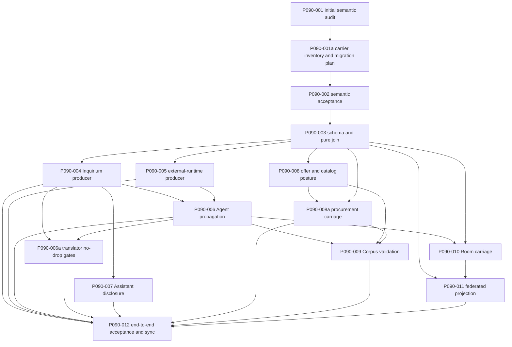

# Proposal 090: Inference Execution Provenance and Non-local Disclosure

Based on:

- `doc/normative/20-vision/en/VISION.en.md`
- `doc/normative/30-core-values/en/CORE-VALUES.en.md`
- `doc/normative/40-constitution/en/CONSTITUTION.en.md`
- `doc/project/40-proposals/004-human-origin-flags-and-operator-participation.md`
- `doc/project/40-proposals/021-service-offers-orders-and-procurement-bridge.md`
- `doc/project/40-proposals/047-classification-label-propagation.md`
- `doc/project/40-proposals/063-inquirium-model-inquiry-organ.md`
- `doc/project/40-proposals/064-inquirium-implementation-recommendations.md`
- `doc/project/40-proposals/066-inquirium-assistant-channel.md`
- `doc/project/40-proposals/067-shared-offer-catalog-over-agora.md`
- `doc/project/40-proposals/069-corpus.md`
- `doc/project/40-proposals/070-room-primitive.md`
- `doc/project/40-proposals/073-agent-orchestration-organ.md`
- `doc/project/40-proposals/081-horizontal-protocol-primitives.md`
- `doc/project/40-proposals/086-component-communication-observation-and-trace-sessions.md`

Related producer contract, extended by this proposal:

- `doc/project/40-proposals/089-external-agent-runtime-adapter-contract.md`

## Status

Accepted design, with the repository-evidenced carrier inventory and the five
V1 design questions resolved on 2026-09-04. The two canonical schemas, pure
comparison/join/projection and migration core, boundary Schema Gate, fixtures,
and layering guards are implemented by `P090-003`. Producer propagation,
consumer policies, the guided provider registry, operator surfaces, and cross-
node acceptance remain implementation work. Existing locality policies,
provider metadata, classification labels, origin classes, runtime traces, and
offer fields are antecedents only; none currently proves the proposal's
complete result-level vertical.

## Date

2026-09-01

## Executive Summary

Orbiplex should let a consumer distinguish inference performed within an
operator-declared local processing boundary from inference that involved an
external processing boundary. The information must remain attached to the
result as higher layers transform, aggregate, cache, replay, offer, deliberate
over, or present it. When policy permits, the node may also disclose one or more
inference-provider references. When exact disclosure is not permitted, the
fact of non-local processing must remain visible.

This proposal introduces two separate semantic targets:
`inference-execution-posture.v1` for a scoped pre-execution declaration and
`inference-execution-provenance.v1` for an immutable, provider-neutral
description of one realized execution path or one terminal operation whose
dispatch state is known or ambiguous. Together they keep three facts from being
collapsed:

1. **pre-execution posture** — what a profile, participant binding, or service
   offer declares it may do;
2. **realized per-result provenance** — what is known about the execution that
   produced this exact result;
3. **evidence basis** — why the emitting node is entitled to make each claim.

The propagation rule resembles taint tracking internally, but public contracts
do not call non-local inference "tainted." Non-local processing is not
contamination. It is a material execution characteristic that can affect
consent, routing, disclosure, filtering, and presentation.

The contract is deliberately cumulative rather than absolute. It cannot prove
physical locality against a dishonest node, a compromised runtime, or an
adapter that conceals another provider hop. It can make honest implementations
more transparent, preserve uncertainty, and prevent known non-local processing
from silently becoming "local" as data crosses architectural layers.

## Context and Problem Statement

Orbiplex already has several pieces of the intended mechanism:

- model-runtime catalog entries describe runtime locality, egress policy,
  adapter provider, transport, model binding, and trust posture;
- Inquirium performs pre-I/O locality, classification, and egress admission;
- external Agent runtime profiles declare transport, retention, authentication,
  and egress constraints;
- classification labels propagate conservatively under Proposal 047;
- human/model participation origin is made visible by Proposal 004;
- Corpus service offers may describe a coarse model class;
- communication observations and execution receipts can support evidence refs.

Those pieces answer different questions. A selection policy says what may be
used. A runtime catalog says what is configured. A transport says how the host
reaches an adapter. A trace says what one observation point recorded. None of
them, alone, is a portable statement of how one exact inference result was
produced.

Today this information narrows at the Inquirium result boundary. Runtime and
model-binding refs survive, and some provider/model details survive in local
diagnostics, but higher-level products do not receive one typed execution-
provenance value. Agent, Corpus, Room, and Assistant therefore cannot preserve,
join, filter, or present the characteristic without reverse-engineering local
catalog state or relying on naming conventions.

That reverse inference is unsafe. A local process or local HTTP sidecar may call
a remote provider. Conversely, an operator-controlled model may run on another
machine that still belongs to the policy's declared local processing boundary.
Transport location, model name, adapter name, and processing locality are
related observations, not synonyms.

The missing abstraction is a small horizontal value that carries known
execution origin and uncertainty without becoming an identity, authority,
classification, or provider-specific protocol.

### Normative and architectural lineage

This proposal operationalizes existing commitments rather than creating a new
normative authority. Local-first operation, user and data sovereignty, minimal
disclosure, layered audit traces, and explicit model-backed inference already
come from the Vision, Core Values, and Constitution. The proposal compresses
those commitments into a project-level data contract and newly determines the
join, evidence, projection, and consumer boundaries needed to implement them.

The stratified chain is:

```text
locality, agency, privacy, and transparent model use
  -> explicit and minimally disclosed processing facts
  -> inference execution provenance contract
  -> producer derivation and monotone propagation
  -> consumer policy, filtering, and presentation
  -> schemas, ledgers, fixtures, tests, and runtime evidence
```

## Goals

- Give every inference-derived result a typed, immutable execution-provenance
  descriptor or exact content-addressed reference to one.
- Represent terminal pre-dispatch refusal without falsely claiming unknown
  inference execution.
- Distinguish an advertised pre-execution posture from realized per-result
  provenance.
- Preserve known non-local or mixed processing through higher-layer
  transformations, aggregation, cache, replay, and cross-node carriage.
- Preserve uncertainty instead of treating missing metadata as local execution.
- Let providers be identified through optional, open, namespaced references
  without defining a closed global provider enumeration.
- Support selective disclosure: provider identity may be redacted while the
  non-local characteristic and evidence limits remain visible.
- Let Corpus consumers filter offers by declared posture and validate delivered
  results against that declaration.
- Let Room and Assistant surfaces warn, label, or restrict non-local and unknown
  inference according to local policy.
- Reuse P081 receipts and P086 observations as evidence references without
  turning either diagnostic subsystem into the semantic owner.
- Keep the contract small enough for pure join and projection functions, schema
  fixtures, replay tests, and independent implementations.

## Non-Goals

- No proof of physical locality against a dishonest or compromised node.
- No promise that an adapter or provider has disclosed every hidden downstream
  processor.
- No provider reputation, trust ranking, certification, or allowlist imposed by
  this proposal.
- No closed catalog of deliberation profiles, problem domains, provider names,
  or acceptable evidence policies.
- No reinterpretation of local inference as inherently trustworthy or non-local
  inference as inherently untrustworthy.
- No addition of locality or provider identity to the classification lattice.
- No replacement of human/model participation origin from Proposal 004.
- No promotion of runtime sessions, provider accounts, endpoints, request ids,
  or credentials to Agent, Room, or Corpus identity.
- No new capability, grant, membership, or publication authority derived from a
  provenance descriptor.
- No requirement to disclose exact provider identity when policy requires a
  coarser projection.
- No use of optional communication tracing as the only source of mandatory
  provenance.

## Terminology

| Term | Meaning |
| :--- | :--- |
| Local processing boundary | Versioned, operator-admitted boundary relative to which locality is asserted. It may be narrower than an organization and broader than one process, but its meaning must not be inferred from a hostname or transport. |
| Pre-execution posture | Signed or locally admitted statement of what an offer, runtime profile, or scoped participant binding may use before a particular invocation occurs, relative to an exact processing-boundary ref and assertion scope. |
| Realized provenance | Immutable claim about the dispatch, locality, egress, processors, and evidence of one exact result or terminal operation. |
| Evidence basis | Typed reason supporting one provenance claim, such as host-enforced no-egress, host-selected runtime profile, host-observed egress, adapter report, provider report, peer attestation, or derivation from parent values. |
| Provider ref | Optional opaque namespaced reference identifying a processor or inference service. Values are open; the shared schema does not enumerate providers. |
| Provenance projection | Policy-governed reduction of a fuller local descriptor for another consumer. Projection may remove details but may not strengthen evidence or erase known non-local processing. |
| Provenance join | Pure conservative combination of parent descriptors into a descriptor for a derived or aggregate result. |
| Unknown | An explicit absence of sufficient evidence for a claim after possible execution. It never means local. |
| Not dispatched | Host-established fact that provider/runtime I/O for the scoped inference did not begin. It is distinct from unknown execution. |

The word *posture* in this proposal is always qualified as **inference execution
posture**: a workload-scoped pre-execution declaration. It is not
`topology/host-posture`, `node-extension-posture.v1`, an extension-posture
evaluation, or an unqualified `posture/ref`/`posture/digest` from those contract
families. Their refs, digests, evidence, and policy meanings are not
interchangeable. The qualified `inference-execution-posture.v1` name is retained
because it describes an admitted operational stance rather than merely the fact
that a declaration was serialized.

## Proposed Model / Decision

### Decision 1: Posture, realized provenance, and evidence remain separate

The system must not use one `remote` Boolean for three different claims.

| Stratum | Question | Typical owner | May drive |
| :--- | :--- | :--- | :--- |
| Pre-execution posture | What processing may this offer, binding, or profile use? | profile owner, offer signer, participant-binding owner | admission, routing, consent, filtering |
| Realized provenance | What is known about the path that produced this exact result? | host boundary that admitted and observed execution | result labels, downstream joins, policy validation, presentation |
| Evidence basis | Why may the node make that claim, and with what limitation? | host evidence assembler; peer only attests to its own claim | assurance policy, warning strength, audit |

Posture is an open characteristic map. Its small common locality vocabulary is:

- `local-only`;
- `may-use-non-local`;
- `non-local-required`;
- `unknown`.

Posture has its own contract, `inference-execution-posture.v1`; it is not a
projection of realized provenance. The contract binds at least:

- the assertion owner and the offer, runtime profile, participant binding, or
  other exact subject;
- the versioned local-processing-boundary ref against which locality words are
  interpreted;
- the scope, generation or validity interval, and shared locality commitment;
- optional open provider refs, their disclosure state, namespaced extensions,
  and locally admitted evidence requirements.

An assertion that crosses an ownership boundary is signed. A locally admitted
assertion retains equivalent owner, generation, and boundary binding in durable
host state. Absence, invalidity, expiry, or a missing boundary ref becomes
explicit `unknown`; it never becomes `local-only`.

The existing model-runtime `LocalityMode` and `TrustMode` values are legacy
admission and routing inputs, not realized provenance and not sufficient evidence
of locality. In particular, `TrustMode` names whether the legacy routing surface
is restricted to, prefers, or is capable of admitting non-local candidates; it is
not provider trust, evidence strength, or cryptographic assurance. Migration to
the shared posture vocabulary is total and conservative:

| Legacy catalog/profile facts | P090 posture result | Preserved qualification |
| :--- | :--- | :--- |
| Candidate policy and capabilities are both `LocalOnly`, trust mode is `StrictLocal`, and the host binds an exact admitted processing boundary plus the required enforcement facts | `local-only` | This remains a pre-execution commitment, never realized proof. |
| Any complete legacy tuple contains `LocalPreferred`, `RemoteAllowed`, or `RemoteCapable` | `may-use-non-local` | `LocalPreferred` may survive as an optional namespaced routing preference; it is not a separate shared locality ceiling. |
| A new explicit binding requires processing outside the admitted boundary | `non-local-required` | There is no lossless legacy equivalent; this value must be declared explicitly. |
| A required legacy field or boundary binding is missing, invalid, stale, or cannot be reconciled | `unknown` | No Rust or schema default may strengthen it to `local-only`. |

At a deserialization or migration boundary, an enum's Rust `Default`
implementation is never locality evidence. Raw legacy DTOs therefore keep
locality and trust inputs required or optional until explicit validation and
migration completes. Builders, container defaults, and `unwrap_or_default()`
paths are subject to the same rule. An absent profile override may mean only “no
additional override”; it cannot repair absent candidate facts or establish local
execution.

This vocabulary describes one horizontal dimension, not a closed repertoire of
profiles. Operators and communities may add namespaced characteristics and
evidence requirements without changing the shared core. An offer or Room policy
may require stronger evidence than another without creating a universal catalog
of acceptable deliberation meanings.

Two posture or locality assertions are directly comparable only when they name
the same boundary ref or when local policy admits an explicit, versioned
equivalence or containment relation between their boundaries. Otherwise a
federated filter returns non-match or `unknown` according to caller policy; it
must not reinterpret another operator's `local-only` as its own.

Realized provenance never inherits a favorable posture merely because the
profile promised it. It is derived from the selected binding and host-known
execution facts after dispatch. A mismatch between posture and realized
provenance is a policy violation or typed uncertainty, not a reason to rewrite
the result metadata.

### Decision 2: `inference-execution-provenance.v1` is a horizontal value

The canonical contract uses one deterministic representation rule: carry the
bounded descriptor inline together with its digest at or below the V1 canonical
byte threshold, and carry an immutable content-addressed ref above that threshold.
`P090-003` freezes the exact threshold as a schema/core constant. In either form,
`descriptor/id` is always the `sha256:` digest of the same domain-separated
canonical semantic identity material, not a random identifier or a digest of the
carrier wrapper. V1 uses `CanonicalJsonProfile::JcsV1` and
`sha256_base64url_canonical_json_prefixed`; the identity material includes a fixed
descriptor-type domain and excludes only the self id, signature, carrier wrapper,
and explicitly enumerated presentation-only fields. It never excludes locality,
egress, dispatch, evidence/disclosure completeness, boundary, subject, or lineage
semantics.

Its semantic fields are:

| Field family | Required semantics |
| :--- | :--- |
| Contract and scope | Exact schema id, descriptor id/digest, subject result or terminal-operation ref, producing node or host assertion ref, and timestamp or sequence context. |
| Dispatch | `not-dispatched`, `dispatched`, or `ambiguous`, scoped only to the provider/runtime I/O for this invocation. |
| Locality | `local`, `non-local`, `mixed`, `unknown`, or `not-applicable`, interpreted relative to an exact local-processing-boundary ref. |
| Input egress | `none`, `possible`, `occurred`, or `unknown`, independent from transport kind and data classification. |
| Provider disclosure | Bounded open `provider/refs`, plus whether the set is complete, partial, withheld, or unknown. |
| Execution bindings | Optional runtime, adapter-profile, model-binding, model-snapshot, and external-runtime-profile refs that remain meaningful under the selected projection. |
| Evidence | Bounded typed assertions naming their basis, asserting subject, evidence refs, and any scope or completeness limitation. |
| Lineage | Bounded parent provenance refs or one content-addressed aggregate ref sufficient to reproduce the join. |
| Extensions | Bounded namespaced values admitted by policy; extensions cannot redefine core fields or authority. |

`not-dispatched` is required for a host refusal that occurs before provider or
runtime I/O. Such an outcome records `locality=not-applicable` and
`input-egress=none`; it must not synthesize `unknown` execution. Every
inference-derived result and every terminal outcome after a possible dispatch
must carry or reference a descriptor. `ambiguous` dispatch preserves the fact
that egress or provider execution may have occurred even when no result was
committed.

The exact JSON field spelling, size ceilings, inline threshold, identity-material
projection, and conditional requirements belong to the canonical schema tasks.
Those details may not weaken the semantic distinctions frozen here.

### Decision 3: Locality is relative to an admitted boundary, not a transport

`local` means that the emitting host has sufficient evidence that the scoped
inference remained within the exact operator-admitted local processing boundary.
It does not mean:

- the adapter process used loopback;
- the transport was stdio or a Unix socket;
- the model name appeared in a local catalog;
- the endpoint was configured by the local operator;
- the result arrived through a local Agent process.

A local Python sidecar calling the OpenAI API is non-local. A local Codex/App
Server process using a provider-managed inference service is non-local. An
operator-controlled runtime on another host may count as local only when the
referenced boundary policy explicitly includes it and the evidence basis
supports that claim.

Boundary-relative locality does not grant access to a host-local data plane. A
runtime on another admitted host may be `local` for P090 while remaining unable
to dereference this host's `file://` path. Raw file-lease eligibility is a
separate operation-scoped decision over placement, reachability, lease policy,
canonical containment, and egress controls; cross-host data uses an admitted
artifact or object-store carrier. Conversely, a co-located loopback sidecar may
have file reachability while its provider inference is non-local. Neither
decision may be derived from the other.

The boundary ref is part of claim interpretation. A receiving node treats
another node's locality as a peer assertion relative to the sender's boundary;
it must not silently reinterpret that claim as host-observed locality relative
to its own boundary.

### Decision 4: The host derives provenance; adapters contribute evidence

The host boundary that admits the runtime/profile and observes dispatch owns the
realized descriptor. An adapter may report provider, model, request, or downstream
processing information, but it cannot lower host-known egress, replace the
selected runtime facts, or self-certify local execution.

Evidence basis is not a single confidence score and has no universal total
ordering. At minimum the schema must distinguish:

- `host-enforced-no-egress`;
- `host-observed-egress`;
- `host-selected-profile`;
- `adapter-declared`;
- `provider-declared`;
- `peer-attested`;
- `derived`;
- `unknown`.

An implementation may admit additional namespaced evidence classes. It may not
promote `adapter-declared` or `peer-attested` to `host-observed` merely because a
signature verifies. A signature authenticates the assertion and signer, not the
physical truth of the asserted processing path.

P081 execution receipts and P086 communication observations may appear as
evidence refs. P081 continues to own causal/execution linkage, and P086 continues
to own optional diagnostic observation. The provenance descriptor owns the
portable semantic claim.

The existing model-runtime `EgressPolicy` is configuration and admission input,
whereas P090 `input-egress` is a realized observation or enforced fact for one
invocation. They are connected conservatively:

| Host-known state | Realized `input-egress` |
| :--- | :--- |
| Refusal proven before provider/runtime I/O | `none`, together with `dispatch=not-dispatched`; catalog policy is irrelevant to that invocation. |
| Every relevant execution path is host-enforced no-egress for the complete invocation scope | `none`, with `host-enforced-no-egress` evidence. An empty `allowed_domains`, `offline_ok=true`, or a local transport is not sufficient without enforcement. |
| Dispatch occurred through a path that may egress, but no observation proves whether it did | `possible`. |
| The host observed an outbound write or received a dispatch-bound provider acknowledgement | `occurred`, with the corresponding observation/ref. |
| Dispatch or observation coverage is incomplete in a way that cannot establish even the preceding cases | `unknown`. |

`allowed_domains`, `proxy_profile`, `offline_ok`, and `on_error` may constrain
admission or posture, but configuration alone never proves `occurred` and cannot
prove `none`. Conversely, an observed or acknowledged egress cannot be lowered by
a more favorable configured policy.

### Decision 5: Propagation is monotone and joins are conservative

Any component that derives a result from inference-derived inputs must either:

1. preserve the exact descriptor when the result is only a carrier or lossless
   projection; or
2. compute a new descriptor with the canonical pure join and retain bounded
   parent lineage.

The following invariants are mandatory:

- known non-local participation cannot become `local`;
- `local` is emitted only when all relevant paths are known local under the
  same compatible boundary and evidence is sufficient;
- local plus non-local becomes `mixed`;
- non-local plus unknown remains at least non-local, while evidence completeness
  records that other paths remain unresolved;
- local plus unknown becomes `unknown`, not local;
- `occurred` egress cannot become `possible`, `none`, or absent;
- `none` is emitted only when all relevant paths establish no scoped input
  egress;
- provider refs form a bounded set union; redaction changes disclosure
  completeness but not known locality;
- cache and exact replay reproduce the original descriptor id and semantics;
- a summary may point to bounded parent evidence, but truncation is explicit and
  never presented as complete lineage;
- missing legacy metadata migrates to `unknown`, never `local`.

The fold over no inference parents returns `locality=not-applicable` only when the
producer proves that the parent set is complete and that the result is a purely
deterministic, non-inference transform. `not-applicable` is then the join identity
for such irrelevant parents. An empty set caused by missing, stripped, truncated,
or unversioned inference lineage becomes `unknown` or a typed refusal according to
policy; it must not use this identity rule.

The pure core must define a table-driven join for locality, dispatch, egress,
provider disclosure, evidence completeness, and lineage bounds. A consumer must
not reimplement the join from prose, runtime names, or provider-specific rules.
The locality table covers all 25 ordered pairs, and exhaustive plus property tests
cover commutativity, associativity, idempotence, permutation invariance over
parent multisets, identity for proven `not-applicable`, and monotone preservation
of known exposure and uncertainty. The tests apply to the complete value and its
explicit completeness fields rather than assuming a misleading total order over
the locality labels alone.

### Decision 6: Selective disclosure narrows detail, not the material fact

The local full descriptor may contain provider refs, local runtime refs, model
snapshots, and detailed evidence refs. A projection for Room, Corpus, Assistant,
or another node discloses only what its policy and classification allow.

Projection rules are asymmetric:

- exact provider refs may become a provider class, withheld marker, or omitted
  set with explicit incomplete disclosure;
- local paths, endpoints, account ids, session/thread refs, credentials,
  provider request ids, and raw diagnostic payloads are never required public
  fields;
- known `non-local` or `mixed` locality survives provider redaction;
- known egress survives redaction;
- evidence strength may be preserved or weakened, never strengthened;
- the receiver records the sender's signed assertion as `peer-attested` even
  when the enclosed sender evidence cites stronger local observations;
- projection must not make a partial provider set appear complete.

Projection is a pure function `project(full, policy) -> projected`. Every
projection has its own canonical projection digest and names the unchanged source
`descriptor/id`; it does not reuse the full descriptor's content digest after
redacting semantic bytes. Property tests require every admitted policy to preserve
or conservatively weaken locality, input egress, disclosure completeness, and
evidence basis, never strengthen them. Presentation-only wording may be excluded
from the source semantic identity exactly as enumerated by the canonical contract;
provider disclosure and other material semantics may not be erased under that
label.

This preserves the Constitution's layered-trace and minimal-disclosure model:
the full local trace may be richer than a federated projection without making
the projection misleading.

### Decision 7: Producers and consumers have distinct ownership

| Layer | Responsibility |
| :--- | :--- |
| model-runtime / external runtime host | Describe admitted profile facts, dispatch state, host-observed egress, and adapter/provider assertions without inventing domain authority. |
| Inquirium | Emit or reference realized provenance on every inference-derived result and post-dispatch terminal outcome; retain it in operation traces, artifacts, cache, and replay. |
| Orbiplex Agent | Preserve or join provenance across passages and external-runtime products; expose it through Agent product/outcome contracts without provider-native session semantics. |
| Other Inquirium/Agent result translators | Declare a compatible successor or immutable sidecar carrier and preserve or conservatively join provenance; this includes Whisper redaction preparation, Semantic Index embedding projections, and generic workflow/JSON-e/Flow result translations. |
| Shared Offer Catalog | Index signed pre-execution posture and disclosed provider characteristics; support exact query/filter semantics without claiming that an offer proves a future execution. |
| Dator / service-order result producer | Bind the producer's realized descriptor or immutable sidecar ref to a compatible result contract; never synthesize provenance from offer posture. |
| Artifact Delivery | Carry the bound descriptor or sidecar opaquely with content, identity, digest, and correlation protection; do not reinterpret locality or evidence. |
| Arca / buyer host | Verify and preserve the producer assertion, retain Artifact Delivery provenance, compare boundaries explicitly, and apply buyer policy without upgrading peer evidence. |
| Corpus | Route by offer posture, validate delivered provenance against the selected offer and policy, and preserve realized provenance in answers/drafts/publication candidates. |
| Room | Carry per-contribution provenance or a stable ref; derive scoped display aggregates without changing participant identity or membership authority. |
| Assistant Channel | Present preflight disclosure before admitted non-local egress and post-result provenance after execution; preserve it in response, transcript, trace, and activity projections. |
| P081 / P086 mechanisms | Supply causal, receipt, or observation evidence refs; do not own the result-level semantic descriptor. |
| Receiving node or client | Verify framing/signature, preserve assertion provenance, apply local admit/warn/filter policy, and never upgrade peer evidence. |

### Carrier inventory and compatibility migration plan

The `P090-001a` audit below records the current repository carriers rather than
an aspirational component list. A **major successor** is required when the
consumer interprets the result and absence of provenance would change admission,
completion, or product meaning. A **bound sidecar/ref** is appropriate when the
carrier transports or stores an opaque product and can bind the descriptor to
the exact content digest and result identity without interpreting it. Internal
provider-edge DTOs remain provider evidence inputs and do not become realized
provenance owners.

| Current owner and carrier | Current inference relationship | V1 migration assignment | Repository evidence |
| :--- | :--- | :--- | :--- |
| model-runtime catalog, `RuntimeCandidateConfig`, `AdapterInstanceConfig`, and `ModelRuntimeProfile` | Selection and admission inputs, not realized results | Compatible local configuration additions may bind posture and processing-boundary refs; current `LocalityMode`/`TrustMode` migrate conservatively and never become realized proof. | `node:model-runtime/src/lib.rs` |
| Inquirium `GenerateResponse` | Direct inference result and common lower carrier for summarize, transform, Agent, Corpus, JSON-e Flow, and Assistant | `inquirium.generate.response.v2`; V1 remains readable only as provenance `unknown` or through an exact bound sidecar. | `node:inquirium-core/src/lib.rs`, `node:inquirium-host/src/lib.rs`, `node:daemon/src/model_runtime_host.rs` |
| Inquirium `EmbeddingResponse` | Direct embedding result; cached and consumed by future Semantic Index projections | `inquirium.embed.response.v2`; exact cache replay preserves its descriptor identity. V1 cache entries migrate to `unknown`, never current catalog facts. | `node:inquirium-core/src/lib.rs`, `node:daemon/src/model_runtime_host.rs`, `node:daemon/src/inquirium_response_cache.rs` |
| Inquirium `BatchEmbeddingResponse` | Artifact-producing batch inference | `inquirium.batch-embed.response.v2`; the artifact also carries a content-bound descriptor sidecar/ref so an opaque store does not need to interpret it. | `node:inquirium-core/src/lib.rs`, `node:daemon/src/model_runtime_host.rs` |
| Inquirium `ClassifyResponse` and `RerankResponse` | Direct interpreted inference results | `inquirium.classify.response.v2` and `inquirium.rerank.response.v2`. | `node:inquirium-core/src/lib.rs`, `node:daemon/src/model_runtime_host.rs` |
| Inquirium `SummarizeResponse` and `TransformResponse` | Lossy translations of `GenerateResponse` | `inquirium.summarize.response.v2` and `inquirium.transform.response.v2`; conversion preserves the exact descriptor for one-parent projection or performs the canonical join. | `node:inquirium-core/src/lib.rs`, `node:daemon/src/host_capabilities_host.rs` |
| Inquirium `ImageResponse` | Host-verified artifact result shared by image generation and editing | `inquirium.image.response.v2` plus a content-bound artifact sidecar/ref. | `node:inquirium-core/src/lib.rs`, `node:daemon/src/model_runtime_host.rs`, `node:daemon/src/host_capabilities_host.rs` |
| training adapter `TrainAdaptAdapterResponse` | Private provider-edge response, followed by host evaluation and artifact publication | Keep the private adapter DTO as evidence input. Bind realized provenance to the host-published artifact and deferred terminal result through an immutable sidecar/ref; do not call adapter self-report realized provenance. | `node:inquirium-core/src/lib.rs`, `node:daemon/src/inquirium_training_worker.rs`, `node:daemon/src/deferred_registry.rs` |
| `AssistantTurnResponse` and retained transcript facts | Assistant-visible projection and durable transcript of generate output | `inquirium.assistant.turn.response.v2` and a compatible transcript-fact successor; preflight posture remains separate from the result descriptor. | `node:inquirium-core/src/lib.rs`, `node:daemon/src/host_capabilities_host.rs`, `node:daemon/src/inquirium_transcript_projection.rs` |
| model invocation traces and deterministic response cache | Local diagnostics and replay state | Add an immutable descriptor/ref to the trace and cache record. Exact replay returns the original descriptor; V1 cache absence becomes `unknown`. | `node:daemon/src/middleware_host.rs`, `node:daemon/src/inquirium_response_cache.rs`, `node:daemon/src/model_runtime_host.rs` |
| `ExternalRuntimeProduct` and `ExternalRuntimeTurnOutcome` | Provider-neutral external-Agent result and terminal state | `agent.external-runtime.product.v2` and `agent.external-runtime.turn-outcome.v2`; provider-native sessions, accounts, endpoints, auth, and request ids stay private. | `node:external-agent-runtime-core/src/lib.rs`, `node:daemon/src/external_agent_runtime.rs` |
| `AgentInferencePassageProduct`, `AgentInferenceTerminalSelection`, and `AgentInferencePassageTrace` | Agent passage product, selected lineage, and replay trace | Compatible V2 successors; every inference parent is preserved or canonically joined before terminal selection. | `node:agent-core/src/passage.rs`, `node:daemon/src/agent_runtime.rs`, `node:daemon/src/agent_memarium_store.rs` |
| `AgentOutcome` and Assistant draft projection | Interpreted terminal Agent product | `agent.outcome.v2` and a compatible Assistant draft successor. V1 is historical and is not extended in place. | `node:agent-core/src/lib.rs`, `node:daemon/src/agent_runtime.rs`, `node:daemon/src/host_capabilities_host.rs` |
| JSON-e Flow and generic middleware envelopes/traces | Declarative translation and routing of Inquirium or Agent results | Carry a schema-gated content-bound provenance sidecar/ref in the workflow envelope and trace; JSON-e must not reimplement join or infer locality. | `node:middleware-runtime/src/json_e_executor.rs`, `node:daemon/src/middleware_host.rs`, `node:middleware-runtime/fixtures/json-e-flow/` |
| Whisper redaction prepare request/response | Currently deterministic JSON-e/Sensorium transform; future implementations may use Inquirium | Preserve a bound provenance sidecar/ref when the selected implementation has inference ancestry. Deterministic no-inference execution uses the proven empty-fold identity; missing ancestry does not. | `node:whisper-intake/src/lib.rs`, `node:middleware-runtime/fixtures/json-e-flow/whisper-redaction/` |
| Semantic Index embedding row/projection | Planned rebuildable consumer of Inquirium embeddings; no current Node runtime carrier exists | Require a content-bound descriptor/ref in the first durable row schema rather than introducing a legacy provenance-free row. | `orbidocs:doc/project/60-solutions/022-semantic-index/022-semantic-index.md`; no implementing Node crate exists as of the audit |
| `service-offer.v1` and Shared Offer Catalog projections | Pre-execution declaration and indexing | Add the separate posture through a compatible offer successor or signed characteristic sidecar; never place realized provenance in an offer. | `orbidocs:doc/schemas/service-offer.v1.schema.json`, `node:catalog/`, `node:daemon/src/catalog_host.rs` |
| `service-order.result.v1`, Dator result production, and Arca admission | Interpreted remote procurement result | Compatible result successor or mandatory content-bound sidecar/ref. Producer assertion, Artifact Delivery transport provenance, and buyer verification remain distinct. | `orbidocs:doc/schemas/service-order-result.v1.schema.json`, `node:daemon/src/execution_host.rs`, `node:daemon/src/settlement_host.rs` |
| Artifact Delivery envelopes, object pointers, results, and retained artifacts | Opaque transport and storage | Carry the immutable sidecar/ref with exact artifact, result, and digest binding; Artifact Delivery does not interpret locality. | `node:artifact-delivery-core/`, `node:artifact-delivery/`, `orbidocs:doc/schemas/artifact-delivery-envelope.v1.schema.json` |
| Corpus query/bid/answer, draft, experiment-review, and publication paths | Offer selection plus interpreted deliberation products | Posture enters a compatible offer/query binding; realized result contracts that affect validation or publication receive major successors. Domain-specific review claims remain orthogonal. | `node:corpus-core/src/lib.rs`, `node:daemon/src/corpus_host.rs`, `orbidocs:doc/schemas/corpus-reasoning-answer.v1.schema.json` |
| Room live messages, relay delivery, durable events, and read models | Per-contribution carriage and participant aggregate projection | Compatible message/event successors carry a descriptor or immutable ref; relay carriers transport it opaquely. Participant posture and badges remain scoped read-model data, not membership identity. | `node:room-core/src/lib.rs`, `node:room-service/`, `node:room-wss/`, `orbidocs:doc/schemas/room-live-message.v2.schema.json` |
| P081 receipts and P086 observations | Causal and diagnostic evidence | Reuse as bounded evidence refs. Neither contract is extended into a competing inference-provenance vocabulary. | `node:horizontal-protocol-core/`, `node:communication-trace-core/` |

This inventory is also the initial layering allowlist for `P090-003`. Adding a
new inference-derived translator without assigning a successor or bound sidecar
is a promotion-blocking compatibility change, not an implicit extension of V1.

No consumer may infer the characteristic from adapter name, model name, host
label, URL shape, or transport. If the producer contract is absent during
migration, the consumer receives `unknown` or refuses according to policy.

### Decision 8: Corpus posture is open and result validation is separate

`corpus/model-class` currently mixes execution locality (`local-llm`,
`remote-llm`) with authorship/production mode (`human-curated`,
`hybrid-llm-curated`). It is therefore not the source of truth for this
proposal.

Service offers should expose a general, namespaced inference-posture
contract that can state the shared locality ceiling and optional open provider
refs. It binds the exact assertion owner, scope, generation or validity, and
local-processing-boundary ref. Communities may define additional profile and
evidence criteria. The Shared Offer Catalog indexes only registered bounded
characteristics and does not impose a global repertoire of deliberation
meanings. A query compares matching or explicitly related boundaries; an
unrelated sender boundary is non-matching or `unknown`, never silently local.

The selected provider's actual result must still carry realized provenance. A
`local-only` offer followed by a non-local, mixed, or insufficiently evidenced
result is refused, quarantined, or surfaced as a typed contract violation
according to the consuming policy. The catalog declaration is not retroactive
proof.

The legacy `corpus/model-class` may remain as a compatibility projection while
consumers migrate. It must not be extended into a second provenance vocabulary.

### Decision 9: Room posture is scoped; realized provenance is per contribution

Whether an Agent may use non-local inference is not a permanent property of its
identity. It may vary by runtime binding, task, Room policy, turn, or operator
choice.

Room may therefore carry:

- a signed, scoped participant posture for admission and presentation;
- realized provenance on each inference-derived contribution or product ref;
- a read-model aggregate such as "non-local inference observed" and a bounded
  disclosed-provider set.

The aggregate is derived presentation metadata, not membership authority. A
provider runtime never becomes the speaking participant, and an exact provider
session never enters membership or floor-control semantics. Room policy may
deny, warn, or allow `non-local`, `mixed`, or `unknown` contributions, but the
policy decision does not rewrite their provenance.

### Decision 10: Assistant disclosure has both preflight and post-result phases

Before any admitted non-local inference I/O, Assistant must show the operator
the host-admitted non-local `inference-execution-posture.v1` value and, when
local operator disclosure policy permits, the provider ref. This preflight
disclosure is unconditional for the admitted non-local route. Consent or an
explicit acknowledgement remains a separate authority decision required when
the local classification/context policy demands it; when required, it is bound
to the posture assertion owner, exact runtime/profile generation,
processing-boundary ref, classification ceiling, context digest, purpose, and
expiry already owned by the Assistant/Inquirium path. The posture is policy
input, not authority by itself.

After execution, the response and activity projection show realized locality,
egress, provider disclosure state, and evidence limitation. Preflight consent is
not substituted for post-result provenance. A route change, ambiguous dispatch,
or provider mismatch is visible even if the operator previously approved a
different route.

### Decision 11: Classification and participation origin remain orthogonal

Classification answers what may flow and which gates must enforce it. Human/model
origin answers how a contribution entered the social transcript. Inference
execution provenance answers where and through which disclosed processing
relationship model-backed computation occurred.

They compose but do not merge:

```text
Classified<Originated<Provenanced<T>>>
```

The notation is illustrative, not a required Rust wrapper layout. A component
may use an envelope or refs as long as it preserves all three contracts. No
classification downgrade follows from local execution, and no classification
upgrade follows merely from non-local execution. Existing Proposal 047 join and
Proposal 004 origin rules remain authoritative for their own dimensions.

### Decision 12: Honest provenance is not a locality guarantee

The descriptor can establish only what follows from its stated evidence. A
signed peer may lie. A local adapter may conceal a provider cascade. A provider
may subcontract processing. A compromised host may suppress an observation.

Consumers may require stronger evidence profiles, independent network controls,
attestation, or local-only execution for sensitive work. Those policies are
open and operator/community-defined. This proposal provides the shared facts
and uncertainty needed to apply them; it does not claim to solve remote
attestation or supply-chain truth.

## Concrete Scenarios

### Scenario A: Inquirium OpenAI through a local sidecar

The daemon selects an admitted OpenAI Responses adapter implemented as a local
Python process. The Assistant has a `may-use-non-local` posture and asks for
operator admission before sending protected context. The local sidecar calls a
provider-managed API.

The host does not infer locality from stdio or loopback. The completed response
receives:

- `dispatch=dispatched`;
- `locality=non-local` relative to the node's admitted boundary;
- `input-egress=occurred`;
- an optional open ref such as `inference-provider:openai` when disclosure is
  permitted;
- host-selected-profile and host-observed-egress evidence, plus separately
  scoped adapter/provider declarations;
- the selected runtime, adapter profile, model binding, and model snapshot refs
  allowed by projection policy.

An Agent passage consuming the result preserves that provenance. The Assistant
shows a non-local result marker even though the adapter process itself was local.

### Scenario B: Codex-backed External Agent Runtime

Orbiplex Agent invokes the admitted `openai-codex` external-runtime profile over
local stdio. The provider runtime maintains a remote working session and returns
a critique candidate. The speaking Room actor remains the Orbiplex Agent.

The Agent external-runtime product receives non-local realized provenance. The
provider session/thread ref stays private to the fenced adapter checkpoint. A
Room projection may disclose `inference-provider:openai` or only
`provider-disclosure=withheld`; both projections retain `locality=non-local`.
The Room read model may show that non-local inference was observed for this
participant without calling Codex a Room member.

### Scenario C: Corpus offer and delivered result

A Corpus provider signs an offer with:

- the shared posture `may-use-non-local`;
- the provider's exact local-processing-boundary ref and assertion scope;
- optional disclosed provider refs;
- a community-defined evidence-profile ref.

One buyer allows only `local-only`; the Shared Offer Catalog excludes this offer
without knowing the topic's semantic profile. Another buyer admits it but denies
one provider ref. A third selects it and receives a result whose realized
provenance is `mixed`. Corpus compares that result with the offer and buyer
policy, preserves the descriptor in its answer lineage, and either accepts,
warns, or refuses by explicit policy. It does not rewrite `mixed` to the offer's
pre-execution declaration.

### Scenario D: Room aggregation

A Room participant contributes two Agent products: one from a local model and
one from a non-local provider. Each contribution carries its own provenance ref.
The Chair synthesizes them with a local model. The Chair's output joins all
parents and becomes `mixed`; the additional local transform does not erase the
known non-local parent.

Another node receives a redacted signed projection. It records the claim as
peer-attested, preserves the mixed locality, and does not pretend it observed
the sender's egress itself.

### Scenario E: Refusal and ambiguous dispatch

A local-only request selects no admissible candidate. The host refuses before
runtime I/O and records `dispatch=not-dispatched`,
`locality=not-applicable`, and `input-egress=none`. It does not create an
`unknown` inference result.

In a different request, a remote write begins and the adapter connection drops
before the host can establish whether the provider accepted it. The terminal
operation records `dispatch=ambiguous`, preserves the remote selected-profile
fact, and uses `input-egress=possible` or `occurred` according to host evidence.
It cannot be replayed as a fresh "local" result.

## Acceptance Matrix

| Case | Required evidence | Expected provenance | Required consumer behavior |
| :--- | :--- | :--- | :--- |
| Native MLX or llama-server wholly inside an admitted local boundary | host-selected profile plus enforced no-egress evidence | `local`, `none` | Preserve; no remote warning unless local policy adds one. |
| OpenAI API reached by a loopback/stdio sidecar | selected external profile plus a host-observed outbound write or a successful dispatch-bound provider acknowledgement | `non-local`, `occurred`; provider optional | Assistant preflight and post-result marker; Agent preserves. A profile alone can establish posture, not realized egress. |
| Codex/App Server reached over local stdio but using provider inference | admitted external-runtime profile and driver dispatch evidence | `non-local`, `occurred` or conservatively `possible` | Provider session remains private; Agent/Room carry generic provenance. |
| Result combines local and non-local parents | complete parent refs and canonical join | `mixed`; known egress retained | Every aggregate and publication candidate preserves mixed lineage. |
| Known non-local parent plus unknown parent | parent refs and incomplete-evidence marker | at least `non-local`, with incomplete evidence | Never present as complete or local. |
| Provider identity redacted | local full descriptor plus policy projection receipt | locality unchanged; provider disclosure `withheld` or `partial` | Filtering by locality still works; exact-provider filter treats identity as unavailable. |
| Peer supplies signed locality claim | verified peer assertion | sender claim retained with `peer-attested` basis | Receiver does not upgrade to host-observed evidence. |
| Offer posture uses an unrelated processing boundary | signed posture plus no admitted boundary relation | posture comparison is `unknown` or non-match | Catalog and buyer do not treat the offer as satisfying their own `local-only` filter. |
| Refusal before provider I/O | host admission/dispatch evidence | `not-dispatched`, `not-applicable`, `none` | Do not invent an inference result or warn that data left the boundary. |
| Dispatch outcome is ambiguous | durable dispatch intent plus missing terminal acknowledgement | `ambiguous`; egress `possible`, `occurred`, or `unknown` | No silent retry, downgrade, or local claim. |
| Egress policy lists no domains but execution lacks complete host enforcement | catalog policy only | at most `possible` after dispatch; never `none` from configuration alone | Do not turn `offline_ok`, empty `allowed_domains`, or local transport into observation evidence. |
| Cache hit or exact replay | original descriptor id/digest | byte/semantic identity with original provenance | No new provider claim and no metadata loss. |
| Legacy result lacks the field | version/migration evidence | explicit `unknown` | Consumer follows configured deny/warn/allow policy. |
| Legacy catalog omits locality or trust facts | legacy migration DTO plus version evidence | posture/provenance `unknown`; malformed current catalog rejected | No enum, container, or builder default may establish local processing. |
| Pure deterministic transform has a proven complete empty inference-parent set | producer proof of complete non-inference ancestry | `not-applicable`; empty-fold identity | Do not emit warnings for a result that has no inference ancestry. Missing or stripped ancestry is not this case. |
| Corpus `local-only` offer returns non-local or unknown result | signed offer plus realized descriptor | original realized fact preserved | Typed refusal, quarantine, or explicit policy warning; never silent acceptance. |
| Room receives local and remote contributions from one participant | per-contribution descriptors | per-turn facts plus derived participant aggregate | Badge is read-model metadata, not participant identity or authority. |
| Hidden provider cascade is suspected but not evidenced | incomplete adapter/provider assertion | `unknown`, or known non-local with incomplete provider set | UI states the limitation; no claim of physical-locality proof. |
| Downstream component strips or lowers provenance | fixture with parent descriptor and derived output | validation failure | Schema/conformance gate refuses the output. |
| Whisper, Semantic Index, or generic workflow translation consumes an inference-derived result | source descriptor plus translator ownership map | identical descriptor or canonical conservative join | Compatible successor/sidecar retains it; legacy carrier is not extended implicitly and no translator silently drops it. |

Acceptance requires positive and negative fixtures, table-driven join tests,
cache/replay tests, redaction tests, cross-layer no-drop tests, and retained
multi-node evidence. A schema alone is not runtime acceptance.

## Trade-offs

| Decision | Benefit | Cost or constraint |
| :--- | :--- | :--- |
| Use a horizontal value rather than provider-specific flags | One contract composes across Inquirium, Agent, Corpus, Room, and Assistant. | Every producer and consumer needs a compatible migration. |
| Separate posture from realized provenance | Prevents promises and catalog metadata from becoming false execution facts. | Consumers must reason over two related values. |
| Make provider refs optional and open | Supports filtering without centralizing a provider registry or leaking identities by default. | Exact-provider filters must handle withheld and unknown explicitly. |
| Require evidence basis | Prevents signed reports from masquerading as host observation. | Descriptors and acceptance fixtures are larger. |
| Use conservative joins | Known exposure and uncertainty survive aggregation. | A derived result may remain mixed or unknown even after a local transform. |
| Define locality relative to a versioned boundary | Avoids equating hostnames and transports with trust or locality. | Cross-node consumers must interpret sender-relative assertions carefully. |
| Preserve provenance through cache and replay | Historical results retain the conditions under which they were produced. | Cache keys and stored artifacts need versioned migration. |
| Keep public term neutral | Supports transparent policy without morally ranking remote execution. | Implementers lose the shorthand of conventional taint APIs in public schemas. |

## Alternatives Considered

### One `remote: true|false` field

Rejected. It cannot distinguish permission from realized execution, unknown from
local, mixed ancestry, provider redaction, or evidence basis. It also invites
transport-based inference.

### Reuse classification labels

Rejected. Classification governs allowed information flow. Processing locality
and provider origin are independent characteristics. Mixing them would distort
the classification lattice and make local execution appear to declassify data.

### Reuse human/model origin

Rejected. A contribution may be model-generated both locally and remotely.
Origin class and execution provenance must compose.

### Keep the fact only in local traces

Rejected. Local traces support audit but do not give higher-level consumers a
portable typed value to preserve, filter, or present. P086 may be disabled and
is not a domain carrier.

### Infer locality from runtime, provider, or transport names

Rejected. A local adapter can invoke a remote provider, names can be misleading,
and catalog state can change after a result is cached or federated.

### Make provider identity mandatory and public

Rejected. Exact identity may expose private infrastructure or provider account
relationships and is unnecessary for every policy. The material locality fact
and disclosure completeness remain mandatory even when identity is withheld.

### Put one permanent locality attribute on a Room participant

Rejected. A participant may change runtime per task or turn. A scoped posture
and per-contribution realized provenance preserve the temporal fact without
changing identity or membership authority.

## Failure Modes and Mitigations

| Failure | Mitigation |
| :--- | :--- |
| Local sidecar is mislabeled local although it calls an external API | Derive locality from the admitted processing boundary and profile, not adapter transport. |
| Offer or profile declaration is copied as realized fact | Require host-produced post-dispatch descriptor and validate it independently against posture. |
| Missing field is interpreted as local | Migration maps absence to explicit `unknown`; local requires positive evidence. |
| Adapter reports itself local and overwrites host evidence | Host owns the descriptor; lower-layer reports can only add scoped evidence and cannot weaken host-known facts. |
| Provider redaction removes the non-local marker | Projection tests require locality and egress to survive detail redaction. |
| A peer signature is treated as physical-locality proof | Preserve `peer-attested` basis and sender-relative boundary ref. |
| Classification and provenance become one policy lattice | Separate schema families, pure functions, error vocabularies, and conformance fixtures. |
| Provider/session/account data leaks into Room or Corpus | Permit only open provider refs and policy projections; forbid endpoints, credentials, provider request ids, and session refs in generic contracts. |
| Join drops one parent or allows a local transform to erase ancestry | Canonical pure join, bounded parent refs, no-drop fixtures, and deterministic aggregate digest. |
| Provider set or lineage grows without bound | Bounded deduplicated sets, stable ordering, content-addressed aggregate refs, and explicit truncation/completeness markers. |
| Cache or replay recomputes current catalog metadata | Bind the immutable original descriptor to the cached result and return it unchanged on exact replay. |
| Conflicting evidence is resolved optimistically | Preserve conflict/incompleteness, choose the conservative summary, and route to local deny/warn/allow policy. |
| Hidden provider cascade defeats the claim | State the threat-model limit, retain evidence basis, allow stricter profiles, and never market the descriptor as remote attestation. |
| Provenance grants trust, membership, or effect authority | Validate it only as a characteristic; all existing capability, Room, Corpus, and effect admissions remain separate. |
| Closed offer vocabulary forces every domain into one profile taxonomy | Keep shared posture small and namespaced characteristics open; let communities define additional criteria. |
| UI shows only preflight consent and hides the actual route | Require both preflight posture and post-result realized provenance projections. |

## Resolved Design Questions

The following decisions were accepted on 2026-09-04 without recorded dissent:

1. Node ships two non-normative boundary examples: one exact infrastructure
   host and one explicitly enumerated operator-controlled host set. “Local” in
   the default profile means the exact infrastructure host. LAN membership,
   hostname similarity, co-location, or transport never establishes locality.
2. Provider refs use the open convention
   `inference-provider:<namespace>[:<name>]`. A versioned, admitted, digest-bound
   local registry supplies display metadata and aliases without becoming global
   naming authority or storing endpoints, accounts, sessions, auth, or secrets.
   Operator tooling should make the common path a guided selection or simple
   configuration value. It may accept a URI or DID only through an explicit
   confirmation step and should help derive, preview, validate, and optionally
   install the resulting provider ref.
3. `unknown` never satisfies `local-only`. Protected-data egress, effects,
   settlement, automatic publication, and other high-impact paths deny or
   quarantine it. An explicitly configured ordinary deliberation profile may
   admit it with a visible warning. Storage and joins preserve `unknown`; they
   do not erase the result.
4. Cryptographic workload attestation is a later optional evidence class after
   honest-reporting V1. It becomes useful when a profile requires a verifier to
   bind runtime, model, boundary, and invocation measurements across an operator
   boundary. It supplements host observation and cannot optimistically upgrade
   adapter or peer assertions.
5. Compatibility follows the inventory-backed hybrid rule above. Interpreted
   result contracts receive major successors; opaque transport, artifact,
   cache, and replay carriers use content-bound immutable sidecars/refs. Legacy
   absence becomes `unknown`, and operator or power-user surfaces must make the
   distinction and remediation path understandable.

## Implementation Tracker

Status values: `todo`, `in-progress`, `partial`, `done`, `deferred`.

| ID | Work item | Depends on | Status | Done criteria / evidence |
| :--- | :--- | :--- | :--- | :--- |
| `P090-001` | Complete the initial cross-layer semantic audit and distinguish posture, realized provenance, evidence, classification, origin, and authority. | — | `done` | This proposal's Context, Decisions 1–12, ownership table, scenarios, and acceptance matrix identify the semantic gap without claiming a complete carrier inventory or implementation. |
| `P090-001a` | Inventory existing inference-derived translators and carriers and draft their compatibility migration plan. | `P090-001` | `done` | The repository-evidenced carrier inventory above covers every current Inquirium/Agent operation, Whisper redaction preparation, the planned first Semantic Index embedding row, generic workflow/JSON-e/Flow paths, and higher-layer response, offer, Room, Corpus, Assistant, cache, replay, artifact, and procurement carriers. Each owner is assigned a compatible major successor or an immutable sidecar/ref; no V1 carrier is silently extended. |
| `P090-002` | Review and accept the horizontal semantic contract and threat model. | `P090-001`, `P090-001a` | `done` | The 2026-09-04 resolution above records acceptance without dissent of the host-local and operator-controlled boundary examples, open provider-ref convention and registry UX, risk-tiered `unknown`, deferred optional attestation, and hybrid compatibility rule. Decisions 1–12 freeze boundary-relative locality, dispatch, egress, evidence, selective disclosure, join, hidden-cascade limits, and inline-plus-digest/ref-above-threshold identity semantics. |
| `P090-003` | Define separate canonical `inference-execution-posture.v1` and `inference-execution-provenance.v1` contracts in a pure `inference-provenance-core`, plus comparison/join/projection rules, error vocabulary, and Schema Gate corpus. | `P090-002` | `done` | `inference-provenance-core` binds posture and realized provenance to exact subjects and processing boundaries, conservatively migrates the complete legacy locality/trust matrix, and owns domain-separated `JcsV1` source and projection identities. The canonical 16 KiB inline and 64 KiB descriptor limits, content-addressed external form, bounded lineage, hidden uncertainty components, and provider-neutral error vocabulary are mirrored in both schemas and Schema Gate. Exhaustive tables cover all 25 locality, 9 dispatch, 16 egress, and 16 provider-disclosure pairs; unit and property tests cover identity, permutation, associativity, idempotence, replay, redaction, missing ancestry, no-downgrade, and unrelated-boundary policy. Positive, schema-negative, and semantic-negative fixtures are synchronized into Node; every schema conditional has a non-empty local discriminator requirement. Mechanical dependency tests protect the pure core and the five currently inventoried semantic consumers; adding another consumer requires extending that explicit inventory and guard. Generated schema docs, full Orbidocs schema validation, crate tests, full Schema Gate tests, and Clippy with warnings denied pass. No provider-specific enum enters the shared core. |
| `P090-003a` | Add the admitted provider-ref registry and guided operator configuration surface. | `P090-003` | `todo` | A bounded local registry stores open `inference-provider:<namespace>[:<name>]` refs, aliases, display metadata, disclosure defaults, generation, and digest without credentials or provider-native session data. CLI and UI can select known entries or guide creation; URI/DID input requires an explicit confirmation, previews the derived ref, validates collisions, and only then offers an atomic configuration update. Simple hand-authored configuration remains supported and diagnostics name the exact invalid field and repair path. |
| `P090-004` | Bind Inquirium pre-execution posture and produce realized provenance for every inference-derived result and post-dispatch terminal outcome. | `P090-003` | `todo` | The host binds `inference-execution-posture.v1` to the exact runtime/profile generation, invocation scope, validity, and processing boundary without turning it into authority or realized proof. Every currently registered and future operation is covered, including generate, direct and batch embed, classify, rerank, summarize, transform, image generate/edit, train-adapt, and assistant-facing outcomes. Each derives provenance from admitted runtime/profile and host evidence; pre-I/O refusal is `not-dispatched`; operation trace, artifact, cache, and replay preserve exact semantics. Catalog deserialization, migration DTOs, builders, and defaults are audited so an absent `locality`, capabilities locality, or `trust_mode` can only fail validation or migrate to `unknown`; no enum/container default or `unwrap_or_default()` may establish local posture or provenance. A negative fixture proves “legacy catalog without locality/trust facts -> unknown, never local”, while a separately retained malformed-current-catalog fixture proves required current fields still fail deserialization. OpenAI embedding cannot contribute provider-path acceptance evidence until urgent `P089-013` repairs its edge DTO and the full daemon regression passes. |
| `P090-005` | Bind External Agent Runtime posture and make its products and terminal outcomes produce the same provider-neutral provenance. | `P090-003`, provider-neutral P089 runtime contract | `todo` | Each admitted external-runtime binding exposes `inference-execution-posture.v1` with exact owner/profile generation, scope, validity, and processing boundary, separately from realized facts. Fake and Codex profiles emit host-owned provenance descriptors; local stdio does not imply local inference; provider session/account data stays private; unknown dispatch and redacted provider cases pass generic conformance. The first retained P090 positive fixture reuses the already implemented Codex/App Server stdio path from P089 and proves `local stdio -> non-local inference`; it is new P090 descriptor evidence rather than a relabeling of prior P089 runtime acceptance. |
| `P090-006` | Expose scoped posture and propagate/join realized provenance through Orbiplex Agent products, passages, lineage, and `AgentOutcome`. | `P090-004`, `P090-005` | `todo` | Built-in Inquirium and external-runtime bindings converge on one separate posture contract for task/turn/Room preflight without creating Agent identity or authority. Their realized products converge on one provenance value; parent joins are deterministic and bounded; consumer projections cannot drop or lower known non-local/mixed facts. |
| `P090-006a` | Gate every inventoried Inquirium/Agent result translator and higher-layer carrier against metadata loss or downgrade. | `P090-003`, `P090-004`, `P090-006` | `todo` | Every carrier inventoried under `P090-001a` has its assigned compatible successor or immutable sidecar implemented. Positive and negative no-drop/no-downgrade fixtures cover direct, aggregate, cache/replay, redacted-provider, missing legacy, and stripping cases; unreviewed or newly introduced translators fail capability promotion. |
| `P090-007` | Add Assistant preflight and post-result disclosure. | `P090-004`, `P090-003` | `todo` | Before every admitted non-local inference I/O, UI shows posture bound to the exact context and profile generation; acknowledgement remains a separate gate required according to local classification/context policy. Response, transcript, trace, activity feed, and UI then show realized locality/egress and conservative unknown; route changes remain visible. |
| `P090-008` | Add open inference posture to service offers and Shared Offer Catalog filtering. | `P090-003` | `todo` | Signed offers carry the separate posture contract with assertion owner, exact scope/generation, processing-boundary ref, open provider characteristics, and disclosure state. Catalog queries support locality, provider allow/deny, explicit boundary matching, and unknown policy; `corpus/model-class` is compatibility-only and no closed domain-profile repertoire is introduced. |
| `P090-008a` | Carry realized provenance through the generic remote-procurement result path. | `P090-003`, `P090-008` | `todo` | A compatible `service-order.result` revision or immutable sidecar ref binds the producer descriptor without extending V1 in place; Dator stamps or preserves the producer value, Artifact Delivery carries it opaquely with its own source/digest evidence, and Arca verifies, preserves, and applies buyer policy without reinterpreting sender-relative locality. Missing, stripped, substituted, unrelated-boundary, and replay cases have negative fixtures. |
| `P090-009` | Make Corpus validate offer posture against delivered provenance and preserve it in outputs. | `P090-006`, `P090-008`, `P090-008a` | `todo` | Procurement and deliberation paths refuse/quarantine/warn on typed mismatch according to buyer policy; answers, drafts, publications, and settlement evidence retain descriptor lineage. |
| `P090-010` | Add Room scoped posture, per-contribution provenance, read-model aggregates, and policy/UI projection. | `P090-006`, `P090-003` | `todo` | Membership identity and authority remain unchanged; contribution metadata/ref survives durable/live carriage; local policy admits, warns, or filters non-local/mixed/unknown; participant badge is explicitly derived. |
| `P090-011` | Add federated projection and verification semantics. | `P090-003`, `P090-010` | `todo` | Signed redacted projection preserves locality, egress, incomplete provider disclosure, and sender boundary; receiver records `peer-attested` basis and never upgrades evidence. Unknown and unsupported versions fail according to explicit policy. |
| `P090-012` | Retain end-to-end multi-node acceptance and synchronize evidence-backed documentation. | `P090-004` through `P090-011` | `todo` | Acceptance covers the complete matrix here, including local MLX/llama, OpenAI via local sidecar, Codex over stdio, mixed join, cache/replay, redaction, Assistant warning, Corpus filtering, Room aggregation, peer projection, stripping refusal, and hidden-cascade limitation. Solutions, requirements, schemas, generated docs, Node implementation ledger, registries where applicable, fixtures, and retained reports agree on exact capability status. |

### Dependency graph



## Next Actions

1. Implement `P090-003a` as a separate operator-facing layer over the open
   provider-ref primitive. Keep hand-authored configuration simple, guide common
   selection, and require explicit confirmation before deriving a provider ref
   from a URI or DID.
2. Implement producers first: Inquirium and External Agent Runtime must bind the
   separate posture contract and emit the same realized horizontal value before
   Agent, Corpus, Room, or Assistant attempts to infer either from local catalog
   state.
3. Implement Agent propagation, complete the repository-wide translator
   no-drop gates, and add Assistant disclosure, then service-offer
   posture/Catalog filtering, Corpus validation, Room carriage, and federated
   projection in dependency order.
4. Treat legacy absence as `unknown`, retain both preflight and post-result
   disclosure, and keep provider-native sessions, accounts, endpoints, and
   credentials outside generic contracts.
5. Promote solution and implementation-ledger status only after the complete
   cross-layer acceptance matrix has retained evidence. A proposal, schema, or
   local trace alone does not establish runtime completion.
