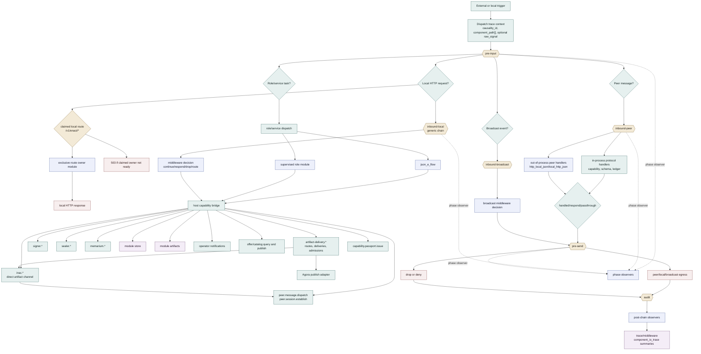

# Middleware

Based on:

- `doc/project/40-proposals/019-supervised-local-http-json-middleware-executor.md`
- `doc/project/40-proposals/020-bundled-python-middleware-modules.md`
- `doc/project/40-proposals/027-middleware-peer-message-dispatch.md`
- `doc/project/40-proposals/036-memarium.md`
- `doc/project/40-proposals/042-inter-node-artifact-channel.md`
- `doc/project/40-proposals/044-host-owned-generic-module-store.md`
- `doc/project/40-proposals/045-sensorium-local-enaction-stratum.md`
- `doc/project/40-proposals/048-sensorium-os-connector-action-classes.md`
- `doc/project/40-proposals/049-json-e-middleware-transformer-executor.md`
- `doc/project/40-proposals/053-raw-signal-access.md`
- `doc/project/50-requirements/requirements-010-middleware-executor.md`
- `doc/project/50-requirements/requirements-011-dator-arca-contracts.md`
- `doc/project/60-solutions/013-raw-signal-access/013-raw-signal-access.md`
- `doc/project/60-solutions/015-host-owned-module-store/015-host-owned-module-store.md`
- `doc/project/60-solutions/016-bounded-local-server-runtime/016-bounded-local-server-runtime.md`
- `node/middleware/README.md`

Related schemas:

- `workflow-envelope`
- `middleware-decision`
- `middleware-init`
- `middleware-module-report`
- `local-input-invoke.v1`
- `peer-message-invoke.v1`
- `service-dispatch-request`
- `service-dispatch-response`
- `service-offer-publish-request`
- `participant-service-offer-publish-request`
- `catalog-local-query-request`
- `peer-message-dispatch-request`
- `peer-session-establish-request`
- `artifact-read-request`
- `artifact-write-request`
- `notify-emit-request`
- `capability-passport-issue-request`

## Status

Implemented MVP, with active extension points.

## Purpose

Middleware is the Node extension-host layer. It lets a local daemon attach
operator-owned, bundled, in-process, declarative, or supervised behavior without
turning protocol truth, storage guarantees, or host authority into module
folklore.

Middleware is not one fixed web-style interceptor stack. It is a hosting fabric
with several explicit hook surfaces:

- transport lifecycle hooks,
- claimed local routes,
- peer message dispatch,
- broadcast hooks,
- role and service dispatch,
- host capability calls,
- observer/audit surfaces,
- host-owned trace and raw-signal preservation.

The host owns lifecycle, dispatch, validation, capability gates, and failure
semantics. Middleware contributes behavior through declared input chains,
claimed routes, executor configuration, module reports, and explicit host
capability calls.

## Scope

This solution defines the common middleware model used by Node-attached
extension mechanisms.

It includes:

- input chain names and hook meaning,
- executor classes,
- module init/report semantics,
- host-owned lifecycle and readiness,
- claimed local route dispatch,
- peer-message and broadcast dispatch,
- observer/audit hooks,
- host capability bridge usage,
- module-local durability through the host-owned module store,
- raw signal and component path trace semantics,
- operator UI extension expectations.

It does not define:

- concrete Python or Rust module internals,
- one global ordering for every possible module,
- public federation trust semantics,
- capability passport semantics themselves,
- Memarium, Sensorium, Dator, Arca, or Agora internals beyond their middleware
  attachment points.

## Model

An Orbiplex middleware module is a hosted extension participant.

It may be:

- an in-process Rust handler compiled into the daemon,
- a declarative `json_e` or `json_e_flow` transformer,
- a bounded command/stdio executor,
- an unmanaged local HTTP JSON endpoint,
- a supervised local HTTP JSON service,
- a bundled module distributed with Node,
- an operator-installed module package with UI assets and route claims.

The daemon sees every variant through host-owned contracts:

- init/report,
- input-chain registration,
- invoke envelope,
- response/decision validation,
- host capability grant,
- trace and audit event.

The preferred design rule is: use the least powerful executor that can express
the behavior. A JSON transformation should not become a supervised service only
because it is convenient. A long-lived connector should not become an in-process
core handler only because that is faster to write.

Domain organs may use middleware modules without turning those modules into
organ-specific plugins. Sensorium is the reference case: `sensorium-core` is the
Sensorium mediator/organ boundary, while `sensorium-os` is a separate connector
middleware module with its own action catalog. A connector action is not a
middleware module; it is an operation declared by a connector and mediated by
the organ's public capability surface.

JSON-e Flow uses different vocabulary. The `json_e_flow` engine is an executor
backend; each concrete flow configuration is treated as one operational
middleware component. It is not a Sensorium-like organ and it does not mediate a
family of connectors.

The same distinction applies to pure `json_e`. `json_e` and `json_e_flow` are
mechanisms; the registered definition is the middleware component. A flow or
template config is therefore a thin middleware instance with its own identity,
bindings, limits, trace surface, operator status, and lifecycle, even when the
code executing it is the shared daemon-hosted JSON-e executor.

## Package And Config Files

Layered config directories and signed middleware package artifacts ignore
generated/editor entries before parsing or hashing:

- names starting with `.`, `~`, or `__`,
- names ending with `~`,
- files ending in `.bak`, `.temp`, `.tmp`, `.cache`, or `.pyc`,
- directories named `tmp`, starting with `_tmp`, or starting with `__`.

This is part of the package-signature contract. Runtime by-products such as
Python `__pycache__/*.pyc` files, editor backups, and scratch trees do not
change the semantic package artifact. Real package/config files remain inside
the signed surface and still make the sidecar stale when changed.

### Standard Files And Directories

The middleware host uses two separate trees under a node data directory. They
must not be treated as interchangeable.

```text
<data-dir>/
  control/
    middleware-last-settings.json
  middleware/
    <module-id>/
      config/
      data/
      bind
      pid
      authtok
  middleware-packages/
    <package-id>/
      middleware.package.json
      config/
      ui/
      ui-op/
      actions/
      lib/
      .signatures/
```

`<data-dir>/control/middleware-last-settings.json` is host-generated local
control state, not middleware package material and not an operator-owned module
configuration fragment. It may carry minimal UI-controlled runtime toggles such
as `enabled`, and it may suppress runtime activation, but it must not replace or
block materialization of package/factory `50-<module>.json` config fragments.

`<data-dir>/middleware/<module-id>/` is the node-owned active runtime home for
one concrete module instance. It is writable by the host and, where explicitly
granted, by the module.

- `config/` contains active local configuration for that module instance:
  operator-edited fragments, generated active config, detached signature
  sidecars, and other node-owned configuration artifacts. It is the right place
  for configuration that changes because this node's operator changed runtime
  policy.
- `data/` contains module-owned durable runtime state, caches, local databases,
  offer stores, checkpoints, or projections.
- `bind` records the current local endpoint for supervised local HTTP services.
- `pid` records the currently supervised process id when a module is running as
  a child process.
- `authtok` and similarly named token files are host-owned local credentials.
  They are runtime material, not package content.

`<data-dir>/middleware-packages/<package-id>/` is an installed package artifact.
It is conceptually read-only after install, except for package upgrade,
reinstall, or detached signature writes under `.signatures/`.

- `middleware.package.json` is the package manifest and declares package
  identity, contributed modules, UI surfaces, and config fragments.
- `config/` contains package-shipped declarative config fragments. These are
  factory/package fragments, not mutable runtime config. They are included in
  the package hash/signature surface. Changing them means the package artifact
  changed and must make the package sidecar stale.
- `ui/` contains host-rendered HTML(X) fragments and static assets consumed by
  Node UI.
- `ui-op/` contains operator-surface declarations, examples, notes, and
  metadata that a live module may mirror through `middleware-module-report`.
- `actions/` contains package-shipped scripts or action assets, when the
  package exists to extend an executor such as Sensorium OS.
- `lib/` contains package-shipped helper libraries. A supervised module may
  prefer host-provided libraries when the host exposes them, but vendored
  helpers remain package content.
- `.signatures/` contains detached host/operator signatures for the package
  artifact. Signature files are excluded from the signed package hash so the act
  of signing does not mutate the artifact being signed.

The boundary is deliberately strict:

- package `config/` is source material for activation and merge;
- runtime `middleware/<module-id>/config/` is active node configuration;
- effective runtime config is a projection assembled by the daemon and should
  not be written back into package config fragments;
- operator-managed sidecars authorizing effective configuration live in the
  active runtime configuration area, not in the package-shipped config tree.

## Hook And Dispatch Map

This diagram is the middleware analogue of a netfilter hook map. It does not
show one mandatory flow. It shows the legal hook points and the places where a
message may be handled, transformed, observed, forwarded, or routed into a host
capability.



## Input Chains

Middleware modules register interest through transport-defined input chains.
The known chain names are:

| Chain | Meaning | Typical use |
|---|---|---|
| `pre-input` | First host-owned pass before the request enters a concrete dispatch family. | Local policy, redaction, normalization, raw-signal preservation. |
| `inbound-local` | Local HTTP request dispatch, including `/v1/enact/*` claimed routes and generic local request hooks. | Operator/local app extension surfaces. |
| `inbound-peer` | Peer message dispatch after network/session decoding. | Capability presentation, offer catalog, artifact channel, peer workflow messages. |
| `inbound-broadcast` | Broadcast event hook. | Broadcast moderation, annotation, local policy. |
| `pre-send` | Last mutation/decision point before peer/local/broadcast egress. | Response shaping, metadata, deny/drop. |
| `audit` | Post-dispatch audit surface retained for compatibility. | Audit sinks and legacy observers. |

New consumers should prefer phase observers and post-chain observers for
visibility. Dispatch handlers may short-circuit; observers are meant to see
what happened even when a handler claimed the message.

## Executor Classes

| Executor class | Power level | Host contract |
|---|---:|---|
| in-process handler | High, host-trusted | Rust trait object, no HTTP serialization. |
| `json_e` | Low | Pure JSON transformation, host-validated output. |
| `json_e_flow` | Low/medium | JSON-e renders step inputs; host executes declared effects. |
| `nse_rhai` | Medium | In-process scripting for bounded policy logic. |
| `command_stdio` | Medium/high | One-shot command process with bounded input/output. |
| `local_http_json` | High | Unmanaged loopback HTTP adapter. |
| `http_local_json` | High | Supervised loopback HTTP service with readiness, restart, init/report, and module lifecycle. |

The executor class is not the authority boundary by itself. Authority comes
from host-owned grants: module authtok, capability passport, local config,
dispatch gate, schema validation, timeout, size limits, and audit policy.

## Module Init And Report

Supervised and attachable modules report themselves to the daemon after
readiness. The report is the host's local registry input.

The report may declare:

- module identity and description,
- module role,
- input chain subscriptions,
- local route claims,
- host capability handler registrations,
- workflow-kind handlers,
- service types handled,
- published offer ids,
- raw signal access requirements,
- operator UI route/template metadata.

The report grants nothing by itself. It describes a module. Actual authority is
granted through local config, module authtok binding, capability passports, and
host-owned policy.

## Claimed Local Routes

`inbound-local` supports exclusive route ownership for local HTTP paths.

Rules:

- relative route claims resolve under `/v1/enact/`,
- absolute claims must remain under `/v1/enact/`,
- only one ready module may own a `(METHOD, path)` pair,
- a known claimed route whose owner is not ready returns `503`,
- local HTTP still receives `pre-input` before the claimed owner sees the
  request.

This gives modules UI/API extension points without making the daemon know the
module's domain-specific routes.

## Host Capabilities

Middleware does not receive ambient host power. Effectful operations cross the
host capability bridge.

Common surfaces include:

- signer and shared-secret operations,
- sealer operations,
- Memarium read/write/index/cache,
- module store records,
- module artifact read/write,
- operator notifications,
- offer catalog query/publish,
- peer message dispatch and peer session establishment,
- capability passport issue/presentation support,
- Sensorium directive/action invocation through Sensorium-owned surfaces.

The host may gate these calls through module authtok, caller binding, capability
passports, revocation freshness, local allowlists, timeout, and audit sinks.

## Raw Signal And Trace

Every middleware passage has a host-owned trace context:

- `causality_id`,
- `component_path[]`,
- current payload,
- optional preserved `raw_signal`,
- optional `component_io_trace[]`.

`component_path[]` is always host-owned and append-only. Raw signal and full
component I/O trace are preserved only when configured by a flow/module that may
need them. Preservation and exposure are separate:

- the host may preserve raw context internally,
- only a middleware that declared and was allowed to access it receives it in
  the projected payload,
- final results do not leak raw context by default.

See `doc/project/60-solutions/013-raw-signal-access/013-raw-signal-access.md`.

## Operator UI Extensions

Middleware modules, especially non-native modules, may provide operator-facing
UI fragments and route registrations. The built-in Node UI should not need
domain knowledge for every future module.

The host owns:

- package discovery,
- route mounting,
- template/static asset boundaries,
- auth and operator session context,
- collision handling,
- readiness/health display.

The module owns:

- UI intent,
- labels,
- templates/assets,
- module-specific operator workflows.

## Failure Semantics

Failure policy is host-defined and hook-specific.

Known classes:

- fail closed: block operation,
- fail open: record and continue,
- fallback: execute a host-defined safe default,
- retryable unavailable: surface `503` where local dependency freshness or
  readiness is the problem,
- deny/drop: explicit policy decision.

Middleware may report an error, but it does not decide final system semantics
outside the contract of the hook it is attached to.

## Out Of Scope

- Treating module reports as authority grants.
- Letting modules mutate host-owned trace fields directly.
- Public federation trust decisions for module packages.
- Durable storage of raw signal by default.
- One global order for all modules across all hook families.
- Replacing capability passports, caller binding, or dispatch gates.

## Related Capability Data

- `019-middleware-caps.edn`
