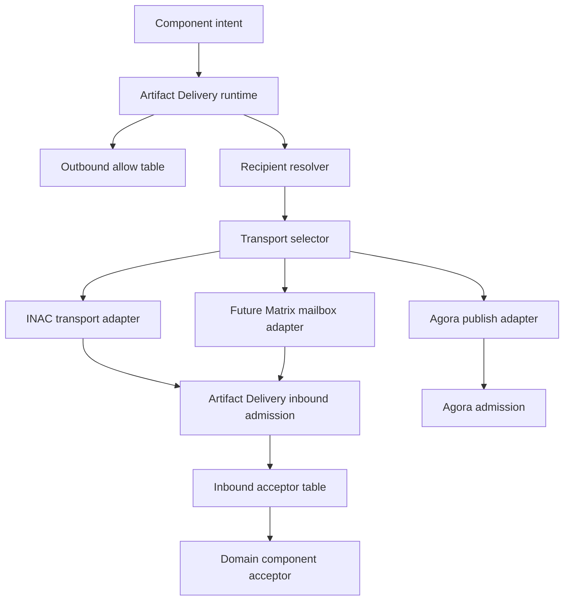

# Artifact Delivery

`Artifact Delivery` is the host-owned delivery and admission plane for moving
schema-bound artifacts between Orbiplex components, nodes, and public/federated
substrates without forcing every component to own transport connections or
interpret peer topology.

Status: `partial`

Date: `2026-05-08`

## Executive Summary

Artifact Delivery separates a component's intent from the concrete transport used
to satisfy that intent.

A component should be able to say:

```text
deliver this artifact envelope under delivery plan P
```

The host-owned Artifact Delivery runtime then performs:

```text
outbound authorization
  -> recipient resolution
  -> transport selection
  -> transport execution
  -> inbound admission
  -> exactly one domain acceptor
```

INAC becomes the private/direct node-to-node transport adapter inside this plane,
not the top-level abstraction. Agora remains the public/federated record
substrate. Middleware and node-attached components can opt into Artifact Delivery
through explicit inbound acceptor and outbound send declarations, visible to the
operator as data. The delivery plan may contain a single recipient selector,
multiple destinations executed in parallel, or staged fallback routes such as
`node -> on failure -> agora`.

The key decision is strict: inbound artifact admission is single-owner, not a
middleware chain. A given artifact kind has at most one authoritative acceptor.
If a domain needs fan-out, it must do so behind one explicit acceptor that owns
that domain semantics.

## Context and Problem Statement

The Inter-Node Artifact Channel (INAC) solution defines a direct artifact transfer
surface between authenticated nodes. During design review, a sharper separation
emerged:

- INAC should own private/direct node-to-node artifact transport.
- A higher layer should own component-facing delivery intent, recipient resolution,
  outbound permission, operator-visible routing, and inbound admission dispatch.
- Components must not each create their own peer listeners, Matrix rooms, retry
  loops, or transport-specific connection managers.
- Existing middleware `input_chains` are useful precedent for declarative
  runtime registration, but their chain semantics are too broad for artifact
  admission.

Without this layer, every component that needs inter-node artifact movement would
need to know whether to call INAC, Agora, Seed Directory, peer-message dispatch,
or a future Matrix mailbox adapter. That would duplicate transport logic and
make policy invisible to the operator.

With this layer, components request artifact delivery through one host-owned
interface, and the host keeps transport, policy, and admission routing coherent.

Current implementation status:

- `node/artifact-delivery-core` owns pure envelope validation, route expansion,
  recipient resolution for the MVP selector set, outbound authorization,
  deterministic delivery ids, target deduplication, and failure classes.
  Startup/config validation now also rejects duplicate route/default/group ids,
  unknown outbound route refs, recursive or unresolved configured defaults,
  nested groups, empty groups, and invalid route plans before the first
  delivery request is accepted.
- `node/artifact-delivery` owns the host runtime, exact transport adapter
  selection by resolved `adapter_scheme`, stage/target outcomes, idempotent
  retry by deterministic delivery id, and a SQLite delivery ledger at
  `<node-data-dir>/storage/artifact-delivery.sqlite`.
  The SQLite ledger uses explicit `user_version` migrations, `busy_timeout`,
  `foreign_keys`, and WAL-oriented pragmas; idempotent retry preserves the
  original submission timestamp.
- The daemon exposes `artifact.delivery.send`,
  `GET /v1/artifact-delivery/routes`,
  `GET /v1/artifact-delivery/deliveries`, and per-delivery lookup.
- Node UI exposes `/admin/artifact-delivery` as an operator view over routes,
  adapters, config diagnostics, and recent deliveries.
- The daemon registers the `agora-default` publish adapter. It accepts
  byte-identical `agora-record.v1` artifacts and submits them to the configured
  Agora HTTP endpoint. That endpoint may be a local supervised `agora-service`
  or a remote/thin-node relay endpoint configured in the adapter. Artifact
  Delivery must not require every publishing node to run a local Agora service.
- `agora-default` does not sign records. Components that need host custody use a
  separate host capability such as `agora.record.sign` first, then pass the
  already signed `agora-record.v1` through Artifact Delivery.
  Story-005's local acceptance profile is a narrow exception for repeatable
  laptop smoke tests: public Whisper candidates may be signed by a deterministic
  nym fixture only when the middleware is started with an explicit acceptance
  mode guard. That fixture certificate is topic-scoped and short-lived, and is
  not a production signing path.
- The daemon also has an `inac-direct` adapter. Local targets use the local
  `InacRuntime` short-circuit; remote targets use the peer supervisor's
  authenticated WSS peer-message session with `msg = "inac.v1"`. Matrix mailbox
  transport remains a later INAC transport, not part of the first remote path.
  Remote WSS inbound `offer`/`push` frames are fail-closed by default and must
  match `artifact_delivery_adapters.inac_peer_transport.inbound_allowed_peers`
  before they reach Artifact Delivery admission. A configured-but-unavailable
  peer session is retryable; a disabled peer transport is a permanent delivery
  configuration failure.
- The local `inac-direct` adapter is governed by Artifact Delivery outbound
  allowlists when it is reached through `artifact.delivery.send`. Direct
  component calls to INAC host capabilities such as `inac.offer`,
  `inac.request`, or `inac.push` are governed by the separate INAC outbound
  allow gate. These gates are intentionally distinct until a shared policy
  registry is proven necessary.
- The runtime has the first inbound acceptor registry with single-owner conflict
  detection for `(artifact schema, content type)` classes, deterministic
  inbound admission ids, receiver-local admission/refusal ledger, and
  operator-visible admission status APIs. Inline inbound artifacts are checked
  for `size/bytes` and non-empty `sha256:*` byte identity before an acceptor is
  invoked. Exact content-type acceptors may coexist with one wildcard acceptor
  for the same schema; exact matches win and the wildcard remains the fallback.
  The daemon now has concrete host/component acceptor adapters for supervised
  HTTP middleware, in-process `inac.push`, and explicitly configured pure
  JSON-e Flow acceptors, plus `POST /v1/artifact-delivery/admissions` as the
  shared inbound admission path. Remote INAC WSS peer messages feed this same
  admission path on the receiver.
- Current production adapters can resolve referenced payloads through an
  explicit resolver registry. The initial production resolver is
  `artifact-store:`, rooted at `<node-data-dir>/storage/artifact-store`; it
  canonicalizes paths, rejects symlink/path escapes, limits relative ref suffix
  length, opens without following final symlinks on Unix, caps size, and
  verifies the declared `sha256:` digest before invoking a transport adapter or
  acceptor. Small resolved payloads remain inline; larger local/resolved
  payloads become file-backed values so stream-capable adapters can avoid
  materializing one large JSON body.
  The daemon also registers separate public-space Memarium resolver schemes:
  `memarium-public-entry:<entry-id>` resolves to the entry payload body and
  `memarium-public-fact:<fact-id>` resolves to the full fact, both as canonical
  JSON with size and digest verification. Scoped Memarium resolver schemes
  `memarium-entry:<space>:<entry-id>` and `memarium-fact:<space>:<fact-id>`
  are also available for spaces such as `personal`, `community`, `public`, and
  `crisis`, but they require outbound component context and reuse the host's
  `memarium.read` passport gate before reading. `agora-record:<record-id>` is
  available as an explicit opt-in resolver: it fetches the record from the
  configured Agora endpoint, rejects declared or advertised response sizes above
  the resolver limit, and still treats the envelope digest as the source of
  truth. Other schemes such as `inac-peer-artifact:`, `http:`, or `file:` are
  not implicitly enabled.
- The runtime records, validates, and enforces the mechanical subset of
  `policy`: route/selector allowlists, fan-out and byte caps, delivery timeout,
  retry budget, idempotency, and the privacy-vs-transport invariant that
  `privacy = private | private-direct` can use only adapter schemes explicitly
  reviewed as private-safe. The initial private-safe set is `inac-direct`;
  public/federated or merely unreviewed adapters fail closed. Domain privacy,
  retention, revocation freshness, and classification semantics remain owned by
  adapters or domain acceptors and must fail closed if unsupported.
- Story-005 uses both sides of this path: public candidates go through
  `AD -> agora-default`, while private/direct candidates are signed as
  byte-identical `agora-record.v1` artifacts and transported through
  `AD -> inac-direct` to the configured peer. A private/direct record is not a
  public Agora publication. The Story-005 smoke pre-warms the direct A -> B peer
  session with the host-owned `peer.session.establish` capability and gives the
  private AD route a longer timeout than public Agora publication, because
  private/direct delivery may have to wait for a WSS peer session.
- `capability-many`, `participant`, `org`, and `routing-subject` selectors may
  carry `max/nodes` to bound fan-out at resolution time before the route-level
  target cap is enforced. Participant and routing-subject resolution is
  host-composed through Seed Directory projections and has a daemon-side TTL
  cache; `org` resolution is fail-closed through an explicit host-composed
  resolver that currently maps configured org custodians to participant node
  candidates. The core crate only sees lookup traits. Public routing-subject
  lookup only returns `public-unlinked` bindings. Other disclosure modes are
  stored facts, not enumerable public routing results until a separate
  authorized presentation path exists.
- Discovery-backed direct delivery now has a transport evidence bridge for
  node endpoints. When Seed Directory can provide `node-address-attestation.v1`
  for a resolved participant or routing-subject node, the daemon records the
  selected `endpoint/certificate` fingerprint and advisory route id in the peer
  supervisor's endpoint evidence companion. The subsequent WSS dial carries the
  fingerprint into `DialCandidate.expected_tls_certificate_sha256` and the
  advisory route id into the TLS CN consistency check; both fail closed on
  mismatch before INAC or Artifact Delivery payload exchange. For
  `routing-subject` selectors, the daemon additionally requires the attested
  endpoint certificate advisory route id to equal the requested
  `routing:did:key:...` subject before producing a direct target. Advisory
  `route:` ids must be non-empty, and delegated `routing:did:key:...` advisory
  ids are protocol-validated as Ed25519 did:key material before endpoint
  evidence is accepted. This bridge
  keeps transport evidence in daemon composition; Artifact Delivery core
  continues to see only resolved targets and route policy.
- Discovery and routing freshness are governed by
  `peer_discovery.freshness_policy`. Deployment-class defaults encode the
  current public profile recommendation: endpoint advertisements are short-lived
  reachability candidates, endpoint attestations are short-to-medium evidence,
  service CA material and routing bindings live longer, and resolver cache TTLs
  remain short.
- For direct subject-node delivery, endpoint evidence is not merely diagnostic.
  A resolved subject node is promoted to a concrete direct target only when the
  Seed Directory attestation provides usable `endpoint/certificate` evidence for
  the selected endpoint. `fresh` evidence can be used immediately; `usable`
  evidence still carries a certificate pin but may require a fresh probe or peer
  handshake before sensitive payload exchange. Stale or dead evidence is not
  used for direct/private delivery.
- Service CA material follows a separate trust-policy path. The daemon exposes
  `service_ca_trust_policy` and an operator evaluation endpoint for
  `service-ca-material.v1`; cryptographic signature verification must succeed
  before local policy evaluation is meaningful, and accepting a candidate under
  local policy does not automatically install it as a runtime trust root.

The implementation is still `partial` because Matrix mailbox transport, raw
binary-frame optimization, `inac-peer-artifact:` peer referenced payload fetch,
configurable custody target-space policy, and broader production hardening
remain later layers. INAC authorization/invitations, `agora-record:` payload
resolution, public/scoped Memarium referenced payload resolution, and WSS stream
chunks above the inline ceiling are now implemented.
The MVP also includes a P055-style
deferred submit mode, a manual recovery pass, and a daemon background recovery
worker enabled by default:
`artifact.delivery.send?mode=deferred` persists an accepted delivery and returns
`deferred-operation.v1` with a stable `operation/id`, `expires_at`,
`audit/outcome-ref`, and a `status_href` that resolves to canonical
`deferred-operation-status.v1`. `POST /v1/artifact-delivery/recover` retries
recoverable ledger records, preserves previous attempts in `retry/history`, and
returns schema-gated `artifact-delivery-recovery.v1`. The background worker is
host-owned, has configurable interval/batch/pass-deadline limits, shuts down
cooperatively with the daemon, and is visible in the Artifact Delivery operator
status. If a daemon exits while a delivery is `running`, the SQLite ledger
marks that interrupted record as `failed-retryable` on the next open; normal
recovery still only executes `accepted` and `failed-retryable` records, so live
in-process streams are not duplicated.

The daemon-level knobs are intentionally small:

- `artifact_delivery_recovery.enabled` defaults to `true`;
- `artifact_delivery_recovery.interval_ms`, `batch_limit`, and
  `pass_deadline_ms` bound automatic recovery work;
- `artifact_delivery_acceptors.http_admission_allowed_source_adapters` is the
  control-plane HTTP admission source allowlist. Empty means deny-all for
  `POST /v1/artifact-delivery/admissions`; in-process transport adapters such
  as the WSS INAC peer handler may still call the runtime admission path
  directly after their own transport policy gates;
- `artifact_delivery_acceptors.supervised_http` declares loopback HTTP
  middleware acceptors with `component_id`, `artifact_schema`,
  optional `content_type`, `invoke_path`, request timeout, and response size
  limit. The referenced component must exist in the daemon middleware config at
  startup;
- `artifact_delivery_acceptors.in_process` declares daemon-composed acceptors;
  the MVP supports `invoke = "inac.push"`.
- `artifact_delivery_acceptors.json_e_flow` declares pure JSON-e Flow inbound
  acceptors. These flows are compiled once at daemon startup, must contain a
  `respond` step that yields an `InboundAdmissionResult`, and cannot declare host
  capability calls.
- `artifact_delivery_adapters.inac_peer_transport.inbound_allowed_peers` is the
  receiver-side remote WSS INAC allowlist. Empty means deny-all; this prevents
  ambient authority until full invitation/passport authorization is implemented.

## Proposed Model / Decision

Artifact Delivery is a node-attached host runtime composed by the daemon or host.
It is not a separate public protocol and not a workflow engine.

Its responsibilities are:

1. Accept component delivery requests.
2. Authorize outbound artifact schemas per component.
3. Resolve recipient selectors into concrete delivery targets.
4. Choose and invoke a transport adapter.
5. Receive artifacts from transport adapters.
6. Authorize inbound delivery.
7. Dispatch to exactly one authoritative acceptor.
8. Expose route tables, conflicts, counters, and refusals to the operator.

### Layering



The diagram is intentionally asymmetric: publishing to Agora is not the same as
private delivery to a node. Agora is a public/federated record substrate with its
own admission rules. INAC and future mailbox transports feed Artifact Delivery
inbound admission for private/direct artifacts.

### Core Vocabulary

| Term | Meaning |
|---|---|
| Artifact | A byte-identical payload with a declared schema/kind, content type, digest, size, and optional envelope id. |
| Component | A supervised middleware, in-process node-attached component, or other host-composed actor allowed to request delivery or accept inbound artifacts. |
| Outbound allow | A config/report declaration that a component may send artifacts of selected schemas through Artifact Delivery. |
| Delivery envelope | One single-arity request object carrying component identity, artifact, delivery plan, and policy. |
| Recipient selector | A transport-neutral target expression such as node, participant, capability-first, configured-default, or agora-default. |
| Recipient resolver | Host-owned resolver that turns a recipient selector into one or more concrete transport targets. |
| Delivery plan | A declarative route plan containing one or more stages. Each stage has targets, execution mode, success policy, and optional fallback behavior. |
| Destination group | A locally configured set of recipient selectors, for example future user-defined groups such as friends, family, work, or synchronizers. |
| Transport adapter | A concrete delivery mechanism such as INAC over WSS, future INAC-over-Matrix mailbox, or Agora publish. |
| Inbound acceptor | Exactly one authoritative component endpoint for one artifact schema/content-type class. |
| Admission | The host-owned inbound gate that checks transport context, authorization, budgets, idempotency, and acceptor lookup before calling the acceptor. |

### Delivery Envelope Shape

The eventual wire/control shape should be formalized as a schema such as
`artifact-delivery-envelope.v1`. The important point is single arity: the
component submits one delivery envelope, and the `delivery/plan` inside that
envelope chooses the recipient mode, fan-out, and fallback behavior. The
component API should not grow separate methods for `send_to_node`,
`send_to_participant`, `send_to_capability`, `send_to_group`, or
`publish_to_agora`.

The host capability name is `artifact.delivery.send`.
The default call is synchronous from the caller's perspective: the host persists
the delivery and attempts transport execution before returning
`artifact-delivery-result.v1`. A caller that explicitly opts into
`?mode=deferred` receives canonical `deferred-operation.v1` instead; the
delivery can then be observed through
`/v1/artifact-delivery/deliveries/{delivery-id}/operation-status` and retried by
the host's recovery pass. `?mode=deferred` is the only canonical URI selector;
boolean aliases such as `?deferred=true` are not part of the contract. This
keeps P055 as the shared deferred response contract while Artifact Delivery
continues to own its own delivery ledger and transport semantics.

The solution-level shape is:

```json
{
  "schema": "artifact-delivery-envelope.v1",
  "component/id": "vendor.middleware",
  "artifact": {
    "schema": "vendor.foo.v1",
    "content/type": "application/json",
    "digest": "sha256:...",
    "size/bytes": 1234,
    "bytes/base64": "..."
  },
  "delivery/plan": {
    "mode": "sequence",
    "stages": [
      {
        "stage/id": "direct-node",
        "mode": "parallel",
        "targets": [
          {
            "selector/kind": "node",
            "node/id": "node:did:key:..."
          }
        ],
        "success/policy": "all"
      }
    ]
  },
  "policy": {
    "privacy": "private",
    "delivery": "at-least-once",
    "max/recipients": 1,
    "timeout/ms": 5000
  }
}
```

The artifact bytes remain domain-owned. Artifact Delivery may validate the outer
envelope, content type, size, digest, authorization, delivery plan, recipient
selectors, and delivery policy, but it must not reinterpret the domain payload.

For ergonomic MVP implementations, a single `recipient` selector may be accepted
as syntactic sugar and normalized immediately into a one-stage `delivery/plan`.
The normalized plan is the internal contract.

### Delivery Plans

The delivery plan is the place where multiple destinations and fallback live. It
is not a workflow engine: it only describes how to deliver the same artifact to
one or more transport targets.

A `delivery/plan` may either contain inline `stages` or a `route/ref` pointing to
a configured route. Route references are normalized to concrete stages before
authorization and execution.

Route ids are stable operator-facing names. A route may carry an internal
`route/version`; the delivery ledger records the expanded normalized plan so
historical runs remain auditable after a route changes.

Recommended plan vocabulary:

| Field | Meaning |
|---|---|
| `route/ref` | Optional configured route id. Mutually exclusive with inline `stages` in the request envelope. |
| `mode` | Plan execution mode. MVP: `sequence`. Later: `parallel` for independent top-level stages. |
| `stages` | Ordered stage list. In `sequence` mode, the next stage runs only if the current stage fails under its success policy. |
| `stage/id` | Stable local id for diagnostics and idempotency. |
| `targets` | One or more recipient selectors resolved by the host. |
| `success/policy` | Stage success rule: `all`, `any`, or `quorum`. |
| `quorum/min-success` | Required when `success/policy = quorum`. |
| `on/failure` | Optional next stage id for explicit fallback routing. If omitted in `sequence` mode, the next listed stage is the fallback. |

Validation and resolution failures are not delivery failures. A malformed
selector, such as `selector/kind = node` without `node/id`, fails before any
transport adapter is invoked. An unresolved configured default or group is also
a route/configuration error. Fallback applies only after a valid target has been
resolved and a delivery attempt fails under the stage's success policy.

Direct node with Agora fallback:

```json
{
  "mode": "sequence",
  "stages": [
    {
      "stage/id": "direct-node",
      "mode": "parallel",
      "targets": [
        {
          "selector/kind": "node",
          "node/id": "node:did:key:..."
        }
      ],
      "success/policy": "all",
      "on/failure": "public-agora"
    },
    {
      "stage/id": "public-agora",
      "mode": "parallel",
      "targets": [
        {
          "selector/kind": "agora-default"
        }
      ],
      "success/policy": "all"
    }
  ]
}
```

Send to an explicit node, a configured group, and Agora at once:

```json
{
  "mode": "sequence",
  "stages": [
    {
      "stage/id": "fanout",
      "mode": "parallel",
      "targets": [
        {
          "selector/kind": "node",
          "node/id": "node:did:key:..."
        },
        {
          "selector/kind": "group",
          "group/id": "friends"
        },
        {
          "selector/kind": "agora-default"
        }
      ],
      "success/policy": "all"
    }
  ]
}
```

Group fallback where the group succeeds if at least one member succeeds:

```json
{
  "mode": "sequence",
  "stages": [
    {
      "stage/id": "primary-node",
      "targets": [
        {
          "selector/kind": "node",
          "node/id": "node:did:key:..."
        }
      ],
      "success/policy": "all",
      "on/failure": "synchronizers"
    },
    {
      "stage/id": "synchronizers",
      "targets": [
        {
          "selector/kind": "group",
          "group/id": "synchronizers"
        }
      ],
      "success/policy": "any"
    }
  ]
}
```

Group expansion is policy-sensitive. A group selector resolves to zero or more
concrete recipient selectors, and the stage's `success/policy` decides whether
the expanded group fails on the first member failure (`all`), only when every
member fails (`any`), or when fewer than a configured number succeed (`quorum`).

Stages may mix explicit targets and configured targets. For example, one stage
may include explicit `node` selectors, a `configured-default`, a `group`, and a
future `capability-many` selector such as "up to two acceptable `agora.relay`
providers". All selectors are first resolved into concrete canonical targets,
then deduplicated, and only then counted against fan-out limits and executed.

Resolution order:

```text
inline targets / route ref
  -> resolve configured-default
  -> expand groups
  -> resolve capability selectors
  -> produce canonical concrete targets
  -> deduplicate by canonical target key
  -> enforce fan-out and target allow limits
  -> execute transport adapters
```

Example canonical target keys:

- `inac:node:<node-id>` for direct node delivery;
- `agora:default:<topic-or-route-id>` for the local default Agora route;
- `agora:node:<node-id>:<topic-or-route-id>` for a future explicit node-hosted
  Agora target;
- `matrix-mailbox:node:<node-id>` for a future mailbox transport.

This deduplication happens after full resolution because only then can the host
see that an explicit `node/id`, a configured default, a group member, and a
capability resolver result all point to the same concrete destination.

When multiple selectors resolve to the same concrete target, the retained target
keeps the first provenance in this priority order:

```text
explicit -> configured-default -> group -> capability/subject/org
```

This keeps operator diagnostics stable: the target is delivered once, but the UI
can still explain why that target was selected.

### Configured Routes and Groups

The preferred operational shape is config-driven. Components may request a named
route, and the host config decides whether that route delivers to one node,
several nodes, a future user-defined group, Agora, or staged fallback targets.

The config may also pin a named default to a concrete `node/id`. This does not
create a separate selector kind. The selector kind remains `node`; the configured
default simply resolves to a concrete node selector. This keeps the protocol
small while allowing an operator to say "the default private destination for
this component is exactly this node".

Example effective config fragment:

```json
{
  "artifact_delivery": {
    "defaults": [
      {
        "name": "primary-recipient-node",
        "selector": {
          "selector/kind": "node",
          "node/id": "node:did:key:..."
        }
      }
    ],
    "groups": [
      {
        "group/id": "synchronizers",
        "members": [
          {
            "selector/kind": "node",
            "node/id": "node:did:key:..."
          },
          {
            "selector/kind": "node",
            "node/id": "node:did:key:..."
          }
        ]
      }
    ],
    "routes": [
      {
        "route/id": "private-whisper-default",
        "plan": {
          "mode": "sequence",
          "stages": [
            {
              "stage/id": "direct-recipient",
              "targets": [
                {
                  "selector/kind": "configured-default",
                  "name": "primary-recipient-node"
                }
              ],
              "success/policy": "all",
              "on/failure": "synchronizer-group"
            },
            {
              "stage/id": "synchronizer-group",
              "targets": [
                {
                  "selector/kind": "group",
                  "group/id": "synchronizers"
                }
              ],
              "success/policy": "any"
            }
          ]
        }
      }
    ]
  }
}
```

The component-facing envelope can then stay small:

```json
{
  "schema": "artifact-delivery-envelope.v1",
  "component/id": "whisper-intake",
  "artifact": {
    "schema": "whisper-private-transfer.v1",
    "content/type": "application/json",
    "digest": "sha256:...",
    "size/bytes": 1234,
    "bytes/base64": "..."
  },
  "delivery/plan": {
    "route/ref": "private-whisper-default"
  }
}
```

Route references are still subject to outbound authorization. A component is not
allowed to smuggle a wider route through a named config entry unless its
outbound allow permits that route id, target selector classes, and fan-out
limits.

`recipient/selectors` in an outbound allow is an authorization allowlist, not a
routing plan and not a fallback order. For example, allowing both `node` and
`agora-default` means the component may use either selector when the
`delivery/plan` or configured `route/ref` explicitly selects it. It MUST NOT
mean "try node, and if `node/id` is missing, publish to Agora".

`configured-default` may also be used as one target inside a larger stage, not
only as a whole `route/ref`. This lets a sender combine explicit recipients with
operator-owned defaults without knowing whether the default expands to one node,
a group, or a local public/federated route:

```json
{
  "mode": "sequence",
  "stages": [
    {
      "stage/id": "fanout",
      "mode": "parallel",
      "targets": [
        {
          "selector/kind": "node",
          "node/id": "node:did:key:A"
        },
        {
          "selector/kind": "configured-default",
          "name": "private-whisper-default-targets"
        }
      ],
      "success/policy": "any"
    }
  ]
}
```

### Recipient Selectors

Implemented recipient selector kinds:

| Kind | Meaning | Likely transport |
|---|---|---|
| `node` | Send to one explicit node id. | INAC WSS |
| `configured-default` | Resolve a named local default from host config; the default may resolve to a concrete `node` selector. | Configured adapter |
| `agora-default` | Publish an Agora record to the default local/federated Agora route. | Agora publish |
| `capability-first` | Pick the first acceptable node advertising a capability. | Seed Directory + policy |
| `capability-many` | Pick up to N acceptable nodes advertising a capability. | Seed Directory + policy |
| `participant` | Resolve an explicitly public/operator participant to one or more reachable node ids under local policy. This is opt-in disclosure, not the privacy-preserving default. | Seed Directory + policy |
| `org` | Resolve an organization through an explicit host-composed org lookup. The current daemon resolver uses configured org custodians plus Seed Directory participant projections and fails closed when no evidence is available. | Org custody/policy + Seed Directory |
| `routing-subject` | Resolve a delegated, scoped contact/delivery identity to one or more reachable node ids without publishing the root participant id. | Seed Directory + policy |

Later recipient selector kinds:

| Kind | Meaning | Resolver |
|---|---|---|
| `group` | Resolve a user-defined local group such as friends, family, work, or synchronizers. | Host config + policy |
| `agora-node` | Publish to an explicitly selected node-hosted Agora endpoint. | Agora endpoint resolver |
| `matrix-mailbox-node` | Leave a private artifact control message in a node mailbox room. | Future Matrix mailbox adapter |

`capability-first` and `capability-many` were added after the initial MVP once
the route/default/group core was stable. They remain transport-neutral
selectors: Seed Directory resolves candidates, Artifact Delivery still performs
local outbound authorization and adapter selection.

The current capability selector filter is intentionally narrow: it supports
`target/node-ids` as a local allowlist/intersection filter. Issuer,
endorsement, and passport-profile filters belong to the next policy iteration;
until then the daemon accepts only Seed Directory entries whose capability
passport verifies against the configured sovereign authority set and whose
`node_id` / `capability_id` match the requested capability.

Participant and routing-subject resolution are deliberately split:

- `participant` is for explicit public/operator disclosure. The expected Seed
  Directory source is a verified `node-operator-binding.v1` bundle, where the
  participant issued the `node-primary-operator` passport and the node signed
  the corresponding acceptance.
- `routing-subject` is the privacy-preserving contact/delivery direction. It is
  a delegated, scoped identity that can be indexed by Seed Directory without
  publishing the root `participant:did:key`.
- Both selectors resolve to concrete node candidates before transport
  execution. Transport adapters still connect to `node-id`; neither
  participant nor nym becomes a transport-layer identity.
- Candidate ordering should use the local Seed Directory projection timestamp
  (`accepted_at` / `received_at`) descending, with `node_id` ascending as a
  deterministic tie-break. Remote-declared timestamps are input facts, not the
  ranking authority.

For nym-authored public posts, Artifact Delivery should treat contact as a
separate routing problem:

- the public post may carry an optional `contact/ref` or equivalent hint;
- that hint resolves to a `routing-subject`, not to the hidden root
  participant;
- AD then resolves `routing-subject -> node candidates`, encrypts or carries the
  already encrypted private reply according to the artifact contract, and
  delivers to the selected `node-id`;
- if the post has no contact hint, AD must not infer a route from the nym's
  author identity alone.

### Outbound Allow Table

Inbound support must not imply outbound authority. A component may accept
`vendor.foo.v1` and still be forbidden from sending it.

A component can send through Artifact Delivery only when an explicit outbound
allow exists:

```json
{
  "component/id": "vendor.middleware",
  "schema": "vendor.foo.v1",
  "recipient/selectors": ["node", "configured-default", "group", "agora-default"],
  "route/refs": ["private-whisper-default"],
  "target/node-ids": ["node:did:key:..."],
  "artifact/ref-schemes": ["memarium-public-entry"],
  "fanout/max-targets": 3,
  "fallback/max-stages": 2,
  "max/bytes": 262144,
  "requires/capability": "artifact-delivery.send"
}
```

If a component needs both input and output for the same schema, the schema must
appear in both the inbound acceptor table and outbound allow table.

Referenced payload schemes are also authorization surface. When an outbound
allow carries `artifact/ref-schemes`, Artifact Delivery checks the `artifact/ref`
prefix before invoking a resolver. This lets operators authorize
`memarium-public-entry` without also authorizing `memarium-public-fact`, even
though both resolvers are backed by the same Memarium runtime.

Missing transport-specific selector parameters are a fast failure with
diagnostics. A `node` selector without `node/id` should produce a malformed or
semantically invalid envelope response, while a `configured-default` that does
not resolve to a concrete target should produce a route/configuration conflict
or disabled route. Neither case may silently fall back to `agora-default`.

Policy fields are part of the audited envelope contract, but they are not a
license to assume behavior the selected route cannot provide. Artifact Delivery
enforces the mechanical policy subset it owns directly: selector/route
allowlists, fan-out, byte caps, timeouts, retry/idempotency, and private policy
adapter allowlisting. Other policy terms must either be proved at the selected
route/adapter or domain acceptor boundary, or the delivery must be rejected with
a clear diagnostic. Examples include retention class, revocation freshness,
classification semantics, and operator-review requirements.

### Inbound Acceptor Table

Inbound admission is single-owner:

```json
{
  "schema": "vendor.foo.v1",
  "content/types": ["application/json"],
  "component/id": "vendor.middleware",
  "target/kind": "supervised-http",
  "invoke/path": "/v1/artifacts/accept",
  "max/bytes": 262144
}
```

For in-process node-attached components the same declarative row should exist,
but its target is a host-composed function rather than a loopback HTTP path:

```json
{
  "schema": "memarium-blob.v1",
  "component/id": "memarium",
  "target/kind": "in-process",
  "invoke": "memarium.inac.accept"
}
```

This is deliberately data-first: the operator should be able to inspect that
`memarium-blob.v1` delivered through Artifact Delivery will be accepted by
Memarium even if Memarium is compiled into the host rather than running as a
supervised HTTP middleware.

Artifact Delivery is a host-owned runtime service composed by the daemon, not a
separate supervised middleware process. The communication path to the concrete
acceptor depends on component placement:

- in-process Rust components are invoked through host-composed trait objects or
  functions;
- supervised middleware is invoked through daemon/middleware-runtime loopback
  HTTP using the component endpoint, auth token, lifecycle state, and timeout
  known to the host;
- JSON-e or JSON-e Flow participate only behind an explicit host-composed
  acceptor declaration.

The `artifact-delivery` runtime crate owns the admission registry, idempotency,
ledger, and status model. It must not own loopback HTTP clients, supervised
process lifecycle, or middleware auth details; those belong to daemon
composition.

Before invoking an acceptor, the runtime validates the local artifact boundary:
schema and content type must be non-empty, the digest must be a non-empty
`sha256:*` content address, inline bytes must match both `size/bytes` and
digest, and non-inline artifacts must carry a non-empty `artifact/ref`. Inline
bytes and `artifact/ref` are mutually exclusive, so admission never has to infer
which payload location is authoritative. A byte-identity failure is recorded as
a receiver-local rejected admission and must not invoke the domain acceptor.

### Acceptor Response Contract

An acceptor returns a small admission result:

```json
{
  "status": "accepted",
  "artifact/ref": "memarium-public-entry:...",
  "idempotency/key": "sha256:..."
}
```

Allowed status values:

- `accepted`
- `already-present`
- `rejected`
- `retryable`

Artifact Delivery maps these to transport-level responses and operator-visible
counters. The acceptor owns any domain workflow it starts after admission.

JSON-e Flow may be an inbound acceptor only through an explicit declaration
bound to a concrete JSON-e Flow instance/template. A valid schema alone never
injects an artifact into JSON-e Flow. The operator-visible route table must show
which instance accepts a given schema/content-type class.

### Implementation Guidance

The implementation should be stratified into four layers:

1. **Pure core**: synchronous, side-effect-free DTOs, validation,
   normalization, recipient resolution traits, target deduplication, outbound
   authorization, dispatch-plan construction, and stable failure classes. This
   layer must not depend on networking, SQLite, the daemon, Tokio, Agora, INAC,
   Memarium, or the system clock.
2. **Runtime**: adapter registries, inbound acceptor registries, durable delivery
   and admission ledgers, status lookup, retries, deadlines, bounded stage
   execution, idempotency, and error classification. This layer exposes
   acceptor traits but remains transport- and lifecycle-agnostic.
3. **Transport/admission adapters**: narrow edge implementations for INAC, Agora
   publish, future Matrix mailbox delivery, supervised HTTP acceptors,
   in-process acceptors, and explicitly configured JSON-e Flow acceptors. These
   adapters live in daemon/middleware-runtime or domain integration crates, not
   inside the pure Artifact Delivery runtime crate when they require host
   lifecycle knowledge.
4. **Daemon composition**: effective config loading, module-report ingestion,
   readiness diagnostics, host capability exposure, operator APIs, and UI.

The pure core pipeline should be explicit:

```text
validate envelope
  -> expand route/default/group plan
  -> resolve targets
  -> deduplicate by canonical target key
  -> authorize outbound plan
  -> build canonical dispatch plan
```

Failure classes are part of the wire/ledger contract and should not be derived
from internal error strings. The initial stable set is:

- `envelope-malformed`
- `envelope-invalid`
- `route-unresolved`
- `admission-conflict`
- `kind-not-supported`
- `outbound-denied`
- `adapter-transient`
- `adapter-permanent`
- `stage-timeout`
- `admission-timeout`
- `ledger-error`

Transport adapters are selected by exact `adapter_scheme` from each resolved
target, not by a soft `can_deliver(target)` probe. An adapter receives one
`DispatchTarget` plus one shared immutable artifact reference. It must not see
the whole dispatch plan and must not decide fallback order.

Inline payload fan-out should avoid copying large byte arrays. A simple
`Arc<[u8]>`-style shared byte value is sufficient for the first implementation;
the protocol does not need a separate bytes abstraction just for fan-out.

The runtime must persist the accepted submission and canonical dispatch plan
before invoking the first transport adapter. The dispatch plan should be stored
as canonical JSON using the project-wide JCS profile. A deterministic
`delivery/id` should be computed from a domain-separated, length-framed tuple of
sender-local fields, such as component id, artifact digest, normalized delivery
plan digest, and idempotency key. The receiver must not treat this sender-local
`delivery/id` as its admission identity; inbound admission needs its own
receiver-local `admission/id` and idempotency key.

The durable ledger should live in its own SQLite file under the node data dir
and record at least:

- submissions and canonical expanded plans;
- per-stage and per-target outcomes;
- inbound admissions;
- route and acceptor conflicts;
- timestamps, deadlines, and retry counters.

SQLite setup should follow existing node storage practice: explicit migrations,
WAL where appropriate, busy timeout, foreign keys, and transaction boundaries
around state transitions.

Effective config validation should fail readiness for unknown route refs,
unresolved configured defaults, empty groups, recursive groups, invalid quorum,
missing adapter schemes, and conflicting inbound acceptors.

### Multiple Dispatch Rule

Multiple authoritative acceptors for the same schema/content-type class are not
allowed in the MVP.

Startup/readiness behavior:

- no acceptor: inbound request returns `kind-not-supported`;
- one acceptor: route is active;
- more than one acceptor: readiness conflict, route disabled until resolved.

If a domain genuinely needs fan-out, it should register one explicit router
acceptor. That router then owns the domain fan-out semantics after Artifact
Delivery admission.

### Relationship to Middleware `input_chains`

Artifact Delivery should reuse the useful parts of the module report idiom:

- component declares capabilities as data;
- declarations include invoke paths and limits;
- host compiles the effective route table at startup;
- conflicts are operator-visible before first request.

It should not reuse chain semantics. Artifact Delivery admission is not an
`input_chains` pass, not a fan-out, and not a general middleware pipeline.

Preferred naming:

```text
inbound_acceptors
outbound_allows
```

Avoid naming this surface `handles_artifact_kinds`, because `handles` suggests a
chain or general workflow. `acceptor` says this is an admission boundary.

### JSON-e and JSON-e Flow

JSON-e and JSON-e Flow are not automatic Artifact Delivery consumers.

They may participate only when explicitly configured as an acceptor target or
when a domain component uses them internally after accepting an artifact. A valid
JSON schema alone must never cause an artifact to be injected into JSON-e Flow.

Valid models:

```text
artifact schema X -> DomainComponent acceptor -> DomainComponent may run JSON-e Flow
```

or, explicitly:

```text
artifact schema X -> configured json-e-flow acceptor template T
```

The second model requires an operator-visible declaration and normal outbound or
inbound capability checks.

### Relationship to INAC

INAC is the private/direct transport adapter under Artifact Delivery.

It owns:

- WSS peer session use;
- future Matrix mailbox transport use;
- INAC control messages such as offer/request/push;
- session-scoped stream chunks when payloads exceed the inline ceiling;
- transport-level retries, peer budgets, and transport diagnostics.

It does not own:

- component-facing recipient selector semantics;
- capability-first or participant recipient resolution;
- outbound schema permissions;
- the global inbound acceptor table;
- domain workflow after an artifact is admitted.

The AD-to-INAC path and the direct INAC host capability path have separate
authorization gates in the current implementation. Artifact Delivery outbound
allowlists authorize components to use an AD route that happens to resolve to
`inac-direct`; INAC outbound allowlists authorize direct `inac.*` host
capability calls. This prevents a component that may use one surface from
implicitly gaining authority on the other.

### Relationship to Agora

Agora is not a private artifact courier. It is the durable public/federated record
substrate.

Artifact Delivery may route an outbound envelope to Agora only when the
recipient selector is explicitly Agora-shaped, for example `agora-default` or
`agora-node`, and the artifact is an acceptable Agora publication artifact. This
path goes through Agora's own publish/admission policy.

Do not silently replace a private node delivery request with an Agora publish.
For `privacy = private | private-direct`, Artifact Delivery denies every adapter
scheme except those explicitly marked private-safe by the host runtime. Today
that means `inac-direct`; new adapters are denied under private policy until
reviewed.

### Relationship to Seed Directory

Seed Directory is a recipient resolver input, not a transport.

Recipient selectors such as `capability-first` and `capability-many` may use Seed
Directory to find candidate nodes, but Artifact Delivery still owns the local
policy decision that selects a concrete target and transport.

`participant` and `routing-subject` selectors follow the same boundary.
Seed Directory provides projections such as public operator
`participant-id -> node candidates` and privacy-preserving
`routing-subject-id -> node candidates`, but AD remains responsible for outbound
authorization, route selection, deduplication, and adapter execution. The
privacy default is not to publish root `participant-id -> node-id`; that mapping
is reserved for explicit public/operator disclosure.

The daemon-side lookup treats remote Seed Directory responses as untrusted
input: response bodies are size-limited before JSON deserialization, entries are
verified against capability passport rules, and only matching `node_id` /
`capability_id` pairs are returned to AD.

Deferred lookup refinements are tracked in the implementation notes rather than
treated as current contract bugs: short negative caching for empty capability
results, endpoint-level retry/backoff, a shared blocking HTTP client, and
query-level result limits. These should be added only with explicit cache TTL,
diagnostic, and partial-result semantics.

### Relationship to Memarium

Memarium may be an inbound acceptor for `memarium-blob.v1` and a custody target
for domains that explicitly choose custody. Artifact Delivery must not decide on
its own to store arbitrary unknown artifacts in Memarium. Opaque storage is only
valid when the envelope kind itself is the contract, such as `memarium-blob.v1`,
or when a configured custody acceptor explicitly owns that policy.

## Must Implement

### Host-Owned Artifact Delivery Runtime

Based on:

- `doc/project/40-proposals/042-inter-node-artifact-channel.md`
- `doc/project/60-solutions/017-inter-node-artifact-channel/017-inter-node-artifact-channel.md`
- `doc/project/60-solutions/019-middleware/019-middleware.md`

Responsibilities:

- expose one component-facing send surface;
- expose `artifact.delivery.send` as the component-facing host capability;
- keep transport connections centralized in the host;
- compile route tables from factory config, effective config, in-process
  manifests, and middleware module reports;
- return delivery ids for accepted asynchronous deliveries and expose delivery
  status lookup;
- keep pure validation, normalization, recipient resolution, target
  deduplication, and outbound authorization in a synchronous side-effect-free
  core layer;
- persist accepted submissions before transport execution;
- expose route table and conflict state to the operator.

Status:

- `mvp-implemented`: the Node workspace now has
  `artifact-delivery-core`, `artifact-delivery`, JSON schemas, schema-gate
  coverage, daemon configuration, `artifact.delivery.send`, route/status
  operator APIs, deterministic delivery ids, in-memory test ledger,
  SQLite-backed runtime ledger, the Agora publish adapter, a local INAC direct
  short-circuit adapter, inbound acceptor registry conflict detection,
  receiver-local inbound admission ledger, admission idempotency, admission
  status APIs, bounded transport retry/deadline execution through
  `bounded-work-runtime`, P055 deferred submit, P055 operation-status endpoint,
  manual recovery pass with `retry/history` and `artifact-delivery-recovery.v1`,
  daemon background recovery enabled by default, supervised HTTP and in-process
  `inac.push` acceptor adapters, explicit pure JSON-e Flow acceptors,
  `artifact-store:` referenced payload resolution, remote INAC WSS peer
  transport feeding the shared `POST /v1/artifact-delivery/admissions` path,
  capability-first/many recipient resolution through the daemon's Seed Directory
  capability lookup, participant/routing-subject recipient resolution through
  Seed Directory projections, Story-005 public Whisper via `agora-default`,
  fail-closed org recipient resolution through configured org custodians plus
  Seed Directory participant projections, public and capability-gated scoped
  Memarium referenced payload resolution, `agora-record:<record-id>` referenced
  payload resolution with allowlist and digest validation, mechanical
  delivery-policy enforcement including private-to-Agora rejection,
  Story-005 private/direct Whisper via `inac-direct`, a full three-daemon Story-005 AD
  observability smoke that asserts A/B are thin Agora clients publishing to
  node C rather than running a local `agora-service`, large private/direct
  payload streaming over the existing WSS peer-message session, and regression
  tests. Matrix mailbox transport and a generic peer object-store resolver
  remain later layers. INAC WSS now provides invitation, generic `inac-push@v1`,
  and `memarium-custody@v1` passport authorization before AD inbound admission.
  The baseline `memarium-blob.v1` acceptor requires explicit
  `signature.key/public`, rejects plaintext custody, and records accepted
  custody facts in the local public Memarium space until a later custody-policy
  layer adds configurable target spaces.

### Outbound Authorization and Recipient Resolution

Based on:

- `doc/project/60-solutions/006-capability-binding/006-capability-binding.md`
- `doc/project/60-solutions/007-capability-advertisement/007-capability-advertisement.md`
- `doc/project/60-solutions/021-agora-authority/021-agora-authority.md`

Responsibilities:

- require explicit outbound schema declarations per component;
- normalize single-recipient envelopes into `delivery/plan`;
- resolve named route refs plus `node`, `configured-default`, and
  `agora-default` recipient selectors for the MVP;
- allow one stage to mix explicit targets, configured defaults, groups, and
  later capability resolver targets;
- deduplicate concrete targets after full resolution and before transport
  execution;
- treat selector allowlists as permissions, not fallback order;
- fail malformed or unresolved selector targets before transport execution;
- execute staged delivery plans with `all`, `any`, and `quorum` success
  policies;
- support configured fallback such as direct node first, then Agora or a
  configured group;
- authorize route refs, selector classes, concrete target node ids, fan-out
  limits, and fallback depth per component;
- keep route ids stable, carry route versions inside route definitions, and
  persist expanded normalized plans in the ledger;
- keep participant, org, and capability-based recipient resolution as later
  resolver adapters;
- deny valid-schema sends when the component lacks an outbound allow.

Status:

- `mvp-implemented`: explicit component/schema outbound allowlists, route refs,
  configured defaults, groups, `node`, `agora-default`, fan-out limits,
  fallback-depth limits, runtime stage target caps, deterministic dedupe,
  content digest validation, route-plan validation, and `all`/`any`/`quorum`
  stage evaluation are implemented in the pure core/runtime split.
  Participant/org/capability recipient selectors remain post-MVP resolver
  adapters.

### Single-Owner Inbound Admission

Based on:

- `doc/project/60-solutions/017-inter-node-artifact-channel/017-inter-node-artifact-channel.md`
- `doc/project/60-solutions/019-middleware/019-middleware.md`

Responsibilities:

- enforce at most one authoritative acceptor per schema/content-type class;
- fail readiness on conflicting acceptors;
- return `kind-not-supported` when no acceptor is available;
- persist receiver-local admission/refusal records with deterministic
  `admission/id` and idempotent replay behavior;
- declare supervised HTTP and in-process acceptors in the same effective
  route-table shape;
- call supervised HTTP, in-process, or explicitly configured JSON-e Flow
  acceptors through the same conceptual admission contract;
- require JSON-e Flow acceptors to be bound to explicit operator-visible
  instances/templates;
- record receiver-local admission ids separately from sender-local delivery ids.

Status:

- `mvp-foundation-implemented`: the runtime has an inbound acceptor trait,
  single-owner registry conflict detection, exact and wildcard content-type
  lookup, deterministic receiver-local `admission/id` generation, a persistent
  admission/refusal ledger, idempotent replay of already-recorded admissions,
  pre-acceptor inline byte-identity checks, route snapshots that expose
  registered acceptors, read APIs for recent admissions and admission detail,
  operator UI coverage, and a daemon-owned `POST
  /v1/artifact-delivery/admissions` ingress for explicitly allowlisted
  control-plane transport adapters. Concrete
  host/component acceptor adapters remain outside the pure runtime: the daemon
  currently composes supervised HTTP middleware acceptors, an in-process
  `inac.push` acceptor, and explicit pure JSON-e Flow acceptors, while the pure
  Artifact Delivery runtime still owns no loopback HTTP client, supervised
  process lifecycle, or middleware auth logic.

### Transport Adapter Registry

Based on:

- `doc/project/60-solutions/017-inter-node-artifact-channel/017-inter-node-artifact-channel.md`
- `doc/project/60-solutions/008-agora/008-agora.md`

Responsibilities:

- register INAC as the MVP private/direct node transport;
- register Agora publish as the MVP public/federated publication adapter;
- keep future Matrix mailbox support behind the same adapter boundary;
- select adapters by exact adapter scheme from resolved targets;
- pass only one dispatch target and one shared immutable artifact reference to
  each adapter, keeping fallback decisions in the runtime;
- ensure transport adapters feed inbound admission instead of owning their own
  domain-specific dispatch tables.

Status:

- `mvp-foundation-implemented`: the runtime has an exact adapter-scheme
  registry, conflict detection, route/status exposure, the production
  `agora-default` publish adapter, and an `inac-direct` adapter that uses a
  local short-circuit for local targets and authenticated WSS peer messages for
  remote direct-node targets. Remote WSS INAC push frames feed the shared
  Artifact Delivery inbound admission path. Matrix mailbox transport remains a
  later adapter.

## May Implement

### Capability-Based Recipient Resolver

Based on:

- `doc/project/40-proposals/025-seed-directory-as-capability-catalog.md`
- `doc/project/60-solutions/007-capability-advertisement/007-capability-advertisement.md`

Responsibilities:

- resolve `capability-first` and `capability-many` recipient selectors through
  Seed Directory and local policy;
- preserve revocation freshness and capability profile checks;
- expose candidate selection diagnostics.

Status:

- `implemented`: `artifact-delivery-core` owns the transport-neutral selector
  DTOs and `CapabilityNodeLookup` trait; the daemon composes a Seed
  Directory-backed lookup that reuses the existing capability discovery cache,
  verifies capability passports, applies local filters, and returns concrete
  node targets to Artifact Delivery. The blocking Seed Directory fetch path
  also enforces a bounded response body before deserialization.

### Subject-Based Recipient Resolver

Based on:

- `doc/project/20-memos/nym-layer-roadmap-and-revocable-anonymity.md`
- `doc/project/40-proposals/025-seed-directory-as-capability-catalog.md`

Responsibilities:

- resolve public/operator `participant` selectors only when the operator chose
  explicit disclosure, typically via a published `node-operator-binding.v1`;
- resolve `routing-subject` selectors as scoped contact/delivery
  identities without requiring root participant disclosure;
- support nym reply/contact flows where a public nym-authored artifact carries
  an optional contact hint that resolves to a routing subject;
- preserve the invariant that transport still routes to `node-id`, not `nym` or
  participant identity;
- expose ordering and privacy diagnostics to the operator.

Status:

- `implemented`: `artifact-delivery-core` owns `ParticipantNodeLookup`,
  `RoutingSubjectNodeLookup`, and subject-aware recipient resolution. The daemon
  composes those lookups with the same Seed Directory query path used for
  capability discovery. Seed Directory exposes `GET /participant/{participant-id}`
  from accepted `node-operator-binding.v1` entries and
  `GET /routing-subject/{routing-subject-id}` from accepted
  `routing-subject-binding.v1` entries. Both projections sort candidates by local
  accepted/received time descending and then by `node_id` for stable results.
  Participant and routing-subject selectors accept `max/nodes`; the daemon caches
  positive subject lookup results with the same short TTL class as capability
  lookup. Public routing-subject reads return only `public-unlinked` entries.

### Matrix Mailbox Transport Adapter

Based on:

- `doc/project/60-solutions/008-agora/008-agora.md`
- `doc/project/60-solutions/017-inter-node-artifact-channel/017-inter-node-artifact-channel.md`

Responsibilities:

- use deterministic node-mailbox room aliases for asynchronous artifact control
  messages;
- treat Matrix as transport only, never as trust source;
- support inline-only mailbox delivery first;
- feed the same Artifact Delivery inbound admission path used by INAC WSS.

Status:

- `optional`

### Shared Exclusive Route Registry Primitive

Based on:

- `doc/project/60-solutions/019-middleware/019-middleware.md`

Responsibilities:

- extract a small generic registry only after Artifact Delivery proves that the
  same exclusive route-table primitive is needed elsewhere;
- preserve simple domain-specific data shapes until reuse is real.

Status:

- `optional`

## Out of Scope

- Replacing INAC, Agora, Seed Directory, or Memarium.
- Becoming a general workflow engine.
- Running middleware-owned peer listeners or transport loops.
- Fan-out to multiple authoritative acceptors for one artifact kind.
- Treating valid schema as sufficient send authority.
- Silent opaque storage of unknown artifact kinds.
- Public enumeration of private/direct deliveries.
- Domain interpretation of accepted artifacts.

## Failure Modes and Mitigations

| Failure mode | Mitigation |
|---|---|
| Artifact Delivery becomes a second middleware chain | Enforce single authoritative acceptor per schema/content-type class. |
| Components bypass host policy by opening their own transports | Keep transports host-owned and grant components only a send capability. |
| Inbound support accidentally grants outbound authority | Maintain separate `inbound_acceptors` and `outbound_allows`. |
| A component smuggles a broad fan-out through a named route | Authorize route refs, selector classes, concrete target node ids, maximum targets, and maximum fallback stages per component. |
| Missing node target silently falls back to Agora | Treat missing transport-specific selector parameters as malformed or unresolved target errors; require an explicit `delivery/plan` stage for Agora fallback. |
| The same target is delivered twice because it appears both explicitly and through a default/group/capability result | Resolve all selectors to canonical target keys and deduplicate before fan-out limit enforcement and transport execution. |
| Group delivery semantics are ambiguous | Put `success/policy` on the stage after group expansion: `all`, `any`, or `quorum`. |
| Two modules claim the same artifact kind | Fail readiness and expose conflict diagnostics. |
| Agora is used as an accidental private delivery channel | Require explicit Agora-shaped recipient selectors and Agora publish policy. |
| Seed Directory lookup hides policy decisions | Keep Seed Directory as resolver input; local Artifact Delivery policy selects targets. |
| JSON-e Flow becomes an implicit generic artifact consumer | Allow JSON-e Flow only behind explicit acceptor declarations. |
| Early generic abstraction becomes too large | Start with Artifact Delivery-specific route tables; extract a generic primitive only after reuse is proven. |

## Resolved Implementation Decisions

1. The component-facing host capability is `artifact.delivery.send`.
2. Delivery may complete synchronously for fast plans, but the runtime has a
   ledger from the beginning and may return `202 accepted` for longer plans.
   The response carries a `delivery/id`, and the sender can query status by
   that id.
3. MVP group use is route-driven. Components should use `route/ref` for
   operator-owned group routes; inline groups can remain test-only or later
   surface area.
4. MVP user-defined groups are static local config groups only.
5. `agora-default` accepts already-formed `agora-record.v1` first. Host-side
   wrapping of arbitrary domain payloads is a later explicit adapter, not hidden
   behavior.
6. Concrete `target/node-ids` in outbound allows are optional. If present, they
   restrict the resolved concrete node targets.
7. Supervised middleware module reports may request outbound allows, but only
   effective host config can approve them.
8. JSON-e Flow can be an inbound acceptor only through explicit
   instance/template-bound acceptor configuration. The MVP in-process adapter is
   pure; flows with host capability calls are rejected at daemon startup.
9. Multiple adapters may support the same selector class, but adapter selection
   must be explicit in route config or deterministic by priority. The default
   direct `node` adapter is INAC/WSS; Matrix mailbox is a future explicit
   fallback stage.
10. Route refs are stable names; route versions live inside route definitions,
    and the ledger stores the expanded normalized plan used by each delivery.
11. Capability routing for `agora.relay` is post-MVP, but should be one of the
    first post-MVP resolver adapters. The MVP uses `agora-default` from local
    config.
12. The delivery ledger is required even for synchronous successes.
13. Missing transport-specific selector parameters, such as `node` without
    `node/id`, fail validation/resolution and never imply fallback to Agora.
14. In-process acceptors and supervised HTTP acceptors are declared in the same
    effective config/route table shape so operator visibility does not depend on
    runtime placement.

## Open Questions

1. Should observers/audit hooks exist separately from authoritative acceptors?

   Suggested default: not in the MVP. Add read-only observers only after the
   single-owner admission path is implemented and tested.

## Next Actions

1. Add invitation/passport authorization for INAC before widening private/direct
   delivery beyond explicit story/profile allowlists.
2. Add Matrix mailbox transport only if store-and-forward private delivery is
   required.
3. Add `inac-peer-artifact:` only when a concrete peer object-store/request
   lookup exists; until then it remains reserved and fail-closed.

## Related Capability Data

- `023-artifact-delivery-caps.edn`
