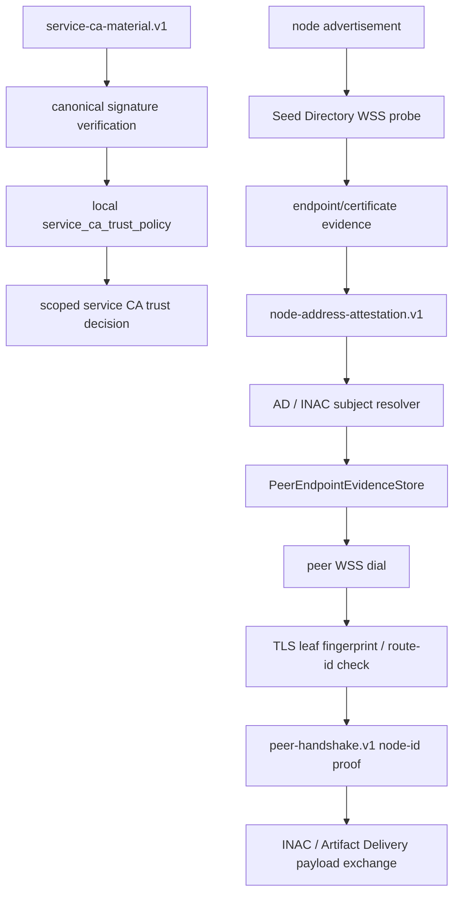

# TLS Trust Policy

`TLS Trust Policy` is the node-side transport trust layer for Orbiplex public
services, Seed Directory discovery, and node-to-node WSS/HTTP communication.
It keeps TLS endpoint verification, endpoint evidence, peer identity, and
capability authorization in separate strata.

Status: `mvp-ready`

Date: `2026-05-14`

Based on:

- `doc/project/40-proposals/056-orbiplex-tls-trust-policy.md`
- `doc/project/40-proposals/043-node-address-attestation-fallback.md`
- `doc/project/40-proposals/054-user-maintained-federated-seed-directory.md`
- `doc/project/60-solutions/017-inter-node-artifact-channel/017-inter-node-artifact-channel.md`
- `doc/project/60-solutions/023-artifact-delivery/023-artifact-delivery.md`
- `doc/project/60-solutions/031-seed-directory/031-seed-directory.md`
- `doc/schemas/service-ca-material.v1.schema.json`
- `doc/schemas/node-address-attestation.v1.schema.json`
- `node:network/src/lib.rs`
- `node:seed-directory/src/lib.rs`
- `node:daemon/src/peer_supervisor.rs`
- `node:service-ca-trust/src/lib.rs`

## Executive Summary

Orbiplex does not treat public WebPKI as the only possible trust root for all
node traffic, and it does not replace WebPKI with one all-powerful Orbiplex CA.
The implemented model is narrower:

```text
TLS/X.509 evidence     -> encrypted endpoint transport
node-address evidence  -> recent observation of endpoint material for a node
peer handshake         -> proof of node identity key possession
capability passports   -> authorization to provide or call host capabilities
local policy           -> operator-owned final acceptance decision
```

The current solution supports two concrete trust paths:

- **Service CA candidates** are described by `service-ca-material.v1`, persisted
  in the daemon Service CA trust store, evaluated against local
  `service_ca_trust_policy`, and installed only as scoped roots. A candidate is
  not a trust decision; it becomes usable only after signature verification,
  local policy acceptance, and explicit scoped installation.
- **Node endpoint evidence** is carried by `node-address-attestation.v1` as
  `endpoint/certificate` facts. The daemon can use this evidence to pin the
  observed TLS leaf certificate or SPKI for participant, org, routing-subject,
  and direct peer delivery resolution.

For node-generated listener certificates, the privacy-preserving default is to
use an opaque `route:` identifier in the TLS subject rather than the stable
`node:did:key:...`. The peer handshake remains the source of node identity.

The implemented boundary is explicit: public WebPKI can be used as carrier
compatibility for public HTTPS/WSS endpoints, but it is not the Orbiplex
authority layer. A publicly trusted certificate alone does not admit a Seed
Directory, establish federation membership, grant a service capability, or prove
node identity. Those decisions are made from Orbiplex-controlled material:
`federation-root.v1`, scoped service CA acceptance, endpoint evidence and pins,
peer handshakes, capability passports, and local operator policy. Private or
self-signed federation/service roots are valid when they are explicit, scoped,
accepted by local policy, and auditable.

## Context and Problem Statement

Orbiplex nodes are expected to run on laptops, home nodes, VPS instances,
local development profiles, and federation-operated services. A single TLS
trust policy cannot fit all of these surfaces:

- public Seed Directory or Agora endpoints need stable service trust;
- ordinary nodes need locally generated listener certificates;
- discovery and direct delivery need recent endpoint evidence, not just a
  self-declared address;
- local story profiles need repeatable certificate generation without raw byte
  arrays in config;
- diagnostic insecure modes must remain explicit and visible.

The failure mode to avoid is treating a TLS certificate as Orbiplex identity or
authority. TLS answers only a transport question:

```text
Did this encrypted connection satisfy the endpoint trust policy?
```

It does not answer whether the peer is the expected node, whether a service is
authorized, or whether a caller may invoke a capability.

## Proposed Model / Decision

### Trust Classes

The runtime distinguishes these trust classes conceptually:

| Trust class | Typical endpoint | Trust source |
| --- | --- | --- |
| `official-service` | Public Seed Directory, official Agora, bootstrap APIs | Orbiplex Public Service CA candidate, WebPKI if explicitly selected, or local pin |
| `node-endpoint` | INAC, Artifact Delivery, peer WSS/HTTP | Seed Directory endpoint evidence, local seed pin, and peer handshake |
| `local-dev` | Story profiles and acceptance setups | Data-dir generated local route CA and listener certificate |
| `diagnostic` | Operator debugging | Explicit insecure mode, never silent fallback |

Current code implements the important primitives but does not yet expose a full
generic `tls-trust-policy.v1` config schema. Effective behavior is currently
assembled through daemon peer-discovery config, root certificate sources,
Seed Directory endpoint evidence, and peer supervisor dial checks.

### Service CA Material

`service-ca-material.v1` describes a scoped trust-material candidate:

- CA id and service kind;
- usage scope, such as federation, Seed Directory id, and protocol set;
- X.509 material and digest;
- validity and rotation metadata;
- issuer authority;
- signature.

The invariant is:

```text
service-ca-material.v1 != trust decision
```

A node may use service CA material only after:

1. the candidate signature is verified over the domain-wrapped canonical
   payload using a locally trusted authority key;
2. local policy accepts the issuer, service kind, scope, policy reference, and
   validity window;
3. the resulting decision is applied to a specific endpoint class, not to the
   global system trust store.

The pure `service-ca-trust` evaluator intentionally does not resolve keys or
install trust roots. Daemon endpoints verify signatures before reporting policy
evaluation as meaningful.

The production lifecycle keeps candidate, evaluation, installation, and
revocation as separate states:

- `canonical_payload_digest` is the natural identity of an imported candidate.
  A second candidate with the same `ca/id` but a different canonical payload is
  a conflict or supersession candidate, never an overwrite.
- Signature verification is a precondition for policy evaluation. A candidate
  whose signer key is missing or whose domain-wrapped canonical signature is
  invalid may be stored for diagnostics but must not be evaluated as accepted
  policy material.
- `policy_state = accepted` does not install a trust root. Runtime TLS uses a CA
  only after a separate scoped installation record points at the accepted
  evaluation.
- Installation scope is deterministic and local to a connection class: endpoint
  trust class, service kind, federation id, Seed Directory id, protocol set, and
  optional endpoint name constraints. The network layer receives only the
  connection-specific root bundle and does not know governance policy.
- Revocation is a signed fact, not an imperative command. A node applies it only
  after local policy accepts the revocation issuer for the relevant scope.

### Node Endpoint Evidence

For node-to-node communication, the endpoint certificate is not node identity.
It is recent transport evidence for a reachable endpoint.

The normal flow is:

1. A node exposes a WSS listener certificate.
2. The node advertises or registers its endpoint with Seed Directory.
3. Seed Directory probes the endpoint.
4. The probe observes the TLS peer certificate and records a `sha256-leaf-der`
   fingerprint.
5. Seed Directory signs `node-address-attestation.v1`.
6. A resolver returns node candidates enriched with `endpoint/certificate`
   evidence.
7. The daemon records endpoint evidence in the peer supervisor.
8. A later WSS dial fails closed if the observed TLS leaf/SPKI pin or advisory
   route id contradicts the expected evidence.
9. The Orbiplex peer handshake then proves the peer node id.

Direct/private subject-node delivery requires usable endpoint evidence before a
candidate becomes a concrete direct target. `fresh` evidence may be used
immediately; `usable` evidence may still require a live probe or handshake
before sensitive payload exchange. Stale or dead evidence is not used for direct
delivery.

When several evidence entries exist for the same `(node-id, endpoint-url)`, the
peer supervisor applies this precedence:

1. fresh verified attested evidence;
2. usable verified attested evidence;
3. static seed pin, only when no verified attested evidence exists for that
   endpoint;
4. explicit handshake-only fallback, disabled by default and never a silent
   private/direct delivery policy.

Evidence may use `sha256-leaf-der` or `sha256-spki`; a connection is acceptable
when at least one active expected digest method matches the observed
certificate material and any advisory route-id requirement also matches.

### Advisory Route ID

The default generated listener certificate uses a `route:` identifier in the
certificate subject. This avoids exposing stable `node:did:key:...` to ordinary
TLS scanners. A delegated `routing:did:key:...` routing subject may also be used
as the advisory route id when the operator deliberately wants endpoint evidence
to bind the TLS endpoint to that scoped delivery/contact identity.

The route id is advisory and contextual:

- the TLS layer extracts and propagates the Common Name;
- the network layer may derive `advisory_route_id` when the CN starts with
  `route:` or `routing:did:key:`;
- `route:` ids MUST have a non-empty suffix, while `routing:did:key:` ids are
  protocol-validated as Ed25519 did:key material before being accepted as
  endpoint evidence;
- the peer supervisor compares it with route evidence or local seed config;
- Artifact Delivery's host-composed `routing-subject` lookup requires
  `endpoint/certificate.advisory/route-id` to match the requested
  `routing:did:key:...` before a direct target is emitted;
- mismatch rejects the connection before protocol payload exchange;
- match does not grant capability authority.

Operators may opt into exposing `node_id` in TLS subjects for diagnostics or
deliberately public services, but this is not the default.

### Local Certificate Generation

The node readiness path can generate missing peer listener certificate material
under the data directory:

```text
certificates/listener/certificates/00-node-local-leaf.der
certificates/listener/key.pkcs8.der
certificates/trust-roots/node-local-ca.der
```

The generated shape is a route-local CA plus a listener leaf certificate signed
by that CA. The listener private key is separate random TLS key material; the
node identity key is not reused as the TLS listener key.

Certificate source directories ignore hidden, backup, cache, and temporary
files. Explicitly configured missing sources are configuration errors.

### Official Service CA Tooling

The repository provides POSIX shell tooling for operator-managed service CA
material:

- `node:tools/certificates/make-ca.sh` creates an encrypted private CA key and
  public CA certificate under `node:certificates/orbiplex-public-service-ca/`.
- `node:tools/certificates/request-service-cert.sh` creates a service private
  key and CSR with CN and optional SANs.
- `node:tools/certificates/sign-service-cert.sh` signs a CSR with the CA key and
  rejects CSR extensions that try to request CA or certificate-signing
  authority.

The private CA key is not repository material and must be moved to operator
custody after generation.

## Runtime Shape



## Implementation Status

Implemented in `node`:

- `service-ca-material.v1` protocol contract, schema examples, and validation;
- `service-ca-trust` pure evaluator and daemon evaluation endpoint;
- signature verification before daemon service CA policy evaluation;
- persistent daemon Service CA trust candidate/evaluation/installation and
  revocation store;
- operator endpoints for importing candidates, persisting evaluations,
  installing scoped roots, disabling installations, and importing signed
  revocations;
- `service-ca-revocation.v1` schema and example;
- `node-address-attestation.v1` endpoint certificate evidence with
  `subject/common-name`, `advisory/route-id`, and optional rotation metadata;
- WSS probe extraction of TLS leaf fingerprint and advisory CN facts;
- SPKI fingerprint extraction from observed leaf certificates;
- daemon enrichment of Seed Directory node candidates with endpoint evidence;
- `PeerEndpointEvidenceStore` with multiple active pins per endpoint and dial
  candidate expected TLS pin/advisory route id propagation;
- peer supervisor enforcement of TLS leaf/SPKI fingerprint and advisory route
  id;
- discovery freshness profiles and resolver cache/freshness validation;
- readiness-triggered local peer listener certificate generation;
- certificate source loading from files or directories with hygiene filters;
- OpenSSL helper scripts for public service CA operations.

Deferred beyond the current production-minimum slice:

- full generic `tls-trust-policy.v1` config schema;
- public transparency/checkpointing for service CA governance material.
- peer-relayed endpoint evidence import path.

## Failure Modes and Mitigations

| Failure mode | Mitigation |
| --- | --- |
| Service CA candidate is forged | Verify canonical signature before local policy evaluation. |
| Service CA candidate is accepted too broadly | Scope by service kind, federation, protocol set, policy ref, and local issuer policy. |
| Seed Directory emits stale endpoint evidence | Enforce evidence expiry and discovery freshness windows. |
| Node rotates listener certificate without refreshed evidence | Dialer fails closed on leaf/SPKI fingerprint mismatch. |
| TLS CN leaks stable node id | Default generated cert identity is opaque `route:` id. |
| Route id mismatch | Peer supervisor rejects before payload exchange. |
| TLS certificate is mistaken for node identity | Peer handshake remains mandatory for node identity proof. |
| Diagnostic insecure trust leaks into runtime | Diagnostic trust must be explicit and readiness-visible. |
| CSR asks for CA authority | `sign-service-cert.sh` rejects CA/signing extensions before issuing a leaf certificate. |

## Trade-offs

### Benefits

- Reduces dependency on global WebPKI for node-to-node traffic.
- Preserves TLS confidentiality and integrity.
- Keeps Orbiplex identity and authorization in Orbiplex-native layers.
- Enables offline relay of signed endpoint evidence when Seed Directory is
  temporarily unavailable.
- Keeps local development practical without treating dev shortcuts as
  production trust.

### Costs

- Adds a new trust-material artifact and local policy evaluator.
- Requires operators to understand route id, endpoint evidence, and service CA
  material as separate concepts.
- Requires strong diagnostics for freshness, fingerprint mismatch, unknown
  issuer, and route mismatch.
- Requires future rotation and revocation machinery for production CA material.

## Open Questions

1. Should `tls-trust-policy.v1` become a standalone config schema, or should the
   current daemon config remain the only runtime contract until a second
   implementation appears?
2. Which operator UI should own long-lived service CA material acceptance:
   readiness gate, Seed Directory admin, or a dedicated trust-policy screen?
3. What is the first public transparency format for Service CA governance
   material: a checkpoint, a gossip record, or an Agora authority projection?

## Next Actions

1. Keep Proposal 056 as the rationale and this solution as the implementation
   contract.
2. Add production operator documentation for generating and rotating public
   service CA material.
3. Add peer-relayed endpoint evidence import only after direct Seed Directory
   evidence has operated in real deployments.
4. Add transparency/checkpoint artifacts once federation governance needs public
   auditability beyond local operator policy.
